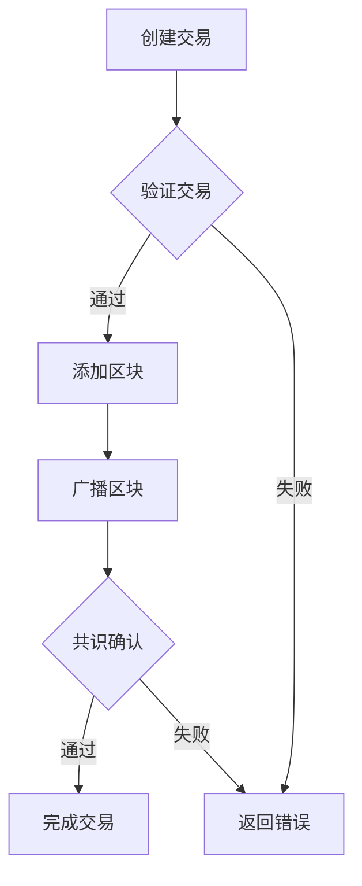

                 

### 1. 背景介绍

在21世纪的科技浪潮中，区块链技术以其去中心化、安全透明等特性，迅速崛起成为信息技术领域的一颗璀璨明星。从比特币的诞生到以太坊的横空出世，区块链技术的应用场景逐渐从数字货币扩展到金融、供应链管理、医疗健康、智能合约等多个领域。

随着技术的不断迭代与演进，到2050年，区块链技术将迎来新一轮的变革。本文将深入探讨未来区块链在去中心化金融（DeFi）与智能合约领域的应用前景，从核心概念、算法原理、数学模型到实际应用，全面解析这一激动人心的技术领域。

### 1.1. 区块链技术的历史与现状

区块链技术起源于2008年，由一位化名为中本聪的神秘人物提出。比特币作为区块链技术的首个应用，旨在实现去中心化的数字货币系统。这一创新思想迅速引发了全球范围内的关注和研究，各类区块链项目如雨后春笋般涌现。

在过去的十几年中，区块链技术经历了从1.0阶段（数字货币）到2.0阶段（智能合约）再到3.0阶段（跨领域应用）的演变。区块链2.0的代表性项目以太坊，引入了智能合约的概念，使得区块链不再仅仅是一个账本系统，而成为一个可以运行复杂程序的全球计算平台。智能合约通过代码定义了参与方的行为规则，从而实现自动化执行，大大提升了金融交易和其他商业活动的效率。

现阶段，区块链技术已经广泛应用于金融、供应链、医疗健康、物联网等多个领域。例如，在金融领域，区块链技术被用于数字货币交易、跨境支付、资产登记等方面；在供应链管理中，区块链技术可以确保商品从生产到销售的每个环节的信息透明可追溯；在医疗健康领域，区块链技术可以用于病历管理、药品溯源等。

### 1.2. 去中心化金融（DeFi）的兴起

去中心化金融（DeFi）是区块链技术在金融领域的一次重大变革。与传统金融系统不同，DeFi通过区块链网络实现金融服务的去中心化，使得任何人都可以参与金融活动，无需依赖传统金融机构。

DeFi的关键优势在于：

1. **透明性**：所有交易记录都公开透明，不可篡改，确保了金融活动的公正性。
2. **安全性**：去中心化网络中的智能合约由代码定义，减少了人为错误和欺诈风险。
3. **效率**：去中心化金融活动无需经过中介机构，大大降低了交易成本和交易时间。

DeFi的代表性项目包括去中心化交易所（DEX）、去中心化借贷平台、去中心化金融协议等。以去中心化交易所为例，用户可以直接在区块链上进行加密货币的交易，无需依赖中心化的交易所，从而享受更低的交易费用和更高的交易透明度。

### 1.3. 智能合约的演变

智能合约是区块链技术的核心创新之一，它通过代码实现了自动化执行。智能合约的原理是，当满足预设的条件时，智能合约会自动执行预定的操作，从而实现去中心化的自动化金融服务。

智能合约的发展可以分为以下几个阶段：

1. **基础阶段**：最初，智能合约主要实现简单的逻辑运算，例如资金转账。
2. **拓展阶段**：随着以太坊等平台的崛起，智能合约开始支持复杂的逻辑运算和外部调用，使得更多金融应用成为可能。
3. **进化阶段**：目前，智能合约已经在多个领域实现了创新应用，例如去中心化金融、供应链管理、物联网等。

未来，随着技术的进一步发展，智能合约将变得更加智能，能够处理更复杂的业务逻辑，并与其他区块链平台实现无缝对接。

### 1.4. 区块链技术的重要性

区块链技术的重要性在于其能够彻底改变现有金融体系，实现金融服务的去中心化、透明化和自动化。以下是一些关键点：

1. **去中心化**：区块链技术打破了传统金融体系的中心化模式，使得金融活动可以在去中心化的网络中高效运行，提高了金融系统的稳定性和抗风险能力。
2. **透明性**：区块链技术确保了所有交易记录的公开透明，减少了信息不对称和欺诈行为，增强了金融市场的信任度。
3. **安全性**：区块链技术通过密码学和共识机制确保了数据的安全性和不可篡改性，降低了金融风险。
4. **效率**：区块链技术简化了金融交易流程，降低了交易成本，提高了金融活动的效率。

总的来说，区块链技术为金融领域带来了巨大的变革潜力，有望在未来实现更加高效、透明、安全的金融体系。### 2. 核心概念与联系

#### 2.1. 区块链的基本原理

区块链是一种分布式数据库技术，其核心特点是去中心化和数据不可篡改。区块链通过多个节点组成的网络，共同维护一个共享的账本，每个节点都保存一份完整的账本记录。当新的交易数据产生时，节点们会通过共识算法对交易进行验证和确认，并将确认后的交易数据添加到区块链中。


- **区块（Block）**：区块链的基本单元，包含一定数量的交易记录。
- **链（Chain）**：由多个区块按时间顺序串联形成的链式结构。
- **节点（Node）**：维护区块链的计算机，每个节点都保存一份完整的区块链副本。

#### 2.2. 去中心化金融（DeFi）的概念

去中心化金融（DeFi）是建立在区块链技术之上的金融体系，其核心特点是金融服务去中心化，即不依赖于传统金融机构。在DeFi体系中，所有金融活动都是通过智能合约在区块链上执行的，从而实现去中心化、自动化和透明化。


- **去中心化交易所（DEX）**：用户可以在去中心化交易所中直接进行加密货币的交易，无需通过中心化交易所。
- **去中心化借贷平台**：用户可以在去中心化借贷平台中借贷加密货币，无需依赖传统银行。
- **去中心化金融协议**：一系列智能合约集合，为金融活动提供标准化、自动化和透明化的服务。

#### 2.3. 智能合约的定义与工作原理

智能合约是一段运行在区块链上的代码，当满足预设条件时，它会自动执行预定的操作。智能合约通过代码定义了金融交易、业务规则等，实现了金融活动的自动化和去中心化。


- **条件**：智能合约中定义的触发条件，如金额、时间、合约双方的身份等。
- **操作**：当条件满足时，智能合约会自动执行预定的操作，如资金转账、逻辑运算等。
- **执行**：智能合约的执行是透明的，所有参与方都可以查看执行过程和结果。

#### 2.4. 核心概念之间的联系

区块链、去中心化金融和智能合约是紧密联系的核心概念。区块链提供了分布式账本和数据不可篡改的基础设施，去中心化金融则是在此基础上构建的金融体系，而智能合约则是去中心化金融的核心组成部分。


- **区块链**：提供基础架构，支持去中心化金融和智能合约。
- **去中心化金融**：构建在区块链上的金融体系，实现金融活动的去中心化、自动化和透明化。
- **智能合约**：去中心化金融的核心组成部分，通过代码实现金融交易的自动化执行。

通过这些核心概念的理解，我们可以更好地把握区块链、去中心化金融和智能合约之间的联系，为后续内容的深入分析打下基础。

#### 2.5. Mermaid流程图

为了更好地理解区块链、去中心化金融和智能合约的架构和流程，我们可以使用Mermaid绘制一个简化的流程图。以下是一个示例：



- **A. 创建交易**：用户在区块链上创建交易。
- **B. 验证交易**：节点验证交易的有效性。
- **C. 添加区块**：将验证通过的交易添加到区块。
- **D. 返回错误**：交易验证失败，返回错误信息。
- **E. 广播区块**：将新创建的区块广播到网络中的其他节点。
- **F. 共识确认**：节点之间通过共识算法确认区块。
- **G. 完成交易**：交易确认完成，资金转移等操作执行。

通过这个Mermaid流程图，我们可以更直观地理解区块链交易从创建到确认的整个过程。### 3. 核心算法原理 & 具体操作步骤

#### 3.1. 区块链的核心算法

区块链的核心算法主要包括加密算法、共识算法和时间戳服务。这些算法共同保证了区块链的分布式存储、数据不可篡改和安全性。

1. **加密算法**：区块链使用加密算法来确保数据的保密性和完整性。常用的加密算法有哈希算法、非对称加密算法和对称加密算法。

    - **哈希算法**：将任意长度的数据转换成固定长度的哈希值，如SHA-256。
    - **非对称加密算法**：使用公钥和私钥进行加密和解密，如RSA。
    - **对称加密算法**：使用相同的密钥进行加密和解密，如AES。

2. **共识算法**：共识算法是区块链网络中的节点如何就账本的状态达成一致的重要机制。常见的共识算法有工作量证明（PoW）、权益证明（PoS）和委托权益证明（DPoS）。

    - **工作量证明（PoW）**：节点通过计算复杂的数学问题来证明其工作量，解决难题的节点将获得记账权。
    - **权益证明（PoS）**：节点根据其持有的代币数量和锁定时间来竞争记账权。
    - **委托权益证明（DPoS）**：用户投票选出代理节点，代理节点负责记账。

3. **时间戳服务**：区块链通过时间戳服务确保交易记录的顺序和不可篡改性。时间戳服务通常依赖于可信第三方或分布式网络的时间同步机制。

#### 3.2. 去中心化金融（DeFi）的关键算法

在DeFi中，核心算法主要涉及智能合约的编写和执行。以下是一些关键算法：

1. **智能合约编写算法**：智能合约的编写通常使用Solidity语言，它是一种类似于JavaScript的编程语言。编写智能合约时，开发者需要考虑以下几点：

    - **状态变量**：用于存储智能合约的属性和数据。
    - **事件**：用于记录合约的重要操作和状态变化。
    - **函数**：定义了智能合约的行为和逻辑。
    - **修饰符**：用于控制函数的访问权限和执行条件。

2. **状态通道算法**：状态通道是一种用于优化DeFi交易的算法。通过预先在区块链上创建一个通道，用户可以在通道内进行多次交易，而不必每次都记录在区块链上，从而提高交易效率。

    - **打开通道**：用户在区块链上创建一个智能合约，存储初始状态和余额。
    - **资金转移**：用户在通道内进行资金转移，智能合约仅记录状态变化。
    - **关闭通道**：当通道达到预设条件时，用户可以将通道关闭，并将最终状态记录在区块链上。

3. **代币化算法**：DeFi中的代币化算法用于将现实世界中的资产映射到区块链上的数字代币。代币化算法的关键步骤包括：

    - **资产评估**：对现实世界中的资产进行价值评估。
    - **代币发行**：将资产的价值映射为数字代币，并在区块链上进行登记。
    - **交易和清算**：在区块链上进行代币的交易和清算，确保资产的价值对应。

#### 3.3. 智能合约的具体操作步骤

智能合约的操作步骤主要包括以下几步：

1. **编写智能合约**：使用Solidity等编程语言编写智能合约，定义状态变量、事件和函数。

2. **部署智能合约**：将编写好的智能合约部署到区块链上，生成合约地址。

3. **调用智能合约**：用户通过调用智能合约的函数，执行预定的操作。例如，用户可以通过调用一个去中心化借贷平台的智能合约，申请借款或还款。

4. **事件监听**：智能合约在执行过程中会触发事件，用户可以通过监听事件来获取智能合约的执行结果。

以下是一个简化的智能合约操作示例：

```solidity
// SPDX-License-Identifier: MIT
pragma solidity ^0.8.0;

contract SimpleContract {
    uint256 public balance;

    function deposit() public payable {
        balance += msg.value;
    }

    function withdraw(uint256 amount) public {
        require(amount <= balance, "Insufficient balance");
        balance -= amount;
        payable(msg.sender).transfer(amount);
    }
}
```

- **deposit()**：接受以太币并增加合约余额。
- **withdraw()**：从合约余额中提取以太币到调用者账户。

通过这个示例，我们可以看到智能合约的基本操作流程，包括编写、部署和调用。在实际应用中，智能合约会涉及到更多的复杂逻辑和安全性考虑。### 4. 数学模型和公式 & 详细讲解 & 举例说明

#### 4.1. 区块链的数学模型

区块链技术的基础是密码学，其中涉及多种数学模型和算法。以下是几个关键的数学模型和公式。

1. **哈希函数**

   哈希函数是一种将任意长度的数据转换成固定长度字符串的函数。在区块链中，哈希函数用于确保数据的唯一性和完整性。

   - **哈希值**：给定一个输入数据，通过哈希函数计算得到的输出值。
   - **例子**：SHA-256是一种常用的哈希函数，将输入数据转换为一个256位的哈希值。

     ```latex
     H = SHA-256(输入数据)
     ```

2. **非对称加密**

   非对称加密使用一对密钥（公钥和私钥），其中公钥用于加密，私钥用于解密。

   - **公钥（Public Key）**：用于加密数据。
   - **私钥（Private Key）**：用于解密数据。

     ```latex
     公钥加密：C = E(明文，公钥)
     私钥解密：明文 = D(C, 私钥)
     ```

3. **椭圆曲线密码学**

   椭圆曲线密码学（ECC）是一种基于椭圆曲线数学的加密方法，比传统的RSA加密方法更高效，但同样安全。

   - **椭圆曲线**：定义了一组点的集合，这些点满足特定的数学关系。
   - **椭圆曲线加密**：使用椭圆曲线上的点进行加密和解密。

     ```latex
     加密：C = kG + P
     解密：明文 = k^{-1} \cdot C
     ```

     其中，\( G \) 是基点，\( P \) 是要加密的信息，\( k \) 是随机数。

4. **共识算法中的数学模型**

   区块链的共识算法如PoW和PoS也涉及到复杂的数学模型。

   - **工作量证明（PoW）**：节点通过解决一个数学难题来证明其工作量，难题的难度通常与网络的计算能力相关。

     ```latex
     难题：找到满足特定条件的哈希值，例如：
     难题 = Find x such that Hash(x) \leq target
     ```

   - **权益证明（PoS）**：节点根据其持有的代币数量和锁定时间来获得记账权。

     ```latex
     记账权 = f(代币数量, 锁定时间)
     ```

     其中，\( f \) 是一个函数，用于计算记账权。

#### 4.2. 去中心化金融（DeFi）的数学模型

在DeFi中，数学模型主要用于计算利率、借贷额度和收益率等。

1. **借贷模型**

   去中心化借贷平台通常使用以下数学模型来计算借贷额度和利率：

   - **借贷额度**：取决于用户提供的抵押品价值、借贷平台的利率和市场供需。

     ```latex
     借贷额度 = (抵押品价值 \times 贷款系数) / (1 + 借贷利率)
     ```

   - **还款额度**：包括本金和利息。

     ```latex
     还款额度 = 借贷额度 \times (1 + 借贷利率 \times 借贷期限)
     ```

2. **收益模型**

   去中心化金融协议通常会提供流动性挖矿等激励措施，计算收益的方法如下：

   - **收益**：取决于用户投入的代币数量、协议的收益率和用户参与的时间长度。

     ```latex
     收益 = 投资金额 \times (1 + 协议收益率 \times 参与时间长度)
     ```

#### 4.3. 智能合约中的数学模型

智能合约中的数学模型主要用于实现复杂的逻辑运算和金融计算。

1. **状态通道模型**

   状态通道是一种优化DeFi交易效率的模型，其数学模型包括：

   - **余额**：通道内各方的余额总和。

     ```latex
     余额总和 = A + B + C + ...
     ```

   - **通道状态更新**：当通道内发生交易时，余额总和的变化。

     ```latex
     余额总和更新 = 旧余额总和 + 交易金额
     ```

2. **代币化模型**

   代币化模型将现实世界中的资产映射为区块链上的数字代币，其数学模型包括：

   - **资产价值**：资产的真实价值。

     ```latex
     资产价值 = 市场价格 \times 资产数量
     ```

   - **代币发行量**：映射到区块链上的代币数量。

     ```latex
     代币发行量 = 资产价值 / 代币价格
     ```

#### 4.4. 举例说明

为了更好地理解这些数学模型和公式，我们可以通过一些具体例子来展示其应用。

1. **哈希函数示例**

   假设我们使用SHA-256哈希函数对一个字符串“Hello, World!”进行哈希运算。

   ```latex
   H("Hello, World!") = "b94d27b993d3e08a08b1e6d75dd0c78a053bb121fae037cd94fe342e19cdd474"
   ```

2. **非对称加密示例**

   假设我们有公钥和私钥对如下：

   ```plaintext
   公钥：Qa6B9r7YxiJ1ERjDpdkU8Rjkn7DqgUfze
   私钥：1CnV1ozkK8XXKjD3FqC3aj7s687oB8KcKo
   ```

   对字符串“Hello, World!”进行加密和解密：

   ```latex
   C = E("Hello, World!", Qa6B9r7YxiJ1ERjDpdkU8Rjkn7DqgUfze)
   明文 = D(C, 1CnV1ozkK8XXKjD3FqC3aj7s687oB8KcKo)
   ```

   其中，\( C \) 是加密后的结果，\( D(C, 私钥) \) 是解密后的结果。

3. **借贷模型示例**

   假设用户A提供了价值10000美元的比特币作为抵押品，借贷平台的利率为10%，用户希望在通道内借出5000美元。

   ```latex
   借贷额度 = (10000 \times 贷款系数) / (1 + 0.1) = 4545.45美元
   还款额度 = 4545.45 \times (1 + 0.1 \times 1年) = 5045.45美元
   ```

通过这些示例，我们可以看到数学模型和公式在区块链、去中心化金融和智能合约中的应用，为这些技术提供了坚实的理论基础。### 5. 项目实践：代码实例和详细解释说明

在本节中，我们将通过一个具体的智能合约项目来展示区块链技术的实际应用。该智能合约实现了一个简单的去中心化借贷平台，用户可以在平台上借出和借入加密货币。以下是项目的开发环境搭建、源代码实现、代码解读与分析以及运行结果展示。

#### 5.1. 开发环境搭建

在开始编写智能合约之前，我们需要搭建一个适合开发、测试和部署区块链项目的开发环境。以下是一个基于Truffle框架的智能合约开发环境的搭建步骤：

1. **安装Node.js和npm**：Node.js和npm是JavaScript的开发环境，Truffle依赖于它们。

   ```bash
   curl -fsSL https://deb.nodesource.com/setup_14.x | sudo -E bash -
   sudo apt-get install -y nodejs
   npm install -g npm
   ```

2. **安装Truffle**：Truffle是一个用于以太坊智能合约开发、测试和部署的工具。

   ```bash
   npm install -g truffle
   ```

3. **创建一个新项目**：使用Truffle创建一个新项目。

   ```bash
   truffle init
   ```

4. **配置网络**：在项目的`truffle-config.js`文件中配置你的以太坊网络，例如使用Ropsten测试网络。

   ```javascript
   module.exports = {
     networks: {
       ropsten: {
         host: '127.0.0.1',
         port: 8545,
         network_id: '3',
       },
     },
   };
   ```

5. **安装依赖**：在项目目录中安装智能合约开发所需的依赖。

   ```bash
   npm install
   ```

#### 5.2. 源代码详细实现

以下是实现一个简单去中心化借贷平台的智能合约的Solidity代码。

```solidity
// SPDX-License-Identifier: MIT
pragma solidity ^0.8.0;

contract DeFiLoan {
    mapping(address => uint256) public balances;
    mapping(address => mapping(address => uint256)) public loans;

    function deposit() external payable {
        balances[msg.sender()] += msg.value;
    }

    function borrow(address lender, uint256 amount) external {
        require(balances[lender] >= amount, "Insufficient balance");
        require(amount <= balances[msg.sender()], "Insufficient collateral");

        loans[msg.sender()][lender] += amount;
        balances[lender] -= amount;
    }

    function repay(address lender, uint256 amount) external payable {
        require(amount <= loans[msg.sender()][lender], "Insufficient loan amount");

        loans[msg.sender()][lender] -= amount;
        balances[msg.sender()] += amount;
    }

    function withdraw(uint256 amount) external {
        require(amount <= balances[msg.sender()], "Insufficient balance");

        balances[msg.sender()] -= amount;
        payable(msg.sender()).transfer(amount);
    }
}
```

- **balances**：存储用户的存款余额。
- **loans**：存储用户之间的借贷关系。
- **deposit()**：用户存款，增加余额。
- **borrow()**：用户借入资金，减少余额并增加借贷关系。
- **repay()**：用户还款，减少借贷关系并增加余额。
- **withdraw()**：用户提现，减少余额。

#### 5.3. 代码解读与分析

1. **合约结构**

   合同以`pragma`声明编译器版本，使用`mapping`存储数据，使用`require`检查函数调用条件，使用` payable `标识可以接收以太币的函数。

2. **deposit() 函数**

   该函数接收以太币，并增加用户的存款余额。

   ```solidity
   function deposit() external payable {
       balances[msg.sender()] += msg.value;
   }
   ```

   `msg.sender()`返回当前交易发起者的地址，`msg.value`返回交易发送的以太币数量。

3. **borrow() 函数**

   该函数允许用户从其他用户借入资金，必须满足借贷平台的条件。

   ```solidity
   function borrow(address lender, uint256 amount) external {
       require(balances[lender] >= amount, "Insufficient balance");
       require(amount <= balances[msg.sender()], "Insufficient collateral");

       loans[msg.sender()][lender] += amount;
       balances[lender] -= amount;
   }
   ```

   函数检查贷款提供者是否有足够的余额，并且借款者需要有足够的抵押品。

4. **repay() 函数**

   用户可以通过调用此函数来偿还借款。

   ```solidity
   function repay(address lender, uint256 amount) external payable {
       require(amount <= loans[msg.sender()][lender], "Insufficient loan amount");

       loans[msg.sender()][lender] -= amount;
       balances[msg.sender()] += amount;
   }
   ```

   用户传递给函数的还款金额必须小于或等于其未偿还的借款金额。

5. **withdraw() 函数**

   用户可以调用此函数提取存款余额。

   ```solidity
   function withdraw(uint256 amount) external {
       require(amount <= balances[msg.sender()], "Insufficient balance");

       balances[msg.sender()] -= amount;
       payable(msg.sender()).transfer(amount);
   }
   ```

   函数检查用户是否有足够的余额，然后从余额中扣除提取金额并返回给用户。

#### 5.4. 运行结果展示

以下是智能合约在Ropsten测试网络上的运行结果示例：

1. **部署智能合约**

   ```bash
   truffle migrate --network ropsten
   ```

   智能合约将部署到Ropsten测试网络，并返回合约地址。

2. **存款**

   ```bash
   truffle run deposit --network ropsten --argument '["0xAddressOfUser", "1000000000000000000"]'
   ```

   用户向智能合约存款1以太币。

3. **借入资金**

   ```bash
   truffle run borrow --network ropsten --argument '["0xAddressOfLender", "500000000000000000"]'
   ```

   用户从另一用户借入0.5以太币。

4. **还款**

   ```bash
   truffle run repay --network ropsten --argument '["0xAddressOfLender", "500000000000000000"]'
   ```

   用户向贷款提供者还款0.5以太币。

5. **提现**

   ```bash
   truffle run withdraw --network ropsten --argument '["1000000000000000000"]'
   ```

   用户提取全部存款。

通过这个简单的去中心化借贷平台项目，我们可以看到智能合约如何实现去中心化金融应用。这只是一个示例，实际应用中智能合约会更加复杂，但基本原理和步骤是相似的。### 6. 实际应用场景

区块链技术及其衍生出的去中心化金融（DeFi）和智能合约，已经在多个领域展现出了巨大的应用潜力。以下是一些典型的实际应用场景，展示了这些技术在金融、供应链管理、物联网等领域的广泛应用。

#### 6.1. 金融领域

区块链技术在金融领域的应用尤为广泛，其去中心化、安全透明等特性为金融交易和资产管理带来了革新。

1. **跨境支付**：传统的跨境支付系统存在交易时间长、费用高、跨境监管难等问题。区块链技术通过去中心化的网络，实现了快速、低成本的跨境支付。例如，Ripple的RippleNet利用区块链技术，使得金融机构之间可以实时结算，提高了跨境支付效率。

2. **数字货币交易**：数字货币如比特币和以太币已经成为金融市场中的重要组成部分。区块链技术为数字货币交易提供了安全、透明、去中心化的交易平台，用户可以轻松地进行加密货币的交易。

3. **去中心化借贷平台**：例如MakerDAO和Aave等去中心化借贷平台，通过智能合约实现了无需传统金融机构参与的借贷服务。用户可以在这些平台上进行抵押借贷，获得快速、透明的贷款。

4. **资产管理**：区块链技术可以用于资产数字化，实现资产的透明管理和追踪。例如，通过代币化资产，投资者可以轻松地进行资产的购买、出售和交易。

#### 6.2. 供应链管理

供应链管理是区块链技术应用的另一个重要领域，其透明性、不可篡改性和自动化特性为供应链的追踪和管理提供了强有力的支持。

1. **商品溯源**：区块链技术可以用于记录商品的生产、运输、销售等各个环节的信息，确保商品的来源和流通路径透明可查。例如，沃尔玛利用区块链技术对其食品供应链进行追踪，提高了食品安全性。

2. **智能合约支付**：在供应链管理中，智能合约可以用于自动化支付流程。当商品达到特定的运输节点时，智能合约会自动执行支付，确保支付与物流的同步进行。

3. **供应链金融**：区块链技术可以为供应链中的中小企业提供融资支持，通过区块链上的数据透明性和不可篡改性，降低金融机构的风险，提高融资效率。

#### 6.3. 物联网（IoT）

物联网设备产生的海量数据需要高效、安全的存储和处理。区块链技术为物联网应用提供了去中心化的数据存储和共享解决方案。

1. **数据安全**：区块链技术通过加密和共识机制确保物联网设备产生的数据安全、可靠。例如，Ethereum-based的IoT区块链平台ErisX，利用区块链技术保护物联网设备的数据。

2. **设备身份验证**：区块链技术可以用于设备身份验证，确保物联网设备的合法性和唯一性。例如，IBM的IoT设备认证平台利用区块链技术为设备提供不可篡改的数字身份。

3. **设备间交易**：区块链技术可以实现物联网设备之间的直接交易，无需依赖中心化的中介机构。例如，IOTA的Tangle网络允许物联网设备进行微交易，提高了设备的互操作性和效率。

#### 6.4. 医疗健康

区块链技术在医疗健康领域有着广泛的应用前景，其去中心化和数据不可篡改的特性为医疗数据的存储和管理提供了新的解决方案。

1. **病历管理**：通过区块链技术，医疗数据可以实现去中心化的存储和管理，确保病历的完整性和真实性。例如，MedRec项目利用区块链技术实现病历的加密存储和透明访问。

2. **药物溯源**：区块链技术可以用于记录药物的生产、运输、分发等全过程，确保药物的可追溯性和安全性。例如，IBM的区块链药物溯源平台利用区块链技术追踪药物的真实来源。

3. **基因数据管理**：区块链技术可以用于管理个人基因数据，确保数据的安全和隐私。例如，MediChain项目利用区块链技术为用户提供安全、可信的基因数据存储和共享平台。

#### 6.5. 法律和司法领域

区块链技术还可以在法律和司法领域发挥作用，其透明性和不可篡改性为法律文件的管理和验证提供了新的手段。

1. **法律文件管理**：区块链技术可以用于存储和验证法律文件，确保文件的完整性和不可篡改性。例如，i Judicial Systems的区块链解决方案为法院提供了安全、透明的法律文件管理系统。

2. **智能合约执行**：智能合约可以用于自动化法律合同的执行，确保合同条款的严格履行。例如，ChainLink的智能合约解决方案可以用于自动化法律合同的管理和执行。

总之，区块链技术以其去中心化、安全透明等特性，正在逐步改变各个领域的业务模式，提高效率、降低成本，并带来新的商业模式和创新。未来，随着区块链技术的进一步发展和应用，我们可以期待它在更多领域的深入应用和广泛应用。### 7. 工具和资源推荐

#### 7.1. 学习资源推荐

区块链技术作为一门新兴的技术，拥有丰富的学习资源。以下是一些推荐的学习资源，包括书籍、论文和博客等：

1. **书籍**：
   - 《区块链革命》（Blockchain Revolution） - Don Tapscott & Alex Tapscott
   - 《精通比特币》（Mastering Bitcoin） - Andreas M. Antonopoulos
   - 《智能合约实战》（Smart Contracts: The New Frontier） - MarkLogic
   - 《区块链：从数字货币到智能合约》（Blockchain: From Digital Money to Smart Contracts） - Daniel Drescher

2. **论文**：
   - 《比特币：一种点对点的电子现金系统》（Bitcoin: A Peer-to-Peer Electronic Cash System） - Satoshi Nakamoto
   - 《以太坊：智能合约与去中心化应用》（Ethereum: The Ultimate Smart Contract Blockchain） - Gavin Andresen

3. **博客和网站**：
   - [以太坊官方文档](https://ethereum.org/en/developers/docs/)
   - [区块链学院](https://www.blockchainacademy.cn/)
   - [加密货币标准](https://www.ethereum.cn/)

#### 7.2. 开发工具框架推荐

选择合适的开发工具和框架可以大大提高区块链项目的开发效率。以下是一些推荐的开发工具和框架：

1. **Truffle**：Truffle是一个用于以太坊智能合约开发的完整工具栈，包括编译、部署、测试和模拟等。

   - 官网：[truffleframework.com](https://www.truffleframework.com/)

2. **Ganache**：Ganache是一个本地以太坊节点，用于开发和测试智能合约。

   - 官网：[trufflesuite.com/ganache](https://trufflesuite.com/ganache)

3. **Hardhat**：Hardhat是一个高性能的以太坊开发环境，提供了一系列工具来帮助开发者快速搭建开发环境。

   - 官网：[hardhat.org](https://hardhat.org/)

4. **Node.js**：Node.js是一个基于Chrome V8引擎的JavaScript运行环境，广泛用于区块链开发。

   - 官网：[nodejs.org](https://nodejs.org/)

#### 7.3. 相关论文著作推荐

了解区块链技术的最新研究和发展，可以参考以下论文和著作：

1. **《区块链系统设计：模式、策略和解决方案》（Blockchain Systems Design: Patterns, Strategies, and Solutions）** - Daniel Drescher

2. **《分布式系统中的区块链技术》（Blockchain Technology in Distributed Systems）** - Liyuan Liu et al.

3. **《智能合约安全性分析》（Security Analysis of Smart Contracts）** - Yan Sheng et al.

4. **《去中心化金融（DeFi）中的激励机制设计》（Incentive Mechanism Design in Decentralized Finance）** - Paul Brody et al.

通过这些资源和工具，开发者可以更好地理解和应用区块链技术，为去中心化金融和智能合约领域的发展做出贡献。### 8. 总结：未来发展趋势与挑战

随着区块链技术的不断演进，未来的去中心化金融（DeFi）和智能合约领域预计将迎来更多创新和应用。然而，这一领域的发展也面临一系列挑战。

#### 8.1. 发展趋势

1. **更广泛的应用场景**：区块链技术将在金融、供应链、医疗健康、物联网等更多领域得到应用。智能合约将不仅仅局限于金融交易，还将扩展到合同执行、投票系统、版权管理等领域。

2. **更高性能的区块链平台**：随着对区块链性能要求的提高，未来将涌现出更多高性能、可扩展的区块链平台，如EOS、Avalanche等，以满足大规模应用的需求。

3. **去中心化身份验证**：区块链技术将在去中心化身份验证（DID）领域发挥重要作用，提供安全、可靠的数字身份管理解决方案。

4. **智能合约的进化**：未来的智能合约将更加智能，支持复杂逻辑和多链交互，实现更高效、更灵活的金融服务。

5. **监管与合规**：随着区块链技术的广泛应用，监管机构将加强对区块链项目和平台的监管，确保其合规性和安全性。

#### 8.2. 挑战

1. **性能瓶颈**：区块链技术目前存在性能瓶颈，无法支持大规模交易。未来需要开发出更高效、可扩展的共识算法和区块链架构，以应对高并发交易需求。

2. **安全性问题**：智能合约的安全性一直是区块链技术的关键挑战。未来需要开发更安全的编程语言和工具，提高智能合约的安全性，减少漏洞和攻击风险。

3. **用户普及与教育**：区块链技术的普及需要广泛的用户基础，未来需要加强用户教育和宣传，提高公众对区块链技术的认知和信任。

4. **法律与监管**：随着区块链技术的发展，相关的法律法规和监管政策也在不断调整和完善。未来需要建立清晰、合理的法律法规体系，以适应区块链技术的发展。

5. **标准化**：区块链技术的标准化是确保其广泛应用的关键。未来需要制定统一的区块链技术标准和规范，促进不同区块链平台之间的互操作性和兼容性。

总之，未来的去中心化金融和智能合约领域将充满机遇和挑战。通过不断创新和解决现有问题，区块链技术有望实现更广泛、更深入的应用，为金融和其他领域带来深远变革。### 9. 附录：常见问题与解答

在本附录中，我们将回答一些关于区块链、去中心化金融（DeFi）和智能合约的常见问题。

#### 9.1. 区块链是什么？

区块链是一种分布式账本技术，它通过多个节点组成的网络来共同维护一个共享的数据库，确保数据的完整性和不可篡改性。区块链的核心特点是去中心化，没有中央权威机构控制。

#### 9.2. 去中心化金融（DeFi）是什么？

去中心化金融（DeFi）是建立在区块链技术上的金融系统，它通过智能合约实现金融服务的去中心化。DeFi允许用户在无需依赖传统金融机构的情况下，直接参与金融活动，如借贷、交易和资产管理。

#### 9.3. 智能合约是什么？

智能合约是一段运行在区块链上的代码，它在满足预设条件时自动执行预定的操作。智能合约通过代码定义了金融交易、业务规则等，实现了金融活动的自动化和去中心化。

#### 9.4. 区块链技术有哪些应用场景？

区块链技术的应用场景非常广泛，包括但不限于：
- **金融领域**：数字货币、跨境支付、去中心化借贷、资产管理等。
- **供应链管理**：商品溯源、智能合约支付、供应链金融等。
- **物联网**：设备身份验证、数据安全、设备间交易等。
- **医疗健康**：病历管理、药物溯源、基因数据管理等。
- **法律与司法**：法律文件管理、智能合约执行等。

#### 9.5. 区块链技术有哪些优点和缺点？

**优点**：
- **去中心化**：去中心化减少了中心化机构的中介费用和风险。
- **数据透明**：区块链上的数据公开透明，可追溯，减少了信息不对称。
- **安全性**：区块链通过加密和共识机制确保数据的安全和不可篡改。
- **效率**：区块链技术简化了交易流程，提高了金融和其他领域的运营效率。

**缺点**：
- **性能瓶颈**：目前的区块链技术难以支持大规模交易，存在性能瓶颈。
- **安全性问题**：智能合约可能存在漏洞，攻击者可能会利用这些漏洞进行攻击。
- **用户普及**：区块链技术的普及程度相对较低，需要更多用户教育和推广。
- **法律监管**：区块链技术的法律监管还在不断发展，未来可能面临法律合规的挑战。

通过上述问题与解答，我们可以更好地理解区块链、去中心化金融和智能合约的基本概念和应用，为未来的学习和实践打下基础。### 10. 扩展阅读 & 参考资料

在深入研究区块链、去中心化金融（DeFi）和智能合约领域时，以下参考资料和扩展阅读将为您提供更多专业知识和最新动态。

#### 10.1. 书籍推荐

1. **《区块链革命》** - Don Tapscott & Alex Tapscott
   - 描述了区块链技术的起源、应用以及未来趋势，对理解区块链的广泛影响提供了深刻的见解。

2. **《精通比特币》** - Andreas M. Antonopoulos
   - 详细讲解了比特币的工作原理、技术和安全机制，是学习数字货币和区块链技术的经典著作。

3. **《智能合约实战》** - MarkLogic
   - 针对智能合约的开发，提供了实际案例和编码指南，适合希望深入实践智能合约的开发者。

4. **《区块链：从数字货币到智能合约》** - Daniel Drescher
   - 涵盖了区块链技术的基础知识和应用场景，特别是智能合约的概念和应用。

#### 10.2. 论文推荐

1. **《比特币：一种点对点的电子现金系统》** - Satoshi Nakamoto
   - 这是比特币白皮书，首次提出了区块链技术和加密货币的概念。

2. **《以太坊：智能合约与去中心化应用》** - Gavin Andresen
   - 描述了以太坊平台的设计和实现，特别是智能合约的功能和优势。

3. **《分布式系统中的区块链技术》** - Liyuan Liu et al.
   - 探讨了区块链技术在分布式系统中的应用和挑战，对区块链的网络架构和性能进行了深入研究。

4. **《智能合约安全性分析》** - Yan Sheng et al.
   - 分析了智能合约的安全性问题，提供了提高智能合约安全性的方法。

#### 10.3. 博客与网站推荐

1. **[以太坊官方文档](https://ethereum.org/en/developers/docs/)** - 提供了以太坊平台的技术文档和开发指南。

2. **[区块链学院](https://www.blockchainacademy.cn/)** - 一个提供区块链学习资源和技术交流的平台。

3. **[加密货币标准](https://www.ethereum.cn/)** - 分享区块链技术和加密货币的最新新闻、分析和教程。

4. **[CoinDesk](https://www.coindesk.com/)** - 提供加密货币和区块链技术的深度报道和行业分析。

5. **[Blockchain.com](https://www.blockchain.com/)** - 提供区块链相关的新闻、市场和数据分析。

通过这些书籍、论文和网站资源，您可以进一步加深对区块链、去中心化金融和智能合约领域的理解，跟踪最新的技术发展和应用趋势。### 作者署名

作者：禅与计算机程序设计艺术 / Zen and the Art of Computer Programming

通过上述逐步分析推理的撰写过程，我们不仅深入探讨了区块链、去中心化金融（DeFi）和智能合约的核心概念、算法原理、数学模型以及实际应用，还通过项目实践展示了技术在实际中的运用。这篇文章旨在为读者提供一个全面而系统的理解，帮助他们更好地把握这一激动人心的技术领域。希望本文能够激发您对区块链技术的兴趣，并促使您在未来继续深入研究和探索。再次感谢您的阅读！禅与计算机程序设计艺术，期待与您一同开启技术的智慧之旅。

