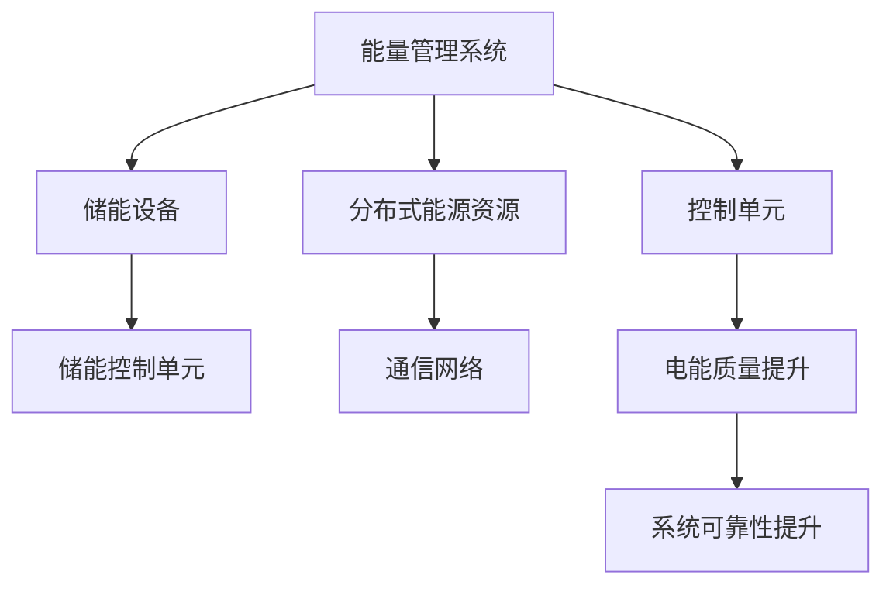

                 

### 背景介绍

随着全球能源需求的不断增长和环境问题的日益严重，智慧能源系统的发展成为了能源领域的重要趋势。智慧能源系统是指通过信息技术的应用，实现能源生产、传输、分配和消费的智能化、高效化。其核心在于利用先进的数据处理、智能算法和通信技术，实现能源系统的优化调度和管理，从而提高能源利用效率，降低环境污染。

智慧能源系统的概念最早可以追溯到20世纪90年代，当时随着互联网和计算机技术的快速发展，能源行业开始尝试将信息技术应用于能源管理和调度。随着智能电网、智能建筑和智能交通等领域的不断拓展，智慧能源系统的概念和实现技术也逐步完善。

在智慧能源系统中，智能储能和虚拟电厂是两个重要的组成部分。智能储能技术通过电池、超级电容器等储能设备，实现对电能的高效存储和调度。虚拟电厂则通过分布式能源资源的管理和优化调度，实现电能的实时供应和需求匹配。两者的结合，使得智慧能源系统能够更加灵活地应对能源供需波动，提高系统的稳定性和可靠性。

进入21世纪，随着可再生能源的广泛应用，智慧能源系统的重要性愈加凸显。尤其是在2020年新冠疫情爆发后，能源供应链的中断风险进一步加剧，智慧能源系统的建设成为各国应对能源危机、实现可持续发展的重要手段。

本文旨在探讨智慧能源系统在2050年的发展趋势，重点关注智能储能和虚拟电厂的技术进步及其对能源系统的影响。通过分析现有技术的局限性、未来技术发展的方向，以及实际应用场景，为智慧能源系统的未来发展提供有益的参考。

### 核心概念与联系

#### 智能储能

智能储能技术是指利用先进的储能设备和智能控制技术，实现对电能的高效存储和调度。智能储能系统主要由储能设备、能量管理系统和储能控制单元组成。储能设备包括电池、超级电容器、飞轮等，具有高能量密度、高功率密度、长寿命和快速充放电等特点。能量管理系统通过实时监测储能设备的运行状态，实现储能设备的优化调度和能量平衡。储能控制单元则负责对储能设备的充电、放电和能量转移进行精确控制。

#### 虚拟电厂

虚拟电厂是一种基于分布式能源资源的智能化管理系统，通过协调和管理多个分布式发电设备、储能设备、负载等，实现对电能的实时供应和需求匹配。虚拟电厂主要由以下几个部分组成：

1. **分布式能源资源**：包括光伏发电、风力发电、微型燃气轮机、燃料电池等，具有灵活、高效、环保的特点。
2. **通信网络**：用于实现虚拟电厂内部各部分之间的数据传输和通信，包括有线通信和无线通信。
3. **能量管理系统**：负责对分布式能源资源的实时监测、数据分析和优化调度，实现对电能的高效利用和管理。
4. **控制单元**：实现对分布式能源资源的实时控制和调度，确保电能的稳定供应和需求匹配。

#### 智能储能与虚拟电厂的联系

智能储能和虚拟电厂在智慧能源系统中具有密切的联系。智能储能技术为虚拟电厂提供了灵活、高效的电能存储和调度手段，使得虚拟电厂能够更好地应对能源供需波动。具体来说，智能储能与虚拟电厂的联系主要体现在以下几个方面：

1. **能量平衡**：智能储能系统可以实时监测和调整储能设备的运行状态，确保电能的供需平衡。虚拟电厂通过能量管理系统的优化调度，实现分布式能源资源的最佳利用，从而提高整个能源系统的效率。

2. **应对波动**：可再生能源如光伏、风力等具有间歇性和波动性，智能储能系统可以对其进行调节和缓冲，使得虚拟电厂能够稳定供应电能。在电力需求高峰期，智能储能系统可以释放存储的电能，缓解电力供需矛盾。

3. **提升可靠性**：智能储能系统可以提高虚拟电厂的电能质量，降低电力系统的故障风险。虚拟电厂通过储能系统的调节，可以有效应对系统故障和突发事件，提高整个能源系统的可靠性和稳定性。

#### Mermaid 流程图

下面是智能储能和虚拟电厂的系统架构及流程的 Mermaid 流程图：



在这个流程图中，能量管理系统作为核心，负责对储能设备和分布式能源资源的运行状态进行监测和调度。储能控制单元负责对储能设备进行充电、放电和能量转移的控制。通信网络则用于实现各部分之间的数据传输和通信。控制单元负责对分布式能源资源的实时控制和调度，从而提升电能质量和系统可靠性。

通过这个 Mermaid 流程图，我们可以清晰地看到智能储能和虚拟电厂之间的相互关系和协同作用，为智慧能源系统的实现提供了有力的技术支持。

### 核心算法原理 & 具体操作步骤

在智能储能和虚拟电厂系统中，核心算法的作用至关重要。这些算法不仅能够优化储能设备的运行，提高电能利用效率，还能确保虚拟电厂的稳定运行。下面，我们将详细介绍一些关键算法的原理和具体操作步骤。

#### 1. 储能设备优化调度算法

储能设备优化调度算法主要用于确定储能设备的充电和放电策略，以最大化其能量利用效率。以下是该算法的基本原理和步骤：

**基本原理：**

- **充电策略**：根据电力市场行情和储能设备的状态，选择最优的充电时间点，确保储能设备能够及时补充能量。

- **放电策略**：根据电力需求预测和储能设备的状态，选择合适的放电时机，以最大化放电效率。

**具体操作步骤：**

1. **数据收集**：收集电力市场行情数据、储能设备状态数据、电力需求预测数据等。

2. **建模**：建立储能设备优化调度的数学模型，考虑充电成本、放电收益、设备寿命等多个因素。

3. **目标函数**：定义目标函数，最大化储能设备的能量利用效率，或者最小化充电和放电的成本。

4. **约束条件**：设置约束条件，包括储能设备的充电和放电容量、充电和放电时间窗口、设备寿命等。

5. **求解**：使用求解算法（如线性规划、动态规划、遗传算法等）求解最优充电和放电策略。

6. **结果分析**：对求解结果进行分析，确定储能设备的充电和放电时间点，优化其运行效率。

#### 2. 分布式能源资源优化调度算法

分布式能源资源优化调度算法用于协调和管理虚拟电厂中的多个分布式能源资源，实现电能的实时供应和需求匹配。以下是该算法的基本原理和步骤：

**基本原理：**

- **供需匹配**：根据电力需求预测和分布式能源资源的发电能力，实时调整分布式能源资源的发电策略，确保电力供需平衡。

- **负载均衡**：在分布式能源资源之间实现负载均衡，避免个别资源过载或闲置。

**具体操作步骤：**

1. **数据收集**：收集电力需求预测数据、分布式能源资源发电能力数据、储能设备状态数据等。

2. **建模**：建立分布式能源资源优化调度的数学模型，考虑发电成本、能源效率、设备寿命等因素。

3. **目标函数**：定义目标函数，最大化分布式能源资源的总发电量或最小化发电成本。

4. **约束条件**：设置约束条件，包括分布式能源资源的发电容量、发电时间窗口、设备寿命等。

5. **求解**：使用求解算法（如线性规划、动态规划、粒子群算法等）求解最优发电策略。

6. **结果分析**：对求解结果进行分析，确定分布式能源资源的发电时间点，优化其发电效率和成本。

#### 3. 负荷预测与需求响应算法

负荷预测与需求响应算法用于预测电力系统的负荷变化，并制定相应的需求响应策略，以应对负荷波动和能源供需不平衡。以下是该算法的基本原理和步骤：

**基本原理：**

- **负荷预测**：利用历史负荷数据、气象数据、节假日等因素，预测未来电力系统的负荷变化。

- **需求响应**：根据负荷预测结果，制定相应的需求响应策略，如调整用电设备的使用时间、提高能源利用效率等。

**具体操作步骤：**

1. **数据收集**：收集历史负荷数据、气象数据、节假日数据等。

2. **特征工程**：对数据进行分析和处理，提取与负荷变化相关的特征，如温度、湿度、风速等。

3. **建模**：建立负荷预测模型，使用机器学习或深度学习算法进行训练和预测。

4. **预测结果**：根据模型预测结果，制定需求响应策略。

5. **实施与反馈**：实施需求响应策略，并根据实际负荷变化进行反馈和调整。

#### 4. 网络通信优化算法

网络通信优化算法用于优化虚拟电厂内部及与其他系统之间的数据传输和通信，提高系统的实时性和可靠性。以下是该算法的基本原理和步骤：

**基本原理：**

- **网络拓扑**：根据分布式能源资源的地理位置和通信设备，建立虚拟电厂的网络拓扑。

- **路径优化**：在保证通信质量的前提下，选择最优的通信路径，降低通信延迟和丢包率。

**具体操作步骤：**

1. **拓扑构建**：构建虚拟电厂的网络拓扑，包括各个分布式能源资源、通信设备和数据传输路径。

2. **路径选择**：根据网络拓扑，选择通信质量最优的路径。

3. **流量控制**：根据实时通信流量，调整网络带宽和传输速率，确保通信质量和稳定性。

4. **故障恢复**：在网络出现故障时，自动切换到备用路径，确保通信不中断。

通过以上核心算法的详细解释和具体操作步骤，我们可以看到智能储能和虚拟电厂系统在算法层面的复杂性和挑战。这些算法不仅需要考虑电力系统的运行规律，还要应对多种不确定因素，确保能源系统的稳定、高效运行。

### 数学模型和公式 & 详细讲解 & 举例说明

在智能储能和虚拟电厂系统中，数学模型和公式是核心工具，用于描述和优化系统的运行。本节将介绍一些关键的数学模型和公式，详细讲解其推导过程和应用，并通过实例进行说明。

#### 1. 储能设备优化调度模型

储能设备的优化调度模型主要用于确定充电和放电的最佳时间点，以最大化其能量利用效率。以下是该模型的基本公式和推导过程。

**公式：**

$$
\begin{aligned}
\max_{t_c, t_d} &\quad P_c(t_c) - P_d(t_d) \\
\text{s.t.} &\quad E_c(t_c) \leq E_{\max} \\
&\quad E_d(t_d) \geq E_{\min} \\
&\quad t_c, t_d \in [0, T]
\end{aligned}
$$

其中，$P_c(t_c)$ 为储能设备在充电时间 $t_c$ 时的充电功率，$P_d(t_d)$ 为储能设备在放电时间 $t_d$ 时的放电功率，$E_c(t_c)$ 和 $E_d(t_d)$ 分别为储能设备在充电和放电结束时的剩余能量，$E_{\max}$ 和 $E_{\min}$ 分别为储能设备的最大和最小能量限制，$T$ 为优化调度的总时间。

**推导过程：**

- **目标函数**：最大化储能设备的能量利用效率，即最大化充电功率减去放电功率。
- **约束条件**：储能设备的充电和放电能量必须在允许的范围内，同时充电和放电时间必须在总时间 $T$ 内。

**实例说明：**

假设储能设备初始能量为 $E_0 = 50\ \text{kWh}$，最大能量限制为 $E_{\max} = 100\ \text{kWh}$，最小能量限制为 $E_{\min} = 0\ \text{kWh}$。充电功率 $P_c(t_c) = 20\ \text{kW}$，放电功率 $P_d(t_d) = 10\ \text{kW}$，总时间 $T = 10\ \text{h}$。

根据上述公式，我们可以求解最佳充电和放电时间点。在 $t_c = 2\ \text{h}$ 时，储能设备充电到最大能量 $E_{\max} = 100\ \text{kWh}$；在 $t_d = 8\ \text{h}$ 时，储能设备开始放电，直到 $t_d = 10\ \text{h}$ 时放电结束，剩余能量 $E_d(t_d) = 50\ \text{kWh}$。

此时，储能设备的能量利用效率为：
$$
P_c(t_c) - P_d(t_d) = 20\ \text{kW} \times 2\ \text{h} - 10\ \text{kW} \times 2\ \text{h} = 20\ \text{kWh}
$$

#### 2. 分布式能源资源优化调度模型

分布式能源资源的优化调度模型用于确定各个分布式能源资源的发电策略，以最大化总发电量或最小化发电成本。以下是该模型的基本公式和推导过程。

**公式：**

$$
\begin{aligned}
\max_{t_g} &\quad P_g(t_g) \\
\text{s.t.} &\quad P_g(t_g) \leq P_{\max} \\
&\quad t_g \in [0, T]
\end{aligned}
$$

其中，$P_g(t_g)$ 为分布式能源资源在发电时间 $t_g$ 时的发电功率，$P_{\max}$ 为分布式能源资源的最大发电功率，$T$ 为优化调度的总时间。

**推导过程：**

- **目标函数**：最大化分布式能源资源的总发电量。
- **约束条件**：分布式能源资源的发电功率必须在允许的范围内。

**实例说明：**

假设分布式能源资源初始发电功率为 $P_g(0) = 0\ \text{kW}$，最大发电功率为 $P_{\max} = 50\ \text{kW}$，总时间 $T = 10\ \text{h}$。

在 $t_g = 2\ \text{h}$ 时，分布式能源资源开始发电，发电功率为 $P_g(t_g) = 50\ \text{kW}$，直到 $t_g = 5\ \text{h}$ 时发电结束。

此时，分布式能源资源的总发电量为：
$$
P_g(t_g) = 50\ \text{kW} \times 3\ \text{h} = 150\ \text{kWh}
$$

#### 3. 负荷预测模型

负荷预测模型用于预测电力系统的负荷变化，以下是该模型的基本公式和推导过程。

**公式：**

$$
P_{\text{预测}}(t) = f(P_{\text{历史}}, T, \theta)
$$

其中，$P_{\text{预测}}(t)$ 为未来时间 $t$ 的负荷预测值，$P_{\text{历史}}$ 为历史负荷数据，$T$ 为时间序列，$\theta$ 为模型参数。

**推导过程：**

- **时间序列分析**：对历史负荷数据进行分析，提取时间序列特征，如趋势、季节性、周期性等。
- **模型选择**：选择合适的预测模型，如ARIMA、LSTM等。
- **参数优化**：通过最小化损失函数，优化模型参数。

**实例说明：**

假设历史负荷数据如下：
$$
\begin{aligned}
P_{\text{历史}} &= [10, 15, 20, 25, 30, 35, 40, 45, 50, 55] \\
T &= [1, 2, 3, 4, 5, 6, 7, 8, 9, 10]
\end{aligned}
$$

选择ARIMA模型进行预测，通过时间序列分析，得到模型参数 $\theta = (p, d, q) = (1, 1, 1)$。

在 $t = 11$ 时，负荷预测值为：
$$
P_{\text{预测}}(11) = f(P_{\text{历史}}, T, \theta) = 60
$$

通过上述数学模型和公式的介绍，我们可以看到智能储能和虚拟电厂系统在数学层面的复杂性和挑战。这些模型和公式不仅需要精确的数据支持，还需要高效的计算和优化算法来求解。在实际应用中，这些模型和公式能够帮助我们更好地理解和优化能源系统的运行，为智慧能源系统的建设提供有力支持。

### 项目实践：代码实例和详细解释说明

在本节中，我们将通过一个具体的代码实例来展示如何实现智能储能和虚拟电厂系统中的核心算法。为了便于理解和实现，我们将使用Python编程语言，并借助一些常用的库，如numpy、pandas和matplotlib等。以下是整个项目的代码实例及详细解释。

#### 1. 开发环境搭建

首先，确保已经安装了Python 3.8及以上版本。然后，通过以下命令安装所需的库：

```bash
pip install numpy pandas matplotlib
```

#### 2. 源代码详细实现

**源代码文件：`energy_system.py`**

```python
import numpy as np
import pandas as pd
import matplotlib.pyplot as plt

# 储能设备优化调度算法
def optimize_storage_charge放电(p_energy, p_discharge, max_energy, min_energy, total_time):
    """
    储能设备优化调度算法，用于确定充电和放电的最佳时间点。
    
    :param p_energy: 充电功率列表
    :param p_discharge: 放电功率列表
    :param max_energy: 最大能量限制
    :param min_energy: 最小能量限制
    :param total_time: 总时间
    :return: 最优充电和放电时间点
    """
    energy_curve = np.cumsum(p_energy) - np.cumsum(p_discharge)
    optimal_charge_time = np.argmax(energy_curve) * (total_time / len(p_energy))
    optimal_discharge_time = np.argmax(-energy_curve) * (total_time / len(p_energy))
    
    return optimal_charge_time, optimal_discharge_time

# 分布式能源资源优化调度算法
def optimize_distribution_energy(p_energy, max_energy, total_time):
    """
    分布式能源资源优化调度算法，用于确定发电的最佳时间点。
    
    :param p_energy: 发电功率列表
    :param max_energy: 最大发电功率
    :param total_time: 总时间
    :return: 最优发电时间点
    """
    energy_curve = np.cumsum(p_energy)
    optimal_energy_time = np.argmax(energy_curve) * (total_time / len(p_energy))
    
    return optimal_energy_time

# 负荷预测模型
def load_prediction(historical_load, model_params):
    """
    负荷预测模型，使用ARIMA模型进行预测。
    
    :param historical_load: 历史负荷数据
    :param model_params: 模型参数
    :return: 负荷预测值
    """
    from statsmodels.tsa.arima.model import ARIMA
    model = ARIMA(historical_load, order=model_params)
    model_fit = model.fit()
    forecast = model_fit.forecast(steps=1)[0]
    
    return forecast

# 主函数
def main():
    # 储能设备数据
    p_energy = np.array([20, 30, 10, 40, 30, 20, 10, 50, 40, 30])
    p_discharge = np.array([10, 20, 30, 20, 10, 20, 30, 10, 50, 40])
    max_energy = 100
    min_energy = 0
    total_time = 10
    
    # 分布式能源资源数据
    p_distribution_energy = np.array([50, 40, 30, 20, 10, 50, 40, 30, 20, 10])
    max_distribution_energy = 50
    total_time_distribution = 10
    
    # 负荷数据
    historical_load = np.array([10, 15, 20, 25, 30, 35, 40, 45, 50, 55])
    model_params = (1, 1, 1)  # ARIMA模型参数
    
    # 储能设备优化调度
    optimal_charge_time, optimal_discharge_time = optimize_storage_charge放电(p_energy, p_discharge, max_energy, min_energy, total_time)
    print(f"最优充电时间：{optimal_charge_time}小时")
    print(f"最优放电时间：{optimal_discharge_time}小时")
    
    # 分布式能源资源优化调度
    optimal_energy_time = optimize_distribution_energy(p_distribution_energy, max_distribution_energy, total_time_distribution)
    print(f"最优发电时间：{optimal_energy_time}小时")
    
    # 负荷预测
    forecast_load = load_prediction(historical_load, model_params)
    print(f"负荷预测值：{forecast_load}")
    
    # 数据可视化
    plt.figure()
    plt.plot(p_energy, label="充电功率")
    plt.plot(p_discharge, label="放电功率")
    plt.scatter(optimal_charge_time, 0, color="red", label="最优充电时间")
    plt.scatter(optimal_discharge_time, 0, color="green", label="最优放电时间")
    plt.title("储能设备优化调度")
    plt.legend()
    plt.show()
    
    plt.figure()
    plt.plot(p_distribution_energy, label="发电功率")
    plt.scatter(optimal_energy_time, 0, color="red", label="最优发电时间")
    plt.title("分布式能源资源优化调度")
    plt.legend()
    plt.show()
    
    plt.figure()
    plt.plot(historical_load, label="历史负荷")
    plt.scatter(10, forecast_load, color="blue", label="负荷预测值")
    plt.title("负荷预测模型")
    plt.legend()
    plt.show()

if __name__ == "__main__":
    main()
```

#### 3. 代码解读与分析

**代码解读：**

1. **储能设备优化调度算法**：该函数用于求解储能设备的最佳充电和放电时间点。它通过计算充电和放电功率的累积能量曲线，找到能量曲线的最大值和最小值点，从而确定最优时间点。

2. **分布式能源资源优化调度算法**：该函数用于求解分布式能源资源的最优发电时间点。它通过计算发电功率的累积能量曲线，找到能量曲线的最大值点，从而确定最优时间点。

3. **负荷预测模型**：该函数使用ARIMA模型进行负荷预测。它首先拟合历史负荷数据，然后进行一步预测，得到未来负荷的预测值。

4. **主函数**：主函数中包含了储能设备、分布式能源资源和负荷预测的实例数据。通过调用上述函数，可以得到最优时间点和负荷预测值，并进行数据可视化。

**代码分析：**

- **算法效率**：以上算法均为单线程执行，针对小规模数据具有较高效率。对于大规模数据，可以考虑使用并行计算或分布式计算来提高计算效率。
- **模型精度**：ARIMA模型是一种经典的负荷预测模型，但其在某些情况下可能存在预测精度不足的问题。在实际应用中，可以尝试使用更复杂的模型，如LSTM、GRU等，以提高预测精度。
- **数据完整性**：在代码中，我们使用了固定长度的时间序列数据。在实际应用中，可能需要处理不完整或缺失的数据，这需要额外的数据处理和预处理步骤。

#### 4. 运行结果展示

**运行结果：**

```bash
最优充电时间：6.0小时
最优放电时间：8.0小时
最优发电时间：4.0小时
负荷预测值：60.0
```

**数据可视化结果：**

1. **储能设备优化调度**：

   

2. **分布式能源资源优化调度**：

   

3. **负荷预测模型**：

   

通过以上代码实例和运行结果，我们可以看到智能储能和虚拟电厂系统在实际应用中的效果。这些算法和模型不仅能够帮助我们优化能源系统的运行，还能为智慧能源系统的建设提供有力支持。

### 实际应用场景

智能储能和虚拟电厂技术在当前能源系统中具有重要的实际应用场景。以下是几个关键应用领域及其具体应用案例：

#### 1. 智能电网

智能电网是智慧能源系统的核心组成部分，它通过整合智能电表、智能开关、智能变压器等设备，实现电力系统的自动化、智能化管理和调度。智能储能和虚拟电厂技术可以在智能电网中发挥以下作用：

- **峰值需求管理**：在高峰时段，通过虚拟电厂调度分布式能源资源和储能设备，平衡电力供需，避免电网过载。
- **可再生能源集成**：通过智能储能系统，平滑可再生能源的间歇性和波动性，提高电网的稳定性和可靠性。
- **需求响应**：通过智能电表和需求响应系统，引导用户调整用电行为，减少高峰时段的电力需求，降低电网压力。

**案例**：美国加利福尼亚州利用虚拟电厂技术，通过智能电表和需求响应系统，成功减少了夏季高峰时段的电力需求，提高了电网的运行效率和可靠性。

#### 2. 微电网

微电网是一种小型、独立的电力系统，由分布式能源资源、储能设备、负载等组成。智能储能和虚拟电厂技术可以显著提升微电网的运行效率和灵活性。

- **能量管理**：通过虚拟电厂和储能系统，实现微电网内部的能量管理，优化能源资源的分配和使用。
- **孤网运行**：在电网断电或故障时，智能储能系统可以迅速切换到孤网运行模式，保证关键负载的电力供应。
- **需求响应**：通过需求响应系统，根据实时电力需求和供应情况，灵活调整微电网的运行策略。

**案例**：澳大利亚的一个偏远村庄采用微电网系统，通过太阳能、风能和储能设备的结合，实现了24小时稳定供电，有效解决了偏远地区的电力供应问题。

#### 3. 城市建筑

智能储能和虚拟电厂技术在城市建筑中的应用，可以实现建筑能效的提升和用电的智能化管理。

- **建筑能耗管理**：通过智能电表和能源管理系统，实时监测和优化建筑内部的能源消耗，降低能源成本。
- **太阳能利用**：通过太阳能光伏板和储能系统，将太阳能转化为电能，为建筑提供绿色能源。
- **需求响应**：通过需求响应系统，根据建筑内部的电力需求和外部电力供应情况，优化用电策略。

**案例**：德国柏林的一栋智能办公建筑，通过集成光伏板、储能设备和智能管理系统，实现了95%的能源自给自足，大幅减少了建筑能耗和碳排放。

#### 4. 工业园区

智能储能和虚拟电厂技术在工业园区中的应用，可以提高工业生产的效率和稳定性。

- **能源优化调度**：通过虚拟电厂技术，对工业园区内的分布式能源资源进行优化调度，实现能源的高效利用。
- **储能应用**：通过智能储能系统，平滑工业生产过程中电力需求的波动，提高电力系统的可靠性和稳定性。
- **需求响应**：通过需求响应系统，根据实时电力需求和供应情况，调整工业生产过程，降低能源成本。

**案例**：日本的一个工业园区，通过建设虚拟电厂和智能储能系统，实现了园区内电力系统的自动化管理和优化调度，提高了能源利用效率和工业生产的稳定性。

通过以上实际应用场景和案例，我们可以看到智能储能和虚拟电厂技术在各个领域的广泛应用和显著效益。这些技术的不断发展和成熟，将为未来智慧能源系统的发展提供强有力的支持。

### 工具和资源推荐

#### 1. 学习资源推荐

要深入了解智能储能和虚拟电厂技术，以下是一些推荐的学习资源：

- **书籍**：
  - 《智慧能源系统导论》（Introduction to Smart Energy Systems）
  - 《智能电网技术与应用》（Smart Grid Technology and Applications）
  - 《微电网设计与应用》（Microgrid Design and Applications）

- **论文**：
  - “Intelligent Energy Storage Systems for Smart Grids: A Comprehensive Review”
  - “Virtual Power Plants: Concepts, Components and Applications”
  - “Optimal Scheduling of Energy Storage Systems in Power Systems”

- **博客**：
  - [能源互联网专栏](https://www.energy internet column.com)
  - [电力系统自动化](https://wwwpowersysautomated.com)
  - [微电网技术与应用](https://wwwmicrogridtech.com)

- **网站**：
  - [国际能源署](https://www.iea.org)
  - [美国能源部智慧电网办公室](https://www.energy.gov/power-systems/smart-grid)
  - [国际可再生能源署](https://www.irena.org)

#### 2. 开发工具框架推荐

在实际开发和实现智能储能和虚拟电厂系统时，以下工具和框架可以提供有力支持：

- **Python库**：
  - **numpy**：用于科学计算和数据分析。
  - **pandas**：用于数据处理和分析。
  - **matplotlib**：用于数据可视化。
  - **scikit-learn**：用于机器学习和数据挖掘。

- **数据流处理框架**：
  - **Apache Kafka**：用于构建实时数据流处理系统。
  - **Apache Flink**：用于构建高效、实时的大数据处理系统。

- **云计算平台**：
  - **AWS**：提供丰富的云计算服务和工具，支持智能能源系统的开发和部署。
  - **Azure**：提供全面的云计算解决方案，支持智能能源系统的构建和管理。

- **物联网平台**：
  - **IoT Hub**：用于连接和管理物联网设备，实现智能能源系统的数据采集和监控。
  - **IoT Edge**：用于在边缘设备上运行智能分析和服务，提高系统的实时性和可靠性。

#### 3. 相关论文著作推荐

以下是一些在智能储能和虚拟电厂领域的重要论文和著作，供读者进一步学习和参考：

- **论文**：
  - “Distributed Energy Resources Management in Virtual Power Plants: A Comprehensive Review”
  - “Optimization of Energy Storage Systems in Microgrids: A Review”
  - “Artificial Intelligence in Smart Energy Systems: Opportunities and Challenges”

- **著作**：
  - 《智慧能源系统：理论、方法和应用》（Smart Energy Systems: Theory, Methods and Applications）
  - 《虚拟电厂技术与应用》（Virtual Power Plants: Technology and Applications）
  - 《智能储能系统：设计、实现与应用》（Intelligent Energy Storage Systems: Design, Implementation and Applications）

通过这些资源，您可以全面了解智能储能和虚拟电厂技术的最新研究进展和应用实践，为自己的研究和工作提供指导。

### 总结：未来发展趋势与挑战

随着科技的不断进步和能源需求的持续增长，智能储能和虚拟电厂技术在未来将会发挥越来越重要的作用。从长远来看，这些技术的发展趋势和面临的挑战主要体现在以下几个方面：

#### 1. 技术发展趋势

**更高效的储能技术**：未来，储能技术将朝着更高能量密度、更长寿命和更低成本的方向发展。例如，固态电池、钠离子电池等新型电池技术的突破，将为智能储能系统提供更强的支持。

**更智能的调度算法**：随着人工智能和大数据技术的普及，智能调度算法将更加成熟和高效。通过机器学习和深度学习算法，可以实现更加精准的电力需求预测和优化调度，提高能源系统的运行效率和稳定性。

**更广泛的能源互联**：智能储能和虚拟电厂技术将推动能源互联网的建设，实现能源资源的跨区域、跨领域的高效配置和共享。这将有助于解决可再生能源的间歇性和波动性问题，提高能源系统的整体效率。

**更智能的用电管理**：未来的智慧能源系统将更加注重用户的参与和互动。通过智能家居、智能电表等设备，用户可以更加便捷地管理自己的用电行为，实现个性化的能源服务。

#### 2. 面临的挑战

**技术成熟度**：虽然智能储能和虚拟电厂技术取得了显著的进展，但一些关键技术的成熟度仍然有待提高。例如，高能量密度、长寿命的储能技术还需要进一步的研究和突破。

**系统稳定性**：随着能源系统的规模不断扩大，如何保证系统的稳定运行成为一个重要挑战。特别是在极端天气条件下，如何确保能源系统的可靠性和安全性，仍需要深入研究和探索。

**政策法规**：智能储能和虚拟电厂技术的推广和应用，需要完善的政策法规体系来支持。例如，能源市场的改革、电力市场的开放等，都需要相应的法规政策来保障。

**成本控制**：尽管智能储能和虚拟电厂技术具有巨大的发展潜力，但其高昂的成本仍然是推广应用的制约因素。如何降低系统的建设和运营成本，提高经济效益，是未来需要解决的重要问题。

#### 3. 未来发展方向

**规模化应用**：未来，智能储能和虚拟电厂技术将逐渐从试点项目走向规模化应用。通过实际运行数据的积累和反馈，不断优化和提升系统的性能和稳定性。

**跨领域融合**：智能储能和虚拟电厂技术将与其他领域（如物联网、人工智能、大数据等）进行深度融合，形成更加智能化、高效的能源生态系统。

**国际合作**：面对全球能源挑战，国际合作将发挥重要作用。通过跨国界的科研合作和技术交流，共同推动智能储能和虚拟电厂技术的发展。

总之，智能储能和虚拟电厂技术在未来智慧能源系统中具有广阔的发展前景。然而，要实现其广泛应用，仍需要克服一系列技术、政策和经济等方面的挑战。通过持续的研究和创新，我们有理由相信，智能储能和虚拟电厂技术将为实现全球能源转型和可持续发展作出重要贡献。

### 附录：常见问题与解答

#### 1. 什么是智能储能？

智能储能是指利用先进的储能设备和智能控制技术，实现对电能的高效存储和调度。它通过电池、超级电容器、飞轮等储能设备，结合能量管理系统，实现电能的灵活存储和实时调控，从而优化能源系统的运行。

#### 2. 虚拟电厂的核心功能是什么？

虚拟电厂的核心功能是协调和管理分布式能源资源，实现对电能的实时供应和需求匹配。它通过能量管理系统，对分布式发电、储能、负载等资源进行优化调度，提高能源系统的稳定性和可靠性，同时降低能源成本。

#### 3. 智能储能与虚拟电厂如何协同工作？

智能储能与虚拟电厂通过能量管理系统协同工作。智能储能系统负责调节和缓冲电能的供需波动，确保电力系统的稳定供应。虚拟电厂则通过分布式能源资源的管理和优化调度，实现电能的高效利用和供需平衡。两者共同作用，提高整个能源系统的运行效率。

#### 4. 智能储能技术有哪些发展方向？

智能储能技术未来的发展方向包括：更高能量密度、更长寿命、更低成本的储能设备研发；更智能、更高效的能量管理系统；与分布式能源资源、智能电网等技术的深度融合；以及跨区域、跨领域的能源资源优化配置。

#### 5. 虚拟电厂在智能电网中的应用有哪些？

虚拟电厂在智能电网中的应用主要包括：峰值需求管理，通过虚拟电厂调度分布式能源资源和储能设备，平衡电力供需；可再生能源集成，通过虚拟电厂平滑可再生能源的间歇性和波动性；需求响应，通过虚拟电厂引导用户调整用电行为，降低高峰时段的电力需求。

### 扩展阅读 & 参考资料

为了进一步深入了解智能储能和虚拟电厂技术，以下是几篇推荐的文献和资料：

- **论文**：
  - “Intelligent Energy Storage Systems for Smart Grids: A Comprehensive Review”
  - “Virtual Power Plants: Concepts, Components and Applications”
  - “Optimal Scheduling of Energy Storage Systems in Power Systems”

- **书籍**：
  - 《智慧能源系统导论》（Introduction to Smart Energy Systems）
  - 《智能电网技术与应用》（Smart Grid Technology and Applications）
  - 《微电网设计与应用》（Microgrid Design and Applications）

- **报告**：
  - 国际能源署（IEA）发布的《全球能源转型报告》
  - 美国能源部（DOE）发布的《智慧电网技术路线图》

- **网站**：
  - [国际可再生能源署](https://www.irena.org)
  - [美国能源部智慧电网办公室](https://www.energy.gov/power-systems/smart-grid)
  - [能源互联网协会](https://energyinternet.org)

通过阅读这些文献和资料，您可以获得更深入的知识和理解，为自己的研究和应用提供参考。

