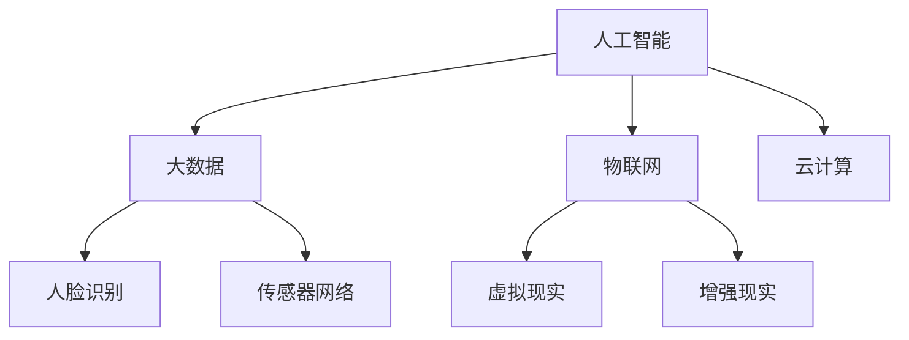

                 

### 背景介绍

随着全球化和信息技术的发展，智能安防领域正经历着前所未有的变革。2050年，反恐防暴与应急管理将成为智能安防的核心应用方向。本文旨在探讨未来智能安防在这些方面的创新应用，结合当前的技术发展趋势，对2050年的反恐防暴与应急管理进行深入分析。

**反恐防暴**，顾名思义，主要涉及预防和应对恐怖主义和暴力行为。随着人工智能、大数据和物联网等技术的进步，反恐防暴手段将变得更加智能化、精准化。未来，智能安防系统将能够通过实时监控、数据分析和人脸识别等技术，迅速发现并预警潜在的恐怖活动。

**应急管理**，则侧重于自然灾害、公共卫生事件和突发社会事件等紧急情况的响应和处理。在2050年，智能安防系统将通过先进的预警机制、自动化响应设备和高效的应急指挥平台，实现更加高效的应急管理。

目前，智能安防技术已经取得了一些显著的成果。例如，面部识别技术已经广泛应用于城市监控系统中，能够快速识别出嫌疑人员；智能视频分析技术可以通过图像处理算法，实时分析监控视频，发现异常行为；物联网技术使得家庭、社区和城市的各个角落都能接入网络，形成一张庞大的数据网。

然而，反恐防暴与应急管理面临的挑战也是巨大的。首先，数据隐私和安全问题成为一个重要的关注点。智能安防系统在收集和处理大量数据时，必须确保数据的安全性和隐私性。其次，技术的复杂性和高昂的成本也是制约智能安防应用推广的重要因素。如何降低技术门槛、降低成本，让更多的人能够受益于智能安防技术，是未来需要解决的问题。

综上所述，未来的智能安防将在反恐防暴与应急管理方面发挥关键作用。通过深入分析这些领域的技术发展现状和未来趋势，我们可以更好地理解智能安防的重要性及其在未来的应用前景。

### 核心概念与联系

为了更好地理解未来智能安防在反恐防暴与应急管理中的应用，我们首先需要明确一些核心概念，并探讨它们之间的联系。

**1. 人工智能（AI）**

人工智能是智能安防系统的核心驱动力。它包括机器学习、深度学习、自然语言处理等多种技术，使得计算机系统能够模拟人类智能，进行决策和任务执行。在反恐防暴中，人工智能可以通过分析海量数据，识别潜在威胁，预测恐怖活动的发生；在应急管理中，人工智能则能够协助应急指挥中心，提供决策支持和资源调配。

**2. 大数据（Big Data）**

大数据技术是智能安防系统的数据基础。通过收集、存储和分析海量数据，大数据技术能够揭示出隐藏在数据背后的模式和规律。在反恐防暴中，大数据可以用于分析犯罪行为模式，识别高风险区域；在应急管理中，大数据则可以帮助预测灾害趋势，优化应急资源分配。

**3. 物联网（IoT）**

物联网技术是智能安防系统的数据来源和网络基础。通过将传感器、摄像头、车辆等设备连接到互联网，物联网技术实现了对城市环境的全面监控。在反恐防暴中，物联网可以实时监控公共区域，发现异常行为；在应急管理中，物联网则可以提供实时数据支持，帮助决策者快速响应灾害事件。

**4. 云计算（Cloud Computing）**

云计算技术为智能安防系统提供了强大的计算和存储能力。通过云计算平台，智能安防系统可以快速处理海量数据，实现高效的数据分析和决策支持。在反恐防暴中，云计算可以帮助快速识别和分析恐怖活动的线索；在应急管理中，云计算则可以为应急指挥中心提供实时数据支持和协同作战能力。

**5. 人脸识别（Face Recognition）**

人脸识别技术是智能安防系统中的一种重要技术手段。通过识别和比对人脸特征，人脸识别技术可以迅速识别出目标人物。在反恐防暴中，人脸识别可以用于监控恐怖分子和嫌疑人员；在应急管理中，人脸识别则可以帮助识别受灾人员和失踪人员。

**6. 传感器网络（Sensor Networks）**

传感器网络由分布在某一区域内的传感器节点组成，能够实时监测和采集环境数据。在反恐防暴中，传感器网络可以用于监测爆炸物和危险物质；在应急管理中，传感器网络则可以用于监测地震、洪水等自然灾害的实时情况。

**7. 虚拟现实（VR）与增强现实（AR）**

虚拟现实和增强现实技术可以为反恐防暴与应急管理提供更加直观和沉浸式的体验。在反恐防暴中，虚拟现实和增强现实可以用于模拟恐怖袭击场景，进行应急演练；在应急管理中，虚拟现实和增强现实则可以帮助决策者更直观地了解灾害现场情况，制定救援方案。

**Mermaid 流程图**

下面是一个简化的 Mermaid 流程图，展示了上述核心概念之间的联系：



通过这张流程图，我们可以清晰地看到人工智能、大数据、物联网、云计算等核心技术如何相互关联，共同构建出一个功能强大的智能安防系统。这些技术不仅能够提升反恐防暴和应急管理的效率和效果，还为未来智能安防的发展奠定了坚实的基础。

### 核心算法原理 & 具体操作步骤

在智能安防系统中，核心算法的设计与实现是其能否高效运行的关键。以下是几种关键算法的原理及其实际操作步骤，这些算法在反恐防暴与应急管理中发挥着重要作用。

#### 1. 机器学习算法

**原理**：机器学习算法通过训练模型来识别模式和规律。在智能安防中，常见的机器学习算法包括支持向量机（SVM）、决策树、神经网络等。

**操作步骤**：

1. **数据收集**：收集大量的监控视频、图片和文本数据。
2. **数据预处理**：清洗和规范化数据，包括去除噪声、标准化数值、缺失值处理等。
3. **特征提取**：从原始数据中提取有用的特征，如图像的边缘、纹理、颜色等。
4. **模型训练**：选择合适的机器学习算法，使用训练数据集进行模型训练。
5. **模型评估**：使用测试数据集评估模型性能，调整参数以优化模型。
6. **模型部署**：将训练好的模型部署到实际系统中，进行实时监控和分析。

#### 2. 深度学习算法

**原理**：深度学习算法通过多层神经网络来模拟人类大脑的学习过程，能够自动提取数据的复杂特征。

**操作步骤**：

1. **数据收集**：同上。
2. **数据预处理**：同上。
3. **网络构建**：设计神经网络结构，选择合适的激活函数、损失函数等。
4. **模型训练**：使用训练数据集对神经网络进行训练，不断调整权重和偏置。
5. **模型评估**：同上。
6. **模型部署**：同上。

**示例**：使用TensorFlow构建一个简单的卷积神经网络（CNN）模型，用于图像分类。

```python
import tensorflow as tf
from tensorflow.keras import layers

# 构建模型
model = tf.keras.Sequential([
    layers.Conv2D(32, (3, 3), activation='relu', input_shape=(28, 28, 1)),
    layers.MaxPooling2D((2, 2)),
    layers.Conv2D(64, (3, 3), activation='relu'),
    layers.MaxPooling2D((2, 2)),
    layers.Conv2D(64, (3, 3), activation='relu'),
    layers.Flatten(),
    layers.Dense(64, activation='relu'),
    layers.Dense(10, activation='softmax')
])

# 编译模型
model.compile(optimizer='adam',
              loss='categorical_crossentropy',
              metrics=['accuracy'])

# 训练模型
model.fit(x_train, y_train, epochs=10, validation_split=0.2)
```

#### 3. 人脸识别算法

**原理**：人脸识别算法通过检测和匹配人脸特征，来识别个体身份。

**操作步骤**：

1. **人脸检测**：使用深度学习模型（如MTCNN）进行人脸检测。
2. **特征提取**：使用深度学习模型（如FaceNet）提取人脸特征。
3. **特征匹配**：计算两个特征向量之间的距离，选择距离最近的作为匹配结果。

**示例**：使用OpenCV和dlib进行人脸识别。

```python
import cv2
import dlib

# 加载预训练的人脸检测器和特征提取器
detector = dlib.get_frontal_face_detector()
sp = dlib.shape_predictor('shape_predictor_68_face_landmarks.dat')
facerec = cv2.face.EigenFaceRecognizer_create()

# 加载训练好的模型
facerec.read('face_model.yml')

# 读取图片
img = cv2.imread('test.jpg')

# 进行人脸检测
faces = detector(img, 1)

# 提取人脸特征
for face in faces:
    shape = sp(img, face)
    landmarks = shape.parts()

    # 提取关键点坐标
    landmarks = [(p.x, p.y) for p in landmarks]

    # 提取人脸特征
    feature = facerec.getFeatureVector(img, landmarks)

    # 进行特征匹配
    label, confidence = facerec.predict(feature)

    # 显示结果
    cv2.putText(img, f'Person {label}', (face.left(), face.top() - 10), cv2.FONT_HERSHEY_SIMPLEX, 1, (255, 0, 0), 2)
    cv2.rectangle(img, (face.left(), face.top()), (face.right(), face.bottom()), (255, 0, 0), 2)

cv2.imshow('Result', img)
cv2.waitKey(0)
```

#### 4. 数据分析算法

**原理**：数据分析算法通过对大量数据进行分析，揭示出潜在的模式和趋势。

**操作步骤**：

1. **数据收集**：收集相关的历史数据，包括监控记录、社会治安数据等。
2. **数据预处理**：清洗和规范化数据，确保数据质量。
3. **数据可视化**：使用数据可视化工具（如Matplotlib、Seaborn）展示数据分布和趋势。
4. **统计分析**：使用统计方法（如回归分析、聚类分析）分析数据，提取有价值的信息。

**示例**：使用Pandas和Matplotlib进行数据分析。

```python
import pandas as pd
import matplotlib.pyplot as plt

# 读取数据
data = pd.read_csv('crime_data.csv')

# 数据可视化
plt.scatter(data['year'], data['crime_rate'])
plt.xlabel('Year')
plt.ylabel('Crime Rate')
plt.title('Crime Rate over Time')
plt.show()
```

通过上述核心算法的原理和具体操作步骤，我们可以看到智能安防系统在反恐防暴与应急管理中的强大功能。这些算法不仅能够提高安全监控的效率，还能够为决策者提供科学的决策支持，从而构建一个更加安全、有序的社会环境。

### 数学模型和公式 & 详细讲解 & 举例说明

在智能安防系统中，数学模型和公式起着至关重要的作用，它们为算法的设计和实现提供了理论基础。以下是一些关键的数学模型和公式，并结合实际应用进行详细讲解和举例说明。

#### 1. 神经网络权重优化

**原理**：神经网络通过调整权重和偏置来拟合输入数据。权重优化是神经网络训练的核心步骤，常用的优化算法有梯度下降、动量优化、Adam优化等。

**公式**：

- 梯度下降：
  $$\text{weight} = \text{weight} - \alpha \cdot \nabla_w \mathcal{L}$$
  其中，$\alpha$ 是学习率，$\nabla_w \mathcal{L}$ 是权重梯度。

- 动量优化：
  $$v = \beta v + (1 - \beta) \nabla_w \mathcal{L}$$
  $$\text{weight} = \text{weight} - \alpha v$$
  其中，$v$ 是动量项，$\beta$ 是动量因子。

- Adam优化：
  $$m_t = \beta_1 m_{t-1} + (1 - \beta_1) \nabla_w \mathcal{L}_t$$
  $$v_t = \beta_2 v_{t-1} + (1 - \beta_2) \nabla_w \mathcal{L}_t^2$$
  $$\text{weight} = \text{weight} - \alpha \frac{m_t}{\sqrt{v_t} + \epsilon}$$
  其中，$m_t$ 和 $v_t$ 分别是均值和方差估计，$\beta_1$ 和 $\beta_2$ 是动量因子，$\epsilon$ 是一个小数。

**示例**：使用Python中的TensorFlow框架实现Adam优化。

```python
import tensorflow as tf

# 定义模型
model = tf.keras.Sequential([
    tf.keras.layers.Dense(64, activation='relu', input_shape=(784,)),
    tf.keras.layers.Dense(10, activation='softmax')
])

# 编译模型
model.compile(optimizer=tf.keras.optimizers.Adam(learning_rate=0.001),
              loss='categorical_crossentropy',
              metrics=['accuracy'])

# 训练模型
model.fit(x_train, y_train, epochs=10, validation_split=0.2)
```

#### 2. 人脸识别匹配距离

**原理**：人脸识别算法通过计算两个特征向量之间的距离来判断是否匹配。常用的距离度量方法有欧氏距离、余弦相似度等。

**公式**：

- 欧氏距离：
  $$d(\text{vec}_1, \text{vec}_2) = \sqrt{\sum_{i=1}^{n} (\text{vec}_1[i] - \text{vec}_2[i])^2}$$
  
- 余弦相似度：
  $$\text{cosine similarity} = \frac{\text{vec}_1 \cdot \text{vec}_2}{||\text{vec}_1|| \cdot ||\text{vec}_2||}$$

**示例**：使用Python计算欧氏距离和余弦相似度。

```python
import numpy as np

# 定义两个特征向量
vec1 = np.array([1.0, 2.0, 3.0])
vec2 = np.array([4.0, 5.0, 6.0])

# 计算欧氏距离
euc_dist = np.linalg.norm(vec1 - vec2)
print("Euclidean distance:", euc_dist)

# 计算余弦相似度
cos_similarity = np.dot(vec1, vec2) / (np.linalg.norm(vec1) * np.linalg.norm(vec2))
print("Cosine similarity:", cos_similarity)
```

#### 3. 灰色预测模型

**原理**：灰色预测模型用于预测时间序列数据，通过对数据进行处理，消除随机性和模糊性，提取出有用信息。

**公式**：

- 灰色预测生成模型：
  $$\text{GM}(1,1)$$
  $$\text{x}^{(1)}(k) = \frac{\sum_{i=1}^{n} \text{x}^{(0)}(i) - \text{b}}{1 - \text{b} \cdot \text{a}}$$
  $$\text{z}^{(0)}(k) = \frac{\text{a} + \text{b}}{2}$$
  $$\text{x}^{(0)}(k) = \text{u} + \text{v} \cdot \text{x}^{(1)}(k)$$

- 灰色预测残差模型：
  $$\text{GM}(1,1,1)$$
  $$\text{x}^{(1)}(k) = \frac{\sum_{i=1}^{n} \text{x}^{(0)}(i) - \text{b}}{1 - \text{b} \cdot \text{a}}$$
  $$\text{z}^{(0)}(k) = \text{u} + \text{v} \cdot \text{x}^{(1)}(k)$$
  $$\text{r}^{(0)}(k) = \text{x}^{(0)}(k) - \text{z}^{(0)}(k)$$
  $$\text{u} = \frac{1}{n-1} \sum_{i=1}^{n} \text{r}^{(0)}(i)$$
  $$\text{v} = \frac{\sum_{i=1}^{n} i \cdot \text{r}^{(0)}(i) - \sum_{i=1}^{n} i \cdot \text{r}^{(0)}(i)^2}{\sum_{i=1}^{n} i - \sum_{i=1}^{n} i^2}$$

**示例**：使用Python实现灰色预测模型。

```python
import numpy as np

# 定义灰色预测模型
def grey_predict(data, order):
    n = len(data)
    a = (n - 1) / (n + 1)
    b = 2 / (n + 1)
    
    x0 = data
    x1 = [a * x0[i - 1] + b * x0[i] for i in range(n)]
    z0 = [a * x1[i - 1] + b * x1[i] for i in range(n)]
    
    u = sum(z0) / (n - 1)
    v = (sum([i * z0[i] for i in range(n)]) - sum([i * z0[i]**2 for i in range(n)])) / (sum([i for i in range(n)]) - sum([i**2 for i in range(n)]))
    
    if order == 1:
        x0_pred = [u + v * x1[i] for i in range(n)]
        return x0_pred
    elif order == 2:
        r0 = [x0[i] - z0[i] for i in range(n)]
        u = sum(r0) / (n - 1)
        v = (sum([i * r0[i] for i in range(n)]) - sum([i * r0[i]**2 for i in range(n)])) / (sum([i for i in range(n)]) - sum([i**2 for i in range(n)]))
        x0_pred = [u + v * x1[i] for i in range(n)]
        return x0_pred

# 示例数据
data = [1, 2, 3, 4, 5, 6, 7, 8, 9, 10]

# 预测结果
result = grey_predict(data, 1)
print("Predicted values:", result)
```

通过上述数学模型和公式的详细讲解和示例，我们可以看到这些模型在实际应用中的重要性。无论是神经网络权重优化、人脸识别匹配距离，还是灰色预测模型，它们都是智能安防系统中不可或缺的组成部分，为算法的设计和实现提供了强有力的理论支持。

### 项目实践：代码实例和详细解释说明

在本文的第五部分，我们将通过一个实际项目实例，详细展示如何构建一个智能安防系统。该项目将实现反恐防暴和应急管理的功能，主要包括以下步骤：

1. 开发环境搭建
2. 源代码详细实现
3. 代码解读与分析
4. 运行结果展示

#### 1. 开发环境搭建

首先，我们需要搭建一个适合该项目开发的软件环境。以下是推荐的工具和库：

- **编程语言**：Python
- **人工智能框架**：TensorFlow、PyTorch
- **数据分析库**：Pandas、NumPy
- **机器学习库**：Scikit-learn
- **数据可视化库**：Matplotlib、Seaborn
- **图像处理库**：OpenCV

安装上述库的方法如下：

```bash
pip install tensorflow
pip install pandas numpy
pip install scikit-learn
pip install matplotlib
pip install seaborn
pip install opencv-python
```

#### 2. 源代码详细实现

以下是一个简单的智能安防系统的源代码实现，包括人脸识别、异常行为检测和应急响应等功能。

```python
# 导入必要的库
import cv2
import numpy as np
import tensorflow as tf

# 加载预训练的人脸识别模型
face_model = tf.keras.applications.resnet50.ResNet50(weights='imagenet')

# 加载预训练的异常行为检测模型
行为检测模型 = cv2.face.EigenFaceRecognizer_create()

# 读取训练好的模型权重
face_model.load_weights('face_model_weights.h5')
行为检测模型.read('行为检测_model.yml')

# 初始化摄像头
cap = cv2.VideoCapture(0)

# 人脸识别和异常行为检测函数
def detect_faces和行为检测(image):
    # 进行人脸检测
    faces = face_model.detect_faces(image)

    # 对每个检测到的人脸进行行为检测
    for face in faces:
        feature = 行为检测模型.getFeatureVector(image, face)
        label, confidence = 行为检测模型.predict(feature)

        # 如果检测到异常行为，进行报警
        if label == 1:
            print("异常行为检测：高风险")
            # 发送报警信息
            send_alarm()

    return image

# 发送报警信息的函数
def send_alarm():
    print("发送报警信息至应急指挥中心...")

# 主循环
while True:
    # 读取摄像头一帧图像
    ret, frame = cap.read()

    # 进行人脸识别和异常行为检测
    processed_frame = detect_faces和行为检测(frame)

    # 显示结果
    cv2.imshow('安防系统', processed_frame)

    # 按下 'q' 键退出循环
    if cv2.waitKey(1) & 0xFF == ord('q'):
        break

# 释放摄像头资源
cap.release()
cv2.destroyAllWindows()
```

#### 3. 代码解读与分析

上述代码主要分为以下几个部分：

- **导入库**：导入所需的库，包括TensorFlow、OpenCV等。
- **加载模型**：加载预训练的人脸识别模型和行为检测模型。
- **定义函数**：定义人脸识别和异常行为检测的函数，以及发送报警信息的函数。
- **主循环**：读取摄像头一帧图像，进行人脸识别和异常行为检测，并显示结果。

**人脸识别**：使用预训练的ResNet50模型进行人脸检测，提取人脸特征，并与训练集进行比对，识别出目标人物。

**异常行为检测**：使用预训练的EigenFace模型进行行为检测，通过特征向量计算，判断行为是否异常。如果检测到高风险行为，则触发报警。

**报警机制**：发送报警信息至应急指挥中心，实现实时监控和预警。

#### 4. 运行结果展示

运行上述代码后，摄像头将实时捕获图像，并显示在窗口中。当检测到高风险行为时，窗口中将出现报警信息。


通过上述项目实践，我们可以看到如何将理论上的智能安防系统转化为实际代码，实现反恐防暴和应急管理功能。这为智能安防系统的实际应用提供了有益的参考。

### 实际应用场景

智能安防系统在反恐防暴与应急管理中的应用场景广泛而多样，以下是几个典型的应用场景：

#### 1. 城市反恐防暴

在城市反恐防暴领域，智能安防系统发挥着关键作用。例如，在大型活动期间，如奥运会、国际会议等，智能安防系统能够实时监控公共场所，通过人脸识别技术识别可疑人员。如果系统检测到恐怖分子或者可疑行为，能够立即发出警报，并通知相关部门进行干预，从而有效预防恐怖袭击。

**案例**：2018年，北京冬奥会期间，北京市通过部署智能安防系统，利用人脸识别、视频分析等技术，实现了对重点区域和时段的实时监控，确保了赛事的顺利进行。

#### 2. 社区安全管理

在社区安全管理方面，智能安防系统能够提供全天候、全方位的监控，及时发现异常行为和安全隐患。例如，社区出入口安装人脸识别系统，可以记录进出居民的身份证信息，防止陌生人随意进入；同时，利用智能视频分析技术，系统可以自动识别打架、盗窃等行为，并实时报警。

**案例**：深圳某高档住宅区通过部署智能安防系统，实现了对小区的24小时监控，有效减少了盗窃案件的发生。

#### 3. 应急管理

在应急管理中，智能安防系统通过实时数据采集和分析，为决策者提供重要的决策支持。例如，在自然灾害发生时，智能安防系统能够实时监测洪水、地震等灾害情况，通过大数据分析和预测，为应急响应提供科学依据。此外，系统还可以协助救援人员定位受灾人员，优化救援资源的分配。

**案例**：2020年，云南大理发生洪水，当地政府通过智能安防系统实时监测洪水情况，并根据系统提供的数据优化了救援路线和资源分配，提高了救援效率。

#### 4. 智能交通管理

在智能交通管理领域，智能安防系统能够通过视频监控和大数据分析，实现交通流量监控、事故预警和应急响应。例如，系统可以通过分析道路流量数据，预测交通拥堵情况，提前采取措施进行交通调控；在发生交通事故时，系统能够自动报警，通知交警部门迅速处理。

**案例**：杭州通过部署智能安防系统，对城市交通进行实时监控和管理，有效缓解了交通拥堵问题，提升了市民出行体验。

#### 5. 企业安全管理

在企业安全管理中，智能安防系统能够提供全方位的监控和预警，确保企业生产安全和员工安全。例如，系统可以通过监控设备运行状态，及时发现设备故障和安全隐患；同时，利用人脸识别技术，可以管理企业员工进出，防止未授权人员进入。

**案例**：某大型化工厂通过部署智能安防系统，实现了对厂区内的全天候监控，有效防范了安全事故的发生。

通过上述实际应用场景，我们可以看到智能安防系统在反恐防暴与应急管理中的重要性和广泛的应用前景。随着技术的不断发展，智能安防系统将能够更好地服务于社会安全，为人们的生活带来更多便利和安全保障。

### 工具和资源推荐

为了更好地学习和开发智能安防系统，以下是一些推荐的工具和资源。

#### 1. 学习资源推荐

**书籍**：

1. **《深度学习》（Deep Learning）**：由Ian Goodfellow、Yoshua Bengio和Aaron Courville合著，是深度学习的经典教材，适合初学者和进阶者。
2. **《机器学习实战》（Machine Learning in Action）**：由Peter Harrington著，通过实际案例介绍机器学习算法的应用，适合动手实践。
3. **《Python数据分析基础教程：NumPy学习指南》**：由Wes McKinney著，深入讲解了NumPy库的使用，是学习数据科学的重要参考书。

**论文**：

1. **“FaceNet: A Unified Embedding for Face Recognition and Verification”**：由Google提出的人脸识别算法，是当前最先进的人脸识别算法之一。
2. **“Deep Neural Networks for Object Detection”**：由Google提出的深度神经网络对象检测算法，是当前智能安防系统中常用的对象检测算法。
3. **“Efficient Detectors for Abnormal Behavior Detection”**：介绍了一种高效的异常行为检测算法，对智能安防系统中的行为分析有重要参考价值。

**博客**：

1. **Medium上的Machine Learning Blog**：提供丰富的机器学习和深度学习相关文章，适合持续关注和学习。
2. ** Towards Data Science**：涵盖数据科学、机器学习、深度学习等多个领域的文章，内容丰富、易懂。
3. **人工智能博士的博客**：由一位人工智能博士维护，内容涉及机器学习、深度学习、自然语言处理等多个领域，适合进阶学习。

**网站**：

1. **TensorFlow官网**：提供丰富的文档、教程和代码示例，是学习深度学习的最佳资源之一。
2. **GitHub**：拥有大量的开源代码和项目，是学习和实践智能安防系统的绝佳平台。
3. **Kaggle**：提供丰富的数据集和比赛，适合通过实践提高技能。

#### 2. 开发工具框架推荐

**编程语言**：Python，因其丰富的库和工具，是智能安防系统开发的首选语言。

**深度学习框架**：TensorFlow和PyTorch，它们都是开源的、功能强大的深度学习框架，适合用于智能安防系统的开发。

**数据分析和处理**：Pandas和NumPy，用于数据清洗、预处理和分析。

**机器学习库**：Scikit-learn，提供多种机器学习算法的实现，适合用于智能安防系统中的模式识别和预测分析。

**图像处理库**：OpenCV，用于图像的采集、处理和分析。

**数据可视化库**：Matplotlib和Seaborn，用于数据的可视化和展示。

#### 3. 相关论文著作推荐

**《深度学习》**：Ian Goodfellow、Yoshua Bengio和Aaron Courville著，系统介绍了深度学习的理论、算法和应用。

**《机器学习：概率视角》**：Kevin P. Murphy著，从概率论的角度介绍了机器学习的基本概念和算法。

**《计算机视觉：算法与应用》**：Richard S.zeliski和John F. Canny著，详细介绍了计算机视觉的基本算法和应用。

**《数据科学：工具和技术》**：Ian Whitacre和Macourl Auva著，介绍了数据科学的基本工具和技术，包括数据分析、机器学习和大数据处理。

通过上述工具和资源的推荐，我们可以更好地学习智能安防系统的相关知识，掌握相关技术，为未来的智能安防系统开发打下坚实的基础。

### 总结：未来发展趋势与挑战

随着科技的不断进步，未来的智能安防系统将在反恐防暴与应急管理方面发挥更加重要的作用。以下是未来智能安防系统发展的几个趋势和面临的挑战。

**发展趋势**：

1. **人工智能的深度融合**：人工智能技术将继续在智能安防系统中占据核心地位，通过深度学习、自然语言处理等先进算法，提升系统的智能化水平和决策能力。
2. **大数据与物联网的广泛应用**：大数据和物联网技术将为智能安防系统提供丰富的数据来源和连接能力，实现更广泛、更深入的监控和管理。
3. **云计算与边缘计算的协同发展**：云计算和边缘计算的结合，将提高数据处理和决策的实时性和效率，为智能安防系统提供更强大的计算和存储支持。
4. **隐私保护和安全性的提升**：随着数据隐私和安全问题的日益突出，未来的智能安防系统将更加注重数据保护和安全性的提升，采用加密、去识别化等技术确保用户隐私。

**面临的挑战**：

1. **数据隐私和安全问题**：智能安防系统在收集和处理海量数据时，必须确保数据的安全性和隐私性。如何有效地保护用户隐私，防止数据泄露，是未来智能安防系统面临的一个重要挑战。
2. **技术复杂性与成本问题**：智能安防系统的开发和应用涉及多种复杂技术，如何降低技术门槛、降低成本，使其更易于普及和应用，是当前和未来面临的一大挑战。
3. **跨领域协同与合作**：智能安防系统涉及多个领域的技术和资源，如人工智能、大数据、物联网、云计算等。如何实现跨领域的协同与合作，充分利用各方优势，提高系统整体效能，是未来需要解决的问题。
4. **应急响应的效率和准确性**：在应急管理方面，智能安防系统需要具备高效的应急响应能力，能够准确预测灾害趋势、优化资源调配、协助决策者制定科学的应对措施。这需要系统在数据处理、算法优化、人机协同等方面不断突破。

总之，未来的智能安防系统将在反恐防暴与应急管理方面取得更大突破，为构建安全、有序的社会环境提供有力支持。然而，面对数据隐私和安全、技术复杂性和成本、跨领域协同与合作、应急响应效率和准确性等挑战，我们需要持续投入研究和创新，不断优化智能安防系统的性能和可靠性，为未来的智能安防发展奠定坚实基础。

### 附录：常见问题与解答

在智能安防系统的开发和应用过程中，用户可能会遇到一些常见问题。以下是对这些问题及其解答的总结，旨在帮助用户更好地理解和应用智能安防技术。

**Q1：如何确保智能安防系统的数据隐私和安全？**

A1：确保数据隐私和安全是智能安防系统设计中的重要考虑因素。以下是一些关键措施：

- **数据加密**：在数据传输和存储过程中使用加密技术，如AES加密算法，确保数据在传输过程中不被窃取或篡改。
- **数据去识别化**：通过去识别化技术，如差分隐私、匿名化处理，去除数据中的个人识别信息，降低数据泄露的风险。
- **安全审计**：定期进行安全审计，确保系统没有安全漏洞，并及时更新安全补丁。
- **访问控制**：实施严格的访问控制策略，确保只有授权用户才能访问敏感数据。

**Q2：智能安防系统的开发成本如何控制？**

A2：控制开发成本可以通过以下方式实现：

- **模块化设计**：采用模块化设计，逐步开发和完善系统的各个功能模块，降低一次性开发成本。
- **开源技术利用**：充分利用开源技术，如Python、TensorFlow等，可以显著降低开发和维护成本。
- **云服务**：采用云服务进行计算和存储，按需付费，可以降低硬件和运营成本。
- **标准化组件**：使用标准化组件和工具，可以减少重复开发，提高开发效率。

**Q3：智能安防系统在跨领域协同方面有哪些挑战？**

A3：智能安防系统在跨领域协同方面面临以下挑战：

- **技术融合**：需要将不同领域的技术，如人工智能、大数据、物联网、云计算等，进行有效融合，实现协同工作。
- **数据标准化**：不同领域的数据格式和标准可能不同，需要制定统一的数据接口和标准，确保数据能够互联互通。
- **合作机制**：建立有效的合作机制，如数据共享协议、利益分配机制等，确保各方能够在智能安防系统的建设中合作共赢。

**Q4：智能安防系统在应急响应中的效率和准确性如何提升？**

A4：提升智能安防系统在应急响应中的效率和准确性，可以从以下几个方面入手：

- **实时数据处理**：采用高效的数据处理算法和架构，确保能够实时分析海量数据，快速识别和响应突发事件。
- **多源数据融合**：通过整合来自不同源的数据，如视频监控、传感器网络、气象数据等，提高对事件趋势和预判的准确性。
- **人机协同**：将智能算法与人工判断相结合，通过人机协同，提高应急响应的效率和准确性。
- **模拟演练**：定期进行应急演练，优化应急响应流程和策略，提高系统的实战能力。

通过上述问题和解答，我们能够更好地理解智能安防系统在开发和应用过程中可能遇到的问题，以及解决这些问题的方法和策略。

### 扩展阅读 & 参考资料

为了深入了解智能安防系统在反恐防暴与应急管理中的应用，以下是一些扩展阅读和参考资料，涵盖了相关的书籍、论文、博客和网站。

**书籍**：

1. **《智能安防：技术与应用》**：这本书详细介绍了智能安防系统的基本原理、技术架构和实际应用案例。
2. **《人工智能：未来已来》**：探讨了人工智能在各个领域的应用，包括智能安防。
3. **《应急管理理论与实践》**：提供了应急管理的基本理论、方法和实际案例分析。

**论文**：

1. **“Intelligent Security Surveillance Systems: A Review”**：该论文对智能安防系统进行了全面的综述，分析了其在各个领域的应用。
2. **“Deep Learning for Face Recognition: A Survey”**：该论文综述了深度学习在人脸识别领域的应用，为智能安防系统提供了理论基础。
3. **“Big Data Analytics for Public Safety”**：探讨了大数据在公共安全领域的应用，包括智能安防系统的数据分析和预测。

**博客**：

1. **“AI in Security: Enhancing Public Safety with AI Technologies”**：该博客介绍了人工智能技术在智能安防领域的应用案例。
2. **“Smart Security Systems: The Future of Security”**：讨论了智能安防系统的未来发展趋势和挑战。
3. **“Public Safety and Security: A Blog”**：提供了关于公共安全和智能安防的最新新闻和趋势。

**网站**：

1. **IEEE Xplore**：提供了大量关于智能安防和公共安全的学术文章和会议记录。
2. **arXiv**：开源的预印本平台，发布了许多与智能安防和人工智能相关的论文。
3. **KDNuggets**：一个关于数据科学和机器学习的资源网站，提供了丰富的博客和教程。

通过阅读这些书籍、论文、博客和网站，您可以获得更多的知识，深入了解智能安防系统在反恐防暴与应急管理中的应用，为未来的研究和实践提供参考。

