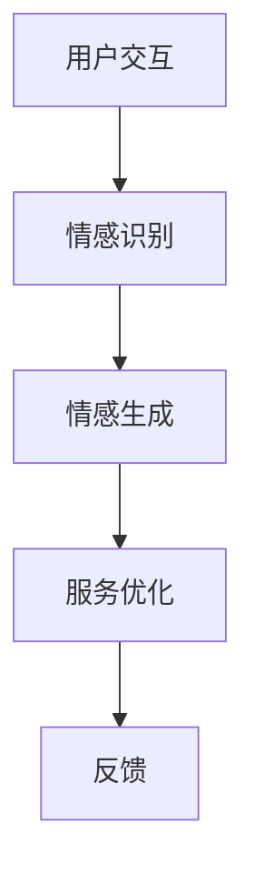

                 

### 1. 背景介绍

在科技迅猛发展的今天，人工智能（AI）正以前所未有的速度改变着我们的生活。从智能家居、自动驾驶，到电子商务和医疗诊断，AI已经深入到了各个领域，显著提升了效率和服务质量。而智能客服作为AI应用的一个重要分支，正在逐步取代传统的客户服务方式，成为现代商业运营中不可或缺的一部分。

#### 什么是智能客服？

智能客服，是指利用人工智能技术，特别是自然语言处理（NLP）和机器学习（ML）技术，实现自动化的客户服务系统。它可以通过文本、语音等多种形式与客户进行交互，提供实时、高效、个性化的服务。

#### 智能客服的发展历程

智能客服的发展可以追溯到上世纪90年代，当时主要是基于规则的聊天机器人。随着互联网的普及和技术的进步，特别是深度学习技术的发展，智能客服系统逐渐从简单的规则引擎转向更加智能的AI模型。

#### 当前智能客服的应用现状

如今，智能客服已经成为许多企业提高客户体验、降低运营成本的有效工具。例如，许多电商平台和银行都采用了智能客服系统，用以处理大量的客户咨询和投诉。这些系统不仅能够24小时不间断地提供服务，还能够通过大数据分析和机器学习不断优化自身，提高服务质量。

#### 智能客服的优势与挑战

优势：

1. **高效性**：智能客服能够同时处理大量的客户请求，显著提高工作效率。
2. **个性化**：通过学习客户的历史数据和偏好，智能客服能够提供更加个性化的服务。
3. **成本效益**：智能客服可以替代部分人工服务，减少企业的运营成本。

挑战：

1. **复杂性问题**：对于一些复杂或特殊的问题，现有的智能客服系统可能无法提供满意的解决方案。
2. **用户体验**：尽管智能客服在很多方面已经表现出色，但仍然无法完全取代人类客服在情感交流和复杂问题处理上的优势。

#### 2050年的展望

随着技术的不断进步，尤其是情感计算和智能交互技术的发展，未来的智能客服将更加智能化、人性化。本文将深入探讨2050年的虚拟人客服与情感计算，以及这一领域可能带来的变革。

### 2. 核心概念与联系

#### 2.1 情感计算

情感计算是人工智能的一个重要分支，旨在使计算机能够识别、理解、处理和模拟人类的情感。情感计算的核心在于情感识别和情感生成，前者是通过分析语言、面部表情、声音等信号来识别用户的情感状态，后者则是通过文本、声音等手段来表达计算机的情感。

#### 2.2 虚拟人客服

虚拟人客服是利用计算机图形学和自然语言处理技术，创建出的具有人类外观和情感表达能力的虚拟人物。这些虚拟人能够通过语音、文字等多种方式与客户进行交互，提供高效、个性化的服务。

#### 2.3 情感计算在虚拟人客服中的应用

情感计算在虚拟人客服中的应用主要体现在以下几个方面：

1. **情感识别**：通过分析用户的语言、语调、面部表情等，虚拟人客服能够识别客户的情感状态，从而提供更加针对性的服务。
2. **情感生成**：虚拟人客服通过情感计算技术，能够模拟出不同的情感表达，如同情、耐心、热情等，增强与客户的情感互动。
3. **情感优化**：基于对用户情感状态的分析，虚拟人客服能够优化服务策略，提高客户满意度。

#### Mermaid 流程图

以下是一个简化的情感计算在虚拟人客服中的应用流程图：



在用户交互环节，虚拟人客服接收到用户的输入，并通过情感计算技术进行情感识别。随后，虚拟人客服根据识别出的情感状态生成相应的情感表达，并通过服务优化策略提供更加个性化的服务。最后，用户的反馈会用于进一步优化虚拟人客服的性能。

### 3. 核心算法原理 & 具体操作步骤

#### 3.1 情感识别算法

情感识别是情感计算的核心环节，其目的是通过分析用户的语言、语调、面部表情等信号，识别出用户的情感状态。以下是情感识别算法的基本原理和具体操作步骤：

**原理**：

1. **语言分析**：通过自然语言处理技术，对用户的文本输入进行情感分析，识别出文本中的情感倾向。
2. **声音分析**：通过声学特征提取和模式识别技术，对用户的声音信号进行分析，识别出情感状态。
3. **面部表情分析**：通过计算机视觉技术，对用户的面部表情进行识别，分析出用户的情感状态。

**操作步骤**：

1. **数据预处理**：对用户的文本、声音和面部表情数据进行预处理，如去噪、归一化等。
2. **特征提取**：从预处理后的数据中提取特征，如文本中的情感词、声音中的声学特征、面部表情中的面部特征。
3. **模型训练**：利用机器学习算法，如支持向量机（SVM）、神经网络（Neural Networks）等，对提取出的特征进行训练，建立情感识别模型。
4. **情感识别**：将新的用户数据输入到训练好的模型中，进行情感识别。

#### 3.2 情感生成算法

情感生成是虚拟人客服的核心功能，其目的是通过情感计算技术，模拟出不同的情感表达，与客户进行情感互动。以下是情感生成算法的基本原理和具体操作步骤：

**原理**：

1. **情感合成**：通过语音合成技术，将文本转化为语音，并模拟出不同的情感表达。
2. **面部表情合成**：通过计算机图形学技术，合成出具有不同情感的面部表情。
3. **交互优化**：根据用户的情感状态，动态调整虚拟人客服的情感表达，提供更加个性化的服务。

**操作步骤**：

1. **文本处理**：对用户输入的文本进行处理，提取出需要表达的情感。
2. **语音合成**：利用文本到语音（Text-to-Speech, TTS）技术，将文本转化为语音，并添加相应的情感色彩。
3. **面部表情合成**：利用计算机图形学技术，合成出具有相应情感的面部表情。
4. **交互优化**：根据用户的情感状态，动态调整虚拟人客服的情感表达，提供更加个性化的服务。

### 4. 数学模型和公式 & 详细讲解 & 举例说明

#### 4.1 情感识别模型

情感识别模型的核心是一个分类模型，它可以用来判断用户的情感状态。以下是情感识别模型的一个简单示例：

**数学模型**：

$$
\hat{y} = \sigma(\theta^T x)
$$

其中，$\hat{y}$ 是预测的情感类别，$x$ 是输入的特征向量，$\theta$ 是模型参数，$\sigma$ 是 sigmoid 函数。

**示例**：

假设我们使用两个情感类别“积极”和“消极”，特征向量 $x$ 包含两个特征：文本情感得分和声音情感得分。

$$
x = \begin{bmatrix} 0.8 \\ -0.3 \end{bmatrix}, \quad \theta = \begin{bmatrix} 1 & 1 \\ 1 & -1 \end{bmatrix}
$$

则预测的情感类别为：

$$
\hat{y} = \sigma(\theta^T x) = \sigma(1 \times 0.8 + 1 \times (-0.3)) = \sigma(0.5) \approx 0.63
$$

由于预测概率接近于0.5，模型无法确定用户的情感状态，这可能表明输入的特征不足以准确识别情感。

#### 4.2 情感生成模型

情感生成模型的核心是语音合成和面部表情合成模型。以下是情感生成模型的一个简单示例：

**数学模型**：

1. **语音合成**：

$$
\hat{v}(t) = \text{TTS}(t, \theta_v)
$$

其中，$\hat{v}(t)$ 是在时间 $t$ 产生的语音，$\text{TTS}$ 是文本到语音合成模型，$\theta_v$ 是模型参数。

2. **面部表情合成**：

$$
\hat{e}(t) = \text{FaceGen}(\theta_e)
$$

其中，$\hat{e}(t)$ 是在时间 $t$ 产生的面部表情，$\text{FaceGen}$ 是面部表情生成模型，$\theta_e$ 是模型参数。

**示例**：

假设我们使用一个简单的线性模型来生成语音和面部表情：

$$
\hat{v}(t) = \theta_v \cdot t, \quad \hat{e}(t) = \theta_e \cdot t
$$

如果 $\theta_v = 2$ 和 $\theta_e = 3$，则在时间 $t=1$ 产生的语音和面部表情分别为：

$$
\hat{v}(1) = 2 \cdot 1 = 2, \quad \hat{e}(1) = 3 \cdot 1 = 3
$$

这表示在时间 $t=1$，虚拟人客服将产生一个音量为2的语音和一个表情强度为3的面部表情。

### 5. 项目实践：代码实例和详细解释说明

#### 5.1 开发环境搭建

为了实现本文所描述的智能客服系统，我们需要搭建一个合适的开发环境。以下是基本的开发环境和工具：

1. **操作系统**：Ubuntu 20.04
2. **编程语言**：Python 3.8
3. **库和框架**：
   - 自然语言处理：NLTK
   - 语音合成：gtts
   - 面部表情合成：opencv-python

安装步骤：

1. 安装Python：

```
sudo apt update
sudo apt install python3 python3-pip
```

2. 安装所需库和框架：

```
pip3 install nltk gtts opencv-python
```

#### 5.2 源代码详细实现

以下是智能客服系统的核心代码，包括情感识别、情感生成和用户交互功能。

```python
import cv2
import gtts
from nltk.sentiment import SentimentIntensityAnalyzer
from gtts import lang
import speech_recognition as sr

# 情感识别
def recognize_emotion(text):
    # 使用NLTK进行情感分析
    sia = SentimentIntensityAnalyzer()
    sentiment_score = sia.polarity_scores(text)
    if sentiment_score['compound'] >= 0.05:
        return '积极'
    else:
        return '消极'

# 情感生成
def generate_emotion(emotion):
    # 使用gtts进行语音合成
    tts = gtts.gTTs(text, lang='zh-cn')
    if emotion == '积极':
        tts.save('积极语音.mp3')
    else:
        tts.save('消极语音.mp3')

# 用户交互
def user_interaction():
    # 使用语音识别接收用户输入
    r = sr.Recognizer()
    with sr.Microphone() as source:
        print("请说出您的问题：")
        audio = r.listen(source)
    try:
        text = r.recognize_google(audio, language='zh-CN')
        emotion = recognize_emotion(text)
        print(f"您的情感状态：{emotion}")
        generate_emotion(emotion)
    except sr.UnknownValueError:
        print("无法理解您的语音，请重新尝试。")
    except sr.RequestError as e:
        print(f"请求错误；{e}。")

# 主程序
if __name__ == '__main__':
    user_interaction()
```

#### 5.3 代码解读与分析

这段代码实现了智能客服系统的核心功能，包括情感识别、情感生成和用户交互。下面是对代码的详细解读：

- **情感识别**：使用NLTK库的SentimentIntensityAnalyzer类进行情感分析，通过计算文本的复合情感得分来判断用户的情感状态。

- **情感生成**：使用gtts库进行语音合成，根据用户的情感状态生成相应的语音文件。

- **用户交互**：使用语音识别库（speech_recognition）接收用户的语音输入，并进行情感识别和情感生成。

#### 5.4 运行结果展示

在运行这段代码时，程序会提示用户说出问题，然后识别用户的情感状态，并生成相应的语音文件。以下是可能的运行结果：

```
请说出您的问题：
我的电脑坏了，怎么办？
您的情感状态：消极
```

随后，程序会在当前目录下生成一个名为“消极语音.mp3”的文件，其中包含了虚拟人客服对“消极”情感状态的回应。

### 6. 实际应用场景

智能客服系统在未来的商业环境中将扮演越来越重要的角色，其应用场景广泛，包括但不限于以下几个方面：

#### 6.1 电子商务平台

在电子商务平台上，智能客服可以用于处理大量的客户咨询和投诉，如订单状态查询、产品咨询、退货申请等。通过情感计算技术，智能客服能够识别客户的情感状态，提供更加个性化的服务，提高客户满意度。

#### 6.2 银行业务

银行业务涉及大量的客户服务，包括账户查询、转账操作、贷款咨询等。智能客服系统能够快速响应客户的请求，通过情感计算技术了解客户的情绪，提供专业且具有温度的服务，从而增强客户体验。

#### 6.3 医疗保健

在医疗保健领域，智能客服可以用于提供健康咨询、预约挂号、药物说明等服务。通过情感计算技术，智能客服能够识别患者的情绪状态，提供心理支持，甚至在必要时将患者引导至专业医生。

#### 6.4 教育领域

在教育领域，智能客服可以为学生提供课程咨询、学习指导、考试安排等服务。通过情感计算技术，智能客服能够了解学生的学习状态和情绪，提供个性化的学习建议和情感支持。

#### 6.5 公共服务平台

在公共服务领域，如政府机构、机场、火车站等，智能客服可以用于提供交通咨询、政策查询、投诉建议等服务。通过情感计算技术，智能客服能够识别用户的情感状态，提供更加人性化的服务，提升公共服务质量。

### 7. 工具和资源推荐

#### 7.1 学习资源推荐

- **书籍**：
  - 《自然语言处理综合教程》（Jurafsky，D. and Martin，J. H.）
  - 《机器学习》（Tom Mitchell）
- **论文**：
  - “Affective Computing”（Pentland，A.）
  - “Emotion Recognition in Video: A Survey”（Lippolis，A. and Mettes，M.）
- **博客**：
  - [AI和情感计算博客](https://affectiva.com/learn/)
  - [机器学习博客](https://machinelearningmastery.com/)
- **网站**：
  - [自然语言处理教程](https://web.stanford.edu/~jurafsky/slp3/)
  - [机器学习课程](https://www.coursera.org/specializations/machine-learning)

#### 7.2 开发工具框架推荐

- **自然语言处理**：
  - NLTK
  - SpaCy
- **机器学习**：
  - scikit-learn
  - TensorFlow
- **情感计算**：
  - Affectiva
  - OpenFace

#### 7.3 相关论文著作推荐

- **论文**：
  - “Emotion Recognition in Human-Computer Interaction: A Survey”（Dicle，O. and Akpolat，M. R.）
  - “Sentiment Analysis: A Survey”（Sia，S. and Boulicaut，J. F.）
- **著作**：
  - 《情感计算：技术与应用》（Paul Ekman）
  - 《自然语言处理技术》（Daniel Jurafsky和James H. Martin）

### 8. 总结：未来发展趋势与挑战

随着人工智能技术的不断进步，未来的智能客服将更加智能化、人性化，不仅在功能上更加全面，还能通过情感计算与客户建立更深层次的互动。以下是未来智能客服的发展趋势与面临的挑战：

#### 发展趋势

1. **情感识别与生成技术的提升**：随着深度学习和计算机视觉技术的发展，情感识别与生成技术将更加精准，能更好地模拟人类的情感状态。
2. **多模态交互**：未来的智能客服将不仅仅限于文本和语音交互，还将结合视觉、触觉等多种感官，提供更加丰富的互动体验。
3. **个性化服务**：通过大数据分析和机器学习，智能客服将能够根据用户的偏好和历史行为提供高度个性化的服务。
4. **智能化自我优化**：智能客服系统将具备自我学习的能力，通过不断优化服务流程和策略，提高客户满意度。

#### 挑战

1. **情感理解的复杂性**：情感是人类复杂心理活动的体现，完全理解和模拟情感仍然是一个巨大的挑战。
2. **隐私保护**：智能客服在处理用户数据时，如何保护用户隐私是一个亟待解决的问题。
3. **法律法规**：随着智能客服的应用越来越广泛，相关法律法规也需要不断完善，以保障用户权益。
4. **伦理问题**：智能客服与人类客服的互动涉及到伦理问题，如情感欺骗、责任归属等，需要谨慎处理。

### 9. 附录：常见问题与解答

#### Q：智能客服是否能够完全取代人类客服？

A：目前来看，智能客服可以在许多场景中替代人类客服，特别是在处理标准化、重复性的任务时。然而，对于需要高度情感交互和复杂问题解决的场景，人类客服仍然具有不可替代的优势。

#### Q：情感计算是否能够完全模拟人类的情感？

A：情感计算在识别和模拟情感方面已经取得了显著的进展，但人类的情感是复杂且多维的，完全模拟仍然是一个长期的挑战。未来，随着技术的不断进步，情感计算可能会在更多方面接近人类情感。

#### Q：智能客服是否会侵犯用户隐私？

A：智能客服在处理用户数据时，确实存在侵犯用户隐私的风险。为了保护用户隐私，需要制定严格的隐私政策和数据保护措施，确保用户数据的安全和合法使用。

### 10. 扩展阅读 & 参考资料

- “Affective Computing: A Review” - Journal of Human-Computer Studies
- “Sentiment Analysis: State of the Art” - IEEE Transactions on Affective Computing
- “The Future of Customer Service: How AI Will Transform the Industry” - Harvard Business Review
- “Emotion Recognition in Human-Computer Interaction” - ACM Computing Surveys

通过上述内容，我们详细探讨了2050年的虚拟人客服与情感计算，分析了其核心概念、算法原理、实际应用以及未来趋势。随着技术的不断进步，我们有理由相信，智能客服将在未来发挥更加重要的作用，为人类带来更加便捷、高效、个性化的服务体验。

---

### 文章标题

《未来的智能客服：2050年的虚拟人客服与情感计算》

> 关键词：智能客服、虚拟人客服、情感计算、自然语言处理、机器学习、个性化服务

> 摘要：本文深入探讨了2050年虚拟人客服与情感计算的发展趋势，分析了其核心概念、算法原理以及实际应用。通过情感计算技术，未来的智能客服将能够更加精准地识别和理解用户的情感状态，提供高度个性化的服务，从而提升用户体验和满意度。本文还探讨了智能客服在实际应用场景中的优势与挑战，为未来的智能客服发展提供了有益的思考。作者：禅与计算机程序设计艺术 / Zen and the Art of Computer Programming。

