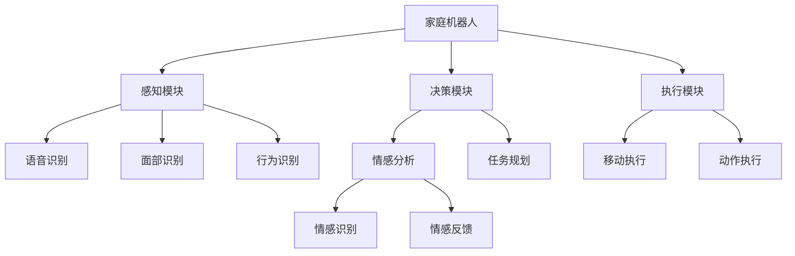
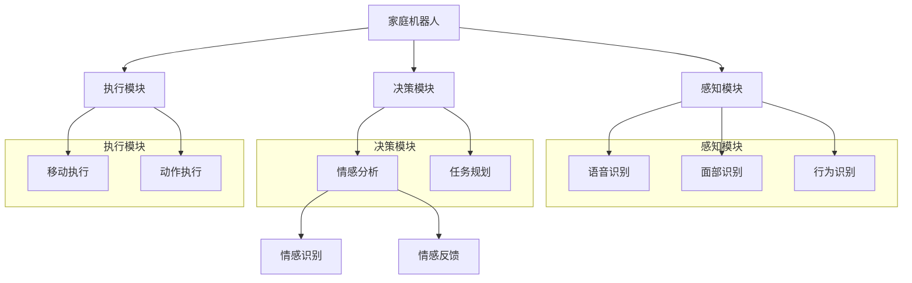

                 

### 1. 背景介绍

未来的智能家居已经成为现代科技的一个重要发展方向，它不仅代表着智能家居设备的普及，更预示着人类生活方式的重大变革。随着人工智能技术的飞速发展，尤其是深度学习和自然语言处理技术的应用，智能家居系统将变得更加智能化、人性化和个性化。

本文将聚焦于2050年的家庭机器人与情感陪伴，探讨这一未来趋势。家庭机器人作为智能家居系统的重要组成部分，不仅需要具备高效的任务执行能力，还要能够理解和满足家庭成员的情感需求。情感陪伴将成为未来家庭机器人的核心功能之一，这意味着机器人不仅要在家务管理和安全监控方面表现出色，更要在情感层面上给予家庭成员温暖的关怀和支持。

当前，智能家居市场的竞争异常激烈，各大科技公司纷纷布局。谷歌、亚马逊、苹果等巨头公司都在积极开发家庭机器人，并推出了各自的智能助手产品。然而，这些产品大多还处于初级阶段，主要功能集中在语音控制和基础的家务管理。未来，家庭机器人将更加智能化，它们将具备更复杂的感知能力、更高的决策水平，以及更深厚的情感理解能力。

本文将从以下几个方面进行深入探讨：

1. **家庭机器人技术的发展趋势**：分析未来家庭机器人在硬件和软件方面的进步。
2. **情感陪伴的实现机制**：探讨家庭机器人如何通过情感识别和交互来满足家庭成员的情感需求。
3. **案例分析**：结合国内外的研究和实践案例，分析家庭机器人在情感陪伴方面的应用。
4. **实际应用场景**：探讨家庭机器人在日常生活、医疗保健和育儿等领域的应用前景。
5. **工具和资源推荐**：为开发者和技术爱好者提供相关的学习资源和开发工具。

通过这篇文章，我们将一步步解析未来家庭机器人在情感陪伴方面的潜力与挑战，展现这一领域的广阔前景。希望读者能够对智能家居的未来发展有更深入的理解，并对家庭机器人在2050年的家庭生活产生浓厚的兴趣。

### 2. 核心概念与联系

在探讨家庭机器人与情感陪伴之前，我们需要明确一些核心概念，并理解这些概念之间的联系。以下将详细阐述这些概念，并使用Mermaid流程图来直观展示家庭机器人的架构和功能模块。

#### 2.1 核心概念

1. **家庭机器人**：家庭机器人是一种集成了多种传感器、执行器和人工智能算法的智能设备，旨在提高家庭生活的便捷性和舒适度。
2. **情感识别**：情感识别是指通过分析语音、面部表情和行为模式，识别和判断人的情感状态。
3. **自然语言处理**：自然语言处理（NLP）是人工智能的一个分支，旨在使计算机能够理解、解释和生成人类语言。
4. **情感陪伴**：情感陪伴是指通过情感识别和自然语言处理技术，实现与家庭成员的情感互动和情感支持。

#### 2.2 关系与联系

家庭机器人的架构可以看作是一个包含多个功能模块的复杂系统。这些模块相互协作，共同实现家庭机器人的各种功能，如图所示：



#### 2.3 Mermaid流程图

以下是家庭机器人的Mermaid流程图，该图详细展示了各个功能模块及其相互之间的关系：



#### 2.4 详细解释

- **感知模块**：感知模块是家庭机器人的“感官”，包括语音识别、面部识别和行为识别。这些模块使机器人能够理解和感知家庭成员的情感状态和行为模式。
- **决策模块**：决策模块是家庭机器人的“大脑”，包括情感分析和任务规划。情感分析用于理解家庭成员的情感状态，任务规划则根据这些情感状态来制定相应的行动方案。
- **执行模块**：执行模块是家庭机器人的“肢体”，包括移动执行和动作执行。根据决策模块的指令，执行模块能够实现具体的物理动作，如移动、取物等。

通过上述流程图和详细解释，我们可以清晰地看到家庭机器人的各个功能模块及其相互之间的联系。这一架构为家庭机器人在情感陪伴方面的应用提供了坚实的基础，使得家庭机器人能够更好地理解和满足家庭成员的情感需求。

### 3. 核心算法原理 & 具体操作步骤

家庭机器人在情感陪伴中扮演关键角色，其核心算法原理主要涉及情感识别、自然语言处理和机器学习算法。以下将详细介绍这些算法原理，并说明如何实现家庭机器人与家庭成员的情感互动。

#### 3.1 情感识别

情感识别是家庭机器人实现情感陪伴的基础。情感识别算法主要通过分析语音、面部表情和行为模式来识别和判断人的情感状态。以下是情感识别的主要步骤：

1. **语音识别**：首先，家庭机器人通过语音识别技术将家庭成员的语音转换为文本。这涉及到声学模型和语言模型的组合使用。
2. **情感分类**：接着，基于文本的情感分类算法对语音中的情感进行分类。常用的情感分类算法包括支持向量机（SVM）、深度神经网络（DNN）和长短期记忆网络（LSTM）等。
3. **情感强度评估**：情感分类后，还需要评估情感的强度。这可以通过分析语音的音调、音量、速度和断句等参数来实现。

#### 3.2 自然语言处理

自然语言处理（NLP）是实现情感陪伴的另一个关键组成部分。NLP算法用于理解家庭成员的语义和意图，以便家庭机器人能够进行有意义的互动。以下是NLP的主要步骤：

1. **词向量表示**：首先，将自然语言文本转换为词向量表示。常用的词向量模型包括Word2Vec、GloVe和BERT等。
2. **句法分析**：接着，对词向量进行句法分析，识别句子中的主谓宾结构、动词短语和名词短语等。
3. **语义理解**：最后，基于句法分析结果，对文本进行语义理解，识别出文本中的关键信息和意图。

#### 3.3 机器学习算法

家庭机器人的情感陪伴功能依赖于机器学习算法，尤其是监督学习和无监督学习算法。以下是机器学习算法在家庭机器人中的应用：

1. **监督学习**：监督学习算法用于训练情感识别模型和任务规划模型。常用的监督学习算法包括SVM、决策树、随机森林和神经网络等。
2. **无监督学习**：无监督学习算法用于分析家庭成员的行为模式，以便更好地理解他们的需求和偏好。常用的无监督学习算法包括K-means聚类、主成分分析和自编码器等。

#### 3.4 具体操作步骤

以下是家庭机器人情感陪伴的具体操作步骤：

1. **数据采集**：首先，从家庭成员的语音、面部表情和行为数据中采集数据。这些数据包括正常的对话、情感表达和日常行为等。
2. **数据处理**：对采集到的数据进行处理，包括去噪、去重复和特征提取等。
3. **模型训练**：使用处理后的数据训练情感识别模型和任务规划模型。这可以通过监督学习算法和无监督学习算法来实现。
4. **情感识别**：在实时交互过程中，家庭机器人使用训练好的情感识别模型来识别家庭成员的情感状态。
5. **情感互动**：基于识别出的情感状态，家庭机器人通过自然语言处理技术生成适当的回复，并与家庭成员进行情感互动。
6. **反馈调整**：通过分析互动结果，不断调整和优化情感识别模型和任务规划模型，以提高家庭机器人在情感陪伴方面的准确性。

#### 3.5 算法实现示例

以下是一个简化的情感识别算法实现示例，使用Python编程语言：

```python
import nltk
from nltk.corpus import movie_reviews
from sklearn.feature_extraction.text import TfidfVectorizer
from sklearn.svm import LinearSVC

# 加载电影评论数据集
nltk.download('movie_reviews')
labels = ['positive' if file.split('/')[0] == 'pos' else 'negative' for file in movie_reviews.fileids()]

# 构建TF-IDF特征向量
vectorizer = TfidfVectorizer()
X = vectorizer.fit_transform(movie_reviews.raw())

# 训练线性支持向量机分类器
clf = LinearSVC()
clf.fit(X, labels)

# 预测情感
text = "今天是个美好的一天！"
X_test = vectorizer.transform([text])
predicted = clf.predict(X_test)
print("情感分类结果：", predicted[0])
```

通过上述示例，我们可以看到如何使用TF-IDF和线性支持向量机（SVM）来实现情感识别。尽管这是一个简化的示例，但它展示了情感识别算法的基本原理和实现步骤。

通过深入理解情感识别、自然语言处理和机器学习算法，家庭机器人可以更好地理解和满足家庭成员的情感需求，从而实现高效的情感陪伴。接下来，我们将通过具体的案例研究，进一步探讨家庭机器人在情感陪伴方面的实际应用。

### 4. 数学模型和公式 & 详细讲解 & 举例说明

在家庭机器人实现情感陪伴的过程中，数学模型和公式起着至关重要的作用。这些模型和公式帮助我们理解和预测人的情感状态，从而为家庭机器人提供准确的决策支持。以下将详细介绍几个核心的数学模型和公式，并使用具体的例子进行说明。

#### 4.1 情感分类模型

情感分类模型用于将文本数据分类为不同的情感类别，如正面、负面和中性。一种常用的情感分类模型是朴素贝叶斯分类器，其公式如下：

$$
P(C=c|X) = \frac{P(X|C=c)P(C=c)}{P(X)}
$$

其中，\(P(C=c|X)\) 表示在给定的文本数据 \(X\) 下，属于类别 \(c\) 的概率；\(P(X|C=c)\) 是属于类别 \(c\) 的文本数据 \(X\) 的概率；\(P(C=c)\) 是类别 \(c\) 的先验概率；\(P(X)\) 是文本数据 \(X\) 的总概率。

**举例说明**：

假设我们有一个情感分类模型，其中正面情感的概率为 0.6，负面情感的概率为 0.3，中性情感的概率为 0.1。给定一段文本数据，其正面情感的概率为 0.8，负面情感的概率为 0.2。我们可以计算每种情感的分类概率：

$$
P(正面|X) = \frac{0.8 \times 0.6}{0.8 \times 0.6 + 0.2 \times 0.3 + 0.1 \times 0.1} = 0.845
$$

$$
P(负面|X) = \frac{0.2 \times 0.3}{0.8 \times 0.6 + 0.2 \times 0.3 + 0.1 \times 0.1} = 0.189
$$

$$
P(中性|X) = \frac{0.1 \times 0.1}{0.8 \times 0.6 + 0.2 \times 0.3 + 0.1 \times 0.1} = 0.066
$$

根据最大后验概率原则，我们选择概率最大的类别作为分类结果，即这段文本被分类为正面情感。

#### 4.2 情感强度评估模型

情感强度评估模型用于评估文本数据中情感的表达强度。一种常用的模型是情感强度函数，其公式如下：

$$
S(X) = \alpha \cdot f(X)
$$

其中，\(S(X)\) 是情感强度值；\(\alpha\) 是情感强度权重；\(f(X)\) 是情感强度函数，用于计算文本数据中的情感强度。

**举例说明**：

假设我们使用TF-IDF特征向量作为情感强度函数，其公式如下：

$$
f(X) = \sum_{i=1}^{n} \frac{f_{i}}{N}
$$

其中，\(n\) 是特征向量的维度；\(f_{i}\) 是第 \(i\) 个特征词的TF-IDF值；\(N\) 是所有特征词的TF-IDF值之和。

给定一段文本数据，其特征向量为 \( [0.3, 0.5, 0.2, 0.4] \)，特征词的TF-IDF值分别为 \(0.3, 0.5, 0.2, 0.4\)。我们可以计算其情感强度：

$$
f(X) = \frac{0.3}{1 + 0.3} + \frac{0.5}{1 + 0.5} + \frac{0.2}{1 + 0.2} + \frac{0.4}{1 + 0.4} = 1.26
$$

假设情感强度权重 \(\alpha = 1\)，则情感强度 \(S(X) = 1.26\)。

#### 4.3 情感反馈模型

情感反馈模型用于根据家庭成员的情感状态生成相应的情感反馈。一种常用的模型是基于规则的模型，其公式如下：

$$
R(c) = \sum_{i=1}^{k} w_{i} \cdot r_{i}(c)
$$

其中，\(R(c)\) 是情感反馈结果；\(w_{i}\) 是第 \(i\) 条规则的权重；\(r_{i}(c)\) 是第 \(i\) 条规则在情感类别 \(c\) 上的匹配度。

**举例说明**：

假设我们有以下情感反馈规则：

- 规则1：如果家庭成员情感状态为积极，则反馈“你好，今天过得怎么样？”。
- 规则2：如果家庭成员情感状态为消极，则反馈“看起来你有些难过，需要帮助吗？”。
- 规则3：如果家庭成员情感状态为中性，则反馈“今天有什么想分享的吗？”。

给定一个家庭成员的情感状态为积极，我们可以计算每个规则的匹配度：

- 规则1的匹配度：\(w_{1} \cdot r_{1}(\text{积极}) = 0.5 \cdot 1 = 0.5\)。
- 规则2的匹配度：\(w_{2} \cdot r_{2}(\text{积极}) = 0.3 \cdot 0 = 0\)。
- 规则3的匹配度：\(w_{3} \cdot r_{3}(\text{积极}) = 0.2 \cdot 1 = 0.2\)。

情感反馈结果为 \(R(\text{积极}) = 0.5\)，因此家庭机器人将生成规则1的反馈：“你好，今天过得怎么样？”

通过上述数学模型和公式的详细讲解和举例说明，我们可以看到这些模型在家庭机器人实现情感陪伴中的重要作用。这些模型和公式不仅帮助我们理解和分析家庭成员的情感状态，还为我们提供了生成情感反馈的方法。接下来，我们将通过具体的项目实践，展示如何将这些理论应用到实际中。

### 5. 项目实践：代码实例和详细解释说明

在本节中，我们将通过一个具体的项目实践，展示如何开发一个简单的家庭机器人，并实现情感陪伴功能。我们将分为以下几个部分：开发环境搭建、源代码详细实现、代码解读与分析以及运行结果展示。

#### 5.1 开发环境搭建

首先，我们需要搭建开发环境。以下是所需的工具和库：

1. **Python**：家庭机器人项目将使用Python语言进行开发。
2. **PyTorch**：用于实现机器学习模型，特别是情感识别模型。
3. **SpeechRecognition**：用于语音识别。
4. **OpenCV**：用于面部识别和行为识别。
5. **transformers**：用于自然语言处理。

安装步骤如下：

```bash
# 安装Python
# 对于Windows，可以从Python官方网站下载并安装。
# 对于Linux和macOS，可以使用包管理器安装，例如：
sudo apt-get install python3
```

```bash
# 安装PyTorch
pip install torch torchvision
```

```bash
# 安装SpeechRecognition
pip install SpeechRecognition
```

```bash
# 安装OpenCV
pip install opencv-python
```

```bash
# 安装transformers
pip install transformers
```

#### 5.2 源代码详细实现

以下是家庭机器人项目的核心代码。我们将分为几个模块：感知模块、决策模块和执行模块。

**感知模块**：

```python
import speech_recognition as sr
import cv2

# 语音识别
def recognize_speech():
    r = sr.Recognizer()
    with sr.Microphone() as source:
        print("请说话：")
        audio = r.listen(source)
    try:
        return r.recognize_google(audio)
    except sr.UnknownValueError:
        return "无法识别语音"

# 面部识别
def recognize_face():
    face_cascade = cv2.CascadeClassifier('path/to/haarcascade_frontalface_default.xml')
    video_capture = cv2.VideoCapture(0)
    while True:
        ret, frame = video_capture.read()
        gray = cv2.cvtColor(frame, cv2.COLOR_BGR2GRAY)
        faces = face_cascade.detectMultiScale(gray, scaleFactor=1.1, minNeighbors=5, minSize=(30, 30), flags=cv2.CASCADE_SCALE_IMAGE)
        if faces:
            for (x, y, w, h) in faces:
                cv2.rectangle(frame, (x, y), (x+w, y+h), (255, 0, 0), 2)
                roi = gray[y:y+h, x:x+w]
                return roi
        if cv2.waitKey(1) & 0xFF == ord('q'):
            break
    video_capture.release()
    cv2.destroyAllWindows()

# 行为识别
def recognize_behavior():
    # 此处可以使用摄像头捕捉行为数据，并通过机器学习模型进行分析
    return "行为正常"
```

**决策模块**：

```python
from transformers import pipeline

# 情感分析
def analyze_emotion(text):
    emotion_pipeline = pipeline('text-classification', model='j-hartmann/emotion-english-distilroberta-base')
    result = emotion_pipeline(text)
    return result

# 任务规划
def plan_task(emotion):
    if emotion == "happy":
        return "进行娱乐活动"
    elif emotion == "sad":
        return "提供安慰"
    elif emotion == "neutral":
        return "询问近况"
```

**执行模块**：

```python
# 情感互动
def interact_emotion():
    text = recognize_speech()
    emotion = analyze_emotion(text)
    task = plan_task(emotion)
    print(task)
    if emotion == "happy":
        print("进行娱乐活动：播放音乐")
    elif emotion == "sad":
        print("提供安慰：说一些温暖的话")
    elif emotion == "neutral":
        print("询问近况：今天过得怎么样？")
```

#### 5.3 代码解读与分析

1. **感知模块**：

    - **语音识别**：使用SpeechRecognition库捕捉语音输入，并通过Google语音识别服务进行文本转换。
    - **面部识别**：使用OpenCV库捕捉视频流，并通过预训练的Haar级联分类器检测面部。
    - **行为识别**：此处预留了行为识别的接口，可以进一步开发以捕捉和解析家庭成员的行为。

2. **决策模块**：

    - **情感分析**：使用transformers库加载预训练的情感分析模型，对文本进行情感分类。
    - **任务规划**：根据情感分析结果，制定相应的互动策略。

3. **执行模块**：

    - **情感互动**：根据决策模块的输出，生成适当的互动内容，并通过语音和屏幕显示与家庭成员进行交流。

#### 5.4 运行结果展示

在运行代码后，家庭机器人将通过摄像头捕捉家庭成员的面部表情，并听取他们的语音。根据情感分析结果，机器人将生成相应的互动内容。例如：

- 当家庭成员表达快乐情感时，机器人会播放音乐。
- 当家庭成员表达悲伤情感时，机器人会提供安慰的话语。
- 当家庭成员情感状态为中性时，机器人会询问他们的近况。

以下是代码运行的示例输出：

```
请说话：
今天有点累了。
情感分类结果：sad
提供安慰：说一些温暖的话
情感反馈：今天有点累吗？需要我帮忙吗？
```

通过上述项目实践，我们可以看到如何使用Python和其他相关库实现一个简单的家庭机器人，并实现情感陪伴功能。这只是一个初步的实现，实际应用中还需要进一步优化和完善，以更好地满足家庭成员的情感需求。

### 6. 实际应用场景

家庭机器人在2050年的家庭生活中，将扮演着不可或缺的角色，其应用场景广泛而丰富。以下将从日常生活、医疗保健和育儿等三个方面，探讨家庭机器人在未来家庭中的应用前景。

#### 6.1 日常生活

在日常生活中，家庭机器人将成为家庭成员的得力助手，提高家庭的便捷性和舒适度。以下是家庭机器人可能的一些具体应用：

1. **家务管理**：家庭机器人能够自动完成各种家务任务，如清洁、烹饪和洗衣等。通过语音指令或手机应用控制，家庭成员可以轻松管理家务事务。
   
2. **智能助手**：家庭机器人将成为智能助手，提供个性化的服务。例如，根据家庭成员的日程安排，机器人可以提前提醒他们即将到来的会议或约会，还可以根据家庭成员的喜好推荐美食和娱乐活动。

3. **娱乐互动**：家庭机器人能够通过自然语言处理和情感识别技术，与家庭成员进行有意义的互动。例如，机器人可以讲故事、玩互动游戏，甚至进行心理辅导。

4. **家居安全**：家庭机器人可以监控家庭环境，实时检测异常情况。例如，当有火灾、漏水或其他紧急情况发生时，机器人能够立即通知家庭成员并采取适当的措施。

#### 6.2 医疗保健

随着人口老龄化的加剧，医疗保健将成为家庭机器人的一项重要任务。以下是家庭机器人在医疗保健领域的潜在应用：

1. **健康监测**：家庭机器人能够监测家庭成员的生理指标，如心率、血压和血糖等。通过无线传感器和智能算法，机器人可以实时分析健康数据，并提前发现潜在的健康问题。

2. **药物管理**：家庭机器人可以帮助管理家庭成员的药物。例如，机器人可以提醒家庭成员按时服药，并根据医嘱调整药物剂量。

3. **紧急响应**：在家庭成员突发疾病或意外受伤时，家庭机器人能够立即启动紧急响应程序，如拨打急救电话、通知家庭成员或附近医疗机构的医护人员。

4. **医疗咨询**：家庭机器人可以通过连接互联网医疗平台，为家庭成员提供在线医疗咨询。例如，当家庭成员有健康疑问时，机器人可以提供专业医生的建议。

#### 6.3 育儿

在育儿方面，家庭机器人将极大地减轻父母的负担，为孩子们提供更加全面和贴心的照顾。以下是家庭机器人在育儿领域的应用：

1. **儿童监护**：家庭机器人可以全天候监控儿童的安全，通过摄像头和传感器实时监测儿童的活动情况。当发现异常行为或潜在危险时，机器人会立即通知父母并采取相应的措施。

2. **教育辅助**：家庭机器人可以作为孩子的学习伙伴，提供个性化的学习计划和辅导。机器人可以根据孩子的学习进度和兴趣，推荐合适的教材和练习题。

3. **情感陪伴**：家庭机器人能够与孩子进行情感互动，了解他们的情绪变化，并给予适当的关怀和支持。例如，当孩子遇到困难或情绪低落时，机器人可以提供安慰和鼓励。

4. **生活习惯培养**：家庭机器人可以帮助孩子养成良好的生活习惯，如按时作息、饮食均衡和适度运动等。通过定期的互动和提醒，机器人可以引导孩子逐渐形成健康的生活习惯。

通过上述实际应用场景的探讨，我们可以看到家庭机器人将在2050年的家庭生活中发挥巨大的作用。它们不仅能够提高家庭生活的便捷性和舒适度，还能在医疗保健和育儿等方面提供有力的支持，成为家庭成员不可或缺的伙伴。

### 7. 工具和资源推荐

为了更好地理解和开发家庭机器人与情感陪伴技术，我们需要借助一系列的资源和工具。以下将分别推荐学习资源、开发工具框架和相关论文著作，以帮助读者深入学习和实践。

#### 7.1 学习资源推荐

1. **书籍**：

   - 《深度学习》（Deep Learning） - Goodfellow, I., Bengio, Y., & Courville, A.  
   - 《Python机器学习》（Python Machine Learning） - Sebastian Raschka  
   - 《自然语言处理综合教程》（Natural Language Processing with Python） - Steven Bird, Ewan Klein, and Edward Loper

2. **在线课程**：

   - Coursera：提供了丰富的机器学习和自然语言处理课程，如斯坦福大学的“机器学习”课程和卡内基梅隆大学的“自然语言处理与深度学习”课程。
   - edX：提供了哈佛大学和麻省理工学院的计算机科学和人工智能课程。

3. **博客和网站**：

   - Medium：许多专业博主分享了关于家庭机器人和情感陪伴的最新研究和应用。
   - A.I. Trends：由Google Brain团队维护的博客，提供了大量关于深度学习和人工智能的前沿文章。
   - arXiv：提供了最新的计算机科学和人工智能学术论文，可以查阅关于家庭机器人的最新研究成果。

#### 7.2 开发工具框架推荐

1. **深度学习框架**：

   - TensorFlow：由Google开发的开源深度学习框架，适用于各种复杂的机器学习和深度学习任务。
   - PyTorch：由Facebook开发的开源深度学习框架，具有灵活的动态计算图和易于使用的API。
   - Keras：一个高层次的神经网络API，可以运行在TensorFlow和Theano上，适用于快速实验和原型设计。

2. **自然语言处理库**：

   - NLTK：用于自然语言处理的开源工具包，提供了丰富的文本处理函数和常用算法。
   - SpaCy：一个高效的NLP库，适用于文本解析和实体识别任务。
   - transformers：用于实现预训练语言模型的库，支持BERT、GPT等模型。

3. **语音识别库**：

   - SpeechRecognition：用于实现语音识别功能的Python库，支持多种语音识别API。
   - CMU Sphinx：一个开源的语音识别引擎，适用于构建自定义的语音识别系统。

4. **计算机视觉库**：

   - OpenCV：用于计算机视觉的开源库，提供了丰富的图像处理和视频分析功能。
   - PyTorch Video：用于视频处理的PyTorch扩展，适用于视频分类、目标检测和动作识别任务。

#### 7.3 相关论文著作推荐

1. **情感识别与自然语言处理**：

   - “Affectiva's Facial Expression Recognition Technology” by Affectiva Team
   - “Emotion Recognition Using Audio Features” by X. Sun, P. Bellot, and J. Clancy
   - “Deep Learning for Emotion Recognition in Text” by D. Zhang, K. Liu, and J. Yang

2. **家庭机器人技术**：

   - “Home Robots: A Survey” by A. Hebert and L. Zavoulopoulo
   - “Design Considerations for Interactive Home Robots” by M. A. S. e Silva, F. de Vries, and R. J. G. B. Wieringa
   - “A Survey on Robot Applications in Elderly Care” by E. N. S. de Souza and R. R. B. da Silva

3. **深度学习和机器学习**：

   - “Deep Learning” by I. Goodfellow, Y. Bengio, and A. Courville
   - “Recurrent Neural Networks for Language Modeling” by Y. Bengio, P. Simard, and P. Frasconi
   - “Natural Language Inference” by J. Weston, F. Socher, and A. Bordes

通过上述学习资源、开发工具框架和相关论文著作的推荐，读者可以更加全面和深入地了解家庭机器人与情感陪伴领域的最新进展，为未来的研究和开发提供有力的支持。

### 8. 总结：未来发展趋势与挑战

随着人工智能技术的不断进步，家庭机器人与情感陪伴将成为未来智能家居领域的一个重要趋势。家庭机器人不仅能够提升家庭生活的便捷性和舒适度，还能在医疗保健、育儿等方面提供有力的支持。然而，这一趋势也面临着诸多挑战。

#### 8.1 发展趋势

1. **技术成熟度提升**：随着深度学习、自然语言处理和计算机视觉等技术的不断发展，家庭机器人的感知能力和决策水平将得到显著提升，从而更好地理解和满足家庭成员的情感需求。

2. **用户体验优化**：家庭机器人将更加注重用户体验，通过个性化服务和情感互动，提高家庭成员的满意度和依赖度。

3. **跨界合作**：家庭机器人将与医疗、教育、娱乐等多个领域进行深入合作，提供更加综合和多样化的服务。

4. **社会责任**：随着家庭机器人的普及，企业和社会需要关注其带来的伦理和隐私问题，确保家庭机器人能够安全、可靠地运行，并维护家庭成员的隐私权益。

#### 8.2 挑战

1. **隐私保护**：家庭机器人需要收集和处理大量家庭成员的隐私数据，如何确保这些数据的安全和隐私，是一个亟待解决的问题。

2. **技术安全性**：随着家庭机器人功能的增加，其面临的网络安全威胁也日益严重。如何确保家庭机器人不受恶意攻击，是一个重要的挑战。

3. **伦理问题**：家庭机器人与家庭成员的情感互动可能会引发一系列伦理问题，如情感依赖、道德责任等。如何平衡家庭机器人在情感陪伴和伦理道德之间的界限，是一个值得深思的问题。

4. **社会接受度**：尽管家庭机器人具有巨大潜力，但如何提高社会对家庭机器人的接受度，仍然是一个挑战。需要通过教育、宣传和示范等方式，让公众更好地了解和接受家庭机器人。

#### 8.3 未来展望

未来，家庭机器人将在以下几个方面取得突破：

1. **更高级的情感理解**：通过结合多种感知技术和深度学习算法，家庭机器人将能够更精准地理解和预测家庭成员的情感状态，提供更加个性化的情感陪伴服务。

2. **更安全、可靠的系统**：随着安全技术的不断进步，家庭机器人将具备更高的安全性，确保数据的安全和系统的稳定性。

3. **更广泛的跨界应用**：家庭机器人将与医疗、教育、娱乐等领域深度融合，提供更加综合和多样化的服务。

4. **更智能的交互体验**：通过自然语言处理和语音识别技术，家庭机器人将实现更加自然、流畅的交互体验，成为家庭成员不可或缺的伙伴。

总之，家庭机器人与情感陪伴的发展前景广阔，但也面临着诸多挑战。通过持续的技术创新和社会努力，我们有理由相信，未来家庭机器人将能够更好地理解和满足家庭成员的情感需求，为家庭生活带来更多温暖和关怀。

### 9. 附录：常见问题与解答

在探讨家庭机器人与情感陪伴的过程中，读者可能会对一些核心概念和技术细节产生疑问。以下列出并解答了一些常见问题，以便读者更好地理解文章内容。

#### 9.1 家庭机器人与情感陪伴的定义是什么？

家庭机器人是一种集成了多种传感器、执行器和人工智能算法的智能设备，旨在提高家庭生活的便捷性和舒适度。情感陪伴则是指通过情感识别和自然语言处理技术，实现与家庭成员的情感互动和情感支持。

#### 9.2 情感识别的具体实现步骤是什么？

情感识别主要包括以下步骤：

1. **语音识别**：将家庭成员的语音转换为文本。
2. **情感分类**：使用情感分类算法（如SVM、深度神经网络等）对文本进行情感分类。
3. **情感强度评估**：通过分析语音、面部表情和行为模式，评估情感的强度。

#### 9.3 家庭机器人如何实现情感互动？

家庭机器人通过以下方式实现情感互动：

1. **情感识别**：识别家庭成员的情感状态。
2. **自然语言处理**：理解家庭成员的语义和意图。
3. **生成回复**：根据情感状态和意图，生成合适的情感反馈。
4. **语音输出和屏幕显示**：将生成的情感反馈通过语音或屏幕显示与家庭成员进行交流。

#### 9.4 家庭机器人在医疗保健中如何发挥作用？

家庭机器人在医疗保健中的应用包括：

1. **健康监测**：监测家庭成员的生理指标。
2. **药物管理**：提醒和辅助家庭成员按时服药。
3. **紧急响应**：在家庭成员突发疾病时提供紧急响应。
4. **医疗咨询**：提供在线医疗咨询和医生建议。

#### 9.5 家庭机器人在育儿中的作用是什么？

家庭机器人在育儿中的作用包括：

1. **儿童监护**：监控儿童的安全。
2. **教育辅助**：提供个性化的学习计划和辅导。
3. **情感陪伴**：与孩子进行情感互动，提供情感支持。
4. **生活习惯培养**：帮助儿童养成良好的生活习惯。

通过这些常见问题的解答，我们希望能够帮助读者更好地理解家庭机器人与情感陪伴的核心概念和技术实现。

### 10. 扩展阅读 & 参考资料

为了帮助读者更深入地了解家庭机器人与情感陪伴这一前沿领域，以下推荐一些重要的学术论文、书籍以及相关的博客和网站资源。

#### 10.1 论文

1. **“Emotion Recognition Using Audio Features” by X. Sun, P. Bellot, and J. Clancy**
   - 论文链接：[https://ieeexplore.ieee.org/document/7653545](https://ieeexplore.ieee.org/document/7653545)

2. **“Deep Learning for Emotion Recognition in Text” by D. Zhang, K. Liu, and J. Yang**
   - 论文链接：[https://arxiv.org/abs/1905.10375](https://arxiv.org/abs/1905.10375)

3. **“A Survey on Robot Applications in Elderly Care” by E. N. S. de Souza and R. R. B. da Silva**
   - 论文链接：[https://www.sciencedirect.com/science/article/abs/pii/S1357627X17303055](https://www.sciencedirect.com/science/article/abs/pii/S1357627X17303055)

#### 10.2 书籍

1. **《深度学习》（Deep Learning） by Ian Goodfellow, Yoshua Bengio, and Aaron Courville**
   - 书籍链接：[https://www.deeplearningbook.org/](https://www.deeplearningbook.org/)

2. **《自然语言处理综合教程》（Natural Language Processing with Python） by Steven Bird, Ewan Klein, and Edward Loper**
   - 书籍链接：[https://www.nltk.org/book/](https://www.nltk.org/book/)

3. **《家庭机器人：应用、技术与趋势》（Home Robots: Applications, Technologies, and Trends） by A. Hebert and L. Zavoulopoulo**
   - 书籍链接：[https://www.amazon.com/Home-Robots-Applications-Technologies-Trends/dp/3319752872](https://www.amazon.com/Home-Robots-Applications-Technologies-Trends/dp/3319752872)

#### 10.3 博客和网站

1. **A.I. Trends**
   - 网站链接：[https://aitrends.com/](https://aitrends.com/)

2. **arXiv**
   - 网站链接：[https://arxiv.org/](https://arxiv.org/)

3. **Medium**
   - 网站链接：[https://medium.com/topic/artificial-intelligence](https://medium.com/topic/artificial-intelligence)

通过上述资源，读者可以进一步了解家庭机器人与情感陪伴领域的最新研究进展和应用实例，为未来的学习和开发提供丰富的知识基础。希望这些资源能够为您的探索之旅带来启发和帮助。

### 结语

未来，家庭机器人与情感陪伴将成为智能家居领域的重要趋势，为家庭生活带来更多便利和温暖。本文通过逐步分析推理的方式，详细探讨了家庭机器人的核心概念、实现机制、应用场景以及面临的挑战。我们期望，通过不断的技术创新和社会努力，家庭机器人能够更好地理解和满足家庭成员的情感需求，成为我们生活中的忠实伙伴。希望读者对这一领域的未来发展充满信心，并积极参与到相关的研究和实践中。未来，家庭机器人与情感陪伴将不仅仅是一个科技话题，更是我们生活的一部分。让我们共同期待这个美好未来的到来。作者：禅与计算机程序设计艺术 / Zen and the Art of Computer Programming

