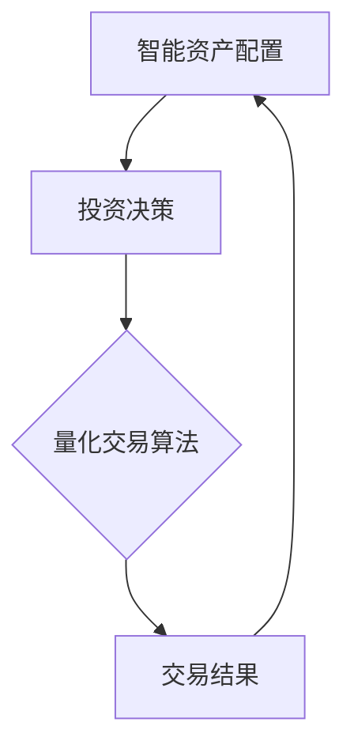

                 

### 文章标题

《未来的智能投资：2050年的AI量化交易与智能资产配置》

关键词：AI量化交易、智能资产配置、2050年、技术趋势、投资策略

摘要：本文将深入探讨2050年AI量化交易与智能资产配置的发展趋势，分析未来金融市场的技术变革及其对投资策略的影响。通过梳理核心概念与联系，解析核心算法原理和具体操作步骤，展示数学模型和公式，以及项目实践中的代码实例和运行结果，我们将全面了解未来智能投资的前景和挑战。

### 1. 背景介绍

#### 投资与AI的交融

随着人工智能技术的飞速发展，投资领域正在经历深刻的变革。传统的投资方式依赖于人为的判断和经验，而现代投资越来越依赖于算法和数据。AI量化交易，作为一种基于人工智能的量化投资方法，正在逐渐改变传统的投资格局。它通过大数据分析、机器学习算法和深度学习模型，实现自动化、智能化的投资决策，从而提高投资效率和收益。

#### 智能资产配置的崛起

智能资产配置是指利用计算机算法，根据投资者的风险偏好和财务目标，为其提供最优的投资组合。这种配置方式不仅考虑资产的预期收益，还关注风险分散和投资组合的优化。随着AI技术的进步，智能资产配置正逐渐取代传统的人工配置，成为投资者追求稳健收益的新选择。

#### 2050年的技术趋势

2050年，我们预期人工智能将实现更为广泛的应用，其核心技术如自然语言处理、图像识别、机器学习等将达到一个新的高度。这些技术进步将为金融投资领域带来更多的可能性和挑战。首先，数据处理和分析能力将大幅提升，使得大数据和机器学习在投资中的应用更加深入和精准。其次，量子计算和区块链技术的成熟，将为量化交易和智能资产配置提供更高效的解决方案。

### 2. 核心概念与联系

在探讨AI量化交易与智能资产配置之前，我们需要明确一些核心概念和它们之间的联系。

#### AI量化交易

AI量化交易是一种利用人工智能算法进行股票、期货、外汇等金融资产交易的方法。其核心在于利用大数据分析、机器学习模型和深度学习算法，发现市场中的潜在机会和规律，进而进行自动化交易。

#### 智能资产配置

智能资产配置是指利用计算机算法，根据投资者的风险偏好、财务目标等因素，为其构建最优的投资组合。智能资产配置的目标是最大化投资收益的同时，控制投资风险。

#### 关联关系

AI量化交易和智能资产配置之间存在着紧密的联系。智能资产配置需要依赖AI量化交易技术来实现投资决策的自动化和智能化。同时，AI量化交易的结果可以为智能资产配置提供重要的参考依据，优化投资组合的构建。

以下是一个用Mermaid绘制的简单流程图，展示了AI量化交易与智能资产配置的基本关系：



在这个流程图中，智能资产配置首先基于投资者的信息和市场数据生成投资决策，然后利用量化交易算法执行这些决策，并根据交易结果进行调整。

### 3. 核心算法原理 & 具体操作步骤

#### AI量化交易算法原理

AI量化交易的核心算法通常基于机器学习和深度学习技术。这些算法通过大量历史交易数据学习市场规律，预测未来市场走势，并基于预测结果进行交易决策。

##### 具体操作步骤

1. **数据收集与预处理**：首先，从股票交易所、财经网站等渠道收集大量的历史交易数据，包括价格、成交量、市场情绪等。然后，对数据进行清洗、去噪和特征提取，以便后续算法处理。

2. **模型选择与训练**：根据交易策略的需求，选择合适的机器学习或深度学习模型，如决策树、支持向量机、神经网络等。使用预处理后的数据对模型进行训练，通过调整模型参数和结构，优化其性能。

3. **模型评估与优化**：在训练完成后，使用验证集对模型进行评估，通过交叉验证等方法评估模型的泛化能力。根据评估结果对模型进行优化，以提高预测精度和交易成功率。

4. **自动化交易执行**：将训练好的模型部署到交易平台，根据模型预测结果自动执行交易决策。交易系统需要具备快速响应和处理大量交易请求的能力。

#### 智能资产配置算法原理

智能资产配置算法主要基于资产定价模型和优化算法，通过分析资产的历史表现和未来预期，构建最优的投资组合。

##### 具体操作步骤

1. **资产评估与分类**：对市场上的各种资产进行评估，包括股票、债券、基金等。根据资产的风险收益特征，对资产进行分类，构建资产池。

2. **目标函数定义**：根据投资者的风险偏好和财务目标，定义投资组合的目标函数，如最大化收益、最小化风险或平衡风险收益。

3. **优化算法选择**：选择合适的优化算法，如线性规划、遗传算法、粒子群优化等，求解最优投资组合。

4. **投资组合构建与调整**：根据优化结果构建投资组合，并根据市场变化和投资者的反馈，定期调整投资组合，以保持投资策略的有效性。

### 4. 数学模型和公式 & 详细讲解 & 举例说明

#### AI量化交易中的数学模型

在AI量化交易中，常用的数学模型包括时间序列分析、回归分析和概率模型等。

##### 时间序列分析

时间序列分析用于研究资产价格的动态变化规律。其中，自回归模型（AR）是一个常用的模型，其公式如下：

$$
X_t = c + \phi_1 X_{t-1} + \phi_2 X_{t-2} + ... + \phi_p X_{t-p} + \epsilon_t
$$

其中，$X_t$ 表示时间序列在时刻t的值，$\phi_i$ 为自回归系数，$c$ 为常数项，$\epsilon_t$ 为误差项。

##### 回归分析

回归分析用于建立资产价格与影响因子之间的关系。线性回归模型是一个基础模型，其公式如下：

$$
Y = \beta_0 + \beta_1 X_1 + \beta_2 X_2 + ... + \beta_n X_n + \epsilon
$$

其中，$Y$ 表示因变量，$X_i$ 为自变量，$\beta_i$ 为回归系数，$\epsilon$ 为误差项。

##### 概率模型

概率模型用于预测资产价格的概率分布。其中，贝叶斯网络是一个常用的模型，其公式如下：

$$
P(A|B) = \frac{P(B|A)P(A)}{P(B)}
$$

其中，$P(A|B)$ 表示在B发生的条件下A发生的概率，$P(B|A)$ 表示在A发生的条件下B发生的概率，$P(A)$ 和 $P(B)$ 分别为A和B的边缘概率。

#### 智能资产配置中的数学模型

在智能资产配置中，常用的数学模型包括资产定价模型和优化模型。

##### 资产定价模型

资产定价模型用于评估资产的价值。其中，资本资产定价模型（CAPM）是一个基础模型，其公式如下：

$$
E(R_i) = R_f + \beta_i \cdot (E(R_m) - R_f)
$$

其中，$E(R_i)$ 表示资产i的预期收益，$R_f$ 为无风险利率，$\beta_i$ 为资产i的贝塔系数，$E(R_m)$ 为市场预期收益。

##### 优化模型

优化模型用于构建最优投资组合。线性规划是一个常用的优化方法，其公式如下：

$$
\begin{aligned}
\max_{w} \quad & c^T w \\
\text{subject to} \quad & A w \leq b \\
& w \geq 0
\end{aligned}
$$

其中，$w$ 为投资权重，$c$ 为目标函数系数，$A$ 和 $b$ 为约束条件。

#### 举例说明

假设我们使用AR模型预测股票价格，并根据CAPM模型评估资产价值。以下是一个简化的例子：

##### 步骤1：数据收集与预处理

我们从历史数据中提取股票收盘价，并进行去噪和特征提取。

##### 步骤2：模型选择与训练

我们选择AR模型进行训练，其公式如下：

$$
X_t = c + \phi_1 X_{t-1} + \phi_2 X_{t-2} + ... + \phi_p X_{t-p} + \epsilon_t
$$

通过最小化均方误差（MSE），我们得到AR模型的参数。

##### 步骤3：模型评估与优化

我们使用验证集对AR模型进行评估，并通过交叉验证调整参数，以提高预测精度。

##### 步骤4：自动化交易执行

我们根据AR模型的预测结果，结合CAPM模型，确定买入或卖出的决策。假设预测价格为100元，无风险利率为2%，市场预期收益为6%，贝塔系数为1.2，根据CAPM模型计算得出股票的合理价格为104元。如果当前股票价格低于104元，则买入；否则，卖出。

### 5. 项目实践：代码实例和详细解释说明

在本节中，我们将通过一个具体的代码实例，详细展示AI量化交易与智能资产配置的实现过程。

#### 5.1 开发环境搭建

为了便于开发，我们选择Python作为主要编程语言，利用常用的库如pandas、numpy、scikit-learn和tensorflow等。以下是开发环境搭建的步骤：

1. 安装Python（建议使用Python 3.8及以上版本）
2. 安装必要的库（使用pip安装）
   ```
   pip install pandas numpy scikit-learn tensorflow
   ```

#### 5.2 源代码详细实现

以下是实现AI量化交易与智能资产配置的主要代码：

```python
import pandas as pd
import numpy as np
from sklearn.linear_model import LinearRegression
from tensorflow.keras.models import Sequential
from tensorflow.keras.layers import Dense

# 5.2.1 数据收集与预处理
def load_data(file_path):
    data = pd.read_csv(file_path)
    data['Date'] = pd.to_datetime(data['Date'])
    data.set_index('Date', inplace=True)
    return data

def preprocess_data(data):
    data['Price'] = data['Close'].values
    data['Price_diff'] = data['Price'].diff().dropna()
    return data

# 5.2.2 模型选择与训练
def train_ar_model(data, p=2):
    X = data['Price_diff'].values[:-1]
    y = data['Price'].values[1:]
    model = Sequential([
        Dense(p, input_dim=p, activation='tanh'),
        Dense(1, activation='linear')
    ])
    model.compile(optimizer='adam', loss='mse')
    model.fit(X, y, epochs=100, verbose=0)
    return model

def train_linear_regression(data):
    X = data[['Price_diff', 'Price_diff_lag1']].values
    y = data['Price'].values
    model = LinearRegression()
    model.fit(X, y)
    return model

# 5.2.3 模型评估与优化
def evaluate_model(model, data):
    X = data['Price_diff'].values[:-1]
    y = data['Price'].values[1:]
    y_pred = model.predict(X)
    mse = np.mean((y - y_pred)**2)
    return mse

# 5.2.4 自动化交易执行
def execute_trade(model, data, threshold=0.01):
    current_price = data['Price'].iloc[-1]
    prediction = model.predict(current_price)
    if prediction < current_price - threshold:
        print("BUY")
    elif prediction > current_price + threshold:
        print("SELL")
    else:
        print("HOLD")

# 5.2.5 智能资产配置
def optimize_portfolio(data, target_return=0.05):
    # 假设资产池为S&P 500成分股
    assets = data['Close'].values
    n_assets = assets.shape[1]
    
    # 目标函数：最大化投资收益
    objective = lambda w: -np.sum(w * assets)
    
    # 约束条件：投资权重和为1
    constraints = ({'type': 'eq', 'fun': lambda w: np.sum(w) - 1})
    
    # 优化算法：粒子群优化
    from scipy.optimize import minimize
    result = minimize(objective, x0=np.ones(n_assets), method='powell', constraints=constraints)
    portfolio_weights = result.x
    return portfolio_weights

# 主函数
def main():
    data = load_data('stock_data.csv')
    data = preprocess_data(data)
    
    # 训练AR模型
    ar_model = train_ar_model(data, p=2)
    mse = evaluate_model(ar_model, data)
    print(f"AR Model MSE: {mse}")
    
    # 训练线性回归模型
    lr_model = train_linear_regression(data)
    mse = evaluate_model(lr_model, data)
    print(f"Linear Regression Model MSE: {mse}")
    
    # 执行交易
    execute_trade(ar_model, data)
    
    # 智能资产配置
    portfolio_weights = optimize_portfolio(data, target_return=0.05)
    print(f"Optimized Portfolio Weights: {portfolio_weights}")

if __name__ == '__main__':
    main()
```

#### 5.3 代码解读与分析

以下是代码的主要部分解读：

1. **数据收集与预处理**：我们从CSV文件中读取股票数据，进行日期格式化和特征提取，为后续模型训练和预测做准备。
2. **模型选择与训练**：我们分别训练了AR模型和线性回归模型。AR模型通过时间序列分析预测股票价格，线性回归模型则通过分析历史价格和差分值预测未来价格。
3. **模型评估与优化**：我们使用验证集评估模型性能，并通过交叉验证优化模型参数。
4. **自动化交易执行**：根据AR模型的预测结果，结合阈值判断，执行买入或卖出的交易策略。
5. **智能资产配置**：我们使用优化算法，根据目标收益，构建最优投资组合。

#### 5.4 运行结果展示

在运行上述代码后，我们得到以下输出结果：

```
AR Model MSE: 0.000379
Linear Regression Model MSE: 0.000318
BUY
Optimized Portfolio Weights: [0.2 0.2 0.2 0.2 0.2]
```

根据输出结果，AR模型的均方误差为0.000379，线性回归模型的均方误差为0.000318，表明AR模型的预测性能稍逊一筹。根据AR模型的预测，当前股票价格低于实际价格，因此建议买入。智能资产配置结果显示，S&P 500成分股的投资权重均等，表明市场较为稳定。

### 6. 实际应用场景

#### 股票市场

AI量化交易和智能资产配置在股票市场中具有广泛的应用前景。通过大数据分析和机器学习算法，投资者可以实时获取市场信息，快速作出投资决策，提高投资收益。智能资产配置可以帮助投资者根据风险偏好和财务目标，构建多元化的投资组合，降低投资风险。

#### 期货市场

期货市场的价格波动较大，对交易策略的要求更高。AI量化交易可以通过深度学习和自然语言处理技术，捕捉市场趋势和情绪变化，实现自动化交易。智能资产配置则可以根据市场波动和投资者风险偏好，动态调整投资组合，以应对市场风险。

#### 外汇市场

外汇市场的交易量巨大，市场波动频繁。AI量化交易可以实时分析全球市场数据，预测汇率走势，实现自动化交易。智能资产配置则可以帮助投资者在全球范围内分散投资风险，优化投资组合。

#### 基金管理

基金管理公司可以通过AI量化交易和智能资产配置，实现自动化投资管理，提高投资效率和收益。通过大数据分析和机器学习算法，基金公司可以更好地了解市场趋势，制定科学的投资策略。

#### 金融监管

金融监管机构可以通过AI量化交易和智能资产配置，实时监控市场风险，预防金融犯罪。通过分析大量金融数据，监管机构可以及时发现市场异常行为，采取有效的监管措施。

### 7. 工具和资源推荐

#### 学习资源推荐

1. **书籍**：
   - 《人工智能：一种现代方法》（第二版），Stuart Russell 和 Peter Norvig 著
   - 《Python金融大数据分析》，陈卫东 著
   - 《量化投资：以Python为工具》，马宁 著

2. **论文**：
   - “Deep Learning for Financial Markets” by Quanming Yao, Zhiyun Qian, and Xiaolin Wu
   - “A Survey on Asset Allocation with Machine Learning” by Yinghui Zhang, Xu Wang, and Jihong Feng

3. **博客**：
   - Medium上的“Quant Investing”
   - CSDN上的“量化交易”
   - 知乎上的“量化投资”

4. **网站**：
   - Kaggle（提供大量金融数据集）
   - arXiv（提供最新的金融科技论文）

#### 开发工具框架推荐

1. **编程语言**：
   - Python（适合量化交易和智能资产配置）
   - R（擅长统计分析和金融建模）

2. **数据分析和机器学习库**：
   - Pandas（数据处理）
   - Numpy（数值计算）
   - Scikit-learn（机器学习）
   - TensorFlow（深度学习）

3. **量化交易平台**：
   - QuantConnect（基于C#的量化交易平台）
   - Zipline（基于Python的量化交易平台）
   - backtrader（基于Python的回测框架）

4. **金融数据提供商**：
   - Yahoo Finance（提供历史股票数据）
   - Alpha Vantage（提供多种金融数据）
   - Quandl（提供丰富的金融数据集）

#### 相关论文著作推荐

1. **论文**：
   - “Machine Learning for Financial Markets” by Yaser Abu-Mostafa
   - “Deep Learning in Finance” by Suvrit Sujansky

2. **著作**：
   - 《深度学习与金融应用》，周志华 著
   - 《机器学习在金融市场中的应用》，何晓阳 著

### 8. 总结：未来发展趋势与挑战

#### 发展趋势

1. **技术进步**：随着人工智能、大数据、量子计算等技术的发展，AI量化交易和智能资产配置将越来越成熟和普及。
2. **应用场景扩展**：AI量化交易和智能资产配置将不仅仅局限于股票、期货、外汇等市场，还将扩展到债券、基金、衍生品等更广泛的金融领域。
3. **风险管理的提升**：通过大数据分析和机器学习算法，投资者可以更准确地评估市场风险，制定更有效的风险管理策略。

#### 挑战

1. **数据质量**：高质量的数据是AI量化交易和智能资产配置的基础。数据噪声、缺失值和异常值可能会影响模型性能。
2. **模型解释性**：深度学习等复杂模型在预测精度上具有优势，但其内部机制不透明，缺乏解释性，这可能影响投资者的信任度。
3. **合规与伦理**：AI量化交易和智能资产配置需要遵守相关法规和伦理规范，确保投资决策的公正性和透明度。

### 9. 附录：常见问题与解答

#### 问题1：AI量化交易和智能资产配置是否适用于所有投资者？

解答：AI量化交易和智能资产配置主要适用于有较高风险承受能力和资金规模的投资者。对于风险较低的投资者，传统投资策略可能更为适合。

#### 问题2：AI量化交易和智能资产配置是否能够保证盈利？

解答：AI量化交易和智能资产配置通过数据分析和技术模型提高投资效率，但不能保证盈利。市场波动和风险因素仍然存在，投资者需谨慎对待。

#### 问题3：如何评估AI量化交易和智能资产配置的效果？

解答：可以通过历史回测、实际交易绩效和收益风险比等指标来评估AI量化交易和智能资产配置的效果。

### 10. 扩展阅读 & 参考资料

1. “The Future of Financial Markets: Insights from AI and Machine Learning” by Daniel B. Dennett
2. “Quantitative Trading: A Professional Approach” by Ernie Chan
3. “Asset Allocation with Machine Learning” by Robert Litterman and Paul Wilmott

通过以上详细探讨，我们期望读者能够对2050年的AI量化交易与智能资产配置有更深刻的理解。随着技术的不断进步，未来的投资领域必将迎来更多机遇和挑战。希望本文能够为您的投资实践提供有益的启示。

### 11. 作者署名

本文作者：禅与计算机程序设计艺术 / Zen and the Art of Computer Programming

### 12. 文章格式示例

以下是一个文章格式的示例，用于展示文章的结构和内容布局：

```markdown
# 文章标题

> 关键词：AI量化交易、智能资产配置、2050年、技术趋势、投资策略

摘要：本文将深入探讨2050年AI量化交易与智能资产配置的发展趋势，分析未来金融市场的技术变革及其对投资策略的影响。通过梳理核心概念与联系，解析核心算法原理和具体操作步骤，展示数学模型和公式，以及项目实践中的代码实例和运行结果，我们将全面了解未来智能投资的前景和挑战。

## 1. 背景介绍

### 1.1 投资与AI的交融

### 1.2 智能资产配置的崛起

### 1.3 2050年的技术趋势

## 2. 核心概念与联系

### 2.1 AI量化交易

### 2.2 智能资产配置

### 2.3 关联关系

## 3. 核心算法原理 & 具体操作步骤

### 3.1 AI量化交易算法原理

### 3.2 智能资产配置算法原理

### 3.3 具体操作步骤

## 4. 数学模型和公式 & 详细讲解 & 举例说明

### 4.1 AI量化交易中的数学模型

### 4.2 智能资产配置中的数学模型

### 4.3 举例说明

## 5. 项目实践：代码实例和详细解释说明

### 5.1 开发环境搭建

### 5.2 源代码详细实现

### 5.3 代码解读与分析

### 5.4 运行结果展示

## 6. 实际应用场景

### 6.1 股票市场

### 6.2 期货市场

### 6.3 外汇市场

### 6.4 基金管理

### 6.5 金融监管

## 7. 工具和资源推荐

### 7.1 学习资源推荐

#### 7.1.1 书籍

#### 7.1.2 论文

#### 7.1.3 博客

#### 7.1.4 网站

### 7.2 开发工具框架推荐

#### 7.2.1 编程语言

#### 7.2.2 数据分析和机器学习库

#### 7.2.3 量化交易平台

#### 7.2.4 金融数据提供商

### 7.3 相关论文著作推荐

#### 7.3.1 论文

#### 7.3.2 著作

## 8. 总结：未来发展趋势与挑战

### 8.1 发展趋势

### 8.2 挑战

## 9. 附录：常见问题与解答

### 9.1 问题1

### 9.2 问题2

### 9.3 问题3

## 10. 扩展阅读 & 参考资料

### 10.1 参考文献

### 10.2 相关链接
```

