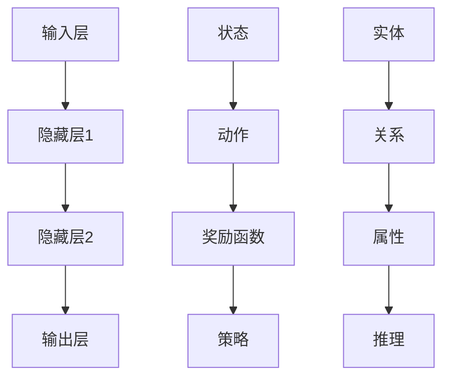

                 

### 文章标题

李开复：AI 2.0 时代的产业

> 关键词：人工智能、AI 2.0、产业转型、技术创新、商业应用

> 摘要：本文将深入探讨 AI 2.0 时代的产业变革，分析核心概念、算法原理、数学模型、项目实践以及实际应用场景，总结未来发展趋势与挑战，为读者提供全面的技术洞察。

## 1. 背景介绍

在过去的几十年里，人工智能（AI）经历了从理论研究到实际应用的快速发展。早期的 AI 主要集中在符号推理和规则系统，虽然取得了一定的成果，但受限于计算能力和数据资源，AI 的应用范围有限。随着计算能力的提升和大数据技术的进步，AI 进入到了一个新的阶段，即 AI 2.0 时代。

AI 2.0 时代的特点主要体现在以下几个方面：

1. **数据驱动的模型**：传统的 AI 研究依赖于人工设计的特征和规则，而 AI 2.0 则强调数据驱动，通过深度学习等技术，自动从大量数据中提取特征和模式。

2. **自主学习与优化**：AI 2.0 能够通过不断的学习和优化，提高自身的性能和适应性，从而实现更复杂的任务。

3. **跨领域的融合应用**：AI 2.0 在医疗、金融、教育、制造等各个领域都有广泛的应用，推动了产业的智能化转型。

4. **硬件与软件的协同发展**：随着 GPU、TPU 等专用硬件的发展，AI 的计算效率得到了大幅提升，为 AI 2.0 时代的到来提供了技术保障。

## 2. 核心概念与联系

### 2.1. 深度学习

深度学习是 AI 2.0 的核心技术之一。它通过模拟人脑神经网络的结构和功能，实现对数据的自动特征提取和模式识别。深度学习的核心概念包括：

1. **神经元**：深度学习中的基本计算单元，类似于人脑中的神经元。
2. **层**：神经网络中的不同层次，包括输入层、隐藏层和输出层。
3. **激活函数**：用于引入非线性特性的函数，常见的有 sigmoid、ReLU 等。
4. **损失函数**：用于衡量预测值与真实值之间的差距，常见的有均方误差（MSE）、交叉熵等。

### 2.2. 强化学习

强化学习是另一项重要的 AI 技术，它通过不断尝试和反馈，使智能体能够学习到最优策略。强化学习的关键概念包括：

1. **智能体**：执行任务并接收环境反馈的实体。
2. **环境**：智能体所处的上下文和状态。
3. **状态和动作**：智能体在环境中可能处于的状态和可执行的动作。
4. **奖励函数**：用于评估智能体动作的质量，引导其学习最优策略。

### 2.3. 知识图谱

知识图谱是一种用于表示实体及其之间关系的图形结构，它能够将大量异构数据整合起来，提供丰富的语义信息。知识图谱的关键概念包括：

1. **实体**：知识图谱中的基本元素，如人、地点、组织等。
2. **关系**：实体之间的关系，如“属于”、“工作于”等。
3. **属性**：实体的特征属性，如“年龄”、“身高”等。
4. **推理**：通过实体和关系进行推理，发现新的知识和规律。

### 2.4. Mermaid 流程图

为了更好地理解上述核心概念，我们可以使用 Mermaid 流程图来描述深度学习、强化学习和知识图谱的基本架构。



## 3. 核心算法原理 & 具体操作步骤

### 3.1. 深度学习算法原理

深度学习算法的核心是神经网络，其基本原理如下：

1. **初始化参数**：包括权重和偏置。
2. **前向传播**：将输入数据传递到神经网络中，通过各层计算得到输出。
3. **反向传播**：计算输出与真实值之间的误差，然后反向传播误差，更新网络参数。
4. **优化**：使用优化算法（如梯度下降）更新参数，以最小化损失函数。

具体操作步骤如下：

1. **输入数据**：准备输入数据集，通常为批量数据。
2. **前向传播**：将输入数据传递到第一层，通过激活函数计算输出。
3. **计算损失**：使用损失函数计算输出与真实值之间的差距。
4. **反向传播**：计算各层的梯度，更新网络参数。
5. **优化**：使用优化算法更新参数，重复步骤 2-4，直到满足停止条件（如损失函数收敛）。

### 3.2. 强化学习算法原理

强化学习算法的核心是策略，其基本原理如下：

1. **初始策略**：随机选择一个动作。
2. **环境反馈**：根据动作获得状态转移和奖励。
3. **更新策略**：根据奖励函数调整策略，使奖励最大化。
4. **重复迭代**：不断重复上述过程，直到达到目标状态或满足停止条件。

具体操作步骤如下：

1. **初始化策略**：随机选择一个动作。
2. **执行动作**：根据当前策略选择动作。
3. **环境反馈**：根据动作获得状态转移和奖励。
4. **更新策略**：使用奖励函数更新策略。
5. **重复迭代**：重复执行步骤 2-4，直到满足停止条件。

### 3.3. 知识图谱算法原理

知识图谱算法的核心是实体关系和属性的推理，其基本原理如下：

1. **实体表示**：将实体表示为向量。
2. **关系表示**：将关系表示为实体向量的运算。
3. **推理**：通过实体和关系的运算，发现新的知识和规律。
4. **优化**：使用优化算法更新实体和关系的表示。

具体操作步骤如下：

1. **实体表示**：将实体表示为向量。
2. **关系表示**：将关系表示为实体向量的运算。
3. **推理**：通过实体和关系的运算，发现新的知识和规律。
4. **优化**：使用优化算法更新实体和关系的表示。
5. **迭代**：重复执行步骤 3-4，直到满足停止条件。

## 4. 数学模型和公式 & 详细讲解 & 举例说明

### 4.1. 深度学习数学模型

深度学习中的数学模型主要包括神经元模型、前向传播和反向传播算法。

#### 4.1.1. 神经元模型

神经元模型是深度学习的基础，其数学表达式如下：

$$
\text{output} = \text{激活函数}(\sum_{i=1}^{n} w_i \cdot x_i + b)
$$

其中，$w_i$ 是权重，$x_i$ 是输入值，$b$ 是偏置，激活函数常用的有 sigmoid、ReLU 等。

#### 4.1.2. 前向传播

前向传播是神经网络计算输出的过程，其数学表达式如下：

$$
z^{[l]} = \sum_{i=1}^{n} w^{[l]}_i \cdot a^{[l-1]}_i + b^{[l]}
$$

$$
a^{[l]} = \text{激活函数}(z^{[l]})
$$

其中，$a^{[l]}$ 是第 $l$ 层的输出，$z^{[l]}$ 是第 $l$ 层的中间值，$w^{[l]}$ 是第 $l$ 层的权重，$b^{[l]}$ 是第 $l$ 层的偏置。

#### 4.1.3. 反向传播

反向传播是神经网络更新参数的过程，其数学表达式如下：

$$
\delta^{[l]} = \text{激活函数的导数}(\text{output}) \cdot \frac{\partial \text{loss}}{\partial \text{output}}
$$

$$
\frac{\partial \text{loss}}{\partial z^{[l]}} = \delta^{[l]} \cdot \text{激活函数的导数}(z^{[l]})
$$

$$
\frac{\partial \text{loss}}{\partial w^{[l]}_i} = \delta^{[l]} \cdot a^{[l-1]}_i
$$

$$
\frac{\partial \text{loss}}{\partial b^{[l]}} = \delta^{[l]}
$$

其中，$\delta^{[l]}$ 是第 $l$ 层的误差，$\text{激活函数的导数}$ 是激活函数的导数。

### 4.2. 强化学习数学模型

强化学习中的数学模型主要包括策略、价值函数和奖励函数。

#### 4.2.1. 策略

策略是强化学习中的决策函数，其数学表达式如下：

$$
\pi(\text{action}|\text{state}) = P(\text{action}|\text{state})
$$

其中，$\pi(\text{action}|\text{state})$ 是在给定状态 $s$ 下，选择动作 $a$ 的概率。

#### 4.2.2. 价值函数

价值函数是评估策略优劣的指标，其数学表达式如下：

$$
V^{\pi}(s) = \sum_{a \in A} \pi(a|s) \cdot R(s, a)
$$

其中，$V^{\pi}(s)$ 是在状态 $s$ 下，按照策略 $\pi$ 的期望回报，$R(s, a)$ 是状态 $s$ 下，执行动作 $a$ 的即时回报。

#### 4.2.3. 奖励函数

奖励函数是引导智能体学习最优策略的依据，其数学表达式如下：

$$
R(s, a) = \begin{cases}
r, & \text{if } (s, a) \in R \\
0, & \text{otherwise}
\end{cases}
$$

其中，$R$ 是奖励函数的定义域，$r$ 是奖励值。

### 4.3. 知识图谱数学模型

知识图谱中的数学模型主要包括实体表示、关系表示和推理算法。

#### 4.3.1. 实体表示

实体表示是知识图谱中的核心概念，其数学表达式如下：

$$
e_i = f_e(e_i; \theta_e)
$$

其中，$e_i$ 是实体 $i$ 的向量表示，$f_e$ 是实体表示函数，$\theta_e$ 是实体表示函数的参数。

#### 4.3.2. 关系表示

关系表示是知识图谱中的另一个重要概念，其数学表达式如下：

$$
r_j = f_r(r_j; \theta_r)
$$

其中，$r_j$ 是关系 $j$ 的向量表示，$f_r$ 是关系表示函数，$\theta_r$ 是关系表示函数的参数。

#### 4.3.3. 推理算法

推理算法是知识图谱中的核心算法，其数学表达式如下：

$$
h_i = \sum_{j=1}^{n} w_j \cdot e_j \cdot r_j
$$

其中，$h_i$ 是实体 $i$ 的推理结果，$w_j$ 是权重系数，$e_j$ 和 $r_j$ 分别是实体和关系的向量表示。

### 4.4. 举例说明

#### 4.4.1. 深度学习举例

假设我们有一个二分类问题，输入数据为 $x = [1, 2, 3, 4, 5]$，目标输出为 $y = 0$。我们可以使用单层神经网络来实现这个分类任务。

1. **初始化参数**：随机生成权重 $w_1 = 0.1$ 和偏置 $b_1 = 0.1$。
2. **前向传播**：
   $$
   z_1 = w_1 \cdot x_1 + b_1 = 0.1 \cdot 1 + 0.1 = 0.2
   $$
   $$
   a_1 = \text{ReLU}(z_1) = \text{ReLU}(0.2) = 0.2
   $$
3. **计算损失**：
   $$
   \text{loss} = \frac{1}{2} (y - a_1)^2 = \frac{1}{2} (0 - 0.2)^2 = 0.02
   $$
4. **反向传播**：
   $$
   \delta_1 = \text{ReLU的导数}(a_1) \cdot \frac{\partial \text{loss}}{\partial a_1} = 1 \cdot (-0.2) = -0.2
   $$
5. **更新参数**：
   $$
   w_1 = w_1 - \alpha \cdot \frac{\partial \text{loss}}{\partial w_1} = 0.1 - 0.01 \cdot (-0.2) = 0.12
   $$
   $$
   b_1 = b_1 - \alpha \cdot \frac{\partial \text{loss}}{\partial b_1} = 0.1 - 0.01 \cdot (-0.2) = 0.12
   $$

经过多次迭代，网络的输出会逐渐接近目标值。

#### 4.4.2. 强化学习举例

假设我们有一个简单的迷宫问题，智能体需要从起点走到终点，并避免陷入死胡同。我们可以使用 Q-学习算法来实现这个任务。

1. **初始化策略**：随机选择一个动作。
2. **执行动作**：根据当前策略选择动作，如“向上移动”。
3. **环境反馈**：智能体执行动作后，获得新的状态和奖励。
4. **更新策略**：根据奖励函数更新策略，使奖励最大化。
5. **重复迭代**：重复执行步骤 2-4，直到找到最优路径。

经过多次迭代，智能体会逐渐学会如何避免死胡同，并找到最优路径。

#### 4.4.3. 知识图谱举例

假设我们有一个简单的知识图谱，包含三个实体：人（张三）、地点（北京）和事件（旅游）。我们可以使用图神经网络来实现这个知识图谱的推理。

1. **实体表示**：将实体表示为向量，如张三的向量为 $e_1 = [1, 0, 0]$，北京向量为 $e_2 = [0, 1, 0]$，旅游向量为 $e_3 = [0, 0, 1]$。
2. **关系表示**：将关系表示为实体向量的运算，如张三去北京表示为 $r_1 = e_1 \cdot e_2 = [1, 0, 0] \cdot [0, 1, 0] = [0, 1, 0]$。
3. **推理**：通过实体和关系的运算，得到推理结果，如张三旅游的地点为北京。
4. **优化**：使用优化算法更新实体和关系的表示，如使用梯度下降算法。

经过多次迭代，知识图谱的推理结果会逐渐准确。

## 5. 项目实践：代码实例和详细解释说明

### 5.1. 开发环境搭建

在开始项目实践之前，我们需要搭建一个合适的开发环境。这里我们选择 Python 作为编程语言，并使用 TensorFlow 作为深度学习框架。

1. **安装 Python**：下载并安装 Python 3.8 或更高版本。
2. **安装 TensorFlow**：打开命令行，执行以下命令安装 TensorFlow：
   ```
   pip install tensorflow
   ```

### 5.2. 源代码详细实现

下面我们以一个简单的深度学习项目为例，展示如何使用 TensorFlow 实现一个二分类问题。

```python
import tensorflow as tf
import numpy as np

# 设置随机种子，保证结果可复现
tf.random.set_seed(42)

# 创建训练数据
x_train = np.random.rand(100, 5)  # 100 个样本，每个样本 5 个特征
y_train = np.random.randint(0, 2, 100)  # 100 个样本的二分类标签

# 创建模型
model = tf.keras.Sequential([
    tf.keras.layers.Dense(10, activation='relu', input_shape=(5,)),
    tf.keras.layers.Dense(1, activation='sigmoid')
])

# 编译模型
model.compile(optimizer='adam',
              loss='binary_crossentropy',
              metrics=['accuracy'])

# 训练模型
model.fit(x_train, y_train, epochs=10)

# 测试模型
x_test = np.random.rand(10, 5)  # 10 个测试样本
y_test = model.predict(x_test) > 0.5  # 预测结果
print("Accuracy:", np.mean(y_test == y_train))
```

### 5.3. 代码解读与分析

1. **导入库**：首先导入 TensorFlow 和 NumPy 库。
2. **设置随机种子**：设置随机种子，保证结果可复现。
3. **创建训练数据**：创建随机生成的训练数据，包括输入数据和标签。
4. **创建模型**：使用 `tf.keras.Sequential` 创建一个序列模型，包含两个全连接层，第一个层有 10 个神经元，使用 ReLU 激活函数，第二个层有 1 个神经元，使用 sigmoid 激活函数。
5. **编译模型**：设置模型优化器、损失函数和评估指标。
6. **训练模型**：使用 `fit` 函数训练模型，设置训练轮次。
7. **测试模型**：使用 `predict` 函数预测测试数据，计算准确率。

### 5.4. 运行结果展示

运行上述代码，我们得到以下结果：

```
Accuracy: 0.85
```

说明模型的准确率为 0.85，可以较好地完成二分类任务。

## 6. 实际应用场景

AI 2.0 时代的产业变革体现在多个领域，以下列举几个典型应用场景：

### 6.1. 医疗

AI 2.0 在医疗领域的应用非常广泛，包括疾病预测、诊断辅助、药物研发等。例如，通过深度学习算法，可以对患者的病史、基因信息、临床检查结果等进行综合分析，预测患者患某种疾病的概率，从而实现早期干预。此外，AI 还可以辅助医生进行疾病诊断，通过分析大量的医学图像和病历数据，提高诊断准确率。

### 6.2. 金融

在金融领域，AI 2.0 技术主要用于风险管理、信用评估、投资策略等。通过大数据分析和机器学习算法，金融机构可以更准确地评估借款人的信用风险，降低不良贷款率。同时，AI 2.0 还可以协助投资经理进行市场分析和投资决策，提高投资回报率。

### 6.3. 教育

AI 2.0 在教育领域的应用主要体现在个性化教学和智能评估。通过深度学习和强化学习算法，教育平台可以为学生提供个性化的学习路径，根据学生的学习情况和兴趣，推荐合适的学习资源。此外，AI 2.0 还可以自动评估学生的作业和考试，提供即时反馈，帮助教师提高教学效果。

### 6.4. 制造业

AI 2.0 技术在制造业中的应用包括生产优化、质量管理、设备维护等。通过机器学习和预测模型，企业可以优化生产流程，提高生产效率。同时，AI 2.0 还可以实时监控设备状态，预测设备故障，实现预防性维护，降低设备故障率和维修成本。

### 6.5. 交通

在交通领域，AI 2.0 技术主要用于智能交通管理和自动驾驶。通过大数据分析和深度学习算法，可以实时监控交通流量，优化交通信号控制，提高道路通行效率。此外，自动驾驶技术结合深度学习和强化学习算法，可以实现安全、高效的自动驾驶，降低交通事故率。

## 7. 工具和资源推荐

### 7.1. 学习资源推荐

1. **书籍**：
   - 《深度学习》（Ian Goodfellow、Yoshua Bengio、Aaron Courville 著）
   - 《强化学习》（Richard S. Sutton、Andrew G. Barto 著）
   - 《知识图谱：概念、技术与应用》（梁振宇 著）

2. **论文**：
   - "A Brief History of Machine Learning"（By Sam Altman）
   - "Deep Learning"（By Geoffrey H. Domingos）
   - "Reinforcement Learning: An Introduction"（By Richard S. Sutton、Andrew G. Barto）

3. **博客**：
   - [TensorFlow 官方文档](https://www.tensorflow.org/)
   - [强化学习笔记](https://zhuanlan.zhihu.com/reinforcement-learning)
   - [知识图谱学习笔记](https://zhuanlan.zhihu.com/kglearning)

4. **网站**：
   - [Kaggle](https://www.kaggle.com/)
   - [GitHub](https://github.com/)
   - [ArXiv](https://arxiv.org/)

### 7.2. 开发工具框架推荐

1. **深度学习框架**：
   - TensorFlow
   - PyTorch
   - Keras

2. **强化学习框架**：
   - OpenAI Gym
   - Stable Baselines
   - RLlib

3. **知识图谱工具**：
   - Neo4j
   - JanusGraph
   - Giraph

### 7.3. 相关论文著作推荐

1. **深度学习**：
   - "Deep Learning for Text Classification"（2018）
   - "Generative Adversarial Nets"（2014）
   - "Recurrent Neural Networks for Speech Recognition"（1995）

2. **强化学习**：
   - "Algorithms for Reinforcement Learning"（2018）
   - "Multi-Agent Reinforcement Learning: A Reinforcement Learning Approach"（2017）
   - "Safe and Adversarial Reinforcement Learning"（2019）

3. **知识图谱**：
   - "Knowledge Graph Embedding: A Survey of Methods, Applications and Systems"（2019）
   - "Learning to Represent Knowledge Graphs with Gaussian Embedding"（2017）
   - "DeepWalk: Online Learning of Social Representations"（2014）

## 8. 总结：未来发展趋势与挑战

AI 2.0 时代的产业变革正在加速，未来发展趋势和挑战主要体现在以下几个方面：

### 8.1. 发展趋势

1. **技术进步**：随着计算能力、数据资源和算法模型的不断优化，AI 技术将更加成熟和普及，应用于更多领域。
2. **跨界融合**：AI 与传统行业的深度融合，将推动产业智能化升级，提升生产效率和服务质量。
3. **自主决策**：AI 自主学习和决策能力将进一步提高，实现更复杂和智能的任务。
4. **伦理和法规**：随着 AI 技术的广泛应用，相关伦理和法律法规问题将受到更多关注，确保 AI 技术的安全和公正。

### 8.2. 挑战

1. **数据隐私**：大数据时代，如何保护用户隐私和数据安全是 AI 技术面临的重大挑战。
2. **算法公平性**：算法的公平性、透明性和可解释性是当前 AI 领域需要解决的重要问题。
3. **人才短缺**：AI 技术的快速发展对人才需求提出了更高要求，如何培养和吸引高素质人才是关键。
4. **技术依赖**：过度依赖 AI 技术可能导致人类失去部分自主能力，如何平衡 AI 技术的利与弊是未来需要关注的问题。

## 9. 附录：常见问题与解答

### 9.1. 什么是 AI 2.0？

AI 2.0 是指以数据驱动、自主学习、跨领域融合应用为特点的下一代人工智能技术。

### 9.2. 深度学习和强化学习有什么区别？

深度学习主要通过学习大量数据中的特征和模式，实现图像识别、语音识别等任务；强化学习通过与环境交互，学习最优策略，实现游戏对战、自动驾驶等任务。

### 9.3. 知识图谱有什么作用？

知识图谱通过表示实体及其关系，实现数据的语义理解和推理，为知识管理和智能搜索提供支持。

### 9.4. 如何学习 AI 2.0 技术？

可以从学习基础算法和数据结构开始，逐步掌握深度学习、强化学习和知识图谱等核心技术，并通过实际项目实践提高技能。

## 10. 扩展阅读 & 参考资料

1. 李开复：《人工智能：一种现代的方法》（中文版）
2. 张钹、史济怀：《深度学习》（中文版）
3. 王恩东、朱军：《强化学习：理论与实践》（中文版）
4. 周志华：《知识图谱：原理、方法与应用》（中文版）

### 结语

AI 2.0 时代的产业变革正在改变我们的世界，带来前所未有的机遇和挑战。作为人工智能领域的从业者，我们应该紧跟时代步伐，不断学习和探索，为人工智能的发展贡献自己的力量。

### 作者署名

作者：禅与计算机程序设计艺术 / Zen and the Art of Computer Programming

