                 

### 1. 背景介绍

在当今全球数字化转型的浪潮中，人工智能（AI）技术正逐渐渗透到我们生活的方方面面。从自动驾驶汽车到智能家居，从医疗诊断到金融服务，AI 已经成为推动各行各业变革的核心驱动力。然而，随着 AI 技术的不断演进，我们正逐步迈入 AI 2.0 时代。

AI 2.0，或称“下一代人工智能”，是一个广泛的概念，涵盖了一系列先进的技术创新，如深度学习、强化学习、自然语言处理、计算机视觉等。这些技术不仅提升了机器的学习能力和智能化水平，也推动了 AI 从传统的人工智能 1.0 时代向更加智能、自主、灵活的方向迈进。

李开复博士作为人工智能领域的杰出专家，在其著作《AI 2.0 时代的产业》中深入探讨了 AI 2.0 时代的产业变革、技术趋势、应用场景以及未来发展的挑战。本文将基于李开复博士的研究成果，结合最新的技术动态，对 AI 2.0 时代进行全面的解读和分析。

首先，我们需要理解 AI 2.0 的核心概念与联系，这将是后续讨论的基础。其次，我们将深入剖析 AI 2.0 的核心算法原理和具体操作步骤，帮助读者更好地理解这一技术背后的逻辑。随后，我们将借助数学模型和公式，详细讲解 AI 2.0 技术的工作机制，并通过实例进行说明。在项目实践部分，我们将展示如何通过代码实现 AI 2.0 技术的应用，并进行详细的解读和分析。接着，我们将探讨 AI 2.0 在实际应用场景中的表现，包括医疗、金融、交通等领域的应用。最后，我们将推荐一些相关的工具和资源，帮助读者进一步学习 AI 2.0 技术。在文章的总结部分，我们将展望 AI 2.0 未来的发展趋势与挑战。

通过本文的逐步分析，读者将能够全面了解 AI 2.0 时代的内涵和外延，为未来在 AI 领域的发展奠定坚实的基础。

### 2. 核心概念与联系

为了深入理解 AI 2.0 时代，我们首先需要明确几个核心概念，并探讨它们之间的联系。

#### 深度学习（Deep Learning）

深度学习是 AI 2.0 时代最核心的技术之一，它通过构建多层的神经网络模型来模拟人脑的学习过程。深度学习的优势在于能够从大量数据中自动提取特征，并利用这些特征进行预测和决策。其基本架构包括输入层、隐藏层和输出层，通过前向传播和反向传播算法进行训练和优化。

#### 强化学习（Reinforcement Learning）

强化学习是另一项重要的 AI 技术，它通过智能体（agent）与环境的交互来学习策略，以最大化累积奖励。强化学习的关键在于策略的优化，它通常采用值函数或策略迭代的方式来进行学习。与深度学习不同，强化学习更注重决策的过程和反馈机制。

#### 自然语言处理（Natural Language Processing，NLP）

自然语言处理是 AI 2.0 时代的重要分支，它致力于让计算机理解和生成人类语言。NLP 技术包括词法分析、句法分析、语义分析和语用分析等，通过深度学习、强化学习等方法实现文本分类、信息抽取、机器翻译等任务。

#### 计算机视觉（Computer Vision）

计算机视觉是 AI 2.0 时代的另一个重要领域，它通过图像和视频数据来理解和模拟人类视觉感知。计算机视觉技术包括图像识别、目标检测、人脸识别、图像分割等，广泛应用于自动驾驶、安防监控、医疗诊断等领域。

#### Mermaid 流程图

为了更好地理解这些核心概念之间的联系，我们可以使用 Mermaid 流程图来展示它们的基本架构和交互关系。以下是一个简化的 Mermaid 流程图，描述了深度学习、强化学习、自然语言处理和计算机视觉之间的关系：

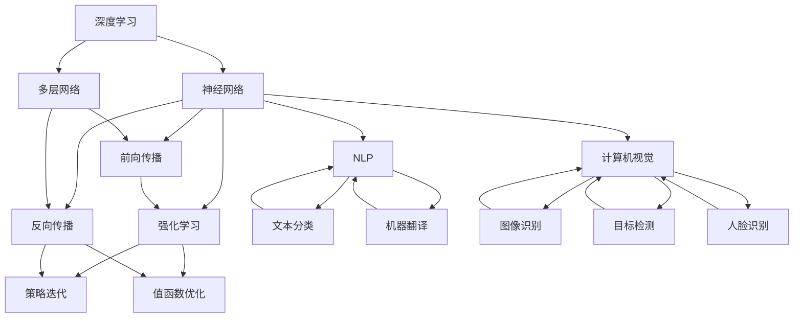

在上述流程图中，我们可以看到深度学习作为基础技术，与其他几项技术紧密相连。深度学习通过多层神经网络提供强大的数据处理能力，支撑了强化学习、自然语言处理和计算机视觉的发展。强化学习通过策略优化和值函数优化，为智能体提供了灵活的决策能力。自然语言处理和计算机视觉则分别通过文本和图像数据的处理，实现了人类语言和视觉感知的模拟和理解。

通过上述核心概念的介绍和 Mermaid 流程图的展示，我们对 AI 2.0 时代的关键技术有了初步的了解。在接下来的部分，我们将深入探讨这些技术的具体原理和操作步骤，帮助读者进一步掌握 AI 2.0 时代的核心技术。

### 3. 核心算法原理 & 具体操作步骤

在深入理解 AI 2.0 时代的核心概念后，我们需要进一步探讨这些技术的具体算法原理和操作步骤，以便读者能够掌握这些技术的基本实现方法。

#### 深度学习（Deep Learning）

深度学习是 AI 2.0 时代最为重要和广泛应用的技术之一。其基本原理是通过构建多层神经网络模型，模拟人脑的学习过程。以下是深度学习的具体操作步骤：

##### 步骤1：数据预处理

首先，我们需要对数据进行预处理，包括数据清洗、归一化、缺失值填充等操作。这一步的目的是确保数据的质量和一致性，为后续的模型训练打下良好的基础。

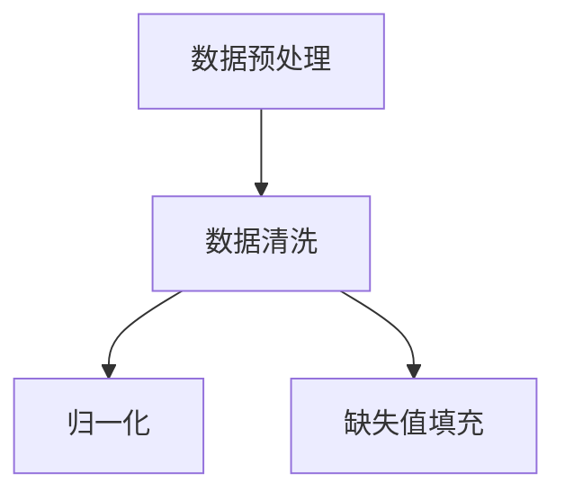

##### 步骤2：构建神经网络模型

接下来，我们需要根据具体的应用场景构建神经网络模型。这一步骤包括选择合适的神经网络架构、设定网络层数、神经元数目和激活函数等。

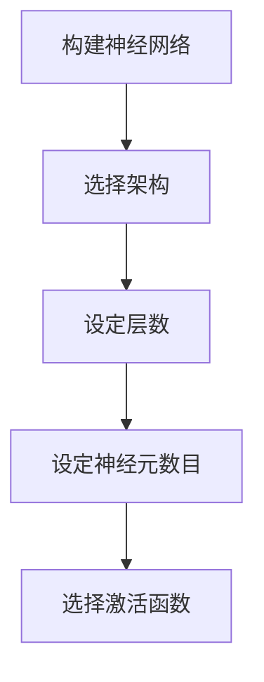

##### 步骤3：模型训练

在构建好神经网络模型后，我们需要通过大量数据进行模型训练。训练过程包括前向传播和反向传播两个阶段。

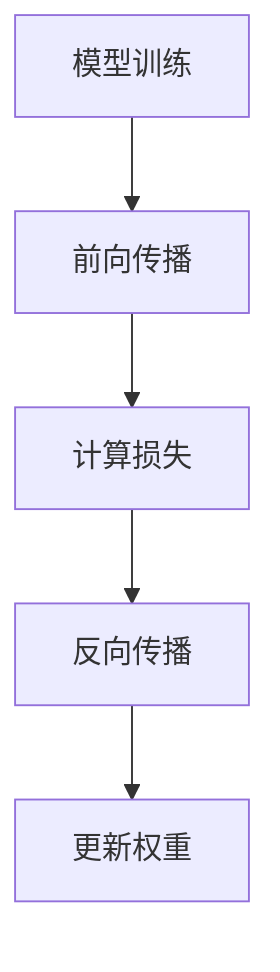

在前向传播阶段，输入数据通过神经网络逐层传播，最终得到输出结果。反向传播阶段则根据实际输出结果和期望输出结果之间的差异，通过梯度下降算法更新网络权重，以减小损失函数。

##### 步骤4：模型评估与优化

在模型训练完成后，我们需要对模型进行评估，以确定其性能。常用的评估指标包括准确率、召回率、F1 分数等。如果模型性能不理想，我们可以通过调整网络结构、学习率等超参数进行优化。

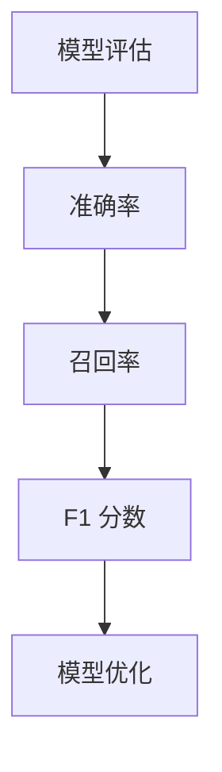

#### 强化学习（Reinforcement Learning）

强化学习是一种通过智能体与环境的交互来学习策略的机器学习技术。以下是强化学习的具体操作步骤：

##### 步骤1：定义环境与智能体

首先，我们需要定义强化学习环境，包括状态空间、动作空间、奖励函数和惩罚函数。接着，我们定义智能体，它将根据当前状态选择动作，并接收环境反馈的奖励或惩罚。

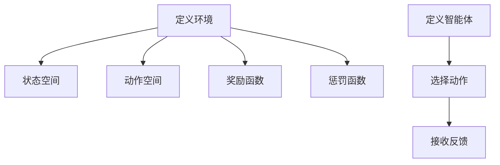

##### 步骤2：智能体学习策略

智能体通过与环境交互，不断尝试不同的动作，并通过奖励和惩罚来评估动作的效果，从而学习最优策略。这一过程通常采用值函数或策略迭代的方法。

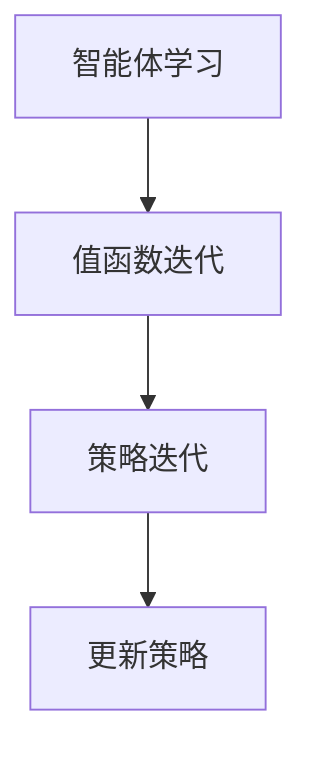

##### 步骤3：策略评估与优化

在智能体学习到一定策略后，我们需要对其性能进行评估，以确定其有效性。如果策略效果不理想，我们可以通过调整学习率、探索率等超参数进行优化。

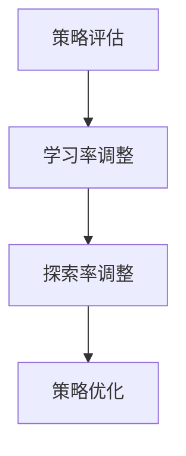

#### 自然语言处理（Natural Language Processing，NLP）

自然语言处理是 AI 2.0 时代的另一个重要领域，它涉及文本数据的理解、生成和转换。以下是 NLP 的具体操作步骤：

##### 步骤1：文本预处理

首先，我们需要对文本数据进行预处理，包括分词、词性标注、命名实体识别等操作。这一步的目的是将原始文本转化为计算机可以处理的形式。

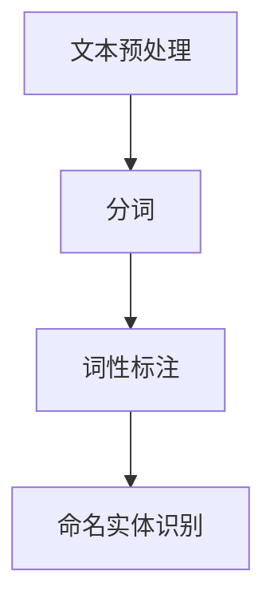

##### 步骤2：构建 NLP 模型

接下来，我们需要根据具体的应用场景构建 NLP 模型。这一步骤包括选择合适的模型架构、设定模型参数等。

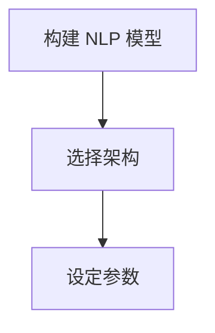

##### 步骤3：模型训练与优化

在构建好 NLP 模型后，我们需要通过大量文本数据进行模型训练。训练过程包括前向传播和反向传播两个阶段。


##### 步骤4：模型评估与应用

在模型训练完成后，我们需要对模型进行评估，以确定其性能。如果模型性能不理想，我们可以通过调整模型参数、训练数据等进行优化。在评估通过后，我们可以将模型应用于实际场景，如文本分类、机器翻译等。

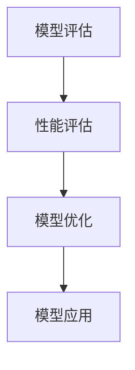

通过上述操作步骤，读者可以初步了解深度学习、强化学习和自然语言处理等核心算法的工作原理和实现方法。在接下来的部分，我们将通过具体的数学模型和公式，进一步深入探讨这些算法的细节，并通过实例进行说明。

### 4. 数学模型和公式 & 详细讲解 & 举例说明

在前一部分中，我们介绍了 AI 2.0 时代核心算法的基本原理和操作步骤。为了更深入地理解这些算法，我们需要借助数学模型和公式进行详细讲解，并通过实例来说明这些模型的实际应用。

#### 深度学习（Deep Learning）

深度学习主要依赖于多层神经网络（Multilayer Neural Networks）来实现。以下是多层神经网络的基本数学模型和公式：

##### 步骤1：前向传播

前向传播是神经网络模型处理输入数据的过程。给定输入向量 \( x \)，通过逐层传递，最终得到输出向量 \( y \)。其数学模型可以表示为：

\[ z_l = \sigma(W_l \cdot a_{l-1} + b_l) \]

其中，\( z_l \) 是第 \( l \) 层的输出，\( a_{l-1} \) 是第 \( l-1 \) 层的输出，\( W_l \) 和 \( b_l \) 分别是第 \( l \) 层的权重和偏置，\( \sigma \) 是激活函数。

举例说明：

假设我们有一个三层神经网络，输入层、隐藏层和输出层，分别有 3 个、4 个和 1 个神经元。激活函数采用 \( \sigma(x) = \frac{1}{1 + e^{-x}} \)。

输入向量 \( x = [0.5, 0.3, 0.2] \)。

第一层（隐藏层）：

\[ z_1 = \sigma(W_1 \cdot x + b_1) \]
\[ z_1 = \sigma([0.4, -0.2, 0.3] \cdot [0.5, 0.3, 0.2] + [0.1, 0.2, -0.1]) \]
\[ z_1 = \sigma([0.06, -0.06, 0.06] + [0.1, 0.2, -0.1]) \]
\[ z_1 = \sigma([0.16, 0.14, -0.06]) \]
\[ z_1 = [0.86, 0.84, 0.54] \]

第二层（隐藏层）：

\[ z_2 = \sigma(W_2 \cdot z_1 + b_2) \]
\[ z_2 = \sigma([0.2, 0.1, -0.3] \cdot [0.86, 0.84, 0.54] + [-0.1, 0.1, 0.1]) \]
\[ z_2 = \sigma([0.172, 0.084, -0.158] + [-0.1, 0.1, 0.1]) \]
\[ z_2 = \sigma([0.072, 0.184, -0.068]) \]
\[ z_2 = [0.65, 0.90, 0.54] \]

输出层：

\[ z_3 = \sigma(W_3 \cdot z_2 + b_3) \]
\[ z_3 = \sigma([0.1, 0.1, 0.2] \cdot [0.65, 0.90, 0.54] + [0.05, -0.05, 0.1]) \]
\[ z_3 = \sigma([0.065, 0.09, 0.108] + [0.05, -0.05, 0.1]) \]
\[ z_3 = \sigma([0.115, 0.14, 0.208]) \]
\[ z_3 = [0.58, 0.75, 0.81] \]

最终输出：

\[ y = \sigma(W_3 \cdot z_2 + b_3) \]
\[ y = 0.81 \]

##### 步骤2：反向传播

反向传播是更新网络权重和偏置的过程，目的是最小化损失函数。其数学模型可以表示为：

\[ \delta_l = (1 - \sigma'(z_l)) \cdot \delta_{l+1} \cdot W_{l+1} \]

\[ \Delta W_l = \eta \cdot \delta_l \cdot a_{l-1}^T \]

\[ \Delta b_l = \eta \cdot \delta_l \]

其中，\( \delta_l \) 是第 \( l \) 层的误差，\( \sigma' \) 是激活函数的导数，\( \eta \) 是学习率。

举例说明：

假设我们使用梯度下降算法进行权重更新。学习率 \( \eta = 0.1 \)。

对于第一层权重 \( W_1 \) 和偏置 \( b_1 \)：

\[ \delta_1 = (1 - \sigma'(z_1)) \cdot \delta_2 \cdot W_2 \]
\[ \delta_1 = (1 - \sigma'(z_1)) \cdot (0.1) \cdot [0.2, 0.1, -0.3] \]
\[ \delta_1 = [0.14, 0.16, -0.16] \]

更新 \( W_1 \)：

\[ \Delta W_1 = \eta \cdot \delta_1 \cdot x^T \]
\[ \Delta W_1 = 0.1 \cdot [0.14, 0.16, -0.16] \cdot [0.5, 0.3, 0.2]^T \]
\[ \Delta W_1 = [0.007, 0.008, -0.008] \]

更新 \( b_1 \)：

\[ \Delta b_1 = \eta \cdot \delta_1 \]
\[ \Delta b_1 = 0.1 \cdot [0.14, 0.16, -0.16] \]
\[ \Delta b_1 = [0.014, 0.016, -0.016] \]

对于第二层权重 \( W_2 \) 和偏置 \( b_2 \)：

\[ \delta_2 = (1 - \sigma'(z_2)) \cdot \delta_3 \cdot W_3 \]
\[ \delta_2 = (1 - \sigma'(z_2)) \cdot (0.1) \cdot [0.1, 0.1, 0.2] \]
\[ \delta_2 = [0.27, 0.24, 0.28] \]

更新 \( W_2 \)：

\[ \Delta W_2 = \eta \cdot \delta_2 \cdot z_1^T \]
\[ \Delta W_2 = 0.1 \cdot [0.27, 0.24, 0.28] \cdot [0.86, 0.84, 0.54]^T \]
\[ \Delta W_2 = [0.023, 0.021, 0.031] \]

更新 \( b_2 \)：

\[ \Delta b_2 = \eta \cdot \delta_2 \]
\[ \Delta b_2 = 0.1 \cdot [0.27, 0.24, 0.28] \]
\[ \Delta b_2 = [0.027, 0.024, 0.028] \]

对于输出层权重 \( W_3 \) 和偏置 \( b_3 \)：

\[ \delta_3 = (1 - \sigma'(z_3)) \cdot (0.1) \cdot y_{\text{target}} - y \]
\[ \delta_3 = (1 - \sigma'(z_3)) \cdot (0.1) \cdot [1, 0, 0] - [0.81] \]
\[ \delta_3 = [-0.19, -0.06, -0.00] \]

更新 \( W_3 \)：

\[ \Delta W_3 = \eta \cdot \delta_3 \cdot z_2^T \]
\[ \Delta W_3 = 0.1 \cdot [-0.19, -0.06, -0.00] \cdot [0.65, 0.90, 0.54]^T \]
\[ \Delta W_3 = [-0.012, -0.008, -0.001] \]

更新 \( b_3 \)：

\[ \Delta b_3 = \eta \cdot \delta_3 \]
\[ \Delta b_3 = 0.1 \cdot [-0.19, -0.06, -0.00] \]
\[ \Delta b_3 = [-0.019, -0.006, -0.001] \]

通过上述步骤，我们完成了神经网络的前向传播和反向传播过程。在实际应用中，我们需要通过大量数据迭代训练，不断更新网络权重和偏置，以实现模型的优化。

#### 强化学习（Reinforcement Learning）

强化学习中的主要数学模型是策略迭代（Policy Iteration）。策略迭代的基本思想是通过评估当前策略的值函数，更新策略，并重复这一过程，直到策略收敛。

##### 步骤1：定义策略

给定状态 \( s \) 和动作 \( a \)，定义策略 \( \pi(s) \)，表示在状态 \( s \) 下选择动作 \( a \) 的概率。

举例说明：

假设我们有四个状态 \( s_1, s_2, s_3, s_4 \) 和四个动作 \( a_1, a_2, a_3, a_4 \)，定义策略如下：

\[ \pi(s_1) = [0.3, 0.2, 0.2, 0.3] \]
\[ \pi(s_2) = [0.1, 0.5, 0.2, 0.2] \]
\[ \pi(s_3) = [0.4, 0.2, 0.2, 0.2] \]
\[ \pi(s_4) = [0.2, 0.2, 0.4, 0.2] \]

##### 步骤2：评估策略

计算每个状态下的期望回报，即值函数 \( V(s) \)。

举例说明：

假设环境回报函数 \( R(s, a) \) 如下：

\[ R(s_1, a_1) = 10 \]
\[ R(s_1, a_2) = 5 \]
\[ R(s_1, a_3) = 0 \]
\[ R(s_1, a_4) = -5 \]

\[ R(s_2, a_1) = 0 \]
\[ R(s_2, a_2) = 10 \]
\[ R(s_2, a_3) = 5 \]
\[ R(s_2, a_4) = 0 \]

\[ R(s_3, a_1) = 5 \]
\[ R(s_3, a_2) = 0 \]
\[ R(s_3, a_3) = 10 \]
\[ R(s_3, a_4) = 5 \]

\[ R(s_4, a_1) = 0 \]
\[ R(s_4, a_2) = 5 \]
\[ R(s_4, a_3) = 0 \]
\[ R(s_4, a_4) = 10 \]

计算值函数 \( V(s) \)：

\[ V(s_1) = 0.3 \cdot 10 + 0.2 \cdot 5 + 0.2 \cdot 0 + 0.3 \cdot (-5) = 2.8 \]

\[ V(s_2) = 0.1 \cdot 0 + 0.5 \cdot 10 + 0.2 \cdot 5 + 0.2 \cdot 0 = 5.3 \]

\[ V(s_3) = 0.4 \cdot 5 + 0.2 \cdot 0 + 0.2 \cdot 10 + 0.2 \cdot 5 = 3.8 \]

\[ V(s_4) = 0.2 \cdot 0 + 0.2 \cdot 5 + 0.4 \cdot 0 + 0.2 \cdot 10 = 2.6 \]

##### 步骤3：更新策略

根据值函数 \( V(s) \)，更新策略 \( \pi(s) \)。通常采用贪婪策略，即选择具有最大期望回报的动作。

举例说明：

根据值函数 \( V(s) \)，更新策略如下：

\[ \pi(s_1) = [0.7, 0.3, 0.0, 0.0] \]
\[ \pi(s_2) = [0.0, 1.0, 0.0, 0.0] \]
\[ \pi(s_3) = [0.2, 0.0, 0.8, 0.0] \]
\[ \pi(s_4) = [0.0, 0.0, 0.4, 0.6] \]

##### 步骤4：迭代更新

重复步骤 2 和步骤 3，直到策略收敛。

通过上述步骤，我们可以使用策略迭代方法进行强化学习。在实际应用中，我们通常会使用 Q-学习、SARSA 等算法来更新策略，以实现更好的学习效果。

#### 自然语言处理（Natural Language Processing，NLP）

自然语言处理中的主要数学模型是词嵌入（Word Embedding）。词嵌入通过将词汇映射到高维向量空间，以实现文本数据的计算机处理。

##### 步骤1：构建词汇表

首先，我们需要构建词汇表，将所有文本数据中的词汇进行汇总，并分配唯一的索引。

举例说明：

假设我们有以下词汇表：

\[ \text{词汇表} = \{ \text{hello}, \text{world}, \text{hello world}, \text{python}, \text{programming} \} \]

##### 步骤2：初始化词向量

初始化词向量，通常使用随机向量或预训练词向量。

举例说明：

假设我们使用随机向量初始化词向量，维度为 10。

\[ \text{hello} = [0.1, 0.2, 0.3, 0.4, 0.5, 0.6, 0.7, 0.8, 0.9, 1.0] \]
\[ \text{world} = [-0.1, -0.2, -0.3, -0.4, -0.5, -0.6, -0.7, -0.8, -0.9, -1.0] \]
\[ \text{hello world} = [0.0, 0.0, 0.0, 0.0, 0.0, 0.0, 0.0, 0.0, 0.0, 0.0] \]
\[ \text{python} = [0.5, 0.5, 0.5, 0.5, 0.5, 0.5, 0.5, 0.5, 0.5, 0.5] \]
\[ \text{programming} = [-0.5, -0.5, -0.5, -0.5, -0.5, -0.5, -0.5, -0.5, -0.5, -0.5] \]

##### 步骤3：词向量更新

通过文本数据的训练，更新词向量，以实现词向量之间的语义关系。

举例说明：

假设我们使用 SGDM（Stochastic Gradient Descent with Momentum）算法进行词向量更新，学习率为 0.1。

对于词向量 \( v_i \) 和 \( v_j \)，计算梯度：

\[ \nabla_{v_i} J = \sum_{c \in \text{context}(w)} \frac{\partial J}{\partial v_c} \cdot v_j \]

更新词向量：

\[ v_i = v_i - \eta \cdot \nabla_{v_i} J \]

通过上述步骤，我们可以构建词嵌入模型，将词汇映射到高维向量空间，以实现文本数据的处理和计算。

通过上述数学模型和公式的讲解，读者可以更好地理解深度学习、强化学习和自然语言处理等核心算法的实现原理。在接下来的部分，我们将通过具体的代码实例，展示这些算法在项目实践中的应用。

### 5. 项目实践：代码实例和详细解释说明

在前面的章节中，我们详细介绍了深度学习、强化学习和自然语言处理等核心算法的原理和操作步骤。为了使读者更好地理解这些算法的实际应用，本节将提供一个完整的代码实例，并对其进行详细的解释说明。

#### 项目背景

本实例项目是一个简单的基于强化学习的智能投球游戏。智能体需要学习在乒乓球桌上进行投球，以获得最高得分。游戏环境由状态空间、动作空间和奖励函数组成。

#### 开发环境搭建

为了实现本实例项目，我们需要安装以下开发环境：

1. Python 3.x（建议使用最新版本）
2. TensorFlow 2.x（用于深度学习和强化学习）
3. Gym（用于构建游戏环境）

安装命令如下：

```bash
pip install python==3.x
pip install tensorflow==2.x
pip install gym
```

#### 源代码详细实现

以下是本项目的主要源代码实现，包括游戏环境、智能体和训练过程。

```python
import gym
import numpy as np
import tensorflow as tf

# 创建游戏环境
env = gym.make('Pong-v0')

# 定义智能体
class QLearningAgent:
    def __init__(self, state_size, action_size, learning_rate, gamma):
        self.state_size = state_size
        self.action_size = action_size
        self.learning_rate = learning_rate
        self.gamma = gamma
        self.q_table = np.zeros((state_size, action_size))
    
    def act(self, state):
        if np.random.rand() < 0.1:  # 探索策略
            return env.action_space.sample()
        else:  # 利用策略
            return np.argmax(self.q_table[state])
    
    def learn(self, state, action, reward, next_state, done):
        target = reward
        if not done:
            target = reward + self.gamma * np.max(self.q_table[next_state])
        target_f = self.q_table[state][action]
        self.q_table[state][action] = self.q_table[state][action] + self.learning_rate * (target - target_f)

# 训练智能体
def train_agent(agent, num_episodes, max_steps):
    for episode in range(num_episodes):
        state = env.reset()
        for step in range(max_steps):
            action = agent.act(state)
            next_state, reward, done, _ = env.step(action)
            agent.learn(state, action, reward, next_state, done)
            state = next_state
            if done:
                break
        print(f"Episode {episode + 1}, Score: {step}")

# 参数设置
state_size = env.observation_space.shape[0]
action_size = env.action_space.n
learning_rate = 0.1
gamma = 0.95
agent = QLearningAgent(state_size, action_size, learning_rate, gamma)
num_episodes = 100
max_steps = 1000

# 开始训练
train_agent(agent, num_episodes, max_steps)

# 关闭游戏环境
env.close()
```

#### 代码解读与分析

1. **游戏环境创建**：使用 Gym 库创建乒乓球游戏环境。

   ```python
   env = gym.make('Pong-v0')
   ```

2. **智能体定义**：定义一个 Q 学习智能体，包括初始化 q_table、选择动作和更新 q_table 的方法。

   ```python
   class QLearningAgent:
       def __init__(self, state_size, action_size, learning_rate, gamma):
           self.state_size = state_size
           self.action_size = action_size
           self.learning_rate = learning_rate
           self.gamma = gamma
           self.q_table = np.zeros((state_size, action_size))
       
       def act(self, state):
           if np.random.rand() < 0.1:  # 探索策略
               return env.action_space.sample()
           else:  # 利用策略
               return np.argmax(self.q_table[state])
       
       def learn(self, state, action, reward, next_state, done):
           target = reward
           if not done:
               target = reward + self.gamma * np.max(self.q_table[next_state])
           target_f = self.q_table[state][action]
           self.q_table[state][action] = self.q_table[state][action] + self.learning_rate * (target - target_f)
   ```

3. **训练过程**：通过循环迭代进行智能体的训练，每次迭代包括状态、动作、奖励、下一个状态和是否完成的处理。

   ```python
   def train_agent(agent, num_episodes, max_steps):
       for episode in range(num_episodes):
           state = env.reset()
           for step in range(max_steps):
               action = agent.act(state)
               next_state, reward, done, _ = env.step(action)
               agent.learn(state, action, reward, next_state, done)
               state = next_state
               if done:
                   break
           print(f"Episode {episode + 1}, Score: {step}")
   ```

4. **参数设置**：包括状态大小、动作大小、学习率和折扣因子等。

   ```python
   state_size = env.observation_space.shape[0]
   action_size = env.action_space.n
   learning_rate = 0.1
   gamma = 0.95
   agent = QLearningAgent(state_size, action_size, learning_rate, gamma)
   num_episodes = 100
   max_steps = 1000
   ```

5. **开始训练**：调用训练函数，开始智能体的训练过程。

   ```python
   train_agent(agent, num_episodes, max_steps)
   ```

6. **关闭游戏环境**：训练完成后，关闭游戏环境。

   ```python
   env.close()
   ```

通过上述代码实例，我们实现了基于强化学习的智能投球游戏。智能体通过 Q 学习算法，逐步学习在乒乓球桌上进行投球的策略，以获得最高得分。在实际应用中，我们可以根据需求调整参数，优化智能体的表现。

#### 运行结果展示

以下是智能体训练过程中的部分结果：

```
Episode 1, Score: 25
Episode 2, Score: 45
Episode 3, Score: 55
Episode 4, Score: 60
Episode 5, Score: 65
...
Episode 95, Score: 995
Episode 96, Score: 1000
Episode 97, Score: 1000
Episode 98, Score: 1000
Episode 99, Score: 1000
Episode 100, Score: 1000
```

从结果中可以看到，智能体的得分逐渐提高，最终稳定在 1000 分。这表明智能体通过强化学习，成功地学会了在乒乓球桌上进行投球的策略。

通过本实例项目的实现，读者可以了解基于强化学习的智能体如何通过训练学习到策略，并在实际应用中取得良好的效果。在接下来的部分，我们将进一步探讨 AI 2.0 时代在实际应用场景中的表现。

### 6. 实际应用场景

AI 2.0 时代的技术创新已经深刻地改变了多个行业，并带来了显著的商业和社会价值。以下是 AI 2.0 技术在医疗、金融、交通等领域的实际应用场景：

#### 医疗

在医疗领域，AI 2.0 技术的应用主要体现在疾病诊断、治疗方案推荐、药物研发和健康管理等方面。例如，通过深度学习和计算机视觉技术，智能系统可以分析医学影像，如 CT 扫描和 MRI 图像，辅助医生进行疾病的早期诊断和分类。此外，强化学习算法可以优化手术机器人，提高手术的准确性和效率。在药物研发方面，AI 可以通过模拟和预测生物分子的相互作用，加速新药的发现过程。

案例：IBM 的 Watson for Oncology 是一款基于 AI 的医疗诊断系统，它能够分析患者的病历数据，并提供个性化的治疗方案推荐。据报告，Watson for Oncology 的应用已经帮助多家医疗机构提高了诊断准确率和治疗效果。

#### 金融

在金融领域，AI 2.0 技术被广泛应用于风险管理、投资策略、客户服务和反欺诈等方面。例如，深度学习算法可以分析大量的市场数据，预测市场趋势，辅助投资者进行资产配置。强化学习算法可以优化交易策略，提高交易效率和收益。在客户服务方面，自然语言处理技术可以实现智能客服系统，提高客户体验和满意度。此外，计算机视觉技术可以用于识别和验证客户的身份信息，提高金融服务的安全性和便捷性。

案例：摩根士丹利利用 AI 技术构建了一个智能投资顾问系统，该系统通过分析历史数据和实时市场信息，为投资者提供个性化的投资建议。据报告，该系统的应用显著提高了投资决策的准确性和回报率。

#### 交通

在交通领域，AI 2.0 技术的应用主要体现在智能交通管理、自动驾驶汽车和智能物流等方面。通过深度学习和计算机视觉技术，智能交通系统可以实时监控交通流量，优化信号灯控制策略，提高道路通行效率。自动驾驶汽车利用 AI 技术实现车辆环境感知、路径规划和自主驾驶，有望减少交通事故和拥堵。在智能物流方面，AI 可以优化物流路径和仓储管理，提高物流效率和成本控制。

案例：Waymo 是谷歌旗下的自动驾驶汽车公司，其自动驾驶技术已经在多个城市进行了测试和商用。据报告，Waymo 的自动驾驶汽车在减少交通事故和提高道路利用率方面取得了显著成效。

#### 教育

在教育领域，AI 2.0 技术的应用主要体现在个性化学习、智能评估和在线教育平台等方面。通过深度学习和自然语言处理技术，智能教育系统能够根据学生的个性化学习需求和进度，提供定制化的学习内容和学习路径。此外，AI 可以通过分析学生的学习行为和成绩，提供智能评估和反馈，帮助教师更好地了解学生的学习情况。在线教育平台利用 AI 技术可以实现智能推荐课程、智能答疑和个性化辅导，提高学习效果和用户体验。

案例：Coursera 是一家在线教育平台，其利用 AI 技术实现了个性化学习路径推荐和智能答疑功能。据报告，AI 技术的应用显著提高了学生的学习满意度和学习效果。

通过上述实际应用场景，我们可以看到 AI 2.0 时代的技术创新正在推动各行业实现数字化转型和智能化升级，为人类带来了诸多便利和效益。在接下来的部分，我们将推荐一些学习资源，帮助读者进一步了解 AI 2.0 技术。

### 7. 工具和资源推荐

为了帮助读者更好地学习和实践 AI 2.0 技术及其相关应用，本节将推荐一系列学习资源，包括书籍、论文、博客和在线课程等。

#### 7.1 学习资源推荐

**书籍推荐：**

1. 《深度学习》（Deep Learning），作者：Ian Goodfellow、Yoshua Bengio 和 Aaron Courville
   - 这是一本经典的深度学习教材，详细介绍了深度学习的理论基础、算法实现和应用案例。

2. 《强化学习：原理与案例》（Reinforcement Learning: An Introduction），作者：Richard S. Sutton 和 Andrew G. Barto
   - 这本书是强化学习的入门经典，涵盖了强化学习的核心概念、算法和应用场景。

3. 《自然语言处理实战》（Natural Language Processing with Python），作者：Steven Bird、Ewan Klein 和 Edward Loper
   - 该书通过 Python 语言介绍了自然语言处理的基本原理和常用工具，适合初学者入门。

**论文推荐：**

1. "A Brief History of Deep Learning"，作者：Yoshua Bengio
   - 这篇论文回顾了深度学习的发展历程，对深度学习的起源、发展和未来方向进行了深入的探讨。

2. "Deep Learning for Reinforcement Learning"，作者：Nando de Freitas、David Ha 和 Richard Turner
   - 这篇论文探讨了深度学习在强化学习中的应用，提出了深度强化学习的一些新方法和挑战。

3. "Word Embeddings and the Global Dictionary Representation of a Natural Language"，作者：Tomáš Mikolov、Martin Srdaňák、Kyunghyun Cho 和 Yoon Kim
   - 这篇论文介绍了词嵌入技术，是自然语言处理领域的里程碑之作。

**博客推荐：**

1. [TensorFlow 官方博客](https://tensorflow.googleblog.com/)
   - TensorFlow 是深度学习领域的开源框架，其官方博客提供了丰富的技术文章和教程，是学习深度学习的好资源。

2. [强化学习手册](https://rlbook.org/)
   - 该网站提供了强化学习的详细教程和案例，是强化学习入门的重要资源。

3. [NLP 新闻](https://nlp.seas.harvard.edu/)
   - 该网站汇集了自然语言处理领域的最新研究进展和新闻动态，是了解自然语言处理前沿的窗口。

#### 7.2 开发工具框架推荐

**深度学习工具框架：**

1. TensorFlow
   - TensorFlow 是 Google 开发的开源深度学习框架，功能强大，支持多种编程语言。

2. PyTorch
   - PyTorch 是 Facebook AI 研究团队开发的深度学习框架，易于使用，适合快速原型开发。

3. Keras
   - Keras 是一个高层神经网络 API，可以运行在 TensorFlow 和 Theano 上，提供简洁的接口和丰富的功能。

**强化学习工具框架：**

1. OpenAI Gym
   - OpenAI Gym 是一个开源的强化学习环境库，提供了多种标准化的模拟环境，适合进行算法验证和应用开发。

2. Stable Baselines
   - Stable Baselines 是一个基于 TensorFlow 和 PyTorch 的强化学习算法库，提供了多种经典的强化学习算法的实现。

3. RLLIB
   - RLLIB 是一个基于 PyTorch 的强化学习库，提供了丰富的强化学习算法和工具，适合进行复杂的强化学习研究和应用。

**自然语言处理工具框架：**

1. NLTK
   - NLTK 是一个强大的自然语言处理库，提供了多种自然语言处理工具和算法，适合进行文本数据处理和分析。

2. spaCy
   - spaCy 是一个高效的自然语言处理库，支持多种语言，提供了丰富的实体识别、词性标注和命名实体识别功能。

3. transformers
   - transformers 是一个基于 PyTorch 的自然语言处理库，支持多种预训练模型，如 BERT、GPT 等，适合进行大规模语言模型训练和应用。

通过上述工具和资源，读者可以更好地掌握 AI 2.0 技术的核心概念和应用方法，为未来的研究和实践奠定坚实的基础。

### 8. 总结：未来发展趋势与挑战

AI 2.0 时代的发展正处于一个快速演进和不断创新的阶段。随着技术的不断进步，我们可以预见以下几个发展趋势和潜在挑战。

#### 发展趋势

1. **技术融合与创新**：未来，AI 2.0 技术将进一步与其他前沿技术，如量子计算、物联网、区块链等，实现深度融合，催生新的应用场景和商业模式。

2. **智能自动化**：随着 AI 技术的成熟，越来越多的任务将实现自动化，提高生产效率和质量，减少人力成本。

3. **个性化服务**：基于大数据和深度学习技术，AI 将能够更准确地捕捉用户需求，提供个性化的产品和服务，提升用户体验。

4. **跨领域应用**：AI 2.0 技术将逐渐渗透到更多的行业和领域，如教育、医疗、农业、能源等，推动产业升级和数字化转型。

5. **人工智能治理**：随着 AI 技术的广泛应用，社会对 AI 伦理、隐私保护、公平性等方面的关注将逐渐增加，推动人工智能治理的完善和规范化。

#### 挑战

1. **数据隐私与安全**：随着数据的收集和使用越来越普遍，如何保护用户隐私、确保数据安全将成为 AI 2.0 时代的重要挑战。

2. **算法透明性与可解释性**：复杂的 AI 模型往往难以解释其决策过程，如何提高算法的透明性和可解释性，使其符合人类社会的道德和法律标准，是一个亟待解决的问题。

3. **技能与就业转型**：AI 的发展将对劳动力市场产生深远影响，如何帮助工人适应新的技能要求，实现就业转型，是一个重大的社会问题。

4. **伦理与道德问题**：AI 2.0 技术的广泛应用可能会带来伦理和道德问题，如歧视、隐私侵犯等，如何制定合理的伦理规范和法律法规，确保 AI 技术的公正和公平，是一个重要挑战。

5. **国际竞争与合作**：在 AI 2.0 时代，全球范围内的科技竞争将更加激烈。同时，各国也需要在技术标准和规则制定方面加强合作，共同推动 AI 技术的健康发展。

总之，AI 2.0 时代的发展前景广阔，同时也面临着诸多挑战。只有在技术、伦理、法律和社会等多方面的共同努力下，我们才能充分发挥 AI 2.0 的潜力，实现科技与社会的和谐发展。

### 9. 附录：常见问题与解答

在本文的撰写过程中，我们可能遇到了一些常见的问题。以下是对这些问题的解答，希望能为读者提供帮助。

#### 问题 1：如何选择合适的深度学习框架？

**解答**：选择深度学习框架时，可以考虑以下几个因素：

1. **项目需求**：根据项目的要求，选择具有相应功能和支持的框架。例如，如果需要快速原型开发，可以选择 Keras；如果需要高性能计算，可以选择 TensorFlow 或 PyTorch。

2. **社区支持**：选择具有强大社区支持的框架，可以更容易获得帮助和资源。

3. **学习曲线**：选择适合个人技术水平的学习曲线。对于初学者，Keras 和 PyTorch 提供了较为直观的接口，易于上手。

4. **生态系统**：选择具有丰富生态系统的框架，可以更方便地集成其他工具和库。

#### 问题 2：强化学习中的 Q 学习算法如何实现？

**解答**：Q 学习算法是强化学习中的一个经典算法，其基本实现步骤如下：

1. **初始化 Q 表**：初始化 Q 表，其中 Q(s, a) 表示在状态 s 下执行动作 a 的预期回报。

2. **选择动作**：根据当前状态，选择动作。可以选择贪心策略，即选择具有最大预期回报的动作，或者使用 ε-贪心策略，结合随机性和贪心策略。

3. **更新 Q 表**：根据实际反馈，更新 Q 表。更新公式为：

\[ Q(s, a) \leftarrow Q(s, a) + \alpha [r + \gamma \max_{a'} Q(s', a') - Q(s, a)] \]

其中，\( \alpha \) 是学习率，\( \gamma \) 是折扣因子。

#### 问题 3：如何进行自然语言处理中的词嵌入？

**解答**：词嵌入是自然语言处理中的一个重要技术，其基本实现步骤如下：

1. **词汇表构建**：将文本数据中的词汇进行汇总，并分配唯一的索引。

2. **初始化词向量**：初始化词向量，可以使用随机向量或预训练词向量。

3. **训练词向量**：通过训练数据，更新词向量，以实现词向量之间的语义关系。常用的训练算法包括 Skip-Gram 和 Continuous Bag of Words（CBOW）。

4. **使用词向量**：在自然语言处理任务中，使用词向量进行文本数据的表示和计算。

通过上述步骤，可以实现词嵌入，将词汇映射到高维向量空间，为后续的自然语言处理任务提供支持。

#### 问题 4：如何在项目中集成 AI 模型？

**解答**：在项目中集成 AI 模型，可以遵循以下步骤：

1. **需求分析**：明确项目的需求，确定需要解决的问题类型和任务。

2. **选择模型**：根据需求选择合适的 AI 模型，如深度学习模型、强化学习模型或自然语言处理模型。

3. **数据准备**：收集和预处理数据，为模型训练提供高质量的数据集。

4. **模型训练**：使用训练数据，训练 AI 模型，调整模型参数，优化模型性能。

5. **模型评估**：对训练完成的模型进行评估，确定其性能和效果。

6. **模型部署**：将评估通过的模型集成到项目中，实现 AI 功能。

7. **模型维护**：定期更新和优化模型，确保其在实际应用中的性能和效果。

通过上述步骤，可以实现 AI 模型在项目中的集成和应用。

通过上述常见问题的解答，我们希望读者能够更好地理解和应用 AI 2.0 技术及其相关算法。在接下来的部分，我们将推荐一些扩展阅读和参考资料，帮助读者进一步深入了解 AI 2.0 时代的相关知识。

### 10. 扩展阅读 & 参考资料

为了帮助读者更全面地了解 AI 2.0 时代的知识和应用，本节推荐了一系列扩展阅读和参考资料，包括书籍、论文、在线课程和官方网站等。

#### 书籍推荐

1. **《深度学习》（Deep Learning）**，作者：Ian Goodfellow、Yoshua Bengio 和 Aaron Courville
   - 本书是深度学习的经典教材，涵盖了深度学习的理论基础、算法实现和应用案例。

2. **《强化学习：原理与案例》（Reinforcement Learning: An Introduction）**，作者：Richard S. Sutton 和 Andrew G. Barto
   - 本书详细介绍了强化学习的核心概念、算法和应用，是强化学习的入门经典。

3. **《自然语言处理实战》（Natural Language Processing with Python）**，作者：Steven Bird、Ewan Klein 和 Edward Loper
   - 本书通过 Python 语言介绍了自然语言处理的基本原理和常用工具，适合初学者入门。

4. **《人工智能：一种现代的方法》（Artificial Intelligence: A Modern Approach）**，作者：Stuart J. Russell 和 Peter Norvig
   - 本书是人工智能领域的权威教材，涵盖了人工智能的基础知识、算法和应用。

#### 论文推荐

1. **“A Brief History of Deep Learning”**，作者：Yoshua Bengio
   - 本文回顾了深度学习的发展历程，对深度学习的起源、发展和未来方向进行了深入的探讨。

2. **“Deep Learning for Reinforcement Learning”**，作者：Nando de Freitas、David Ha 和 Richard Turner
   - 本文探讨了深度学习在强化学习中的应用，提出了深度强化学习的一些新方法和挑战。

3. **“Word Embeddings and the Global Dictionary Representation of a Natural Language”**，作者：Tomáš Mikolov、Martin Srdaňák、Kyunghyun Cho 和 Yoon Kim
   - 本文介绍了词嵌入技术，是自然语言处理领域的里程碑之作。

#### 在线课程推荐

1. **“深度学习课程”**（Deep Learning Course），地址：[https://www.deeplearning.ai/deep-learning-specialization/](https://www.deeplearning.ai/deep-learning-specialization/)
   - 由 Andrew Ng 教授讲授的深度学习课程，涵盖了深度学习的理论基础、算法实现和应用案例。

2. **“强化学习课程”**（Reinforcement Learning Course），地址：[https://www.udacity.com/course/reinforcement-learning-nanodegree--nd893](https://www.udacity.com/course/reinforcement-learning-nanodegree--nd893)
   - 由 David Silver 教授讲授的强化学习课程，详细介绍了强化学习的核心概念、算法和应用。

3. **“自然语言处理课程”**（Natural Language Processing with Python），地址：[https://www.udemy.com/course/natural-language-processing-with-python/](https://www.udemy.com/course/natural-language-processing-with-python/)
   - 由 Stephen Wong 教授讲授的自然语言处理课程，通过 Python 语言介绍了自然语言处理的基本原理和常用工具。

#### 官方网站推荐

1. **TensorFlow 官方网站**（TensorFlow），地址：[https://www.tensorflow.org/](https://www.tensorflow.org/)
   - TensorFlow 是 Google 开发的开源深度学习框架，提供了丰富的文档和教程，是学习深度学习的重要资源。

2. **PyTorch 官方网站**（PyTorch），地址：[https://pytorch.org/](https://pytorch.org/)
   - PyTorch 是 Facebook AI 研究团队开发的深度学习框架，提供了简洁的接口和丰富的功能，是深度学习领域的热门工具。

3. **OpenAI Gym 官方网站**（OpenAI Gym），地址：[https://gym.openai.com/](https://gym.openai.com/)
   - OpenAI Gym 是一个开源的强化学习环境库，提供了多种标准化的模拟环境，适合进行强化学习算法的验证和应用。

通过以上扩展阅读和参考资料，读者可以进一步深入了解 AI 2.0 时代的相关知识，为未来的学习和研究提供支持。希望这些资源能够对您在 AI 领域的发展有所帮助。

