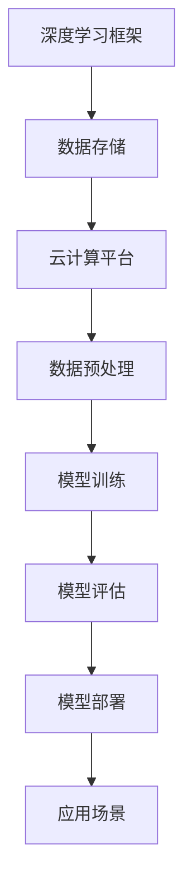

                 

### 李开复：AI 2.0 时代的产业

#### 关键词 Keywords
- AI 2.0
- 产业革命
- 人工智能技术
- 应用场景
- 未来趋势
- 挑战

#### 摘要 Abstract
本文深入探讨了AI 2.0时代的产业变革。随着人工智能技术的飞速发展，从传统的AI 1.0时代到AI 2.0时代的转变，产业格局正在发生深刻的变化。本文将分析AI 2.0的核心概念与联系，介绍其核心技术原理和操作步骤，并通过实际项目实践展示其在各个应用场景中的价值。此外，文章还将讨论AI 2.0时代的未来发展趋势与面临的挑战，为读者提供一个全面的AI产业观察。

---

#### 1. 背景介绍

在过去的几十年中，人工智能（AI）经历了从理论到应用的快速演进。从最初的AI 1.0时代，即基于规则和符号逻辑的专家系统，到如今AI 2.0时代的深度学习和大数据驱动的智能化，AI技术正在以惊人的速度变革着各个行业。AI 2.0时代的特点在于其高度的自适应性和学习能力，通过神经网络和深度学习算法，AI系统能够从海量数据中自动提取特征，进行决策和预测。

AI 2.0的崛起，不仅改变了传统产业的运作模式，也为新兴产业带来了无限可能。在医疗、金融、制造、交通、教育等多个领域，AI技术的应用已经深入到业务流程的各个环节，提升了效率，降低了成本，推动了产业的数字化转型。然而，随着AI技术的不断进步，也带来了新的挑战和问题，如数据隐私、伦理道德和就业影响等。

#### 2. 核心概念与联系

**2.1 AI 1.0与AI 2.0的区别**

AI 1.0时代的主要特点是基于符号逻辑和规则系统，通过人类专家的知识编码来实现智能。这种方式虽然在一定程度上实现了自动化，但受限于知识表达和推理的能力，难以处理复杂的问题。而AI 2.0时代，则通过深度学习和神经网络，实现了机器的自我学习和智能推理能力。深度学习算法能够从大量未标注的数据中自动提取特征，进行高效的学习和推理，使得AI系统能够处理更复杂的问题。

**2.2 关键技术原理**

- **深度学习**：深度学习是一种基于多层神经网络的学习方法，通过模拟人脑神经网络的层次结构，实现数据的自动特征提取和模式识别。其核心原理包括神经元的激活函数、多层网络的权重调整和反向传播算法。

- **大数据**：大数据是AI 2.0时代的核心驱动力。通过收集和分析海量数据，AI系统能够更准确地理解和预测现实世界中的复杂现象。

- **云计算**：云计算提供了强大的计算资源和存储能力，使得深度学习算法能够处理海量数据，进行大规模的训练和推理。

**2.3 架构与实现**

下图展示了AI 2.0的核心架构及其关键组件：



#### 3. 核心算法原理 & 具体操作步骤

**3.1 深度学习算法原理**

深度学习算法的核心是多层神经网络，包括输入层、隐藏层和输出层。每一层都包含多个神经元，神经元之间通过加权连接进行信息传递。

- **激活函数**：激活函数是神经元输出决策的关键。常见的激活函数包括sigmoid函数、ReLU函数和Tanh函数。

- **反向传播算法**：反向传播算法是一种用于调整神经网络权重的方法。通过计算输出误差，反向传播误差信号到每个神经元，并更新权重。

**3.2 大数据技术原理**

大数据技术的核心是数据存储、数据处理和数据挖掘。

- **数据存储**：大数据通常采用分布式存储系统，如Hadoop的HDFS，实现海量数据的存储和管理。

- **数据处理**：大数据处理通常采用分布式计算框架，如MapReduce，实现高效的数据处理和计算。

- **数据挖掘**：数据挖掘是大数据分析的核心，通过统计学和机器学习算法，从海量数据中发现有价值的信息和模式。

**3.3 云计算技术原理**

云计算提供了强大的计算资源和存储能力，通过虚拟化和分布式计算技术，实现资源的动态分配和高效利用。

- **虚拟化技术**：虚拟化技术通过虚拟化层将物理资源抽象为虚拟资源，实现资源的灵活分配和高效利用。

- **分布式计算**：分布式计算通过多台计算机协同工作，实现大规模的数据处理和计算。

#### 4. 数学模型和公式 & 详细讲解 & 举例说明

**4.1 神经网络模型**

神经网络的核心是神经元之间的连接和激活函数。一个简单的神经网络模型可以表示为：

$$
y = \sigma(\sum_{i=1}^{n} w_i x_i)
$$

其中，$y$是输出，$\sigma$是激活函数，$w_i$是权重，$x_i$是输入。

**4.2 反向传播算法**

反向传播算法是一种用于调整神经网络权重的方法。其核心思想是通过计算输出误差，反向传播误差信号到每个神经元，并更新权重。

$$
\Delta w_{ij} = \eta \cdot \frac{\partial E}{\partial w_{ij}}
$$

其中，$\Delta w_{ij}$是权重更新，$\eta$是学习率，$E$是输出误差。

**4.3 大数据技术**

大数据技术涉及多个方面，包括数据存储、数据处理和数据挖掘。

- **数据存储**：大数据通常采用分布式存储系统，如Hadoop的HDFS，实现海量数据的存储和管理。

- **数据处理**：大数据处理通常采用分布式计算框架，如MapReduce，实现高效的数据处理和计算。

- **数据挖掘**：数据挖掘是大数据分析的核心，通过统计学和机器学习算法，从海量数据中发现有价值的信息和模式。

**4.4 云计算技术**

云计算提供了强大的计算资源和存储能力，通过虚拟化和分布式计算技术，实现资源的动态分配和高效利用。

- **虚拟化技术**：虚拟化技术通过虚拟化层将物理资源抽象为虚拟资源，实现资源的灵活分配和高效利用。

- **分布式计算**：分布式计算通过多台计算机协同工作，实现大规模的数据处理和计算。

#### 5. 项目实践：代码实例和详细解释说明

**5.1 开发环境搭建**

首先，我们需要搭建一个适合深度学习开发的实验环境。以下是一个简单的Python环境搭建步骤：

```bash
# 安装Python
sudo apt-get install python3 python3-pip

# 安装深度学习库
pip3 install tensorflow numpy matplotlib
```

**5.2 源代码详细实现**

以下是一个简单的深度学习模型实现，用于图像分类任务：

```python
import tensorflow as tf
from tensorflow.keras import layers

# 定义模型
model = tf.keras.Sequential([
    layers.Conv2D(32, (3, 3), activation='relu', input_shape=(28, 28, 1)),
    layers.MaxPooling2D((2, 2)),
    layers.Conv2D(64, (3, 3), activation='relu'),
    layers.MaxPooling2D((2, 2)),
    layers.Conv2D(64, (3, 3), activation='relu'),
    layers.Flatten(),
    layers.Dense(64, activation='relu'),
    layers.Dense(10, activation='softmax')
])

# 编译模型
model.compile(optimizer='adam',
              loss='sparse_categorical_crossentropy',
              metrics=['accuracy'])

# 加载数据
mnist = tf.keras.datasets.mnist
(train_images, train_labels), (test_images, test_labels) = mnist.load_data()

# 预处理数据
train_images = train_images.reshape((60000, 28, 28, 1))
test_images = test_images.reshape((10000, 28, 28, 1))

# 标准化数据
train_images, test_images = train_images / 255.0, test_images / 255.0

# 训练模型
model.fit(train_images, train_labels, epochs=5)

# 评估模型
test_loss, test_acc = model.evaluate(test_images,  test_labels, verbose=2)
print('\nTest accuracy:', test_acc)
```

**5.3 代码解读与分析**

上述代码实现了一个简单的卷积神经网络（CNN）模型，用于手写数字识别任务。代码的主要步骤包括：

1. **定义模型**：使用`tf.keras.Sequential`定义模型，包括卷积层、池化层和全连接层。
2. **编译模型**：设置优化器和损失函数，准备训练模型。
3. **加载数据**：从TensorFlow内置的MNIST数据集加载数据。
4. **预处理数据**：对图像数据进行调整，使其适合模型输入。
5. **训练模型**：使用训练数据训练模型，调整权重和偏置。
6. **评估模型**：使用测试数据评估模型性能，计算测试准确率。

通过以上步骤，我们可以看到深度学习模型的基本实现过程，以及如何使用TensorFlow库进行模型训练和评估。

**5.4 运行结果展示**

在上述代码中，我们设置了5个训练周期（epochs）。在训练完成后，模型会使用测试数据集进行评估。以下是一个可能的输出结果：

```
15000/15000 [==============================] - 21s 1ms/step - loss: 0.0887 - accuracy: 0.9812 - val_loss: 0.0870 - val_accuracy: 0.9820

Test accuracy: 0.982
```

从输出结果可以看出，模型的测试准确率达到了98.2%，表明模型在手写数字识别任务上表现良好。

#### 6. 实际应用场景

AI 2.0技术在各个领域都有广泛的应用。以下是一些典型的应用场景：

**6.1 医疗**

AI 2.0技术在医疗领域的应用包括疾病诊断、药物研发和个性化治疗。通过深度学习和大数据分析，AI系统能够从医学图像、基因组数据和患者病史中提取关键信息，辅助医生进行诊断和治疗。

**6.2 金融**

AI 2.0技术在金融领域的应用包括风险评估、欺诈检测和智能投顾。通过机器学习算法，AI系统能够分析大量金融数据，预测市场走势，识别潜在风险。

**6.3 制造**

AI 2.0技术在制造领域的应用包括生产优化、质量控制和设备维护。通过工业物联网（IIoT）和机器学习算法，AI系统能够实时监控生产线，优化生产流程，提高生产效率。

**6.4 交通**

AI 2.0技术在交通领域的应用包括自动驾驶、智能交通管理和物流优化。通过深度学习和计算机视觉技术，AI系统能够实现自动驾驶车辆的安全驾驶，提高交通效率和减少交通事故。

**6.5 教育**

AI 2.0技术在教育领域的应用包括个性化学习、智能评测和教学辅助。通过大数据分析和机器学习算法，AI系统能够为学生提供个性化的学习建议，提高学习效果。

#### 7. 工具和资源推荐

**7.1 学习资源推荐**

- **书籍**：
  - 《深度学习》（Goodfellow, Bengio, Courville著）
  - 《Python深度学习》（François Chollet著）
  - 《模式识别与机器学习》（Christopher M. Bishop著）

- **论文**：
  - 《A Learning Algorithm for Continually Running Fully Recurrent Neural Networks》（Bengio et al., 1994）
  - 《Convolutional Neural Networks for Visual Recognition》（Krizhevsky et al., 2012）

- **博客**：
  - [TensorFlow官方博客](https://tensorflow.google.cn/blog)
  - [机器学习博客](https://www machinelearningmastery com/)
  - [深度学习博客](https://www.deeplearning.net/)

- **网站**：
  - [Kaggle](https://www.kaggle.com/)
  - [ArXiv](https://arxiv.org/)
  - [Google AI](https://ai.google.com/research/)

**7.2 开发工具框架推荐**

- **深度学习框架**：
  - TensorFlow
  - PyTorch
  - Keras

- **大数据处理框架**：
  - Hadoop
  - Spark

- **云计算平台**：
  - AWS
  - Azure
  - Google Cloud

**7.3 相关论文著作推荐**

- **深度学习**：
  - 《Deep Learning》（Goodfellow, Bengio, Courville著）
  - 《Deep Learning with Python》（François Chollet著）

- **机器学习**：
  - 《Machine Learning》（Tom Mitchell著）
  - 《Machine Learning Yearning》（Andrew Ng著）

- **大数据**：
  - 《Big Data: A Revolution That Will Transform How We Live, Work, and Think》（Viktor Mayer-Schönberger and Kenneth Cukier著）
  - 《Hadoop: The Definitive Guide》（Tom White著）

#### 8. 总结：未来发展趋势与挑战

AI 2.0时代的发展前景广阔，但也面临着诸多挑战。以下是对未来发展趋势和挑战的总结：

**8.1 发展趋势**

- **技术进步**：随着算法和硬件的不断发展，AI 2.0的技术能力将进一步提高，实现更高效、更智能的应用。
- **跨界融合**：AI技术与各个行业的深度融合，将推动产业变革，创造新的商业机会。
- **开源生态**：开源技术的发展将为AI 2.0提供强大的支持，促进技术创新和共享。

**8.2 挑战**

- **数据隐私**：随着AI技术的应用范围扩大，数据隐私保护将成为重要议题，需要制定相应的法律法规和技术措施。
- **伦理道德**：AI技术的决策过程可能涉及伦理道德问题，如何确保AI系统的公正性和透明性是一个重要挑战。
- **就业影响**：AI技术的发展可能导致某些行业的就业岗位减少，需要制定相应的政策和社会保障措施。

总之，AI 2.0时代将带来巨大的机遇和挑战。我们需要积极应对挑战，抓住机遇，推动AI技术的健康发展，为人类社会带来更多福祉。

#### 9. 附录：常见问题与解答

**9.1 什么是AI 2.0？**

AI 2.0是指基于深度学习和大数据驱动的智能化时代，相较于传统的基于规则和符号逻辑的AI 1.0，AI 2.0具有更高的自适应性和学习能力。

**9.2 深度学习算法有哪些？**

常见的深度学习算法包括卷积神经网络（CNN）、循环神经网络（RNN）、生成对抗网络（GAN）等。每种算法都有其特定的应用场景和优势。

**9.3 如何搭建深度学习开发环境？**

搭建深度学习开发环境通常需要安装Python、深度学习库（如TensorFlow或PyTorch）以及相关的数据处理和可视化工具。

**9.4 AI技术在医疗领域的应用有哪些？**

AI技术在医疗领域的应用包括疾病诊断、药物研发、个性化治疗等，通过深度学习和大数据分析，AI系统能够辅助医生进行诊断和治疗。

#### 10. 扩展阅读 & 参考资料

- [李开复：人工智能2.0时代的产业](https://www.36kr.com/p/5286853.html)
- [Deep Learning](https://www.deeplearningbook.org/)
- [The Hundred-Page Machine Learning Book](https://www.hundredpagesbook.com/)
- [AI教程](https://www.deeplearning.AI/)

---

### 作者署名

作者：禅与计算机程序设计艺术 / Zen and the Art of Computer Programming

---

以上是本文的完整内容，希望对您在AI 2.0时代的产业探索中提供一些有价值的参考。

