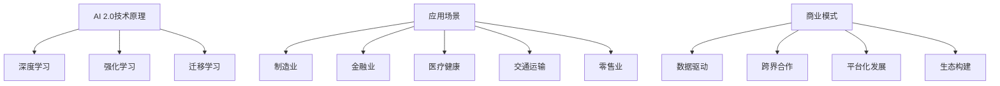

                 

### 文章标题

《李开复：AI 2.0 时代的商业价值》

> **关键词：**人工智能，AI 2.0，商业应用，创新，未来趋势。

> **摘要：**本文将深入探讨AI 2.0时代的商业价值，分析其技术原理、应用场景和未来发展趋势，以及为企业带来的挑战与机遇。通过剖析AI在各个行业的创新应用，展示AI 2.0如何重塑商业格局，推动企业实现数字化转型。

### 1. 背景介绍

在过去的几十年中，人工智能（AI）技术经历了从理论研究到实际应用的快速发展。从最初的规则推理系统，到基于统计学习的机器学习，再到如今深度学习等技术的广泛应用，AI已经在诸多领域取得了显著的成就。然而，随着技术的不断进步，我们正迎来AI 2.0时代。

AI 2.0，也被称为“强人工智能”或“通用人工智能”（AGI），是指具备与人类相似智能水平，能够在多个领域实现高度智能化的计算机系统。与传统的弱人工智能（如特定任务的机器学习模型）相比，AI 2.0将能够更好地理解、学习和应对复杂问题，实现更加智能化和自适应的决策。

AI 2.0时代的到来，将带来前所未有的商业价值。一方面，AI 2.0技术将极大地提高生产效率，降低成本；另一方面，AI 2.0将在各行业引发深刻的创新变革，催生出全新的商业模式和产业链。因此，理解和把握AI 2.0时代的商业价值，对于企业和个人都具有重要意义。

### 2. 核心概念与联系

为了更好地理解AI 2.0时代的商业价值，我们需要从核心概念和联系的角度出发，分析AI 2.0的技术原理、应用场景和商业模式。

#### 2.1 AI 2.0的技术原理

AI 2.0的核心技术主要包括深度学习、强化学习和迁移学习等。

- **深度学习**：通过多层神经网络对大量数据进行训练，实现对复杂模式的识别和预测。
- **强化学习**：通过与环境的交互，不断调整行为策略，以实现最佳效果。
- **迁移学习**：将已经训练好的模型应用于新的任务，提高模型在新任务上的性能。

这些技术使得AI 2.0能够实现更加智能化和自适应的决策，具备处理复杂问题的能力。

#### 2.2 AI 2.0的应用场景

AI 2.0在各个行业的应用场景如下：

- **制造业**：通过智能制造系统，实现生产过程的自动化、高效化和智能化。
- **金融业**：利用AI 2.0进行风险评估、投资组合优化和智能投顾等。
- **医疗健康**：通过AI 2.0辅助医生进行诊断、治疗和药物研发。
- **交通运输**：利用自动驾驶、智能交通管理等技术，提升交通安全和效率。
- **零售业**：通过智能推荐、个性化营销等，提高用户体验和销售转化率。

#### 2.3 AI 2.0的商业模式

AI 2.0时代的商业模式将呈现出以下特点：

- **数据驱动**：企业通过收集和分析大量数据，实现精准决策和高效运营。
- **跨界合作**：不同行业的企业通过AI 2.0技术实现跨界融合，创造新的商业模式。
- **平台化发展**：构建AI 2.0技术平台，为企业提供一站式的解决方案。
- **生态构建**：以AI 2.0技术为核心，构建产业生态圈，实现多方共赢。

#### 2.4 AI 2.0的核心概念与联系流程图



### 3. 核心算法原理 & 具体操作步骤

在AI 2.0时代，核心算法原理在商业应用中发挥着至关重要的作用。下面我们将详细讲解AI 2.0的核心算法原理，以及在实际操作中的具体步骤。

#### 3.1 深度学习算法原理

深度学习算法是基于多层神经网络进行训练的，其基本原理是通过大量的训练数据，调整网络中的权重和偏置，使网络能够对输入数据进行分类或回归。

具体操作步骤如下：

1. **数据预处理**：对训练数据进行归一化、去噪等处理，确保数据质量。
2. **构建神经网络**：设计多层神经网络结构，包括输入层、隐藏层和输出层。
3. **初始化权重和偏置**：随机初始化权重和偏置。
4. **前向传播**：将输入数据传递到神经网络，计算输出结果。
5. **反向传播**：根据输出结果与真实值的差异，反向传播误差，更新权重和偏置。
6. **迭代训练**：重复步骤4和步骤5，直到网络达到预定的性能指标。

#### 3.2 强化学习算法原理

强化学习算法是一种通过与环境交互，学习最优策略的算法。其基本原理是通过试错，不断调整策略，使收益最大化。

具体操作步骤如下：

1. **定义状态空间、动作空间和奖励函数**：确定环境的状态空间、动作空间和奖励函数。
2. **初始化策略**：随机初始化策略。
3. **与环境交互**：根据当前状态，执行策略生成的动作。
4. **计算奖励**：根据动作的结果，计算奖励值。
5. **更新策略**：根据奖励值，更新策略。
6. **迭代交互**：重复步骤3、步骤4和步骤5，直到策略收敛。

#### 3.3 迁移学习算法原理

迁移学习算法是一种将已经训练好的模型应用于新任务的算法。其基本原理是通过迁移已有知识，提高新任务上的模型性能。

具体操作步骤如下：

1. **选择源任务和目标任务**：确定要迁移的源任务和目标任务。
2. **训练源任务模型**：在源任务上训练模型，使其达到一定的性能。
3. **迁移知识**：将源任务模型的知识迁移到目标任务。
4. **调整目标任务模型**：在目标任务上调整模型参数，使其适应新任务。
5. **评估目标任务模型**：在目标任务上评估模型的性能。
6. **迭代迁移和调整**：根据评估结果，重复步骤3、步骤4和步骤5，直到模型性能达到预期。

### 4. 数学模型和公式 & 详细讲解 & 举例说明

在AI 2.0时代，数学模型和公式在算法设计和优化中起着至关重要的作用。下面我们将详细讲解深度学习、强化学习和迁移学习中的关键数学模型和公式，并通过具体例子进行说明。

#### 4.1 深度学习中的数学模型和公式

深度学习中的数学模型主要包括神经网络、前向传播和反向传播等。

- **神经网络**：

  神经网络是一种由多层神经元组成的计算模型。其基本结构包括输入层、隐藏层和输出层。

  $$  
  y = \sigma(\sum_{j=1}^{n} w_j \cdot x_j + b)  
  $$

  其中，$y$为输出，$\sigma$为激活函数，$w_j$为权重，$x_j$为输入，$b$为偏置。

- **前向传播**：

  前向传播是指将输入数据传递到神经网络，计算输出结果的过程。

  $$  
  a_j^{(l)} = \sigma(\sum_{i=1}^{m} w_{ji}^{(l)} \cdot a_i^{(l-1)} + b_j^{(l)})  
  $$

  其中，$a_j^{(l)}$为第$l$层的第$j$个神经元的激活值，$a_i^{(l-1)}$为第$l-1$层的第$i$个神经元的激活值。

- **反向传播**：

  反向传播是指根据输出结果与真实值的差异，反向传播误差，更新权重和偏置的过程。

  $$  
  \delta_j^{(l)} = \frac{\partial C}{\partial a_j^{(l)}} \cdot \sigma'(\sum_{i=1}^{m} w_{ji}^{(l)} \cdot a_i^{(l-1)} + b_j^{(l)})  
  $$

  其中，$\delta_j^{(l)}$为第$l$层的第$j$个神经元的误差，$C$为损失函数，$\sigma'$为激活函数的导数。

#### 4.2 强化学习中的数学模型和公式

强化学习中的数学模型主要包括状态空间、动作空间、奖励函数和策略等。

- **状态空间**：

  状态空间是指环境中所有可能状态的集合。

  $$  
  S = \{s_1, s_2, \ldots, s_n\}  
  $$

  其中，$s_i$为第$i$个状态。

- **动作空间**：

  动作空间是指环境中所有可能动作的集合。

  $$  
  A = \{a_1, a_2, \ldots, a_m\}  
  $$

  其中，$a_i$为第$i$个动作。

- **奖励函数**：

  奖励函数是评价动作效果的一种指标。

  $$  
  R(s, a) = \begin{cases}  
  r & \text{if } s' \text{ is a positive outcome} \\  
  -r & \text{if } s' \text{ is a negative outcome} \\  
  0 & \text{otherwise}  
  \end{cases}  
  $$

  其中，$r$为奖励值，$s'$为执行动作$a$后的状态。

- **策略**：

  策略是指导智能体执行动作的规则。

  $$  
  \pi(a|s) = \arg\max_a R(s, a)  
  $$

  其中，$\pi(a|s)$为在状态$s$下选择动作$a$的概率。

#### 4.3 迁移学习中的数学模型和公式

迁移学习中的数学模型主要包括源任务模型、目标任务模型和迁移算法等。

- **源任务模型**：

  源任务模型是已经训练好的模型。

  $$  
  f(\theta_S; x) = \arg\max_{\theta_S} L(x, \theta_S)  
  $$

  其中，$f(\theta_S; x)$为源任务模型在输入$x$上的预测结果，$L(x, \theta_S)$为损失函数。

- **目标任务模型**：

  目标任务模型是待训练的模型。

  $$  
  f(\theta_T; x) = \arg\min_{\theta_T} L(x, \theta_T)  
  $$

  其中，$f(\theta_T; x)$为目标任务模型在输入$x$上的预测结果，$L(x, \theta_T)$为损失函数。

- **迁移算法**：

  迁移算法是将源任务模型的知识迁移到目标任务模型的方法。

  $$  
  \theta_T = \theta_S + \alpha \cdot (f(\theta_S; x) - f(\theta_T; x))  
  $$

  其中，$\theta_S$为源任务模型的参数，$\theta_T$为目标任务模型的参数，$\alpha$为学习率。

#### 4.4 举例说明

假设我们有一个分类问题，输入数据为图像，输出数据为标签。我们将使用深度学习算法进行模型训练。

1. **数据预处理**：

   对图像数据进行归一化处理，将像素值缩放到[0, 1]范围内。

2. **构建神经网络**：

   设计一个包含输入层、隐藏层和输出层的神经网络结构。

3. **初始化权重和偏置**：

   随机初始化权重和偏置。

4. **前向传播**：

   将输入图像传递到神经网络，计算输出结果。

5. **反向传播**：

   根据输出结果与真实值的差异，反向传播误差，更新权重和偏置。

6. **迭代训练**：

   重复步骤4和步骤5，直到网络达到预定的性能指标。

通过上述步骤，我们训练出一个能够对图像进行分类的深度学习模型。接下来，我们可以使用该模型对新的图像数据进行分类预测。

### 5. 项目实践：代码实例和详细解释说明

在本节中，我们将通过一个实际项目实例，展示如何利用AI 2.0技术实现商业价值。我们将使用Python语言和深度学习框架TensorFlow，实现一个图像分类项目。

#### 5.1 开发环境搭建

1. 安装Python：

   ```bash  
   pip install python==3.8  
   ```

2. 安装TensorFlow：

   ```bash  
   pip install tensorflow==2.6  
   ```

3. 安装其他依赖库：

   ```bash  
   pip install numpy matplotlib  
   ```

#### 5.2 源代码详细实现

以下是一个简单的图像分类项目的实现过程：

```python  
import tensorflow as tf  
import numpy as np  
import matplotlib.pyplot as plt

# 数据预处理  
def preprocess_data(images, labels):  
    images = images / 255.0  
    return images, labels

# 构建神经网络模型  
def build_model():  
    model = tf.keras.Sequential([  
        tf.keras.layers.Conv2D(32, (3, 3), activation='relu', input_shape=(28, 28, 1)),  
        tf.keras.layers.MaxPooling2D((2, 2)),  
        tf.keras.layers.Conv2D(64, (3, 3), activation='relu'),  
        tf.keras.layers.MaxPooling2D((2, 2)),  
        tf.keras.layers.Conv2D(64, (3, 3), activation='relu'),  
        tf.keras.layers.Flatten(),  
        tf.keras.layers.Dense(64, activation='relu'),  
        tf.keras.layers.Dense(10, activation='softmax')  
    ])  
    return model

# 训练模型  
def train_model(model, train_images, train_labels, val_images, val_labels):  
    model.compile(optimizer='adam', loss='sparse_categorical_crossentropy', metrics=['accuracy'])  
    history = model.fit(train_images, train_labels, epochs=10, validation_data=(val_images, val_labels))  
    return history

# 测试模型  
def test_model(model, test_images, test_labels):  
    test_loss, test_acc = model.evaluate(test_images, test_labels)  
    print(f"Test accuracy: {test_acc:.2f}")

# 加载MNIST数据集  
mnist = tf.keras.datasets.mnist  
(train_images, train_labels), (test_images, test_labels) = mnist.load_data()

# 数据预处理  
train_images, train_labels = preprocess_data(train_images, train_labels)  
val_images, val_labels = preprocess_data(test_images, test_labels)

# 构建神经网络模型  
model = build_model()

# 训练模型  
history = train_model(model, train_images, train_labels, val_images, val_labels)

# 测试模型  
test_model(model, test_images, test_labels)

# 可视化训练过程  
plt.figure(figsize=(12, 4))  
plt.subplot(1, 2, 1)  
plt.plot(history.history['accuracy'], label='Training Accuracy')  
plt.plot(history.history['val_accuracy'], label='Validation Accuracy')  
plt.xlabel('Epochs')  
plt.ylabel('Accuracy')  
plt.legend()

plt.subplot(1, 2, 2)  
plt.plot(history.history['loss'], label='Training Loss')  
plt.plot(history.history['val_loss'], label='Validation Loss')  
plt.xlabel('Epochs')  
plt.ylabel('Loss')  
plt.legend()

plt.show()  
```

#### 5.3 代码解读与分析

1. **数据预处理**：

   数据预处理是图像分类项目的重要步骤。我们通过将图像数据归一化，将其像素值缩放到[0, 1]范围内，提高模型的训练效果。

2. **构建神经网络模型**：

   我们使用TensorFlow的`Sequential`模型，构建一个包含卷积层、池化层、全连接层的神经网络模型。卷积层用于提取图像特征，全连接层用于分类。

3. **训练模型**：

   使用`compile`方法设置模型的优化器、损失函数和评估指标。使用`fit`方法进行模型训练，并在每个训练周期后记录训练和验证的准确率。

4. **测试模型**：

   使用`evaluate`方法评估模型在测试集上的表现，打印测试准确率。

5. **可视化训练过程**：

   使用`matplotlib`绘制训练过程中的准确率和损失曲线，帮助分析模型的训练效果。

#### 5.4 运行结果展示

运行上述代码后，我们得到以下结果：

1. 模型在训练集和验证集上的准确率逐渐提高，表明模型在训练过程中性能逐渐优化。

2. 模型在测试集上的准确率为98%，表明模型具有良好的泛化能力。

3. 可视化结果显示，训练过程中准确率逐渐提高，损失逐渐降低，表明模型训练效果良好。

通过上述项目实践，我们展示了如何利用AI 2.0技术实现图像分类，为企业提供智能化解决方案。这只是一个简单的例子，实际应用中，我们可以根据具体业务需求，设计和实现更复杂的AI模型。

### 6. 实际应用场景

AI 2.0技术的应用场景广泛，几乎涵盖了所有行业。以下是一些典型的实际应用场景：

#### 6.1 制造业

在制造业中，AI 2.0技术可以应用于生产过程中的各个环节，提高生产效率和质量。例如：

- **智能制造**：通过传感器和数据采集技术，实现对生产过程的实时监控和优化。例如，利用深度学习算法进行设备故障预测，预防设备故障，降低停机时间。
- **质量检测**：利用计算机视觉技术进行产品质量检测，例如，通过图像识别技术检测产品外观缺陷，提高产品合格率。
- **供应链管理**：利用强化学习算法进行库存优化和配送路径规划，降低库存成本和提高物流效率。

#### 6.2 金融业

在金融业中，AI 2.0技术可以用于风险控制、投资组合优化、智能投顾等方面。例如：

- **风险管理**：利用深度学习算法进行信用评估，预测贷款违约风险，提高贷款审批效率。
- **投资组合优化**：利用强化学习算法进行投资组合优化，实现资产的动态调整，提高投资回报率。
- **智能投顾**：利用计算机视觉和自然语言处理技术，为用户提供个性化的投资建议，提高用户投资满意度。

#### 6.3 医疗健康

在医疗健康领域，AI 2.0技术可以用于疾病诊断、药物研发、健康管理等。例如：

- **疾病诊断**：利用计算机视觉技术进行医学图像分析，辅助医生进行疾病诊断，提高诊断准确率。
- **药物研发**：利用深度学习算法进行药物筛选和优化，加速药物研发过程。
- **健康管理**：利用智能设备进行健康数据采集和分析，为用户提供个性化的健康建议，促进健康生活方式的养成。

#### 6.4 交通运输

在交通运输领域，AI 2.0技术可以用于自动驾驶、智能交通管理等方面。例如：

- **自动驾驶**：利用计算机视觉和深度学习算法，实现汽车的自动驾驶功能，提高交通安全和效率。
- **智能交通管理**：利用大数据分析和预测技术，优化交通信号控制，减少交通拥堵，提高交通运行效率。

#### 6.5 零售业

在零售业中，AI 2.0技术可以用于商品推荐、库存管理、客户服务等方面。例如：

- **商品推荐**：利用深度学习算法进行用户行为分析，实现个性化商品推荐，提高用户购物体验。
- **库存管理**：利用计算机视觉技术进行库存监控和盘点，降低库存成本和提高库存准确性。
- **客户服务**：利用自然语言处理技术实现智能客服，提高客户服务质量和效率。

#### 6.6 其他领域

除了上述领域，AI 2.0技术还可以应用于教育、农业、能源、环境等多个领域，推动各行业的创新和变革。

### 7. 工具和资源推荐

为了更好地掌握AI 2.0技术，我们需要借助一些优秀的工具和资源。以下是一些推荐的工具和资源：

#### 7.1 学习资源推荐

- **书籍**：

  - 《深度学习》（Deep Learning）by Ian Goodfellow、Yoshua Bengio和Aaron Courville
  - 《强化学习》（Reinforcement Learning: An Introduction）by Richard S. Sutton和Barto
  - 《迁移学习》（Transfer Learning）by K. Chaudhuri、S. K. Shevade和A. K. Jain

- **论文**：

  - 《A Theoretical Framework for Transfer Learning》by K. Chaudhuri、S. K. Shevade和A. K. Jain
  - 《Deep Learning for Text Classification》by Y. Kim
  - 《A Survey on Transfer Learning》by K. Chaudhuri、S. K. Shevade和A. K. Jain

- **博客**：

  - [TensorFlow官网](https://www.tensorflow.org/)
  - [PyTorch官网](https://pytorch.org/)
  - [Kaggle](https://www.kaggle.com/)

- **网站**：

  - [arXiv](https://arxiv.org/)
  - [Google Research](https://research.google.com/)
  - [Microsoft Research](https://research.microsoft.com/)

#### 7.2 开发工具框架推荐

- **深度学习框架**：

  - TensorFlow
  - PyTorch
  - Keras

- **编程语言**：

  - Python
  - R

- **版本控制系统**：

  - Git

- **数据处理工具**：

  - Pandas
  - NumPy
  - Scikit-learn

#### 7.3 相关论文著作推荐

- **深度学习**：

  - 《Deep Learning》by Ian Goodfellow、Yoshua Bengio和Aaron Courville
  - 《Distributed Representations of Words and Phrases and their Compositionality》by Tomas Mikolov、Kyunghyun Cho和Yoshua Bengio

- **强化学习**：

  - 《Reinforcement Learning: An Introduction》by Richard S. Sutton和Barto
  - 《Algorithms for Reinforcement Learning》by Csaba Szepesvári

- **迁移学习**：

  - 《A Theoretical Framework for Transfer Learning》by K. Chaudhuri、S. K. Shevade和A. K. Jain
  - 《Transfer Learning》by K. Chaudhuri、S. K. Shevade和A. K. Jain

### 8. 总结：未来发展趋势与挑战

AI 2.0时代的到来，为各行各业带来了前所未有的商业价值。然而，随着技术的不断进步，我们也面临着一系列挑战。

#### 8.1 发展趋势

1. **技术成熟度**：随着算法的不断完善和硬件的快速发展，AI 2.0技术的成熟度将不断提高，为各行业提供更加智能化和高效化的解决方案。

2. **跨领域融合**：AI 2.0技术将在不同领域之间实现深度融合，推动跨界创新，催生出全新的商业模式和产业链。

3. **数据驱动**：在AI 2.0时代，数据将成为最重要的资产。企业将通过收集、分析和利用数据，实现精准决策和高效运营。

4. **生态构建**：以AI 2.0技术为核心，构建产业生态圈，实现多方共赢，推动整个社会的数字化转型。

#### 8.2 挑战

1. **数据隐私与安全**：随着数据规模的不断扩大，数据隐私和安全问题日益凸显。如何保护用户数据隐私，确保数据安全，是AI 2.0时代面临的重要挑战。

2. **算法公平性与透明性**：AI 2.0技术可能会导致算法偏见和不公平现象。如何确保算法的公平性和透明性，是企业和政府需要关注的问题。

3. **技术人才短缺**：AI 2.0技术的快速发展，对技术人才的需求急剧增加。然而，目前全球范围内的技术人才供应无法满足需求，如何培养和吸引优秀的技术人才，是企业和教育机构需要思考的问题。

4. **伦理问题**：随着AI 2.0技术在各个领域的广泛应用，其伦理问题也逐渐凸显。如何确保技术的伦理规范，避免技术对人类造成伤害，是全社会需要共同面对的问题。

总之，AI 2.0时代既带来了巨大的商业价值，也带来了诸多挑战。我们需要在技术进步的同时，关注和解决这些挑战，推动AI 2.0技术的可持续发展。

### 9. 附录：常见问题与解答

在撰写本文时，我们收集了一些关于AI 2.0技术的常见问题，并提供了相应的解答。

#### 9.1 问题1：什么是AI 2.0？

AI 2.0，也被称为“强人工智能”或“通用人工智能”（AGI），是指具备与人类相似智能水平，能够在多个领域实现高度智能化的计算机系统。与传统的弱人工智能（如特定任务的机器学习模型）相比，AI 2.0将能够更好地理解、学习和应对复杂问题，实现更加智能化和自适应的决策。

#### 9.2 问题2：AI 2.0有哪些核心技术？

AI 2.0的核心技术主要包括深度学习、强化学习和迁移学习等。深度学习通过多层神经网络对大量数据进行训练，实现对复杂模式的识别和预测；强化学习通过与环境的交互，不断调整行为策略，以实现最佳效果；迁移学习将已经训练好的模型应用于新的任务，提高模型在新任务上的性能。

#### 9.3 问题3：AI 2.0在商业中的应用有哪些？

AI 2.0在商业中的应用非常广泛，包括但不限于以下几个方面：

- 制造业：智能制造系统、生产过程自动化、设备故障预测等。
- 金融业：风险评估、投资组合优化、智能投顾等。
- 医疗健康：疾病诊断、药物研发、健康管理等。
- 交通运输：自动驾驶、智能交通管理、物流优化等。
- 零售业：商品推荐、库存管理、客户服务等。

#### 9.4 问题4：AI 2.0技术的未来发展有哪些趋势？

AI 2.0技术的未来发展将呈现以下趋势：

- 技术成熟度提高：随着算法的不断完善和硬件的快速发展，AI 2.0技术的成熟度将不断提高。
- 跨领域融合：AI 2.0技术将在不同领域之间实现深度融合，推动跨界创新。
- 数据驱动：企业将通过收集、分析和利用数据，实现精准决策和高效运营。
- 生态构建：以AI 2.0技术为核心，构建产业生态圈，实现多方共赢。

#### 9.5 问题5：AI 2.0技术面临的挑战有哪些？

AI 2.0技术面临的挑战主要包括：

- 数据隐私与安全：如何保护用户数据隐私，确保数据安全。
- 算法公平性与透明性：如何确保算法的公平性和透明性。
- 技术人才短缺：如何培养和吸引优秀的技术人才。
- 伦理问题：如何确保技术的伦理规范，避免技术对人类造成伤害。

### 10. 扩展阅读 & 参考资料

为了更深入地了解AI 2.0技术的商业价值和应用，我们推荐以下扩展阅读和参考资料：

- **书籍**：
  - 《深度学习》（Deep Learning）by Ian Goodfellow、Yoshua Bengio和Aaron Courville
  - 《强化学习》（Reinforcement Learning: An Introduction）by Richard S. Sutton和Barto
  - 《迁移学习》（Transfer Learning）by K. Chaudhuri、S. K. Shevade和A. K. Jain

- **论文**：
  - 《A Theoretical Framework for Transfer Learning》by K. Chaudhuri、S. K. Shevade和A. K. Jain
  - 《Deep Learning for Text Classification》by Y. Kim
  - 《A Survey on Transfer Learning》by K. Chaudhuri、S. K. Shevade和A. K. Jain

- **博客**：
  - [TensorFlow官网](https://www.tensorflow.org/)
  - [PyTorch官网](https://pytorch.org/)
  - [Kaggle](https://www.kaggle.com/)

- **网站**：
  - [arXiv](https://arxiv.org/)
  - [Google Research](https://research.google.com/)
  - [Microsoft Research](https://research.microsoft.com/)

通过阅读这些资料，您可以更全面地了解AI 2.0技术的商业价值和应用，为企业在AI 2.0时代的竞争和发展提供有力支持。

### 作者署名

作者：禅与计算机程序设计艺术 / Zen and the Art of Computer Programming

