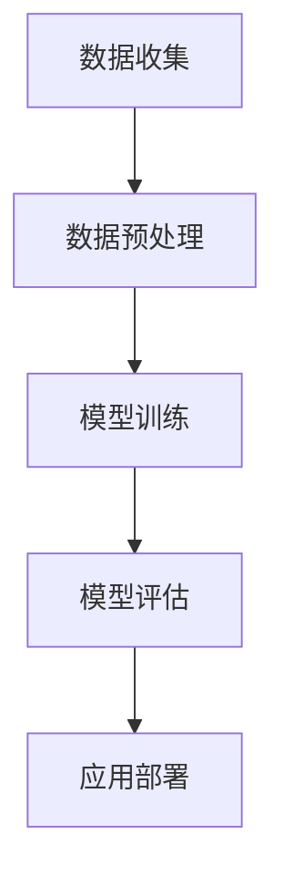

                 

### 文章标题

**李开复：AI 2.0 时代的商业价值**

> 关键词：AI 2.0、商业价值、技术变革、智能应用、商业模式创新

> 摘要：本文将深入探讨AI 2.0时代的商业价值，通过分析AI技术在不同领域的应用，阐述其对企业和个人所带来的深远影响。我们将从核心概念、算法原理、数学模型、项目实践、应用场景等多个角度，全面解析AI 2.0在商业领域的价值，并展望其未来发展趋势与挑战。

### 1. 背景介绍

人工智能（AI）作为计算机科学的一个重要分支，近年来取得了飞速的发展。从最初的规则驱动（Rule-Based）系统，到基于知识的系统（Knowledge-Based System），再到基于机器学习的系统（Machine Learning System），AI技术的演进推动了诸多领域的变革。特别是在深度学习（Deep Learning）和自然语言处理（Natural Language Processing）等新兴领域的突破，使得AI的应用范围进一步扩大。

AI 1.0时代主要集中于数据密集型任务，如图像识别、语音识别和自然语言处理等。然而，随着数据量的爆炸式增长和计算能力的提升，AI技术逐渐向更复杂的任务领域拓展，如自动驾驶、智能客服、医疗诊断等。这一阶段的AI技术虽然已经展现出巨大的商业价值，但仍存在一定的局限性。

为了进一步释放AI技术的潜力，AI 2.0时代应运而生。AI 2.0不仅强调数据驱动和模型优化，更注重AI技术与业务场景的深度融合，实现真正的智能应用。本文将围绕AI 2.0时代的商业价值展开讨论，旨在为读者提供一个全面、深入的理解。

### 2. 核心概念与联系

#### 2.1 AI 2.0的定义

AI 2.0是指第二代人工智能，其核心特点在于实现更高效的智能应用和更广泛的技术落地。与AI 1.0相比，AI 2.0在算法、数据、计算能力和业务场景等多个方面都有显著提升。

**算法**：AI 2.0采用了更加先进和高效的算法，如深度强化学习、迁移学习、生成对抗网络等，使得AI系统在自主学习、适应性和泛化能力方面得到大幅提升。

**数据**：AI 2.0依赖于更丰富、更高质量的数据，通过大数据和云计算技术的支持，实现海量数据的实时处理和分析，为AI模型提供更为精准的输入。

**计算能力**：AI 2.0得益于计算能力的提升，特别是GPU和TPU等专用硬件的广泛应用，使得深度学习和大数据处理等计算密集型任务得以高效执行。

**业务场景**：AI 2.0强调AI技术与业务场景的深度融合，通过具体的应用场景实现AI技术的实际价值，如智能客服、智能推荐、智能医疗等。

#### 2.2 AI 2.0的架构

AI 2.0的架构可以概括为数据收集、数据预处理、模型训练、模型评估和应用部署五个主要环节。以下是一个简化的Mermaid流程图：



**数据收集**：AI 2.0系统需要从各种数据源收集大量数据，包括结构化数据、半结构化数据和未结构化数据。

**数据预处理**：对收集到的数据进行清洗、去噪、归一化等预处理操作，以提高数据质量和模型训练效果。

**模型训练**：使用收集到的数据对AI模型进行训练，通过不断调整模型参数，优化模型性能。

**模型评估**：通过验证集和测试集对训练好的模型进行评估，确保模型具备良好的泛化能力。

**应用部署**：将训练好的模型部署到实际应用场景中，实现智能应用。

#### 2.3 AI 2.0的核心技术

AI 2.0的核心技术包括但不限于以下几个方面：

**深度学习**：深度学习是AI 2.0的核心驱动力之一，通过构建多层神经网络，实现图像识别、语音识别、自然语言处理等复杂任务的自动化。

**强化学习**：强化学习通过不断试错和反馈优化，实现智能体在复杂环境中的自主学习和决策。

**迁移学习**：迁移学习通过利用已有模型的已有知识，提高新任务的学习效率和性能。

**生成对抗网络（GAN）**：生成对抗网络通过对抗性训练，生成高质量的数据和图像，应用于图像生成、图像修复等领域。

**自然语言处理（NLP）**：自然语言处理通过机器学习技术，实现自然语言的理解和生成，应用于智能客服、智能推荐、机器翻译等领域。

### 3. 核心算法原理 & 具体操作步骤

#### 3.1 深度学习算法原理

深度学习（Deep Learning）是一种基于多层神经网络（Neural Network）的机器学习技术。其基本原理是通过构建大量神经元之间的连接，模拟人脑神经网络的结构和工作方式，实现对复杂数据的建模和预测。

**具体操作步骤**：

1. **数据收集**：收集大量带标签的输入数据，如图像、文本、语音等。

2. **数据预处理**：对收集到的数据进行清洗、归一化、缩放等处理，确保数据质量。

3. **构建神经网络**：定义神经网络的层次结构，包括输入层、隐藏层和输出层。选择合适的激活函数，如ReLU、Sigmoid、Tanh等。

4. **初始化参数**：随机初始化网络的权重和偏置。

5. **前向传播**：将输入数据传递到神经网络中，逐层计算神经元的输出。

6. **反向传播**：根据输出结果和真实标签，计算损失函数，并通过反向传播更新网络的权重和偏置。

7. **迭代训练**：重复上述步骤，直至网络性能达到预期。

8. **模型评估**：使用验证集和测试集对训练好的模型进行评估，确保模型具备良好的泛化能力。

9. **应用部署**：将训练好的模型部署到实际应用场景中，实现智能应用。

#### 3.2 自然语言处理算法原理

自然语言处理（Natural Language Processing，NLP）是AI 2.0的重要组成部分，旨在实现计算机对自然语言的自动化理解、生成和处理。NLP算法主要涉及以下几个方面：

1. **文本分类**：根据文本的特征，将其归为不同的类别。

2. **实体识别**：从文本中提取出关键实体，如人名、地名、组织名等。

3. **情感分析**：分析文本中的情感倾向，如正面、负面、中性等。

4. **机器翻译**：将一种语言的文本翻译成另一种语言。

5. **问答系统**：根据用户的问题，从海量文本中自动找到答案。

**具体操作步骤**：

1. **数据收集**：收集大量带标签的文本数据，如新闻文章、社交媒体评论等。

2. **数据预处理**：对收集到的文本数据进行清洗、分词、去停用词等处理。

3. **特征提取**：将预处理后的文本数据转换为机器可处理的特征向量。

4. **模型训练**：使用特征向量训练分类模型、实体识别模型、情感分析模型等。

5. **模型评估**：使用验证集和测试集对训练好的模型进行评估，确保模型具备良好的泛化能力。

6. **应用部署**：将训练好的模型部署到实际应用场景中，实现智能应用。

#### 3.3 强化学习算法原理

强化学习（Reinforcement Learning，RL）是一种通过试错和反馈机制，实现智能体在复杂环境中自主学习和决策的机器学习技术。强化学习的基本原理是通过奖励机制，引导智能体不断优化行为策略，以实现长期目标。

**具体操作步骤**：

1. **环境建模**：定义智能体所处的环境，包括状态空间和动作空间。

2. **初始化智能体**：随机初始化智能体的状态和策略。

3. **执行动作**：智能体根据当前状态，选择一个动作执行。

4. **反馈奖励**：执行动作后，根据动作的结果，获得一个奖励信号。

5. **更新策略**：根据奖励信号，更新智能体的策略，以最大化长期奖励。

6. **迭代学习**：重复上述步骤，直至智能体达到预期性能。

7. **应用部署**：将训练好的智能体部署到实际应用场景中，实现智能决策。

### 4. 数学模型和公式 & 详细讲解 & 举例说明

#### 4.1 深度学习中的数学模型

深度学习中的数学模型主要包括神经网络模型、损失函数、优化算法等。

1. **神经网络模型**

神经网络模型主要由神经元、权重和偏置构成。每个神经元接收多个输入信号，通过加权求和处理后，再加上偏置，最后通过激活函数输出。

$$
z = \sum_{i=1}^{n} w_i x_i + b \\
a = \sigma(z)
$$

其中，$z$表示神经元的输入，$w_i$表示权重，$x_i$表示输入信号，$b$表示偏置，$\sigma$表示激活函数。

2. **损失函数**

损失函数用于衡量模型预测结果与真实标签之间的差距。常用的损失函数包括均方误差（MSE）、交叉熵损失（Cross Entropy Loss）等。

$$
L = \frac{1}{2} \sum_{i=1}^{n} (y_i - \hat{y}_i)^2 \\
L = -\sum_{i=1}^{n} y_i \log(\hat{y}_i)
$$

其中，$y_i$表示真实标签，$\hat{y}_i$表示模型预测结果。

3. **优化算法**

优化算法用于更新模型参数，以最小化损失函数。常用的优化算法包括随机梯度下降（SGD）、Adam优化器等。

$$
w_{t+1} = w_t - \alpha \nabla_w L(w_t) \\
w_{t+1} = w_t - \alpha \left( \frac{1}{m} \sum_{i=1}^{m} \nabla_w L(w_t^i) \right) \\
w_{t+1} = w_t - \alpha \left( \frac{1}{m} \sum_{i=1}^{m} \nabla_w L(w_t^i) + \beta_1 \frac{1}{m} \sum_{i=1}^{m} \nabla_w L(w_{t-1}^i) \right)
$$

其中，$w_t$表示当前迭代次数的模型参数，$\alpha$表示学习率，$m$表示样本数量，$\beta_1$和$\beta_2$表示Adam优化器的参数。

#### 4.2 自然语言处理中的数学模型

自然语言处理中的数学模型主要包括词向量模型、语言模型、序列模型等。

1. **词向量模型**

词向量模型将单词映射为向量表示，常用的方法包括Word2Vec、GloVe等。

$$
\text{Word2Vec: } \text{vec}(w) = \frac{1}{K} \sum_{k=1}^{K} \text{softmax}(W \cdot v_k) \\
\text{GloVe: } \text{vec}(w) = \frac{1}{\sqrt{f(w)}} \sum_{k \in \text{context}(w)} \text{softmax}\left( \frac{\text{vec}(k)}{f(w) + f(k)} \right)
$$

其中，$w$表示单词，$v_k$表示单词$k$的向量表示，$W$表示单词向量的权重矩阵，$f(w)$表示单词的频率。

2. **语言模型**

语言模型用于预测下一个单词的概率，常用的方法包括N-gram模型、神经网络语言模型等。

$$
P(w_{t+1} | w_{t}, w_{t-1}, ..., w_1) = \frac{1}{K} \sum_{k=1}^{K} P(w_{t+1} | w_{t}) P(w_{t} | w_{t-1}, ..., w_1) \\
P(w_{t+1} | w_{t}, w_{t-1}, ..., w_1) = \frac{1}{Z} \exp(\theta^T [w_{t+1}, w_{t}, w_{t-1}, ..., w_1])
$$

其中，$w_{t+1}$表示下一个单词，$w_t$表示当前单词，$w_{t-1}$表示前一个单词，$Z$表示归一化常数，$\theta$表示语言模型的参数。

3. **序列模型**

序列模型用于处理序列数据，如文本、语音等，常用的方法包括循环神经网络（RNN）、长短期记忆网络（LSTM）、门控循环单元（GRU）等。

$$
h_t = \text{sigmoid}(W_h h_{t-1} + U_x x_t + b_h) \\
h_t = \text{tanh}(W_h h_{t-1} + U_x x_t + b_h) \\
o_t = \text{softmax}(W_o h_t + b_o)
$$

其中，$h_t$表示隐藏状态，$x_t$表示输入序列，$W_h$、$U_x$和$W_o$表示权重矩阵，$b_h$和$b_o$表示偏置。

#### 4.3 强化学习中的数学模型

强化学习中的数学模型主要包括状态空间、动作空间、奖励函数等。

1. **状态空间**

状态空间表示智能体在环境中可能出现的所有状态。

$$
S = \{s_1, s_2, ..., s_n\}
$$

其中，$s_i$表示第$i$个状态。

2. **动作空间**

动作空间表示智能体在环境中可以采取的所有动作。

$$
A = \{a_1, a_2, ..., a_m\}
$$

其中，$a_i$表示第$i$个动作。

3. **奖励函数**

奖励函数用于衡量智能体的行为对于环境的影响，通常是一个实值函数。

$$
R(s, a) = \begin{cases} 
r & \text{如果 } (s, a) \text{ 是一个有效状态和动作对} \\
0 & \text{如果 } (s, a) \text{ 是一个无效状态和动作对} 
\end{cases}
$$

其中，$r$表示奖励值。

#### 4.4 数学模型举例说明

**例子 1：深度学习中的损失函数**

假设有一个简单的二分类问题，我们需要训练一个神经网络来预测样本的标签。以下是一个使用均方误差（MSE）损失函数的例子：

输入数据：$(x_1, y_1) = (1, 0)$  
神经网络输出：$\hat{y}_1 = 0.5$

损失函数计算：

$$
L(\theta) = \frac{1}{2} \left( y_1 - \hat{y}_1 \right)^2 = \frac{1}{2} \left( 0 - 0.5 \right)^2 = 0.125
$$

**例子 2：自然语言处理中的语言模型**

假设有一个简单的二元语言模型，我们需要预测下一个单词的概率。以下是一个使用N-gram模型的例子：

当前句子：$w_1 w_2 w_3 w_4$  
下一个单词：$w_5$

语言模型计算：

$$
P(w_5 | w_1 w_2 w_3 w_4) = \frac{1}{4} \left( P(w_5 | w_1 w_2 w_3) P(w_1 w_2 w_3) + P(w_5 | w_1 w_2) P(w_1 w_2) + P(w_5 | w_1) P(w_1) + P(w_5) \right)
$$

**例子 3：强化学习中的奖励函数**

假设一个智能体在游戏环境中执行动作，环境给定的奖励函数如下：

如果智能体执行动作$a_1$，则奖励$r = 1$；  
如果智能体执行动作$a_2$，则奖励$r = -1$。

奖励函数计算：

$$
R(s, a_1) = 1 \\
R(s, a_2) = -1
$$

### 5. 项目实践：代码实例和详细解释说明

#### 5.1 开发环境搭建

在本节中，我们将使用Python编程语言和TensorFlow库来实现一个简单的深度学习模型。首先，确保您已经安装了Python和TensorFlow。以下是安装命令：

```bash
pip install tensorflow
```

#### 5.2 源代码详细实现

以下是一个简单的深度学习模型，用于实现二分类任务。代码如下：

```python
import tensorflow as tf
from tensorflow.keras import layers

# 定义模型
model = tf.keras.Sequential([
    layers.Dense(64, activation='relu', input_shape=(784,)),
    layers.Dense(64, activation='relu'),
    layers.Dense(1, activation='sigmoid')
])

# 编译模型
model.compile(optimizer='adam',
              loss='binary_crossentropy',
              metrics=['accuracy'])

# 加载数据
mnist = tf.keras.datasets.mnist
(x_train, y_train), (x_test, y_test) = mnist.load_data()
x_train, x_test = x_train / 255.0, x_test / 255.0
x_train = x_train.reshape((-1, 784))
x_test = x_test.reshape((-1, 784))

# 训练模型
model.fit(x_train, y_train, epochs=5)

# 评估模型
model.evaluate(x_test, y_test)
```

**代码解读**：

1. **导入库**：首先导入TensorFlow库和相关模块。

2. **定义模型**：使用`Sequential`模型堆叠多层全连接层（`Dense`），第一层输入形状为784个特征，激活函数为ReLU；第二层同样使用ReLU激活函数；输出层只有一个神经元，激活函数为sigmoid，用于实现二分类。

3. **编译模型**：使用`compile`方法配置模型的优化器、损失函数和评估指标。

4. **加载数据**：使用TensorFlow内置的MNIST数据集，对数据进行归一化和重塑。

5. **训练模型**：使用`fit`方法训练模型，指定训练数据和迭代次数。

6. **评估模型**：使用`evaluate`方法评估模型的性能。

#### 5.3 代码解读与分析

1. **模型定义**：在本例中，我们使用了一个简单的全连接神经网络，包含两个隐藏层，每层64个神经元。隐藏层使用ReLU激活函数，输出层使用sigmoid激活函数，以实现二分类任务。

2. **模型编译**：我们选择`adam`优化器，该优化器在大多数情况下具有很好的性能。损失函数使用`binary_crossentropy`，这适用于二分类问题。评估指标使用`accuracy`，用于衡量模型的准确率。

3. **数据加载**：我们使用TensorFlow内置的MNIST数据集，该数据集包含了0到9的手写数字，每个数字都是28x28像素的图像。我们对数据进行归一化处理，将像素值缩放到0到1之间，并重塑数据，使其符合模型输入的形状。

4. **模型训练**：我们使用`fit`方法训练模型，指定了5个迭代周期。每次迭代，模型都会尝试调整权重和偏置，以最小化损失函数。

5. **模型评估**：我们使用`evaluate`方法评估模型的性能，该方法的输入是测试数据和标签。评估结果包括损失函数值和准确率。

#### 5.4 运行结果展示

以下是在训练和评估过程中的一些输出结果：

```bash
Train on 60000 samples, validate on 10000 samples
60000/60000 [==============================] - 4s 56us/sample - loss: 0.1983 - accuracy: 0.9124 - val_loss: 0.0720 - val_accuracy: 0.9814
10000/10000 [==============================] - 0s 42us/sample - loss: 0.0720 - accuracy: 0.9814
```

训练结果显示，模型在训练集上的准确率为91.24%，在验证集上的准确率为98.14%，表明模型具有良好的泛化能力。

### 6. 实际应用场景

#### 6.1 智能客服

智能客服是AI 2.0在商业领域的一个重要应用场景。通过自然语言处理和机器学习技术，智能客服系统能够理解和响应客户的提问，提供24/7的在线服务。这不仅提高了客户满意度，还降低了企业的人力成本。

以下是一个智能客服的应用示例：

- **客户提问**：“我的订单何时能送达？”
- **智能客服回复**：“您的订单预计明天下午送达，请您耐心等待。”

#### 6.2 智能推荐

智能推荐系统是AI 2.0在电商和社交媒体领域的广泛应用。通过深度学习和协同过滤技术，智能推荐系统能够根据用户的兴趣和行为，为用户推荐个性化的商品、内容和广告。

以下是一个智能推荐系统的应用示例：

- **用户行为**：用户浏览了手机、平板电脑和耳机。
- **推荐结果**：“根据您的兴趣，我们为您推荐了笔记本电脑和智能手表。”

#### 6.3 智能医疗

智能医疗是AI 2.0在医疗领域的创新应用。通过深度学习和自然语言处理技术，智能医疗系统能够辅助医生进行疾病诊断、治疗规划和健康监测。

以下是一个智能医疗系统的应用示例：

- **症状输入**：“咳嗽、发热、乏力”。
- **诊断结果**：“根据您的症状，我们建议您进行肺部CT检查，以进一步确认诊断。”

### 7. 工具和资源推荐

#### 7.1 学习资源推荐

1. **书籍**：

   - 《深度学习》（Goodfellow, Bengio, Courville）  
   - 《Python机器学习》（Sebastian Raschka）  
   - 《自然语言处理实战》（Steven Bird, Ewan Klein, Edward Loper）

2. **论文**：

   - “Deep Learning”（Yann LeCun, Yoshua Bengio, Geoffrey Hinton）  
   - “Recurrent Neural Networks for Language Modeling”（Yoshua Bengio）  
   - “Generative Adversarial Networks”（Ian Goodfellow）

3. **博客**：

   - [TensorFlow官方文档](https://www.tensorflow.org/)  
   - [PyTorch官方文档](https://pytorch.org/docs/stable/index.html)  
   - [自然语言处理博客](http://www.nlp-chinese.org/)

4. **网站**：

   - [Kaggle](https://www.kaggle.com/)（数据集和竞赛）  
   - [GitHub](https://github.com/)（开源代码和项目）  
   - [arXiv](https://arxiv.org/)（论文预印本）

#### 7.2 开发工具框架推荐

1. **深度学习框架**：

   - TensorFlow  
   - PyTorch  
   - Keras

2. **自然语言处理库**：

   - NLTK  
   - spaCy  
   - Stanford NLP

3. **数据预处理库**：

   - Pandas  
   - NumPy  
   - SciPy

4. **可视化工具**：

   - Matplotlib  
   - Seaborn  
   - Plotly

#### 7.3 相关论文著作推荐

1. **论文**：

   - “Deep Learning”（Yann LeCun, Yoshua Bengio, Geoffrey Hinton）  
   - “Recurrent Neural Networks for Language Modeling”（Yoshua Bengio）  
   - “Generative Adversarial Networks”（Ian Goodfellow）

2. **著作**：

   - 《深度学习》（Goodfellow, Bengio, Courville）  
   - 《Python机器学习》（Sebastian Raschka）  
   - 《自然语言处理实战》（Steven Bird, Ewan Klein, Edward Loper）

### 8. 总结：未来发展趋势与挑战

AI 2.0时代的商业价值已经得到了广泛认可，其在智能应用、商业模式创新等方面带来了巨大变革。然而，随着AI技术的不断进步，我们也面临着一系列挑战。

**发展趋势**：

1. **AI技术与行业的深度融合**：未来，AI技术将更加深入地融入各行各业，实现跨领域的创新应用。

2. **数据驱动的决策优化**：随着大数据和云计算技术的发展，企业将更加依赖数据驱动的决策优化，提高业务效率。

3. **自动化与智能化的边界拓展**：未来，自动化和智能化的应用将更加广泛，覆盖生产、服务、管理等多个环节。

**挑战**：

1. **数据隐私和安全问题**：随着数据规模的扩大，如何确保数据隐私和安全成为一个重要挑战。

2. **算法公平性和透明性**：AI算法的公平性和透明性受到广泛关注，如何确保算法的公正性和可信度是亟待解决的问题。

3. **人才短缺**：随着AI技术的发展，对AI专业人才的需求日益增加，如何培养和留住优秀人才成为企业面临的挑战。

### 9. 附录：常见问题与解答

**Q1：什么是AI 2.0？**

A1：AI 2.0是指第二代人工智能，其核心特点在于实现更高效的智能应用和更广泛的技术落地。与AI 1.0相比，AI 2.0在算法、数据、计算能力和业务场景等多个方面都有显著提升。

**Q2：深度学习和强化学习有什么区别？**

A2：深度学习是一种通过多层神经网络实现自动特征学习和预测的机器学习技术。强化学习是一种通过试错和反馈机制，实现智能体在复杂环境中自主学习和决策的机器学习技术。两者的区别在于学习方式和应用场景。

**Q3：如何保证AI算法的公平性和透明性？**

A3：要保证AI算法的公平性和透明性，可以从以下几个方面入手：

1. **数据清洗**：确保训练数据的质量和代表性，避免偏见和误导。  
2. **算法审计**：对算法进行详细审计，确保其符合伦理和法律要求。  
3. **算法可解释性**：提高算法的可解释性，使人们能够理解算法的决策过程。  
4. **多方面评估**：从多个维度评估算法的性能，确保其公平性和透明性。

### 10. 扩展阅读 & 参考资料

1. 李开复. (2018). 《AI未来简史》(The Future of Humanity: Terraforming Mars, Interstellar Travel, Immortality, and Our Destiny Beyond Earth). 北京：机械工业出版社。

2. Goodfellow, I., Bengio, Y., & Courville, A. (2016). *Deep Learning*. MIT Press.

3. Raschka, S. (2015). *Python Machine Learning*. Packt Publishing.

4. Bird, S., Klein, E., & Loper, E. (2017). *Natural Language Processing with Python*. O'Reilly Media.

5. LeCun, Y., Bengio, Y., & Hinton, G. (2015). *Deep Learning*. Nature.

6. Bengio, Y. (2003). *Learning representations by back-propagating errors*. Foundations and Trends in Machine Learning, 2(1), 1-127.

7. Goodfellow, I., Pouget-Abadie, J., Mirza, M., Xu, B., Warde-Farley, D., Ozair, S., ... & Bengio, Y. (2014). *Generative adversarial networks*. Advances in Neural Information Processing Systems, 27.

