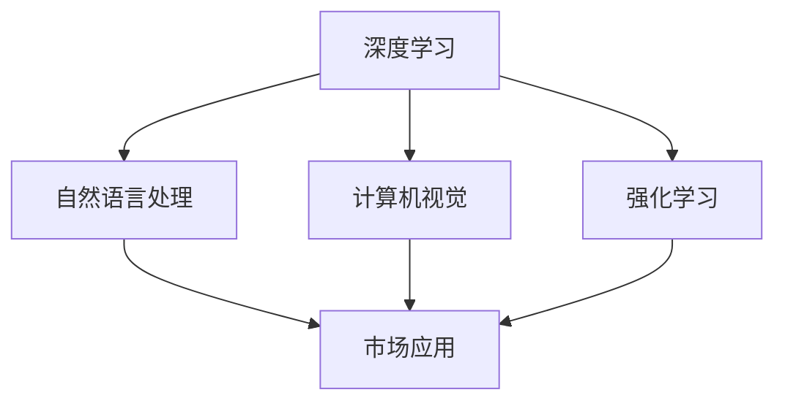

                 

### 李开复：AI 2.0 时代的市场

#### 文章关键词
- AI 2.0
- 市场趋势
- 技术变革
- 人工智能应用
- 未来发展

#### 文章摘要
本文将探讨李开复关于 AI 2.0 时代的市场观点，分析 AI 2.0 技术的发展及其对市场的深远影响，并提出未来市场的潜在趋势和挑战。文章结构如下：

1. 背景介绍
2. 核心概念与联系
3. 核心算法原理 & 具体操作步骤
4. 数学模型和公式 & 详细讲解 & 举例说明
5. 项目实践：代码实例和详细解释说明
6. 实际应用场景
7. 工具和资源推荐
8. 总结：未来发展趋势与挑战
9. 附录：常见问题与解答
10. 扩展阅读 & 参考资料

### 1. 背景介绍

人工智能（AI）技术的发展经历了多个阶段，从最初的规则系统，到基于统计学习的方法，再到如今深度学习的广泛应用。李开复认为，当前的人工智能技术正处于一个重要的转折点，即 AI 2.0 时代。AI 2.0 不仅仅是对 AI 技术的升级，更是对传统行业和市场的颠覆性变革。

AI 2.0 时代的核心特征包括：

- **自主性**：AI 系统能够在没有人类干预的情况下自主学习和决策。
- **泛化能力**：AI 系统能够在不同任务和数据集上表现优异，而不仅仅是特定任务或数据集的优化。
- **通用性**：AI 系统能够跨越不同领域，解决广泛的问题。
- **智能化**：AI 系统能够理解和模拟人类智能，实现更加自然的人机交互。

这些特征预示着 AI 技术将不仅仅局限于单一的应用场景，而是能够在更广泛的市场和行业中发挥重要作用。李开复指出，AI 2.0 时代将对市场产生深远的影响，包括但不限于以下几个方面：

- **产业升级**：AI 技术将推动传统产业的智能化升级，提高生产效率和产品质量。
- **市场重构**：AI 技术将重新定义市场格局，一些新兴行业将迅速崛起，而一些传统行业将面临巨大挑战。
- **经济转型**：AI 技术将推动全球经济的数字化转型，推动经济增长方式的转变。

### 2. 核心概念与联系

为了更好地理解 AI 2.0 时代的市场，我们需要首先明确几个核心概念，并探讨它们之间的联系。

**AI 2.0 技术体系**

AI 2.0 技术体系主要包括以下几个关键组成部分：

- **深度学习**：一种基于多层神经网络的机器学习技术，能够通过大量数据自动学习特征和模式。
- **自然语言处理（NLP）**：一种让计算机理解和生成人类语言的技术，包括语音识别、语言翻译、文本生成等。
- **计算机视觉**：一种让计算机理解和解析图像和视频的技术，包括物体识别、图像分类、目标检测等。
- **强化学习**：一种通过试错和奖励机制学习策略的机器学习技术，适用于决策问题和游戏领域。

**AI 2.0 技术与市场的关系**

AI 2.0 技术与市场的关系可以概括为以下几个方面：

- **技术驱动市场**：AI 2.0 技术的发展和应用将直接推动市场需求的变化，催生新的商业模式和商业机会。
- **市场引导技术**：市场的需求和反馈将反过来推动 AI 2.0 技术的创新和进步，形成良性循环。
- **产业融合**：AI 2.0 技术将与其他行业深度融合，形成新的产业生态，推动整体产业的智能化升级。

**技术架构图**

为了更直观地理解 AI 2.0 技术体系与市场的关系，我们可以使用 Mermaid 流程图来展示其主要组成部分及其相互关系。



在这个流程图中，深度学习、自然语言处理、计算机视觉和强化学习构成了 AI 2.0 技术的核心组成部分，它们共同作用于市场，推动市场的发展和变革。

### 3. 核心算法原理 & 具体操作步骤

在了解了 AI 2.0 时代的市场背景和技术体系后，我们需要进一步探讨其中的核心算法原理和具体操作步骤。以下是几个典型的 AI 2.0 技术及其原理和操作步骤的概述。

#### 深度学习

深度学习是 AI 2.0 技术体系中的关键组成部分，其核心原理是通过多层神经网络对大量数据进行特征提取和模式识别。

**具体操作步骤：**

1. **数据预处理**：对输入数据进行清洗、归一化等处理，使其适合深度学习模型的训练。
2. **构建神经网络**：设计并构建多层神经网络，包括输入层、隐藏层和输出层。
3. **参数初始化**：对神经网络中的参数进行随机初始化。
4. **前向传播**：将输入数据传递到神经网络中，计算每一层的输出。
5. **反向传播**：根据实际输出和预期输出之间的误差，通过反向传播算法更新网络参数。
6. **训练和验证**：使用训练数据和验证数据对神经网络进行训练和验证，调整模型参数，使其达到最佳性能。
7. **应用和部署**：将训练好的模型应用到实际问题中，实现预测、分类或其他任务。

#### 自然语言处理（NLP）

自然语言处理是 AI 2.0 技术体系中的另一个关键组成部分，其核心原理是通过深度学习和统计方法对自然语言进行理解和生成。

**具体操作步骤：**

1. **数据预处理**：对输入文本进行分词、词性标注等预处理，提取出文本的特征表示。
2. **构建语言模型**：使用深度学习模型（如循环神经网络 RNN、长短时记忆 LSTM 等）构建语言模型。
3. **训练和优化**：使用大量语料库对语言模型进行训练和优化，提高模型的性能和准确性。
4. **文本生成**：使用训练好的语言模型生成新的文本，实现文本翻译、文本摘要、对话系统等功能。

#### 计算机视觉

计算机视觉是 AI 2.0 技术体系中的另一个重要组成部分，其核心原理是通过深度学习和图像处理技术对图像和视频进行理解和分析。

**具体操作步骤：**

1. **数据预处理**：对输入图像进行缩放、裁剪、增强等预处理，提取图像的特征表示。
2. **构建卷积神经网络（CNN）**：设计并构建卷积神经网络，对图像进行特征提取和分类。
3. **训练和验证**：使用大量图像数据对卷积神经网络进行训练和验证，调整模型参数，使其达到最佳性能。
4. **物体识别和检测**：使用训练好的卷积神经网络实现物体的识别和检测，应用于视频监控、自动驾驶等领域。

#### 强化学习

强化学习是 AI 2.0 技术体系中的另一个重要组成部分，其核心原理是通过试错和奖励机制学习策略。

**具体操作步骤：**

1. **定义环境和代理**：定义强化学习的问题环境，包括状态空间、动作空间和奖励函数。
2. **选择策略**：选择一种策略表示方法，如策略网络、Q-learning 等。
3. **训练和优化**：使用强化学习算法（如 Q-learning、SARSA 等）对策略进行训练和优化。
4. **策略评估和选择**：评估不同策略的性能，选择最优策略进行决策。

### 4. 数学模型和公式 & 详细讲解 & 举例说明

在了解了 AI 2.0 技术的核心算法原理和具体操作步骤后，我们需要进一步探讨其中的数学模型和公式，并进行详细讲解和举例说明。

#### 深度学习中的数学模型

深度学习中的数学模型主要包括神经网络模型、损失函数和优化算法等。

**神经网络模型：**

神经网络模型由多个神经元组成，每个神经元接收来自前一层神经元的输入，并通过激活函数产生输出。

**具体公式：**

$$
y = f(z)
$$

其中，$y$ 表示神经元的输出，$z$ 表示神经元的输入，$f$ 表示激活函数。

常见的激活函数包括：

- **Sigmoid 函数：**
  $$
  f(z) = \frac{1}{1 + e^{-z}}
  $$

- **ReLU 函数：**
  $$
  f(z) = \max(0, z)
  $$

- **Tanh 函数：**
  $$
  f(z) = \frac{e^z - e^{-z}}{e^z + e^{-z}}
  $$

**损失函数：**

损失函数用于衡量神经网络预测结果与真实结果之间的差距，常见的损失函数包括均方误差（MSE）和交叉熵损失等。

**具体公式：**

- **均方误差（MSE）损失函数：**
  $$
  J(\theta) = \frac{1}{2m} \sum_{i=1}^{m} (h_\theta(x^{(i)}) - y^{(i)})^2
  $$

  其中，$h_\theta(x^{(i)})$ 表示神经网络的预测结果，$y^{(i)}$ 表示真实结果，$m$ 表示样本数量。

- **交叉熵损失函数：**
  $$
  J(\theta) = -\frac{1}{m} \sum_{i=1}^{m} [y^{(i)} \log(h_\theta(x^{(i)})) + (1 - y^{(i)}) \log(1 - h_\theta(x^{(i)}))]
  $$

  其中，$y^{(i)}$ 表示真实结果，$h_\theta(x^{(i)}$ 表示神经网络的预测概率。

**优化算法：**

常见的优化算法包括梯度下降（Gradient Descent）、随机梯度下降（Stochastic Gradient Descent，SGD）和批量梯度下降（Batch Gradient Descent）等。

**具体公式：**

- **梯度下降：**
  $$
  \theta = \theta - \alpha \nabla_{\theta} J(\theta)
  $$

  其中，$\theta$ 表示网络参数，$\alpha$ 表示学习率，$\nabla_{\theta} J(\theta)$ 表示损失函数关于参数 $\theta$ 的梯度。

#### 自然语言处理中的数学模型

自然语言处理中的数学模型主要包括词向量模型、语言模型和序列标注模型等。

**词向量模型：**

词向量模型用于将自然语言中的单词映射到高维向量空间，常见的词向量模型包括词袋模型（Bag of Words，BoW）和词嵌入（Word Embedding）等。

**具体公式：**

- **词袋模型：**
  $$
  \textbf{V} = \sum_{w \in \textbf{V}} \textbf{w}_w
  $$

  其中，$\textbf{V}$ 表示整个文档的词向量，$\textbf{w}_w$ 表示单词 $w$ 的词向量。

- **词嵌入：**
  $$
  \textbf{v}_w = \text{Embedding}(\textbf{W}, w)
  $$

  其中，$\textbf{v}_w$ 表示单词 $w$ 的词向量，$\textbf{W}$ 表示词嵌入矩阵，$w$ 表示单词。

**语言模型：**

语言模型用于预测单词序列的概率，常见的语言模型包括 N-gram 模型和神经网络语言模型等。

**具体公式：**

- **N-gram 模型：**
  $$
  P(\textbf{w}_1, \textbf{w}_2, ..., \textbf{w}_n) = P(\textbf{w}_1)P(\textbf{w}_2 | \textbf{w}_1)P(\textbf{w}_3 | \textbf{w}_1, \textbf{w}_2)...
  $$

  其中，$P(\textbf{w}_1, \textbf{w}_2, ..., \textbf{w}_n)$ 表示单词序列的概率，$P(\textbf{w}_i | \textbf{w}_{i-1}, ..., \textbf{w}_1)$ 表示在给定前一个单词的情况下，当前单词的概率。

- **神经网络语言模型：**
  $$
  P(\textbf{w}_1, \textbf{w}_2, ..., \textbf{w}_n) = \frac{\exp(\text{logit}(\textbf{w}_1, \textbf{w}_2, ..., \textbf{w}_n))}{\sum_{\textbf{w}'_1, \textbf{w}'_2, ..., \textbf{w}'_n} \exp(\text{logit}(\textbf{w}'_1, \textbf{w}'_2, ..., \textbf{w}'_n))}
  $$

  其中，$\text{logit}(\textbf{w}_1, \textbf{w}_2, ..., \textbf{w}_n)$ 表示神经网络输出，表示单词序列的概率。

**序列标注模型：**

序列标注模型用于对文本序列进行分类，常见的序列标注模型包括隐马尔可夫模型（HMM）、条件随机场（CRF）和循环神经网络（RNN）等。

**具体公式：**

- **隐马尔可夫模型（HMM）：**
  $$
  P(\textbf{y} | \textbf{x}) = \prod_{i=1}^{T} P(y_t | y_{t-1})P(x_t | y_t)
  $$

  其中，$\textbf{y}$ 表示标签序列，$\textbf{x}$ 表示输入序列，$P(\textbf{y} | \textbf{x})$ 表示给定输入序列的情况下，标签序列的概率。

- **条件随机场（CRF）：**
  $$
  P(\textbf{y} | \textbf{x}) = \frac{1}{Z} \exp(\theta^T \text{CRF}(\textbf{y}, \textbf{x}))
  $$

  其中，$\text{CRF}(\textbf{y}, \textbf{x})$ 表示条件随机场的能量函数，$Z$ 表示归一化常数。

- **循环神经网络（RNN）：**
  $$
  \textbf{h}_t = \text{tanh}(\textbf{W}_h \textbf{h}_{t-1} + \textbf{U} \textbf{x}_t + \textbf{b}_h)
  $$

  其中，$\textbf{h}_t$ 表示隐藏状态，$\textbf{W}_h$ 和 $\textbf{U}$ 表示权重矩阵，$\textbf{x}_t$ 表示输入，$\textbf{b}_h$ 表示偏置。

#### 计算机视觉中的数学模型

计算机视觉中的数学模型主要包括卷积神经网络（CNN）、损失函数和优化算法等。

**卷积神经网络（CNN）：**

卷积神经网络是一种专门用于处理图像数据的神经网络，其核心思想是通过卷积操作提取图像的特征。

**具体公式：**

$$
\textbf{h}^{(l)}_i = \text{激活}(\sum_{j} \textbf{w}^{(l)}_{ij} \textbf{h}^{(l-1)}_j + \text{b}^{(l)}_i)
$$

其中，$\textbf{h}^{(l)}_i$ 表示第 $l$ 层第 $i$ 个神经元的活动，$\textbf{w}^{(l)}_{ij}$ 表示第 $l$ 层第 $i$ 个神经元与第 $l-1$ 层第 $j$ 个神经元之间的权重，$\textbf{b}^{(l)}_i$ 表示第 $l$ 层第 $i$ 个神经元的偏置，激活函数可以是 ReLU 或 sigmoid 函数。

**损失函数：**

在计算机视觉中，常见的损失函数包括交叉熵损失和均方误差损失。

**具体公式：**

- **交叉熵损失：**
  $$
  J = -\sum_{i=1}^{N} \sum_{j=1}^{C} y_{ij} \log(h_{ij})
  $$

  其中，$y_{ij}$ 表示第 $i$ 个样本第 $j$ 个类别的真实概率，$h_{ij}$ 表示第 $i$ 个样本第 $j$ 个类别的预测概率。

- **均方误差损失：**
  $$
  J = \frac{1}{2N} \sum_{i=1}^{N} \sum_{j=1}^{C} (y_{ij} - h_{ij})^2
  $$

  其中，$y_{ij}$ 表示第 $i$ 个样本第 $j$ 个类别的真实概率，$h_{ij}$ 表示第 $i$ 个样本第 $j$ 个类别的预测概率。

**优化算法：**

在计算机视觉中，常见的优化算法包括梯度下降和随机梯度下降。

**具体公式：**

- **梯度下降：**
  $$
  \theta = \theta - \alpha \nabla_\theta J(\theta)
  $$

  其中，$\theta$ 表示模型参数，$\alpha$ 表示学习率，$\nabla_\theta J(\theta)$ 表示损失函数关于参数 $\theta$ 的梯度。

- **随机梯度下降：**
  $$
  \theta = \theta - \alpha \nabla_\theta J(\theta; \textbf{x}_i, y_i)
  $$

  其中，$\theta$ 表示模型参数，$\alpha$ 表示学习率，$\nabla_\theta J(\theta; \textbf{x}_i, y_i)$ 表示在给定样本 $\textbf{x}_i$ 和标签 $y_i$ 的情况下，损失函数关于参数 $\theta$ 的梯度。

### 5. 项目实践：代码实例和详细解释说明

为了更好地理解 AI 2.0 技术在实际项目中的应用，我们将通过一个具体的代码实例来展示其实现过程。在这个实例中，我们将使用 TensorFlow 框架实现一个简单的图像分类模型。

#### 5.1 开发环境搭建

在开始编写代码之前，我们需要搭建一个适合开发 AI 模型的开发环境。以下是搭建开发环境的步骤：

1. **安装 Python：**确保 Python 已安装，版本为 3.6 或更高版本。
2. **安装 TensorFlow：**通过以下命令安装 TensorFlow：

   ```bash
   pip install tensorflow
   ```

3. **安装其他依赖：**安装其他用于数据处理和可视化等操作的库，如 NumPy、Matplotlib 等：

   ```bash
   pip install numpy matplotlib
   ```

#### 5.2 源代码详细实现

下面是一个简单的图像分类模型的实现过程，包括数据准备、模型构建、训练和评估。

```python
import tensorflow as tf
from tensorflow.keras import layers
import numpy as np
import matplotlib.pyplot as plt

# 数据准备
# 假设我们使用 CIFAR-10 数据集进行分类
(x_train, y_train), (x_test, y_test) = tf.keras.datasets.cifar10.load_data()

# 数据预处理
x_train = x_train.astype('float32') / 255.0
x_test = x_test.astype('float32') / 255.0

# 构建模型
model = tf.keras.Sequential([
    layers.Conv2D(32, (3, 3), activation='relu', input_shape=(32, 32, 3)),
    layers.MaxPooling2D((2, 2)),
    layers.Conv2D(64, (3, 3), activation='relu'),
    layers.MaxPooling2D((2, 2)),
    layers.Conv2D(64, (3, 3), activation='relu'),
    layers.Flatten(),
    layers.Dense(64, activation='relu'),
    layers.Dense(10, activation='softmax')
])

# 编译模型
model.compile(optimizer='adam',
              loss='sparse_categorical_crossentropy',
              metrics=['accuracy'])

# 训练模型
model.fit(x_train, y_train, epochs=10, batch_size=64, validation_split=0.1)

# 评估模型
test_loss, test_acc = model.evaluate(x_test, y_test, verbose=2)
print(f'Test accuracy: {test_acc:.4f}')

# 可视化结果
plt.figure(figsize=(10, 10))
for i in range(25):
    plt.subplot(5, 5, i + 1)
    plt.xticks([])
    plt.yticks([])
    plt.grid(False)
    plt.imshow(x_test[i], cmap=plt.cm.binary)
    plt.xlabel(np.argmax(model.predict(x_test[i])))

plt.show()
```

#### 5.3 代码解读与分析

上述代码实现了一个简单的卷积神经网络模型，用于对 CIFAR-10 数据集中的图像进行分类。以下是代码的主要部分及其解读：

1. **数据准备：**

   ```python
   (x_train, y_train), (x_test, y_test) = tf.keras.datasets.cifar10.load_data()
   ```

   加载 CIFAR-10 数据集，这是一个广泛使用的数据集，包含 50000 个训练图像和 10000 个测试图像。

   ```python
   x_train = x_train.astype('float32') / 255.0
   x_test = x_test.astype('float32') / 255.0
   ```

   对数据进行归一化处理，将像素值缩放到 0 到 1 之间。

2. **模型构建：**

   ```python
   model = tf.keras.Sequential([
       layers.Conv2D(32, (3, 3), activation='relu', input_shape=(32, 32, 3)),
       layers.MaxPooling2D((2, 2)),
       layers.Conv2D(64, (3, 3), activation='relu'),
       layers.MaxPooling2D((2, 2)),
       layers.Conv2D(64, (3, 3), activation='relu'),
       layers.Flatten(),
       layers.Dense(64, activation='relu'),
       layers.Dense(10, activation='softmax')
   ])
   ```

   构建一个卷积神经网络模型，包括两个卷积层、两个最大池化层、一个全连接层和一个softmax 层。输入图像的大小为 32x32x3，即三通道彩色图像。

3. **模型编译：**

   ```python
   model.compile(optimizer='adam',
                 loss='sparse_categorical_crossentropy',
                 metrics=['accuracy'])
   ```

   编译模型，指定使用 Adam 优化器和 sparse_categorical_crossentropy 损失函数，以及评估模型时使用的准确率指标。

4. **模型训练：**

   ```python
   model.fit(x_train, y_train, epochs=10, batch_size=64, validation_split=0.1)
   ```

   使用训练数据训练模型，设置训练周期为 10 次，批量大小为 64，并将 10% 的训练数据用于验证。

5. **模型评估：**

   ```python
   test_loss, test_acc = model.evaluate(x_test, y_test, verbose=2)
   print(f'Test accuracy: {test_acc:.4f}')
   ```

   使用测试数据评估模型性能，打印测试准确率。

6. **可视化结果：**

   ```python
   plt.figure(figsize=(10, 10))
   for i in range(25):
       plt.subplot(5, 5, i + 1)
       plt.xticks([])
       plt.yticks([])
       plt.grid(False)
       plt.imshow(x_test[i], cmap=plt.cm.binary)
       plt.xlabel(np.argmax(model.predict(x_test[i])))
   plt.show()
   ```

   将模型的预测结果可视化，展示 25 个测试图像及其预测类别。

### 6. 实际应用场景

AI 2.0 技术在各个行业中的应用场景广泛，以下是一些典型的应用领域：

#### 6.1 金融服务

在金融服务领域，AI 2.0 技术被广泛应用于风险管理、投资决策和客户服务等方面。例如：

- **风险管理**：通过机器学习模型对客户的历史交易数据进行分析，预测潜在的风险，帮助金融机构更好地管理风险。
- **投资决策**：使用自然语言处理技术分析新闻、财报等信息，为投资决策提供数据支持。
- **客户服务**：通过语音识别和自然语言处理技术，实现智能客服系统，提高客户满意度和服务效率。

#### 6.2 医疗保健

在医疗保健领域，AI 2.0 技术被用于疾病诊断、药物研发和医疗管理等方面。例如：

- **疾病诊断**：通过深度学习和计算机视觉技术，对医疗影像进行分析，帮助医生进行疾病诊断。
- **药物研发**：使用机器学习技术对大量的生物数据进行挖掘，加速新药的研发进程。
- **医疗管理**：通过大数据分析和预测模型，优化医疗资源的配置，提高医疗效率。

#### 6.3 交通运输

在交通运输领域，AI 2.0 技术被应用于自动驾驶、智能交通管理和物流优化等方面。例如：

- **自动驾驶**：使用深度学习和计算机视觉技术，实现无人驾驶汽车的安全运行。
- **智能交通管理**：通过大数据分析和实时监控，优化交通信号灯控制，减少交通拥堵。
- **物流优化**：使用优化算法和预测模型，提高物流运输的效率，降低成本。

#### 6.4 教育与培训

在教育与培训领域，AI 2.0 技术被应用于在线教育、个性化学习路径规划和智能考试系统等方面。例如：

- **在线教育**：通过视频生成技术和虚拟现实技术，实现更加生动、有趣的在线课程。
- **个性化学习路径规划**：根据学生的学习习惯和成绩，为其推荐合适的学习资源和路径。
- **智能考试系统**：通过自然语言处理和计算机视觉技术，实现自动化考试监考和评分。

### 7. 工具和资源推荐

为了更好地掌握 AI 2.0 技术，以下是几个推荐的工具和资源：

#### 7.1 学习资源推荐

- **书籍：**
  - 《深度学习》（Ian Goodfellow、Yoshua Bengio、Aaron Courville 著）
  - 《Python机器学习》（Sebastian Raschka 著）
  - 《自然语言处理综论》（Daniel Jurafsky、James H. Martin 著）
- **在线课程：**
  - Coursera 上的《深度学习》课程（由 Andrew Ng 开设）
  - Udacity 上的《人工智能纳米学位》课程
- **论文和博客：**
  - ArXiv 论文库：https://arxiv.org/
  - Medium 上的相关博客：https://medium.com/search?q=ai

#### 7.2 开发工具框架推荐

- **深度学习框架：**
  - TensorFlow：https://www.tensorflow.org/
  - PyTorch：https://pytorch.org/
  - Keras：https://keras.io/
- **自然语言处理工具：**
  - NLTK：https://www.nltk.org/
  - SpaCy：https://spacy.io/
- **计算机视觉工具：**
  - OpenCV：https://opencv.org/
  - PyTorch Vision：https://pytorch.org/vision/stable/

#### 7.3 相关论文著作推荐

- **深度学习：**
  - “Deep Learning” by Ian Goodfellow, Yoshua Bengio, Aaron Courville
  - “A Theoretical Framework for Deep Learning” by Yarin Gal and Zoubin Ghahramani
- **自然语言处理：**
  - “Natural Language Processing with Python” by Steven Bird, Ewan Klein, and Edward Loper
  - “Speech and Language Processing” by Daniel Jurafsky and James H. Martin
- **计算机视觉：**
  - “Computer Vision: Algorithms and Applications” by Richard Szeliski
  - “Deep Learning for Computer Vision” by Adam Brucker and Xiaohui Shen

### 8. 总结：未来发展趋势与挑战

AI 2.0 时代的市场充满了机遇与挑战。随着 AI 技术的不断发展，市场将呈现出以下几个发展趋势：

1. **产业智能化升级**：AI 技术将推动各行业的智能化升级，提高生产效率和服务质量，推动经济增长方式的转变。
2. **跨界融合**：AI 技术将与其他行业深度融合，催生新的产业生态，推动整体产业的智能化升级。
3. **数据驱动**：数据的获取、处理和分析将变得更加重要，数据将成为企业竞争力的核心资源。
4. **自主决策**：AI 系统能够自主学习和决策，将大大提高企业的运营效率和管理水平。

然而，AI 2.0 时代也面临着一些挑战：

1. **数据隐私与安全**：随着数据量的增加，数据隐私和安全问题将变得更加突出，需要加强数据保护措施。
2. **算法偏见与公平性**：AI 算法的决策过程可能存在偏见，需要确保算法的公平性和透明度。
3. **人才短缺**：AI 技术的发展需要大量的高素质人才，但当前的人才供给不足，需要加强人才培养和引进。
4. **伦理与社会影响**：AI 技术的发展将对社会产生深远的影响，需要深入探讨其伦理和社会问题，确保其发展符合人类价值观。

总之，AI 2.0 时代的市场前景广阔，但同时也需要面对诸多挑战。只有通过不断创新、加强合作，才能充分发挥 AI 技术的潜力，推动市场的健康发展。

### 9. 附录：常见问题与解答

**Q1：什么是 AI 2.0？**

AI 2.0 是指新一代的人工智能技术，其核心特征包括自主性、泛化能力、通用性和智能化。与传统的 AI 技术相比，AI 2.0 具有更高的灵活性和适应性，能够更好地模拟人类智能。

**Q2：AI 2.0 技术有哪些？**

AI 2.0 技术包括深度学习、自然语言处理、计算机视觉、强化学习等。这些技术共同构成了 AI 2.0 的技术体系，为各个行业提供了丰富的应用场景。

**Q3：AI 2.0 对市场有哪些影响？**

AI 2.0 技术将对市场产生深远的影响，包括产业升级、市场重构、经济转型等方面。它将推动各行业的智能化升级，提高生产效率和产品质量，催生新的商业模式和商业机会。

**Q4：如何应对 AI 2.0 时代的挑战？**

应对 AI 2.0 时代的挑战需要从多个方面入手，包括加强数据保护、确保算法的公平性和透明度、加强人才培养和引进、深入探讨伦理和社会问题等。只有通过全面、系统的应对措施，才能充分发挥 AI 技术的潜力，推动市场的健康发展。

### 10. 扩展阅读 & 参考资料

- **李开复：《AI未来之路》**，详细阐述了 AI 技术的发展趋势及其对社会的深远影响。
- **Andrew Ng：《深度学习》**，系统介绍了深度学习的基本原理和应用。
- **Ian Goodfellow、Yoshua Bengio、Aaron Courville：《深度学习》**，深入探讨了深度学习的理论和技术。
- **Daniel Jurafsky、James H. Martin：《自然语言处理综论》**，全面介绍了自然语言处理的理论和技术。
- **Richard Szeliski：《计算机视觉：算法与应用》**，详细阐述了计算机视觉的基本原理和应用。
- **AI 技术综述论文**，包括《AI 的未来：从 AI 1.0 到 AI 2.0》、《AI 2.0：变革与机遇》等，分析了 AI 2.0 技术的发展趋势和潜在影响。

通过阅读这些资料，可以更深入地了解 AI 2.0 技术及其在市场中的应用，为今后的研究和实践提供有益的参考。

