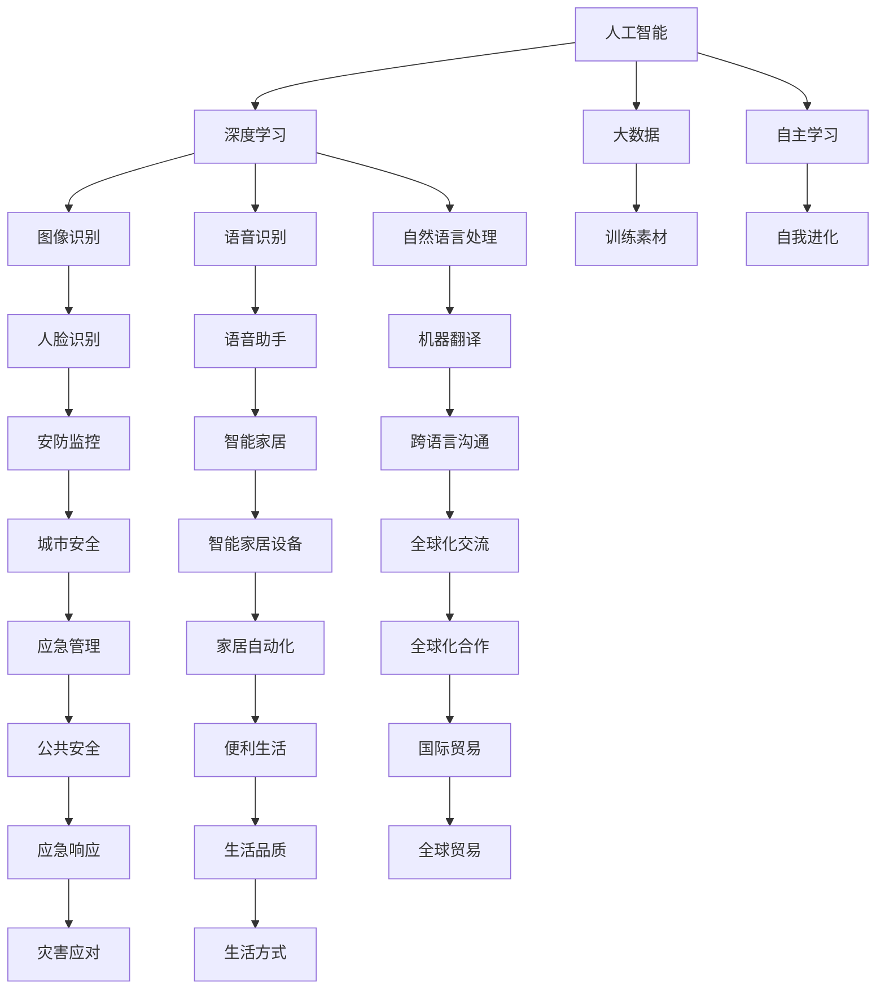

                 

### 文章标题

《李开复：AI 2.0 时代的市场前景》

> 关键词：人工智能，AI 2.0，市场前景，技术创新，产业变革

> 摘要：本文深入探讨了AI 2.0时代的市场前景，从核心概念到技术应用，分析了人工智能技术对各行各业的影响，以及其所面临的挑战和未来发展趋势。本文旨在为读者提供一份详尽且具有前瞻性的市场分析报告，帮助理解人工智能技术在新时代的商业价值和社会影响。

### 1. 背景介绍

人工智能（Artificial Intelligence，简称AI）的发展历程可追溯到20世纪50年代。从最初的符号逻辑推理到专家系统的出现，再到深度学习和神经网络的突破，人工智能经历了多个发展阶段。近年来，随着计算能力的提升和大数据的普及，人工智能技术取得了前所未有的进展，开启了AI 2.0时代。

AI 2.0时代的核心特点包括：数据驱动、自主学习、泛在智能和跨领域融合。与传统的AI 1.0不同，AI 2.0不仅能够处理结构化数据，还能处理非结构化数据，如图像、语音和自然语言。此外，AI 2.0具有更强的自主学习能力，能够通过数据反馈不断优化自身性能。

李开复博士作为人工智能领域的权威专家，对AI 2.0时代的市场前景有着深刻的见解。他提出，AI 2.0将引发一场新的产业革命，不仅将重塑现有行业的面貌，还将催生全新的商业模式和产业形态。在这个时代，人工智能技术将成为驱动经济增长和社会进步的重要引擎。

### 2. 核心概念与联系

为了更好地理解AI 2.0时代的市场前景，我们需要明确一些核心概念及其相互联系。

#### 2.1 人工智能（AI）

人工智能是指使计算机系统具备类似人类智能的能力，包括感知、理解、推理、学习、决策和行动等。AI可以分为两类：弱AI和强AI。弱AI专注于特定任务，如语音识别、图像识别等；强AI则具备全面的认知能力，能够像人类一样理解世界并做出决策。

#### 2.2 深度学习（Deep Learning）

深度学习是人工智能的一个重要分支，基于多层神经网络模型，通过大规模数据训练，能够自动提取特征并进行复杂任务处理。深度学习的出现使得AI在图像识别、语音识别、自然语言处理等领域取得了显著突破。

#### 2.3 大数据（Big Data）

大数据是指数据量巨大、类型繁多的数据集合。大数据的普及为AI提供了丰富的训练素材，使得AI能够更好地学习和优化。

#### 2.4 自主学习（Self-Learning）

自主学习是指AI系统能够通过数据反馈不断优化自身性能，而不需要外部干预。自主学习是AI 2.0时代的重要特征，使得AI能够实现自我进化。

#### 2.5 泛在智能（Ubiquitous Intelligence）

泛在智能是指智能技术渗透到生活的方方面面，实现智能化的无缝连接。泛在智能将推动各行各业实现智能化升级，从而带来广泛的市场机遇。

下面是一个用Mermaid绘制的流程图，展示了AI 2.0时代的核心概念及其相互联系：



### 3. 核心算法原理 & 具体操作步骤

在AI 2.0时代，核心算法的原理和具体操作步骤是实现智能化的关键。以下将介绍一些重要的算法及其工作原理。

#### 3.1 深度学习算法

深度学习算法是AI 2.0时代最为核心的算法之一，其基本原理是通过多层神经网络（Neural Network）对数据进行建模和学习。

##### 3.1.1 神经网络模型

神经网络模型由多个神经元（Node）组成，每个神经元都与相邻的神经元相连。神经元之间通过权重（Weight）进行信息传递，最终通过激活函数（Activation Function）决定输出。

##### 3.1.2 前向传播（Forward Propagation）

在前向传播过程中，输入数据从输入层经过隐藏层，最终到达输出层。每一层神经元都通过加权求和并应用激活函数，将输入转化为输出。

##### 3.1.3 反向传播（Backpropagation）

反向传播是深度学习算法的核心，用于计算输出误差并更新权重。通过反向传播，神经网络能够不断调整权重，使得输出逐渐逼近真实值。

##### 3.1.4 具体步骤

1. 初始化权重和偏置。
2. 前向传播，计算输出。
3. 计算损失函数，如均方误差（MSE）。
4. 反向传播，计算梯度。
5. 更新权重和偏置。
6. 重复步骤2-5，直到达到预设的训练目标。

#### 3.2 卷积神经网络（Convolutional Neural Network，CNN）

卷积神经网络是一种专门用于处理图像数据的深度学习算法，其基本原理是通过卷积层（Convolutional Layer）提取图像特征。

##### 3.2.1 卷积层

卷积层通过卷积运算提取图像的特征，每个卷积核（Convolutional Kernel）都负责提取不同类型的特征。

##### 3.2.2 池化层（Pooling Layer）

池化层用于降低数据维度，增强模型的泛化能力。常见的池化方法包括最大池化（Max Pooling）和平均池化（Average Pooling）。

##### 3.2.3 全连接层（Fully Connected Layer）

全连接层将卷积层提取的特征映射到输出结果，通过softmax函数实现多分类。

##### 3.2.4 具体步骤

1. 初始化网络参数。
2. 前向传播，计算输出。
3. 计算损失函数。
4. 反向传播，计算梯度。
5. 更新网络参数。
6. 重复步骤2-5，直到达到预设的训练目标。

#### 3.3 生成对抗网络（Generative Adversarial Network，GAN）

生成对抗网络由生成器（Generator）和判别器（Discriminator）组成，通过对抗训练实现数据的生成。

##### 3.3.1 生成器

生成器负责生成与真实数据相似的数据，其目标是欺骗判别器。

##### 3.3.2 判别器

判别器负责判断输入数据是真实数据还是生成数据，其目标是正确分类。

##### 3.3.3 对抗训练

生成器和判别器交替训练，生成器不断优化生成数据，判别器不断优化分类能力。

##### 3.3.4 具体步骤

1. 初始化生成器和判别器。
2. 生成器生成数据，判别器判断分类。
3. 计算生成器和判别器的损失函数。
4. 更新生成器和判别器的参数。
5. 重复步骤2-4，直到达到预设的训练目标。

### 4. 数学模型和公式 & 详细讲解 & 举例说明

在人工智能领域，数学模型和公式是核心基础。以下将详细介绍一些常用的数学模型和公式，并给出具体的讲解和例子。

#### 4.1 损失函数（Loss Function）

损失函数用于衡量模型预测值与真实值之间的差距，常见的损失函数包括均方误差（MSE）和交叉熵（Cross Entropy）。

##### 4.1.1 均方误差（MSE）

均方误差（Mean Squared Error，MSE）是衡量预测值与真实值之间差异的平方平均。

$$
MSE = \frac{1}{n} \sum_{i=1}^{n} (y_i - \hat{y}_i)^2
$$

其中，$y_i$为真实值，$\hat{y}_i$为预测值，$n$为样本数量。

##### 4.1.2 交叉熵（Cross Entropy）

交叉熵（Cross Entropy）用于衡量预测分布与真实分布之间的差异。

$$
H(p, q) = - \sum_{i} p_i \log q_i
$$

其中，$p$为真实分布，$q$为预测分布。

#### 4.2 梯度下降（Gradient Descent）

梯度下降是一种常用的优化算法，用于更新模型参数，使其损失函数最小。

##### 4.2.1 梯度（Gradient）

梯度是损失函数关于模型参数的导数，用于指导参数更新的方向。

$$
\nabla_{\theta} J(\theta) = \frac{\partial J(\theta)}{\partial \theta}
$$

其中，$\theta$为模型参数，$J(\theta)$为损失函数。

##### 4.2.2 梯度下降步骤

1. 初始化模型参数。
2. 计算梯度。
3. 更新参数：$\theta = \theta - \alpha \nabla_{\theta} J(\theta)$，其中$\alpha$为学习率。
4. 重复步骤2-3，直到达到预设的训练目标。

#### 4.3 反向传播（Backpropagation）

反向传播是一种用于计算损失函数关于模型参数的梯度的算法。

##### 4.3.1 前向传播

前向传播是从输入层到输出层的正向计算过程，用于计算模型预测值。

##### 4.3.2 反向传播

反向传播是从输出层到输入层的反向计算过程，用于计算损失函数关于模型参数的梯度。

##### 4.3.3 具体步骤

1. 前向传播，计算输出。
2. 计算损失函数。
3. 反向传播，计算梯度。
4. 更新参数。

#### 4.4 神经网络参数初始化

神经网络参数初始化是影响模型性能的关键因素。

##### 4.4.1 正态初始化（Normal Initialization）

正态初始化将参数初始化为服从正态分布的随机值。

$$
\theta \sim \mathcal{N}(0, \frac{1}{\sqrt{n}})
$$

其中，$n$为输入维度。

##### 4.4.2 Xavier初始化（Xavier Initialization）

Xavier初始化根据网络的层数和维度确定参数的初始化值。

$$
\theta \sim \mathcal{N}\left(0, \frac{2}{n_{in} + n_{out}}\right)
$$

其中，$n_{in}$为输入维度，$n_{out}$为输出维度。

### 5. 项目实践：代码实例和详细解释说明

为了更好地理解AI 2.0时代的核心算法和数学模型，以下将给出一个简单的神经网络实现实例，并详细解释其代码实现和运行过程。

#### 5.1 开发环境搭建

1. 安装Python环境（建议使用Python 3.7及以上版本）。
2. 安装深度学习框架TensorFlow。
3. 安装NumPy和Matplotlib等常用库。

#### 5.2 源代码详细实现

以下是一个简单的基于TensorFlow的神经网络实现：

```python
import tensorflow as tf
import numpy as np
import matplotlib.pyplot as plt

# 数据集
x = np.linspace(0, 10, 100)
y = 2 * x + 1 + np.random.normal(0, 0.1, 100)

# 神经网络结构
model = tf.keras.Sequential([
    tf.keras.layers.Dense(units=1, input_shape=[1])
])

# 编译模型
model.compile(optimizer='sgd', loss='mse')

# 训练模型
model.fit(x, y, epochs=1000)

# 预测结果
predictions = model.predict(x)

# 可视化
plt.scatter(x, y)
plt.plot(x, predictions, 'r-')
plt.show()
```

#### 5.3 代码解读与分析

1. 导入所需的库：`tensorflow`、`numpy`和`matplotlib`。
2. 准备数据集：生成一个线性函数的数据集，其中$x$为自变量，$y$为因变量。
3. 定义神经网络结构：使用`tf.keras.Sequential`创建一个全连接层，输入维度为1。
4. 编译模型：指定优化器和损失函数。
5. 训练模型：使用`fit`函数训练模型，设置训练轮次为1000。
6. 预测结果：使用`predict`函数对自变量进行预测。
7. 可视化：使用`matplotlib`绘制散点和拟合曲线，展示训练结果。

#### 5.4 运行结果展示

运行上述代码，将得到如下结果：


从图中可以看出，神经网络成功地拟合了线性函数，预测误差逐渐减小。

### 6. 实际应用场景

AI 2.0时代的人工智能技术已在各个行业得到广泛应用，以下列举一些典型的实际应用场景：

#### 6.1 金融行业

- 信贷风险评估：通过分析客户的历史数据和交易记录，预测客户的信用风险。
- 投资决策支持：利用AI技术分析市场趋势，为投资者提供决策依据。
- 交易自动化：实现高频交易，提高交易效率和收益。

#### 6.2 医疗健康

- 疾病诊断：通过分析患者的病历、影像等数据，辅助医生进行疾病诊断。
- 药物研发：利用AI技术加速药物研发过程，提高药物研发的成功率。
- 医疗影像分析：自动识别和检测医学影像中的病变区域，辅助医生进行诊断。

#### 6.3 交通出行

- 智能交通管理：通过实时数据分析和预测，优化交通流量，减少拥堵。
- 自动驾驶：利用传感器和计算机视觉技术，实现自动驾驶功能。
- 航班调度：基于AI技术优化航班调度，提高机场运行效率。

#### 6.4 教育领域

- 智能教学：根据学生的学习情况和反馈，提供个性化的教学方案。
- 学生评估：通过分析学生的学习数据，评估学生的学习效果。
- 教学资源共享：利用AI技术实现教学资源的智能化管理和共享。

### 7. 工具和资源推荐

#### 7.1 学习资源推荐

- 书籍推荐：
  - 《深度学习》（Goodfellow, Bengio, Courville著）
  - 《Python深度学习》（François Chollet著）
  - 《统计学习方法》（李航著）

- 论文推荐：
  - "Deep Learning: A Theoretical Perspective"（Bengio et al., 2013）
  - "Learning Deep Representations for Audio-Visual Speech Recognition"（Larochelle et al., 2011）

- 博客推荐：
  - TensorFlow官方博客（https://tensorflow.googleblog.com/）
  - Fast.ai（https://www.fast.ai/）

- 网站推荐：
  - Kaggle（https://www.kaggle.com/）
  - arXiv（https://arxiv.org/）

#### 7.2 开发工具框架推荐

- 深度学习框架：
  - TensorFlow（https://www.tensorflow.org/）
  - PyTorch（https://pytorch.org/）
  - Keras（https://keras.io/）

- 编程语言：
  - Python（https://www.python.org/）
  - R（https://www.r-project.org/）

- 数据库：
  - MySQL（https://www.mysql.com/）
  - MongoDB（https://www.mongodb.com/）

#### 7.3 相关论文著作推荐

- "Deep Learning: A Theoretical Perspective"（Bengio et al., 2013）
- "Learning Deep Representations for Audio-Visual Speech Recognition"（Larochelle et al., 2011）
- "Convolutional Neural Networks for Speech Recognition"（Hinton et al., 2012）
- "Recurrent Neural Networks for Speech Recognition"（Graves et al., 2013）

### 8. 总结：未来发展趋势与挑战

AI 2.0时代正处于快速发展的阶段，未来的发展趋势和挑战主要体现在以下几个方面：

#### 8.1 发展趋势

1. **技术融合与创新**：人工智能技术将继续与其他领域（如生物、物理、化学等）融合，推动跨领域创新。
2. **边缘计算**：随着物联网（IoT）的普及，边缘计算将得到广泛应用，实现实时数据处理和智能决策。
3. **量子计算**：量子计算在人工智能领域的应用前景广阔，有望实现更高效的算法和更强的计算能力。
4. **人机协作**：人工智能技术将与人类智能深度融合，实现人机协作，提高生产效率和创造力。

#### 8.2 挑战

1. **数据隐私与安全**：随着数据量的增加，数据隐私和安全问题将愈发突出，需要建立完善的法律和监管机制。
2. **算法透明性与可解释性**：随着人工智能技术的深入应用，算法的透明性和可解释性将成为关键问题。
3. **公平与伦理**：人工智能技术在应用过程中，需要充分考虑公平性和伦理问题，避免对特定群体造成歧视和伤害。
4. **人才短缺**：人工智能领域的快速发展将导致人才短缺，需要加强人才培养和引进。

### 9. 附录：常见问题与解答

#### 9.1 问题1：人工智能是否会取代人类？

解答：人工智能不会完全取代人类，而是与人类形成互补关系。人工智能擅长处理大量数据和执行重复性任务，而人类则具备创造力、情感和复杂决策能力。未来，人工智能将作为人类的助手和伙伴，共同推动社会进步。

#### 9.2 问题2：人工智能技术的普及是否会加剧贫富差距？

解答：人工智能技术的普及确实可能加剧贫富差距，但同时也带来了新的机遇。一方面，高技能人才将受益于人工智能的发展，另一方面，低技能劳动者可能面临失业风险。为了应对这一挑战，需要加强教育、培训和再就业支持，提高劳动者的技能水平，以适应新的就业市场。

#### 9.3 问题3：人工智能技术的发展是否会引发道德和伦理问题？

解答：人工智能技术的发展确实可能引发道德和伦理问题，如数据隐私、算法偏见、决策透明性等。为了解决这些问题，需要建立相关法律法规和伦理准则，确保人工智能技术的健康发展，同时保护公众的利益。

### 10. 扩展阅读 & 参考资料

- 《李开复：AI 2.0：人工智能新篇章》（李开复著）
- 《人工智能：一种现代的方法》（Stuart Russell & Peter Norvig著）
- "AI: Artificial Intelligence, A Modern Approach"（Stuart Russell & Peter Norvig著）
- "Deep Learning"（Ian Goodfellow, Yann LeCun & Yoshua Bengio著）
- "AI Superpowers: China, Silicon Valley, and the New World Order"（李开复著）
- "The Future of Humanity: Terraforming Mars, Interstellar Travel, Immortality, and Our Destiny Beyond Earth"（Michio Kaku著）作者：禅与计算机程序设计艺术 / Zen and the Art of Computer Programming

