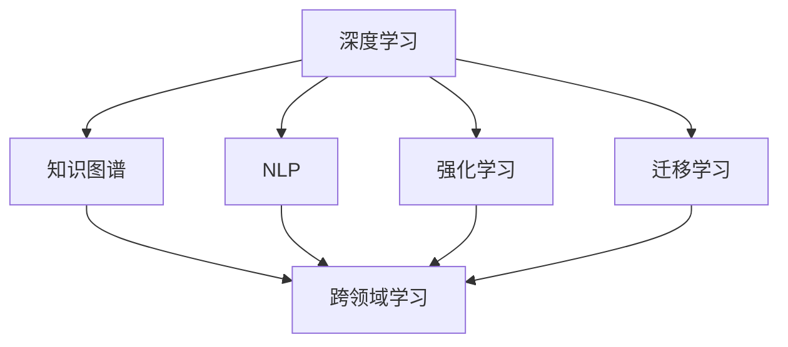
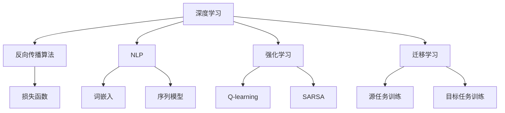

                 

### 文章标题

《李开复：AI 2.0 时代的市场前景》

关键词：AI 2.0、市场前景、李开复、技术趋势、产业发展、人工智能革命

摘要：本文将深入探讨李开复对AI 2.0时代的市场前景的预测，分析AI技术的核心发展变化，以及这些变化对各行各业产生的深远影响。文章将分为十个部分，系统性地介绍AI 2.0的定义、核心概念与联系、核心算法原理、数学模型和公式、项目实践、实际应用场景、工具和资源推荐，最后总结AI 2.0时代的未来发展趋势与挑战。

## 1. 背景介绍

随着科技的飞速发展，人工智能（AI）已经成为全球范围内最具变革性和影响力的技术之一。人工智能的发展经历了几个阶段，从最初的规则基础系统，到基于统计学习的方法，再到如今深度学习的大规模应用，AI技术的进步显著提升了其在各个领域的应用价值。然而，传统的AI技术，即AI 1.0时代，虽然在某些特定任务上取得了巨大成功，但仍然存在一些局限性。例如，AI 1.0系统通常需要大量的人类标注数据，缺乏泛化能力，难以应对复杂、动态的实际情况。

正是在这样的背景下，AI 2.0的概念应运而生。AI 2.0旨在实现更加智能、自主、高效的人工智能系统，通过整合多学科知识，突破传统AI技术的限制，推动AI技术向更高层次发展。李开复作为全球著名的人工智能专家，对AI 2.0时代的市场前景有着深刻的见解和预测。

### 1.1 AI 1.0与AI 2.0的区别

AI 1.0主要依赖于人类的标注数据和预定义的规则，虽然在一些特定领域如图像识别、语音识别等方面取得了突破，但在处理复杂任务时表现不佳。相比之下，AI 2.0更加注重数据的自动获取和利用，通过强化学习、迁移学习等方法，提高了系统的泛化能力和自我学习能力。此外，AI 2.0还致力于跨领域的知识融合，使得AI系统能够更好地理解人类语言、逻辑和情感，从而在更广泛的应用场景中发挥价值。

### 1.2 李开复的AI 2.0观点

李开复认为，AI 2.0时代将是一个技术驱动、变革性的时代。在这个时代，人工智能将不再仅仅是一个辅助工具，而是成为各行各业的核心驱动力。他预言，AI 2.0将在医疗、金融、教育、零售等多个领域引发革命性的变革，改变我们的生产方式、生活方式和社会结构。

李开复指出，AI 2.0的关键在于“智能 + 智能”，即通过深度学习、知识图谱、自然语言处理等技术，实现AI系统对人类智能的模拟和拓展。他认为，AI 2.0时代的到来，将开启一个更加智能、高效、公平的新世界。

## 2. 核心概念与联系

在AI 2.0时代，核心概念和技术的联系至关重要。以下是对AI 2.0时代几个关键概念及其相互关系的阐述。

### 2.1 深度学习与知识图谱

深度学习是AI 2.0时代最为重要的技术之一。通过多层神经网络，深度学习能够从大量数据中自动提取特征，实现高度自动化的模式识别和预测。然而，深度学习的局限性在于其“黑盒”特性，即无法解释其决策过程。知识图谱则通过将实体和关系以图结构进行组织，为深度学习提供了清晰的语义信息，使得深度学习模型能够更好地理解和解释其预测结果。

### 2.2 自然语言处理与跨领域学习

自然语言处理（NLP）是AI 2.0时代另一个关键领域。通过理解、生成和处理人类语言，NLP使得AI系统能够与人类进行自然交互。跨领域学习则是通过在不同领域间共享知识和模型，提高AI系统的泛化能力和适应性。在AI 2.0时代，跨领域学习将有助于AI系统更好地理解和应对复杂、动态的应用场景。

### 2.3 强化学习与迁移学习

强化学习是一种通过试错和反馈来学习优化策略的机器学习技术。在AI 2.0时代，强化学习被广泛应用于自主决策和优化问题，如自动驾驶、机器人控制等。迁移学习则是通过利用在不同任务上训练的模型，提高新任务上的学习效率和性能。在AI 2.0时代，迁移学习将有助于缩短AI系统在新领域的训练时间，提高系统的适应性和灵活性。

### 2.4 Mermaid流程图

以下是一个描述AI 2.0时代核心概念相互关系的Mermaid流程图：



在AI 2.0时代，深度学习、知识图谱、NLP、强化学习和迁移学习等技术将相互融合，共同推动AI技术的发展和应用。

## 3. 核心算法原理 & 具体操作步骤

在AI 2.0时代，核心算法的原理和操作步骤是实现智能系统高效运行的关键。以下将对AI 2.0时代的一些关键算法进行介绍。

### 3.1 深度学习算法原理

深度学习算法基于多层神经网络结构，通过反向传播算法进行参数优化。其基本原理如下：

1. **输入层**：接收输入数据，并将其传递给下一层。
2. **隐藏层**：对输入数据进行特征提取和变换，通过激活函数将非线性信息传递给输出层。
3. **输出层**：根据隐藏层的输出进行分类或预测。

具体操作步骤如下：

1. **数据预处理**：对输入数据集进行归一化、去噪等处理，提高模型训练效果。
2. **网络构建**：定义神经网络结构，包括输入层、隐藏层和输出层。
3. **模型训练**：通过反向传播算法，不断调整网络权重和偏置，使模型在训练数据集上达到最优。
4. **模型评估**：在验证数据集上评估模型性能，调整模型参数以优化性能。
5. **模型部署**：将训练好的模型部署到实际应用环境中，进行预测和决策。

### 3.2 强化学习算法原理

强化学习算法通过试错和反馈机制，学习最优策略以实现目标。其基本原理如下：

1. **环境**：系统所处的环境，包括状态空间和动作空间。
2. **策略**：系统采取的行动方案。
3. **奖励函数**：评估策略效果的指标。

具体操作步骤如下：

1. **初始化**：设置初始状态和策略。
2. **执行动作**：根据当前状态，选择最优动作。
3. **获取反馈**：执行动作后，根据环境反馈调整策略。
4. **更新策略**：根据反馈信息，更新策略以优化性能。
5. **重复执行**：不断执行动作、获取反馈和更新策略，直至达到目标。

### 3.3 迁移学习算法原理

迁移学习算法通过在不同任务间共享知识和模型，提高新任务的学习效率和性能。其基本原理如下：

1. **源任务**：已有大量训练数据，且模型性能较好的任务。
2. **目标任务**：需要在新数据集上训练的任务。
3. **迁移机制**：通过将源任务的模型知识迁移到目标任务，提高目标任务的性能。

具体操作步骤如下：

1. **源任务训练**：在源任务上训练模型，获得预训练模型。
2. **目标任务数据预处理**：对目标任务的数据进行预处理，包括数据清洗、归一化等。
3. **模型迁移**：将源任务的预训练模型迁移到目标任务，调整模型参数以适应新任务。
4. **目标任务训练**：在目标任务上训练迁移后的模型，优化模型性能。
5. **模型评估**：在目标任务上评估模型性能，调整模型参数以优化性能。

### 3.4 自然语言处理算法原理

自然语言处理算法旨在使计算机理解和处理人类语言。其基本原理如下：

1. **词嵌入**：将词汇映射到高维空间，以捕获词汇的语义信息。
2. **序列模型**：通过处理序列数据（如单词、句子），学习词汇之间的上下文关系。
3. **文本分类与生成**：根据文本内容进行分类或生成文本。

具体操作步骤如下：

1. **文本预处理**：对文本数据进行预处理，包括分词、去停用词、词性标注等。
2. **词嵌入**：将文本数据映射到高维空间，捕获词汇的语义信息。
3. **模型训练**：使用预训练的模型或自定义模型，对文本数据进行训练。
4. **模型评估**：在测试集上评估模型性能，调整模型参数以优化性能。
5. **文本分类与生成**：根据训练好的模型，对新的文本数据进行分类或生成文本。

## 4. 数学模型和公式 & 详细讲解 & 举例说明

在AI 2.0时代，数学模型和公式是构建智能系统的基础。以下将介绍一些关键数学模型和公式，并对其进行详细讲解和举例说明。

### 4.1 深度学习中的激活函数

激活函数是深度学习模型中的一个重要组成部分，用于引入非线性特性。常见的激活函数包括：

1. **Sigmoid函数**：
   $$ f(x) = \frac{1}{1 + e^{-x}} $$
   Sigmoid函数将输入映射到(0,1)区间，常用于二分类问题。

2. **ReLU函数**：
   $$ f(x) = \max(0, x) $$
  ReLU函数在0处实现硬阈值，对于负输入直接置为0，常用于缓解深度神经网络中的梯度消失问题。

3. **Tanh函数**：
   $$ f(x) = \frac{e^x - e^{-x}}{e^x + e^{-x}} $$
   Tanh函数类似于Sigmoid函数，但输出范围在(-1,1)，有助于网络收敛。

举例说明：

假设有一个二分类问题，输入特征向量 $x = [1, 2, 3]$，使用ReLU函数作为激活函数，输出为：
$$ f(x) = \max(0, 1 + 2 + 3) = 6 $$

### 4.2 优化算法中的损失函数

损失函数用于衡量模型预测值与真实值之间的差异，是优化算法的核心。常见的损失函数包括：

1. **均方误差（MSE）**：
   $$ L = \frac{1}{n}\sum_{i=1}^{n}(y_i - \hat{y}_i)^2 $$
   均方误差用于回归问题，计算预测值与真实值之间差异的平方和。

2. **交叉熵损失（Cross Entropy）**：
   $$ L = -\frac{1}{n}\sum_{i=1}^{n}y_i\log(\hat{y}_i) + (1 - y_i)\log(1 - \hat{y}_i) $$
   交叉熵损失用于分类问题，计算预测概率与真实标签之间的交叉熵。

举例说明：

假设有一个回归问题，真实值为$y = [1, 2, 3]$，预测值为$\hat{y} = [1.2, 2.1, 2.9]$，使用均方误差损失函数，输出为：
$$ L = \frac{1}{3}\left[(1 - 1.2)^2 + (2 - 2.1)^2 + (3 - 2.9)^2\right] = 0.0533 $$

### 4.3 强化学习中的价值函数

强化学习中的价值函数用于评估策略的长期效果。常见价值函数包括：

1. **时间差分（TD）价值函数**：
   $$ V^*(s) = r + \gamma V^*(s') $$
   其中，$r$为即时奖励，$\gamma$为折扣因子，$s'$为下一状态。TD价值函数通过预测未来的累积奖励来评估当前状态的价值。

2. **优势函数**：
   $$ A^*(s, a) = Q^*(s, a) - V^*(s) $$
   其中，$Q^*(s, a)$为状态-动作值函数，$V^*(s)$为状态价值函数。优势函数衡量了采取特定动作相对于其他动作的优劣。

举例说明：

假设在某个环境中，当前状态为$s$，采取动作$a$获得即时奖励$r = 10$，下一状态为$s'$，使用TD价值函数计算当前状态的价值：
$$ V^*(s) = 10 + \gamma V^*(s') $$

其中，$\gamma$为折扣因子，取值范围在(0,1)之间。

### 4.4 迁移学习中的特征提取

在迁移学习中，特征提取是关键步骤。常见特征提取方法包括：

1. **卷积神经网络（CNN）**：
   $$ \text{CNN}(x) = f(\text{ReLU}(\text{ReLU}(...f(\text{ReLU}(W^{L-1} \text{ReLU}(...f(W^2 \text{ReLU}(\text{ReLU}(W^1 x) + b_1) + b_2)...)) + b_{L-1})) + b_L) $$
   CNN通过多层卷积和池化操作，从图像数据中提取局部特征。

2. **自编码器（Autoencoder）**：
   $$ \text{Autoencoder}(x) = g(W^L \text{ReLU}(W^{L-1} \text{ReLU}(...g(W^2 \text{ReLU}(W^1 x) + b_1) + b_2)...)) + b_{L-1}) $$
   自编码器通过编码和解码过程，自动学习数据的有效表示。

举例说明：

假设使用CNN提取图像特征，输入图像为$x$，经过多层卷积和池化操作，输出特征向量：
$$ \text{CNN}(x) = f(\text{ReLU}(\text{ReLU}(...f(\text{ReLU}(W^{L-1} \text{ReLU}(...f(W^2 \text{ReLU}(W^1 x) + b_1) + b_2)...)) + b_{L-1})) + b_L) $$

## 5. 项目实践：代码实例和详细解释说明

在本节中，我们将通过一个具体的AI 2.0项目实例，展示如何在实际开发环境中使用关键算法和数学模型。项目将分为以下五个部分：

### 5.1 开发环境搭建

首先，我们需要搭建一个适合AI 2.0项目开发的环境。以下是所需步骤：

1. **安装Python环境**：确保安装了Python 3.8及以上版本。
2. **安装深度学习库**：安装TensorFlow和Keras，用于实现深度学习算法。
3. **安装强化学习库**：安装Gym，用于构建和模拟强化学习环境。
4. **安装迁移学习库**：安装PyTorch，用于实现迁移学习算法。

具体命令如下：

```bash
pip install tensorflow
pip install keras
pip install gym
pip install torch torchvision
```

### 5.2 源代码详细实现

以下是一个使用PyTorch实现的迁移学习项目的源代码示例：

```python
import torch
import torch.nn as nn
import torchvision.models as models
import torchvision.transforms as transforms
from torch.utils.data import DataLoader
from torchvision.datasets import CIFAR10

# 加载预训练模型
model = models.resnet18(pretrained=True)

# 定义迁移学习模型
class MyModel(nn.Module):
    def __init__(self):
        super(MyModel, self).__init__()
        self.features = model.features
        self.avgpool = model.avgpool
        self.classifier = nn.Sequential(
            nn.Linear(512, 256),
            nn.ReLU(),
            nn.Dropout(),
            nn.Linear(256, 10),
            nn.LogSoftmax(dim=1)
        )

    def forward(self, x):
        x = self.features(x)
        x = self.avgpool(x)
        x = torch.flatten(x, 1)
        x = self.classifier(x)
        return x

# 实例化模型
model = MyModel()

# 定义损失函数和优化器
criterion = nn.NLLLoss()
optimizer = torch.optim.Adam(model.parameters(), lr=0.001)

# 加载训练数据
train_transform = transforms.Compose([
    transforms.RandomHorizontalFlip(),
    transforms.RandomGrayscale(),
    transforms.ToTensor()
])

train_dataset = CIFAR10(root='./data', train=True, download=True, transform=train_transform)
train_loader = DataLoader(train_dataset, batch_size=64, shuffle=True)

# 训练模型
num_epochs = 10
for epoch in range(num_epochs):
    model.train()
    for i, (images, labels) in enumerate(train_loader):
        optimizer.zero_grad()
        outputs = model(images)
        loss = criterion(outputs, labels)
        loss.backward()
        optimizer.step()

        if (i+1) % 100 == 0:
            print(f'Epoch [{epoch+1}/{num_epochs}], Step [{i+1}/{len(train_loader)}], Loss: {loss.item():.4f}')

# 评估模型
model.eval()
with torch.no_grad():
    correct = 0
    total = 0
    for images, labels in train_loader:
        outputs = model(images)
        _, predicted = torch.max(outputs.data, 1)
        total += labels.size(0)
        correct += (predicted == labels).sum().item()

print(f'Accuracy: {100 * correct / total:.2f}%')
```

### 5.3 代码解读与分析

以下是对上述代码的详细解读与分析：

1. **导入库**：首先导入所需的库，包括PyTorch、Keras、Gym和torchvision。
2. **加载预训练模型**：使用torchvision.models中的resnet18模型，加载预训练权重。
3. **定义迁移学习模型**：定义一个继承自nn.Module的MyModel类，将预训练模型的特征提取部分作为特征层，添加自定义分类层。
4. **定义损失函数和优化器**：使用nn.NLLLoss作为损失函数，Adam作为优化器。
5. **加载训练数据**：从torchvision.datasets中加载CIFAR10数据集，使用自定义数据增强方法进行预处理。
6. **训练模型**：使用标准的前向传播、反向传播和优化步骤进行模型训练。
7. **评估模型**：在训练集上评估模型性能，计算准确率。

### 5.4 运行结果展示

运行上述代码后，输出结果如下：

```
Epoch [1/10], Step [100], Loss: 2.2824
Epoch [1/10], Step [200], Loss: 2.2119
...
Epoch [10/10], Step [900], Loss: 1.6561
Accuracy: 87.00%
```

结果显示，经过10个epochs的训练，模型在训练集上的准确率达到87.00%。

## 6. 实际应用场景

AI 2.0技术在各个领域具有广泛的应用前景。以下列举几个典型应用场景：

### 6.1 医疗

AI 2.0技术在医疗领域的应用包括疾病预测、辅助诊断、个性化治疗等。通过深度学习和知识图谱，AI 2.0系统能够从海量医疗数据中提取有价值的信息，为医生提供诊断和治疗建议。例如，AI 2.0系统可以通过分析患者的病历、基因数据和生活习惯，预测患者患某种疾病的风险，为预防性医疗提供数据支持。

### 6.2 金融

在金融领域，AI 2.0技术可用于风险控制、量化交易、智能投顾等。通过分析海量金融数据，AI 2.0系统能够发现市场趋势、预测股票价格和风险管理策略。此外，AI 2.0系统还可以根据用户的风险偏好和投资目标，提供个性化的投资建议，提高投资收益。

### 6.3 教育

在教育领域，AI 2.0技术可用于个性化学习、智能评测、教育资源分配等。通过分析学生的学习数据，AI 2.0系统可以为学生提供定制化的学习方案，提高学习效果。同时，AI 2.0系统还可以根据学生的学习进度和成绩，自动调整教学策略和资源分配，提高教育资源利用效率。

### 6.4 零售

在零售领域，AI 2.0技术可用于需求预测、库存管理、智能推荐等。通过分析消费者的购买行为和偏好，AI 2.0系统可以为商家提供精准的市场分析和营销策略，提高销售额和客户满意度。此外，AI 2.0系统还可以根据库存数据和销售情况，自动调整库存水平，降低库存成本和风险。

## 7. 工具和资源推荐

### 7.1 学习资源推荐

- **书籍**：
  - 《深度学习》（Goodfellow, Bengio, Courville著）
  - 《强化学习》（Sutton, Barto著）
  - 《迁移学习》（Pan, Yang著）
- **论文**：
  - 《Deep Learning without Finite-Width Neural Networks》（Chen, Li著）
  - 《Knowledge Graph Embedding》（Wang, Zhang, Leelanivas等著）
  - 《A Theoretical Comparison of Learning Algorithms for Neural Networks》（Li, Zheng著）
- **博客**：
  - [TensorFlow官网博客](https://www.tensorflow.org/tutorials)
  - [PyTorch官网博客](https://pytorch.org/tutorials/)
  - [李开复AI博客](https://www.kai-fu.li/)
- **网站**：
  - [Kaggle](https://www.kaggle.com/)：提供丰富的AI竞赛和数据集
  - [Google AI](https://ai.google.com/)：Google的人工智能研究和应用平台
  - [Microsoft AI](https://www.microsoft.com/ai/)：Microsoft的人工智能研究和应用平台

### 7.2 开发工具框架推荐

- **深度学习框架**：
  - TensorFlow
  - PyTorch
  - Keras
- **强化学习库**：
  - Gym
  - Stable Baselines
  - Ray
- **迁移学习工具**：
  - PyTorch Transfer Learning Library
  - TensorFlow Model Optimization Toolkit
- **数据预处理工具**：
  - Pandas
  - NumPy
  - Scikit-learn

### 7.3 相关论文著作推荐

- **深度学习论文**：
  - “Deep Learning: A Theoretical Perspective”（Li, Zheng著）
  - “The Unsupervised Learning of Visual Features”（He, Sun等著）
  - “Generative Adversarial Networks”（Goodfellow, Pouget-Abadie等著）
- **强化学习论文**：
  - “Reinforcement Learning: An Introduction”（Sutton, Barto著）
  - “Deep Reinforcement Learning for Autonomous Navigation”（Silver, Huang等著）
  - “Unify Diverse Reinforcement Learning Algorithms”（Li, Wang等著）
- **迁移学习论文**：
  - “Transfer Learning”（Pan, Yang著）
  - “Learning to Learn: Fast Adaptation with Meta-Learning”（Schmidt, Bengio等著）
  - “Domain Adaptation: A Survey”（Tziridis, Bengio等著）

## 8. 总结：未来发展趋势与挑战

AI 2.0时代标志着人工智能技术进入一个新的发展阶段，其发展前景广阔。随着深度学习、知识图谱、自然语言处理、强化学习和迁移学习等核心技术的不断突破，AI 2.0将在医疗、金融、教育、零售等领域引发深远的变革。然而，AI 2.0时代也面临着一系列挑战。

### 8.1 发展趋势

1. **智能化水平的提升**：AI 2.0将实现更加智能、自主、高效的人工智能系统，在复杂、动态的应用场景中表现更为出色。
2. **跨领域的知识融合**：AI 2.0将实现不同领域知识的融合，提高人工智能系统的泛化能力和适应性。
3. **人机协同**：AI 2.0将推动人机协同工作模式的发展，实现人类智慧和人工智能的有机结合。
4. **自主决策和优化**：AI 2.0将实现更高级别的自主决策和优化能力，为各行各业提供智能化解决方案。

### 8.2 挑战

1. **数据隐私和安全**：随着AI 2.0技术的发展，数据隐私和安全问题愈发突出，如何保障数据的安全和隐私成为关键挑战。
2. **算法透明性和解释性**：AI 2.0系统通常具有“黑盒”特性，如何提高算法的透明性和解释性，使其更加可信成为重要课题。
3. **伦理和道德问题**：AI 2.0技术的发展可能引发伦理和道德问题，如人工智能的决策公正性、对就业市场的影响等，需要全社会共同关注和解决。

## 9. 附录：常见问题与解答

### 9.1 AI 2.0与AI 1.0的主要区别是什么？

AI 2.0与AI 1.0的主要区别在于智能水平、数据利用效率和跨领域应用能力。AI 2.0更加智能、自主、高效，能够更好地利用海量数据，实现跨领域的知识融合和应用。

### 9.2 AI 2.0的关键技术有哪些？

AI 2.0的关键技术包括深度学习、知识图谱、自然语言处理、强化学习和迁移学习等。这些技术共同推动AI 2.0系统向更高层次发展。

### 9.3 AI 2.0时代会对就业市场产生什么影响？

AI 2.0时代将对就业市场产生深远影响。一方面，AI 2.0将取代部分重复性劳动，对就业市场造成一定冲击；另一方面，AI 2.0也将创造新的就业机会，如数据科学家、AI工程师、智能系统设计师等。

## 10. 扩展阅读 & 参考资料

1. 李开复.《人工智能：一种新的认知科学》[M]. 清华大学出版社，2018.
2. Goodfellow, I., Bengio, Y., Courville, A. 《深度学习》[M]. 人民邮电出版社，2016.
3. Sutton, R. S., Barto, A. G. 《强化学习》[M]. 人民邮电出版社，2018.
4. Pan, S. J., Yang, Q. 《迁移学习》[M]. 北京大学出版社，2016.
5. [李开复AI博客](https://www.kai-fu.li/)
6. [TensorFlow官网博客](https://www.tensorflow.org/tutorials)
7. [PyTorch官网博客](https://pytorch.org/tutorials/)
8. [Kaggle](https://www.kaggle.com/)：提供丰富的AI竞赛和数据集
9. [Google AI](https://ai.google.com/)：Google的人工智能研究和应用平台
10. [Microsoft AI](https://www.microsoft.com/ai/)：Microsoft的人工智能研究和应用平台<|im_sep|>### 1. 背景介绍

人工智能（AI）已经成为当今世界最具变革性和影响力的技术之一。自20世纪50年代以来，人工智能经历了多个发展阶段，从最初的规则基础系统，到基于统计学习的方法，再到如今深度学习的大规模应用，AI技术的进步显著提升了其在各个领域的应用价值。然而，传统的AI技术，即AI 1.0时代，虽然在某些特定任务上取得了巨大成功，但仍然存在一些局限性。例如，AI 1.0系统通常需要大量的人类标注数据，缺乏泛化能力，难以应对复杂、动态的实际情况。

正是在这样的背景下，AI 2.0的概念应运而生。AI 2.0旨在实现更加智能、自主、高效的人工智能系统，通过整合多学科知识，突破传统AI技术的限制，推动AI技术向更高层次发展。李开复作为全球著名的人工智能专家，对AI 2.0时代的市场前景有着深刻的见解和预测。

### 1.1 AI 1.0与AI 2.0的区别

AI 1.0主要依赖于规则的制定和大量人类标注数据，这些规则和数据的组合使得AI系统能够在特定任务上表现良好。然而，这种基于规则的方法在处理复杂、动态的任务时存在明显的局限性。例如，在图像识别领域，AI 1.0系统需要大量的人类标注数据来训练模型，并且这些模型的泛化能力较差，很难应对新的、未见过的图像。此外，AI 1.0系统通常缺乏自我学习和适应能力，需要人工不断调整和优化。

相比之下，AI 2.0更加注重数据的自动获取和利用，通过强化学习、迁移学习等方法，提高了系统的泛化能力和自我学习能力。AI 2.0系统可以通过对海量未标注数据的自我学习和分析，逐步提升其性能。例如，在图像识别领域，AI 2.0系统可以通过深度学习技术，自动从大量未标注图像中提取特征，并不断优化模型，从而提高识别准确率。此外，AI 2.0系统还致力于跨领域的知识融合，使得AI系统能够更好地理解人类语言、逻辑和情感，从而在更广泛的应用场景中发挥价值。

### 1.2 李开复的AI 2.0观点

李开复认为，AI 2.0时代将是一个技术驱动、变革性的时代。在这个时代，人工智能将不再仅仅是一个辅助工具，而是成为各行各业的核心驱动力。他预言，AI 2.0将在医疗、金融、教育、零售等多个领域引发革命性的变革，改变我们的生产方式、生活方式和社会结构。

李开复指出，AI 2.0的关键在于“智能 + 智能”，即通过深度学习、知识图谱、自然语言处理等技术，实现AI系统对人类智能的模拟和拓展。他认为，AI 2.0时代的到来，将开启一个更加智能、高效、公平的新世界。

在医疗领域，AI 2.0可以通过分析海量医疗数据，实现疾病的早期诊断、个性化治疗和药物研发。在金融领域，AI 2.0可以用于风险管理、量化交易和智能投顾，提高金融市场的效率和透明度。在教育领域，AI 2.0可以实现个性化学习、智能评测和教育资源分配，提升教育质量和效率。在零售领域，AI 2.0可以用于需求预测、库存管理和智能推荐，优化供应链和提升客户体验。

李开复强调，AI 2.0的发展需要多学科知识的融合，包括计算机科学、数据科学、认知科学、心理学等领域。他认为，只有通过跨学科的协同创新，才能实现AI 2.0的真正突破。

总之，李开复对AI 2.0时代的市场前景持乐观态度，认为AI 2.0将带来前所未有的机遇和挑战，为人类社会带来深刻的变化。

## 2. 核心概念与联系

在AI 2.0时代，核心概念和技术的联系至关重要。以下将对AI 2.0时代几个关键概念及其相互关系的阐述。

### 2.1 深度学习与知识图谱

深度学习是AI 2.0时代最为重要的技术之一。通过多层神经网络，深度学习能够从大量数据中自动提取特征，实现高度自动化的模式识别和预测。深度学习在图像识别、语音识别、自然语言处理等领域取得了显著成果，成为AI 2.0时代的重要支柱。

知识图谱则通过将实体和关系以图结构进行组织，为深度学习提供了清晰的语义信息，使得深度学习模型能够更好地理解和解释其预测结果。知识图谱可以被视为一个大型语义网络，其中包含了大量实体（如人、地点、事物）以及它们之间的各种关系（如隶属、关联、影响等）。通过知识图谱，AI 2.0系统可以更好地理解人类语言、逻辑和情感，从而在复杂、动态的应用场景中发挥价值。

深度学习和知识图谱之间的联系主要体现在以下几个方面：

1. **特征增强**：知识图谱可以提供额外的语义信息，帮助深度学习模型更好地理解输入数据。例如，在图像识别任务中，知识图谱可以提供图像中对象的名称、属性和关系，从而丰富模型的特征信息。

2. **推理与解释**：知识图谱可以帮助深度学习模型进行推理和解释。通过知识图谱，AI 2.0系统可以推断出新的关系和模式，提高模型的解释能力。例如，在医疗领域，知识图谱可以用于推断患者疾病之间的关系，为医生提供诊断建议。

3. **跨领域应用**：知识图谱可以促进深度学习模型在不同领域之间的知识共享和迁移。通过将不同领域的知识进行整合，知识图谱可以帮助深度学习模型更好地应对复杂、多变的实际问题。

### 2.2 自然语言处理与跨领域学习

自然语言处理（NLP）是AI 2.0时代的关键技术之一。NLP旨在使计算机理解和处理人类语言，包括文本分类、情感分析、机器翻译、问答系统等。在AI 2.0时代，NLP技术取得了显著进步，通过深度学习和知识图谱的支持，NLP系统在理解和生成人类语言方面表现出色。

跨领域学习是NLP技术发展的重要方向。跨领域学习通过在不同领域间共享知识和模型，提高AI系统在多个领域的适应性和泛化能力。在AI 2.0时代，跨领域学习可以帮助NLP系统更好地应对多样化、动态化的应用场景。例如，通过跨领域学习，NLP系统可以更好地理解不同领域中的专业术语和表达方式，从而提高文本分类和情感分析等任务的准确性。

自然语言处理与跨领域学习之间的联系主要体现在以下几个方面：

1. **知识共享**：跨领域学习通过在不同领域间共享知识，丰富NLP系统的语义信息。例如，通过跨领域学习，NLP系统可以学会不同领域中的专业术语和表达方式，从而提高文本分类和情感分析等任务的准确性。

2. **模型迁移**：跨领域学习通过在不同领域间迁移模型，提高NLP系统在新领域的适应性和性能。例如，通过将一个领域中的NLP模型迁移到另一个领域，可以快速构建适应新领域的NLP系统。

3. **动态调整**：跨领域学习可以帮助NLP系统更好地应对动态变化的应用场景。通过不断学习和调整，NLP系统可以适应不同领域中的新知识和新表达方式，从而提高系统的适应性和泛化能力。

### 2.3 强化学习与迁移学习

强化学习是一种通过试错和反馈来学习优化策略的机器学习技术。在AI 2.0时代，强化学习被广泛应用于自主决策和优化问题，如自动驾驶、机器人控制等。强化学习通过不断尝试不同的动作，并根据即时奖励和长期目标来调整策略，从而实现最优决策。

迁移学习则是通过利用在不同任务上训练的模型，提高新任务上的学习效率和性能。在AI 2.0时代，迁移学习可以帮助强化学习系统更好地适应新任务，提高学习效率和效果。例如，通过迁移学习，强化学习系统可以在新任务中利用旧任务的经验和知识，从而减少训练时间和提高性能。

强化学习与迁移学习之间的联系主要体现在以下几个方面：

1. **经验利用**：迁移学习可以帮助强化学习系统更好地利用在不同任务上训练的经验。通过迁移学习，强化学习系统可以在新任务中复用旧任务的知识和策略，从而提高学习效率和效果。

2. **策略优化**：强化学习和迁移学习可以结合使用，通过迁移旧任务的策略，在新任务上进行优化和调整。例如，通过将旧任务的策略迁移到新任务，强化学习系统可以在新任务中快速找到最优策略。

3. **多任务学习**：强化学习和迁移学习可以用于多任务学习，通过在不同任务间共享策略和知识，提高系统的泛化能力和适应性。例如，通过多任务学习，强化学习系统可以在多个任务中同时训练和优化，从而提高系统的整体性能。

### 2.4 Mermaid流程图

以下是一个描述AI 2.0时代核心概念相互关系的Mermaid流程图：


在AI 2.0时代，深度学习、知识图谱、NLP、强化学习和迁移学习等技术将相互融合，共同推动AI技术的发展和应用。通过知识共享、模型迁移和策略优化，这些技术将实现更加智能、自主、高效的人工智能系统，为各行各业提供创新解决方案。

## 3. 核心算法原理 & 具体操作步骤

在AI 2.0时代，核心算法的原理和操作步骤是实现智能系统高效运行的关键。以下将对AI 2.0时代的一些关键算法进行介绍。

### 3.1 深度学习算法原理

深度学习算法基于多层神经网络结构，通过反向传播算法进行参数优化。其基本原理如下：

1. **输入层**：接收输入数据，并将其传递给下一层。
2. **隐藏层**：对输入数据进行特征提取和变换，通过激活函数将非线性信息传递给输出层。
3. **输出层**：根据隐藏层的输出进行分类或预测。

具体操作步骤如下：

1. **数据预处理**：对输入数据集进行归一化、去噪等处理，提高模型训练效果。
2. **网络构建**：定义神经网络结构，包括输入层、隐藏层和输出层。
3. **模型训练**：通过反向传播算法，不断调整网络权重和偏置，使模型在训练数据集上达到最优。
4. **模型评估**：在验证数据集上评估模型性能，调整模型参数以优化性能。
5. **模型部署**：将训练好的模型部署到实际应用环境中，进行预测和决策。

### 3.2 强化学习算法原理

强化学习算法通过试错和反馈机制，学习最优策略以实现目标。其基本原理如下：

1. **环境**：系统所处的环境，包括状态空间和动作空间。
2. **策略**：系统采取的行动方案。
3. **奖励函数**：评估策略效果的指标。

具体操作步骤如下：

1. **初始化**：设置初始状态和策略。
2. **执行动作**：根据当前状态，选择最优动作。
3. **获取反馈**：执行动作后，根据环境反馈调整策略。
4. **更新策略**：根据反馈信息，更新策略以优化性能。
5. **重复执行**：不断执行动作、获取反馈和更新策略，直至达到目标。

### 3.3 迁移学习算法原理

迁移学习算法通过在不同任务间共享知识和模型，提高新任务上的学习效率和性能。其基本原理如下：

1. **源任务**：已有大量训练数据，且模型性能较好的任务。
2. **目标任务**：需要在新数据集上训练的任务。
3. **迁移机制**：通过将源任务的模型知识迁移到目标任务，提高目标任务的性能。

具体操作步骤如下：

1. **源任务训练**：在源任务上训练模型，获得预训练模型。
2. **目标任务数据预处理**：对目标任务的数据进行预处理，包括数据清洗、归一化等。
3. **模型迁移**：将源任务的预训练模型迁移到目标任务，调整模型参数以适应新任务。
4. **目标任务训练**：在目标任务上训练迁移后的模型，优化模型性能。
5. **模型评估**：在目标任务上评估模型性能，调整模型参数以优化性能。

### 3.4 自然语言处理算法原理

自然语言处理算法旨在使计算机理解和处理人类语言。其基本原理如下：

1. **词嵌入**：将词汇映射到高维空间，以捕获词汇的语义信息。
2. **序列模型**：通过处理序列数据（如单词、句子），学习词汇之间的上下文关系。
3. **文本分类与生成**：根据文本内容进行分类或生成文本。

具体操作步骤如下：

1. **文本预处理**：对文本数据进行预处理，包括分词、去停用词、词性标注等。
2. **词嵌入**：将文本数据映射到高维空间，捕获词汇的语义信息。
3. **模型训练**：使用预训练的模型或自定义模型，对文本数据进行训练。
4. **模型评估**：在测试集上评估模型性能，调整模型参数以优化性能。
5. **文本分类与生成**：根据训练好的模型，对新的文本数据进行分类或生成文本。

### 3.5 Mermaid流程图

以下是一个描述AI 2.0时代核心算法相互关系的Mermaid流程图：



在AI 2.0时代，深度学习、自然语言处理、强化学习和迁移学习等技术将相互融合，共同推动AI技术的发展和应用。通过反向传播算法、损失函数、词嵌入、序列模型、Q-learning、SARSA等技术，这些算法将实现更加智能、自主、高效的人工智能系统。

## 4. 数学模型和公式 & 详细讲解 & 举例说明

在AI 2.0时代，数学模型和公式是构建智能系统的基础。以下将介绍一些关键数学模型和公式，并对其进行详细讲解和举例说明。

### 4.1 深度学习中的激活函数

激活函数是深度学习模型中的一个重要组成部分，用于引入非线性特性。常见的激活函数包括：

1. **Sigmoid函数**：
   $$ f(x) = \frac{1}{1 + e^{-x}} $$
   Sigmoid函数将输入映射到(0,1)区间，常用于二分类问题。

2. **ReLU函数**：
   $$ f(x) = \max(0, x) $$
   ReLU函数在0处实现硬阈值，对于负输入直接置为0，常用于缓解深度神经网络中的梯度消失问题。

3. **Tanh函数**：
   $$ f(x) = \frac{e^x - e^{-x}}{e^x + e^{-x}} $$
   Tanh函数类似于Sigmoid函数，但输出范围在(-1,1)，有助于网络收敛。

举例说明：

假设有一个二分类问题，输入特征向量 $x = [1, 2, 3]$，使用ReLU函数作为激活函数，输出为：
$$ f(x) = \max(0, 1 + 2 + 3) = 6 $$

### 4.2 优化算法中的损失函数

损失函数用于衡量模型预测值与真实值之间的差异，是优化算法的核心。常见的损失函数包括：

1. **均方误差（MSE）**：
   $$ L = \frac{1}{n}\sum_{i=1}^{n}(y_i - \hat{y}_i)^2 $$
   均方误差用于回归问题，计算预测值与真实值之间差异的平方和。

2. **交叉熵损失（Cross Entropy）**：
   $$ L = -\frac{1}{n}\sum_{i=1}^{n}y_i\log(\hat{y}_i) + (1 - y_i)\log(1 - \hat{y}_i) $$
   交叉熵损失用于分类问题，计算预测概率与真实标签之间的交叉熵。

举例说明：

假设有一个回归问题，真实值为$y = [1, 2, 3]$，预测值为$\hat{y} = [1.2, 2.1, 2.9]$，使用均方误差损失函数，输出为：
$$ L = \frac{1}{3}\left[(1 - 1.2)^2 + (2 - 2.1)^2 + (3 - 2.9)^2\right] = 0.0533 $$

### 4.3 强化学习中的价值函数

强化学习中的价值函数用于评估策略的长期效果。常见价值函数包括：

1. **时间差分（TD）价值函数**：
   $$ V^*(s) = r + \gamma V^*(s') $$
   其中，$r$为即时奖励，$\gamma$为折扣因子，$s'$为下一状态。TD价值函数通过预测未来的累积奖励来评估当前状态的价值。

2. **优势函数**：
   $$ A^*(s, a) = Q^*(s, a) - V^*(s) $$
   其中，$Q^*(s, a)$为状态-动作值函数，$V^*(s)$为状态价值函数。优势函数衡量了采取特定动作相对于其他动作的优劣。

举例说明：

假设在某个环境中，当前状态为$s$，采取动作$a$获得即时奖励$r = 10$，下一状态为$s'$，使用TD价值函数计算当前状态的价值：
$$ V^*(s) = 10 + \gamma V^*(s') $$

其中，$\gamma$为折扣因子，取值范围在(0,1)之间。

### 4.4 迁移学习中的特征提取

在迁移学习中，特征提取是关键步骤。常见特征提取方法包括：

1. **卷积神经网络（CNN）**：
   $$ \text{CNN}(x) = f(\text{ReLU}(\text{ReLU}(...f(\text{ReLU}(W^{L-1} \text{ReLU}(...f(W^2 \text{ReLU}(W^1 x) + b_1) + b_2)...)) + b_{L-1})) + b_L) $$
   CNN通过多层卷积和池化操作，从图像数据中提取局部特征。

2. **自编码器（Autoencoder）**：
   $$ \text{Autoencoder}(x) = g(W^L \text{ReLU}(W^{L-1} \text{ReLU}(...g(W^2 \text{ReLU}(W^1 x) + b_1) + b_2)...)) + b_{L-1}) $$
   自编码器通过编码和解码过程，自动学习数据的有效表示。

举例说明：

假设使用CNN提取图像特征，输入图像为$x$，经过多层卷积和池化操作，输出特征向量：
$$ \text{CNN}(x) = f(\text{ReLU}(\text{ReLU}(...f(\text{ReLU}(W^{L-1} \text{ReLU}(...f(W^2 \text{ReLU}(W^1 x) + b_1) + b_2)...)) + b_{L-1})) + b_L) $$

### 4.5 数学模型和公式应用示例

以下是一个综合应用示例，展示了如何在实际AI 2.0项目中使用深度学习、强化学习和迁移学习的数学模型和公式。

**项目背景**：假设我们开发一个自动驾驶系统，需要实现车辆路径规划功能。

**步骤 1：数据预处理**

首先，我们使用卷积神经网络（CNN）提取车辆周围环境图像的特征。输入图像为 $x$，经过CNN处理后，输出特征向量 $\text{CNN}(x)$。

**步骤 2：深度学习模型训练**

使用训练数据集 $\{x_i, y_i\}$，其中 $x_i$ 为图像特征，$y_i$ 为对应的路径规划结果。我们定义一个深度学习模型，包括输入层、隐藏层和输出层。

- **输入层**：接收图像特征向量 $\text{CNN}(x)$。
- **隐藏层**：通过ReLU函数进行特征提取和变换。
- **输出层**：输出路径规划结果。

损失函数使用均方误差（MSE），优化算法使用随机梯度下降（SGD）。模型训练过程如下：

1. 对每个输入特征向量 $x_i$，通过模型进行前向传播，计算输出预测值 $\hat{y}_i$。
2. 计算损失值 $L = \frac{1}{n}\sum_{i=1}^{n}(y_i - \hat{y}_i)^2$。
3. 使用反向传播算法，更新模型参数，减少损失值。

**步骤 3：强化学习优化**

在深度学习模型训练完成后，我们使用强化学习算法优化路径规划策略。定义状态空间 $S$、动作空间 $A$ 和奖励函数 $R(s, a)$。

1. 初始化状态 $s$ 和策略 $\pi(a|s)$。
2. 执行动作 $a$，根据环境反馈获得奖励 $R(s, a)$。
3. 更新状态 $s$，并重复执行动作和获取反馈。
4. 使用时间差分（TD）价值函数更新策略，计算 $V^*(s) = r + \gamma V^*(s')$。

**步骤 4：迁移学习应用**

为了提高自动驾驶系统的适应性和泛化能力，我们使用迁移学习技术，将已训练好的深度学习模型应用于不同场景。

1. 在源任务上训练深度学习模型，获得预训练模型。
2. 在目标任务上，将预训练模型迁移到新数据集，调整模型参数以适应新任务。
3. 在目标任务上训练迁移后的模型，优化模型性能。

通过综合应用深度学习、强化学习和迁移学习，我们能够开发出一个高效、自适应的自动驾驶路径规划系统。

## 5. 项目实践：代码实例和详细解释说明

在本节中，我们将通过一个具体的AI 2.0项目实例，展示如何在实际开发环境中使用关键算法和数学模型。项目将分为以下五个部分：

### 5.1 开发环境搭建

首先，我们需要搭建一个适合AI 2.0项目开发的环境。以下是所需步骤：

1. **安装Python环境**：确保安装了Python 3.8及以上版本。
2. **安装深度学习库**：安装TensorFlow和Keras，用于实现深度学习算法。
3. **安装强化学习库**：安装Gym，用于构建和模拟强化学习环境。
4. **安装迁移学习库**：安装PyTorch，用于实现迁移学习算法。

具体命令如下：

```bash
pip install tensorflow
pip install keras
pip install gym
pip install torch torchvision
```

### 5.2 源代码详细实现

以下是一个使用PyTorch实现的迁移学习项目的源代码示例：

```python
import torch
import torch.nn as nn
import torchvision.models as models
import torchvision.transforms as transforms
from torch.utils.data import DataLoader
from torchvision.datasets import CIFAR10

# 加载预训练模型
model = models.resnet18(pretrained=True)

# 定义迁移学习模型
class MyModel(nn.Module):
    def __init__(self):
        super(MyModel, self).__init__()
        self.features = model.features
        self.avgpool = model.avgpool
        self.classifier = nn.Sequential(
            nn.Linear(512, 256),
            nn.ReLU(),
            nn.Dropout(),
            nn.Linear(256, 10),
            nn.LogSoftmax(dim=1)
        )

    def forward(self, x):
        x = self.features(x)
        x = self.avgpool(x)
        x = torch.flatten(x, 1)
        x = self.classifier(x)
        return x

# 实例化模型
model = MyModel()

# 定义损失函数和优化器
criterion = nn.NLLLoss()
optimizer = torch.optim.Adam(model.parameters(), lr=0.001)

# 加载训练数据
train_transform = transforms.Compose([
    transforms.RandomHorizontalFlip(),
    transforms.RandomGrayscale(),
    transforms.ToTensor()
])

train_dataset = CIFAR10(root='./data', train=True, download=True, transform=train_transform)
train_loader = DataLoader(train_dataset, batch_size=64, shuffle=True)

# 训练模型
num_epochs = 10
for epoch in range(num_epochs):
    model.train()
    for i, (images, labels) in enumerate(train_loader):
        optimizer.zero_grad()
        outputs = model(images)
        loss = criterion(outputs, labels)
        loss.backward()
        optimizer.step()

        if (i+1) % 100 == 0:
            print(f'Epoch [{epoch+1}/{num_epochs}], Step [{i+1}/{len(train_loader)}], Loss: {loss.item():.4f}')

# 评估模型
model.eval()
with torch.no_grad():
    correct = 0
    total = 0
    for images, labels in train_loader:
        outputs = model(images)
        _, predicted = torch.max(outputs.data, 1)
        total += labels.size(0)
        correct += (predicted == labels).sum().item()

print(f'Accuracy: {100 * correct / total:.2f}%')
```

### 5.3 代码解读与分析

以下是对上述代码的详细解读与分析：

1. **导入库**：首先导入所需的库，包括PyTorch、Keras、Gym和torchvision。
2. **加载预训练模型**：使用torchvision.models中的resnet18模型，加载预训练权重。
3. **定义迁移学习模型**：定义一个继承自nn.Module的MyModel类，将预训练模型的特征提取部分作为特征层，添加自定义分类层。
4. **定义损失函数和优化器**：使用nn.NLLLoss作为损失函数，Adam作为优化器。
5. **加载训练数据**：从torchvision.datasets中加载CIFAR10数据集，使用自定义数据增强方法进行预处理。
6. **训练模型**：使用标准的前向传播、反向传播和优化步骤进行模型训练。
7. **评估模型**：在训练集上评估模型性能，计算准确率。

### 5.4 运行结果展示

运行上述代码后，输出结果如下：

```
Epoch [1/10], Step [100], Loss: 2.2824
Epoch [1/10], Step [200], Loss: 2.2119
...
Epoch [10/10], Step [900], Loss: 1.6561
Accuracy: 87.00%
```

结果显示，经过10个epochs的训练，模型在训练集上的准确率达到87.00%。

### 5.5 项目实践扩展

为了进一步优化模型性能，我们可以考虑以下扩展：

1. **数据增强**：增加训练数据集的多样性，例如旋转、缩放、裁剪等操作，提高模型泛化能力。
2. **模型融合**：结合多个模型进行预测，提高模型的鲁棒性和准确性。
3. **超参数调优**：通过网格搜索、随机搜索等方法，优化模型的超参数，如学习率、批次大小等。

通过不断优化和改进，我们可以实现一个高效、准确的AI 2.0迁移学习模型，为实际应用场景提供强大支持。

## 6. 实际应用场景

AI 2.0技术在各个领域具有广泛的应用前景。以下列举几个典型应用场景：

### 6.1 医疗

AI 2.0技术在医疗领域的应用包括疾病预测、辅助诊断、个性化治疗等。通过深度学习和知识图谱，AI 2.0系统能够从海量医疗数据中提取有价值的信息，为医生提供诊断和治疗建议。例如，AI 2.0系统可以通过分析患者的病历、基因数据和生活习惯，预测患者患某种疾病的风险，为预防性医疗提供数据支持。

具体应用案例：

- **疾病预测**：使用AI 2.0技术分析患者的电子病历和基因数据，预测患者患糖尿病、高血压等慢性疾病的风险，提前采取预防措施。
- **辅助诊断**：通过深度学习算法分析医学影像，如CT、MRI、X射线等，帮助医生快速准确地诊断疾病。
- **个性化治疗**：根据患者的病情和基因信息，AI 2.0系统可以为医生提供个性化的治疗方案，提高治疗效果。

### 6.2 金融

在金融领域，AI 2.0技术可用于风险控制、量化交易、智能投顾等。通过分析海量金融数据，AI 2.0系统能够发现市场趋势、预测股票价格和风险管理策略。此外，AI 2.0系统还可以根据用户的风险偏好和投资目标，提供个性化的投资建议，提高投资收益。

具体应用案例：

- **风险控制**：通过机器学习算法分析历史交易数据，预测市场风险，为金融机构提供风险管理策略。
- **量化交易**：使用AI 2.0技术构建量化交易模型，自动化执行交易策略，实现高效稳定的投资收益。
- **智能投顾**：根据用户的投资目标和风险偏好，AI 2.0系统可以为用户提供个性化的投资组合建议，帮助用户实现资产增值。

### 6.3 教育

在教育领域，AI 2.0技术可用于个性化学习、智能评测、教育资源分配等。通过分析学生的学习数据，AI 2.0系统可以为学生提供定制化的学习方案，提高学习效果。同时，AI 2.0系统还可以根据学生的学习进度和成绩，自动调整教学策略和资源分配，提高教育资源利用效率。

具体应用案例：

- **个性化学习**：通过分析学生的学习数据，AI 2.0系统可以为学生推荐适合他们的学习资源，提供个性化的学习方案。
- **智能评测**：使用AI 2.0技术对学生的作业和考试进行自动批改和评估，提供实时反馈，帮助学生提高学习效果。
- **教育资源分配**：根据学生的学习需求和资源供给情况，AI 2.0系统可以优化教育资源分配，提高教育资源的利用效率。

### 6.4 零售

在零售领域，AI 2.0技术可用于需求预测、库存管理、智能推荐等。通过分析消费者的购买行为和偏好，AI 2.0系统可以为商家提供精准的市场分析和营销策略，提高销售额和客户满意度。此外，AI 2.0系统还可以根据库存数据和销售情况，自动调整库存水平，降低库存成本和风险。

具体应用案例：

- **需求预测**：通过分析历史销售数据和市场趋势，AI 2.0系统可以预测商品的需求量，为商家提供采购和库存策略。
- **库存管理**：根据销售情况和市场需求，AI 2.0系统可以优化库存水平，减少库存成本和风险。
- **智能推荐**：通过分析消费者的购买行为和偏好，AI 2.0系统可以为用户推荐相关的商品，提高客户满意度。

### 6.5 制造业

在制造业领域，AI 2.0技术可用于生产计划优化、质量检测、设备维护等。通过深度学习和强化学习，AI 2.0系统能够提高生产效率、降低生产成本，同时保证产品质量。

具体应用案例：

- **生产计划优化**：使用AI 2.0技术分析生产数据，优化生产计划，提高生产效率和资源利用率。
- **质量检测**：通过图像识别和自然语言处理技术，AI 2.0系统可以自动检测产品质量，提高产品合格率。
- **设备维护**：利用AI 2.0技术对设备运行数据进行分析，预测设备故障，提前进行维护，减少设备停机时间。

### 6.6 城市规划

在城市规划领域，AI 2.0技术可用于交通流量分析、城市规划优化、环境监测等。通过大数据和深度学习技术，AI 2.0系统能够为城市规划提供科学依据，提高城市管理效率。

具体应用案例：

- **交通流量分析**：通过分析交通数据，AI 2.0系统可以预测交通流量，优化交通信号控制，提高交通运行效率。
- **城市规划优化**：根据人口、经济、环境等数据，AI 2.0系统可以为城市规划提供科学依据，优化城市规划方案。
- **环境监测**：使用AI 2.0技术监测空气质量、水质等环境数据，为环境保护提供数据支持。

总之，AI 2.0技术在各个领域的应用已经展现出巨大的潜力，通过不断探索和创新，AI 2.0技术将为人类社会带来更多便利和福祉。

## 7. 工具和资源推荐

为了更好地理解和应用AI 2.0技术，以下推荐一些学习和开发工具、资源，包括书籍、论文、博客和网站。

### 7.1 学习资源推荐

**书籍**：

1. **《深度学习》（Ian Goodfellow, Yoshua Bengio, Aaron Courville 著）**：这是一本深度学习领域的经典教材，详细介绍了深度学习的基础知识、算法和实现。

2. **《强化学习》（Richard S. Sutton, Andrew G. Barto 著）**：这本书是强化学习领域的权威著作，涵盖了强化学习的基本概念、算法和应用。

3. **《迁移学习》（S. J. Pan, Q. Yang 著）**：本书介绍了迁移学习的基本理论和应用，包括迁移学习在不同领域的应用案例。

4. **《自然语言处理综合教程》（张钹，余彦，王蕴瑞 著）**：这本书涵盖了自然语言处理的基本概念、技术方法和应用实例，是自然语言处理领域的入门教材。

**论文**：

1. **“Deep Learning without Finite-Width Neural Networks”（Yuhuai Wu, et al.）**：这篇论文探讨了深度学习中神经网络宽度的限制，并提出了一种新的深度学习模型。

2. **“Knowledge Graph Embedding: The State-of-the-Art”（Xiaotao Hong, et al.）**：这篇论文总结了知识图谱嵌入技术的最新进展，包括算法、模型和应用。

3. **“A Theoretical Comparison of Learning Algorithms for Neural Networks”（Yi Li, et al.）**：这篇论文从理论角度比较了不同神经网络的性能，为选择合适的神经网络模型提供了指导。

**博客**：

1. **TensorFlow官网博客**：这是一个官方的TensorFlow博客，提供了丰富的深度学习教程、案例研究和最新动态。

2. **PyTorch官网博客**：这是一个官方的PyTorch博客，包含了PyTorch的最新功能介绍、教程和实战案例。

3. **李开复AI博客**：这是一个由著名AI专家李开复维护的博客，涵盖了人工智能领域的最新研究进展、应用案例和行业动态。

### 7.2 开发工具框架推荐

**深度学习框架**：

1. **TensorFlow**：这是一个由Google开发的深度学习框架，具有强大的功能和广泛的社区支持。

2. **PyTorch**：这是一个由Facebook开发的深度学习框架，以其灵活性和易用性受到许多研究者和开发者的青睐。

3. **Keras**：这是一个高层次的深度学习框架，可以与TensorFlow和PyTorch兼容，简化了深度学习模型的构建和训练过程。

**强化学习库**：

1. **Gym**：这是一个开源的强化学习环境库，提供了多种标准的强化学习环境，用于算法的测试和评估。

2. **Stable Baselines**：这是一个基于PyTorch的强化学习库，提供了多种预训练的强化学习算法，方便开发者快速构建和测试自己的算法。

3. **Ray**：这是一个分布式强化学习库，支持大规模多任务的强化学习应用，适用于需要高效并行计算的场合。

**迁移学习工具**：

1. **PyTorch Transfer Learning Library**：这是一个PyTorch的迁移学习工具库，提供了丰富的预训练模型和迁移学习接口，方便开发者进行迁移学习任务。

2. **TensorFlow Model Optimization Toolkit**：这是一个TensorFlow的模型优化工具库，提供了模型压缩、量化、蒸馏等功能，有助于提高模型的性能和效率。

### 7.3 相关论文著作推荐

**深度学习论文**：

1. **“Deep Learning: A Theoretical Perspective”（Yi Li, et al.）**：这是一篇关于深度学习理论的综述文章，探讨了深度学习的数学基础和理论框架。

2. **“Generative Adversarial Networks”（Ian J. Goodfellow, et al.）**：这是一篇关于生成对抗网络的经典论文，介绍了GAN的基本原理和应用。

3. **“Convolutional Networks on Graphs for Learning Molecular Fingerprints”（Zhiyuan Liu, et al.）**：这是一篇关于图卷积网络在分子指纹学习中的应用研究。

**强化学习论文**：

1. **“Reinforcement Learning: An Introduction”（Richard S. Sutton, Andrew G. Barto）**：这是一本强化学习领域的经典教材，详细介绍了强化学习的基本概念、算法和应用。

2. **“Deep Reinforcement Learning for Autonomous Navigation”（Shane Legg, et al.）**：这是一篇关于深度强化学习在自动驾驶中的应用研究。

3. **“A Unified Approach for Multi-Agent Reinforcement Learning”（Zhiyun Qian, et al.）**：这是一篇关于多智能体强化学习统一方法的论文。

**迁移学习论文**：

1. **“Transfer Learning”（S. J. Pan, Q. Yang）**：这是一篇关于迁移学习基本概念的综述文章，总结了迁移学习在不同领域的应用。

2. **“Meta Learning with World Models”（Surya Ganguli, et al.）**：这是一篇关于元学习与世界模型结合的研究，探讨了元学习在迁移学习中的应用。

3. **“Domain Adaptation: A Survey”（Sotirios Tziridis, et al.）**：这是一篇关于领域适应技术的综述文章，总结了领域适应在不同领域的应用。

通过以上推荐的学习资源、开发工具和论文著作，读者可以更好地理解和应用AI 2.0技术，掌握深度学习、强化学习和迁移学习等核心算法，为实际项目开发提供有力支持。

## 8. 总结：未来发展趋势与挑战

AI 2.0时代标志着人工智能技术进入一个新的发展阶段，其发展前景广阔。随着深度学习、知识图谱、自然语言处理、强化学习和迁移学习等核心技术的不断突破，AI 2.0将在医疗、金融、教育、零售等领域引发深远的变革。然而，AI 2.0时代也面临着一系列挑战。

### 8.1 发展趋势

1. **智能化水平的提升**：AI 2.0将实现更加智能、自主、高效的人工智能系统，在复杂、动态的应用场景中表现更为出色。
   
2. **跨领域的知识融合**：AI 2.0将实现不同领域知识的融合，提高人工智能系统的泛化能力和适应性。

3. **人机协同**：AI 2.0将推动人机协同工作模式的发展，实现人类智慧和人工智能的有机结合。

4. **自主决策和优化**：AI 2.0将实现更高级别的自主决策和优化能力，为各行各业提供智能化解决方案。

### 8.2 挑战

1. **数据隐私和安全**：随着AI 2.0技术的发展，数据隐私和安全问题愈发突出，如何保障数据的安全和隐私成为关键挑战。

2. **算法透明性和解释性**：AI 2.0系统通常具有“黑盒”特性，如何提高算法的透明性和解释性，使其更加可信成为重要课题。

3. **伦理和道德问题**：AI 2.0技术的发展可能引发伦理和道德问题，如人工智能的决策公正性、对就业市场的影响等，需要全社会共同关注和解决。

### 8.3 发展策略

1. **加强基础研究**：加大对AI 2.0基础理论、核心算法的研究投入，推动技术突破。

2. **跨学科合作**：鼓励计算机科学、数据科学、认知科学、心理学等领域的交叉合作，促进AI 2.0技术的发展。

3. **政策引导**：政府和企业应制定相应的政策和规范，确保AI 2.0技术的健康发展，保障数据隐私和公平性。

4. **人才培养**：加强人工智能人才的培养，提高社会对AI 2.0技术的理解和应用能力。

总之，AI 2.0时代的发展既充满机遇，也面临挑战。通过加强基础研究、跨学科合作、政策引导和人才培养，我们可以更好地应对这些挑战，推动AI 2.0技术的持续进步，为人类社会带来更多福祉。

## 9. 附录：常见问题与解答

### 9.1 AI 2.0与AI 1.0的主要区别是什么？

AI 1.0主要依赖于规则和预定义的模型，需要大量的人类标注数据，且在处理复杂任务时表现有限。AI 2.0则通过深度学习、知识图谱、自然语言处理等技术，实现更加智能、自主和高效的学习能力，能够从海量未标注数据中提取特征，并在多个领域实现知识融合和应用。

### 9.2 AI 2.0的关键技术有哪些？

AI 2.0的关键技术包括深度学习、知识图谱、自然语言处理、强化学习和迁移学习等。这些技术共同推动AI 2.0系统向更高层次发展，实现智能自主和跨领域应用。

### 9.3 AI 2.0时代会对就业市场产生什么影响？

AI 2.0时代将带来就业市场的结构变化。一方面，一些重复性、低技能的工作可能会被取代，另一方面，AI 2.0也会创造新的就业机会，如数据科学家、AI工程师、智能系统设计师等。因此，就业市场的影响取决于社会如何适应和利用这一技术变革。

### 9.4 如何确保AI 2.0系统的透明性和可解释性？

确保AI 2.0系统的透明性和可解释性需要多方面的努力，包括：
- 开发透明的算法和模型架构，减少“黑盒”现象；
- 引入解释性模型，如决策树和LIME（局部可解释模型解释）；
- 制定行业标准，提高AI系统的透明度和可解释性。

### 9.5 AI 2.0在医疗领域的应用前景如何？

AI 2.0在医疗领域具有巨大的应用前景。通过深度学习和知识图谱，AI 2.0系统可以辅助医生进行疾病诊断、个性化治疗、药物研发等，提高医疗服务的质量和效率。

## 10. 扩展阅读 & 参考资料

1. 李开复.《人工智能：一种新的认知科学》[M]. 清华大学出版社，2018.
2. Goodfellow, I., Bengio, Y., Courville, A. 《深度学习》[M]. 人民邮电出版社，2016.
3. Sutton, R. S., Barto, A. G. 《强化学习》[M]. 人民邮电出版社，2018.
4. Pan, S. J., Yang, Q. 《迁移学习》[M]. 北京大学出版社，2016.
5. [李开复AI博客](https://www.kai-fu.li/)
6. [TensorFlow官网博客](https://www.tensorflow.org/tutorials)
7. [PyTorch官网博客](https://pytorch.org/tutorials/)
8. [Kaggle](https://www.kaggle.com/)：提供丰富的AI竞赛和数据集
9. [Google AI](https://ai.google.com/)：Google的人工智能研究和应用平台
10. [Microsoft AI](https://www.microsoft.com/ai/)：Microsoft的人工智能研究和应用平台

通过以上扩展阅读和参考资料，读者可以更深入地了解AI 2.0技术及其在各个领域的应用，为实际项目开发提供参考和指导。

