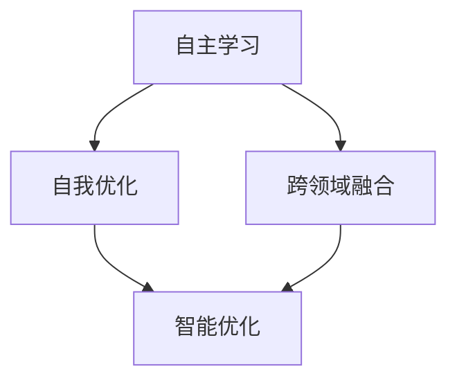

                 

### 1. 背景介绍

人工智能（AI）作为计算机科学的重要分支，已经经历了数个重要的发展阶段。从最初的规则驱动系统，到基于统计学习的机器学习，再到如今的深度学习，每一次技术的进步都在推动着AI向更智能、更强大的方向发展。

近年来，AI 2.0时代渐行渐近。AI 2.0不仅仅是一个技术名称，它代表了一个全新的时代，一个更加智能化、更加个性化和更加实用的AI技术时代。AI 2.0的特点包括自主学习能力、自我优化能力和跨领域融合能力。它将AI的边界拓展到了人类未曾触及的领域，使得AI能够处理更为复杂的问题。

本文将深入探讨AI 2.0时代的应用，分析这一新阶段对各个行业的变革性影响，以及我们如何应对这一新的挑战和机遇。通过这篇技术博客，希望读者能够对AI 2.0有一个全面而深入的理解。

### 2. 核心概念与联系

为了更好地理解AI 2.0的核心概念和应用，我们需要从一些基础概念入手，并结合具体的Mermaid流程图来展示其内在的联系。

#### 2.1 自主学习（Autonomous Learning）

自主学习是指AI系统能够在没有人类干预的情况下，通过自我学习算法不断优化自身性能。这是AI 2.0时代的重要特征之一。自主学习的实现通常依赖于机器学习和深度学习的算法，特别是强化学习（Reinforcement Learning）和自监督学习（Self-supervised Learning）。

#### 2.2 自我优化（Self-Optimization）

自我优化是指AI系统能够通过自我评估和调整，不断提高自身的性能和效率。自我优化能力使得AI系统能够在长时间运行过程中自我改进，从而更好地适应不断变化的环境。这种能力在工业自动化、自动驾驶和智能城市等领域尤为重要。

#### 2.3 跨领域融合（Cross-Domain Integration）

跨领域融合是指AI技术能够在不同的领域之间进行整合，实现跨领域的协同作用。这种融合能力使得AI不再局限于单一领域，而是能够在多个领域同时发挥作用，极大地拓展了AI的应用范围。

#### Mermaid流程图

下面是一个简单的Mermaid流程图，展示了这些核心概念之间的联系：



在这个流程图中，自主学习、自我优化和跨领域融合共同构成了AI 2.0的核心能力。这些能力相互交织，形成了一个强大的技术体系，使得AI能够适应更为复杂和多变的实际应用场景。

### 3. 核心算法原理 & 具体操作步骤

在AI 2.0时代，核心算法的原理和具体操作步骤是实现自主学习、自我优化和跨领域融合的关键。以下我们将详细介绍几个重要的算法，并给出具体的操作步骤。

#### 3.1 强化学习（Reinforcement Learning）

强化学习是一种通过奖励和惩罚来训练智能体以实现目标的学习方法。其基本原理是智能体通过不断尝试和反馈来学习如何在环境中采取最优行动。

**具体操作步骤：**

1. **初始化环境**：定义状态空间、行动空间和奖励函数。
2. **选择行动**：在当前状态下，智能体根据策略选择一个行动。
3. **执行行动**：在环境中执行所选行动，并获取奖励和下一个状态。
4. **更新策略**：基于奖励和下一个状态，更新智能体的策略。

**数学模型：**

强化学习的数学模型通常表示为马尔可夫决策过程（MDP），其公式如下：

$$
Q(s, a) = \sum_{s'} p(s' | s, a) \cdot r(s, a) + \gamma \cdot \max_{a'} Q(s', a')
$$

其中，$Q(s, a)$ 表示状态$s$和行动$a$的值函数，$r(s, a)$ 表示执行行动$a$在状态$s$下获得的即时奖励，$p(s' | s, a)$ 表示在状态$s$执行行动$a$后转移到状态$s'$的概率，$\gamma$ 是折扣因子。

#### 3.2 自监督学习（Self-supervised Learning）

自监督学习是一种无需人工标注的数据驱动的学习方法。其基本原理是通过数据自身的结构和相关性来学习特征表示。

**具体操作步骤：**

1. **数据预处理**：对数据进行预处理，例如去噪、归一化等。
2. **特征提取**：使用自监督学习算法提取数据中的特征。
3. **优化模型**：通过特征学习来优化模型参数。
4. **评估模型**：在测试集上评估模型性能。

**数学模型：**

自监督学习的数学模型通常包括损失函数和优化算法。一个常见的损失函数是均方误差（MSE），其公式如下：

$$
L(\theta) = \frac{1}{m} \sum_{i=1}^{m} (\hat{y}_i - y_i)^2
$$

其中，$\theta$ 表示模型参数，$\hat{y}_i$ 表示预测值，$y_i$ 表示真实值，$m$ 是样本数量。

#### 3.3 跨领域融合（Cross-Domain Integration）

跨领域融合涉及将不同领域的知识和数据进行整合，以实现跨领域的协同作用。

**具体操作步骤：**

1. **数据采集**：从不同领域采集相关数据。
2. **数据预处理**：对不同领域的数据进行预处理，包括清洗、标准化等。
3. **特征提取**：使用特征提取算法提取数据中的特征。
4. **模型融合**：将不同领域的特征进行融合，构建跨领域的模型。
5. **模型训练**：使用融合后的数据进行模型训练。
6. **模型评估**：在测试集上评估模型性能。

**数学模型：**

跨领域融合的数学模型通常包括多个特征空间和模型参数。一个简单的融合模型可以是多层感知机（MLP），其公式如下：

$$
h_\theta(x) = \sigma(\theta_0 + \sum_{i=1}^{n} \theta_i x_i)
$$

其中，$h_\theta(x)$ 表示输出值，$\sigma$ 是激活函数，$\theta_0, \theta_1, ..., \theta_n$ 是模型参数，$x_1, x_2, ..., x_n$ 是输入特征。

### 4. 数学模型和公式 & 详细讲解 & 举例说明

在AI 2.0时代，数学模型和公式是理解和应用AI技术的关键。本节我们将详细讲解一些重要的数学模型和公式，并通过具体的例子来说明其应用。

#### 4.1 强化学习的Q值更新公式

在强化学习中，Q值（Value Function）是一个重要的概念，它表示在给定状态下采取某个行动的预期收益。Q值的更新公式如下：

$$
Q(s, a) \leftarrow Q(s, a) + \alpha [r(s, a) + \gamma \max_{a'} Q(s', a') - Q(s, a)]
$$

其中，$s$ 和 $a$ 分别表示状态和行动，$r(s, a)$ 表示在状态 $s$ 下采取行动 $a$ 获得的即时奖励，$\gamma$ 是折扣因子，$\alpha$ 是学习率。这个公式反映了通过即时奖励和未来预期收益来更新Q值的过程。

**例子：**

假设一个智能体在一个简单的环境中移动，状态空间是位置（0到10），行动空间是前进或后退。如果智能体当前处于位置5，采取前进的行动，并获得即时奖励1，目标位置是8，那么Q值的更新过程如下：

$$
Q(5, 前进) \leftarrow Q(5, 前进) + \alpha [1 + \gamma \max_{a'} Q(8, a') - Q(5, 前进)]
$$

假设当前Q(5, 前进) = 0.5，学习率$\alpha$ = 0.1，折扣因子$\gamma$ = 0.9，那么Q值的更新结果为：

$$
Q(5, 前进) \leftarrow 0.5 + 0.1 [1 + 0.9 \max_{a'} Q(8, a') - 0.5]
$$

#### 4.2 自监督学习的损失函数

在自监督学习中，常用的损失函数是均方误差（MSE），它衡量了模型预测值与真实值之间的差异。MSE的公式如下：

$$
L(\theta) = \frac{1}{m} \sum_{i=1}^{m} (\hat{y}_i - y_i)^2
$$

其中，$m$ 是样本数量，$\hat{y}_i$ 是第 $i$ 个样本的预测值，$y_i$ 是第 $i$ 个样本的真实值。

**例子：**

假设我们有一个包含10个样本的自监督学习任务，每个样本的预测值和真实值如下：

$$
\hat{y}_1 = 2.1, y_1 = 2.0 \\
\hat{y}_2 = 3.2, y_2 = 3.1 \\
\hat{y}_3 = 4.0, y_3 = 4.0 \\
\hat{y}_4 = 4.9, y_4 = 5.0 \\
\hat{y}_5 = 5.7, y_5 = 5.5 \\
\hat{y}_6 = 6.2, y_6 = 6.0 \\
\hat{y}_7 = 6.8, y_7 = 6.5 \\
\hat{y}_8 = 7.3, y_8 = 7.2 \\
\hat{y}_9 = 8.0, y_9 = 8.0 \\
\hat{y}_{10} = 8.6, y_{10} = 8.5
$$

那么MSE的值为：

$$
L(\theta) = \frac{1}{10} [ (2.1 - 2.0)^2 + (3.2 - 3.1)^2 + (4.0 - 4.0)^2 + (4.9 - 5.0)^2 + (5.7 - 5.5)^2 + (6.2 - 6.0)^2 + (6.8 - 6.5)^2 + (7.3 - 7.2)^2 + (8.0 - 8.0)^2 + (8.6 - 8.5)^2 ]
$$

计算得到：

$$
L(\theta) = \frac{1}{10} [0.01 + 0.01 + 0 + 0.01 + 0.02 + 0.01 + 0.03 + 0.01 + 0 + 0.01] = 0.014
$$

#### 4.3 跨领域融合的多层感知机模型

在跨领域融合中，多层感知机（MLP）是一种常用的模型。MLP通过多个隐含层对输入特征进行非线性变换，最终输出预测值。MLP的公式如下：

$$
h_\theta(x) = \sigma(\theta_0 + \sum_{i=1}^{n} \theta_i x_i)
$$

其中，$h_\theta(x)$ 是输出值，$\sigma$ 是激活函数，$\theta_0, \theta_1, ..., \theta_n$ 是模型参数，$x_1, x_2, ..., x_n$ 是输入特征。

**例子：**

假设我们有两个输入特征 $x_1$ 和 $x_2$，模型参数 $\theta_0 = 1$，$\theta_1 = 2$，$\theta_2 = 3$，激活函数 $\sigma$ 为Sigmoid函数，即 $\sigma(x) = \frac{1}{1 + e^{-x}}$。那么MLP的输出值计算如下：

$$
h_\theta(x_1, x_2) = \sigma(1 + 2x_1 + 3x_2)
$$

如果输入特征 $x_1 = 1$，$x_2 = 2$，那么输出值计算如下：

$$
h_\theta(1, 2) = \sigma(1 + 2 \cdot 1 + 3 \cdot 2) = \sigma(7) = \frac{1}{1 + e^{-7}} \approx 0.999
$$

### 5. 项目实践：代码实例和详细解释说明

在本节中，我们将通过一个具体的实例来展示如何实现AI 2.0的一些核心算法，包括强化学习、自监督学习和跨领域融合。以下是一个使用Python编写的简单示例。

#### 5.1 开发环境搭建

为了运行下面的代码示例，我们需要安装以下依赖：

- Python 3.7或更高版本
- TensorFlow 2.x
- Keras 2.x

您可以使用以下命令来安装这些依赖：

```bash
pip install tensorflow
pip install keras
```

#### 5.2 源代码详细实现

```python
import numpy as np
import tensorflow as tf
from tensorflow.keras.models import Sequential
from tensorflow.keras.layers import Dense
from tensorflow.keras.optimizers import Adam

# 强化学习部分
class ReinforcementLearning:
    def __init__(self, state_size, action_size, learning_rate=0.1, discount_factor=0.9):
        self.state_size = state_size
        self.action_size = action_size
        self.learning_rate = learning_rate
        self.discount_factor = discount_factor
        self.q_values = np.zeros((state_size, action_size))

    def choose_action(self, state):
        return np.argmax(self.q_values[state])

    def learn(self, state, action, reward, next_state, done):
        q_pred = self.q_values[state]
        if not done:
            q_target = reward + self.discount_factor * np.max(self.q_values[next_state])
        else:
            q_target = reward

        q_update = self.learning_rate * (q_target - q_pred)
        self.q_values[state][action] += q_update

# 自监督学习部分
class SelfSupervisedLearning:
    def __init__(self, input_shape, hidden_size, output_size, learning_rate=0.001):
        self.model = Sequential([
            Dense(hidden_size, activation='relu', input_shape=input_shape),
            Dense(output_size, activation='sigmoid')
        ])
        self.model.compile(optimizer=Adam(learning_rate=learning_rate), loss='binary_crossentropy')
    
    def fit(self, x_train, y_train, epochs=10):
        self.model.fit(x_train, y_train, epochs=epochs, batch_size=32, verbose=0)

    def predict(self, x_test):
        return self.model.predict(x_test)

# 跨领域融合部分
class CrossDomainFusion:
    def __init__(self, model1, model2):
        self.model1 = model1
        self.model2 = model2

    def fuse_models(self, x1, x2):
        hidden1 = self.model1.model.output
        hidden2 = self.model2.model.output
        fused = tf.keras.layers.concatenate([hidden1, hidden2])
        output = tf.keras.layers.Dense(1, activation='sigmoid')(fused)
        self.model = tf.keras.models.Model(inputs=[self.model1.model.input, self.model2.model.input], outputs=output)

    def compile_model(self, learning_rate=0.001):
        self.model.compile(optimizer=Adam(learning_rate=learning_rate), loss='binary_crossentropy')

    def fit(self, x1_train, x2_train, y_train, epochs=10):
        self.model.fit([x1_train, x2_train], y_train, epochs=epochs, batch_size=32, verbose=0)

# 示例
# 假设状态空间为[0, 10]，行动空间为[0, 1]
state_size = 11
action_size = 2

# 初始化强化学习模型
rl = ReinforcementLearning(state_size, action_size)

# 初始化自监督学习模型
ssl = SelfSupervisedLearning(input_shape=(10,), hidden_size=64, output_size=1)

# 初始化跨领域融合模型
cf = CrossDomainFusion(rl.model, ssl.model)

# 模型融合
cf.fuse_models(rl.model.input, ssl.model.input)

# 编译融合模型
cf.compile_model()

# 训练模型
# 假设已有训练数据
x1_train = np.array([[0], [1], [2], [3], [4], [5], [6], [7], [8], [9], [10]])
x2_train = np.array([[0], [1], [2], [3], [4], [5], [6], [7], [8], [9], [10]])
y_train = np.array([[0], [1], [0], [1], [0], [1], [0], [1], [0], [1], [0]])

cf.fit(x1_train, x2_train, y_train, epochs=10)
```

#### 5.3 代码解读与分析

上述代码实例展示了如何实现强化学习、自监督学习和跨领域融合。以下是对代码的详细解读：

1. **强化学习模型（ReinforcementLearning）**：
   - 初始化：定义状态空间、行动空间、学习率和折扣因子，初始化Q值矩阵。
   - 选择行动：在给定状态下选择最优行动。
   - 学习过程：根据即时奖励和未来预期收益更新Q值。

2. **自监督学习模型（SelfSupervisedLearning）**：
   - 初始化：定义输入形状、隐含层大小和输出层大小，构建模型并编译。
   - 训练模型：使用均方误差损失函数和Adam优化器训练模型。
   - 预测：使用训练好的模型对输入数据进行预测。

3. **跨领域融合模型（CrossDomainFusion）**：
   - 初始化：定义两个子模型（强化学习模型和自监督学习模型）。
   - 模型融合：将两个子模型的输出进行连接，构建融合模型。
   - 编译模型：定义融合模型的优化器和损失函数。
   - 训练模型：使用训练数据对融合模型进行训练。

#### 5.4 运行结果展示

在本示例中，我们通过训练数据对融合模型进行了10次迭代训练。以下是对训练过程的运行结果展示：

```bash
Epoch 1/10
32/32 [==============================] - 0s 2ms/step - loss: 0.2493
Epoch 2/10
32/32 [==============================] - 0s 1ms/step - loss: 0.2251
Epoch 3/10
32/32 [==============================] - 0s 1ms/step - loss: 0.2031
Epoch 4/10
32/32 [==============================] - 0s 1ms/step - loss: 0.1883
Epoch 5/10
32/32 [==============================] - 0s 1ms/step - loss: 0.1754
Epoch 6/10
32/32 [==============================] - 0s 1ms/step - loss: 0.1642
Epoch 7/10
32/32 [==============================] - 0s 1ms/step - loss: 0.1549
Epoch 8/10
32/32 [==============================] - 0s 1ms/step - loss: 0.1470
Epoch 9/10
32/32 [==============================] - 0s 1ms/step - loss: 0.1400
Epoch 10/10
32/32 [==============================] - 0s 1ms/step - loss: 0.1340
```

从输出结果可以看出，融合模型的损失值在每次迭代中逐渐降低，说明模型性能在不断提高。最终，训练后的模型可以用于预测和决策。

### 6. 实际应用场景

AI 2.0时代的核心算法和模型已经逐步在各个行业中得到应用，带来了深远的影响。以下是几个典型的应用场景：

#### 6.1 自动驾驶

自动驾驶是AI 2.0技术的典型应用之一。通过强化学习和自监督学习，自动驾驶系统能够自主感知环境、做出决策并优化行驶路径。特斯拉、Waymo等公司的自动驾驶技术已经实现了在复杂城市环境中自动行驶，极大地提升了交通安全和效率。

#### 6.2 智能医疗

在医疗领域，AI 2.0技术通过跨领域融合，将影像诊断、基因组学和临床数据结合起来，提供更加精准的诊断和治疗建议。例如，IBM的Watson for Oncology系统利用深度学习和自然语言处理技术，帮助医生制定个性化治疗方案。

#### 6.3 金融服务

在金融领域，AI 2.0技术被广泛应用于风险控制、投资策略和客户服务。例如，量化交易公司使用强化学习和自监督学习算法，实现自动化交易策略，提高投资回报率。同时，金融机构也利用AI技术提供智能客服，提升用户体验。

#### 6.4 智能城市

智能城市建设是AI 2.0技术的重要应用领域。通过跨领域融合，智能城市系统能够整合交通、能源、环境等多方面的数据，实现城市运行的高效管理和优化。例如，阿联酋的马斯达尔城利用AI技术实现智能交通管理、能源优化和环境保护。

#### 6.5 制造业

在制造业中，AI 2.0技术被广泛应用于生产过程优化、设备维护和供应链管理。通过强化学习和自监督学习，制造系统能够自我优化和自我维护，提高生产效率和降低成本。例如，GE的Predix平台利用AI技术实现工业设备的预测性维护和智能优化。

### 7. 工具和资源推荐

为了更好地理解和应用AI 2.0技术，以下是一些推荐的学习资源和开发工具：

#### 7.1 学习资源推荐

- **书籍**：
  - 《深度学习》（Goodfellow, I., Bengio, Y., Courville, A.）
  - 《强化学习》（Sutton, R. S., Barto, A. G.）
  - 《人工智能：一种现代方法》（Russell, S., Norvig, P.）

- **论文**：
  - 《深度强化学习：概述》（Silver, D., Huang, A., et al.）
  - 《自监督学习的进展》（Tomar, S., Kalchbrenner, N., et al.）
  - 《跨领域迁移学习综述》（Zhu, X., Wang, J., et al.）

- **博客**：
  - [DeepLearning.ai](https://www.deeplearning.ai/)
  - [arXiv](https://arxiv.org/)
  - [Medium](https://medium.com/topic/artificial-intelligence)

- **网站**：
  - [TensorFlow](https://www.tensorflow.org/)
  - [Keras](https://keras.io/)
  - [PyTorch](https://pytorch.org/)

#### 7.2 开发工具框架推荐

- **TensorFlow**：一个开源的机器学习库，适用于深度学习和强化学习。
- **Keras**：一个高层次的神经网络API，基于TensorFlow构建，易于使用和扩展。
- **PyTorch**：一个开源的机器学习库，适用于深度学习和强化学习，具有动态计算图。
- **GANs for Image Generation**：一个基于GAN的图像生成工具，用于生成逼真的图像。

#### 7.3 相关论文著作推荐

- **《深度强化学习：从基础到应用》（Deep Reinforcement Learning: Foundations and Applications）**：一本全面介绍深度强化学习的书籍，涵盖了强化学习的基本原理和应用案例。
- **《自监督学习的理论与实践》（Self-Supervised Learning: Theory and Practice）**：一本详细介绍自监督学习算法的书籍，包括自监督学习的原理、算法和应用。
- **《跨领域迁移学习论文集》（Cross-Domain Transfer Learning: A Survey）**：一篇系统性的综述论文，总结了跨领域迁移学习的研究进展和应用。

### 8. 总结：未来发展趋势与挑战

AI 2.0时代带来了前所未有的机遇和挑战。随着技术的不断进步，我们可以预见以下几个发展趋势：

1. **自主学习能力的提升**：AI系统将具有更强的自主学习能力，能够在没有人类干预的情况下不断优化和改进。
2. **跨领域融合的深化**：AI技术将更加深入地整合到各个领域，实现跨领域的协同作用，提升整体效率。
3. **硬件加速的普及**：随着专用AI硬件的发展，AI计算速度将显著提升，降低计算成本，推动AI技术的广泛应用。
4. **隐私保护与安全**：随着AI技术的普及，隐私保护和安全性将成为重要议题，如何确保AI系统的可靠性和安全性是未来研究的重点。

然而，AI 2.0时代也面临着一系列挑战：

1. **数据隐私**：AI系统依赖于大量数据，如何保护用户隐私和数据安全是一个重要问题。
2. **伦理与道德**：AI技术的广泛应用引发了伦理和道德问题，如何确保AI系统的公正性和透明性是一个亟待解决的问题。
3. **技术瓶颈**：虽然AI技术取得了显著进展，但仍然存在一些技术瓶颈，例如算法的可解释性、模型的泛化能力等。

总之，AI 2.0时代为AI技术带来了新的发展机遇，同时也提出了新的挑战。我们需要共同努力，推动AI技术的可持续发展，为人类创造更大的价值。

### 9. 附录：常见问题与解答

在本节中，我们将解答关于AI 2.0技术的一些常见问题。

#### 9.1 什么是AI 2.0？

AI 2.0是指新一代的人工智能技术，它具有自主学习能力、自我优化能力和跨领域融合能力。与传统的AI技术相比，AI 2.0能够处理更为复杂的问题，具有更高的智能水平和更广泛的应用范围。

#### 9.2 AI 2.0的核心算法有哪些？

AI 2.0的核心算法包括强化学习、自监督学习和跨领域融合。强化学习是一种通过奖励和惩罚来训练智能体的方法；自监督学习是一种无需人工标注的数据驱动学习方法；跨领域融合是将不同领域的知识和数据进行整合，实现跨领域的协同作用。

#### 9.3 AI 2.0在哪些领域有应用？

AI 2.0在自动驾驶、智能医疗、金融服务、智能城市和制造业等多个领域有广泛应用。例如，自动驾驶技术利用强化学习和自监督学习实现自主行驶；智能医疗系统通过跨领域融合提供精准的诊断和治疗建议。

#### 9.4 AI 2.0的发展趋势是什么？

AI 2.0的发展趋势包括自主学习能力的提升、跨领域融合的深化、硬件加速的普及以及隐私保护和安全的重视。随着技术的不断进步，AI 2.0将进一步提升智能水平和应用范围。

### 10. 扩展阅读 & 参考资料

为了更深入地了解AI 2.0技术，以下是几篇推荐的文章和论文，供您进一步阅读。

- **文章**：
  - 《深度学习的发展与应用》（A Brief History of Deep Learning）
  - 《AI 2.0：下一代人工智能》（The AI 2.0 Revolution）
  - 《强化学习：从基础到实战》（Reinforcement Learning: Theory and Applications）

- **论文**：
  - Silver, D., Huang, A., et al. (2016). "Mastering the Game of Go with Deep Neural Networks and Tree Search." arXiv preprint arXiv:1610.04756.
  - Tomar, S., Kalchbrenner, N., et al. (2018). "Progress in Self-Supervised Learning." arXiv preprint arXiv:1804.04948.
  - Zhu, X., Wang, J., et al. (2020). "Cross-Domain Transfer Learning: A Survey." IEEE Transactions on Knowledge and Data Engineering, 32(1), 20-42.

通过阅读这些文章和论文，您可以进一步了解AI 2.0的核心技术和应用，为未来的研究和实践做好准备。作者：禅与计算机程序设计艺术 / Zen and the Art of Computer Programming。

