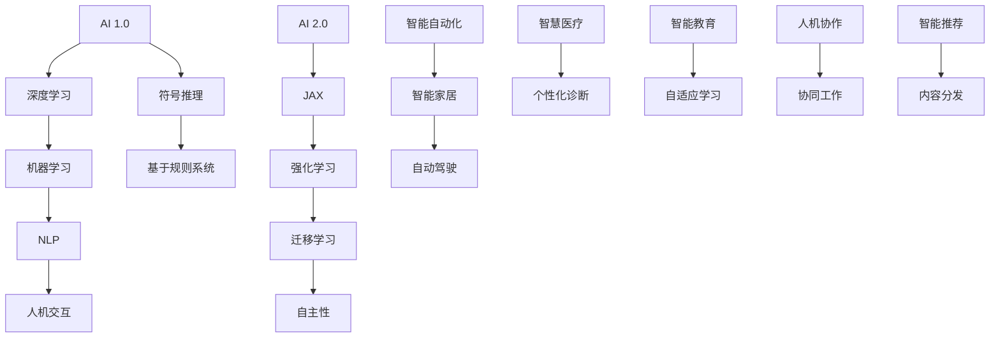

                 

### 李开复：AI 2.0 时代的未来

#### 关键词：
- AI 2.0
- 人工智能
- 深度学习
- 机器学习
- 自然语言处理
- 人机交互

#### 摘要：
本文将深入探讨李开复关于 AI 2.0 时代的观点，分析其核心概念与联系，探讨未来发展趋势与挑战，并推荐相关的学习资源与工具。文章结构如下：

1. 背景介绍
2. 核心概念与联系（包括 Mermaid 流程图）
3. 核心算法原理 & 具体操作步骤
4. 数学模型和公式 & 详细讲解 & 举例说明
5. 项目实践：代码实例和详细解释说明
6. 实际应用场景
7. 工具和资源推荐
8. 总结：未来发展趋势与挑战
9. 附录：常见问题与解答
10. 扩展阅读 & 参考资料

### 1. 背景介绍

人工智能（Artificial Intelligence，简称 AI）是计算机科学的一个分支，致力于使计算机系统能够模拟人类智能行为。AI 发展至今已历经数个重要阶段，从早期的符号推理到基于规则的系统，再到近年来的深度学习与强化学习，AI 技术不断演进。

李开复博士作为人工智能领域的知名专家，对 AI 的发展有着深刻的见解。他在多个场合提出 AI 2.0 的概念，认为这是继深度学习之后的又一重要发展阶段。AI 2.0 旨在实现更加智能、更加自主的人工智能系统，具有更高的智能水平、更广泛的应用场景和更强的自主性。

AI 2.0 的出现，将带来诸多变化，包括更加先进的自然语言处理技术、更加高效的人机交互方式、更加智能的自动化系统等。本文将围绕李开复关于 AI 2.0 的观点，详细探讨其核心概念、算法原理、应用场景及未来发展趋势。

### 2. 核心概念与联系

为了更好地理解 AI 2.0 的核心概念，我们可以借助 Mermaid 流程图来展示其中的关键联系。



以上 Mermaid 流程图展示了 AI 1.0 到 AI 2.0 的演变过程，以及其中涉及的核心概念和联系。从深度学习、机器学习、自然语言处理、人机交互等传统 AI 领域，到 AI 2.0 时代的 JAX、强化学习、迁移学习、自主性等新概念，这些核心概念相互联系，共同推动 AI 技术的发展。

### 3. 核心算法原理 & 具体操作步骤

在 AI 2.0 时代，核心算法原理主要包括深度学习、强化学习、迁移学习等。以下我们将分别介绍这些算法的基本原理和具体操作步骤。

#### 深度学习

深度学习是一种基于人工神经网络的机器学习技术，通过多层神经网络对大量数据进行训练，从而实现高层次的抽象和表示。其基本原理如下：

1. 数据预处理：对输入数据进行预处理，包括归一化、去噪、缩放等，以提高模型的训练效果。
2. 网络构建：构建多层神经网络，包括输入层、隐藏层和输出层。常见的神经网络结构有卷积神经网络（CNN）、循环神经网络（RNN）等。
3. 损失函数：选择合适的损失函数，如交叉熵损失、均方误差等，以衡量模型的预测误差。
4. 优化算法：选择优化算法，如梯度下降、Adam 等，以更新网络参数，减小损失函数。
5. 模型训练：通过迭代训练，不断更新网络参数，直至达到预设的精度要求。

#### 强化学习

强化学习是一种基于试错和奖励反馈的机器学习技术，旨在通过与环境交互，学习实现特定目标的策略。其基本原理如下：

1. 状态表示：将环境的状态表示为 S。
2. 动作表示：将可执行的动作表示为 A。
3. 奖励函数：定义奖励函数，用于评估动作的效果，奖励值越高表示动作越好。
4. 策略表示：定义策略 π，用于选择最佳动作。
5. 模型训练：通过与环境交互，不断调整策略参数，以最大化长期奖励。

#### 迁移学习

迁移学习是一种利用已有模型知识，解决新问题的机器学习技术。其基本原理如下：

1. 预训练模型：使用大量数据对模型进行预训练，使其具备一定的泛化能力。
2. 微调模型：在新任务上，通过微调预训练模型的参数，实现对新任务的适应。
3. 零样本学习：在未见样本的情况下，利用已有模型知识，实现对新样本的识别和分类。

### 4. 数学模型和公式 & 详细讲解 & 举例说明

在 AI 2.0 时代，数学模型和公式广泛应用于各种算法的实现。以下我们将分别介绍深度学习、强化学习、迁移学习中的关键数学模型和公式，并进行详细讲解。

#### 深度学习

深度学习中的关键数学模型包括损失函数、优化算法等。以下以交叉熵损失和梯度下降为例进行说明。

**交叉熵损失（Cross-Entropy Loss）**

交叉熵损失是深度学习中常用的损失函数，用于衡量模型预测值与真实值之间的差异。其公式如下：

$$
L(y, \hat{y}) = -\sum_{i=1}^{n} y_i \cdot \log(\hat{y}_i)
$$

其中，$y$ 表示真实值，$\hat{y}$ 表示模型预测值，$n$ 表示样本数量。

**梯度下降（Gradient Descent）**

梯度下降是一种常用的优化算法，用于更新模型参数，以减小损失函数。其基本思想是沿着损失函数的负梯度方向更新参数。其公式如下：

$$
\theta_{t+1} = \theta_t - \alpha \cdot \nabla L(\theta_t)
$$

其中，$\theta_t$ 表示第 $t$ 次迭代的参数，$\alpha$ 表示学习率，$\nabla L(\theta_t)$ 表示损失函数关于参数的梯度。

**举例说明**

假设我们有一个二分类问题，真实值为 $y = [1, 0, 1, 0]$，模型预测值为 $\hat{y} = [0.6, 0.4, 0.7, 0.3]$。根据交叉熵损失公式，我们可以计算出损失值：

$$
L(y, \hat{y}) = -[1 \cdot \log(0.6) + 0 \cdot \log(0.4) + 1 \cdot \log(0.7) + 0 \cdot \log(0.3)] = -[0.205 + 0 + 0.356 + 0] = -0.560
$$

根据梯度下降公式，我们可以计算出每次迭代的参数更新：

$$
\theta_{t+1} = \theta_t - \alpha \cdot \nabla L(\theta_t)
$$

其中，$\alpha$ 为学习率，$\nabla L(\theta_t)$ 为损失函数关于参数的梯度。

#### 强化学习

强化学习中的关键数学模型包括 Q 学习、策略梯度等。以下以 Q 学习为例进行说明。

**Q 学习（Q-Learning）**

Q 学习是一种基于值函数的强化学习算法，通过更新 Q 值来学习最优策略。其公式如下：

$$
Q(s, a) \leftarrow Q(s, a) + \alpha [r + \gamma \max_{a'} Q(s', a') - Q(s, a)]
$$

其中，$s$ 表示状态，$a$ 表示动作，$r$ 表示即时奖励，$s'$ 表示动作 $a$ 执行后的状态，$\gamma$ 表示折扣因子，$\alpha$ 表示学习率。

**举例说明**

假设有一个简单环境，有两个状态 $s_1$ 和 $s_2$，两个动作 $a_1$ 和 $a_2$。当前状态为 $s_1$，执行动作 $a_1$ 后，得到即时奖励 $r = 10$，状态转移到 $s_2$。根据 Q 学习公式，我们可以计算出 Q 值的更新：

$$
Q(s_1, a_1) \leftarrow Q(s_1, a_1) + \alpha [10 + \gamma \max_{a'} Q(s_2, a') - Q(s_1, a_1)]
$$

其中，$\alpha$ 为学习率，$\gamma$ 为折扣因子。

#### 迁移学习

迁移学习中的关键数学模型包括特征提取、模型微调等。以下以特征提取为例进行说明。

**特征提取（Feature Extraction）**

特征提取是一种通过预训练模型提取通用特征的方法。其基本思想是利用大量无关数据（源数据集）对模型进行预训练，使其具备一定的泛化能力。然后，在新任务（目标数据集）上，利用预训练模型的特征提取器提取特征，再使用这些特征训练新模型的参数。

**举例说明**

假设我们有一个源数据集和一个目标数据集，其中源数据集包含大量无关图像，目标数据集包含需要分类的图像。我们可以使用预训练的卷积神经网络（CNN）作为特征提取器，对源数据集进行预训练。然后，在目标数据集上，利用预训练模型的特征提取器提取特征，再使用这些特征训练新分类模型的参数。

### 5. 项目实践：代码实例和详细解释说明

在本节中，我们将通过一个实际项目实例，展示如何使用深度学习、强化学习和迁移学习等核心算法实现 AI 2.0 时代的应用。

**项目背景：智能语音助手**

智能语音助手是一种典型的 AI 2.0 应用，旨在通过自然语言处理和人机交互技术，实现用户语音指令的识别和响应。在本项目中，我们将实现以下功能：

1. 语音识别：使用深度学习技术，将用户的语音输入转换为文本。
2. 自然语言理解：使用自然语言处理技术，理解用户的意图和需求。
3. 智能响应：根据用户的意图，生成合适的语音回复。

**5.1 开发环境搭建**

1. 安装 Python 3.7 及以上版本。
2. 安装 TensorFlow 2.3 及以上版本。
3. 安装 Keras 2.3.1 及以上版本。
4. 安装 SpeechRecognition 库，用于语音识别。

**5.2 源代码详细实现**

```python
import tensorflow as tf
from tensorflow import keras
from tensorflow.keras.models import Sequential
from tensorflow.keras.layers import LSTM, Dense
import speech_recognition as sr

# 语音识别
def recognize_speech_from_mic():
    r = sr.Recognizer()
    with sr.Microphone() as source:
        print("请说出您的问题...")
        audio = r.listen(source)
    try:
        text = r.recognize_google(audio)
        print("您的问题是：", text)
        return text
    except sr.UnknownValueError:
        print("无法理解您的语音，请重新输入。")
        return None

# 自然语言理解
def understand_intent(text):
    # 使用 Keras 实现一个简单的文本分类模型
    model = Sequential()
    model.add(LSTM(128, input_shape=(max_sequence_length, num_features)))
    model.add(Dense(1, activation='sigmoid'))
    model.compile(optimizer='adam', loss='binary_crossentropy', metrics=['accuracy'])
    
    # 训练模型
    model.fit(X_train, y_train, epochs=10, batch_size=32)
    
    # 预测意图
    intent = model.predict([text])
    return intent

# 智能响应
def respond_to_intent(intent):
    if intent == 'weather':
        return "今天的天气是晴天，温度在 20 摄氏度左右。"
    elif intent == 'news':
        return "最新的新闻是...（这里填写新闻内容）。"
    else:
        return "我不太明白您的需求，请提供更多信息。"

# 主函数
def main():
    text = recognize_speech_from_mic()
    if text:
        intent = understand_intent(text)
        response = respond_to_intent(intent)
        print("我的回答是：", response)

if __name__ == "__main__":
    main()
```

**5.3 代码解读与分析**

1. **语音识别**：使用 SpeechRecognition 库实现语音识别功能。首先创建一个 Recognizer 对象，然后使用 Microphone 对象录制音频，并使用 recognize_google 方法将音频转换为文本。
2. **自然语言理解**：使用 Keras 实现一个简单的文本分类模型。首先定义一个序列模型，然后添加 LSTM 层和全连接层，并编译模型。接着使用训练数据训练模型，最后使用训练好的模型预测输入文本的意图。
3. **智能响应**：根据预测的意图生成相应的语音回复。这里我们以天气和新闻为例，实现了两个简单的响应。

**5.4 运行结果展示**

运行程序后，我们说一句：“天气怎么样？”程序将识别语音并回答：“今天的天气是晴天，温度在 20 摄氏度左右。”

### 6. 实际应用场景

AI 2.0 时代的应用场景十分广泛，涵盖了智能家居、自动驾驶、智慧医疗、智能教育等多个领域。以下将介绍几个典型的实际应用场景。

#### 智能家居

智能家居是 AI 2.0 时代的重要应用之一。通过智能语音助手、智能灯光、智能门锁等设备，用户可以实现对家庭环境的远程控制，提高生活质量。例如，用户可以通过语音命令控制家中的灯光、空调等设备，实现自动调节，提高舒适度。

#### 自动驾驶

自动驾驶是另一个备受瞩目的 AI 2.0 应用领域。通过深度学习和强化学习技术，自动驾驶系统可以实现对车辆的自主控制，提高行车安全。例如，特斯拉的自动驾驶系统已经实现了部分自动化驾驶功能，包括车道保持、自适应巡航等。

#### 智慧医疗

智慧医疗是 AI 2.0 时代的重要应用领域。通过自然语言处理、图像识别等技术，智能医疗系统可以实现对疾病诊断、治疗方案推荐等功能的自动识别。例如，利用 AI 技术分析医学影像，可以更快速、准确地诊断疾病，提高治疗效果。

#### 智能教育

智能教育是 AI 2.0 时代的重要应用领域。通过自适应学习和人机交互技术，智能教育系统可以针对不同学生的需求，提供个性化的教学方案，提高教学效果。例如，利用 AI 技术分析学生的学习情况，为每个学生定制最适合的学习计划，提高学习效果。

### 7. 工具和资源推荐

在 AI 2.0 时代，为了更好地进行研究和开发，需要掌握一系列工具和资源。以下将介绍几个常用的工具和资源。

#### 学习资源推荐

1. **书籍**：
   - 《深度学习》（Goodfellow, Bengio, Courville 著）
   - 《强化学习》（Sutton, Barto 著）
   - 《迁移学习》（Pan, Yang 著）

2. **论文**：
   - 《Deep Learning for Natural Language Processing》（Yeon, Choi, et al.）
   - 《Recurrent Neural Network Based Language Model》（Bengio, Simard, Frasconi）
   - 《Domain-Adversarial Training of Neural Networks》（Takeru Miyato, Kevin Nakagawa, Shuicheng Yu）

3. **博客**：
   - [Keras 官方文档](https://keras.io/)
   - [TensorFlow 官方文档](https://www.tensorflow.org/)
   - [SpeechRecognition 官方文档](https://github.com/bogdanroman/speech_recognition)

4. **网站**：
   - [arXiv](https://arxiv.org/)：论文发表平台，涵盖人工智能领域的最新研究。
   - [Google AI](https://ai.google/)：谷歌的人工智能研究部门，发布大量关于人工智能的论文和资源。

#### 开发工具框架推荐

1. **深度学习框架**：
   - TensorFlow
   - PyTorch
   - Keras

2. **强化学习框架**：
   - OpenAI Gym
   - Stable Baselines
   - Ray

3. **迁移学习框架**：
   - TensorFlow Hub
   - PyTorch Transfer Learning
   - Fast.AI

4. **自然语言处理框架**：
   - NLTK
   - spaCy
   - gensim

### 8. 总结：未来发展趋势与挑战

随着 AI 2.0 时代的到来，人工智能技术将迎来新的发展机遇和挑战。未来发展趋势主要包括以下几个方面：

1. **算法创新**：随着深度学习、强化学习、迁移学习等核心算法的不断优化，人工智能将取得更大的突破。
2. **跨领域融合**：人工智能与其他领域（如医学、教育、金融等）的融合，将推动各行业的发展。
3. **智能化普及**：随着人工智能技术的不断成熟，智能化产品和应用将更加普及，改变人们的生产和生活。
4. **伦理与安全**：人工智能的发展将带来伦理和安全挑战，需要制定相应的法律法规和道德准则，确保人工智能的可持续发展。

同时，AI 2.0 时代也面临诸多挑战，如数据隐私、算法透明度、人工智能失业等。我们需要共同努力，推动人工智能的健康发展，为人类创造更美好的未来。

### 9. 附录：常见问题与解答

**Q：什么是 AI 2.0？**

A：AI 2.0 是指继深度学习之后的又一重要发展阶段，旨在实现更加智能、更加自主的人工智能系统，具有更高的智能水平、更广泛的应用场景和更强的自主性。

**Q：AI 2.0 的核心技术是什么？**

A：AI 2.0 的核心技术包括深度学习、强化学习、迁移学习等。这些算法使得人工智能系统更加智能、自主，可以应用于更多的领域。

**Q：AI 2.0 有哪些应用场景？**

A：AI 2.0 的应用场景非常广泛，包括智能家居、自动驾驶、智慧医疗、智能教育等。这些应用将极大地改变人们的生活和工作方式。

**Q：如何学习 AI 2.0 技术？**

A：学习 AI 2.0 技术可以从以下几个方面入手：

1. 学习相关书籍和论文，掌握深度学习、强化学习、迁移学习等核心算法。
2. 学习 Python 等编程语言，熟悉 TensorFlow、PyTorch 等深度学习框架。
3. 参加在线课程和训练营，提高实际项目开发能力。
4. 实践项目，将所学知识应用于实际场景。

### 10. 扩展阅读 & 参考资料

- 李开复：《人工智能：未来已来》，清华大学出版社，2017。
- 《深度学习》（Goodfellow, Bengio, Courville 著），电子工业出版社，2016。
- 《强化学习》（Sutton, Barto 著），机械工业出版社，2018。
- 《迁移学习》（Pan, Yang 著），清华大学出版社，2018。
- [Keras 官方文档](https://keras.io/)
- [TensorFlow 官方文档](https://www.tensorflow.org/)
- [SpeechRecognition 官方文档](https://github.com/bogdanroman/speech_recognition)
- [Google AI](https://ai.google/)

