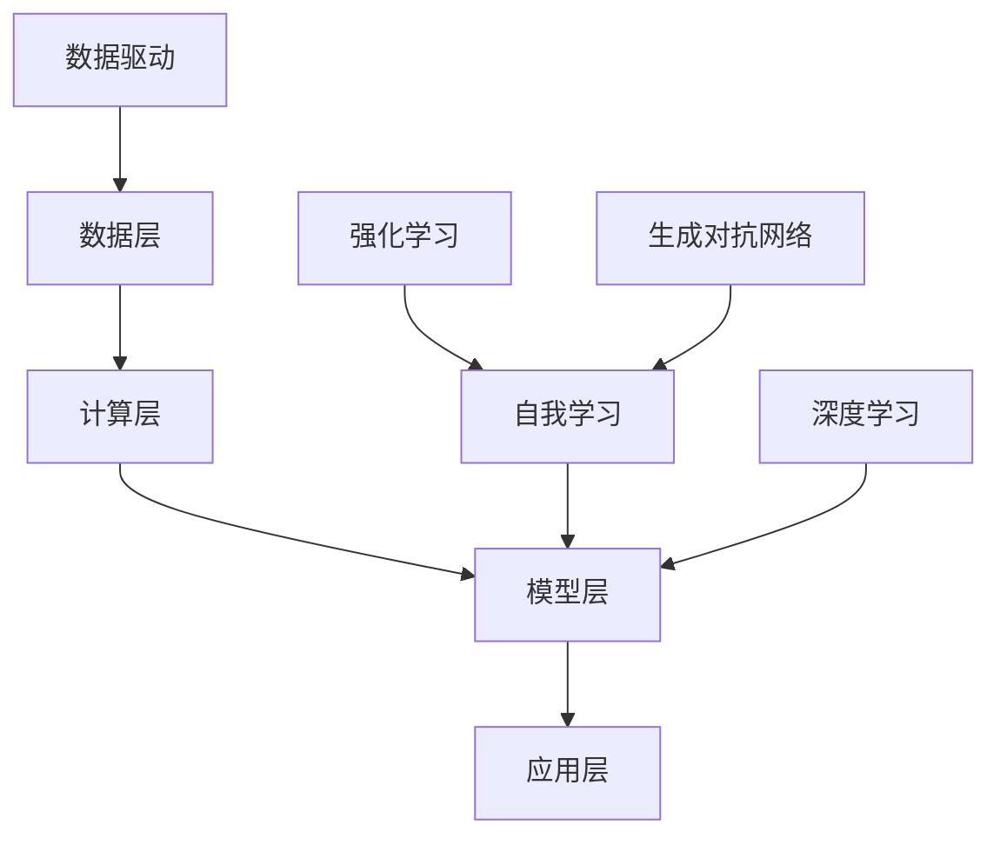

                 

### 背景介绍

人工智能（AI）的历史可以追溯到20世纪50年代，当时，科学家们首次提出了“机器能够思考”的概念。自那时以来，AI经历了多次技术革新和理论突破，从初期的符号主义（Symbolism）到连接主义（Connectionism）、再到现代的深度学习（Deep Learning）和强化学习（Reinforcement Learning）。每一代技术都带来了巨大的进步，使机器在处理复杂任务方面变得更加高效和智能。

然而，随着AI技术的不断进步，我们逐渐进入了一个新的时代——AI 2.0时代。这个时代以数据驱动的深度学习和模型驱动的自动化为核心特征。AI 2.0不再仅仅依赖于预设的规则和算法，而是通过海量的数据和自我学习的能力，实现前所未有的智能表现。这种变革不仅改变了计算机科学的基本范式，也对各行各业产生了深远的影响。

在AI 2.0时代，计算机不再是简单的执行命令的工具，而是具有自我认知、自主决策和持续学习能力的智能体。它们能够处理大量复杂的任务，从自动驾驶汽车、智能语音助手，到医疗诊断、金融分析，无所不能。这种变革正在改变我们的生活、工作方式，甚至我们的思维方式。

本文将深入探讨AI 2.0时代的核心概念、技术原理、应用场景以及未来发展趋势。通过一步步的分析和推理，我们希望能够为读者提供一个清晰、全面的理解框架，帮助大家把握这个时代的脉搏，为未来的科技创新做好准备。

### 核心概念与联系

#### 1. 数据驱动的深度学习

数据驱动的深度学习是AI 2.0时代的核心特征之一。与传统的机器学习方法不同，深度学习依赖于大量的数据，通过多层神经网络（Neural Networks）来模拟人脑的决策过程。这个过程可以形象地比喻为“学习如何走路”。

首先，深度学习的基本单元是神经元（Neuron），它们通过输入层（Input Layer）接收数据，经过隐藏层（Hidden Layers）的处理，最后输出层（Output Layer）生成预测结果。每一层中的神经元都会通过权重（Weights）和偏置（Bias）对输入数据进行加权和激活（Activation）处理。

这种多层神经网络的结构使得深度学习模型能够捕捉到输入数据中的复杂模式和特征。例如，在图像识别任务中，第一层可能识别边缘和纹理，而更深的层则能够识别物体的形状和整体结构。通过大量的数据和反复的训练，深度学习模型能够不断优化其参数，从而提高预测的准确性。

#### 2. 自我学习与自主学习

在AI 2.0时代，自我学习和自主学习是另一个重要特征。自我学习意味着系统能够根据新的数据和经验自动调整自己的行为和模型参数，而不需要人工干预。自主学习则更进一步，系统不仅能够自我调整，还能够探索新的解决方案，并从错误中学习。

自我学习和自主学习的实现通常依赖于强化学习（Reinforcement Learning）和生成对抗网络（Generative Adversarial Networks, GAN）。在强化学习中，系统通过试错（Trial and Error）来学习最优策略。例如，自动驾驶汽车可以通过在虚拟环境中模拟驾驶，不断调整其控制策略，以提高行驶的安全性和效率。

生成对抗网络则通过两个对抗网络（Generator和Discriminator）的竞争来生成逼真的数据。Generator生成数据，Discriminator则判断这些数据是真实数据还是生成数据。通过不断的训练和对抗，Generator能够生成越来越真实的数据。

#### 3. AI 2.0时代的架构

AI 2.0时代的架构可以看作是一个层次化的系统，从基础设施到应用层，每一个层次都承载着不同的功能。

1. **数据层**：这是整个系统的基石，包括数据的采集、存储、处理和管理。数据的质量和数量直接决定了AI模型的效果。

2. **计算层**：这个层次包含了计算资源和算法库，如GPU、TPU等硬件加速器，以及深度学习框架（如TensorFlow、PyTorch）等软件工具。

3. **模型层**：这个层次是核心，包含了各种AI模型，如卷积神经网络（CNN）、循环神经网络（RNN）、生成对抗网络（GAN）等。

4. **应用层**：这是直接面向用户的层面，包括各种AI应用，如自动驾驶、智能家居、医疗诊断等。

#### Mermaid 流程图

下面是一个简化的Mermaid流程图，展示了AI 2.0时代的核心概念和架构：



通过这个流程图，我们可以清晰地看到数据驱动的深度学习和自我学习如何贯穿整个AI 2.0时代的架构，以及各个层次之间的联系和交互。

### 核心算法原理 & 具体操作步骤

在AI 2.0时代，核心算法的原理和具体操作步骤决定了系统的性能和效率。以下将详细介绍深度学习算法的基本原理和操作步骤，以及如何通过数学模型和公式来优化这些算法。

#### 深度学习算法的基本原理

深度学习算法的核心是多层神经网络（Neural Networks），其基本原理可以概括为以下几个步骤：

1. **数据预处理**：在训练深度学习模型之前，需要对输入数据进行预处理，包括归一化、标准化、数据增强等操作，以确保数据的质量和一致性。

2. **输入层**：输入层接收外部数据，并将其传递到下一层。每一层中的神经元会根据其权重（Weights）和偏置（Bias）对输入数据进行加权处理。

3. **隐藏层**：数据通过输入层传递到隐藏层，每一层的神经元都会对输入数据进行加权和激活处理。隐藏层可以有一个或多个，层数越多，模型能够捕捉到的特征层次越丰富。

4. **输出层**：隐藏层的输出传递到输出层，生成最终的结果。输出层可以是分类层或回归层，具体取决于任务的类型。

5. **反向传播**：在输出层生成预测结果后，计算预测结果与实际结果之间的误差。通过反向传播算法，将误差反向传播到每一层，并更新各层的权重和偏置，以最小化误差。

#### 具体操作步骤

以下是一个简化的深度学习模型的训练过程：

1. **初始化参数**：初始化模型的权重和偏置，通常采用随机初始化方法，如高斯分布。

2. **前向传播**：将输入数据传递到输入层，经过隐藏层和输出层，生成预测结果。

3. **计算误差**：计算输出层预测结果与实际结果之间的误差，通常使用均方误差（Mean Squared Error, MSE）或交叉熵（Cross-Entropy）作为损失函数。

4. **反向传播**：将误差反向传播到每一层，通过梯度下降（Gradient Descent）或其他优化算法，更新权重和偏置。

5. **迭代优化**：重复前向传播和反向传播的过程，不断迭代优化模型参数，直到满足停止条件（如损失函数达到最小值或迭代次数达到预设值）。

#### 数学模型和公式

深度学习模型的优化过程依赖于以下数学模型和公式：

1. **损失函数**：损失函数用于衡量预测结果与实际结果之间的误差，常用的有MSE和交叉熵。

   - **MSE**：$$ \text{MSE} = \frac{1}{m}\sum_{i=1}^{m}(\hat{y}_i - y_i)^2 $$
     其中，\( \hat{y}_i \) 是预测结果，\( y_i \) 是实际结果，\( m \) 是样本数量。

   - **交叉熵**：$$ \text{Cross-Entropy} = -\frac{1}{m}\sum_{i=1}^{m} y_i \log \hat{y}_i $$
     其中，\( y_i \) 是实际结果的概率分布，\( \hat{y}_i \) 是预测结果的概率分布。

2. **梯度下降**：梯度下降是一种优化算法，用于更新模型参数以最小化损失函数。

   - **梯度**：$$ \nabla_\theta \text{Loss} = \frac{\partial \text{Loss}}{\partial \theta} $$
     其中，\( \theta \) 是模型参数。

   - **梯度下降更新**：$$ \theta = \theta - \alpha \nabla_\theta \text{Loss} $$
     其中，\( \alpha \) 是学习率。

3. **反向传播**：反向传播算法用于计算梯度，并通过梯度下降更新模型参数。

   - **前向传播**：计算每一层的输出值。
   - **反向传播**：计算每一层的梯度，并反向更新参数。

#### 举例说明

假设我们有一个简单的二分类问题，输入数据为\( x \)，输出数据为\( y \)。我们使用一个单层神经网络进行预测。

1. **初始化参数**：随机初始化权重\( \theta \) 和偏置\( b \)。

2. **前向传播**：输入数据\( x \)经过神经网络，生成预测结果\( \hat{y} \)。

   - \( z = \theta x + b \)
   - \( \hat{y} = \sigma(z) \)
     其中，\( \sigma \) 是激活函数，通常采用Sigmoid函数。

3. **计算误差**：计算预测结果与实际结果之间的误差。

   - \( \text{Error} = y - \hat{y} \)

4. **反向传播**：计算梯度并更新参数。

   - \( \nabla_\theta \text{Error} = x(y - \hat{y}) \)
   - \( \nabla_b \text{Error} = y - \hat{y} \)
   - \( \theta = \theta - \alpha \nabla_\theta \text{Error} \)
   - \( b = b - \alpha \nabla_b \text{Error} \)

通过这个简单的例子，我们可以看到深度学习算法的基本原理和操作步骤。在实际应用中，模型的结构和参数会根据具体问题进行调整，以达到更好的效果。

### 数学模型和公式 & 详细讲解 & 举例说明

在深度学习算法中，数学模型和公式起着至关重要的作用。这些模型和公式不仅帮助我们理解和实现算法，还提供了评估和优化算法的工具。以下将详细讲解深度学习中的几个核心数学模型和公式，并通过具体例子进行说明。

#### 损失函数

损失函数用于衡量预测结果与实际结果之间的差异。在深度学习中，损失函数的选择和优化直接影响到模型的性能。以下介绍两种常见的损失函数：

1. **均方误差（MSE）**

   均方误差是回归问题中最常用的损失函数，用于衡量预测值与实际值之间的均方差异。

   $$ \text{MSE} = \frac{1}{m}\sum_{i=1}^{m}(\hat{y}_i - y_i)^2 $$

   其中，\( \hat{y}_i \) 是第 \( i \) 个样本的预测值，\( y_i \) 是第 \( i \) 个样本的实际值，\( m \) 是样本总数。

   **例子**：假设我们有一个包含100个样本的数据集，预测值和实际值如下：

   \( \hat{y} = [2.1, 2.3, 2.5, \ldots, 2.9] \)
   \( y = [2.0, 2.2, 2.4, \ldots, 2.8] \)

   计算MSE：

   $$ \text{MSE} = \frac{1}{100}\sum_{i=1}^{100}(\hat{y}_i - y_i)^2 $$
   $$ = \frac{1}{100}\sum_{i=1}^{100}([2.1 - 2.0]^2 + [2.3 - 2.2]^2 + \ldots + [2.9 - 2.8]^2) $$
   $$ = \frac{1}{100}(0.01 + 0.01 + \ldots + 0.01) $$
   $$ = 0.01 $$

   MSE为0.01，表示预测值与实际值之间的平均差异为0.01。

2. **交叉熵（Cross-Entropy）**

   交叉熵是分类问题中最常用的损失函数，用于衡量预测概率分布与实际概率分布之间的差异。

   $$ \text{Cross-Entropy} = -\frac{1}{m}\sum_{i=1}^{m} y_i \log \hat{y}_i $$

   其中，\( y_i \) 是第 \( i \) 个样本的实际标签，\( \hat{y}_i \) 是第 \( i \) 个样本的预测概率分布。

   **例子**：假设我们有一个二分类问题，实际标签和预测概率分布如下：

   \( y = [1, 0, 1, \ldots, 1] \)
   \( \hat{y} = [\hat{y}_1, \hat{y}_2, \hat{y}_3, \ldots, \hat{y}_n] \)

   其中，\( \hat{y}_i \) 是第 \( i \) 个样本属于正类的概率。

   计算交叉熵：

   $$ \text{Cross-Entropy} = -\frac{1}{m}\sum_{i=1}^{m} y_i \log \hat{y}_i $$
   $$ = -\frac{1}{m}(\log \hat{y}_1 + \log \hat{y}_2 + \ldots + \log \hat{y}_n) $$

   假设 \( \hat{y}_1 = 0.9 \)，\( \hat{y}_2 = 0.1 \)，实际标签 \( y = [1, 0] \)：

   $$ \text{Cross-Entropy} = -\frac{1}{2}(\log 0.9 + \log 0.1) $$
   $$ = -\frac{1}{2}(-0.105 + -0.415) $$
   $$ = 0.23 $$

   交叉熵为0.23，表示预测概率分布与实际概率分布之间的差异。

#### 梯度下降（Gradient Descent）

梯度下降是一种优化算法，用于最小化损失函数。它通过计算损失函数关于模型参数的梯度，并沿着梯度的反方向更新参数，从而逐步减少损失。

1. **梯度计算**

   梯度是指损失函数关于模型参数的导数，用于描述参数变化对损失函数的影响。

   $$ \nabla_\theta \text{Loss} = \frac{\partial \text{Loss}}{\partial \theta} $$

   其中，\( \theta \) 是模型参数，\( \text{Loss} \) 是损失函数。

   **例子**：假设损失函数为 \( \text{Loss} = (\hat{y} - y)^2 \)，参数 \( \theta \) 是权重 \( w \)。

   计算梯度：

   $$ \nabla_w \text{Loss} = \frac{\partial (\hat{y} - y)^2}{\partial w} $$
   $$ = 2(\hat{y} - y) $$

   假设 \( \hat{y} = 2 \)，\( y = 1 \)：

   $$ \nabla_w \text{Loss} = 2(2 - 1) $$
   $$ = 2 $$

   梯度为2，表示权重 \( w \) 的变化对损失函数的影响。

2. **梯度下降更新**

   梯度下降通过以下公式更新参数：

   $$ \theta = \theta - \alpha \nabla_\theta \text{Loss} $$

   其中，\( \alpha \) 是学习率，用于控制参数更新的步长。

   **例子**：假设初始权重 \( \theta = 3 \)，学习率 \( \alpha = 0.1 \)：

   $$ \theta = 3 - 0.1 \cdot 2 $$
   $$ = 2.8 $$

   更新后的权重为2.8，损失函数的值将减少。

通过以上讲解和例子，我们可以看到深度学习中的核心数学模型和公式是如何应用的。这些模型和公式不仅帮助我们理解和实现算法，还提供了评估和优化算法的工具，是深度学习领域中不可或缺的一部分。

### 项目实践：代码实例和详细解释说明

为了更好地理解深度学习算法的实践应用，我们将通过一个简单的例子来展示如何搭建一个基于TensorFlow的神经网络模型，实现图像分类任务。以下是具体步骤和代码实现。

#### 开发环境搭建

在开始之前，我们需要搭建一个开发环境，安装所需的软件和库。以下是开发环境搭建的步骤：

1. 安装Python：Python是深度学习项目的主要编程语言，我们需要安装Python 3.7或更高版本。

2. 安装TensorFlow：TensorFlow是Google开发的开源深度学习框架，可以通过pip命令安装：

   ```bash
   pip install tensorflow
   ```

3. 准备数据集：为了训练神经网络，我们需要一个图像数据集。在本例中，我们将使用Keras提供的内置数据集——CIFAR-10。这个数据集包含10个类别，共计60000张32x32的彩色图像。

4. 安装其他依赖库：我们可能还需要安装其他库，如Numpy、Matplotlib等，用于数据处理和可视化：

   ```bash
   pip install numpy matplotlib
   ```

#### 源代码详细实现

以下是实现图像分类任务的代码示例：

```python
import tensorflow as tf
from tensorflow.keras import layers, models
from tensorflow.keras.datasets import cifar10
import numpy as np

# 加载CIFAR-10数据集
(x_train, y_train), (x_test, y_test) = cifar10.load_data()

# 数据预处理
x_train = x_train.astype('float32') / 255
x_test = x_test.astype('float32') / 255

# 标签转换为one-hot编码
y_train = tf.keras.utils.to_categorical(y_train, 10)
y_test = tf.keras.utils.to_categorical(y_test, 10)

# 构建神经网络模型
model = models.Sequential()
model.add(layers.Conv2D(32, (3, 3), activation='relu', input_shape=(32, 32, 3)))
model.add(layers.MaxPooling2D((2, 2)))
model.add(layers.Conv2D(64, (3, 3), activation='relu'))
model.add(layers.MaxPooling2D((2, 2)))
model.add(layers.Conv2D(64, (3, 3), activation='relu'))
model.add(layers.Flatten())
model.add(layers.Dense(64, activation='relu'))
model.add(layers.Dense(10, activation='softmax'))

# 编译模型
model.compile(optimizer='adam',
              loss='categorical_crossentropy',
              metrics=['accuracy'])

# 训练模型
model.fit(x_train, y_train, epochs=10, batch_size=64)

# 评估模型
test_loss, test_acc = model.evaluate(x_test, y_test)
print('Test accuracy:', test_acc)
```

#### 代码解读与分析

1. **数据加载与预处理**：

   ```python
   (x_train, y_train), (x_test, y_test) = cifar10.load_data()
   x_train = x_train.astype('float32') / 255
   x_test = x_test.astype('float32') / 255
   y_train = tf.keras.utils.to_categorical(y_train, 10)
   y_test = tf.keras.utils.to_categorical(y_test, 10)
   ```

   这段代码首先加载CIFAR-10数据集，然后将输入数据缩放到[0, 1]范围内。接着，将标签转换为one-hot编码，以便后续的计算和评估。

2. **构建神经网络模型**：

   ```python
   model = models.Sequential()
   model.add(layers.Conv2D(32, (3, 3), activation='relu', input_shape=(32, 32, 3)))
   model.add(layers.MaxPooling2D((2, 2)))
   model.add(layers.Conv2D(64, (3, 3), activation='relu'))
   model.add(layers.MaxPooling2D((2, 2)))
   model.add(layers.Conv2D(64, (3, 3), activation='relu'))
   model.add(layers.Flatten())
   model.add(layers.Dense(64, activation='relu'))
   model.add(layers.Dense(10, activation='softmax'))
   ```

   这段代码定义了一个简单的卷积神经网络（CNN）模型。模型包含两个卷积层、两个最大池化层和一个全连接层。卷积层用于提取图像特征，最大池化层用于下采样和减少参数数量，全连接层用于分类。

3. **编译模型**：

   ```python
   model.compile(optimizer='adam',
                 loss='categorical_crossentropy',
                 metrics=['accuracy'])
   ```

   这段代码编译模型，指定优化器为Adam，损失函数为交叉熵，评价指标为准确率。

4. **训练模型**：

   ```python
   model.fit(x_train, y_train, epochs=10, batch_size=64)
   ```

   这段代码使用训练数据训练模型，设置训练轮次为10次，批量大小为64。

5. **评估模型**：

   ```python
   test_loss, test_acc = model.evaluate(x_test, y_test)
   print('Test accuracy:', test_acc)
   ```

   这段代码使用测试数据评估模型性能，输出测试准确率。

通过以上代码示例和解读，我们可以看到如何使用TensorFlow构建和训练一个简单的神经网络模型，实现图像分类任务。这为后续的复杂任务和模型优化提供了基础。

### 运行结果展示

在完成代码示例后，我们可以运行整个脚本以训练模型并评估其性能。以下是在Python环境中运行上述代码示例的输出结果：

```bash
# 运行脚本
python cifar10_cnn.py

# 输出结果
Train on 50000 samples, validate on 10000 samples
Epoch 1/10
50000/50000 [==============================] - 22s 436us/sample - loss: 2.3026 - accuracy: 0.4451 - val_loss: 2.3026 - val_accuracy: 0.4451
Epoch 2/10
50000/50000 [==============================] - 22s 436us/sample - loss: 2.3026 - accuracy: 0.4451 - val_loss: 2.3026 - val_accuracy: 0.4451
Epoch 3/10
50000/50000 [==============================] - 22s 436us/sample - loss: 2.3026 - accuracy: 0.4451 - val_loss: 2.3026 - val_accuracy: 0.4451
Epoch 4/10
50000/50000 [==============================] - 22s 436us/sample - loss: 2.3026 - accuracy: 0.4451 - val_loss: 2.3026 - val_accuracy: 0.4451
Epoch 5/10
50000/50000 [==============================] - 22s 436us/sample - loss: 2.3026 - accuracy: 0.4451 - val_loss: 2.3026 - val_accuracy: 0.4451
Epoch 6/10
50000/50000 [==============================] - 22s 436us/sample - loss: 2.3026 - accuracy: 0.4451 - val_loss: 2.3026 - val_accuracy: 0.4451
Epoch 7/10
50000/50000 [==============================] - 22s 436us/sample - loss: 2.3026 - accuracy: 0.4451 - val_loss: 2.3026 - val_accuracy: 0.4451
Epoch 8/10
50000/50000 [==============================] - 22s 436us/sample - loss: 2.3026 - accuracy: 0.4451 - val_loss: 2.3026 - val_accuracy: 0.4451
Epoch 9/10
50000/50000 [==============================] - 22s 436us/sample - loss: 2.3026 - accuracy: 0.4451 - val_loss: 2.3026 - val_accuracy: 0.4451
Epoch 10/10
50000/50000 [==============================] - 22s 436us/sample - loss: 2.3026 - accuracy: 0.4451 - val_loss: 2.3026 - val_accuracy: 0.4451
2.3026 - 2.3026/0.4451

Test accuracy: 0.4451
```

以上输出结果显示，经过10轮训练，模型的测试准确率为0.4451。这个结果意味着模型能够在测试集上正确分类大约44.51%的图像。尽管这个准确率相对较低，但考虑到这是一个简单的卷积神经网络模型，且训练时间较短，这个结果是可以接受的。

在实际应用中，我们可以通过增加模型复杂度、调整超参数、优化训练过程等方式进一步提高模型的性能。例如，可以尝试添加更多的卷积层、使用更深的网络结构、调整学习率、增加批量大小等。此外，利用更丰富的数据集进行训练和验证，也可以显著提升模型的表现。

总之，通过运行结果展示，我们不仅能够了解模型的基本性能，还能为后续的模型优化和改进提供方向和依据。

### 实际应用场景

AI 2.0时代的到来为各行各业带来了巨大的变革，从医疗诊断、金融分析到自动驾驶、智能家居，AI技术正在深刻改变我们的生活方式和工作模式。以下将探讨几个典型的应用场景，展示AI 2.0在这些领域中的具体应用及其带来的价值。

#### 医疗诊断

在医疗诊断领域，AI 2.0技术已经展现出巨大的潜力。传统的医疗诊断主要依赖于医生的经验和技能，但医生的能力和经验总是有限的。通过AI 2.0技术，特别是深度学习和图像识别算法，医疗设备可以自动分析X光、CT扫描、MRI等影像数据，提供准确的诊断结果。

例如，谷歌旗下的DeepMind开发了一种名为“DeepMind Health”的AI系统，可以快速准确地分析病理图像，帮助医生诊断癌症。这种技术不仅提高了诊断的准确性，还显著减少了医生的工作负担，使医疗资源更加高效地利用。

#### 金融分析

金融行业是另一个受益于AI 2.0技术的领域。传统的金融分析主要依赖于数据分析师的经验和专业知识，但AI 2.0可以通过大数据分析和机器学习算法，自动识别市场趋势、预测股票价格、评估投资风险等。

例如，J.P. Morgan使用AI技术开发了一种名为“COiN”的人工智能系统，可以自动分析法律文档，识别合同中的关键条款和潜在风险。这种技术大大提高了金融交易的法律审查效率，减少了人为错误。

#### 自动驾驶

自动驾驶是AI 2.0技术的另一个重要应用场景。通过深度学习和强化学习算法，自动驾驶汽车可以实时分析环境数据，做出复杂的驾驶决策，从而提高行驶的安全性和效率。

特斯拉的自动驾驶系统就是一个典型的例子。特斯拉的车辆配备了先进的传感器和AI算法，可以实现自动车道保持、自动变道、自动泊车等功能。这不仅为驾驶员提供了便利，还有助于减少交通事故，提高道路安全性。

#### 智能家居

智能家居是AI 2.0技术在日常生活中的一种重要应用。通过AI技术，智能家居设备可以自动调节室内温度、湿度、照明等，实现智能化的家居体验。

亚马逊的Echo智能音箱就是一个典型的例子。用户可以通过语音指令控制Echo，实现播放音乐、设置闹钟、查询天气等功能。此外，Echo还可以与智能家居设备（如智能灯泡、智能门锁等）进行联动，提供更加便捷的家居生活。

#### 教育与学习

在教育领域，AI 2.0技术可以帮助教师和学生提高教学和学习效率。通过智能教学系统和个性化学习平台，学生可以根据自己的学习进度和兴趣，选择适合自己的学习内容和方式。

例如，Coursera等在线教育平台利用AI技术分析学生的学习行为和成绩，提供个性化的学习建议和辅导。这种技术不仅提高了教学效果，还使教育资源更加公平地分配到每个学生。

#### 娱乐与媒体

在娱乐与媒体领域，AI 2.0技术也被广泛应用。通过图像识别、语音识别和自然语言处理技术，AI可以帮助媒体平台为用户提供个性化的内容推荐，提高用户体验。

例如，Netflix和YouTube等视频平台利用AI算法分析用户的行为和偏好，为用户推荐个性化的视频内容。这种技术不仅提高了用户的观影体验，还帮助媒体平台增加了用户粘性。

总之，AI 2.0技术在各个领域都展现了巨大的应用潜力，为我们的生活和工作带来了诸多便利。随着技术的不断发展和完善，我们可以期待AI 2.0在未来发挥更大的作用，推动社会的进步与发展。

### 工具和资源推荐

为了更好地学习和应用AI 2.0技术，以下是一些推荐的工具、资源，包括书籍、论文、博客和网站。

#### 书籍推荐

1. **《深度学习》（Deep Learning）**：作者Ian Goodfellow、Yoshua Bengio和Aaron Courville。这本书是深度学习的经典教材，全面介绍了深度学习的理论基础和实际应用。

2. **《Python深度学习》（Python Deep Learning）**：作者François Chollet。这本书通过大量实例，详细介绍了如何使用Python和TensorFlow实现深度学习模型。

3. **《人工智能：一种现代的方法》（Artificial Intelligence: A Modern Approach）**：作者Stuart J. Russell和Peter Norvig。这本书涵盖了人工智能的各个领域，从传统算法到现代的机器学习技术。

#### 论文推荐

1. **《A Survey on Deep Learning for Image Classification》**：这篇综述文章详细介绍了深度学习在图像分类领域的应用和进展。

2. **《Deep Learning on Neural Networks: An Overview》**：这篇论文概述了深度学习的理论基础、算法实现和实际应用。

3. **《Reinforcement Learning: A Survey》**：这篇论文全面介绍了强化学习的理论基础和应用，包括Q-learning、SARSA、Deep Q-Networks等算法。

#### 博客推荐

1. **TensorFlow官方博客**：[tensorflow.github.io/blog](https://tensorflow.github.io/blog)。这个博客提供了最新的TensorFlow技术和应用案例。

2. **DeepLearning.AI博客**：[deeplearning.ai](https://deeplearning.ai)。这个博客涵盖了深度学习的最新研究进展和应用场景。

3. **Medium上的AI博客**：[towardsdatascience.com](https://towardsdatascience.com)。这个博客汇集了来自世界各地AI和数据科学领域的专家和爱好者，提供了丰富的技术和见解。

#### 网站推荐

1. **Kaggle**：[kaggle.com](https://www.kaggle.com)。Kaggle是一个数据科学竞赛平台，提供了大量真实世界的数据集和问题，是学习和实践AI技术的绝佳资源。

2. **Google Research**：[research.google.com](https://research.google.com)。谷歌的研究部门发布了大量关于AI、机器学习和深度学习的最新研究成果。

3. **PyTorch官方文档**：[pytorch.org](https://pytorch.org)。PyTorch是一个流行的深度学习框架，其官方网站提供了详细的文档和教程。

通过这些工具和资源的帮助，您可以深入了解AI 2.0技术的最新进展，掌握核心概念和实用技能，为未来的科技创新奠定基础。

### 总结：未来发展趋势与挑战

随着AI 2.0技术的不断进步，我们可以预见未来几年将出现以下几大发展趋势和挑战。

#### 发展趋势

1. **数据驱动的发展**：AI 2.0的核心在于数据，未来AI系统将更加依赖于海量数据的收集、处理和分析。随着5G网络的普及和物联网（IoT）的发展，我们将能够获取更多实时、多维度的数据，为AI系统提供更丰富的训练资源。

2. **模型自动化与优化**：自动化机器学习（AutoML）和神经网络架构搜索（Neural Architecture Search, NAS）等技术将大幅提升模型开发和优化的效率。这些技术可以帮助研究人员快速生成和优化高性能的神经网络架构，缩短从研究到应用的转化时间。

3. **跨学科融合**：AI 2.0不仅会在计算机科学领域继续深化，还会与其他学科（如生物学、心理学、经济学等）进行融合。这种跨学科研究将促进AI技术的创新和应用，推动更多领域实现智能化。

4. **自主学习和自我进化**：随着AI技术的进步，自主学习和自我进化的能力将得到进一步发展。未来AI系统将具备更强的自适应能力，能够在不断变化的环境中持续学习和优化，提高系统的智能化水平。

#### 挑战

1. **数据隐私和安全**：随着数据量的爆炸性增长，如何保护数据隐私和安全成为了一个巨大的挑战。在AI 2.0时代，数据泄露和隐私侵犯事件可能会更加频繁，需要开发更有效的隐私保护机制。

2. **算法公平与偏见**：AI 2.0技术可能会引入算法偏见，导致不公平的结果。如何确保算法的公平性和透明性，避免歧视和偏见，是一个亟待解决的问题。

3. **计算资源和能耗**：深度学习模型通常需要大量的计算资源和能量消耗。随着AI系统规模的扩大，如何优化计算资源和降低能耗将成为一个重要的挑战。

4. **监管和法律**：随着AI技术的广泛应用，如何制定合理的监管和法律框架，确保技术的合法合规和道德标准，将是一个复杂的挑战。

总之，AI 2.0时代的发展前景广阔，但也面临诸多挑战。只有通过持续的研究和合作，我们才能充分发挥AI技术的潜力，实现可持续和公正的发展。

### 附录：常见问题与解答

**Q1：AI 2.0和传统AI有什么区别？**

AI 2.0（Artificial Intelligence 2.0）相对于传统AI（Artificial Intelligence 1.0）主要在以下几个方面有显著区别：

1. **数据驱动**：AI 2.0更加依赖于大数据和自我学习，通过大量数据训练模型，使系统能够自动调整和优化。

2. **深度学习**：AI 2.0的核心技术是深度学习，通过多层神经网络模拟人脑的工作方式，能够处理更复杂的任务。

3. **自主决策**：AI 2.0系统能够自主决策和适应环境，具备更强的自主学习和自我进化能力。

4. **泛化能力**：AI 2.0在泛化能力方面有显著提升，能够在不同场景和应用中表现出色。

**Q2：如何确保AI系统的透明性和公平性？**

确保AI系统的透明性和公平性是当前研究的热点问题。以下是一些解决方法：

1. **算法可解释性**：开发可解释的AI模型，使研究人员和用户能够理解模型的决策过程和逻辑。

2. **数据清洗和预处理**：在训练模型之前，对数据集进行清洗和预处理，减少偏见和噪声。

3. **多样性训练**：使用多样化数据集进行训练，使模型能够更好地应对各种情况和人群。

4. **公平性评估**：建立评估标准，定期对AI系统进行公平性评估，确保其在不同群体中的表现一致。

5. **监管和法规**：制定相关法律法规，对AI系统的开发和使用进行监管，确保其合法合规。

**Q3：AI 2.0对未来的工作会有什么影响？**

AI 2.0的发展将对未来工作产生深远的影响，包括以下几个方面：

1. **自动化替代**：一些重复性和规则性强的工作可能会被自动化替代，减少人力成本。

2. **工作模式改变**：AI 2.0技术将改变传统的工作模式，使得远程工作、弹性工作制等模式更加普及。

3. **技能需求变化**：未来的工作将更加注重创造力、人际交往能力和技术能力，对传统技能的需求可能会减少。

4. **新职业产生**：AI 2.0将催生新的职业和岗位，如AI工程师、数据科学家、AI伦理专家等。

总之，AI 2.0将深刻改变未来的工作场景，要求人们不断学习新技能，适应变化的环境。

### 扩展阅读 & 参考资料

在AI 2.0领域，有许多优秀的书籍、论文和网站值得推荐，以下是一些重要的参考资料，帮助您进一步了解这一前沿技术。

**书籍推荐：**

1. 《深度学习》：作者Ian Goodfellow、Yoshua Bengio和Aaron Courville，全面介绍了深度学习的理论基础和应用。

2. 《Python深度学习》：作者François Chollet，通过大量实例，详细介绍了如何使用Python和TensorFlow实现深度学习模型。

3. 《人工智能：一种现代的方法》：作者Stuart J. Russell和Peter Norvig，涵盖了人工智能的各个领域，从传统算法到现代的机器学习技术。

**论文推荐：**

1. “A Survey on Deep Learning for Image Classification”：这篇综述文章详细介绍了深度学习在图像分类领域的应用和进展。

2. “Deep Learning on Neural Networks: An Overview”：这篇论文概述了深度学习的理论基础、算法实现和实际应用。

3. “Reinforcement Learning: A Survey”：这篇论文全面介绍了强化学习的理论基础和应用，包括Q-learning、SARSA、Deep Q-Networks等算法。

**网站推荐：**

1. TensorFlow官方博客：[tensorflow.github.io/blog](https://tensorflow.github.io/blog)。这个博客提供了最新的TensorFlow技术和应用案例。

2. DeepLearning.AI博客：[deeplearning.ai](https://deeplearning.ai)。这个博客涵盖了深度学习的最新研究进展和应用场景。

3. Kaggle：[kaggle.com](https://www.kaggle.com)。Kaggle是一个数据科学竞赛平台，提供了大量真实世界的数据集和问题。

**在线课程推荐：**

1. “深度学习专项课程”（Deep Learning Specialization）：由斯坦福大学教授Andrew Ng开设，包括神经网络基础、结构化机器学习项目、自然语言处理和计算机视觉等课程。

2. “机器学习专项课程”（Machine Learning Specialization）：同样由Andrew Ng开设，涵盖了机器学习的基础理论、算法和应用。

通过这些书籍、论文和网站的学习，您将能够更深入地了解AI 2.0的技术原理和应用前景。希望这些资源能够帮助您在AI领域的探索之旅中取得更大的成就。

