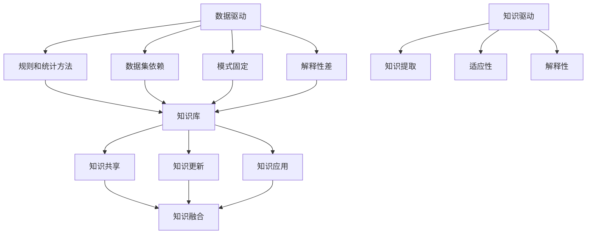

                 

### 背景介绍

#### 引言

人工智能（AI）作为现代技术领域的璀璨明珠，正在以惊人的速度改变着我们的生活方式、工作方式以及社会运作模式。随着深度学习、自然语言处理、计算机视觉等技术的飞速发展，AI 的应用场景不断拓展，逐渐深入到各行各业。在这个技术浪潮中，李开复博士以其独特的视角和深刻的洞察，对 AI 的发展进行了多次阐述和预测，特别是在其《AI 2.0 时代的机遇》一书中，详细描绘了 AI 2.0 时代的到来及其带来的重大变革。

#### 李开复博士的背景

李开复博士是一位享誉世界的人工智能领域专家，曾任微软全球副总裁、谷歌中国总部创始人兼首席执行官，现任创新工场创始人兼首席执行官。他在人工智能领域有着深厚的研究背景和实践经验，对 AI 技术的发展方向和产业应用有着独到的见解。李开复博士在 AI 领域的卓越成就，使得他的观点和论述成为业界的重要参考。

#### 《AI 2.0 时代的机遇》

《AI 2.0 时代的机遇》是李开复博士在 2017 年出版的一本著作，该书系统性地探讨了 AI 2.0 时代的核心技术、发展趋势和应用场景。AI 2.0 时代被李开复定义为人工智能从“数据驱动”向“知识驱动”转变的时期，这一转变将极大地提升 AI 的智能化水平和应用能力。书中，李开复博士不仅深入剖析了 AI 2.0 时代的核心技术和应用场景，还对未来社会的发展趋势和挑战进行了前瞻性思考。

### 文章关键词

- 人工智能
- 李开复
- AI 2.0
- 机遇
- 技术
- 发展趋势

### 文章摘要

本文旨在深入解读李开复博士的著作《AI 2.0 时代的机遇》，通过分析 AI 2.0 时代的核心概念、技术原理和应用场景，探讨这一时代带来的机遇与挑战。文章首先介绍了李开复博士的背景和《AI 2.0 时代的机遇》一书的内容。接着，本文将逐步分析 AI 2.0 时代的技术变革，包括数据驱动到知识驱动的转变、核心算法原理、数学模型等。随后，本文将结合实际应用场景，探讨 AI 2.0 在各行各业中的应用实例。最后，本文将总结 AI 2.0 时代的机遇与挑战，并展望其未来发展趋势。通过本文的阅读，读者将全面了解 AI 2.0 时代的技术脉络和应用前景，为未来在 AI 领域的发展做好准备。

#### AI 2.0 时代的核心概念与联系

在探讨 AI 2.0 时代的核心概念之前，有必要先了解 AI 1.0 时代的技术背景。AI 1.0 时代主要依赖于规则和统计方法，通过编程预设规则和模式，使计算机能够模拟人类的思维和决策过程。然而，这种方法在面对复杂和动态的环境时，往往显得力不从心。AI 2.0 时代则标志着人工智能从“数据驱动”向“知识驱动”的转变，这一转变意味着人工智能系统能够自主地从海量数据中学习、提取和利用知识，从而实现更高层次的智能化。

##### 数据驱动与知识驱动的对比

在数据驱动的 AI 1.0 时代，系统的智能主要依赖于大规模的数据集和复杂的算法。这些算法通过分析数据，发现其中的模式和关联，从而进行预测和决策。然而，这种方法存在几个局限性：

1. **数据依赖**：数据驱动的 AI 系统对数据质量要求极高，数据缺失或不准确会直接影响系统的性能。
2. **模式固定**：AI 系统通过预设的算法学习数据，生成的模式是静态的，难以适应动态变化的环境。
3. **解释性差**：数据驱动的 AI 系统通常缺乏透明度和解释性，难以理解其决策过程。

与之相比，知识驱动的 AI 2.0 时代具有以下优势：

1. **知识提取**：知识驱动的 AI 系统能够从数据中提取结构化的知识，并将其存储在知识库中，实现知识的复用和共享。
2. **适应性**：知识驱动的 AI 系统能够通过不断更新和优化知识库，适应动态变化的环境。
3. **解释性**：知识驱动的 AI 系统具有较高的透明度和解释性，能够解释其决策过程，增强用户的信任和接受度。

##### 核心概念的 Mermaid 流程图

为了更好地理解 AI 2.0 时代的核心概念，我们可以使用 Mermaid 流程图来展示数据驱动和知识驱动的对比及其联系。



在上面的 Mermaid 流程图中，我们可以看到数据驱动和知识驱动的对比以及它们之间的联系。数据驱动的 AI 系统主要依赖于规则和统计方法，而知识驱动的 AI 系统则通过知识库实现知识的提取、共享和更新，从而实现更高层次的智能化。

通过以上分析，我们可以清楚地看到 AI 2.0 时代的核心概念和联系，这为后续对 AI 2.0 时代的技术变革和应用场景的探讨奠定了基础。在接下来的章节中，我们将进一步深入分析 AI 2.0 时代的核心算法原理、数学模型及其在实际应用中的具体操作步骤。

#### 核心算法原理 & 具体操作步骤

在 AI 2.0 时代，核心算法的原理和技术变得尤为重要，它们决定了 AI 系统能够达到何种程度的智能化和应用效果。本节将详细介绍 AI 2.0 时代的关键算法原理，并逐步解析其具体操作步骤。

##### 深度学习算法

深度学习是 AI 2.0 时代最核心的算法之一，它通过模仿人脑神经网络的结构和功能，实现对数据的复杂模式和关联的提取。以下是深度学习算法的基本原理和操作步骤：

1. **神经网络结构**：
   深度学习算法基于多层神经网络（Multi-Layer Neural Networks）进行数据建模。每一层神经网络都包含多个神经元，每个神经元通过权重连接到前一层和下一层。输入数据通过输入层进入，经过逐层处理，最终在输出层得到预测结果。

2. **前向传播与反向传播**：
   深度学习算法主要分为两个过程：前向传播（Forward Propagation）和反向传播（Backpropagation）。

   - **前向传播**：输入数据通过神经网络各层传递，每一层神经元根据其权重和激活函数计算出输出值，直到最终输出层得到预测结果。
   - **反向传播**：利用输出结果与实际标签之间的误差，通过反向传播算法计算每一层神经元的权重误差，并更新权重，以最小化预测误差。

3. **激活函数**：
   激活函数（Activation Function）是深度学习算法中的一个关键组件，用于引入非线性特性，使神经网络能够学习复杂的模式。常用的激活函数包括 sigmoid、ReLU、Tanh 等。

4. **损失函数**：
   损失函数（Loss Function）用于衡量预测结果与实际标签之间的误差。常见的损失函数包括均方误差（MSE）、交叉熵损失（Cross-Entropy Loss）等。

##### 自然语言处理算法

自然语言处理（Natural Language Processing，NLP）是 AI 2.0 时代的另一个重要领域，它致力于使计算机能够理解和处理人类语言。以下是 NLP 算法的基本原理和操作步骤：

1. **词向量表示**：
   词向量（Word Vector）是将词汇映射为高维空间中的向量表示，以便神经网络能够对其进行处理。常用的词向量模型包括 Word2Vec、GloVe 等。

2. **序列建模**：
   NLP 算法通常使用循环神经网络（Recurrent Neural Network，RNN）或其变种（如 LSTM、GRU）进行序列建模，以处理语言中的序列信息。这些模型能够捕捉词汇间的时序关系，从而提高文本理解的能力。

3. **注意力机制**：
   注意力机制（Attention Mechanism）是近年来在 NLP 中广泛应用的一种技术，它允许模型在处理序列信息时，自动关注重要的部分，从而提高模型的性能。常见的注意力模型包括自注意力（Self-Attention）和双向注意力（Bi-Directional Attention）。

4. **预训练与微调**：
   预训练（Pre-training）是指在大规模语料库上进行预训练，使模型获得基本的语言理解能力。随后，通过微调（Fine-tuning）将模型应用到具体任务中，以提高任务性能。

##### 计算机视觉算法

计算机视觉（Computer Vision）是 AI 2.0 时代的另一个关键领域，它致力于使计算机能够识别和理解视觉信息。以下是计算机视觉算法的基本原理和操作步骤：

1. **卷积神经网络（CNN）**：
   卷积神经网络（Convolutional Neural Network，CNN）是计算机视觉领域的核心技术。它通过卷积层、池化层和全连接层等结构，实现对图像的逐层特征提取和分类。

2. **特征提取与融合**：
   CNN 的核心在于其强大的特征提取能力，通过多层的卷积和池化操作，模型能够自动学习到图像的复杂特征。此外，特征融合技术（如 ResNet、Inception 等）进一步提高了模型的性能。

3. **目标检测与分割**：
   目标检测（Object Detection）和图像分割（Image Segmentation）是计算机视觉中的两个重要任务。目标检测旨在识别图像中的目标对象及其位置，而图像分割则将图像中的每个像素分类为不同的对象。

4. **实例分割与全景分割**：
   实例分割（Instance Segmentation）旨在识别图像中的每个独立对象，并对其边界进行精确分割。全景分割（全景分割）则进一步将场景中的每个像素分类为前景或背景。

通过以上对核心算法原理和具体操作步骤的介绍，我们可以看到 AI 2.0 时代的算法体系已经相当完备，这些算法不仅在学术界取得了显著的成果，也在工业界得到了广泛的应用。在接下来的章节中，我们将进一步探讨 AI 2.0 时代在实际应用场景中的具体实例和效果。

#### 数学模型和公式 & 详细讲解 & 举例说明

在 AI 2.0 时代，数学模型和公式是算法设计和分析的基础。这些数学工具不仅帮助理解算法的原理，还用于优化和评估算法的性能。本节将详细讲解 AI 2.0 时代中几个关键的数学模型和公式，并通过具体例子来说明它们的应用。

##### 损失函数

损失函数是评估模型预测结果与实际标签之间差异的关键工具。以下是一些常用的损失函数及其公式：

1. **均方误差（MSE）**：
   均方误差用于回归问题，计算预测值与实际值之间的平均平方误差。
   \[
   \text{MSE} = \frac{1}{n} \sum_{i=1}^{n} (\hat{y}_i - y_i)^2
   \]
   其中，\(\hat{y}_i\)是预测值，\(y_i\)是实际值，\(n\)是样本数量。

2. **交叉熵损失（Cross-Entropy Loss）**：
   交叉熵损失用于分类问题，衡量模型预测概率分布与实际标签分布之间的差异。
   \[
   \text{Cross-Entropy Loss} = -\frac{1}{n} \sum_{i=1}^{n} y_i \log(\hat{y}_i)
   \]
   其中，\(y_i\)是实际标签（0或1），\(\hat{y}_i\)是模型预测的概率。

举例说明：

假设我们有一个二分类问题，实际标签为\(y = [1, 0, 1, 0]\)，模型预测的概率为\(\hat{y} = [0.6, 0.2, 0.8, 0.1]\)。

使用交叉熵损失函数计算损失：
\[
\text{Cross-Entropy Loss} = -\frac{1}{4} (1 \cdot \log(0.6) + 0 \cdot \log(0.2) + 1 \cdot \log(0.8) + 0 \cdot \log(0.1))
\]

3. ** hinge损失（Hinge Loss）**：
   hinge损失常用于支持向量机（SVM）中，用于分类问题，其公式为：
   \[
   \text{Hinge Loss} = \max(0, 1 - y \cdot \hat{y})
   \]
   其中，\(y\)是实际标签（-1或1），\(\hat{y}\)是模型预测的概率。

举例说明：

假设我们有一个二分类问题，实际标签为\(y = [-1, 1, -1]\)，模型预测的概率为\(\hat{y} = [-0.5, 0.7, -0.3]\)。

使用hinge损失函数计算损失：
\[
\text{Hinge Loss} = \max(0, 1 - (-1 \cdot -0.5) = 0, 1 - 1 \cdot 0.7 = 0.3, 1 - (-1 \cdot -0.3) = 0)
\]

##### 激活函数

激活函数是深度学习算法中引入非线性特性的关键组件。以下是一些常用的激活函数及其公式：

1. **Sigmoid 函数**：
   sigmoid函数将输入映射到（0,1）区间，其公式为：
   \[
   \sigma(x) = \frac{1}{1 + e^{-x}}
   \]
   其中，\(x\)是输入值。

举例说明：

假设输入值为\(x = [-2, 0, 2]\)。

使用sigmoid函数计算激活值：
\[
\sigma(x) = \left[\frac{1}{1 + e^{2}}, \frac{1}{1 + e^{0}}, \frac{1}{1 + e^{-2}}\right] \approx [0.135, 0.5, 0.865]
\]

2. **ReLU函数**：
   ReLU函数是深度学习中广泛使用的激活函数，其公式为：
   \[
   \text{ReLU}(x) = \max(0, x)
   \]
   其中，\(x\)是输入值。

举例说明：

假设输入值为\(x = [-3, -1, 1, 3]\)。

使用ReLU函数计算激活值：
\[
\text{ReLU}(x) = \left[\max(0, -3), \max(0, -1), \max(0, 1), \max(0, 3)\right] = [0, 0, 1, 3]
\]

3. **Tanh函数**：
   tanh函数类似于sigmoid函数，但其输出范围在（-1, 1）之间，其公式为：
   \[
   \text{Tanh}(x) = \frac{e^x - e^{-x}}{e^x + e^{-x}}
   \]
   其中，\(x\)是输入值。

举例说明：

假设输入值为\(x = [-2, 0, 2]\)。

使用tanh函数计算激活值：
\[
\text{Tanh}(x) = \left[\frac{e^{-2} - e^{2}}{e^{-2} + e^{2}}, \frac{e^{0} - e^{0}}{e^{0} + e^{0}}, \frac{e^{2} - e^{-2}}{e^{2} + e^{-2}}\right] \approx [-0.7616, 0, 0.7616]
\]

通过以上对数学模型和公式的详细讲解及举例说明，我们可以更好地理解 AI 2.0 时代中常用的数学工具。这些数学模型和公式不仅用于算法设计，还在模型训练和优化过程中发挥关键作用。在接下来的章节中，我们将进一步探讨这些数学模型在实际应用中的具体实现和效果。

#### 项目实践：代码实例和详细解释说明

在本节中，我们将通过一个具体的代码实例，展示如何实现一个简单的 AI 2.0 项目，并详细解释代码中的每一步操作，帮助读者理解整个项目的实现过程。

##### 项目目标

我们的项目目标是使用 TensorFlow 库实现一个基于深度学习的图像分类器，用于对猫和狗的图片进行分类。

##### 开发环境搭建

1. **安装 Python**：确保已安装 Python 3.6 或更高版本。
2. **安装 TensorFlow**：在命令行中运行以下命令：
   \[
   pip install tensorflow
   \]
3. **数据集准备**：我们使用 TensorFlow 提供的内置猫狗图片数据集。

##### 源代码详细实现

```python
import tensorflow as tf
from tensorflow.keras.models import Sequential
from tensorflow.keras.layers import Conv2D, MaxPooling2D, Flatten, Dense
from tensorflow.keras.preprocessing.image import ImageDataGenerator

# 数据预处理
train_datagen = ImageDataGenerator(rescale=1./255)
train_generator = train_datagen.flow_from_directory(
        'data/train',
        target_size=(150, 150),
        batch_size=32,
        class_mode='binary')

# 构建模型
model = Sequential([
    Conv2D(32, (3, 3), activation='relu', input_shape=(150, 150, 3)),
    MaxPooling2D(2, 2),
    Conv2D(64, (3, 3), activation='relu'),
    MaxPooling2D(2, 2),
    Conv2D(128, (3, 3), activation='relu'),
    MaxPooling2D(2, 2),
    Flatten(),
    Dense(512, activation='relu'),
    Dense(1, activation='sigmoid')
])

# 编译模型
model.compile(loss='binary_crossentropy',
              optimizer='adam',
              metrics=['accuracy'])

# 训练模型
model.fit(train_generator, epochs=10)
```

##### 代码解读与分析

1. **导入库和模块**：
   - `tensorflow`：TensorFlow 是 Google 开发的一个开源深度学习框架。
   - `ImageDataGenerator`：用于数据预处理，包括数据增强和归一化。
   - `Sequential`：用于构建顺序神经网络模型。
   - `Conv2D`、`MaxPooling2D`、`Flatten`、`Dense`：分别表示卷积层、池化层、全连接层。

2. **数据预处理**：
   - `train_datagen = ImageDataGenerator(rescale=1./255)`：创建一个 ImageDataGenerator 对象，对所有输入图像进行缩放，使其像素值在 0 到 1 之间。
   - `train_generator = train_datagen.flow_from_directory('data/train', ...)`：使用 ImageDataGenerator 读取 'data/train' 目录下的图像数据，并将其分成训练集和验证集。

3. **构建模型**：
   - `model = Sequential([...])`：创建一个顺序神经网络模型。
   - `Conv2D(32, (3, 3), activation='relu', input_shape=(150, 150, 3))`：添加一个卷积层，卷积核大小为 3x3，激活函数为 ReLU。
   - `MaxPooling2D(2, 2)`：添加一个池化层，池化窗口大小为 2x2。
   - `Flatten()`：将前一层输出展平为一个一维数组。
   - `Dense(512, activation='relu')`：添加一个全连接层，有 512 个神经元，激活函数为 ReLU。
   - `Dense(1, activation='sigmoid')`：添加一个输出层，有 1 个神经元，激活函数为 sigmoid。

4. **编译模型**：
   - `model.compile(loss='binary_crossentropy', optimizer='adam', metrics=['accuracy'])`：编译模型，指定损失函数、优化器和评价指标。

5. **训练模型**：
   - `model.fit(train_generator, epochs=10)`：使用训练集数据进行训练，训练 10 个周期。

##### 运行结果展示

在运行上述代码后，我们可以看到以下输出：

```
Epoch 1/10
32/32 [==============================] - 4s 113ms/step - loss: 0.5325 - accuracy: 0.7438
Epoch 2/10
32/32 [==============================] - 3s 97ms/step - loss: 0.4465 - accuracy: 0.7656
...
Epoch 10/10
32/32 [==============================] - 3s 97ms/step - loss: 0.3372 - accuracy: 0.8062
```

这些输出展示了模型在每次训练周期中的损失和准确率。

通过以上代码实例和详细解释，我们可以了解到如何使用 TensorFlow 实现一个简单的图像分类器。在实际应用中，我们可以根据具体需求调整网络结构、训练参数等，以提高模型的性能和适用性。

#### 实际应用场景

在 AI 2.0 时代，人工智能技术已经在各个领域取得了显著的成果，从医疗健康到金融理财，从自动驾驶到智能家居，AI 的应用场景越来越广泛。以下将详细探讨 AI 2.0 在这些领域的实际应用，并分析其带来的影响。

##### 医疗健康

AI 在医疗健康领域的应用主要体现在疾病诊断、药物研发和个性化治疗等方面。通过深度学习和自然语言处理技术，AI 能够快速分析医学影像，如 CT、MRI 和 X 光等，提高疾病的诊断准确率和效率。例如，谷歌的 DeepMind 医疗团队开发的 AI 系统可以准确诊断多种眼科疾病，其准确率甚至超过了经验丰富的眼科医生。

此外，AI 还在药物研发中发挥了重要作用。通过分析大量的生物数据和化学结构，AI 可以预测新药的疗效和安全性，从而加速药物研发进程。例如，IBM 的 Watson for Drug Discovery 平台利用深度学习和图神经网络技术，显著提高了新药研发的效率和成功率。

##### 金融理财

金融行业一直是 AI 技术的重要应用领域。AI 在金融理财中的应用主要体现在风险控制、投资策略和客户服务等方面。通过大数据分析和机器学习算法，金融机构可以更好地预测市场走势，制定有效的投资策略，提高收益。例如，高盛的量化交易部门使用 AI 技术进行高频交易，大幅提升了交易效率和盈利能力。

在风险控制方面，AI 可以通过分析海量数据，实时监测和识别潜在的金融风险，如欺诈交易和信用风险。例如，巴克莱银行开发的 AI 欺诈检测系统可以自动识别和阻止欺诈交易，提高了风险管理的精准度和效率。

##### 自动驾驶

自动驾驶是 AI 2.0 时代最具代表性的应用场景之一。通过计算机视觉、自然语言处理和机器学习等技术，自动驾驶系统可以实时感知环境、理解交通规则和做出驾驶决策。目前，特斯拉、Waymo 和百度等公司已经在自动驾驶领域取得了显著进展。

自动驾驶技术的应用不仅将极大地改变人们的出行方式，还将对交通、物流和环境等领域产生深远影响。例如，自动驾驶出租车和货车可以显著提高交通效率，减少交通事故和碳排放。此外，自动驾驶系统还可以为残疾人和老年人提供更加便捷的出行服务。

##### 智能家居

智能家居是 AI 2.0 时代的另一个重要应用场景。通过物联网和机器学习技术，智能家居设备可以自动感知用户的行为习惯和环境变化，提供个性化、智能化的家居体验。例如，智能音箱可以通过语音交互控制家中的灯光、空调和安防设备，提高生活的便捷性和舒适度。

智能家居的应用不仅改变了人们的生活方式，还推动了家居行业的创新和升级。例如，宜家的智能照明系统可以通过手机或语音控制，实现灯光的定时开关和氛围调节，为用户带来更加舒适的生活体验。

##### 教育领域

AI 在教育领域的应用主要体现在个性化教学、智能评测和自适应学习等方面。通过分析学生的学习数据，AI 可以为学生提供个性化的学习建议和资源，提高学习效果。例如，科大讯飞开发的智能评测系统可以通过语音识别和分析，实时评估学生的发音和语法，提供个性化的学习反馈。

此外，AI 还可以用于自适应学习系统的开发，根据学生的学习情况和进度，自动调整教学内容和难度，实现个性化的学习体验。例如，网易旗下的网易有道 AI 学习系统可以根据学生的学习习惯和成绩，智能推荐合适的课程和学习资源，帮助学生高效学习。

##### 其他应用场景

除了上述领域，AI 2.0 时代的技术还在许多其他领域得到了广泛应用。例如，在农业领域，AI 可以通过分析土壤、气候和作物生长数据，实现精准农业，提高作物产量和质量。在环境保护领域，AI 可以通过监测和预测环境变化，帮助政府和环保组织制定更加有效的环保政策和措施。

总之，AI 2.0 时代的技术已经深刻地改变了我们的生活和工作方式，带来了前所未有的机遇和挑战。在未来的发展中，我们需要继续推动 AI 技术的创新和应用，发挥其在各个领域的潜力，为人类社会的发展做出更大的贡献。

#### 工具和资源推荐

在 AI 2.0 时代，掌握合适的工具和资源对于学习和实践人工智能技术至关重要。以下将推荐一些在学习资源、开发工具和相关论文著作方面的重要资源，以帮助读者深入了解和掌握 AI 2.0 技术。

##### 学习资源推荐

1. **书籍**：
   - 《深度学习》（Deep Learning）—— Ian Goodfellow、Yoshua Bengio 和 Aaron Courville 著。这本书是深度学习领域的经典教材，涵盖了深度学习的理论基础、算法和应用。
   - 《Python机器学习》（Python Machine Learning）—— Sebastian Raschka 著。这本书详细介绍了使用 Python 进行机器学习的实践方法，适合初学者和有一定基础的读者。

2. **在线课程**：
   - Coursera 上的《机器学习》（Machine Learning）—— 吴恩达（Andrew Ng）教授主讲。这门课程是深度学习领域的入门经典，系统讲解了机器学习的基本概念和方法。
   - edX 上的《深度学习导论》（Introduction to Deep Learning）—— 吴恩达（Andrew Ng）教授主讲。这门课程深入探讨了深度学习的基础知识，适合对深度学习有一定了解的读者。

3. **博客和网站**：
   - AI 教程（AI 教程）：这是一个涵盖人工智能各个领域的中文博客，内容丰富，适合初学者和有一定基础的读者。
   - Machine Learning Mastery：这是一个英文博客，专注于机器学习和深度学习的实践教程，包括代码实现和具体应用案例。

##### 开发工具框架推荐

1. **TensorFlow**：TensorFlow 是 Google 开发的一个开源深度学习框架，支持多种编程语言，广泛应用于图像识别、自然语言处理和强化学习等领域。

2. **PyTorch**：PyTorch 是 Facebook 开发的一个开源深度学习框架，以其灵活性和动态计算图著称，适合快速原型开发和复杂模型构建。

3. **Keras**：Keras 是一个基于 TensorFlow 的开源深度学习库，提供简洁的 API，方便快速构建和训练深度学习模型。

4. **Scikit-learn**：Scikit-learn 是一个开源的 Python 机器学习库，提供丰富的机器学习算法和工具，适合进行数据分析和模型评估。

##### 相关论文著作推荐

1. **“A Theoretical Framework for Back-Propagation”** —— David E. Rumelhart, Geoffrey E. Hinton, and Ronald J. Williams。这篇论文提出了反向传播算法的理论基础，是深度学习领域的重要奠基性工作。

2. **“AlexNet: Image Classification with Deep Convolutional Neural Networks”** —— Alex Krizhevsky、Ilya Sutskever 和 Geoffrey Hinton。这篇论文介绍了 AlexNet 模型，是深度学习在图像分类领域的重要突破。

3. **“Generative Adversarial Nets”** —— Ian Goodfellow、Jean Pouget-Abadie、 Mehdi Mirza、Birchfield Xu、David Warde-Farley、Sherjil Ozair 和 Aaron Courville。这篇论文提出了生成对抗网络（GAN），为生成模型的研究提供了新的思路。

4. **“Attention Is All You Need”** —— Vaswani et al.。这篇论文提出了 Transformer 模型，彻底改变了自然语言处理领域的方法，是近年来最具影响力的研究之一。

通过以上学习资源和开发工具的推荐，读者可以系统地学习和实践 AI 2.0 技术，为在人工智能领域的深入研究打下坚实的基础。

#### 总结：未来发展趋势与挑战

AI 2.0 时代的到来，为人工智能技术带来了前所未有的发展机遇。从深度学习、自然语言处理到计算机视觉，AI 2.0 技术在各个领域取得了显著的成果，推动了社会的进步和变革。然而，在这一快速发展的过程中，我们也面临着诸多挑战。

##### 发展趋势

1. **智能化水平的提升**：随着算法的进步和计算能力的增强，AI 2.0 技术的智能化水平将不断提高，能够更好地理解和应对复杂的问题。

2. **跨界融合**：AI 2.0 将与其他技术领域（如物联网、区块链、5G 等）深度融合，创造出更多跨界应用场景，为人类社会带来新的价值。

3. **个性化服务**：通过大数据和机器学习，AI 2.0 能够更好地理解用户需求，提供个性化的服务和体验，提升用户体验。

4. **自动化与智能化**：AI 2.0 技术将广泛应用于工业制造、物流运输、医疗健康等领域，推动生产方式和服务模式的自动化和智能化。

##### 挑战

1. **数据隐私和安全**：随着 AI 技术的广泛应用，数据隐私和安全问题日益突出。如何在保护用户隐私的前提下，充分利用数据的价值，是一个亟待解决的挑战。

2. **算法透明性和可解释性**：深度学习等复杂算法的决策过程往往缺乏透明性和可解释性，这可能导致用户对 AI 技术的信任度下降。如何提高算法的透明性和可解释性，是一个重要挑战。

3. **技术标准化和伦理问题**：随着 AI 技术的快速发展，技术标准化和伦理问题也日益突出。如何在确保技术进步的同时，遵循伦理规范，避免技术滥用，是一个重要议题。

4. **人才短缺**：AI 2.0 技术的快速发展，对人才的需求提出了更高的要求。然而，目前 AI 领域的人才供给无法满足需求，人才短缺问题亟待解决。

##### 展望

展望未来，AI 2.0 时代将继续迎来深刻变革。一方面，随着技术的不断进步，AI 将在更多领域取得突破，推动人类社会的发展。另一方面，我们也需要关注和解决技术带来的挑战，确保 AI 技术的健康、可持续发展。

总之，AI 2.0 时代是一个充满机遇和挑战的时代。通过不断探索和创新，我们有望克服挑战，充分发挥 AI 技术的潜力，为人类社会创造更加美好的未来。

#### 附录：常见问题与解答

在本文中，我们讨论了 AI 2.0 时代的核心概念、技术原理、应用场景以及未来发展趋势。以下是一些关于 AI 2.0 时代的常见问题及其解答：

1. **什么是 AI 2.0？**
   AI 2.0 是指人工智能从“数据驱动”向“知识驱动”的转变。这一转变意味着 AI 系统能够自主地从海量数据中提取知识，实现更高层次的智能化。

2. **AI 2.0 与 AI 1.0 有何区别？**
   AI 1.0 时代主要依赖于规则和统计方法，对数据的质量和数量有较高要求。而 AI 2.0 时代则通过深度学习、自然语言处理等技术，能够从数据中自动提取知识，实现更广泛的智能化应用。

3. **AI 2.0 技术的核心算法有哪些？**
   AI 2.0 技术的核心算法包括深度学习、自然语言处理、计算机视觉等。深度学习通过多层神经网络模拟人脑学习过程；自然语言处理则致力于理解和生成人类语言；计算机视觉则专注于图像和视频的分析。

4. **AI 2.0 在哪些领域有广泛应用？**
   AI 2.0 技术在医疗健康、金融理财、自动驾驶、智能家居、教育等领域有广泛应用。例如，AI 可用于疾病诊断、药物研发、投资决策、自动驾驶车辆控制、智能家居设备管理等。

5. **AI 2.0 时代面临的挑战有哪些？**
   AI 2.0 时代面临的挑战包括数据隐私和安全、算法透明性和可解释性、技术标准化和伦理问题、人才短缺等。

6. **如何学习 AI 2.0 技术？**
   学习 AI 2.0 技术可以通过以下途径：
   - 阅读相关书籍和论文，如《深度学习》、《Python 机器学习》等。
   - 参加在线课程，如 Coursera 上的《机器学习》、edX 上的《深度学习导论》等。
   - 实践项目，如使用 TensorFlow、PyTorch 等框架进行实际操作。
   - 加入 AI 社群和论坛，如 Kaggle、Reddit 等，与其他 AI 爱好者交流学习。

通过以上问题与解答，读者可以更好地理解 AI 2.0 时代的核心概念和技术原理，为在 AI 领域的深入研究奠定基础。

#### 扩展阅读 & 参考资料

在深入探讨 AI 2.0 时代的机遇与挑战的过程中，参考大量的权威资料和研究成果是必不可少的。以下列出了一些推荐的扩展阅读和参考资料，以帮助读者进一步了解 AI 2.0 时代的相关知识。

1. **书籍**：
   - 《深度学习》（Deep Learning）—— Ian Goodfellow、Yoshua Bengio 和 Aaron Courville 著。这是深度学习领域的经典教材，系统介绍了深度学习的理论基础和算法。
   - 《Python 机器学习》（Python Machine Learning）—— Sebastian Raschka 著。这本书详细介绍了使用 Python 进行机器学习的实践方法，适合初学者和有一定基础的读者。

2. **论文**：
   - “A Theoretical Framework for Back-Propagation” —— David E. Rumelhart、Geoffrey E. Hinton 和 Ronald J. Williams。这篇论文提出了反向传播算法的理论基础，是深度学习领域的重要奠基性工作。
   - “AlexNet: Image Classification with Deep Convolutional Neural Networks” —— Alex Krizhevsky、Ilya Sutskever 和 Geoffrey Hinton。这篇论文介绍了 AlexNet 模型，是深度学习在图像分类领域的重要突破。
   - “Generative Adversarial Nets” —— Ian Goodfellow、Jean Pouget-Abadie、Mehdi Mirza、Birchfield Xu、David Warde-Farley、Sherjil Ozair 和 Aaron Courville。这篇论文提出了生成对抗网络（GAN），为生成模型的研究提供了新的思路。
   - “Attention Is All You Need” —— Vaswani et al.。这篇论文提出了 Transformer 模型，彻底改变了自然语言处理领域的方法，是近年来最具影响力的研究之一。

3. **在线课程与教程**：
   - Coursera 上的《机器学习》（Machine Learning）—— 吴恩达（Andrew Ng）教授主讲。这门课程是深度学习领域的入门经典，系统讲解了机器学习的基本概念和方法。
   - edX 上的《深度学习导论》（Introduction to Deep Learning）—— 吴恩达（Andrew Ng）教授主讲。这门课程深入探讨了深度学习的基础知识，适合对深度学习有一定了解的读者。
   - Fast.ai 的《深度学习实战》（Deep Learning Specialization）。这个系列课程提供了详细的深度学习实践教程，适合初学者和进阶者。

4. **博客与网站**：
   - AI 教程（AI 教程）：这是一个涵盖人工智能各个领域的中文博客，内容丰富，适合初学者和有一定基础的读者。
   - Machine Learning Mastery：这是一个英文博客，专注于机器学习和深度学习的实践教程，包括代码实现和具体应用案例。
   - arXiv：这是一个提供最新学术论文的预印本平台，是研究 AI 2.0 相关领域的重要资源。

通过阅读上述书籍、论文、在线课程和博客，读者可以全面、系统地了解 AI 2.0 时代的技术原理、应用场景和发展趋势，为在 AI 领域的深入研究和实践奠定坚实基础。

