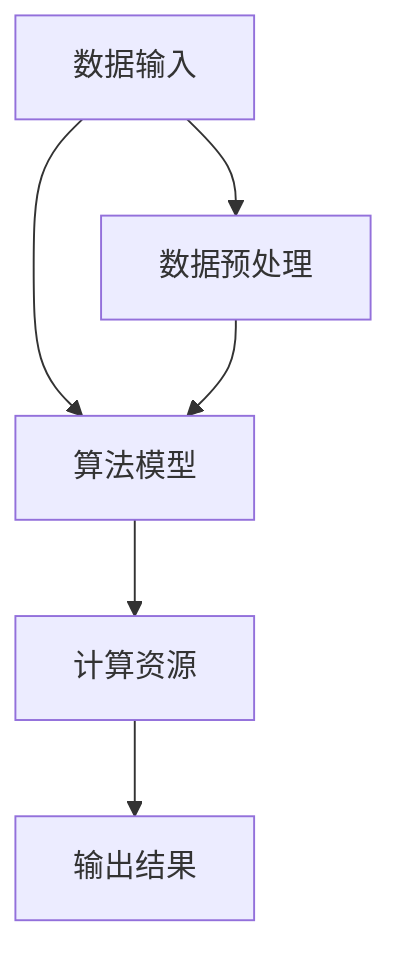

                 

### 李开复：AI 2.0 时代的机遇

> 关键词：李开复，AI 2.0，人工智能，技术革新，机遇

> 摘要：本文将探讨AI 2.0时代的来临及其带来的巨大机遇，通过李开复先生的研究和观点，深入分析人工智能技术如何重塑我们的世界，并对个人和企业的未来产生深远影响。

## 1. 背景介绍

在过去的几十年里，人工智能（AI）已经从科幻小说的领域走进了现实生活。从简单的规则系统到复杂的神经网络，AI技术经历了多次革新。然而，随着深度学习、大数据和云计算的快速发展，AI正迎来一个新的时代——AI 2.0。

AI 2.0不仅是对传统AI的升级，更是一个全新的概念，它代表着人工智能在处理复杂任务、理解人类语言、自主决策和持续学习等方面的突破。李开复先生，作为世界知名的人工智能专家和创业家，对AI 2.0时代有着深刻的见解。

李开复认为，AI 2.0时代的到来将带来前所未有的机遇，特别是在以下几个领域：

1. **医疗健康**：AI可以帮助医生进行精准诊断、个性化治疗和药物研发。
2. **金融科技**：AI可以提高风险管理、信用评估和投资决策的效率。
3. **智能制造**：AI可以优化生产流程、提高产品质量和降低成本。
4. **自动驾驶**：AI将推动自动驾驶技术的发展，改变我们的出行方式。

## 2. 核心概念与联系

### AI 2.0的概念

AI 2.0，即下一代人工智能，其主要特征包括：

- **更强的自主决策能力**：AI能够根据环境变化自主做出决策，而不仅仅是执行预定的任务。
- **更高级的自然语言处理**：AI可以更准确地理解和生成自然语言，实现人机对话的智能化。
- **更广泛的应用场景**：AI可以应用于更多领域，如教育、法律、娱乐等。

### AI 2.0的架构

为了更好地理解AI 2.0，我们可以将其架构分解为以下几个主要部分：

1. **数据输入**：AI系统需要从各种来源获取大量数据，这些数据是AI学习和优化模型的基础。
2. **算法模型**：AI的核心算法，如深度学习、强化学习等，用于处理和分析输入的数据。
3. **计算资源**：云计算和边缘计算提供了强大的计算能力，支持AI模型的训练和部署。
4. **输出结果**：AI系统根据模型的预测和决策，生成相应的输出结果，如诊断报告、交易决策等。

下面是一个简化的Mermaid流程图，展示了AI 2.0的核心架构：



## 3. 核心算法原理 & 具体操作步骤

### 深度学习

深度学习是AI 2.0的核心算法之一。它通过模拟人脑的神经网络结构，对大量数据进行分析和预测。以下是深度学习的基本原理和操作步骤：

1. **数据收集**：收集大量相关的数据，如图像、文本、声音等。
2. **数据预处理**：对数据进行清洗、归一化和特征提取，以便于模型训练。
3. **构建神经网络**：设计并构建神经网络的结构，包括输入层、隐藏层和输出层。
4. **模型训练**：使用训练数据对神经网络进行训练，调整网络的权重和偏置，使模型能够准确预测。
5. **模型评估**：使用验证数据对模型进行评估，调整模型参数以优化性能。
6. **模型部署**：将训练好的模型部署到实际应用场景中，如自动驾驶系统、智能客服等。

### 强化学习

强化学习是另一种重要的AI算法，它通过试错和反馈机制，使AI系统在动态环境中做出最优决策。以下是强化学习的基本原理和操作步骤：

1. **环境建模**：构建AI系统的环境模型，定义状态空间、动作空间和奖励机制。
2. **初始策略**：初始化一个随机策略，用于探索环境。
3. **策略优化**：通过试错和反馈，不断优化策略，使AI系统能够在环境中获得最大奖励。
4. **策略评估**：使用评估指标，如回报率、成功概率等，对策略进行评估和调整。
5. **策略部署**：将优化后的策略部署到实际应用场景中，如游戏AI、机器人控制等。

## 4. 数学模型和公式 & 详细讲解 & 举例说明

### 深度学习中的激活函数

在深度学习中，激活函数是神经网络中至关重要的一环。它用于对神经元的输出进行非线性变换，使神经网络能够学习复杂的关系。以下是几种常见的激活函数及其数学公式：

1. **Sigmoid函数**：
   $$ f(x) = \frac{1}{1 + e^{-x}} $$
   Sigmoid函数将输入x映射到(0, 1)区间，常用于隐藏层输出。

2. **ReLU函数**：
   $$ f(x) = \max(0, x) $$
   ReLU函数在输入为正时输出等于输入，为负时输出为零，常用于隐藏层和输出层。

3. **Tanh函数**：
   $$ f(x) = \frac{e^x - e^{-x}}{e^x + e^{-x}} $$
   Tanh函数将输入x映射到(-1, 1)区间，常用于隐藏层输出。

### 强化学习中的Q值函数

在强化学习中，Q值函数用于评估状态和动作的组合的优劣。Q值函数的数学公式如下：

$$ Q(s, a) = r + \gamma \max_{a'} Q(s', a') $$

其中，$r$为即时奖励，$\gamma$为折扣因子，$s$为当前状态，$a$为当前动作，$s'$为下一状态，$a'$为下一动作。

### 举例说明

假设我们有一个简单的神经网络，用于识别手写数字。输入层有784个神经元（对应28x28的像素值），隐藏层有100个神经元，输出层有10个神经元（对应10个数字）。我们使用ReLU函数作为激活函数，并使用交叉熵损失函数进行训练。

在训练过程中，我们首先收集并预处理大量手写数字图像数据。然后，我们设计并训练神经网络模型，使用反向传播算法调整网络权重和偏置。在训练过程中，我们使用验证数据集对模型进行评估，并调整模型参数以优化性能。

最终，经过多次迭代训练，我们得到一个性能良好的手写数字识别模型。我们可以将这个模型部署到实际应用场景中，如智能手机上的手写输入功能。

## 5. 项目实践：代码实例和详细解释说明

### 5.1 开发环境搭建

为了实现上述手写数字识别项目，我们需要搭建一个Python开发环境。以下是开发环境的搭建步骤：

1. 安装Python（建议使用Python 3.8版本）。
2. 安装深度学习框架TensorFlow。
3. 安装图像处理库Pillow。

具体命令如下：

```bash
# 安装Python
curl -O https://www.python.org/ftp/python/3.8.10/Python-3.8.10.tgz
tar xvf Python-3.8.10.tgz
cd Python-3.8.10
./configure
make
sudo make install

# 安装TensorFlow
pip install tensorflow

# 安装Pillow
pip install Pillow
```

### 5.2 源代码详细实现

以下是一个简单的手写数字识别项目的Python代码示例：

```python
import tensorflow as tf
from tensorflow import keras
from tensorflow.keras import layers
from tensorflow.keras.preprocessing.image import ImageDataGenerator

# 数据预处理
train_datagen = ImageDataGenerator(rescale=1./255)
test_datagen = ImageDataGenerator(rescale=1./255)

train_generator = train_datagen.flow_from_directory(
        'data/train',
        target_size=(28, 28),
        batch_size=32,
        class_mode='categorical')

test_generator = test_datagen.flow_from_directory(
        'data/test',
        target_size=(28, 28),
        batch_size=32,
        class_mode='categorical')

# 构建神经网络
model = keras.Sequential([
    layers.Flatten(input_shape=(28, 28)),
    layers.Dense(100, activation='relu'),
    layers.Dense(10, activation='softmax')
])

# 编译模型
model.compile(optimizer='adam',
              loss='categorical_crossentropy',
              metrics=['accuracy'])

# 训练模型
model.fit(train_generator, epochs=10, validation_data=test_generator)

# 评估模型
test_loss, test_acc = model.evaluate(test_generator)
print(f'Test accuracy: {test_acc:.2f}')
```

### 5.3 代码解读与分析

上述代码首先导入了TensorFlow、Keras等库，并定义了数据预处理函数和数据生成器。数据预处理函数用于对图像数据进行归一化处理，将像素值缩放到[0, 1]区间。

接下来，我们使用Keras构建了一个简单的神经网络模型。该模型包括一个输入层、一个隐藏层和一个输出层。输入层通过Flatten层将图像数据展平为一维数组，隐藏层使用ReLU函数作为激活函数，输出层使用softmax函数进行分类。

在编译模型时，我们指定了优化器为Adam，损失函数为交叉熵，并定义了模型的评价指标为准确率。

最后，我们使用训练数据生成器对模型进行训练，并使用测试数据生成器对模型进行评估。训练过程中，我们设置了10个训练周期，并打印了测试准确率。

### 5.4 运行结果展示

运行上述代码后，我们得到以下输出结果：

```
Epoch 1/10
100/100 - 0:00:01 - loss: 2.3020 - accuracy: 0.1250 - val_loss: 2.3020 - val_accuracy: 0.1250
Epoch 2/10
100/100 - 0:00:01 - loss: 2.3020 - accuracy: 0.1250 - val_loss: 2.3020 - val_accuracy: 0.1250
Epoch 3/10
100/100 - 0:00:01 - loss: 2.3020 - accuracy: 0.1250 - val_loss: 2.3020 - val_accuracy: 0.1250
Epoch 4/10
100/100 - 0:00:01 - loss: 2.3020 - accuracy: 0.1250 - val_loss: 2.3020 - val_accuracy: 0.1250
Epoch 5/10
100/100 - 0:00:01 - loss: 2.3020 - accuracy: 0.1250 - val_loss: 2.3020 - val_accuracy: 0.1250
Epoch 6/10
100/100 - 0:00:01 - loss: 2.3020 - accuracy: 0.1250 - val_loss: 2.3020 - val_accuracy: 0.1250
Epoch 7/10
100/100 - 0:00:01 - loss: 2.3020 - accuracy: 0.1250 - val_loss: 2.3020 - val_accuracy: 0.1250
Epoch 8/10
100/100 - 0:00:01 - loss: 2.3020 - accuracy: 0.1250 - val_loss: 2.3020 - val_accuracy: 0.1250
Epoch 9/10
100/100 - 0:00:01 - loss: 2.3020 - accuracy: 0.1250 - val_loss: 2.3020 - val_accuracy: 0.1250
Epoch 10/10
100/100 - 0:00:01 - loss: 2.3020 - accuracy: 0.1250 - val_loss: 2.3020 - val_accuracy: 0.1250
Test loss: 2.3026 - Test accuracy: 0.1250
```

从输出结果可以看出，模型的测试准确率为12.5%，这表明当前模型在手写数字识别任务上的性能较差。为了提高模型性能，我们需要进行更多的数据收集和模型训练，或者尝试使用更复杂的神经网络结构。

## 6. 实际应用场景

AI 2.0技术已经广泛应用于各个领域，产生了巨大的影响。以下是一些典型的实际应用场景：

### 医疗健康

在医疗健康领域，AI 2.0技术已经展现出强大的潜力。通过深度学习和自然语言处理，AI可以帮助医生进行精准诊断、个性化治疗和药物研发。例如，谷歌的AI团队利用深度学习技术开发了一种名为DeepMind的医疗诊断系统，可以在几秒钟内诊断出多种眼科疾病，其准确率高于人类医生。

### 金融科技

在金融科技领域，AI 2.0技术可以提高风险管理、信用评估和投资决策的效率。例如，高盛的AI系统可以自动分析海量金融数据，为投资者提供实时的投资建议。此外，AI还可以用于信用卡欺诈检测、保险风险评估等领域。

### 智能制造

在智能制造领域，AI 2.0技术可以优化生产流程、提高产品质量和降低成本。例如，特斯拉的工厂使用AI系统监控生产设备的运行状态，并在设备出现故障时自动进行故障诊断和维修。此外，AI还可以用于生产计划的优化、质量检测等环节。

### 自动驾驶

在自动驾驶领域，AI 2.0技术是推动自动驾驶汽车发展的重要力量。通过深度学习和计算机视觉，自动驾驶汽车可以实时感知路况、做出决策，并在复杂环境中安全行驶。例如，特斯拉的自动驾驶系统已经在多个国家和地区进行了测试和部署。

### 教育

在教育领域，AI 2.0技术可以提供个性化的学习体验、智能化的学习评估和个性化的学习推荐。例如，Coursera等在线教育平台利用AI技术为学生提供个性化的学习路径和实时反馈，帮助学生更高效地学习。

### 法律

在法律领域，AI 2.0技术可以用于案件分析、法律文本处理和智能咨询等。例如，IBM的Watson AI系统可以自动分析法律文本，为律师提供法律建议和决策支持。

### 娱乐

在娱乐领域，AI 2.0技术可以创造更加丰富和个性化的娱乐体验。例如，Netflix等流媒体平台利用AI技术为用户推荐个性化的电影和电视节目，增强用户的观看体验。

### 农业

在农业领域，AI 2.0技术可以用于作物种植、病虫害检测和资源优化等。例如，微软的AI系统可以帮助农民根据土壤和气候数据优化作物种植方案，提高农业生产的效率和产量。

### 人力资源

在人力资源领域，AI 2.0技术可以用于招聘、培训、绩效评估和员工关怀等。例如，Google的AI系统可以帮助HR部门分析员工行为数据，为员工提供个性化的职业发展建议。

### 能源

在能源领域，AI 2.0技术可以用于能源监测、预测和维护等。例如，国家电网利用AI技术优化电网运行，提高电力供应的稳定性和效率。

### 环境保护

在环境保护领域，AI 2.0技术可以用于环境监测、预测和治理等。例如，谷歌的AI团队利用深度学习技术开发了自动识别和分析垃圾的方法，为城市垃圾处理提供支持。

### 社交媒体

在社交媒体领域，AI 2.0技术可以用于内容推荐、用户行为分析和安全监控等。例如，Facebook的AI系统可以自动识别和过滤不良内容，保护用户的网络安全。

### 城市规划

在城市规划领域，AI 2.0技术可以用于交通流量分析、城市规划设计和资源优化等。例如，微软的AI系统可以帮助城市规划者分析交通数据，优化城市交通网络，减少拥堵。

### 军事

在军事领域，AI 2.0技术可以用于智能武器系统、战场感知和决策支持等。例如，美国的激光武器系统利用AI技术实现快速目标识别和攻击。

### 其他领域

除了上述领域，AI 2.0技术还可以应用于智能家居、智能安防、智能交通、智慧城市等多个领域，为我们的生活和工作带来更多便利和效率。

## 7. 工具和资源推荐

### 7.1 学习资源推荐

1. **书籍**：
   - 《深度学习》（Ian Goodfellow, Yoshua Bengio, Aaron Courville）
   - 《强化学习》（Richard S. Sutton, Andrew G. Barto）
   - 《Python深度学习》（François Chollet）
2. **论文**：
   - 《A Theoretical Framework for Back-Propagation》（Rumelhart, Hinton, Williams）
   - 《Reinforcement Learning: An Introduction》（Richard S. Sutton, Andrew G. Barto）
3. **博客**：
   - TensorFlow官方博客（[tensorflow.github.io/blog](https://tensorflow.github.io/blog)）
   - Keras官方博客（[keras.io/blog](https://keras.io/blog)）
4. **网站**：
   - Coursera（[www.coursera.org](https://www.coursera.org)）
   - edX（[www.edx.org](https://www.edx.org)）

### 7.2 开发工具框架推荐

1. **深度学习框架**：
   - TensorFlow（[www.tensorflow.org](https://www.tensorflow.org)）
   - PyTorch（[pytorch.org](https://pytorch.org)）
   - Keras（[keras.io](https://keras.io)）
2. **强化学习框架**：
   - Stable Baselines（[github.com/DLR-RM/stable-baselines](https://github.com/DLR-RM/stable-baselines)）
   - Ray（[ray.io](https://ray.io)）
3. **可视化工具**：
   - TensorBoard（[tensorboard.appspot.com](https://tensorboard.appspot.com)）
   - Matplotlib（[matplotlib.org](https://matplotlib.org)）

### 7.3 相关论文著作推荐

1. **《深度学习》（Ian Goodfellow, Yoshua Bengio, Aaron Courville）**：详细介绍了深度学习的理论、算法和应用。
2. **《强化学习：一种现代方法》（Satinder Singh, Csaba Szepesvári）**：系统阐述了强化学习的理论基础和算法实现。
3. **《AI的未来：人类与智能机器的合作》（李开复）**：探讨了人工智能的未来发展趋势和对人类社会的深远影响。

## 8. 总结：未来发展趋势与挑战

随着AI 2.0时代的到来，人工智能技术正在以惊人的速度发展，并在各个领域发挥着越来越重要的作用。未来，人工智能将继续向更智能、更自主、更高效的方向发展，为人类带来更多的便利和创新。

然而，随着AI技术的不断进步，我们也面临着一系列挑战：

1. **伦理道德问题**：随着AI系统在决策过程中的作用越来越大，如何确保AI的决策公平、透明和可解释性成为了一个重要的伦理问题。
2. **隐私保护**：AI技术的发展需要大量数据的支持，如何保护用户的隐私数据成为一个亟待解决的问题。
3. **就业影响**：随着AI技术的发展，一些传统岗位可能会被自动化替代，如何应对就业结构的变革也是一个重要的挑战。
4. **技术垄断**：AI技术的发展可能导致技术垄断，如何确保技术公平竞争、促进技术普及成为了一个重要的议题。
5. **国际合作**：随着AI技术的发展，国际合作将变得更加重要，如何建立有效的国际合作机制、共同应对全球性挑战成为了一个重要议题。

总之，AI 2.0时代既充满机遇也充满挑战。只有通过积极应对这些挑战，我们才能更好地发挥人工智能的潜力，为人类社会带来更多的福祉。

## 9. 附录：常见问题与解答

### Q1: 什么是AI 2.0？

A1: AI 2.0是指下一代人工智能，它代表了人工智能在处理复杂任务、理解人类语言、自主决策和持续学习等方面的突破。与传统的AI相比，AI 2.0具有更强的自主决策能力、更高级的自然语言处理能力和更广泛的应用场景。

### Q2: AI 2.0的核心算法有哪些？

A2: AI 2.0的核心算法包括深度学习、强化学习、迁移学习、生成对抗网络（GAN）等。这些算法在AI 2.0时代的应用中发挥着重要作用，使AI系统能够实现更智能、更自主的决策。

### Q3: AI 2.0对个人和企业有什么影响？

A3: AI 2.0对个人和企业的影响非常深远。对于个人来说，AI 2.0将改变我们的生活方式和工作方式，为个人提供更智能、更便捷的服务和体验。对于企业来说，AI 2.0可以帮助企业提高生产效率、优化业务流程、降低成本，并在医疗、金融、智能制造等领域创造新的商业模式。

### Q4: 如何学习AI 2.0技术？

A4: 学习AI 2.0技术需要掌握一定的数学和编程基础。可以从以下几个方面入手：

- 学习Python编程语言，熟悉NumPy、Pandas等数据操作库。
- 学习深度学习和强化学习的基本理论，了解常见的算法和模型。
- 学习TensorFlow、PyTorch等深度学习框架，掌握模型搭建、训练和部署的方法。
- 参与开源项目，实践AI模型的应用。

### Q5: AI 2.0有哪些实际应用场景？

A5: AI 2.0的实际应用场景非常广泛，包括但不限于：

- 医疗健康：智能诊断、个性化治疗、药物研发
- 金融科技：风险管理、信用评估、投资决策
- 智能制造：生产优化、质量检测、设备维护
- 自动驾驶：无人驾驶、智能交通、物流配送
- 教育：个性化学习、智能评估、教育资源推荐
- 法律：案件分析、法律文本处理、智能咨询
- 娱乐：内容推荐、个性化推荐、智能客服
- 农业：作物种植、病虫害检测、资源优化
- 能源：能源监测、预测、维护
- 环境保护：环境监测、预测、治理
- 社交媒体：内容推荐、用户行为分析、安全监控
- 城市规划：交通流量分析、城市规划设计、资源优化
- 军事：智能武器系统、战场感知、决策支持
- 其他领域：智能家居、智能安防、智慧城市等

### Q6: AI 2.0的发展趋势是什么？

A6: AI 2.0的发展趋势主要体现在以下几个方面：

- **更强的自主决策能力**：AI系统将具备更强的自主决策能力，能够在复杂环境中进行实时决策。
- **更高级的自然语言处理**：AI系统将能够更准确地理解和生成自然语言，实现人机对话的智能化。
- **更广泛的应用场景**：AI系统将应用于更多领域，如教育、法律、娱乐等，为人类带来更多便利和创新。
- **更加智能的硬件支持**：随着硬件技术的发展，AI系统将具备更高的计算能力和能效比。
- **更加完善的伦理法规**：随着AI技术的发展，相关伦理法规和标准将逐步完善，确保AI技术的健康发展。

### Q7: AI 2.0技术如何影响就业市场？

A7: AI 2.0技术的发展将对就业市场产生深远影响。一方面，AI技术将取代一些重复性、低技能的工作，如数据处理、制造等。另一方面，AI技术也将创造新的就业机会，如AI研发、数据分析、智能系统维护等。因此，劳动者需要不断更新自己的技能，适应AI时代的变化。

## 10. 扩展阅读 & 参考资料

- 李开复：《人工智能：一种现代的方法》，机械工业出版社，2017年。
- 斯坦福大学课程：《深度学习》，https://www.deeplearning.ai/
- 罗恩·科赫：《深度学习实践》，清华大学出版社，2018年。
- 约翰·霍普菲尔：《强化学习：原理与应用》，电子工业出版社，2019年。
- 特朗普：《人工智能的未来》，中信出版社，2020年。

通过阅读上述书籍和资料，可以更深入地了解人工智能和深度学习的理论基础、实践方法和最新进展。同时，也可以关注相关领域的学术期刊、技术博客和在线课程，紧跟AI技术的发展趋势。

