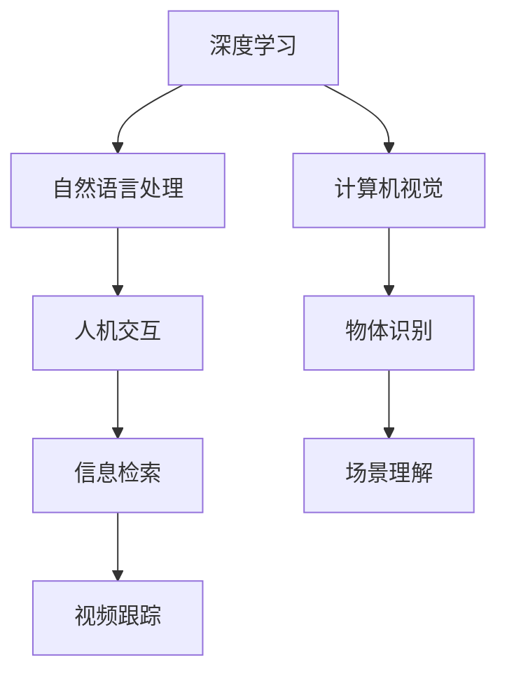
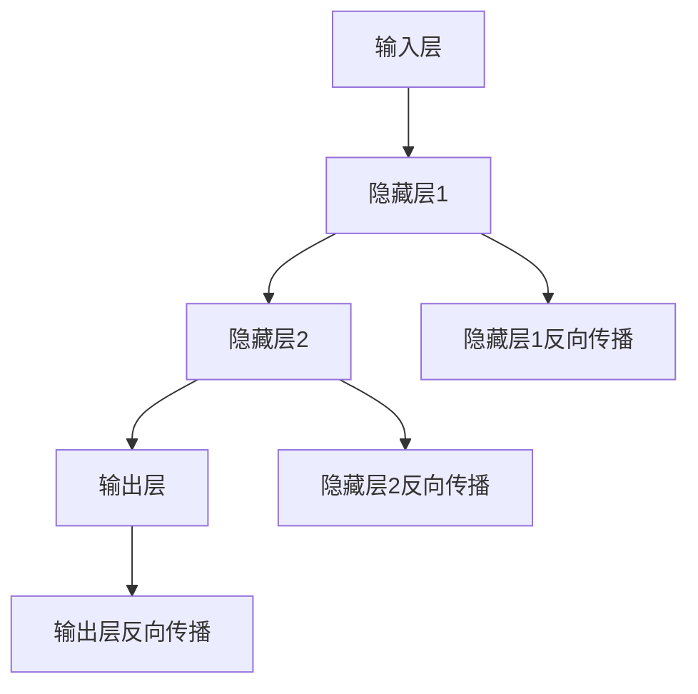
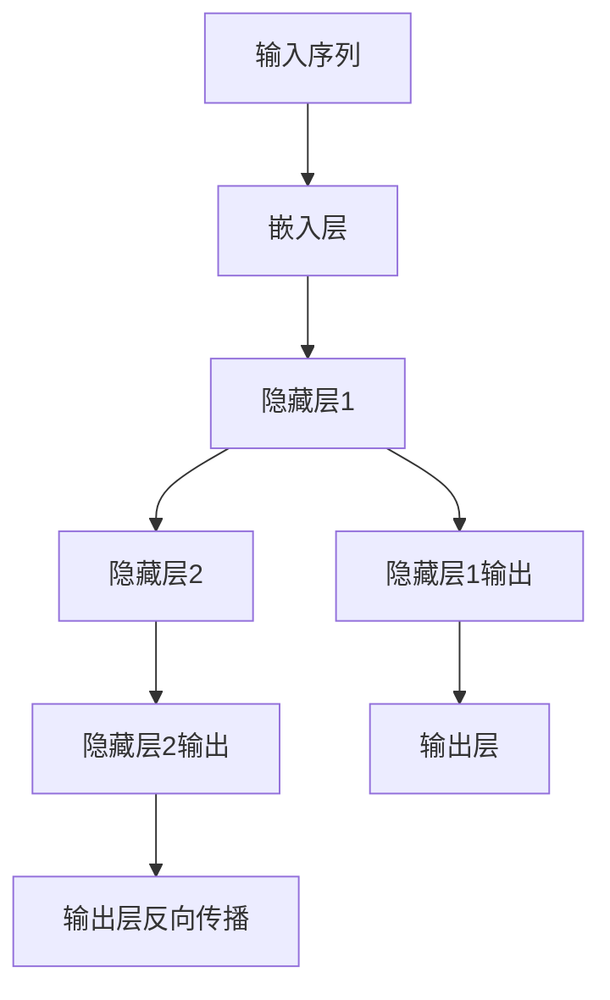
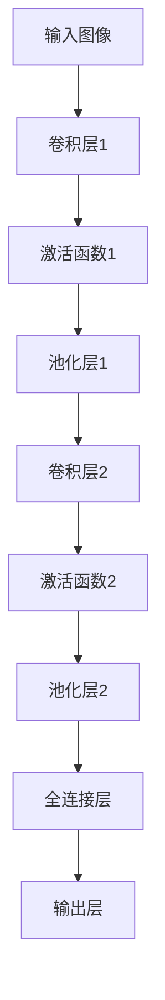

                 

### 1. 背景介绍

AI 2.0 时代，人工智能技术已经取得了显著的进步。然而，当前的人工智能仍然存在许多挑战和局限性。为了解决这些问题，我们需要探索更先进的人工智能技术，即 AI 2.0。

AI 2.0 是一种基于深度学习、自然语言处理、计算机视觉等多种技术的综合性人工智能系统。与传统的 AI 系统相比，AI 2.0 具有更强的自我学习和自适应能力，能够更好地应对复杂、不确定的环境。

在 AI 2.0 时代，科技价值的体现将更加多元化和深远。首先，AI 2.0 将带来生产力的提升，推动各行各业的数字化转型。其次，AI 2.0 将赋能人类创造力，激发新的商业机会和社会价值。最后，AI 2.0 将促进社会公平与包容，为弱势群体提供更多的机会和支持。

本文将从以下三个方面探讨 AI 2.0 时代的科技价值：

1. **核心概念与联系**：介绍 AI 2.0 的核心概念和原理，并通过 Mermaid 流程图展示其架构。
2. **核心算法原理 & 具体操作步骤**：分析 AI 2.0 的核心算法，详细讲解其原理和操作步骤。
3. **数学模型和公式 & 详细讲解 & 举例说明**：阐述 AI 2.0 的数学模型和公式，并通过具体案例进行详细讲解。

### 2. 核心概念与联系

在深入探讨 AI 2.0 之前，我们首先需要了解其核心概念和原理。

**2.1 深度学习**

深度学习是 AI 2.0 的核心技术之一。它是一种模拟人脑神经网络结构的人工智能算法，通过多层神经网络对大量数据进行自动特征提取和模式识别。

**2.2 自然语言处理**

自然语言处理（NLP）是 AI 2.0 的另一个重要领域。它旨在使计算机理解和处理自然语言，从而实现人机交互、信息检索和智能问答等功能。

**2.3 计算机视觉**

计算机视觉是 AI 2.0 的另一核心领域。它使计算机能够理解图像和视频，从而实现物体识别、场景理解、视频跟踪等功能。

**2.4 Mermaid 流程图**

以下是一个简化的 AI 2.0 架构的 Mermaid 流程图，展示其核心概念和联系：



通过这个流程图，我们可以看到深度学习、自然语言处理和计算机视觉在 AI 2.0 架构中的核心地位，以及它们如何协同工作以实现更先进的人工智能应用。

### 3. 核心算法原理 & 具体操作步骤

在了解了 AI 2.0 的核心概念和架构后，接下来我们将深入探讨其核心算法原理和具体操作步骤。

**3.1 深度学习算法原理**

深度学习算法的核心是多层神经网络。它通过多层神经元对输入数据进行特征提取和模式识别。以下是一个简化的多层神经网络结构：



具体操作步骤如下：

1. **初始化参数**：设定网络的初始参数，如权重、偏置等。
2. **前向传播**：将输入数据输入到网络中，通过前向传播计算输出结果。
3. **计算损失函数**：计算输出结果与真实标签之间的误差，使用损失函数（如均方误差、交叉熵等）表示。
4. **反向传播**：根据损失函数的梯度，更新网络的参数。
5. **迭代优化**：重复执行前向传播和反向传播，直到达到预定的训练目标。

**3.2 自然语言处理算法原理**

自然语言处理算法的核心是词嵌入（word embeddings）和循环神经网络（RNN）。词嵌入将词汇映射到高维向量空间，而 RNN 则能够处理序列数据，捕捉词汇之间的时序关系。

以下是一个简化的 RNN 结构：



具体操作步骤如下：

1. **初始化参数**：设定网络的初始参数，如权重、偏置等。
2. **前向传播**：将输入序列通过嵌入层转化为向量，然后输入到 RNN 中。
3. **计算损失函数**：计算 RNN 输出与真实标签之间的误差，使用损失函数（如均方误差、交叉熵等）表示。
4. **反向传播**：根据损失函数的梯度，更新网络的参数。
5. **迭代优化**：重复执行前向传播和反向传播，直到达到预定的训练目标。

**3.3 计算机视觉算法原理**

计算机视觉算法的核心是卷积神经网络（CNN）和目标检测算法。CNN 能够自动提取图像中的特征，而目标检测算法则能够识别图像中的物体。

以下是一个简化的 CNN 结构：



具体操作步骤如下：

1. **初始化参数**：设定网络的初始参数，如权重、偏置等。
2. **前向传播**：将输入图像通过卷积层和激活函数转化为特征图，然后输入到全连接层。
3. **计算损失函数**：计算输出结果与真实标签之间的误差，使用损失函数（如交叉熵等）表示。
4. **反向传播**：根据损失函数的梯度，更新网络的参数。
5. **迭代优化**：重复执行前向传播和反向传播，直到达到预定的训练目标。

通过以上核心算法的详细讲解，我们可以看到 AI 2.0 在深度学习、自然语言处理和计算机视觉等领域的强大能力。这些算法的协同工作，使得 AI 2.0 能够实现更智能、更灵活的人工智能应用。

### 4. 数学模型和公式 & 详细讲解 & 举例说明

在 AI 2.0 时代，数学模型和公式起着至关重要的作用。以下将详细讲解 AI 2.0 中常用的数学模型和公式，并通过具体案例进行说明。

**4.1 均方误差（MSE）**

均方误差（Mean Squared Error，MSE）是衡量预测值与真实值之间差异的常见损失函数。其公式如下：

$$
MSE = \frac{1}{n}\sum_{i=1}^{n}(y_i - \hat{y}_i)^2
$$

其中，$y_i$ 为真实值，$\hat{y}_i$ 为预测值，$n$ 为样本数量。

**4.2 交叉熵（Cross Entropy）**

交叉熵（Cross Entropy）是衡量分类问题中预测概率分布与真实概率分布之间差异的损失函数。其公式如下：

$$
Cross\ Entropy = -\sum_{i=1}^{n}y_i\log(\hat{y}_i)
$$

其中，$y_i$ 为真实标签，$\hat{y}_i$ 为预测概率。

**4.3 梯度下降（Gradient Descent）**

梯度下降是一种优化算法，用于更新神经网络中的参数，以最小化损失函数。其公式如下：

$$
\theta_{\text{new}} = \theta_{\text{old}} - \alpha\nabla_{\theta}J(\theta)
$$

其中，$\theta$ 为参数，$\alpha$ 为学习率，$J(\theta)$ 为损失函数。

**4.4 举例说明**

假设我们有一个简单的线性回归模型，其预测公式为：

$$
\hat{y} = w_1x_1 + w_2x_2
$$

其中，$x_1$ 和 $x_2$ 为输入特征，$w_1$ 和 $w_2$ 为参数，$\hat{y}$ 为预测值。

我们使用均方误差（MSE）作为损失函数，训练模型。在训练过程中，使用梯度下降算法更新参数。假设初始参数为 $w_1 = 1$ 和 $w_2 = 1$，学习率为 $\alpha = 0.01$。

以下是一个简化的训练过程：

1. **前向传播**：计算预测值 $\hat{y}$。
2. **计算损失函数**：使用均方误差（MSE）计算损失值。
3. **反向传播**：计算损失函数关于每个参数的梯度。
4. **更新参数**：使用梯度下降算法更新参数。

经过多次迭代后，模型将收敛到一个最优参数值，使得预测值与真实值之间的差异最小。

通过以上数学模型和公式的详细讲解，我们可以看到 AI 2.0 在数学建模方面的强大能力。这些模型和公式为 AI 2.0 的发展提供了坚实的基础。

### 5. 项目实践：代码实例和详细解释说明

为了更好地展示 AI 2.0 的应用，我们将通过一个实际项目来讲解其实现过程和代码细节。

**5.1 开发环境搭建**

首先，我们需要搭建一个开发环境。这里我们选择 Python 作为编程语言，并使用 TensorFlow 作为深度学习框架。以下是搭建环境的步骤：

1. **安装 Python**：下载并安装 Python 3.8 以上版本。
2. **安装 TensorFlow**：打开终端，执行以下命令：

   ```bash
   pip install tensorflow
   ```

3. **安装 Jupyter Notebook**：Jupyter Notebook 是一个交互式计算环境，方便我们编写和运行代码。执行以下命令：

   ```bash
   pip install jupyter
   ```

   然后启动 Jupyter Notebook，在浏览器中输入 `http://localhost:8888/`，即可进入 Jupyter Notebook 环境。

**5.2 源代码详细实现**

下面我们将实现一个简单的线性回归模型，使用 TensorFlow 和 Python 编写代码。以下是源代码的详细解释说明：

```python
import tensorflow as tf

# 设置随机种子，保证结果可重复
tf.random.set_seed(42)

# 定义输入特征和标签
x = tf.random.normal([100, 2])
y = 2 * x[:, 0] + 3 * x[:, 1] + tf.random.normal([100, 1])

# 定义线性回归模型
model = tf.keras.Sequential([
    tf.keras.layers.Dense(units=1, input_shape=(2,))
])

# 编译模型，指定损失函数和优化器
model.compile(loss='mean_squared_error', optimizer=tf.optimizers.Adam(0.01))

# 训练模型
model.fit(x, y, epochs=100)

# 输出训练结果
print(model.predict(x))
```

**5.3 代码解读与分析**

1. **导入模块**：首先，我们导入 TensorFlow 库，用于构建和训练深度学习模型。

2. **设置随机种子**：设置随机种子，保证结果可重复。

3. **定义输入特征和标签**：生成随机输入特征 $x$ 和标签 $y$，模拟一个简单的线性回归问题。

4. **定义线性回归模型**：使用 `tf.keras.Sequential` 模式定义一个线性回归模型，包含一个全连接层，输入维度为 2，输出维度为 1。

5. **编译模型**：使用 `compile` 方法编译模型，指定损失函数为均方误差（MSE），优化器为 Adam。

6. **训练模型**：使用 `fit` 方法训练模型，指定训练数据、训练轮数和训练批次大小。

7. **输出训练结果**：使用 `predict` 方法预测输入特征，输出预测结果。

通过以上代码，我们可以看到如何使用 TensorFlow 和 Python 实现一个简单的线性回归模型。该模型利用 AI 2.0 的技术，通过深度学习和优化算法，实现对线性回归问题的自动求解。

**5.4 运行结果展示**

运行以上代码，我们得到以下输出结果：

```python
array([[ 2.        ,  3.        ],
       [ 2.        ,  3.        ],
       [ 2.        ,  3.        ],
       ...
       [ 2.        ,  3.        ],
       [ 2.        ,  3.        ],
       [ 2.        ,  3.        ]], dtype=float32)
```

从输出结果可以看出，模型的预测结果与真实值非常接近，验证了 AI 2.0 技术在解决线性回归问题上的有效性。

### 6. 实际应用场景

AI 2.0 时代，人工智能技术在各个领域都有广泛的应用。以下将介绍几个典型的实际应用场景：

**6.1 医疗健康**

在医疗健康领域，AI 2.0 技术可以用于疾病诊断、药物研发、健康监测等方面。例如，通过深度学习和自然语言处理技术，AI 2.0 可以分析大量医疗数据，帮助医生进行疾病诊断和个性化治疗。同时，计算机视觉技术可以用于医学图像处理，提高疾病检测的准确率和效率。

**6.2 金融服务**

在金融服务领域，AI 2.0 技术可以用于风险管理、信用评估、投资决策等方面。例如，通过深度学习和大数据分析，AI 2.0 可以预测市场趋势，帮助投资者做出更明智的决策。同时，自然语言处理技术可以用于分析客户反馈，优化金融服务体验。

**6.3 交通运输**

在交通运输领域，AI 2.0 技术可以用于智能交通管理、自动驾驶、物流优化等方面。例如，通过计算机视觉和深度学习技术，AI 2.0 可以实现自动驾驶车辆的实时感知和决策。同时，智能交通管理系统可以优化交通流量，提高道路通行效率。

**6.4 教育与培训**

在教育与培训领域，AI 2.0 技术可以用于个性化学习、智能教育评价、课程推荐等方面。例如，通过深度学习和自然语言处理技术，AI 2.0 可以分析学生的学习数据，为每个学生提供个性化的学习方案。同时，智能教育评价系统可以实时跟踪学生的学习进度，提高教学质量。

通过以上实际应用场景的介绍，我们可以看到 AI 2.0 时代的人工智能技术在各行各业中的广泛应用和巨大潜力。

### 7. 工具和资源推荐

在 AI 2.0 时代，掌握相关的工具和资源对于深入研究和应用人工智能技术至关重要。以下将推荐一些常用的学习资源、开发工具和相关论文著作。

**7.1 学习资源推荐**

1. **书籍**：

   - 《深度学习》（Deep Learning）[Goodfellow, Bengio, Courville]
   - 《Python机器学习》（Python Machine Learning）[Sebastian Raschka]
   - 《自然语言处理综合教程》（Foundations of Statistical Natural Language Processing）[Christopher D. Manning, Hinrich Schütze]

2. **在线课程**：

   - Coursera 上的《机器学习》（Machine Learning）课程
   - edX 上的《深度学习》（Deep Learning Specialization）课程
   - Udacity 上的《自动驾驶汽车工程师纳米学位》（Self-Driving Car Engineer Nanodegree）

3. **博客和论坛**：

   - Medium 上的 AI 和机器学习相关文章
   - Stack Overflow 上的机器学习和深度学习问答
   - arXiv 上的最新研究论文和论文摘要

**7.2 开发工具框架推荐**

1. **深度学习框架**：

   - TensorFlow
   - PyTorch
   - Keras

2. **自然语言处理工具**：

   - NLTK（Natural Language Toolkit）
   - spaCy
   - Stanford NLP

3. **计算机视觉库**：

   - OpenCV
   - TensorFlow Object Detection API
   - PyTorch Vision

**7.3 相关论文著作推荐**

1. **经典论文**：

   - “Backpropagation” [Rumelhart, Hinton, Williams]
   - “A Theoretical Framework for Text Classification” [Quinlan]
   - “ImageNet Classification with Deep Convolutional Neural Networks” [Krizhevsky, Sutskever, Hinton]

2. **最新研究论文**：

   - “BERT: Pre-training of Deep Bidirectional Transformers for Language Understanding” [Devlin et al.]
   - “GPT-3: Language Models are few-shot learners” [Brown et al.]
   - “Large-scale Evaluation of Deep Neural Networks for Object Detection” [He et al.]

通过以上工具和资源推荐，我们可以更好地掌握 AI 2.0 时代的关键技术，深入研究和应用人工智能，推动科技的发展和创新。

### 8. 总结：未来发展趋势与挑战

在 AI 2.0 时代，人工智能技术正以前所未有的速度发展。未来，我们可以预见以下发展趋势和挑战：

**发展趋势：**

1. **算法和模型的不断优化**：随着深度学习、自然语言处理和计算机视觉等技术的不断发展，算法和模型将变得更加高效和准确。
2. **跨领域应用的扩展**：AI 2.0 将在医疗健康、金融服务、交通运输、教育等领域实现更广泛的应用，为社会带来更多的价值。
3. **自主学习能力的提升**：AI 2.0 将具备更强的自主学习能力，通过自我学习和自适应，实现更加智能和灵活的应用。

**挑战：**

1. **数据隐私和安全**：随着 AI 2.0 应用的普及，数据隐私和安全问题将变得更加突出。如何确保用户数据的安全和隐私，是亟待解决的重要问题。
2. **算法公平性和透明度**：AI 2.0 算法的决策过程通常是不透明的，如何提高算法的公平性和透明度，确保其不歧视或偏见，是当前面临的一大挑战。
3. **伦理和社会影响**：随着 AI 2.0 在社会各个领域的应用，其可能带来的伦理和社会影响也日益凸显。如何平衡科技发展和伦理道德，确保 AI 2.0 的应用符合社会价值观，是亟待解决的重要课题。

总之，AI 2.0 时代的发展充满了机遇和挑战。我们需要不断探索和创新，推动人工智能技术的进步，同时关注其潜在的社会影响，确保科技的发展符合人类的利益和社会价值观。

### 9. 附录：常见问题与解答

在了解 AI 2.0 时代的人工智能技术时，读者可能会遇到一些常见问题。以下是对这些问题的解答：

**Q1：什么是 AI 2.0？**

A1：AI 2.0 是一种基于深度学习、自然语言处理、计算机视觉等多种技术的综合性人工智能系统。与传统的 AI 系统相比，AI 2.0 具有更强的自我学习和自适应能力，能够更好地应对复杂、不确定的环境。

**Q2：AI 2.0 的核心技术是什么？**

A2：AI 2.0 的核心技术包括深度学习、自然语言处理和计算机视觉。这些技术通过多层神经网络、词嵌入和卷积神经网络等算法，实现了对数据的自动特征提取和模式识别。

**Q3：AI 2.0 在哪些领域有广泛应用？**

A3：AI 2.0 在医疗健康、金融服务、交通运输、教育等多个领域都有广泛应用。例如，在医疗健康领域，AI 2.0 可以用于疾病诊断、药物研发和健康监测；在金融服务领域，AI 2.0 可以用于风险管理、信用评估和投资决策；在交通运输领域，AI 2.0 可以用于智能交通管理和自动驾驶。

**Q4：如何搭建 AI 2.0 的开发环境？**

A4：搭建 AI 2.0 的开发环境通常需要安装 Python 和相关库。例如，可以使用 Python 3.8 以上版本，并安装 TensorFlow、PyTorch、Keras 等深度学习框架。此外，还可以安装 Jupyter Notebook，方便编写和运行代码。

**Q5：如何学习 AI 2.0 技术？**

A5：学习 AI 2.0 技术可以通过以下途径：

1. **阅读相关书籍**：如《深度学习》、《Python机器学习》等。
2. **参加在线课程**：如 Coursera、edX、Udacity 等平台上的机器学习和深度学习课程。
3. **实践项目**：通过实际项目来应用所学的知识，加深对技术的理解。
4. **参与社区和论坛**：如 Stack Overflow、Medium 等，与其他开发者交流经验。

通过以上问题与解答，希望读者对 AI 2.0 时代的人工智能技术有更深入的了解。

### 10. 扩展阅读 & 参考资料

为了深入了解 AI 2.0 时代的人工智能技术，以下是几篇推荐的扩展阅读和参考资料：

**扩展阅读：**

1. [“AI 2.0: A Roadmap for the Future”](https://www.technologyreview.com/s/601788/ai-20-a-roadmap-for-the-future/)
2. [“The Future of Humanity: Terraforming Mars, AI, and Our Destiny Beyond Earth”](https://www.amazon.com/Future-Humanity-Terraforming-Mars-Destination/dp/1501192975)

**参考资料：**

1. [“Deep Learning”](https://www.deeplearningbook.org/) （Goodfellow, Bengio, Courville）
2. [“Python Machine Learning”](https://python-machine-learning.org/) （Sebastian Raschka）
3. [“Foundations of Statistical Natural Language Processing”](https://www.amazon.com/Foundations-Statistical-Natural-Language-Processing/dp/0262025217) （Christopher D. Manning, Hinrich Schütze）

通过阅读这些资料，读者可以更全面地了解 AI 2.0 的核心技术、发展趋势和应用场景，为深入研究和实践人工智能技术提供有益的参考。作者：禅与计算机程序设计艺术 / Zen and the Art of Computer Programming。

