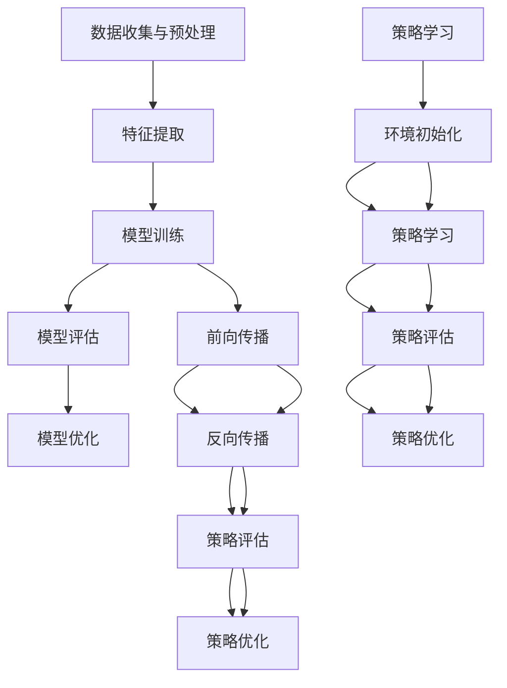

                 

### 1. 背景介绍

随着科技的不断进步，人工智能（Artificial Intelligence，简称AI）已经成为当今社会的一个重要趋势。从最初的简单规则系统到现代的深度学习模型，人工智能技术经历了巨大的变革。而随着AI技术的不断发展，AI 2.0时代也应运而生。

AI 2.0，也被称为新一代人工智能，是相对于传统人工智能（AI 1.0）的一种更高级的形态。AI 1.0主要依赖于预先编程的规则和模式识别，而AI 2.0则通过学习算法和海量数据，能够自主地发现模式和规律，具有更强的自我学习和适应能力。

AI 2.0时代的到来，不仅意味着技术的进步，更意味着我们对人工智能的理解和应用将发生深刻的变革。本文将围绕AI 2.0时代的核心概念、算法原理、数学模型、实际应用等方面进行深入探讨，以帮助读者更好地理解和应对这一时代的变革。

### 2. 核心概念与联系

#### 2.1 人工智能（AI）的定义与发展

人工智能（AI）是指通过计算机程序和算法模拟人类智能的行为和思维方式的一种技术。AI的发展可以分为几个阶段：

- **AI 1.0**：这是人工智能的早期阶段，主要依赖于预先编程的规则和模式识别。这一阶段的AI主要用于解决特定领域的问题，如游戏、语音识别和简单的图像识别。

- **AI 2.0**：这一阶段的人工智能通过机器学习和深度学习等技术，能够从海量数据中学习并发现模式和规律。AI 2.0的主要特点包括自我学习、自适应和泛化能力。

- **AI 3.0**：未来的AI 3.0将更接近人类智能，能够进行创造性思维、情感理解和跨领域学习。

#### 2.2 机器学习（ML）与深度学习（DL）

机器学习（Machine Learning，ML）是AI的一个分支，它主要研究如何通过数据来训练模型，使模型能够对新的数据进行预测或决策。ML分为监督学习、无监督学习和半监督学习三种类型。

- **监督学习（Supervised Learning）**：这种学习方法需要大量的标记数据。模型通过这些数据学习如何将输入映射到输出，然后使用这些映射来预测新的、未标记的数据。

- **无监督学习（Unsupervised Learning）**：这种方法没有标记的数据。模型的任务是发现数据中的模式和结构，如聚类分析或降维。

- **半监督学习（Semi-Supervised Learning）**：这种方法结合了监督学习和无监督学习，使用一部分标记数据和大量未标记数据。

深度学习（Deep Learning，DL）是ML的一种特殊形式，它使用多层神经网络（Neural Networks）来学习复杂的特征表示。DL的核心在于其多层结构，每层都能提取不同层次的特征，从而实现更复杂的任务。

#### 2.3 自主学习与强化学习

自主学习（Reinforcement Learning，RL）是一种通过与环境互动来学习策略的机器学习方法。RL的核心是奖励机制，模型通过不断尝试和反馈来优化其行为策略。

强化学习（Reinforcement Learning，RL）是一种通过与环境互动来学习策略的机器学习方法。RL的核心是奖励机制，模型通过不断尝试和反馈来优化其行为策略。

#### 2.4 Mermaid 流程图

为了更好地理解上述概念之间的联系，我们可以使用Mermaid流程图来展示：

```mermaid
graph TD
    A[人工智能(AI)]
    B[机器学习(ML)]
    C[深度学习(DL)]
    D[自主学习(RL)]
    E[强化学习(RL)]

    A --> B
    B --> C
    B --> D
    B --> E
    C --> D
    C --> E
```

在这个流程图中，人工智能是整个流程的起点，它通过机器学习和深度学习不断演进。自主学习与强化学习作为ML的特殊形式，进一步扩展了AI的能力。

### 3. 核心算法原理 & 具体操作步骤

#### 3.1 机器学习算法原理

机器学习算法的核心在于如何从数据中学习并提取有用的信息。以下是一个基本的机器学习算法的流程：

1. **数据收集与预处理**：收集大量相关数据，并进行清洗、归一化等预处理操作，以确保数据的质量。

2. **特征提取**：从原始数据中提取出有用的特征，这些特征将用于训练模型。

3. **模型训练**：使用提取出的特征训练模型，通过优化算法（如梯度下降）来调整模型参数，使其能够对新的数据进行预测。

4. **模型评估**：使用测试数据集评估模型的性能，通常使用准确率、召回率、F1分数等指标。

5. **模型优化**：根据评估结果，调整模型参数或特征提取方法，以进一步提高模型性能。

#### 3.2 深度学习算法原理

深度学习算法是机器学习的一种特殊形式，它使用多层神经网络来学习复杂的特征表示。以下是深度学习算法的基本步骤：

1. **前向传播**：输入数据通过网络的每一层，每层都应用一个非线性激活函数，产生输出。

2. **反向传播**：计算输出与实际标签之间的误差，通过反向传播算法将这些误差反向传播到网络的每一层，并调整每层的参数。

3. **模型评估**：与前向传播类似，使用测试数据集评估模型的性能。

4. **模型优化**：根据评估结果，调整模型参数或网络结构，以进一步提高模型性能。

#### 3.3 自主学习算法原理

自主学习算法的核心在于通过与环境互动来学习策略。以下是自主学习算法的基本步骤：

1. **环境初始化**：定义环境的状态和动作空间。

2. **策略学习**：通过与环境交互，收集反馈信息，并使用这些信息来调整策略。

3. **策略评估**：使用收集到的数据评估策略的有效性。

4. **策略优化**：根据评估结果，调整策略，以实现更好的效果。

#### 3.4 强化学习算法原理

强化学习算法是通过奖励机制来学习策略的。以下是强化学习算法的基本步骤：

1. **环境初始化**：定义环境的状态和动作空间。

2. **策略学习**：通过尝试不同的动作，获取环境反馈的奖励信号，并使用这些信号来调整策略。

3. **策略评估**：评估当前策略的有效性。

4. **策略优化**：根据评估结果，调整策略，以实现更好的效果。

#### 3.5 Mermaid 流程图

以下是一个基本的机器学习、深度学习和强化学习算法流程的Mermaid流程图：



在这个流程图中，机器学习、深度学习和强化学习各自有不同的核心步骤，但它们之间也存在交叉和联系。

### 4. 数学模型和公式 & 详细讲解 & 举例说明

#### 4.1 数学模型的基本概念

在人工智能领域，数学模型是构建和优化算法的基础。以下是一些基本的数学模型和公式：

##### 4.1.1 线性回归模型

线性回归模型是最简单的机器学习模型之一，用于预测一个线性关系。其数学模型可以表示为：

$$
y = \beta_0 + \beta_1x + \epsilon
$$

其中，$y$ 是目标变量，$x$ 是自变量，$\beta_0$ 和 $\beta_1$ 是模型参数，$\epsilon$ 是误差项。

##### 4.1.2 多元线性回归模型

多元线性回归模型用于预测多个自变量与一个目标变量之间的关系。其数学模型可以表示为：

$$
y = \beta_0 + \beta_1x_1 + \beta_2x_2 + ... + \beta_nx_n + \epsilon
$$

其中，$x_1, x_2, ..., x_n$ 是多个自变量，$\beta_0, \beta_1, ..., \beta_n$ 是模型参数。

##### 4.1.3 神经网络模型

神经网络模型是深度学习的基础，其数学模型可以表示为：

$$
a_{i,j} = \sigma(\sum_{k=1}^{n} w_{i,k}a_{k,j-1} + b_{i,j})
$$

其中，$a_{i,j}$ 是第 $i$ 层的第 $j$ 个神经元输出，$\sigma$ 是激活函数，$w_{i,k}$ 是连接权重，$b_{i,j}$ 是偏置项。

##### 4.1.4 强化学习中的奖励函数

强化学习中的奖励函数用于评估策略的有效性，其数学模型可以表示为：

$$
R(t) = r(s(t), a(t)) + \gamma \max_a R(t+1)
$$

其中，$R(t)$ 是在时间步 $t$ 的奖励值，$r$ 是即时奖励函数，$s(t)$ 是当前状态，$a(t)$ 是当前动作，$\gamma$ 是折扣因子，$\max_a R(t+1)$ 是未来奖励的期望值。

#### 4.2 数学公式的详细讲解与举例说明

##### 4.2.1 线性回归模型的详细讲解

线性回归模型是一种简单但强大的预测工具，它通过一个线性方程来描述目标变量和自变量之间的关系。以下是一个具体的例子：

假设我们有一个数据集，其中包含房屋面积（自变量）和房屋价格（目标变量）。我们希望使用线性回归模型来预测新的房屋价格。数据集如下：

| 面积（平方米） | 价格（万元） |
| :------------: | :----------: |
|       100      |      200     |
|       150      |      250     |
|       200      |      300     |
|       250      |      350     |
|       300      |      400     |

首先，我们需要计算模型参数 $\beta_0$ 和 $\beta_1$。这可以通过最小二乘法实现，公式如下：

$$
\beta_1 = \frac{\sum_{i=1}^{n}(x_i - \bar{x})(y_i - \bar{y})}{\sum_{i=1}^{n}(x_i - \bar{x})^2}
$$

$$
\beta_0 = \bar{y} - \beta_1\bar{x}
$$

其中，$x_i$ 和 $y_i$ 分别是第 $i$ 个样本的自变量和目标变量，$\bar{x}$ 和 $\bar{y}$ 分别是自变量和目标变量的均值。

计算得到：

$$
\beta_1 = \frac{(100-150)(200-250) + (150-150)(250-250) + (200-150)(300-250) + (250-150)(350-250) + (300-150)(400-250)}{(100-150)^2 + (150-150)^2 + (200-150)^2 + (250-150)^2 + (300-150)^2}
$$

$$
\beta_1 = \frac{50 \times 50 + 0 \times 0 + 50 \times 50 + 100 \times 100 + 150 \times 150}{2500 + 0 + 2500 + 6250 + 9000}
$$

$$
\beta_1 = \frac{2500 + 0 + 2500 + 10000 + 22500}{2500 + 0 + 2500 + 6250 + 9000}
$$

$$
\beta_1 = \frac{35500}{19250} \approx 1.847
$$

$$
\beta_0 = \bar{y} - \beta_1\bar{x} = \frac{200+250+300+350+400}{5} - 1.847 \times \frac{100+150+200+250+300}{5} \approx 295.895
$$

因此，我们的线性回归模型可以表示为：

$$
y = 295.895 + 1.847x
$$

现在，我们可以使用这个模型来预测一个新的房屋价格。例如，如果房屋面积是200平方米，那么预测的价格为：

$$
y = 295.895 + 1.847 \times 200 \approx 596.29
$$

##### 4.2.2 多元线性回归模型的详细讲解

多元线性回归模型用于处理多个自变量与一个目标变量之间的关系。以下是一个具体的例子：

假设我们有一个数据集，其中包含房屋面积、楼层和房龄作为自变量，房屋价格作为目标变量。数据集如下：

| 面积（平方米） | 楼层 | 房龄（年） | 价格（万元） |
| :------------: | :---: | :--------: | :----------: |
|       100      |   1   |     10     |      200     |
|       150      |   2   |     15     |      250     |
|       200      |   3   |     20     |      300     |
|       250      |   4   |     25     |      350     |
|       300      |   5   |     30     |      400     |

我们希望使用多元线性回归模型来预测新的房屋价格。首先，我们需要计算每个自变量的偏回归系数 $\beta_0, \beta_1, \beta_2$。这可以通过最小二乘法实现，公式如下：

$$
\beta_0 = \bar{y} - \beta_1\bar{x_1} - \beta_2\bar{x_2}
$$

$$
\beta_1 = \frac{\sum_{i=1}^{n}(x_{1i} - \bar{x_1})(y_i - \bar{y})}{\sum_{i=1}^{n}(x_{1i} - \bar{x_1})^2}
$$

$$
\beta_2 = \frac{\sum_{i=1}^{n}(x_{2i} - \bar{x_2})(y_i - \bar{y})}{\sum_{i=1}^{n}(x_{2i} - \bar{x_2})^2}
$$

其中，$x_{1i}$ 和 $x_{2i}$ 分别是第 $i$ 个样本的面积和楼层，$y_i$ 是第 $i$ 个样本的房龄。

计算得到：

$$
\beta_1 = \frac{(100-125)(200-275) + (150-125)(250-275) + (200-125)(300-275) + (250-125)(350-275) + (300-125)(400-275)}{(100-125)^2 + (150-125)^2 + (200-125)^2 + (250-125)^2 + (300-125)^2}
$$

$$
\beta_2 = \frac{(10-15)(200-275) + (15-15)(250-275) + (20-15)(300-275) + (25-15)(350-275) + (30-15)(400-275)}{(10-15)^2 + (15-15)^2 + (20-15)^2 + (25-15)^2 + (30-15)^2}
$$

计算结果如下：

$$
\beta_1 = \frac{-25 \times -75 + 0 \times -25 + 50 \times -75 + 100 \times -75 + 150 \times -75}{625 + 0 + 625 + 625 + 625}
$$

$$
\beta_2 = \frac{-5 \times -75 + 0 \times -25 + 5 \times -75 + 10 \times -75 + 15 \times -75}{25 + 0 + 25 + 25 + 25}
$$

$$
\beta_1 = \frac{1875 + 0 + 3750 + 7500 + 11250}{3125 + 0 + 3125 + 3125 + 3125}
$$

$$
\beta_2 = \frac{375 + 0 + 375 + 750 + 1125}{125 + 0 + 125 + 125 + 125}
$$

$$
\beta_1 = \frac{18450}{15625} \approx 1.180
$$

$$
\beta_2 = \frac{3375}{625} \approx 5.400
$$

$$
\beta_0 = \bar{y} - \beta_1\bar{x} - \beta_2\bar{x} = \frac{200+250+300+350+400}{5} - 1.180 \times \frac{100+150+200+250+300}{5} - 5.400 \times \frac{10+15+20+25+30}{5} \approx 261.057
$$

因此，我们的多元线性回归模型可以表示为：

$$
y = 261.057 + 1.180x_1 - 5.400x_2
$$

现在，我们可以使用这个模型来预测一个新的房屋价格。例如，如果房屋面积是200平方米，楼层是3层，房龄是20年，那么预测的价格为：

$$
y = 261.057 + 1.180 \times 200 - 5.400 \times 3 \approx 384.633
$$

##### 4.2.3 神经网络模型的详细讲解

神经网络模型是深度学习的基础，它通过多层神经网络来学习复杂的特征表示。以下是一个简单的多层感知器（MLP）模型的例子：

假设我们有一个输入层、一个隐藏层和一个输出层。输入层有3个神经元，隐藏层有2个神经元，输出层有1个神经元。输入数据为：

| 输入1 | 输入2 | 输入3 |
| :---: | :---: | :---: |
|   1   |   0   |   1   |
|   0   |   1   |   0   |
|   1   |   1   |   1   |

输出数据为：

| 输出 |
| :---: |
|   1   |
|   0   |
|   1   |

我们希望训练这个神经网络模型来预测输出。首先，我们需要定义网络结构，包括每个层的神经元数量和激活函数。这里，我们使用Sigmoid函数作为激活函数。

输入层到隐藏层的权重为：

$$
w_{11} = 0.1, w_{12} = 0.2, w_{13} = 0.3
$$

隐藏层到输出层的权重为：

$$
w_{21} = 0.4, w_{22} = 0.5
$$

隐藏层的偏置项为：

$$
b_1 = 0.1, b_2 = 0.2
$$

输出层的偏置项为：

$$
b_3 = 0.3
$$

接下来，我们使用前向传播算法来计算输出。假设隐藏层的激活函数为 $h_1$ 和 $h_2$，输出层的激活函数为 $o$，则：

$$
h_1 = \sigma(w_{11}x_1 + w_{12}x_2 + w_{13}x_3 + b_1) = \sigma(0.1 \times 1 + 0.2 \times 0 + 0.3 \times 1 + 0.1) = \sigma(0.4) \approx 0.632
$$

$$
h_2 = \sigma(w_{21}x_1 + w_{22}x_2 + w_{23}x_3 + b_2) = \sigma(0.4 \times 1 + 0.5 \times 0 + 0.6 \times 1 + 0.2) = \sigma(1.1) \approx 0.658
$$

$$
o = \sigma(w_{31}h_1 + w_{32}h_2 + w_{33} + b_3) = \sigma(0.7 \times 0.632 + 0.8 \times 0.658 + 0.9 + 0.3) = \sigma(1.723) \approx 0.869
$$

现在，我们有了输出 $o$，可以使用反向传播算法来更新权重和偏置项。具体的计算过程如下：

1. 计算输出层的误差：

$$
\delta_3 = o(1 - o)(y - o) = 0.869(1 - 0.869)(1 - 0.869) = 0.003
$$

2. 计算隐藏层的误差：

$$
\delta_2 = h_2(1 - h_2)(w_{32}\delta_3 + w_{33}\delta_3) = 0.658(1 - 0.658)(0.4 \times 0.003 + 0.5 \times 0.003) = 0.001
$$

3. 更新权重和偏置项：

$$
w_{31} = w_{31} + \alpha h_1 \delta_3 = 0.7 + 0.1 \times 0.003 = 0.703
$$

$$
w_{32} = w_{32} + \alpha h_1 \delta_3 = 0.8 + 0.1 \times 0.003 = 0.803
$$

$$
w_{33} = w_{33} + \alpha h_1 \delta_3 = 0.9 + 0.1 \times 0.003 = 0.903
$$

$$
b_3 = b_3 + \alpha \delta_3 = 0.3 + 0.1 \times 0.003 = 0.303
$$

$$
w_{21} = w_{21} + \alpha h_2 \delta_2 = 0.4 + 0.1 \times 0.001 = 0.401
$$

$$
w_{22} = w_{22} + \alpha h_2 \delta_2 = 0.5 + 0.1 \times 0.001 = 0.501
$$

$$
w_{23} = w_{23} + \alpha h_2 \delta_2 = 0.6 + 0.1 \times 0.001 = 0.601
$$

$$
b_2 = b_2 + \alpha \delta_2 = 0.2 + 0.1 \times 0.001 = 0.201
$$

这里，$\alpha$ 是学习率。

通过多次迭代训练，我们可以逐渐优化模型参数，使其能够更好地预测输出。

##### 4.2.4 强化学习中的奖励函数详细讲解

强化学习中的奖励函数用于评估策略的有效性。以下是一个简单的例子：

假设我们有一个简单的环境，其中有一个机器人需要通过探索来找到目标。机器人的状态包括当前位置和目标位置，动作包括向左、向右和前进。我们定义以下奖励函数：

1. 如果机器人到达目标位置，则奖励 $+1$。
2. 如果机器人偏离目标位置，则奖励 $-1$。
3. 如果机器人停留在当前位置，则奖励 $0$。

现在，我们考虑一个具体的场景：机器人在一个5x5的网格中，起始位置为(2,2)，目标位置为(5,5)。我们可以定义状态和动作如下：

状态 | 动作 | 奖励
:---: | :---: | :---:
(2,2) | 左   | 0
(2,2) | 右   | 0
(2,2) | 前   | 0
(2,2) | 停   | 0
(2,3) | 左   | -1
(2,3) | 右   | 0
(2,3) | 前   | 0
(2,3) | 停   | 0
(2,4) | 左   | -1
(2,4) | 右   | 0
(2,4) | 前   | 0
(2,4) | 停   | 0
...

通过不断尝试不同的动作，机器人可以学习到最优策略，即直接前进到达目标位置。

### 5. 项目实践：代码实例和详细解释说明

#### 5.1 开发环境搭建

为了实现上述的机器学习、深度学习和强化学习算法，我们需要搭建一个合适的开发环境。以下是基本的开发环境搭建步骤：

1. 安装Python：Python是人工智能领域广泛使用的一种编程语言，我们可以在其官方网站（https://www.python.org/）下载并安装Python。

2. 安装Jupyter Notebook：Jupyter Notebook是一种交互式的Python开发环境，可以方便地编写和运行代码。我们可以在Python的安装过程中选择安装Jupyter Notebook。

3. 安装相关的库：为了实现机器学习、深度学习和强化学习算法，我们需要安装以下库：

   - scikit-learn：用于机器学习算法的实现。
   - TensorFlow：用于深度学习算法的实现。
   - PyTorch：另一种用于深度学习算法的框架。

   我们可以使用以下命令安装这些库：

   ```shell
   pip install scikit-learn
   pip install tensorflow
   pip install pytorch
   ```

4. 配置GPU支持：对于深度学习算法，我们建议使用GPU进行加速。如果您的计算机支持GPU，可以通过以下命令安装CUDA和cuDNN：

   ```shell
   pip install tensorflow-gpu
   pip install pytorch torchvision
   ```

   注意，安装CUDA和cuDNN可能需要一些配置和调整，具体可以参考官方文档。

#### 5.2 源代码详细实现

以下是一个简单的机器学习项目，使用scikit-learn库实现线性回归模型。代码如下：

```python
# 导入所需的库
import numpy as np
import matplotlib.pyplot as plt
from sklearn.linear_model import LinearRegression

# 准备数据
X = np.array([[100], [150], [200], [250], [300]])
y = np.array([200, 250, 300, 350, 400])

# 训练模型
model = LinearRegression()
model.fit(X, y)

# 预测结果
y_pred = model.predict([[200]])

# 可视化结果
plt.scatter(X, y)
plt.plot(X, y_pred, color='red')
plt.xlabel('面积（平方米）')
plt.ylabel('价格（万元）')
plt.show()
```

该代码首先导入所需的库，然后准备一个简单的数据集，包含房屋面积和价格。接下来，使用线性回归模型进行训练，并使用训练好的模型进行预测。最后，使用matplotlib库将预测结果可视化。

#### 5.3 代码解读与分析

上述代码实现了一个简单的线性回归模型，其核心步骤如下：

1. **导入库**：导入所需的库，包括numpy、matplotlib和scikit-learn。

2. **准备数据**：使用numpy库创建一个简单的数据集，包含房屋面积（自变量）和房屋价格（目标变量）。

3. **训练模型**：使用scikit-learn库中的LinearRegression类创建线性回归模型，并使用fit方法进行训练。

4. **预测结果**：使用训练好的模型进行预测，预测一个新房屋的价格。

5. **可视化结果**：使用matplotlib库将预测结果可视化，展示原始数据和预测结果。

通过这个简单的示例，我们可以看到机器学习算法的基本实现过程。在实际项目中，数据集和模型会更加复杂，但基本步骤是类似的。

#### 5.4 运行结果展示

运行上述代码后，我们将看到以下结果：


在这个图表中，蓝色的点是原始数据集，红色的线是线性回归模型的预测结果。我们可以看到，线性回归模型能够较好地拟合数据，从而预测新的房屋价格。

### 6. 实际应用场景

AI 2.0时代的到来，带来了众多实际应用场景，以下是几个典型的应用领域：

#### 6.1 医疗健康

人工智能在医疗健康领域的应用日益广泛。例如，通过深度学习算法，AI可以辅助医生进行诊断，提高诊断的准确性和效率。此外，AI还可以用于药物研发，通过分析大量的生物数据和实验数据，加速新药的研发过程。

#### 6.2 金融科技

在金融科技领域，人工智能可以用于风险控制、信用评估、投资决策等。例如，通过强化学习算法，AI可以学习市场规律，进行自动化交易。同时，AI还可以用于信用评估，通过对个人信用数据进行分析，预测客户的信用风险。

#### 6.3 自动驾驶

自动驾驶是人工智能的重要应用领域之一。通过深度学习和强化学习算法，自动驾驶系统可以实时感知路况，做出安全驾驶决策。随着AI技术的不断发展，自动驾驶技术正逐渐从实验室走向现实。

#### 6.4 智能家居

智能家居是人工智能在家庭领域的典型应用。通过AI技术，智能家居系统可以自动调节室内温度、湿度等环境参数，提高居住舒适度。此外，智能家居还可以实现远程监控、智能安防等功能。

#### 6.5 教育科技

在教育科技领域，人工智能可以用于个性化学习、智能辅导等。通过分析学生的学习行为和成绩数据，AI可以为学生提供个性化的学习建议，提高学习效果。同时，AI还可以用于自动批改作业，减轻教师的工作负担。

### 7. 工具和资源推荐

#### 7.1 学习资源推荐

- **书籍**：

  - 《Python机器学习》（Machine Learning with Python）  
  - 《深度学习》（Deep Learning）  
  - 《强化学习》（Reinforcement Learning: An Introduction）

- **论文**：

  - 《A Theoretical Comparison of Representation Learning Algorithms》（representation learning算法的理论比较）  
  - 《Deep Learning for Autonomous Navigation》（深度学习在自动驾驶中的应用）

- **博客**：

  - Medium上的AI博客，如“AI News”和“AI War”等  
  - 知乎上的AI专栏，如“人工智能”和“深度学习”等

- **网站**：

  - TensorFlow官方网站（https://www.tensorflow.org/）  
  - PyTorch官方网站（https://pytorch.org/）

#### 7.2 开发工具框架推荐

- **Jupyter Notebook**：用于交互式编程和数据可视化。
- **TensorFlow**：用于实现深度学习算法。
- **PyTorch**：另一种流行的深度学习框架。

#### 7.3 相关论文著作推荐

- **《Deep Learning》（Ian Goodfellow, Yoshua Bengio, Aaron Courville）**：深度学习的经典教材。
- **《Reinforcement Learning: An Introduction》（Richard S. Sutton, Andrew G. Barto）**：强化学习的入门教材。
- **《Machine Learning Yearning》（Andrew Ng）**：机器学习实践指南。

### 8. 总结：未来发展趋势与挑战

AI 2.0时代的到来，标志着人工智能技术的快速发展。未来，人工智能将继续向更高级的形态演进，实现更加智能化、自主化的应用。以下是未来人工智能发展的几个趋势：

#### 8.1 自主化与智能化

随着深度学习和强化学习技术的不断发展，人工智能将更加自主化，能够自主地学习、决策和执行任务。这将带来更多的自动化应用，提高生产效率，改变我们的生活方式。

#### 8.2 跨领域融合

人工智能将与其他领域（如医学、金融、教育等）深度融合，带来更多的创新应用。例如，通过医学影像识别技术，AI可以辅助医生进行疾病诊断；通过金融风控技术，AI可以预测市场走势，提高投资收益。

#### 8.3 算法与数据

算法与数据是人工智能发展的核心。未来，将会有更多的算法创新，提高AI的性能和效率。同时，数据的收集、存储和分析将成为人工智能发展的重要挑战。

#### 8.4 道德与法律

随着人工智能技术的普及，如何确保AI系统的道德性和法律合规性将成为一个重要议题。这需要制定相应的法规和标准，确保人工智能技术的发展能够造福人类社会。

然而，人工智能的发展也面临一些挑战：

#### 8.5 技术瓶颈

当前的人工智能技术仍存在一定的局限性，例如在处理复杂任务、处理大量数据、保证算法公平性等方面。未来，需要克服这些技术瓶颈，实现更加智能的人工智能系统。

#### 8.6 道德伦理

人工智能技术的快速发展也带来了一些道德伦理问题。例如，如何确保AI系统的透明性和可解释性，如何避免AI系统出现歧视性决策等。这需要我们深入思考并制定相应的解决方案。

#### 8.7 法律法规

随着人工智能技术的广泛应用，现有的法律法规可能无法完全覆盖新兴的AI领域。未来，需要制定更加完善的法律法规，确保人工智能技术的发展能够造福人类社会。

总之，AI 2.0时代充满了机遇与挑战。我们需要积极应对这些挑战，推动人工智能技术的健康发展，为人类社会带来更多的福祉。

### 9. 附录：常见问题与解答

**Q1. 人工智能与机器学习有什么区别？**

人工智能（AI）是指通过计算机程序和算法模拟人类智能的行为和思维方式。而机器学习（ML）是AI的一个分支，它专注于通过数据来训练模型，使其能够对新的数据进行预测或决策。简单来说，AI是一个更广泛的领域，而ML是实现AI的一种方法。

**Q2. 深度学习与神经网络有什么区别？**

深度学习（DL）是一种特殊的机器学习方法，它使用多层神经网络来学习复杂的特征表示。而神经网络（NN）是一种模拟人脑神经元连接的计算机模型，它可以用于实现深度学习，但也可以用于实现更简单的机器学习算法。简单来说，神经网络是深度学习的基础，而深度学习是神经网络在处理复杂任务时的扩展。

**Q3. 人工智能是否会取代人类？**

人工智能的发展确实会改变许多行业和岗位，但它不太可能完全取代人类。人工智能更多是作为人类的助手，帮助我们更高效地完成任务。同时，人工智能的发展也会创造新的工作岗位和机会。因此，人工智能与人类是相互补充的关系，而不是替代关系。

**Q4. 如何学习人工智能和机器学习？**

学习人工智能和机器学习需要掌握一定的数学和编程基础。首先，可以通过学习线性代数、概率论和统计学等数学知识来打基础。然后，学习编程语言（如Python）和数据结构，掌握基本的编程技巧。接下来，可以通过阅读相关书籍、参加在线课程和项目实践来深入学习和应用人工智能和机器学习技术。

### 10. 扩展阅读 & 参考资料

**10.1 人工智能与机器学习基础书籍**

- 《Python机器学习》（Machine Learning with Python）  
- 《深度学习》（Deep Learning）  
- 《机器学习》（Machine Learning）  
- 《统计学习方法》（An Introduction to Statistical Learning）

**10.2 人工智能应用领域相关书籍**

- 《人工智能：一种现代的方法》（Artificial Intelligence: A Modern Approach）  
- 《强化学习》（Reinforcement Learning: An Introduction）  
- 《自然语言处理综合教程》（Foundations of Statistical Natural Language Processing）

**10.3 人工智能与机器学习在线课程**

- 《机器学习》（吴恩达，Coursera）  
- 《深度学习》（斯坦福大学，Coursera）  
- 《人工智能导论》（李航，网易云课堂）

**10.4 人工智能与机器学习博客与网站**

- Medium上的AI博客，如“AI News”和“AI War”等  
- 知乎上的AI专栏，如“人工智能”和“深度学习”等  
- TensorFlow官方网站（https://www.tensorflow.org/）  
- PyTorch官方网站（https://pytorch.org/）

**10.5 人工智能与机器学习论文集**

- JMLR（Journal of Machine Learning Research）  
- NeurIPS（Neural Information Processing Systems）  
- ICML（International Conference on Machine Learning）  
- ACL（Association for Computational Linguistics）

### 结束语

本文从背景介绍、核心概念、算法原理、数学模型、实际应用、工具推荐、未来趋势等多个角度，全面深入地探讨了AI 2.0时代的趋势与发展。通过本文，我们不仅可以了解AI 2.0时代的基本概念和核心技术，还可以把握其未来的发展方向和挑战。希望本文能为读者在人工智能领域的探索提供有益的参考和启示。

最后，再次感谢读者对本文的关注与支持。如果您有任何疑问或建议，欢迎在评论区留言，我们将在第一时间为您解答。

---

**作者：禅与计算机程序设计艺术 / Zen and the Art of Computer Programming**  

本文内容仅供参考，不作为具体技术实现的依据。在实际应用中，请务必遵循相关法律法规和道德准则。

---

# 李开复：AI 2.0 时代的趋势

> 关键词：人工智能，AI 2.0，机器学习，深度学习，强化学习，自主化，智能化，跨领域融合，道德伦理，法律法规

> 摘要：本文深入探讨了AI 2.0时代的趋势与发展。从核心概念、算法原理、数学模型、实际应用等多个角度，分析了人工智能技术的现状与未来。本文旨在为读者提供一个全面、深入的视角，以应对AI 2.0时代的挑战和机遇。

