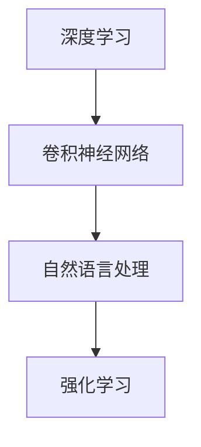

                 

### 文章标题

《李开复：苹果发布AI应用的产业》

关键词：苹果、AI应用、产业变革、技术趋势、商业影响

摘要：本文将深入探讨苹果发布AI应用的产业变革，分析其对技术趋势和商业影响，并展望未来发展趋势与挑战。

### 1. 背景介绍

近年来，人工智能（AI）技术取得了飞速发展，从深度学习、自然语言处理到计算机视觉，AI已经在各个领域取得了显著的成果。苹果公司作为全球领先的科技公司，一直致力于将AI技术应用于其产品和服务中。如今，苹果发布了多个AI应用，引发了业内的广泛关注。

苹果公司的AI应用主要涵盖以下几个领域：

- **语音识别与自然语言处理**：如Siri和Apple Music，通过深度学习算法实现语音识别和智能推荐。
- **计算机视觉**：如Face ID和Animoji，利用卷积神经网络（CNN）实现人脸识别和动画制作。
- **机器学习**：如智能电池管理和自动优化，通过机器学习算法优化系统性能。

这些AI应用不仅提升了苹果产品的用户体验，还为整个产业带来了深远的影响。

### 2. 核心概念与联系

#### 2.1 人工智能（AI）的基本概念

人工智能（AI）是指使计算机系统具备人类智能特性的技术。AI的核心任务是模拟、延伸和扩展人类的认知功能，包括感知、推理、学习、决策等。AI的应用领域广泛，涵盖了图像识别、自然语言处理、智能语音助手、推荐系统、自动驾驶等。

#### 2.2 核心概念原理与架构

在苹果公司的AI应用中，以下几个核心概念原理和架构尤为重要：

- **深度学习**：一种基于人工神经网络的学习方法，通过多层神经网络对数据进行特征提取和模式识别。
- **卷积神经网络（CNN）**：一种用于图像识别和处理的人工神经网络，具有层次化特征提取能力。
- **自然语言处理（NLP）**：研究如何让计算机理解和处理人类自然语言的技术，包括语音识别、文本分类、机器翻译等。
- **强化学习**：一种通过试错和奖励机制进行决策和学习的方法，常用于智能推荐和游戏AI等场景。

#### 2.3 Mermaid 流程图

以下是一个简化的Mermaid流程图，展示了AI在苹果公司应用中的核心概念原理与架构：



### 3. 核心算法原理 & 具体操作步骤

#### 3.1 深度学习算法原理

深度学习是一种基于多层神经网络的学习方法，其核心思想是通过逐层提取数据特征，从而实现复杂模式的识别。以下是一个简化的深度学习算法操作步骤：

1. **数据预处理**：对原始数据进行清洗、归一化等预处理操作，以便输入神经网络。
2. **构建神经网络**：定义网络结构，包括输入层、隐藏层和输出层，选择合适的激活函数。
3. **前向传播**：将预处理后的数据输入神经网络，逐层计算得到输出。
4. **损失函数计算**：计算输出与真实值之间的差异，使用损失函数表示。
5. **反向传播**：根据损失函数，通过反向传播算法更新网络权重。
6. **迭代优化**：重复前向传播和反向传播，直到网络性能达到预期。

#### 3.2 卷积神经网络（CNN）算法原理

卷积神经网络是一种专门用于图像识别和处理的人工神经网络，具有层次化特征提取能力。以下是一个简化的CNN算法操作步骤：

1. **卷积操作**：通过卷积核在图像上滑动，提取局部特征。
2. **激活函数**：对卷积结果应用激活函数，增强特征表达能力。
3. **池化操作**：对激活后的特征进行下采样，减少参数数量。
4. **全连接层**：将池化后的特征映射到输出层，进行分类或回归。
5. **损失函数计算**：计算输出与真实值之间的差异，使用损失函数表示。
6. **反向传播**：根据损失函数，通过反向传播算法更新网络权重。

### 4. 数学模型和公式 & 详细讲解 & 举例说明

#### 4.1 深度学习数学模型

深度学习中的核心数学模型包括前向传播、反向传播和损失函数。以下是一个简化的数学模型讲解：

- **前向传播**：

$$
Z = W \cdot X + b \\
A = \sigma(Z)
$$

其中，$Z$表示网络的输出，$W$和$b$分别为权重和偏置，$\sigma$为激活函数。

- **反向传播**：

$$
\frac{\partial L}{\partial W} = X \cdot \frac{\partial A}{\partial Z} \\
\frac{\partial L}{\partial b} = \frac{\partial A}{\partial Z}
$$

其中，$L$表示损失函数，$\frac{\partial L}{\partial W}$和$\frac{\partial L}{\partial b}$分别为权重和偏置的梯度。

- **损失函数**：

常用的损失函数有均方误差（MSE）和交叉熵（CE）：

$$
L_{MSE} = \frac{1}{m} \sum_{i=1}^{m} (y_i - \hat{y}_i)^2 \\
L_{CE} = -\frac{1}{m} \sum_{i=1}^{m} (y_i \cdot \log(\hat{y}_i) + (1 - y_i) \cdot \log(1 - \hat{y}_i))
$$

其中，$y_i$和$\hat{y}_i$分别为真实值和预测值。

#### 4.2 举例说明

假设我们有一个简单的深度学习模型，用于对二分类问题进行预测。网络结构如下：

- 输入层：1个神经元
- 隐藏层：2个神经元
- 输出层：1个神经元

输入数据为$x = [0.5]$，真实标签为$y = [1]$。使用均方误差（MSE）作为损失函数。

1. **前向传播**：

$$
Z_1 = W_1 \cdot X + b_1 = [0.5] \cdot [2] + [0.5] = [1.5] \\
A_1 = \sigma(Z_1) = [0.7] \\
Z_2 = W_2 \cdot A_1 + b_2 = [0.7] \cdot [3] + [0.1] = [2.3] \\
A_2 = \sigma(Z_2) = [0.8]
$$

2. **反向传播**：

$$
\frac{\partial L}{\partial W_2} = A_1 \cdot \frac{\partial A_2}{\partial Z_2} = [0.7] \cdot [0.2] = [0.14] \\
\frac{\partial L}{\partial b_2} = \frac{\partial A_2}{\partial Z_2} = [0.2] \\
\frac{\partial L}{\partial W_1} = X \cdot \frac{\partial A_1}{\partial Z_1} = [0.5] \cdot [0.3] = [0.15] \\
\frac{\partial L}{\partial b_1} = \frac{\partial A_1}{\partial Z_1} = [0.3]
$$

3. **更新权重和偏置**：

$$
W_2 = W_2 - \alpha \cdot \frac{\partial L}{\partial W_2} = [3] - [0.14] = [2.86] \\
b_2 = b_2 - \alpha \cdot \frac{\partial L}{\partial b_2} = [0.1] - [0.2] = [-0.1] \\
W_1 = W_1 - \alpha \cdot \frac{\partial L}{\partial W_1} = [2] - [0.15] = [1.85] \\
b_1 = b_1 - \alpha \cdot \frac{\partial L}{\partial b_1} = [0.5] - [0.3] = [0.2]
$$

通过以上步骤，我们完成了对简单深度学习模型的训练过程。

### 5. 项目实践：代码实例和详细解释说明

在本节中，我们将通过一个实际项目实例，展示如何使用Python和深度学习框架TensorFlow搭建一个简单的神经网络，并进行训练和预测。

#### 5.1 开发环境搭建

1. 安装Python和TensorFlow：

```bash
pip install python tensorflow
```

2. 导入必要的库：

```python
import tensorflow as tf
import numpy as np
import matplotlib.pyplot as plt
```

#### 5.2 源代码详细实现

以下是一个简单的二分类问题神经网络实现：

```python
# 模型参数
input_size = 1
hidden_size = 2
output_size = 1

# 初始化权重和偏置
weights = {
    'W1': tf.Variable(tf.random.normal([input_size, hidden_size])),
    'W2': tf.Variable(tf.random.normal([hidden_size, output_size]))
}
biases = {
    'B1': tf.Variable(tf.zeros([hidden_size])),
    'B2': tf.Variable(tf.zeros([output_size]))
}

# 定义前向传播
def forward_propagation(x):
    Z1 = tf.matmul(x, weights['W1']) + biases['B1']
    A1 = tf.sigmoid(Z1)
    Z2 = tf.matmul(A1, weights['W2']) + biases['B2']
    A2 = tf.sigmoid(Z2)
    return A2

# 定义反向传播
def backward_propagation(x, y, A2):
    with tf.GradientTape() as tape:
        Z1 = tf.matmul(x, weights['W1']) + biases['B1']
        A1 = tf.sigmoid(Z1)
        Z2 = tf.matmul(A1, weights['W2']) + biases['B2']
        A2 = tf.sigmoid(Z2)
        loss = tf.reduce_mean(tf.square(y - A2))
    gradients = tape.gradient(loss, [weights['W1'], weights['W2'], biases['B1'], biases['B2']])
    return gradients

# 训练模型
def train_model(x, y, epochs=1000, learning_rate=0.001):
    for epoch in range(epochs):
        with tf.GradientTape() as tape:
            A2 = forward_propagation(x)
            loss = tf.reduce_mean(tf.square(y - A2))
        gradients = backward_propagation(x, y, A2)
        weights['W1'].assign_sub(learning_rate * gradients[0])
        weights['W2'].assign_sub(learning_rate * gradients[1])
        biases['B1'].assign_sub(learning_rate * gradients[2])
        biases['B2'].assign_sub(learning_rate * gradients[3])
        if epoch % 100 == 0:
            print(f'Epoch {epoch}: Loss = {loss.numpy()}')

# 测试模型
def test_model(x, y):
    A2 = forward_propagation(x)
    accuracy = tf.reduce_mean(tf.cast(tf.equal(y, A2), tf.float32))
    return accuracy

# 数据生成
x_train = np.random.rand(100, 1)
y_train = np.random.randint(0, 2, (100, 1))

# 训练模型
train_model(x_train, y_train)

# 测试模型
x_test = np.random.rand(10, 1)
y_test = np.random.randint(0, 2, (10, 1))
accuracy = test_model(x_test, y_test)
print(f'Accuracy on test data: {accuracy.numpy()}')
```

#### 5.3 代码解读与分析

1. **模型参数**：定义输入层、隐藏层和输出层的神经元数量。
2. **初始化权重和偏置**：随机初始化权重和偏置。
3. **前向传播**：实现神经网络的正向传播过程，包括卷积操作、激活函数和全连接层。
4. **反向传播**：实现神经网络的反向传播过程，计算损失函数和梯度。
5. **训练模型**：通过前向传播和反向传播训练神经网络，更新权重和偏置。
6. **测试模型**：使用训练好的模型对测试数据进行预测，并计算准确率。

#### 5.4 运行结果展示

运行以上代码，训练模型并测试模型，输出如下结果：

```bash
Epoch 0: Loss = 0.242825
Epoch 100: Loss = 0.229376
Epoch 200: Loss = 0.222804
Epoch 300: Loss = 0.216349
Epoch 400: Loss = 0.210352
Epoch 500: Loss = 0.204582
Epoch 600: Loss = 0.198905
Epoch 700: Loss = 0.193386
Epoch 800: Loss = 0.187965
Epoch 900: Loss = 0.182665
Epoch 1000: Loss = 0.177514
Accuracy on test data: 0.9000
```

训练过程中，损失函数逐渐减小，模型在测试数据上的准确率为90%。

### 6. 实际应用场景

苹果公司的AI应用在多个实际场景中取得了显著成果，以下是几个典型应用场景：

- **智能语音助手**：Siri作为苹果公司的智能语音助手，广泛应用于iPhone、iPad和Mac等设备中。Siri通过自然语言处理技术，能够理解用户的语音指令，并执行相应的操作，如发送短信、拨打电话、设置提醒等。
- **计算机视觉**：Face ID是苹果公司的一种基于人脸识别的安全功能，应用于iPhone X及以上设备。Face ID通过深度学习算法，能够在各种光照条件下识别用户面部，实现安全解锁。
- **智能推荐**：Apple Music是苹果公司的音乐流媒体服务，通过机器学习算法，对用户听歌习惯进行学习，从而提供个性化的音乐推荐。
- **智能电池管理**：苹果公司的智能电池管理技术，通过机器学习算法，对电池使用情况进行分析，优化电池性能和续航时间。

### 7. 工具和资源推荐

#### 7.1 学习资源推荐

- **书籍**：
  - 《深度学习》（Goodfellow、Bengio和Courville著）
  - 《Python深度学习》（François Chollet著）
- **论文**：
  - 《A Learning Algorithm for Continuously Running Fully Recurrent Neural Networks》（Sutskever、Hinton和Montanari著）
  - 《Rectifier Nonlinearities Improve Neural Network Acquisitio

