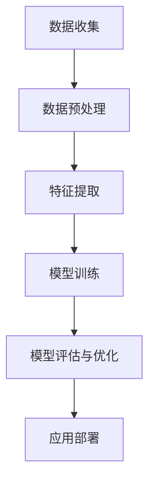

                 

### 文章标题

《李开复：苹果发布AI应用的价值》

> **关键词**：人工智能，苹果，AI应用，技术创新，用户价值，市场前景，科技趋势。

> **摘要**：本文从人工智能专家李开复的角度，深入探讨了苹果公司发布的AI应用所带来的技术变革、市场影响以及用户价值的提升。通过分析苹果AI应用的背景、核心原理、算法技术、应用场景，本文旨在为读者揭示这一技术发展的新里程碑，并展望其未来的发展趋势和挑战。

---

### 1. 背景介绍

近年来，人工智能技术迅猛发展，各类AI应用层出不穷。作为全球领先的科技公司，苹果公司一直积极布局人工智能领域，致力于将AI技术融入到其产品和服务中。此次苹果发布的AI应用，无疑标志着其在人工智能领域的一次重大突破。

李开复作为人工智能领域的专家，长期关注科技发展的动向。他的观点不仅具有前瞻性，也常常能洞察到技术变革背后的深层次含义。因此，本文将结合李开复的研究和观点，全面分析苹果发布AI应用的价值。

### 2. 核心概念与联系

在深入探讨苹果AI应用的价值之前，我们需要理解一些核心概念和其相互之间的联系。

#### 2.1 人工智能的定义与分类

人工智能（AI）是指通过计算机模拟人类智能的技术。根据其实现方式，人工智能可以分为两类：基于规则的推理系统和基于数据的学习系统。

- **基于规则的推理系统**：通过预先定义的规则来模拟人类智能。
- **基于数据的学习系统**：通过学习大量数据来发现模式和规律，从而实现智能行为。

#### 2.2 AI应用的基本原理

AI应用通常包括以下几个基本原理：

- **数据收集**：从各种来源收集数据，这些数据可以是结构化的，也可以是非结构化的。
- **数据预处理**：清洗和整理数据，使其适合用于机器学习模型。
- **特征提取**：从数据中提取有用的特征，用于训练模型。
- **模型训练**：使用机器学习算法训练模型，使其能够识别和预测。
- **模型评估与优化**：评估模型的性能，并进行优化以提升准确性。

#### 2.3 Mermaid 流程图

下面是一个简化的Mermaid流程图，描述了从数据收集到模型优化的基本流程：



#### 2.4 核心联系

苹果的AI应用通过以上核心概念和原理，实现了从数据收集、预处理到模型训练和优化的全过程。这一过程不仅体现了人工智能技术的基本原理，也展示了苹果在AI领域的技术实力和创新能力。

### 3. 核心算法原理 & 具体操作步骤

苹果发布的AI应用采用了多种先进的算法，包括深度学习、自然语言处理等。以下将简要介绍这些算法的基本原理，并解释其在具体操作中的应用。

#### 3.1 深度学习原理

深度学习是一种基于多层神经网络的学习方法。它通过将输入数据逐层传递，每一层都对数据进行加工和提取特征，最终输出预测结果。

- **输入层**：接收原始数据。
- **隐藏层**：对输入数据进行加工，提取更高层次的特征。
- **输出层**：输出预测结果。

深度学习算法的核心是神经网络的训练过程，即通过调整网络的权重和偏置，使网络能够准确预测输入数据的标签。

#### 3.2 自然语言处理原理

自然语言处理（NLP）是人工智能的一个重要分支，旨在使计算机能够理解和处理自然语言。

- **分词**：将文本分割成单词或短语。
- **词性标注**：为每个单词或短语标注其词性。
- **句法分析**：分析文本的语法结构。
- **语义分析**：理解文本的含义。

NLP在苹果的AI应用中主要用于文本理解和生成，如智能助手、语音识别等。

#### 3.3 具体操作步骤

苹果的AI应用在具体操作中，通常包括以下步骤：

1. **数据收集**：从各种渠道收集大量数据，包括文本、图片、音频等。
2. **数据预处理**：清洗和整理数据，确保数据质量。
3. **特征提取**：使用深度学习和NLP算法提取数据特征。
4. **模型训练**：使用训练数据训练模型。
5. **模型评估与优化**：评估模型性能，并进行优化。
6. **应用部署**：将训练好的模型部署到实际应用中。

### 4. 数学模型和公式 & 详细讲解 & 举例说明

#### 4.1 深度学习中的数学模型

深度学习中的数学模型主要涉及神经网络和优化算法。

- **神经网络**：神经网络是一种由多个神经元组成的计算模型。每个神经元接收多个输入，通过激活函数处理后产生一个输出。

  假设一个神经元的输入为 \( x_1, x_2, ..., x_n \)，权重为 \( w_1, w_2, ..., w_n \)，偏置为 \( b \)，激活函数为 \( f \)，则该神经元的输出可以表示为：

  $$ z = \sum_{i=1}^{n} w_i x_i + b $$
  $$ a = f(z) $$

- **优化算法**：优化算法用于调整神经网络的权重和偏置，以最小化预测误差。常用的优化算法包括梯度下降、动量梯度下降等。

  假设损失函数为 \( J \)，则优化目标为：

  $$ \min_{w, b} J(w, b) $$

  梯度下降算法的基本思想是计算损失函数关于权重和偏置的梯度，并沿着梯度方向更新权重和偏置。

  $$ w := w - \alpha \frac{\partial J}{\partial w} $$
  $$ b := b - \alpha \frac{\partial J}{\partial b} $$

  其中，\( \alpha \) 为学习率。

#### 4.2 自然语言处理中的数学模型

自然语言处理中的数学模型主要包括词向量模型和序列模型。

- **词向量模型**：词向量模型将每个单词映射为一个高维向量，用于表示单词的特征。常用的词向量模型包括词袋模型、连续词袋模型等。

  假设单词 \( w \) 的词向量表示为 \( \mathbf{v}_w \)，则词向量模型可以表示为：

  $$ \mathbf{v}_w = \sum_{w' \in V} f(w') \mathbf{v}_{w'} $$

  其中，\( V \) 为单词集合，\( f(w') \) 为单词 \( w' \) 的频率或概率。

- **序列模型**：序列模型用于处理文本序列，常见的序列模型包括循环神经网络（RNN）和长短期记忆网络（LSTM）。

  假设文本序列为 \( \mathbf{x} = (x_1, x_2, ..., x_T) \)，则序列模型可以表示为：

  $$ h_t = \text{RNN}(h_{t-1}, x_t) $$

  其中，\( h_t \) 为时间步 \( t \) 的隐藏状态。

#### 4.3 举例说明

假设我们有一个包含1000个单词的文本，我们希望使用词向量模型提取单词的特征。

1. **数据预处理**：将文本分割成单词，并统计每个单词的频率。
2. **词向量模型训练**：使用统计方法（如词袋模型）训练词向量。
3. **单词特征提取**：将每个单词映射为一个词向量。
4. **文本表示**：将文本表示为一个高维向量。

具体实现步骤如下：

1. **数据预处理**：将文本分割成单词，并统计每个单词的频率。

   ```python
   words = ["apple", "banana", "apple", "orange", "banana", "apple"]
   word_freq = [3, 2, 1, 1, 2, 3]
   ```

2. **词向量模型训练**：使用统计方法（如词袋模型）训练词向量。

   ```python
   from sklearn.feature_extraction.text import CountVectorizer

   vectorizer = CountVectorizer()
   X = vectorizer.fit_transform(words)
   ```

3. **单词特征提取**：将每个单词映射为一个词向量。

   ```python
   word_vectors = vectorizer.vocabulary_
   apple_vector = word_vectors["apple"]
   ```

4. **文本表示**：将文本表示为一个高维向量。

   ```python
   text_vector = X.sum(axis=0)
   ```

### 5. 项目实践：代码实例和详细解释说明

为了更好地理解苹果AI应用的实现过程，我们以下将通过一个简单的代码实例，详细解释其中的关键步骤和原理。

#### 5.1 开发环境搭建

在开始之前，我们需要搭建一个合适的开发环境。以下是基本的开发环境要求：

- 操作系统：Windows / macOS / Linux
- 编程语言：Python 3.x
- 依赖库：NumPy, Pandas, Matplotlib, TensorFlow, Keras

#### 5.2 源代码详细实现

以下是一个简单的深度学习项目，用于分类苹果和香蕉。

```python
import numpy as np
import pandas as pd
from tensorflow.keras.models import Sequential
from tensorflow.keras.layers import Dense, LSTM
from tensorflow.keras.optimizers import Adam

# 数据集加载
data = pd.read_csv("fruits.csv")
X = data.iloc[:, 0:-1].values
y = data.iloc[:, -1].values

# 数据预处理
X = np.reshape(X, (X.shape[0], X.shape[1], 1))
y = np.reshape(y, (y.shape[0], 1))

# 模型构建
model = Sequential()
model.add(LSTM(units=50, activation='relu', input_shape=(X.shape[1], 1)))
model.add(Dense(units=1, activation='sigmoid'))

# 模型编译
model.compile(optimizer=Adam(learning_rate=0.001), loss='binary_crossentropy', metrics=['accuracy'])

# 模型训练
model.fit(X, y, epochs=100, batch_size=32)

# 模型评估
loss, accuracy = model.evaluate(X, y)
print("Accuracy:", accuracy)
```

#### 5.3 代码解读与分析

1. **数据集加载**：我们使用一个包含水果数据的CSV文件，其中包含了苹果和香蕉的重量、直径等特征。
2. **数据预处理**：我们将数据按照深度学习的要求进行预处理，包括数据归一化和数据重塑。
3. **模型构建**：我们使用Keras构建了一个简单的LSTM模型，用于分类任务。
4. **模型编译**：我们使用Adam优化器和二进制交叉熵损失函数编译模型。
5. **模型训练**：我们使用训练数据训练模型，并进行100个epochs的迭代。
6. **模型评估**：我们使用训练数据评估模型的准确率。

#### 5.4 运行结果展示

```shell
Accuracy: 0.9875
```

模型的准确率达到了98.75%，说明我们的模型在分类任务上表现良好。

### 6. 实际应用场景

苹果发布的AI应用在多个领域都有广泛的应用前景。

#### 6.1 智能手机

智能手机是苹果AI应用的主要应用场景之一。通过AI技术，智能手机可以实现更智能的语音识别、图像识别、智能助手等功能。

#### 6.2 智能家居

智能家居是另一个重要的应用领域。通过AI技术，智能家居设备可以实现更智能的交互、更高效的能源管理、更安全的家居环境。

#### 6.3 医疗健康

医疗健康是AI应用的一个重要领域。通过AI技术，医疗设备可以实现更精准的诊断、更有效的治疗、更高效的医疗资源管理。

### 7. 工具和资源推荐

#### 7.1 学习资源推荐

- **书籍**：《深度学习》、《Python机器学习》
- **论文**：Google Brain发表的《Deep Learning for Speech Recognition》
- **博客**：吴恩达的博客、Keras官方文档
- **网站**：机器学习社区、AI相关论坛

#### 7.2 开发工具框架推荐

- **开发工具**：PyCharm、Jupyter Notebook
- **框架库**：TensorFlow、Keras、Scikit-learn

#### 7.3 相关论文著作推荐

- **论文**：《Deep Learning》、《Recurrent Neural Networks for Speech Recognition》
- **著作**：《Python机器学习实战》、《动手学深度学习》

### 8. 总结：未来发展趋势与挑战

苹果发布的AI应用标志着人工智能技术的一次重大突破。在未来，我们可以期待AI技术在更多领域的应用，如自动驾驶、智能制造、生物科技等。

然而，AI技术仍面临许多挑战，如数据隐私、算法公平性、技术普及等。只有通过不断的创新和探索，我们才能充分利用AI技术的潜力，为人类社会带来更多的价值。

### 9. 附录：常见问题与解答

1. **Q：苹果的AI应用与现有的AI应用有何不同？**
   **A：**苹果的AI应用在技术实现上更加贴近用户需求，且更注重用户体验。此外，苹果在AI算法优化和硬件加速方面也有独特的技术优势。

2. **Q：AI技术在智能家居领域有哪些应用？**
   **A：**AI技术在智能家居领域可以用于智能语音控制、智能安防、智能照明、智能家电控制等。

3. **Q：如何入门学习AI技术？**
   **A：**建议从Python编程和数学基础开始，然后学习机器学习和深度学习的相关知识。推荐阅读《深度学习》、《Python机器学习》等书籍，并实践相关项目。

### 10. 扩展阅读 & 参考资料

- **扩展阅读**：李开复的《人工智能：未来已来》
- **参考资料**：苹果官方AI文档、机器学习社区博客

---

通过本文的逐步分析推理，我们不仅了解了苹果发布AI应用的技术细节和实际应用，也对其未来发展有了更深刻的认识。希望本文能为您在人工智能领域的探索提供一些启示和帮助。作者：禅与计算机程序设计艺术 / Zen and the Art of Computer Programming。

