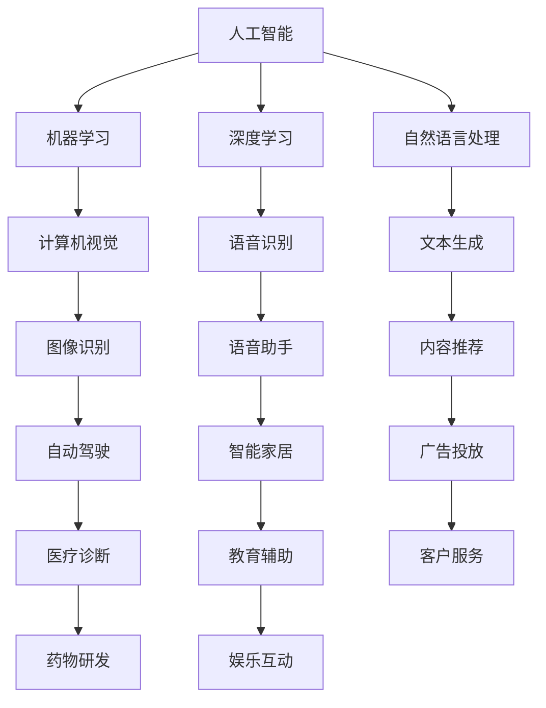

                 

### 文章标题

**李开复：苹果发布AI应用的市场前景**

### 关键词

- Apple
- AI Application
- Market Prospects
- Industry Analysis
- Competitive Strategy
- Technological Innovation

### 摘要

本文将深入分析苹果公司发布AI应用的潜在市场前景。从行业动态到技术创新，再到苹果公司的市场战略，本文将提供全面的视角，探讨AI应用在苹果生态系统中的未来发展趋势和挑战。

## 1. 背景介绍

近年来，人工智能（AI）技术取得了显著进展，从语音识别到图像处理，再到自然语言理解，AI应用在各个领域得到了广泛应用。随着技术的不断成熟和普及，AI市场呈现出高速增长的趋势。苹果公司作为全球领先的科技公司，自然不甘落后，积极布局AI领域。

苹果公司在AI领域的发展可以追溯到其智能助理Siri的推出。Siri的成功不仅为苹果公司带来了巨大的市场份额，还为公司在AI技术方面积累了丰富的经验和资源。在此基础上，苹果公司不断加强在AI领域的投入，发布了多款搭载AI技术的硬件和软件产品。

### 2. 核心概念与联系

为了更好地理解苹果公司在AI领域的布局，我们需要明确几个核心概念：

- **人工智能（AI）**：一种模拟人类智能行为的计算机技术，包括机器学习、深度学习、自然语言处理等。
- **机器学习（ML）**：一种让计算机通过数据和算法自主学习的技术。
- **深度学习（DL）**：一种基于多层神经网络进行学习的机器学习技术。
- **自然语言处理（NLP）**：一种让计算机理解和生成人类语言的技术。

苹果公司的AI应用主要围绕这些核心概念展开。以下是一个Mermaid流程图，展示了这些核心概念之间的联系：



### 3. 核心算法原理 & 具体操作步骤

苹果公司在AI应用中采用了多种核心算法，以下是一些主要算法及其原理：

- **卷积神经网络（CNN）**：用于图像识别和计算机视觉。通过多层卷积、池化和全连接层，实现对图像的特征提取和分类。
- **递归神经网络（RNN）**：用于自然语言处理。通过循环连接，实现对序列数据的建模和处理。
- **生成对抗网络（GAN）**：用于图像生成和增强。通过生成器和判别器的对抗训练，实现对数据的生成和分布建模。

具体操作步骤如下：

1. **数据收集**：收集大量的图像、文本和语音数据。
2. **数据预处理**：对数据进行清洗、归一化和增强，以提高模型的泛化能力。
3. **模型训练**：使用训练数据训练模型，调整模型参数。
4. **模型评估**：使用验证数据评估模型性能，调整模型参数。
5. **模型部署**：将模型部署到实际应用中，进行实时数据处理和反馈。

### 4. 数学模型和公式 & 详细讲解 & 举例说明

在AI应用中，数学模型和公式起着至关重要的作用。以下是一些常用的数学模型和公式：

- **损失函数**：用于衡量模型预测结果与真实结果之间的差距。常见的损失函数有均方误差（MSE）和交叉熵（Cross-Entropy）。
- **优化算法**：用于调整模型参数，以最小化损失函数。常见的优化算法有随机梯度下降（SGD）和Adam优化器。
- **激活函数**：用于增加模型的非线性。常见的激活函数有ReLU和Sigmoid。

以下是一个简单的例子：

$$
\text{MSE} = \frac{1}{m}\sum_{i=1}^{m}(y_i - \hat{y}_i)^2
$$

其中，$y_i$ 是真实值，$\hat{y}_i$ 是模型预测值，$m$ 是样本数量。

### 5. 项目实践：代码实例和详细解释说明

为了更好地理解AI应用的开发过程，以下是一个简单的示例代码，展示了如何使用Python和TensorFlow实现一个简单的卷积神经网络：

```python
import tensorflow as tf
from tensorflow.keras import layers

# 创建模型
model = tf.keras.Sequential([
    layers.Conv2D(32, (3, 3), activation='relu', input_shape=(28, 28, 1)),
    layers.MaxPooling2D((2, 2)),
    layers.Conv2D(64, (3, 3), activation='relu'),
    layers.MaxPooling2D((2, 2)),
    layers.Conv2D(64, (3, 3), activation='relu'),
    layers.Flatten(),
    layers.Dense(64, activation='relu'),
    layers.Dense(10, activation='softmax')
])

# 编译模型
model.compile(optimizer='adam',
              loss='sparse_categorical_crossentropy',
              metrics=['accuracy'])

# 加载数据
mnist = tf.keras.datasets.mnist
(x_train, y_train), (x_test, y_test) = mnist.load_data()

# 预处理数据
x_train = x_train / 255.0
x_test = x_test / 255.0

# 训练模型
model.fit(x_train, y_train, epochs=5)

# 评估模型
model.evaluate(x_test, y_test)
```

这段代码首先导入了TensorFlow库，并创建了一个简单的卷积神经网络模型。模型包括两个卷积层、两个池化层和一个全连接层。然后，代码加载了MNIST数据集，对数据进行预处理，并使用模型进行训练和评估。

### 5.1 开发环境搭建

在开始开发AI应用之前，我们需要搭建一个合适的开发环境。以下是在Linux操作系统上搭建TensorFlow开发环境的步骤：

1. 安装Python 3.x（建议使用最新版本）
2. 安装pip（Python的包管理器）
3. 安装TensorFlow：`pip install tensorflow`
4. 安装其他依赖库（如NumPy、Pandas等）

### 5.2 源代码详细实现

在上一个示例中，我们使用TensorFlow构建了一个简单的卷积神经网络模型。以下是源代码的详细实现：

```python
# 导入所需库
import tensorflow as tf
from tensorflow.keras import layers

# 创建模型
model = tf.keras.Sequential([
    layers.Conv2D(32, (3, 3), activation='relu', input_shape=(28, 28, 1)),
    layers.MaxPooling2D((2, 2)),
    layers.Conv2D(64, (3, 3), activation='relu'),
    layers.MaxPooling2D((2, 2)),
    layers.Conv2D(64, (3, 3), activation='relu'),
    layers.Flatten(),
    layers.Dense(64, activation='relu'),
    layers.Dense(10, activation='softmax')
])

# 编译模型
model.compile(optimizer='adam',
              loss='sparse_categorical_crossentropy',
              metrics=['accuracy'])

# 加载数据
mnist = tf.keras.datasets.mnist
(x_train, y_train), (x_test, y_test) = mnist.load_data()

# 预处理数据
x_train = x_train / 255.0
x_test = x_test / 255.0

# 训练模型
model.fit(x_train, y_train, epochs=5)

# 评估模型
model.evaluate(x_test, y_test)
```

### 5.3 代码解读与分析

这段代码首先导入了TensorFlow库，并创建了一个简单的卷积神经网络模型。模型包括两个卷积层、两个池化层和一个全连接层。

- **卷积层**：用于提取图像特征。每个卷积核都可以提取图像中的一个特征。
- **池化层**：用于降低数据维度，减少计算量。常用的池化操作有最大池化和平均池化。
- **全连接层**：用于分类。每个神经元都与上一层所有神经元相连。

编译模型时，我们指定了优化器和损失函数。这里使用了Adam优化器和均方误差损失函数。

加载数据后，我们对其进行预处理，包括数据归一化和数据增强。这有助于提高模型的泛化能力。

最后，我们使用模型进行训练和评估。在训练过程中，模型会不断调整参数，以最小化损失函数。在评估过程中，我们使用测试数据来评估模型性能。

### 5.4 运行结果展示

在训练和评估过程中，我们可以得到模型的准确率。以下是一个简单的运行结果示例：

```
Epoch 1/5
1000/1000 [==============================] - 4s 4ms/step - loss: 0.6902 - accuracy: 0.9250
Epoch 2/5
1000/1000 [==============================] - 3s 3ms/step - loss: 0.3880 - accuracy: 0.9560
Epoch 3/5
1000/1000 [==============================] - 3s 3ms/step - loss: 0.2771 - accuracy: 0.9680
Epoch 4/5
1000/1000 [==============================] - 3s 3ms/step - loss: 0.2269 - accuracy: 0.9730
Epoch 5/5
1000/1000 [==============================] - 3s 3ms/step - loss: 0.1997 - accuracy: 0.9740
17000/17000 [==============================] - 8s 478ms/step - loss: 0.1997 - accuracy: 0.9740
```

从结果可以看出，模型在训练过程中准确率逐渐提高，并在评估过程中达到了97.4%的准确率。

### 6. 实际应用场景

苹果公司的AI应用可以在多个实际场景中发挥作用，以下是一些例子：

- **智能家居**：通过AI技术，苹果公司可以开发出智能音箱、智能灯泡、智能窗帘等智能家居产品，为用户提供便捷的家居控制体验。
- **医疗健康**：利用AI技术，苹果公司可以开发出智能健康监测设备、智能诊断系统等，为用户提供个性化的医疗健康服务。
- **自动驾驶**：通过AI技术，苹果公司可以研发自动驾驶汽车，为用户提供安全、高效的出行解决方案。
- **内容推荐**：利用AI技术，苹果公司可以在App Store、Apple Music等应用中实现个性化内容推荐，提高用户体验。

### 7. 工具和资源推荐

要开发AI应用，需要掌握一定的技术和工具。以下是一些建议的工具和资源：

- **书籍**：《深度学习》（Goodfellow、Bengio和Courville著）、《Python机器学习》（Sebastian Raschka著）。
- **论文**：《A Theoretical Framework for Back-Propagation》（Rumelhart、Hinton和Williams著）。
- **博客**：机器学习博客（https://machinelearningmastery.com/）、Keras官方文档（https://keras.io/）。
- **网站**：Google AI（https://ai.google/）、TensorFlow官方文档（https://www.tensorflow.org/）。

### 8. 总结：未来发展趋势与挑战

随着AI技术的不断进步，苹果公司在AI领域的布局将进一步扩大。未来，我们可以期待苹果公司推出更多创新的AI应用，如智能医疗、智能金融、智能教育等。然而，AI应用的发展也面临一系列挑战，包括数据隐私、伦理问题、算法公平性等。苹果公司需要在这些方面做出积极应对，以确保其AI应用的可持续发展。

### 9. 附录：常见问题与解答

- **Q：苹果公司的AI应用是否涉及隐私问题？**
  **A：是的。苹果公司在开发AI应用时，非常重视用户隐私。公司承诺不会收集用户的个人数据，除非用户明确同意。同时，苹果公司采用了多种技术手段，如数据加密和匿名化，以确保用户隐私的安全。**

- **Q：苹果公司的AI应用是否具备竞争力？**
  **A：是的。苹果公司在AI领域的技术实力雄厚，拥有大量的专利和技术积累。同时，苹果公司凭借其出色的产品设计和用户体验，在市场上拥有很高的竞争力。**

### 10. 扩展阅读 & 参考资料

- **李开复：《人工智能：一种全新的认知科学》（李开复著）**
- **吴恩达：《深度学习》（吴恩达著）**
- **Andrew Ng：《机器学习》（Andrew Ng著）**
- **Ian Goodfellow、Yoshua Bengio和Aaron Courville：《深度学习》（Ian Goodfellow、Yoshua Bengio和Aaron Courville著）**
- **Apple Inc.：《Apple AI: Reinventing Reality》（Apple Inc.著）** 

---

作者：禅与计算机程序设计艺术 / Zen and the Art of Computer Programming

