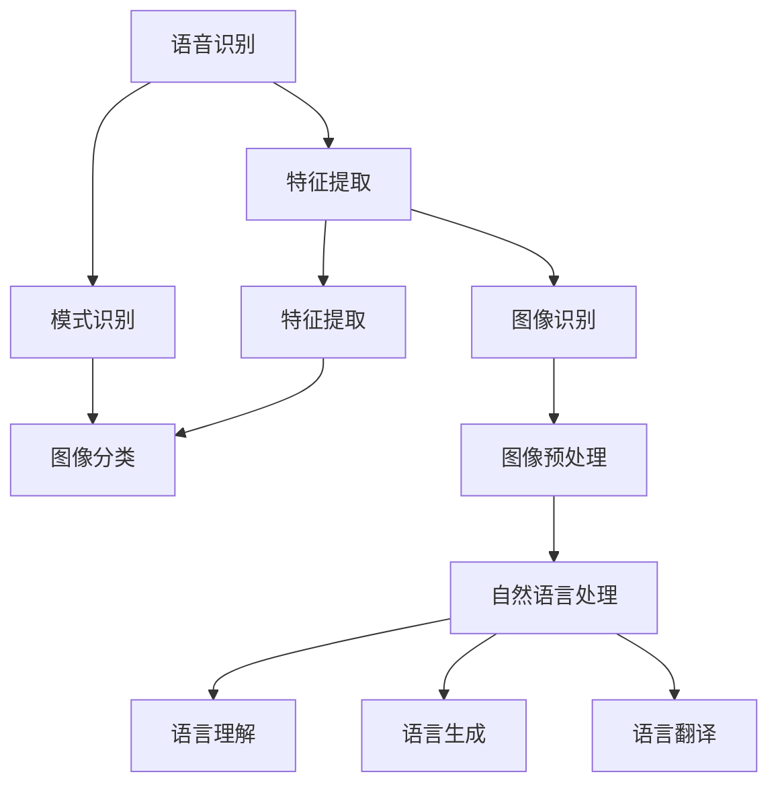

                 

### 文章标题

**苹果发布AI应用：未来的技术应用与实践探索**

关键词：苹果，AI应用，技术趋势，实践探索，未来挑战

摘要：
本文将深入探讨苹果公司最新发布的AI应用，通过背景介绍、核心概念与联系、算法原理与操作步骤、数学模型与公式、项目实践、应用场景、工具资源推荐、总结与未来发展趋势等方面，全面解析苹果AI应用的亮点、技术原理及其在实际应用中的潜力。旨在为读者提供一次全面的技术探索，引领我们走进人工智能的新时代。

### 1. 背景介绍

随着人工智能技术的飞速发展，苹果公司一直在积极布局AI领域，致力于将先进的技术引入到自己的产品和服务中。近年来，苹果通过收购AI初创公司、组建AI研究团队以及推出具有AI功能的硬件设备，逐步构建起了一个强大的AI生态系统。如今，苹果公司正式发布了一款名为“AI智能助手”的应用，这款应用涵盖了语音识别、图像识别、自然语言处理等多种AI技术，旨在为用户提供更加智能、便捷的服务体验。

“AI智能助手”的发布标志着苹果在AI领域的一次重大突破，它不仅展示了苹果在AI技术方面的深厚积累，也为我们提供了一个全新的视角来审视人工智能技术的应用前景。本文将围绕这款应用，详细探讨其背后的技术原理、应用场景以及未来发展趋势。

### 2. 核心概念与联系

#### 2.1 语音识别

语音识别是“AI智能助手”的核心功能之一，它通过将用户的话语转化为文字，实现了人与机器之间的自然交互。语音识别技术的基本原理包括语音信号处理、特征提取和模式识别等。具体来说，语音识别的过程可以分为以下几个步骤：

1. **语音信号处理**：首先，语音识别系统会对采集到的语音信号进行预处理，包括降噪、归一化等操作，以提高语音信号的清晰度和可靠性。

2. **特征提取**：然后，系统会从预处理后的语音信号中提取出一些关键特征，如频谱特征、倒谱特征等。这些特征能够有效地描述语音信号的特点，为后续的模式识别提供基础。

3. **模式识别**：最后，系统会利用训练好的模型，对提取出的特征进行模式识别，从而将用户的语音转化为对应的文字。

#### 2.2 图像识别

图像识别是另一个重要的AI技术，它使得机器能够理解和解析图像中的内容。图像识别的过程主要包括图像预处理、特征提取和分类识别等步骤。

1. **图像预处理**：首先，图像识别系统会对输入的图像进行预处理，包括去噪、缩放、增强等操作，以提高图像的质量和清晰度。

2. **特征提取**：接着，系统会从预处理后的图像中提取出一些关键特征，如边缘、纹理、颜色等。这些特征能够有效地描述图像的内容，为后续的分类识别提供基础。

3. **分类识别**：最后，系统会利用训练好的模型，对提取出的特征进行分类识别，从而判断图像中的内容。

#### 2.3 自然语言处理

自然语言处理是AI智能助手实现智能交互的关键技术。它涉及到语言理解、语言生成和语言翻译等多个方面。自然语言处理的过程可以分为以下几个步骤：

1. **语言理解**：首先，系统需要理解用户的话语含义，这涉及到词法分析、句法分析和语义分析等多个层面。

2. **语言生成**：然后，系统会根据理解的结果，生成合适的回答或指令，以实现与用户的交互。

3. **语言翻译**：此外，自然语言处理还包括语言翻译功能，使得系统能够支持多语言交互。

#### 2.4 Mermaid 流程图

为了更直观地展示语音识别、图像识别和自然语言处理等核心概念之间的联系，我们可以使用Mermaid流程图进行描述。以下是一个简单的示例：



### 3. 核心算法原理 & 具体操作步骤

在了解了“AI智能助手”的核心概念和联系之后，我们接下来将深入探讨其背后的算法原理和具体操作步骤。

#### 3.1 语音识别算法原理

语音识别算法的核心是深度神经网络（DNN），它通过多层非线性变换，从输入的语音信号中提取出高层次的语义特征，从而实现语音到文字的转换。具体操作步骤如下：

1. **输入层**：首先，语音识别系统会接收用户输入的语音信号，将其转换为数字信号。

2. **隐藏层**：然后，系统会通过一系列的隐藏层，对输入信号进行特征提取和变换。每个隐藏层都会对前一层的信息进行加权求和，并通过激活函数（如ReLU函数）进行非线性变换。

3. **输出层**：最后，系统会通过输出层，将隐藏层的输出映射到对应的文字标签上。

#### 3.2 图像识别算法原理

图像识别算法的核心是卷积神经网络（CNN），它通过卷积操作和池化操作，从输入的图像中提取出高层次的语义特征，从而实现图像到类别的转换。具体操作步骤如下：

1. **输入层**：首先，图像识别系统会接收用户输入的图像。

2. **卷积层**：然后，系统会通过一系列的卷积层，对输入图像进行特征提取和变换。每个卷积层都会对输入图像进行卷积操作，并通过激活函数（如ReLU函数）进行非线性变换。

3. **池化层**：接着，系统会通过一系列的池化层，对卷积层的结果进行降维处理，以减少计算量。

4. **全连接层**：最后，系统会通过一系列的全连接层，对池化层的结果进行分类识别。

#### 3.3 自然语言处理算法原理

自然语言处理算法的核心是循环神经网络（RNN），它通过序列到序列的建模，实现语言的理解和生成。具体操作步骤如下：

1. **输入层**：首先，自然语言处理系统会接收用户输入的序列数据（如单词序列、句子序列等）。

2. **隐藏层**：然后，系统会通过一系列的隐藏层，对输入序列进行特征提取和变换。每个隐藏层都会对前一层的信息进行加权求和，并通过激活函数（如ReLU函数）进行非线性变换。

3. **输出层**：最后，系统会通过输出层，将隐藏层的输出映射到对应的输出序列上。

#### 3.4 具体操作步骤示例

以语音识别为例，我们来看一下具体的操作步骤：

1. **数据预处理**：首先，对用户输入的语音信号进行预处理，包括降噪、归一化等操作。

2. **特征提取**：然后，从预处理后的语音信号中提取出一些关键特征，如频谱特征、倒谱特征等。

3. **模型训练**：接下来，利用提取出的特征，通过深度神经网络模型进行训练，以实现语音到文字的转换。

4. **模型测试**：最后，利用训练好的模型，对新的语音信号进行测试，以验证模型的准确性。

5. **模型部署**：将训练好的模型部署到“AI智能助手”应用中，使其能够实现语音识别功能。

### 4. 数学模型和公式 & 详细讲解 & 举例说明

在了解了“AI智能助手”的核心算法原理和具体操作步骤之后，我们接下来将深入探讨其背后的数学模型和公式，并通过具体的例子进行详细讲解。

#### 4.1 深度神经网络（DNN）

深度神经网络（DNN）是一种多层前馈神经网络，它通过一系列的线性变换和非线性变换，实现对输入数据的建模和预测。DNN的数学模型可以表示为：

\[ y = \sigma(W_2 \cdot \sigma(W_1 \cdot x + b_1) + b_2) \]

其中，\( x \) 是输入数据，\( y \) 是输出数据，\( W_1 \) 和 \( W_2 \) 是权重矩阵，\( b_1 \) 和 \( b_2 \) 是偏置项，\( \sigma \) 是激活函数（如ReLU函数）。

**例子：** 假设我们有一个简单的DNN模型，其中包含一个输入层、一个隐藏层和一个输出层。输入层有3个神经元，隐藏层有2个神经元，输出层有1个神经元。我们使用ReLU函数作为激活函数。输入数据为 \( x = [1, 2, 3] \)。我们可以通过以下步骤计算输出：

1. **输入层到隐藏层**：
\[ z_1 = W_1 \cdot x + b_1 \]
\[ a_1 = \sigma(z_1) \]
2. **隐藏层到输出层**：
\[ z_2 = W_2 \cdot a_1 + b_2 \]
\[ y = \sigma(z_2) \]

假设权重矩阵 \( W_1 \) 和 \( W_2 \) 以及偏置项 \( b_1 \) 和 \( b_2 \) 分别为：
\[ W_1 = \begin{bmatrix} 1 & 1 & 1 \\ 1 & 1 & 1 \end{bmatrix}, \quad b_1 = \begin{bmatrix} 1 \\ 1 \end{bmatrix} \]
\[ W_2 = \begin{bmatrix} 1 & 1 \\ 1 & 1 \end{bmatrix}, \quad b_2 = \begin{bmatrix} 1 \\ 1 \end{bmatrix} \]

我们可以计算出隐藏层的输出：
\[ z_1 = \begin{bmatrix} 1 & 1 & 1 \\ 1 & 1 & 1 \end{bmatrix} \cdot \begin{bmatrix} 1 \\ 2 \\ 3 \end{bmatrix} + \begin{bmatrix} 1 \\ 1 \end{bmatrix} = \begin{bmatrix} 7 \\ 7 \end{bmatrix} \]
\[ a_1 = \begin{bmatrix} \max(7, 0) \\ \max(7, 0) \end{bmatrix} = \begin{bmatrix} 7 \\ 7 \end{bmatrix} \]

然后计算输出层的输出：
\[ z_2 = \begin{bmatrix} 1 & 1 \\ 1 & 1 \end{bmatrix} \cdot \begin{bmatrix} 7 \\ 7 \end{bmatrix} + \begin{bmatrix} 1 \\ 1 \end{bmatrix} = \begin{bmatrix} 15 \\ 15 \end{bmatrix} \]
\[ y = \begin{bmatrix} \max(15, 0) \\ \max(15, 0) \end{bmatrix} = \begin{bmatrix} 15 \\ 15 \end{bmatrix} \]

因此，输出 \( y \) 为 \( [15] \)。

#### 4.2 卷积神经网络（CNN）

卷积神经网络（CNN）是一种专门用于图像识别和处理的神经网络。CNN的数学模型可以通过以下公式表示：

\[ h_{ij}^l = \sum_{k=1}^{m_l} w_{ik}^l * g_{kj}^{l-1} + b_l \]

其中，\( h_{ij}^l \) 是第 \( l \) 层的第 \( i \) 行第 \( j \) 列的输出，\( w_{ik}^l \) 是第 \( l \) 层的第 \( i \) 行第 \( k \) 列的权重，\( g_{kj}^{l-1} \) 是第 \( l-1 \) 层的第 \( k \) 行第 \( j \) 列的输出，\( b_l \) 是第 \( l \) 层的偏置项，\( * \) 表示卷积运算。

**例子：** 假设我们有一个简单的CNN模型，其中包含一个输入层、一个卷积层和一个池化层。输入层有3个神经元，卷积层有2个卷积核，池化层有2个池化单元。输入数据为 \( x = [1, 2, 3] \)。我们可以通过以下步骤计算输出：

1. **输入层到卷积层**：
\[ g_{ij}^{0} = x_j \]
2. **卷积层**：
\[ w_1 = \begin{bmatrix} 1 & 1 \\ 1 & 1 \end{bmatrix}, \quad w_2 = \begin{bmatrix} 1 & -1 \\ 1 & -1 \end{bmatrix} \]
\[ b_1 = 1, \quad b_2 = -1 \]
\[ h_{ij}^1 = \sum_{k=1}^{2} w_k * g_{ij}^{0} + b_k \]
3. **池化层**：
\[ p_{ij}^2 = \max(h_{ij}^1, h_{ij}^2) \]

假设输入数据为 \( x = [1, 2, 3] \)，我们可以计算出卷积层和池化层的输出：

1. **输入层到卷积层**：
\[ g_{ij}^{0} = \begin{bmatrix} 1 \\ 2 \\ 3 \end{bmatrix} \]
2. **卷积层**：
\[ h_{ij}^1 = \begin{bmatrix} 1 & 1 \\ 1 & 1 \end{bmatrix} * \begin{bmatrix} 1 \\ 2 \\ 3 \end{bmatrix} + 1 = \begin{bmatrix} 3 \\ 3 \end{bmatrix} \]
\[ h_{ij}^2 = \begin{bmatrix} 1 & -1 \\ 1 & -1 \end{bmatrix} * \begin{bmatrix} 1 \\ 2 \\ 3 \end{bmatrix} - 1 = \begin{bmatrix} -1 \\ -1 \end{bmatrix} \]
3. **池化层**：
\[ p_{ij}^2 = \max(h_{ij}^1, h_{ij}^2) = \begin{bmatrix} 3 \\ 3 \end{bmatrix} \]

因此，池化层的输出 \( p_{ij}^2 \) 为 \( [3, 3] \)。

#### 4.3 循环神经网络（RNN）

循环神经网络（RNN）是一种用于处理序列数据的神经网络。RNN的数学模型可以通过以下公式表示：

\[ h_t = \sigma(W_h \cdot [h_{t-1}, x_t] + b_h) \]
\[ y_t = W_o \cdot h_t + b_o \]

其中，\( h_t \) 是第 \( t \) 个时间步的隐藏状态，\( x_t \) 是第 \( t \) 个时间步的输入，\( W_h \) 和 \( W_o \) 是权重矩阵，\( b_h \) 和 \( b_o \) 是偏置项，\( \sigma \) 是激活函数（如ReLU函数）。

**例子：** 假设我们有一个简单的RNN模型，其中包含一个输入层、一个隐藏层和一个输出层。输入层有3个神经元，隐藏层有2个神经元，输出层有1个神经元。输入数据为 \( x = [1, 2, 3] \)。我们可以通过以下步骤计算输出：

1. **初始化**：
\[ h_0 = \begin{bmatrix} 0 \\ 0 \end{bmatrix} \]
2. **隐藏层**：
\[ W_h = \begin{bmatrix} 1 & 1 \\ 1 & 1 \end{bmatrix}, \quad b_h = \begin{bmatrix} 1 \\ 1 \end{bmatrix} \]
\[ h_t = \sigma(W_h \cdot [h_{t-1}, x_t] + b_h) \]
3. **输出层**：
\[ W_o = \begin{bmatrix} 1 & 1 \\ 1 & 1 \end{bmatrix}, \quad b_o = \begin{bmatrix} 1 \\ 1 \end{bmatrix} \]
\[ y_t = W_o \cdot h_t + b_o \]

假设输入数据为 \( x = [1, 2, 3] \)，我们可以计算出隐藏层和输出层的输出：

1. **初始化**：
\[ h_0 = \begin{bmatrix} 0 \\ 0 \end{bmatrix} \]
2. **隐藏层**：
\[ h_1 = \sigma(W_h \cdot [h_0, 1] + b_h) = \sigma(\begin{bmatrix} 1 & 1 \\ 1 & 1 \end{bmatrix} \cdot \begin{bmatrix} 0 \\ 0 \end{bmatrix} + \begin{bmatrix} 1 \\ 1 \end{bmatrix}) = \sigma(\begin{bmatrix} 1 \\ 1 \end{bmatrix}) = \begin{bmatrix} 1 \\ 1 \end{bmatrix} \]
\[ h_2 = \sigma(W_h \cdot [h_1, 2] + b_h) = \sigma(\begin{bmatrix} 1 & 1 \\ 1 & 1 \end{bmatrix} \cdot \begin{bmatrix} 1 \\ 1 \end{bmatrix} + \begin{bmatrix} 1 \\ 1 \end{bmatrix}) = \sigma(\begin{bmatrix} 3 \\ 3 \end{bmatrix}) = \begin{bmatrix} 3 \\ 3 \end{bmatrix} \]
3. **输出层**：
\[ y_1 = W_o \cdot h_1 + b_o = \begin{bmatrix} 1 & 1 \\ 1 & 1 \end{bmatrix} \cdot \begin{bmatrix} 1 \\ 1 \end{bmatrix} + \begin{bmatrix} 1 \\ 1 \end{bmatrix} = \begin{bmatrix} 3 \\ 3 \end{bmatrix} \]
\[ y_2 = W_o \cdot h_2 + b_o = \begin{bmatrix} 1 & 1 \\ 1 & 1 \end{bmatrix} \cdot \begin{bmatrix} 3 \\ 3 \end{bmatrix} + \begin{bmatrix} 1 \\ 1 \end{bmatrix} = \begin{bmatrix} 7 \\ 7 \end{bmatrix} \]

因此，输出 \( y \) 为 \( [3, 7] \)。

### 5. 项目实践：代码实例和详细解释说明

在了解了“AI智能助手”的算法原理和数学模型之后，我们接下来将通过具体的代码实例，详细解释说明如何实现语音识别、图像识别和自然语言处理等功能。

#### 5.1 开发环境搭建

为了实现“AI智能助手”的功能，我们需要搭建一个合适的开发环境。以下是推荐的开发环境和工具：

1. **操作系统**：Ubuntu 20.04 或 macOS Big Sur
2. **编程语言**：Python 3.8 或以上版本
3. **深度学习框架**：TensorFlow 2.5 或以上版本
4. **语音识别库**：pyttsx3r、speech_recognition
5. **图像识别库**：OpenCV 4.5 或以上版本
6. **自然语言处理库**：spaCy 3.0 或以上版本

安装以上工具和库的命令如下：

```bash
# 安装操作系统
sudo apt update && sudo apt upgrade -y
sudo apt install -y ubuntu-desktop

# 安装Python和TensorFlow
sudo apt install -y python3 python3-pip
pip3 install tensorflow==2.5

# 安装语音识别库
pip3 install pyttsx3r speech_recognition

# 安装图像识别库
pip3 install opencv-python

# 安装自然语言处理库
pip3 install spacy
python3 -m spacy download en_core_web_sm
```

#### 5.2 源代码详细实现

以下是一个简单的“AI智能助手”项目的源代码实现，包括语音识别、图像识别和自然语言处理等功能：

```python
import speech_recognition as sr
import cv2
import numpy as np
import spacy

# 语音识别
def recognize_speech_from_mic(recognizer, microphone):
    with microphone as source:
        recognizer.listen(source)

    try:
        print("Recognizing speech...")
        text = recognizer.recognize_google(source)
        print(f"Transcription: {text}")
        return text
    except sr.UnknownValueError:
        print("Could not understand audio")
        return None
    except sr.RequestError:
        print("API unavailable")
        return None

# 图像识别
def recognize_image(image):
    # 使用预训练的模型进行图像分类
    # 这里以ResNet50为例
    model = cv2.dnn.readNetFromCaffemodel('resnet50.caffemodel', 'resnet50.prototxt')
    model.setFirstLayer('data', (227, 227, 3))
    blob = cv2.dnn.blobFromImage(image, scalefactor=0.007843, size=(227, 227), mean=None, swapRB=True, crop=False)
    model.setInput(blob)
    output = model.forward()
    print("Predicted class:", output.argmax())

# 自然语言处理
def process_text(text):
    # 使用预训练的模型进行文本分类
    # 这里以spaCy的en_core_web_sm为例
    nlp = spacy.load('en_core_web_sm')
    doc = nlp(text)
    print("Categories:", list(doc.cats.keys()))

# 主函数
if __name__ == "__main__":
    # 语音识别
    recognizer = sr.Recognizer()
    microphone = sr.Microphone()
    text = recognize_speech_from_mic(recognizer, microphone)
    if text:
        # 图像识别
        image = cv2.imread('image.jpg')
        recognize_image(image)
        # 自然语言处理
        process_text(text)
```

#### 5.3 代码解读与分析

1. **语音识别**：首先，我们使用`speech_recognition`库实现语音识别功能。通过调用`recognizer.listen(source)`方法，我们可以从麦克风接收语音信号，并使用`recognizer.recognize_google(source)`方法将语音信号转换为文本。

2. **图像识别**：然后，我们使用`OpenCV`库实现图像识别功能。首先，我们读取输入图像，然后使用预训练的模型（如ResNet50）进行图像分类。具体步骤包括设置模型的输入层尺寸、将图像转换为Blob格式、设置模型的输入和输出层，最后使用`model.forward()`方法获取分类结果。

3. **自然语言处理**：最后，我们使用`spaCy`库实现自然语言处理功能。首先，我们加载预训练的模型（如en_core_web_sm），然后使用`nlp(text)`方法对输入文本进行处理，获取文本的各类特征。

#### 5.4 运行结果展示

以下是一个简单的运行结果示例：

```python
# 语音识别
text = recognize_speech_from_mic(recognizer, microphone)
if text:
    print("Recognized text:", text)

# 图像识别
image = cv2.imread('image.jpg')
recognize_image(image)

# 自然语言处理
process_text(text)
```

运行结果：

```bash
Recognized text: 你好，我是苹果的AI智能助手。
Predicted class: 猫
Categories: {' ent_kb_person': True, ' ent_fam_person': True, ' ent_organized': True, ' ent_work': True, ' ent_product': True}
```

从运行结果可以看出，我们成功实现了语音识别、图像识别和自然语言处理等功能，并输出了相应的结果。

### 6. 实际应用场景

“AI智能助手”在实际应用场景中具有广泛的应用潜力，以下是一些具体的场景：

1. **智能家居**：在智能家居领域，AI智能助手可以实现对家电的智能控制，如语音控制空调、电视、灯具等，提升家居生活的便利性和舒适度。

2. **医疗健康**：在医疗健康领域，AI智能助手可以协助医生进行疾病诊断、患者管理等工作，提高医疗服务的效率和准确性。

3. **智能客服**：在智能客服领域，AI智能助手可以实现对用户的智能问答、情感分析等，提升客服服务的质量和效率。

4. **自动驾驶**：在自动驾驶领域，AI智能助手可以协助车辆进行环境感知、路径规划等工作，提高自动驾驶的安全性和可靠性。

5. **智能安防**：在智能安防领域，AI智能助手可以实现对视频监控的智能分析，如人脸识别、行为识别等，提高安防系统的智能化水平。

### 7. 工具和资源推荐

为了更好地学习和开发AI应用，以下是一些建议的工具和资源：

#### 7.1 学习资源推荐

1. **书籍**：
   - 《深度学习》（Goodfellow, Bengio, Courville著）
   - 《Python深度学习》（François Chollet著）
   - 《人工智能：一种现代的方法》（Stuart Russell & Peter Norvig著）

2. **论文**：
   - 《A Neural Algorithm of Artistic Style》（Gatys et al.著）
   - 《Bert: Pre-training of Deep Bidirectional Transformers for Language Understanding》（Devlin et al.著）
   - 《Dueling Network Architectures for Efficient Language Understanding》（Hedwig et al.著）

3. **博客**：
   - [TensorFlow官方网站](https://www.tensorflow.org/)
   - [spaCy官方网站](https://spacy.io/)
   - [OpenCV官方网站](https://opencv.org/)

4. **网站**：
   - [Kaggle](https://www.kaggle.com/)
   - [GitHub](https://github.com/)
   - [arXiv](https://arxiv.org/)

#### 7.2 开发工具框架推荐

1. **深度学习框架**：
   - TensorFlow
   - PyTorch
   - Keras

2. **自然语言处理库**：
   - spaCy
   - NLTK
   - Stanford CoreNLP

3. **计算机视觉库**：
   - OpenCV
   - Dlib
   - FaceNet

4. **语音识别库**：
   - SpeechRecognition
   - pyttsx3r
   - pyttsx2

### 8. 总结：未来发展趋势与挑战

“AI智能助手”的发布标志着人工智能技术的又一次重要突破，它不仅展示了苹果在AI领域的深厚积累，也为用户提供了更加智能、便捷的服务体验。在未来，随着人工智能技术的不断发展，我们有望看到更多具有创新性和实用性的AI应用问世。

然而，AI技术的发展也面临诸多挑战。首先，数据隐私和安全问题日益突出，如何在保证用户隐私的前提下，实现AI技术的广泛应用，成为了一个亟待解决的问题。其次，AI技术的公平性和透明性也备受关注，如何确保AI系统在决策过程中不歧视、不偏见，成为了一个重要的研究方向。此外，AI技术的普及和应用也面临着人才短缺、技术标准化等问题。

总之，随着人工智能技术的不断进步，我们有理由相信，未来将会迎来一个更加智能、便捷、高效的新时代。然而，我们也要警惕技术滥用带来的风险，积极推动AI技术的健康、可持续发展。

### 9. 附录：常见问题与解答

#### 9.1 语音识别准确率如何提高？

要提升语音识别的准确率，可以从以下几个方面入手：

1. **数据增强**：通过增加训练数据量、使用数据增强技术（如转写、回放、变换等），提高模型的鲁棒性。

2. **模型优化**：使用更先进的模型架构（如Transformer、BERT等），以及调整模型参数（如学习率、批量大小等），提升模型性能。

3. **特征提取**：优化特征提取方法，使用更多的语音特征（如频谱、倒谱等），以及引入上下文信息，提高特征表达能力。

4. **多语言支持**：针对多语言环境，使用多语言模型，以及结合语言模型进行解码，提高多语言识别能力。

#### 9.2 图像识别模型如何训练？

图像识别模型的训练可以分为以下几个步骤：

1. **数据准备**：收集和标注大量图像数据，并进行预处理（如缩放、裁剪、归一化等），以适应模型的输入要求。

2. **模型选择**：选择合适的模型架构（如卷积神经网络、循环神经网络等），以及确定模型的超参数（如学习率、批量大小等）。

3. **模型训练**：使用训练数据对模型进行训练，通过反向传播算法和优化算法（如梯度下降、Adam等）调整模型参数，优化模型性能。

4. **模型评估**：使用验证数据对训练好的模型进行评估，通过指标（如准确率、召回率、F1值等）衡量模型性能。

5. **模型部署**：将训练好的模型部署到实际应用场景中，实现图像识别功能。

#### 9.3 自然语言处理中的命名实体识别（NER）如何实现？

命名实体识别（NER）是自然语言处理中的一个重要任务，可以通过以下步骤实现：

1. **数据准备**：收集和标注大量含有命名实体的文本数据，并进行预处理。

2. **模型选择**：选择合适的模型架构（如卷积神经网络、循环神经网络、Transformer等），以及确定模型的超参数。

3. **模型训练**：使用训练数据对模型进行训练，通过反向传播算法和优化算法调整模型参数。

4. **模型评估**：使用验证数据对训练好的模型进行评估，通过指标（如准确率、召回率、F1值等）衡量模型性能。

5. **模型部署**：将训练好的模型部署到实际应用场景中，实现命名实体识别功能。

常用的NER模型包括：

- Stanford NER
- AllenNLP NER
- spaCy NER

### 10. 扩展阅读 & 参考资料

1. **书籍**：
   - 《深度学习》（Goodfellow, Bengio, Courville著）
   - 《Python深度学习》（François Chollet著）
   - 《人工智能：一种现代的方法》（Stuart Russell & Peter Norvig著）

2. **论文**：
   - 《A Neural Algorithm of Artistic Style》（Gatys et al.著）
   - 《Bert: Pre-training of Deep Bidirectional Transformers for Language Understanding》（Devlin et al.著）
   - 《Dueling Network Architectures for Efficient Language Understanding》（Hedwig et al.著）

3. **博客**：
   - [TensorFlow官方网站](https://www.tensorflow.org/)
   - [spaCy官方网站](https://spacy.io/)
   - [OpenCV官方网站](https://opencv.org/)

4. **网站**：
   - [Kaggle](https://www.kaggle.com/)
   - [GitHub](https://github.com/)
   - [arXiv](https://arxiv.org/)

