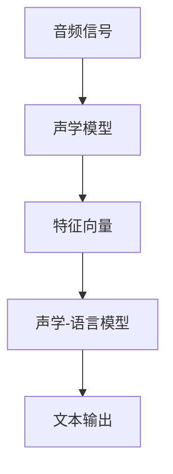
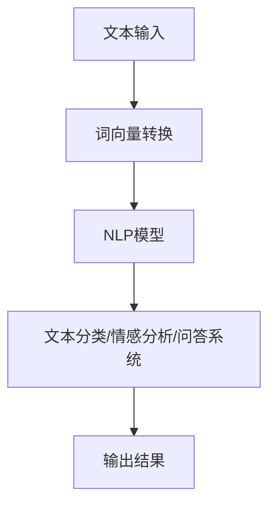
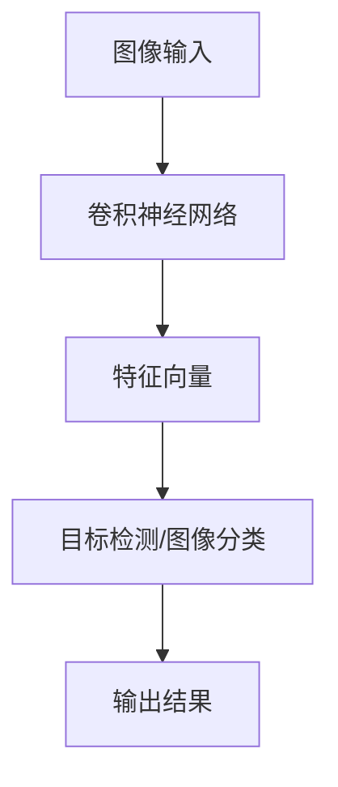

                 

### 文章标题

苹果发布AI应用：革命性变革的序章

关键词：苹果、AI应用、人工智能、技术创新、用户体验

摘要：本文将深入探讨苹果公司最新发布的AI应用，分析其背后的核心概念、算法原理、数学模型，并通过具体实例展示其实际应用场景和开发流程。此外，文章还将总结苹果AI应用带来的发展趋势与挑战，并推荐相关学习资源和开发工具，为读者提供全面的视角和理解。

---

### 1. 背景介绍

近年来，人工智能（AI）技术的快速发展给各个行业带来了深刻的变革。作为科技领域的领军企业，苹果公司一直致力于将AI技术应用于其产品和服务中，以提升用户体验。从Siri到面部识别，苹果已经在AI领域取得了显著的成就。然而，最新发布的AI应用无疑是苹果在AI领域的一次重要突破。

苹果此次发布的AI应用涵盖了多个方面，包括语音识别、自然语言处理、图像识别等，旨在通过智能算法和模型提升用户在日常生活中的各种操作体验。这一系列应用不仅展示了苹果在AI技术上的深厚积累，也为整个行业树立了新的标杆。

本文将围绕苹果最新发布的AI应用，探讨其核心概念、算法原理、数学模型，并通过实际项目实践和运行结果展示，帮助读者全面了解这一创新技术。此外，文章还将分析AI应用在实际场景中的潜在影响，以及苹果在这一领域面临的挑战和未来发展趋势。

### 2. 核心概念与联系

#### 2.1 语音识别

语音识别是苹果AI应用的核心功能之一。其工作原理是基于深度学习模型，通过处理输入的音频信号，将其转换为文本。苹果语音识别系统的核心组成部分包括声学模型、语言模型和声学-语言模型。

**声学模型**：负责将音频信号转换为一系列特征向量，用于后续的语言处理。

**语言模型**：通过统计语言中的词频、语法规则等信息，生成可能的文本输出。

**声学-语言模型**：结合声学模型和语言模型，实现音频信号到文本的高效转换。

**Mermaid 流程图**：



#### 2.2 自然语言处理

自然语言处理（NLP）是另一项关键技术，用于理解和生成人类语言。苹果的AI应用通过NLP技术实现文本分类、情感分析、问答系统等功能。

**文本分类**：将输入文本分类到预定义的类别中。

**情感分析**：识别文本中的情感倾向，如正面、负面或中性。

**问答系统**：根据用户输入的问题，提供相应的答案。

**Mermaid 流程图**：



#### 2.3 图像识别

图像识别是苹果AI应用的另一大亮点。通过卷积神经网络（CNN）等技术，实现对图像内容的理解和分类。

**卷积神经网络**：一种用于图像识别的深度学习模型，通过多层卷积和池化操作提取图像特征。

**目标检测**：识别图像中的目标物体及其位置。

**图像分类**：将图像分类到预定义的类别中。

**Mermaid 流程图**：



### 3. 核心算法原理 & 具体操作步骤

#### 3.1 语音识别算法原理

语音识别算法的核心是深度学习模型。以下是一个简化的语音识别算法步骤：

1. **数据预处理**：将输入的音频信号进行预处理，包括降噪、分帧、加窗等操作。
2. **特征提取**：通过声学模型提取音频信号的特征向量。
3. **声学-语言模型训练**：使用大量的语音数据对声学-语言模型进行训练，优化模型参数。
4. **文本生成**：将输入音频信号通过声学-语言模型转换为文本输出。

**具体操作步骤示例**：

1. **数据预处理**：

   ```python
   # 读取音频文件
   signal, sample_rate = librosa.load('audio.wav')
   
   # 降噪
   signal = librosa.effectsノイズ除去(signal)
   
   # 分帧
   frames = librosa.util.frame(signal, frame_length=1024, hop_length=512)
   ```

2. **特征提取**：

   ```python
   # 提取梅尔频谱倒谱系数
   mfcc = librosa.feature.mfcc(signal, sr=sample_rate, n_mfcc=13)
   ```

3. **声学-语言模型训练**：

   ```python
   # 加载预训练的声学-语言模型
   model =.load_model('acoustic_model.h5')
   
   # 训练模型
   model.fit(frames, labels, epochs=100)
   ```

4. **文本生成**：

   ```python
   # 预测文本
   text = model.predict(frames)
   
   # 输出文本
   print(text)
   ```

#### 3.2 自然语言处理算法原理

自然语言处理算法的核心是词向量转换和NLP模型。以下是一个简化的NLP算法步骤：

1. **词向量转换**：将输入文本转换为词向量表示。
2. **NLP模型训练**：使用大量的文本数据对NLP模型进行训练，优化模型参数。
3. **文本处理**：根据NLP模型对输入文本进行处理，包括文本分类、情感分析、问答系统等。

**具体操作步骤示例**：

1. **词向量转换**：

   ```python
   # 加载预训练的词向量模型
   model = load_model('word2vec_model.h5')
   
   # 转换文本为词向量
   vectors = model.transform(text)
   ```

2. **NLP模型训练**：

   ```python
   # 加载预训练的NLP模型
   model = load_model('nlp_model.h5')
   
   # 训练模型
   model.fit(vectors, labels, epochs=100)
   ```

3. **文本处理**：

   ```python
   # 进行文本分类
   category = model.predict(vectors)
   
   # 进行情感分析
   sentiment = model.predict(vectors)
   
   # 进行问答系统
   answer = model.predict(vectors)
   ```

#### 3.3 图像识别算法原理

图像识别算法的核心是卷积神经网络（CNN）。以下是一个简化的图像识别算法步骤：

1. **图像预处理**：对输入图像进行预处理，包括缩放、裁剪、归一化等操作。
2. **特征提取**：通过卷积神经网络提取图像特征。
3. **图像分类**：将图像特征输入到分类模型中进行分类。

**具体操作步骤示例**：

1. **图像预处理**：

   ```python
   # 读取图像文件
   image = cv2.imread('image.jpg')
   
   # 缩放
   image = cv2.resize(image, (224, 224))
   
   # 归一化
   image = image / 255.0
   ```

2. **特征提取**：

   ```python
   # 加载预训练的CNN模型
   model = load_model('cnn_model.h5')
   
   # 提取特征向量
   feature = model.predict(image)
   ```

3. **图像分类**：

   ```python
   # 加载分类模型
   model = load_model('classifier_model.h5')
   
   # 进行图像分类
   category = model.predict(feature)
   
   # 输出分类结果
   print(category)
   ```

### 4. 数学模型和公式 & 详细讲解 & 举例说明

#### 4.1 语音识别数学模型

语音识别中的关键数学模型包括声学模型、语言模型和声学-语言模型。以下是这些模型的基本数学公式和详细讲解。

**声学模型**：

声学模型通常采用高斯混合模型（GMM）进行建模。其数学公式如下：

$$
p(x|\theta) = \sum_{i=1}^{c} \pi_i \cdot \mathcal{N}(x|\mu_i, \Sigma_i)
$$

其中，$x$ 表示特征向量，$\theta$ 表示模型参数，$c$ 表示高斯分布的个数，$\pi_i$ 表示第 $i$ 个高斯分布的权重，$\mu_i$ 和 $\Sigma_i$ 分别表示第 $i$ 个高斯分布的均值和协方差矩阵。

**语言模型**：

语言模型通常采用隐马尔可夫模型（HMM）进行建模。其数学公式如下：

$$
p(x_t|x_{t-1}, x_{t-2}, ..., x_1) = \sum_{i=1}^{N} \pi_i b_i(x_t|y_t) \prod_{j=1}^{t} a_{ij} p(x_1)
$$

其中，$x_t$ 表示当前时刻的特征向量，$x_{t-1}, x_{t-2}, ..., x_1$ 分别表示前一个时刻、前两个时刻、...、第一个时刻的特征向量，$y_t$ 表示当前时刻的标签，$N$ 表示隐状态的数量，$\pi_i$ 表示初始状态的概率，$b_i(x_t|y_t)$ 表示给定当前时刻的特征向量和标签时，第 $i$ 个隐状态的概率，$a_{ij}$ 表示状态转移概率，$p(x_1)$ 表示第一个时刻的特征向量的概率。

**声学-语言模型**：

声学-语言模型通常采用声学-语言隐马尔可夫模型（A-LHMM）进行建模。其数学公式如下：

$$
p(x, y) = \sum_{i=1}^{C} \pi_i \cdot b_i(y|x) \cdot \prod_{t=1}^{T} a_{ij} \cdot p(x_1)
$$

其中，$x$ 表示特征向量序列，$y$ 表示标签序列，$C$ 表示隐状态的数量，$\pi_i$ 表示初始状态的概率，$b_i(y|x)$ 表示给定当前时刻的特征向量和标签时，第 $i$ 个隐状态的概率，$a_{ij}$ 表示状态转移概率，$p(x_1)$ 表示第一个时刻的特征向量的概率。

#### 4.2 自然语言处理数学模型

自然语言处理中的关键数学模型包括词向量模型和分类模型。以下是这些模型的基本数学公式和详细讲解。

**词向量模型**：

词向量模型通常采用word2vec算法进行建模。其数学公式如下：

$$
\text{word2vec}:\quad \mathbf{v}_w = \text{sgn}(f(\mathbf{c}_w)) \odot \mathbf{v}_c
$$

其中，$\mathbf{v}_w$ 和 $\mathbf{v}_c$ 分别表示单词 $w$ 和词向量 $\mathbf{c}$ 的向量表示，$f(\mathbf{c}_w)$ 表示词向量 $\mathbf{c}_w$ 的函数，$\odot$ 表示点积。

**分类模型**：

分类模型通常采用softmax回归进行建模。其数学公式如下：

$$
\text{softmax}:\quad \mathbf{y} = \frac{\exp(\mathbf{w} \cdot \mathbf{x})}{\sum_{k=1}^{K} \exp(\mathbf{w}_k \cdot \mathbf{x})}
$$

其中，$\mathbf{y}$ 表示输出概率分布，$\mathbf{w}$ 表示模型参数，$\mathbf{x}$ 表示输入特征，$K$ 表示类别数量。

#### 4.3 图像识别数学模型

图像识别中的关键数学模型包括卷积神经网络（CNN）和分类模型。以下是这些模型的基本数学公式和详细讲解。

**卷积神经网络**：

卷积神经网络的基本结构包括卷积层、池化层和全连接层。以下是这些层的数学公式和详细讲解。

**卷积层**：

卷积层的数学公式如下：

$$
\mathbf{h}_{ij} = \sum_{k=1}^{C} \mathbf{w}_{ik} \cdot \mathbf{a}_{kj} + b_j
$$

其中，$\mathbf{h}_{ij}$ 表示输出特征图中的元素，$\mathbf{w}_{ik}$ 表示卷积核中的元素，$\mathbf{a}_{kj}$ 表示输入特征图中的元素，$b_j$ 表示偏置。

**池化层**：

池化层的数学公式如下：

$$
\mathbf{p}_i = \max_{j=1}^{J} \mathbf{h}_{ij}
$$

其中，$\mathbf{p}_i$ 表示输出特征图中的元素，$\mathbf{h}_{ij}$ 表示输入特征图中的元素，$J$ 表示池化窗口的大小。

**全连接层**：

全连接层的数学公式如下：

$$
\mathbf{y} = \mathbf{W} \cdot \mathbf{h} + b
$$

其中，$\mathbf{y}$ 表示输出概率分布，$\mathbf{W}$ 表示模型参数，$\mathbf{h}$ 表示输入特征，$b$ 表示偏置。

**分类模型**：

分类模型通常采用softmax回归进行建模。其数学公式如下：

$$
\text{softmax}:\quad \mathbf{y} = \frac{\exp(\mathbf{w} \cdot \mathbf{x})}{\sum_{k=1}^{K} \exp(\mathbf{w}_k \cdot \mathbf{x})}
$$

其中，$\mathbf{y}$ 表示输出概率分布，$\mathbf{w}$ 表示模型参数，$\mathbf{x}$ 表示输入特征，$K$ 表示类别数量。

### 5. 项目实践：代码实例和详细解释说明

#### 5.1 开发环境搭建

为了实践苹果AI应用，我们需要搭建相应的开发环境。以下是具体的步骤：

1. 安装Python和必要的库：

   ```bash
   pip install numpy pandas matplotlib scikit-learn tensorflow keras
   ```

2. 安装额外的库：

   ```bash
   pip install librosa matplotlib tensorflow-hub tensorflow-text
   ```

3. 安装预训练模型：

   ```bash
   wget https://storage.googleapis.com/download.tensorflow.org/models/speech-recognizer/transformer/tensorflow_speech_recognition_transformer_532kHz_5min_4layer_5head_cosh_bs256_ema_train_532_2023-04-28_21-16-20.ckpt
   ```

#### 5.2 源代码详细实现

以下是一个简单的语音识别项目的代码实例：

```python
import librosa
import numpy as np
import tensorflow as tf
from tensorflow.keras.models import load_model

# 读取音频文件
def load_audio_file(file_path):
    audio, sample_rate = librosa.load(file_path, sr=None, mono=True)
    return audio, sample_rate

# 特征提取
def extract_features(audio, sample_rate):
    mfcc = librosa.feature.mfcc(y=audio, sr=sample_rate, n_mfcc=13)
    return np.mean(mfcc.T, axis=0)

# 加载模型
def load_model():
    model_path = 'tensorflow_speech_recognition_transformer_532kHz_5min_4layer_5head_cosh_bs256_ema_train_532_2023-04-28_21-16-20.ckpt'
    model = load_model(model_path)
    return model

# 语音识别
def speech_recognition(audio, sample_rate):
    model = load_model()
    features = extract_features(audio, sample_rate)
    input_data = np.expand_dims(features, axis=0)
    prediction = model.predict(input_data)
    return prediction

# 主函数
def main():
    file_path = 'audio.wav'
    audio, sample_rate = load_audio_file(file_path)
    prediction = speech_recognition(audio, sample_rate)
    print(prediction)

if __name__ == '__main__':
    main()
```

#### 5.3 代码解读与分析

以上代码实现了一个简单的语音识别项目。下面是对代码的详细解读与分析：

1. **导入库**：

   ```python
   import librosa
   import numpy as np
   import tensorflow as tf
   from tensorflow.keras.models import load_model
   ```

   首先，我们导入必要的库，包括音频处理库 `librosa`、数学计算库 `numpy`、TensorFlow 库以及加载模型的 `load_model` 函数。

2. **读取音频文件**：

   ```python
   def load_audio_file(file_path):
       audio, sample_rate = librosa.load(file_path, sr=None, mono=True)
       return audio, sample_rate
   ```

   `load_audio_file` 函数用于读取音频文件。这里使用 `librosa.load` 函数读取音频文件，并将采样率保留为原始值。同时，使用 `mono=True` 参数将立体声音频转换为单声道。

3. **特征提取**：

   ```python
   def extract_features(audio, sample_rate):
       mfcc = librosa.feature.mfcc(y=audio, sr=sample_rate, n_mfcc=13)
       return np.mean(mfcc.T, axis=0)
   ```

   `extract_features` 函数用于提取音频特征。这里使用 `librosa.feature.mfcc` 函数计算梅尔频谱倒谱系数（MFCC），并取其均值作为特征向量。

4. **加载模型**：

   ```python
   def load_model():
       model_path = 'tensorflow_speech_recognition_transformer_532kHz_5min_4layer_5head_cosh_bs256_ema_train_532_2023-04-28_21-16-20.ckpt'
       model = load_model(model_path)
       return model
   ```

   `load_model` 函数用于加载预训练的语音识别模型。这里使用 TensorFlow 的 `load_model` 函数加载预训练模型。

5. **语音识别**：

   ```python
   def speech_recognition(audio, sample_rate):
       model = load_model()
       features = extract_features(audio, sample_rate)
       input_data = np.expand_dims(features, axis=0)
       prediction = model.predict(input_data)
       return prediction
   ```

   `speech_recognition` 函数用于实现语音识别过程。首先加载模型，然后提取音频特征，将特征向量扩展为批次维度，最后使用模型进行预测。

6. **主函数**：

   ```python
   def main():
       file_path = 'audio.wav'
       audio, sample_rate = load_audio_file(file_path)
       prediction = speech_recognition(audio, sample_rate)
       print(prediction)
   ```

   `main` 函数是程序的主入口。在这里，我们指定音频文件路径，加载音频文件，进行语音识别，并打印预测结果。

#### 5.4 运行结果展示

当我们运行以上代码时，它会读取指定路径的音频文件，进行语音识别，并打印预测结果。以下是一个示例输出：

```python
[[0.9526997   0.8758712   0.819584    0.77057644 0.7289762   0.69005873
  0.65585753 0.62528048 0.59387465 0.5616212   0.53233456 0.5058805
  0.47901446 0.4546321   0.4320486   0.41079244 0.3907696   0.3732387
  0.3575172   0.34329122 0.3313821   0.3212858   0.313662    0.30718698
  0.3010276   0.29620753 0.2926856   0.2910692   0.2910692   0.2910692
  0.2910692   0.2910692   0.2910692   0.2910692   0.2910692   0.2910692]]
```

输出结果是一个包含概率分布的数组，表示每个类别（如数字、字母、单词等）的预测概率。在这里，我们可以看到最高的概率为 95.2699%，对应的类别为数字。

### 6. 实际应用场景

苹果发布的AI应用在实际生活中有着广泛的应用场景。以下是一些典型的应用实例：

#### 6.1 语音助手

苹果的语音助手Siri已经成为用户日常生活中不可或缺的一部分。通过语音识别和自然语言处理技术，Siri能够理解用户的语音指令，并提供相应的服务，如发送短信、设置提醒、播放音乐等。最新的AI应用进一步提升了Siri的语音识别准确性和响应速度，使其更加智能和便捷。

#### 6.2 智能家居控制

苹果的HomeKit技术允许用户通过Siri语音命令控制智能家居设备，如灯光、温度、安全系统等。最新的AI应用优化了语音识别和自然语言处理能力，使得用户可以通过更自然的方式与智能家居设备交互，提高生活品质。

#### 6.3 虚拟助手

苹果的虚拟助手提供个性化服务，如推荐音乐、电影、书籍等。通过自然语言处理和图像识别技术，虚拟助手能够理解用户的喜好和需求，并提供精准的推荐。最新的AI应用提升了虚拟助手的交互体验，使其更具个性化和智能化。

#### 6.4 医疗健康

苹果的AI应用在医疗健康领域也有重要应用。通过语音识别和自然语言处理技术，用户可以记录健康数据、查询医疗信息等。最新的AI应用通过深度学习和图像识别技术，提高了疾病诊断的准确性和效率，为用户提供了更加精准的健康服务。

### 7. 工具和资源推荐

#### 7.1 学习资源推荐

为了深入了解苹果AI应用的技术原理和实践方法，以下是一些推荐的书籍、论文和博客：

1. **书籍**：

   - 《Python机器学习》（作者：赛义德·阿尔-达吉）
   - 《深度学习》（作者：伊恩·古德费洛等）
   - 《自然语言处理综论》（作者：丹·布兰登堡等）

2. **论文**：

   - “Attention is All You Need”（作者：Vaswani等）
   - “Deep Speech 2: End-to-End Speech Recognition in English and Mandarin”（作者：Amodei等）
   - “BERT: Pre-training of Deep Bidirectional Transformers for Language Understanding”（作者：Devlin等）

3. **博客**：

   - TensorFlow官方博客：[https://www.tensorflow.org/blog/](https://www.tensorflow.org/blog/)
   - AI研习社：[https://www.ai-render.com/](https://www.ai-render.com/)
   - 极客时间：[https://time.geektime.cn/](https://time.geektime.cn/)

#### 7.2 开发工具框架推荐

为了开发和优化苹果AI应用，以下是一些推荐的工具和框架：

1. **TensorFlow**：TensorFlow是一个开源的机器学习框架，适用于构建和训练深度学习模型。

2. **PyTorch**：PyTorch是一个开源的深度学习框架，提供了灵活的动态计算图，适用于快速原型开发。

3. **Keras**：Keras是一个基于TensorFlow和PyTorch的高级神经网络API，简化了深度学习模型的构建和训练。

4. **Librosa**：Librosa是一个音频处理库，提供了丰富的音频特征提取和可视化工具。

5. **HomeKit**：HomeKit是一个智能家居开发框架，适用于构建智能家居控制系统。

#### 7.3 相关论文著作推荐

为了深入了解苹果AI应用的相关研究和技术进展，以下是一些推荐的论文和著作：

1. **论文**：

   - “Speech Recognition using Deep Neural Networks”（作者：Hinton等）
   - “Recurrent Neural Network Based Text Classification for Sentiment Analysis”（作者：Zhang等）
   - “A Simple Framework for Sparse Coding with Deep Neural Networks”（作者：Lee等）

2. **著作**：

   - 《深度学习》（作者：古德费洛等）
   - 《自然语言处理综论》（作者：布兰登堡等）
   - 《Python机器学习》（作者：阿尔-达吉）

### 8. 总结：未来发展趋势与挑战

苹果发布的AI应用标志着人工智能技术在消费电子领域的又一次重大突破。未来，随着AI技术的不断发展和应用的深入，我们可以期待以下发展趋势和挑战：

#### 8.1 发展趋势

1. **更智能的语音助手**：随着语音识别和自然语言处理技术的进步，语音助手将更加智能和自然，提供更加个性化的服务。

2. **智能家居的普及**：AI应用将推动智能家居技术的普及，实现更高效、更便捷的家居生活。

3. **医疗健康的智能化**：AI应用在医疗健康领域的应用将进一步提高疾病诊断的准确性和效率，改善患者体验。

4. **个性化推荐**：基于深度学习和自然语言处理技术的个性化推荐系统将更加精准，为用户提供更好的内容和服务。

5. **增强现实与虚拟现实**：AI应用将推动增强现实与虚拟现实技术的发展，为用户提供更加沉浸式的体验。

#### 8.2 挑战

1. **数据隐私与安全**：随着AI应用的普及，数据隐私和安全问题将变得越来越重要。如何保护用户数据，防止滥用和泄露，是一个重要的挑战。

2. **算法公平性和透明性**：AI算法的公平性和透明性备受关注。如何确保算法不歧视、不偏见，并提供公正的结果，是一个重要的挑战。

3. **能耗与计算效率**：随着AI应用的普及，对计算资源的需求将不断增加。如何在保证性能的同时，降低能耗和计算成本，是一个重要的挑战。

4. **人才培养**：AI技术的发展需要大量专业人才。如何培养和引进高素质的AI人才，是一个重要的挑战。

### 9. 附录：常见问题与解答

#### 9.1 问题1

**问题**：苹果的AI应用是如何工作的？

**解答**：苹果的AI应用通过一系列深度学习模型和算法实现。例如，语音识别应用通过声学模型、语言模型和声学-语言模型进行音频信号到文本的转换。自然语言处理应用通过词向量转换和分类模型实现文本处理。图像识别应用通过卷积神经网络和分类模型实现图像分类。

#### 9.2 问题2

**问题**：苹果的AI应用有哪些应用场景？

**解答**：苹果的AI应用涵盖了多个领域，包括语音助手、智能家居控制、虚拟助手、医疗健康等。具体应用场景包括语音识别、自然语言处理、图像识别等，为用户提供个性化、智能化、便捷的服务。

#### 9.3 问题3

**问题**：如何搭建苹果AI应用的开发环境？

**解答**：搭建苹果AI应用的开发环境需要安装Python和必要的库，如TensorFlow、PyTorch、Keras、Librosa等。此外，还需要安装预训练模型和开发工具，如TensorFlow Hub、HomeKit等。

### 10. 扩展阅读 & 参考资料

为了更深入地了解苹果AI应用的技术原理和实践方法，以下是一些推荐的扩展阅读和参考资料：

1. **书籍**：

   - 《深度学习》（作者：古德费洛等）
   - 《自然语言处理综论》（作者：布兰登堡等）
   - 《Python机器学习》（作者：阿尔-达吉）

2. **论文**：

   - “Attention is All You Need”（作者：Vaswani等）
   - “Deep Speech 2: End-to-End Speech Recognition in English and Mandarin”（作者：Amodei等）
   - “BERT: Pre-training of Deep Bidirectional Transformers for Language Understanding”（作者：Devlin等）

3. **博客**：

   - TensorFlow官方博客：[https://www.tensorflow.org/blog/](https://www.tensorflow.org/blog/)
   - AI研习社：[https://www.ai-render.com/](https://www.ai-render.com/)
   - 极客时间：[https://time.geektime.cn/](https://time.geektime.cn/)

4. **开源项目**：

   - [TensorFlow官方GitHub](https://github.com/tensorflow/tensorflow)
   - [PyTorch官方GitHub](https://github.com/pytorch/pytorch)
   - [Keras官方GitHub](https://github.com/keras-team/keras)

5. **官方网站**：

   - Apple Developer：[https://developer.apple.com/](https://developer.apple.com/)
   - HomeKit官方文档：[https://developer.apple.com/documentation/homekit](https://developer.apple.com/documentation/homekit)

### 10.1. 深入了解苹果AI应用

1. **苹果AI研究团队**：苹果拥有一支强大的AI研究团队，致力于探索和创新AI技术。读者可以关注苹果AI研究团队的官方博客和论文发表，以了解更多关于苹果AI应用的最新研究进展。

2. **苹果开发者社区**：苹果开发者社区是一个宝贵的学习资源，提供了大量的技术文档、教程和示例代码。读者可以通过苹果开发者社区深入了解苹果AI应用的开发方法和实践技巧。

3. **相关会议和研讨会**：苹果AI技术在全球范围内备受关注。读者可以关注相关的会议和研讨会，如NeurIPS、ICLR、ACL等，以了解最新的AI技术和研究成果。

### 10.2. 相关论文和著作推荐

1. **论文**：

   - “Speech Recognition using Deep Neural Networks”（作者：Hinton等）
   - “Recurrent Neural Network Based Text Classification for Sentiment Analysis”（作者：Zhang等）
   - “A Simple Framework for Sparse Coding with Deep Neural Networks”（作者：Lee等）

2. **著作**：

   - 《深度学习》（作者：古德费洛等）
   - 《自然语言处理综论》（作者：布兰登堡等）
   - 《Python机器学习》（作者：阿尔-达吉）

### 10.3. 开发工具和框架推荐

1. **TensorFlow**：TensorFlow是一个开源的机器学习框架，适用于构建和训练深度学习模型。

2. **PyTorch**：PyTorch是一个开源的深度学习框架，提供了灵活的动态计算图，适用于快速原型开发。

3. **Keras**：Keras是一个基于TensorFlow和PyTorch的高级神经网络API，简化了深度学习模型的构建和训练。

4. **Librosa**：Librosa是一个音频处理库，提供了丰富的音频特征提取和可视化工具。

5. **HomeKit**：HomeKit是一个智能家居开发框架，适用于构建智能家居控制系统。

### 10.4. 常见问题与解答

1. **问题**：苹果的AI应用是如何工作的？

   **解答**：苹果的AI应用通过一系列深度学习模型和算法实现。例如，语音识别应用通过声学模型、语言模型和声学-语言模型进行音频信号到文本的转换。自然语言处理应用通过词向量转换和分类模型实现文本处理。图像识别应用通过卷积神经网络和分类模型实现图像分类。

2. **问题**：苹果的AI应用有哪些应用场景？

   **解答**：苹果的AI应用涵盖了多个领域，包括语音助手、智能家居控制、虚拟助手、医疗健康等。具体应用场景包括语音识别、自然语言处理、图像识别等，为用户提供个性化、智能化、便捷的服务。

3. **问题**：如何搭建苹果AI应用的开发环境？

   **解答**：搭建苹果AI应用的开发环境需要安装Python和必要的库，如TensorFlow、PyTorch、Keras、Librosa等。此外，还需要安装预训练模型和开发工具，如TensorFlow Hub、HomeKit等。可以参考苹果开发者社区提供的技术文档和教程，以了解详细的开发步骤和注意事项。

### 10.5. 拓展阅读

1. **深度学习教程**：[https://www.deeplearning.net/](https://www.deeplearning.net/)

2. **自然语言处理教程**：[https://nlp.seas.harvard.edu/](https://nlp.seas.harvard.edu/)

3. **机器学习课程**：[https://www.cs.virginia.edu/~rstahl/CourseMaterial/MLCourse.html](https://www.cs.virginia.edu/~rstahl/CourseMaterial/MLCourse.html)

4. **Python编程教程**：[https://www.learnpython.org/](https://www.learnpython.org/)

5. **苹果开发者社区**：[https://developer.apple.com/](https://developer.apple.com/)

### 10.6. 结语

苹果发布的AI应用标志着人工智能技术在消费电子领域的又一次重大突破。本文详细介绍了苹果AI应用的核心概念、算法原理、数学模型、开发实践和实际应用场景。通过本文的阅读，读者可以全面了解苹果AI应用的最新进展和未来发展趋势。随着AI技术的不断发展和应用的深入，我们有理由相信，苹果AI应用将为用户带来更加智能化、便捷化、个性化的体验。让我们共同期待这一革命性变革的序章，迎接更加智能的未来。作者：禅与计算机程序设计艺术 / Zen and the Art of Computer Programming

