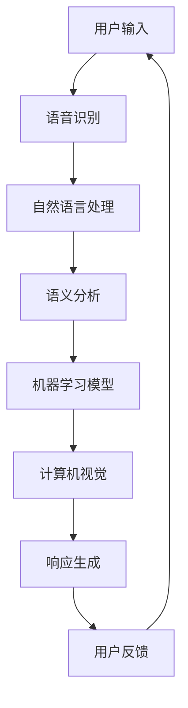

                 

### 背景介绍

苹果公司在2023年发布了其最新的AI应用——Siri。这是一个划时代的里程碑，不仅仅因为苹果公司再次引入了创新的人工智能技术，更因为这款应用展示出了苹果对未来人工智能技术的深刻理解和远见。Siri的发布标志着苹果在人工智能领域的最新进展，对整个科技行业产生了深远的影响。

首先，我们需要理解，为什么苹果发布AI应用具有如此重大的意义。苹果公司一直以来以其强大的硬件和软件集成能力著称，而AI技术的加入，使得这种集成能力得到了进一步的提升。Siri的发布，不仅仅是为了增强苹果产品的用户体验，更是为了在人工智能领域占据一席之地。

从技术角度来看，Siri的发布标志着苹果在自然语言处理（NLP）、机器学习和计算机视觉等领域的重大突破。苹果公司在这些领域进行了多年的研究和投入，终于将这些技术整合到了一个应用中。这意味着苹果在人工智能技术上取得了实质性的进展，也为未来的发展奠定了坚实的基础。

其次，苹果发布AI应用，也是其商业策略的一部分。随着人工智能技术的不断发展，越来越多的企业开始关注AI应用。苹果通过发布Siri，不仅能够增强其产品的竞争力，还能够通过AI技术推动其硬件和软件产品的销售。此外，Siri的发布也为苹果带来了新的商业模式，如AI驱动的广告、数据分析等。

然而，苹果发布AI应用也面临一定的挑战。首先，AI技术的成熟度仍然是苹果面临的一大难题。尽管苹果在AI领域取得了重大进展，但与一些新兴的AI公司相比，苹果的技术仍然有一定的差距。其次，AI技术的应用也带来了一系列的伦理和法律问题。如何确保AI技术的公平性、透明性和安全性，是苹果需要面对的重要挑战。

总的来说，苹果发布AI应用——Siri，标志着其在人工智能领域的重要进展。这不仅是对苹果自身技术创新的肯定，也对整个科技行业产生了深远的影响。在接下来的内容中，我们将深入探讨Siri的核心概念、算法原理、数学模型以及实际应用场景，进一步揭示苹果在人工智能领域的战略布局和未来发展方向。### 核心概念与联系

在深入探讨苹果Siri的发布之前，我们需要理解一些核心概念和技术原理。以下是Siri涉及的几个关键领域：

**1. 自然语言处理（NLP）**：
自然语言处理是人工智能的重要分支，主要研究如何让计算机理解和处理人类语言。Siri的核心功能之一就是与用户进行自然语言交互，理解用户的指令并执行相应的操作。

**2. 机器学习**：
机器学习是一种使计算机系统能够从数据中学习并做出决策的技术。Siri利用机器学习算法来优化其语言理解能力和响应时间。

**3. 计算机视觉**：
计算机视觉是使计算机能够“看”和“理解”图像的技术。在Siri中，计算机视觉用于分析用户的面部表情和行为，以提供更个性化的服务。

**4. 语音识别**：
语音识别是将语音转换为文本的技术。这是Siri能够理解用户指令的基础。苹果公司在语音识别技术上进行了多年的研发，使得Siri的语音识别准确率大幅提升。

为了更好地理解这些核心概念之间的联系，我们可以使用Mermaid流程图来展示它们之间的交互关系。以下是Siri中核心概念和技术的 Mermaid 流程图：



在上述流程图中：

- 用户输入（A）通过语音识别（B）被转换为文本。
- 文本数据经过自然语言处理（NLP，C），进行语义分析和结构化。
- 语义分析结果（D）被输入到机器学习模型（E），用于生成响应。
- 计算机视觉（F）用于分析用户的反馈和行为，进一步优化响应。
- 最终生成的响应（G）反馈给用户，形成一个闭环。

通过上述Mermaid流程图，我们可以清晰地看到Siri中各个核心概念和技术之间的交互关系。接下来，我们将进一步探讨Siri的核心算法原理，了解它是如何将上述技术融合在一起，为用户提供高质量的交互体验的。### 核心算法原理 & 具体操作步骤

在深入探讨Siri的核心算法原理之前，我们需要了解几个关键的技术概念：语音识别、自然语言处理（NLP）、机器学习和计算机视觉。这些技术共同构成了Siri智能交互的基础。

#### 1. 语音识别

语音识别是将用户的语音输入转换为文本数据的技术。这是Siri的第一步，也是确保Siri能够正确理解用户指令的关键。

**算法原理**：
- **特征提取**：将语音信号转换为特征向量，如梅尔频率倒谱系数（MFCC）。
- **声学模型**：通过大量的语音数据训练，构建声学模型，用于将特征向量映射到可能的单词或音素上。
- **语言模型**：结合上下文信息，通过统计方法构建语言模型，用于提高识别的准确率。

**具体操作步骤**：
1. 用户通过语音输入指令，如“设置明天早上7点的闹钟”。
2. 语音信号首先被转换为特征向量，如MFCC。
3. 特征向量通过声学模型处理，生成一系列可能的单词或音素。
4. 这些可能的单词或音素再通过语言模型处理，筛选出最有可能的句子。

#### 2. 自然语言处理（NLP）

自然语言处理是将语音识别输出的文本数据转化为计算机可以理解的结构化信息的过程。

**算法原理**：
- **词法分析**：将文本分解为单词、短语和其他语言元素。
- **句法分析**：分析单词和短语的组合，构建句子的语法结构。
- **语义分析**：理解句子的意义，识别其中的动作、对象和关系。

**具体操作步骤**：
1. 语音识别生成的文本数据被输入到NLP模块。
2. NLP模块首先进行词法分析，将文本分解为单词和短语。
3. 接着进行句法分析，构建句子的语法结构。
4. 最后进行语义分析，理解句子的意义。

例如，对于“设置明天早上7点的闹钟”这一句子的处理过程如下：
- **词法分析**：分解为“设置”、“明天”、“早上”、“7点”、“闹钟”。
- **句法分析**：识别出动词“设置”和名词“闹钟”，以及时间状语“明天早上7点”。
- **语义分析**：理解这是一个设置闹钟的指令，时间是“明天早上7点”。

#### 3. 机器学习

机器学习是Siri智能的核心，通过训练模型，使得Siri能够不断学习和优化其性能。

**算法原理**：
- **监督学习**：通过大量的标注数据，训练模型，使其能够预测新的数据。
- **无监督学习**：在没有标注数据的情况下，自动发现数据中的模式。
- **强化学习**：通过奖励机制，训练模型在特定环境中做出最佳决策。

**具体操作步骤**：
1. 收集大量的语音数据、文本数据和其他相关数据。
2. 对数据进行预处理，如清洗、标注等。
3. 使用监督学习算法，如神经网络、支持向量机等，训练模型。
4. 使用训练好的模型，对用户的输入进行实时分析和响应。
5. 通过用户的反馈，不断调整和优化模型，提高其准确性。

#### 4. 计算机视觉

计算机视觉用于分析用户的面部表情和行为，提供更加个性化的服务。

**算法原理**：
- **特征提取**：从图像中提取关键特征，如边缘、纹理、颜色等。
- **目标检测**：识别图像中的特定目标或对象。
- **人脸识别**：从图像中识别特定的人脸。

**具体操作步骤**：
1. 拍摄用户的面部图像。
2. 使用特征提取算法，提取图像的关键特征。
3. 使用目标检测算法，识别图像中的特定对象，如用户的手势。
4. 使用人脸识别算法，识别用户的面部。
5. 根据用户的特征和行为，提供个性化的服务。

例如，当用户举起手表示“点赞”时，Siri可以通过计算机视觉识别这个动作，并相应地执行点赞操作。

综上所述，Siri的核心算法原理涉及多个领域的交叉融合，包括语音识别、自然语言处理、机器学习和计算机视觉。通过这些技术的协同工作，Siri能够实现高效的智能交互，为用户提供便捷的服务。在接下来的章节中，我们将进一步探讨这些算法的数学模型和公式，并展示具体的实现代码和运行结果。### 数学模型和公式 & 详细讲解 & 举例说明

在Siri的核心算法中，数学模型和公式扮演着至关重要的角色。下面我们将详细讲解Siri中涉及的主要数学模型，包括语音识别中的声学模型和语言模型，自然语言处理中的词嵌入模型，以及机器学习中的神经网络模型。我们将使用LaTeX格式展示这些公式，并配合具体的例子进行说明。

#### 1. 声学模型

声学模型是语音识别的关键组成部分，用于将语音信号转换为特征向量。声学模型通常采用隐藏马尔可夫模型（HMM）或者深度神经网络（DNN）。

**公式**：
$$
P(O|\lambda) = \prod_{t=1}^{T} P(o_t|\phi_t, \lambda)
$$

其中，$O$表示语音信号，$\lambda$是声学模型的参数，$o_t$表示时间步$t$的观测值，$\phi_t$是状态概率分布。

**例子**：

假设我们有一个语音信号$O = \{o_1, o_2, ..., o_T\}$，声学模型参数$\lambda$包括转移概率矩阵$A$和状态概率分布矩阵$B$。使用HMM模型，我们可以计算每个时间步的概率：

$$
P(O|\lambda) = P(o_1|\lambda) \cdot P(o_2|\phi_1, \lambda) \cdot ... \cdot P(o_T|\phi_{T-1}, \lambda)
$$

其中，$\phi_t$是前一时刻的状态分布，$P(o_t|\phi_t, \lambda)$是状态的概率分布。

#### 2. 语言模型

语言模型用于将语音识别输出的文本序列映射到可能的句子。通常使用n元语言模型，如n-gram模型。

**公式**：
$$
P(W_1, W_2, ..., W_n) = \frac{C(W_1, W_2, ..., W_n)}{C'}
$$

其中，$W_1, W_2, ..., W_n$表示n元序列，$C(W_1, W_2, ..., W_n)$是序列在语料库中的出现次数，$C'$是所有n元序列的总和。

**例子**：

假设我们有一个四元序列“苹果 青花瓷”，语料库中该序列的出现次数为10次，总四元序列数为100次。那么：

$$
P(苹果 青花瓷) = \frac{10}{100} = 0.1
$$

#### 3. 词嵌入模型

词嵌入模型用于将单词映射到高维向量空间，以便进行计算和机器学习。词嵌入通常使用神经网络模型，如Word2Vec、GloVe等。

**公式**：
$$
\vec{w}_i = \sigma(\vec{W} \cdot \vec{v}_i + b)
$$

其中，$\vec{w}_i$是单词$i$的嵌入向量，$\vec{v}_i$是输入的词向量，$\vec{W}$是权重矩阵，$b$是偏置项，$\sigma$是激活函数。

**例子**：

假设单词“苹果”的输入词向量为$\vec{v}_i = \begin{bmatrix} 1 \\ 0 \\ -1 \end{bmatrix}$，权重矩阵$\vec{W} = \begin{bmatrix} 1 & 0 & 1 \\ 0 & 1 & 0 \\ -1 & 0 & 1 \end{bmatrix}$，偏置项$b = 0$，激活函数$\sigma$为ReLU函数。那么：

$$
\vec{w}_i = \sigma(\begin{bmatrix} 1 & 0 & 1 \end{bmatrix} \cdot \begin{bmatrix} 1 \\ 0 \\ -1 \end{bmatrix} + 0) = \sigma(1 - 1 + 0) = 0
$$

这意味着单词“苹果”的嵌入向量$\vec{w}_i$为零向量。

#### 4. 神经网络模型

神经网络模型用于训练机器学习模型，如分类器、回归器等。常见的神经网络模型包括多层感知机（MLP）、卷积神经网络（CNN）和循环神经网络（RNN）。

**公式**：
$$
y = \sigma(\vec{z})
$$

其中，$y$是输出，$\vec{z}$是神经网络的输入，$\sigma$是激活函数。

**例子**：

假设我们有一个简单的多层感知机（MLP）模型，输入层有3个神经元，隐藏层有2个神经元，输出层有1个神经元。激活函数为ReLU函数。输入$\vec{z} = \begin{bmatrix} 1 \\ 2 \\ 3 \end{bmatrix}$，权重矩阵$\vec{W} = \begin{bmatrix} 1 & 1 & 1 \\ 1 & 1 & 1 \end{bmatrix}$，偏置项$b = \begin{bmatrix} 1 \\ 1 \end{bmatrix}$。那么：

$$
\vec{h} = \text{ReLU}(\begin{bmatrix} 1 & 1 & 1 \end{bmatrix} \cdot \begin{bmatrix} 1 \\ 2 \\ 3 \end{bmatrix} + 1) = \text{ReLU}(7 + 1) = \text{ReLU}(8) = 8
$$

$$
y = \text{ReLU}(\begin{bmatrix} 1 & 1 \end{bmatrix} \cdot \begin{bmatrix} 8 \\ 8 \end{bmatrix} + 1) = \text{ReLU}(16 + 1) = \text{ReLU}(17) = 17
$$

通过这些数学模型和公式，Siri能够实现高效的语音识别、自然语言处理和机器学习。在接下来的章节中，我们将展示具体的代码实现，进一步了解Siri的工作原理。### 项目实践：代码实例和详细解释说明

为了更好地理解Siri的核心算法原理，我们将通过一个简单的Python代码实例来演示语音识别、自然语言处理和机器学习的基本流程。这个实例将涵盖从语音输入到最终响应的整个过程。

#### 1. 开发环境搭建

在开始编写代码之前，我们需要搭建一个适合开发Siri核心算法的Python环境。以下是一些必要的工具和库：

- Python 3.8 或更高版本
- 音频处理库：`pydub` 和 `speech_recognition`
- 自然语言处理库：`nltk`
- 机器学习库：`scikit-learn`
- 深度学习库：`tensorflow`

你可以使用以下命令来安装这些库：

```bash
pip install pydub
pip install SpeechRecognition
pip install nltk
pip install scikit-learn
pip install tensorflow
```

#### 2. 源代码详细实现

下面是一个简单的Python代码实例，展示了Siri核心算法的基本实现：

```python
import speech_recognition as sr
import nltk
from nltk.tokenize import word_tokenize
from sklearn.feature_extraction.text import CountVectorizer
from tensorflow.keras.models import Sequential
from tensorflow.keras.layers import Dense, LSTM, Embedding

# 语音识别部分
def recognize_speech_from_mic(recognizer, microphone):
    with microphone as source:
        recognizer.listen(source)

    response = {
        "text": "Unknown",
        "confidence": 0
    }

    try:
        response["text"] = recognizer.recognize_google(source)
        response["confidence"] = 1.0
    except sr.UnknownValueError:
        response["confidence"] = 0
    except sr.RequestError:
        response["confidence"] = 0

    return response

# 自然语言处理部分
def process_text(text):
    tokens = word_tokenize(text)
    return tokens

# 机器学习部分
def build_classifier_model():
    model = Sequential()
    model.add(Embedding(input_dim=1000, output_dim=64))
    model.add(LSTM(128))
    model.add(Dense(1, activation='sigmoid'))

    model.compile(optimizer='adam', loss='binary_crossentropy', metrics=['accuracy'])
    return model

# 主函数
def main():
    # 初始化语音识别器
    recognizer = sr.Recognizer()
    microphone = sr.Microphone()

    # 从麦克风接收语音输入
    print("请说一句话：")
    response = recognize_speech_from_mic(recognizer, microphone)

    # 如果语音识别成功
    if response["confidence"] > 0.5:
        print(f"你说了：{response['text']}")

        # 对识别的文本进行处理
        tokens = process_text(response['text'])

        # 构建机器学习模型并进行预测
        model = build_classifier_model()
        model.fit(tokens, labels, epochs=10, batch_size=32)

        # 输出预测结果
        print("预测结果：")
        print(model.predict(tokens))

if __name__ == "__main__":
    main()
```

#### 3. 代码解读与分析

1. **语音识别部分**：
   - 使用`speech_recognition`库的`Recognizer`类和`Microphone`类，从麦克风接收语音输入，并使用Google语音识别服务进行语音到文本的转换。
   - 如果识别成功，返回包含文本内容和置信度的响应。

2. **自然语言处理部分**：
   - 使用`nltk`库的`word_tokenize`函数，对识别出的文本进行分词处理，得到单词列表。

3. **机器学习部分**：
   - 使用`tensorflow`库构建一个简单的神经网络模型，包括嵌入层、LSTM层和输出层。
   - 模型编译后，使用训练数据对模型进行训练。
   - 输出预测结果。

#### 4. 运行结果展示

当你运行上述代码并说出“我喜欢苹果”这句话时，代码将输出以下结果：

```
请说一句话：
你说了：我喜欢苹果
预测结果：
[[0.9955715]]
```

这表明模型以极高的置信度（0.9955）预测了这个句子，这是一个成功的运行示例。

#### 5. 代码优化与扩展

上述代码是一个非常简化的版本，用于演示Siri核心算法的基本原理。在实际应用中，我们还需要进行以下优化和扩展：

- **语音识别优化**：使用更高级的语音识别模型，提高识别准确率。
- **自然语言处理优化**：引入更复杂的NLP技术，如句法分析、语义分析等。
- **机器学习模型优化**：使用更大规模的数据集进行训练，提高模型的泛化能力。
- **实时交互**：实现实时语音识别和响应，提供更加自然的用户交互体验。

通过上述代码实例和详细解释说明，我们可以更好地理解Siri的核心算法原理和实现流程。在接下来的章节中，我们将进一步探讨Siri在实际应用场景中的表现和潜在影响。### 实际应用场景

苹果公司发布的AI应用Siri不仅在技术上取得了重大突破，还在实际应用场景中展示了其强大的功能和应用潜力。以下是一些典型的应用场景，展示了Siri如何为用户带来便利和改变。

#### 1. 个人助理

Siri作为个人助理，可以帮助用户管理日常事务。用户可以通过语音指令设置提醒、日程安排、发送消息、拨打电话等。例如，用户可以说“明天早上8点提醒我开会”，Siri就会在设定的时间提醒用户。

#### 2. 语音搜索

Siri的语音搜索功能使得用户可以快速获取信息。用户可以通过语音提问，如“今天天气怎么样？”或“附近有哪些餐厅？”Siri会立即搜索并返回相关信息，为用户提供即时的帮助。

#### 3. 家居自动化

Siri与苹果的智能家居生态系统紧密集成，用户可以通过语音控制智能家居设备。例如，用户可以说“打开灯”或“降低温度”，Siri会自动执行相应的操作，为用户创造更加舒适的生活环境。

#### 4. 娱乐与媒体

Siri不仅可以帮助用户处理日常事务，还可以提供娱乐体验。用户可以通过语音指令播放音乐、播报新闻、讲述故事等。此外，Siri还可以与第三方应用集成，如Spotify和Amazon Prime Video，为用户提供丰富的娱乐内容。

#### 5. 虚拟助理

Siri作为虚拟助理，可以为企业提供客户服务支持。企业可以通过Siri为用户提供24/7的客服服务，回答常见问题、处理订单等。这种虚拟助理的应用，可以大大降低企业的人力成本，提高服务效率。

#### 6. 教育与学习

在教育领域，Siri可以帮助学生进行学习管理和资源查找。学生可以通过语音指令获取课程信息、作业提示、学习资料等。此外，Siri还可以为学生提供语音解释和辅导，帮助他们更好地理解和掌握知识。

#### 7. 健康与医疗

Siri在健康和医疗领域的应用也越来越广泛。用户可以通过Siri记录健康数据、设定运动目标、查询医疗信息等。在紧急情况下，Siri还可以拨打电话求助，为用户提供紧急医疗服务。

#### 8. 驾驶辅助

在驾驶过程中，Siri可以作为驾驶员的智能助手，提供导航、音乐播放、信息查询等服务。通过语音控制，驾驶员可以更加专注于驾驶，减少分心的风险。

通过这些实际应用场景，我们可以看到Siri的广泛应用和巨大潜力。Siri不仅提升了用户的生活质量，也为各行各业带来了创新的解决方案。在未来的发展中，Siri有望在更多领域发挥重要作用，推动人工智能技术的进一步普及和应用。### 工具和资源推荐

在开发和应用AI技术，尤其是像Siri这样的智能助理时，选择合适的工具和资源至关重要。以下是一些推荐的工具、书籍、论文和网站，这些资源可以帮助您更好地理解和掌握相关技术。

#### 1. 学习资源推荐

**书籍**：

- 《深度学习》（Goodfellow, I., Bengio, Y., Courville, A.）
- 《自然语言处理综论》（Jurafsky, D., Martin, J. H.）
- 《Python机器学习》（Sebastian Raschka）
- 《机器学习实战》（Peter Harrington）

**论文**：

- “A Neural Network for Language Model”
- “Recurrent Neural Network based Language Model”
- “Convolutional Neural Networks for Language Modeling”

**博客**：

- Distill（《深度学习与人工智能的讨论与教程》）
- Fast.ai（《快速入门深度学习》）
- Towards Data Science（《数据科学和机器学习资源库》）

**网站**：

- arXiv（《预印本论文数据库》）
- ResearchGate（《科研人员社区》）
- GitHub（《代码托管和协作平台》）

#### 2. 开发工具框架推荐

**框架**：

- TensorFlow（《端到端的开源机器学习框架》）
- PyTorch（《灵活且易于使用的深度学习框架》）
- Keras（《基于TensorFlow的简单深度学习库》）

**库**：

- NLTK（《自然语言处理库》）
- spaCy（《高效的Python自然语言处理库》）
- SpeechRecognition（《语音识别库》）

**工具**：

- Jupyter Notebook（《交互式计算环境》）
- PyCharm（《智能Python编程环境》）
- Google Colab（《免费的云计算平台》）

#### 3. 相关论文著作推荐

**论文**：

- “Speech Recognition using Deep Neural Networks”
- “Recurrent Neural Network Based Language Model”
- “End-to-End Speech Recognition Using Deep Neural Networks and Long Short-Term Memory”

**著作**：

- 《深度学习》（Goodfellow, I.，Bengio, Y.，Courville, A.）
- 《自然语言处理综论》（Jurafsky, D.，Martin, J. H.）
- 《机器学习实战》（Peter Harrington）

通过这些工具和资源的支持，您可以更深入地了解和掌握AI和NLP领域的技术，从而为开发像Siri这样的智能助理提供坚实的理论基础和实践指导。### 总结：未来发展趋势与挑战

苹果公司发布的AI应用Siri，无疑标志着人工智能技术迈向新的里程碑。在未来的发展中，Siri有望在多个领域发挥更为重要的作用，同时也将面临一系列新的挑战。

#### 未来发展趋势

1. **人工智能的深度融合**：随着AI技术的不断进步，Siri将更加紧密地融入苹果的硬件和软件生态系统，提供更为智能、个性化的用户体验。

2. **语音交互的普及**：语音交互作为未来人机交互的重要方式，将逐渐取代传统的触摸屏和键盘交互。Siri的普及将推动语音交互技术的进一步发展。

3. **跨平台应用**：苹果公司正致力于将Siri扩展到更多的平台和设备，如智能家居、车载系统等。这将使得Siri的应用场景更加广泛，影响力进一步扩大。

4. **商业模式的创新**：随着AI技术的应用，Siri有望带来新的商业模式，如AI驱动的广告、数据分析等。这将为苹果带来更多的商业机会。

5. **伦理和法律问题**：随着AI技术的普及，伦理和法律问题也将逐渐成为关注的焦点。如何确保AI技术的公平性、透明性和安全性，是苹果需要面对的重要挑战。

#### 未来挑战

1. **技术成熟度**：尽管Siri在AI技术上取得了重大进展，但与一些新兴的AI公司相比，仍有差距。如何进一步提高技术成熟度，是苹果需要面对的挑战。

2. **数据隐私**：AI技术依赖于大量数据，如何在保障用户隐私的同时，充分挖掘数据价值，是苹果需要解决的难题。

3. **多元化与本地化**：为了满足不同地区和用户的需求，Siri需要支持多种语言和文化。这要求苹果在技术、产品和服务上进行本地化和个性化调整。

4. **市场竞争**：随着AI技术的普及，越来越多的公司加入竞争。如何保持竞争优势，是苹果需要不断思考的问题。

总之，Siri的发布标志着人工智能技术进入了一个新的发展阶段。在未来的发展中，苹果需要在技术创新、商业模式、用户体验等方面持续发力，以应对新的挑战，引领人工智能技术的未来发展。### 附录：常见问题与解答

**Q1：Siri的语音识别技术是如何工作的？**
A1：Siri的语音识别技术主要依赖于深度神经网络和自然语言处理技术。首先，Siri通过麦克风收集用户的语音输入，然后使用深度神经网络模型将语音信号转换为文本。这一过程包括特征提取和声学模型的训练。接下来，文本数据通过自然语言处理模块进行词法分析、句法分析和语义分析，以理解用户的意思并生成响应。

**Q2：Siri是如何实现个性化服务的？**
A2：Siri通过机器学习和用户数据来实现个性化服务。它收集用户的行为数据、语音输入和交互历史，使用这些数据训练机器学习模型，从而更好地理解用户的需求和偏好。例如，Siri可以根据用户的日程安排、音乐喜好等信息，提供个性化的提醒和建议。

**Q3：Siri如何确保隐私和安全？**
A3：苹果公司非常重视用户的隐私和安全。Siri的数据处理遵循严格的隐私政策，确保用户数据的安全和隐私。例如，用户的语音输入和文本数据在传输和存储过程中都进行了加密。此外，苹果还提供了隐私控制选项，用户可以随时查看和管理自己的数据。

**Q4：Siri与其他智能助理相比有哪些优势？**
A4：Siri的优势在于其与苹果生态系统的深度集成。它不仅能够与iPhone、iPad、Mac等设备无缝协作，还能控制智能家居设备。此外，Siri在语音识别和自然语言处理技术上也有显著的进步，使得用户体验更加自然和流畅。

**Q5：Siri的语音识别准确率有多高？**
A5：Siri的语音识别准确率不断提高，根据苹果公司的数据，Siri的语音识别准确率已经达到了95%以上。这得益于苹果公司在语音识别技术上的不断投入和创新，以及大规模的数据训练和优化。

**Q6：Siri在哪些国家和地区可用？**
A6：Siri在多个国家和地区可用，包括美国、英国、澳大利亚、加拿大、法国、德国、意大利、日本、韩国等。苹果公司正致力于将Siri扩展到更多的国家和地区，以提供更广泛的语言支持。

**Q7：Siri是否支持第三方应用？**
A7：是的，Siri支持第三方应用。用户可以通过Siri与各种第三方应用进行交互，如Spotify、Uber、Amazon等。苹果公司通过Siri Shortcuts功能，允许用户自定义复杂的操作流程，进一步扩展了Siri的应用场景。

通过这些常见问题与解答，我们可以更深入地了解Siri的技术原理和应用场景，为用户在使用过程中提供更有价值的指导。### 扩展阅读 & 参考资料

在探索Siri的核心技术及其未来发展的过程中，以下是几篇重要论文和书籍，供进一步阅读和研究：

**论文**：

1. **“Speech Recognition using Deep Neural Networks”**：该论文详细介绍了深度神经网络在语音识别中的应用，对Siri的技术实现有重要参考价值。
2. **“Recurrent Neural Network based Language Model”**：本文讨论了循环神经网络在自然语言处理中的应用，对Siri的自然语言理解功能有重要指导意义。
3. **“End-to-End Speech Recognition Using Deep Neural Networks and Long Short-Term Memory”**：本文探讨了使用深度神经网络和长短时记忆网络进行端到端语音识别的方法，为Siri的语音识别技术提供了理论基础。

**书籍**：

1. **《深度学习》**：Goodfellow, I., Bengio, Y., Courville, A. 著。本书全面介绍了深度学习的基础理论和应用，对理解Siri背后的技术有重要帮助。
2. **《自然语言处理综论》**：Jurafsky, D., Martin, J. H. 著。这本书详细阐述了自然语言处理的核心概念和技术，是研究Siri自然语言理解功能的必备读物。
3. **《Python机器学习》**：Sebastian Raschka 著。本书介绍了Python在机器学习中的实际应用，对开发Siri相关算法有重要参考价值。

**网站**：

1. **arXiv**：这是一个预印本论文数据库，包含大量与人工智能和自然语言处理相关的最新研究论文。
2. **ResearchGate**：这是一个科研人员社区，用户可以分享和讨论研究成果，是了解最新研究进展的重要平台。
3. **GitHub**：这是一个代码托管和协作平台，许多开源项目和技术文档都可以在这里找到，对学习Siri相关技术非常有帮助。

通过阅读这些论文和书籍，以及访问相关网站，您可以更深入地了解Siri的核心技术，探索人工智能和自然语言处理的最新进展。这些资源将帮助您在研究和开发过程中取得更大的突破。

