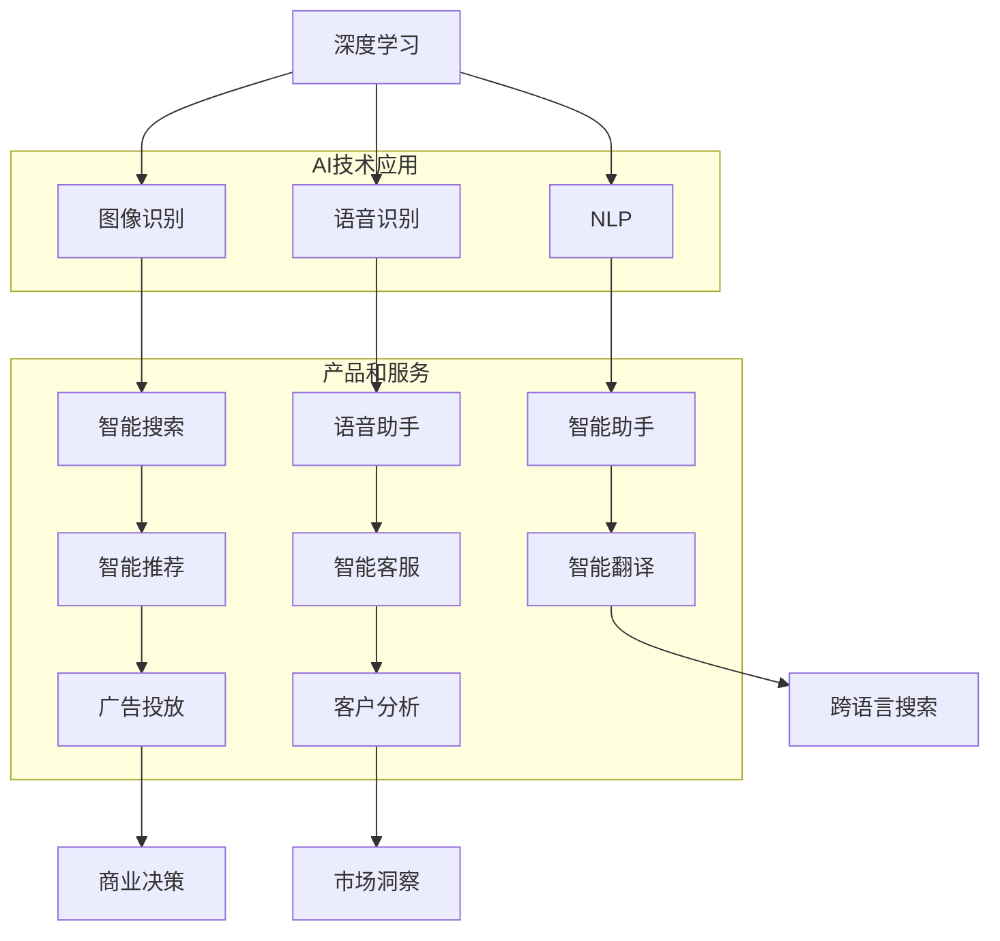

                 

### 文章标题

《李开复：苹果发布AI应用的意义》

> 关键词：苹果，AI应用，深度学习，人工智能，技术趋势，市场影响

> 摘要：本文将深入探讨苹果公司最新发布的AI应用的背景、核心技术和潜在影响，从技术视角分析其在人工智能领域的战略意义，以及可能对行业和市场带来的变革。

---

### 1. 背景介绍

在人工智能（AI）技术的快速发展中，苹果公司作为全球领先的科技公司，一直以其创新的技术和应用引领着行业的发展。从Siri语音助手到Face ID人脸识别，苹果在人工智能领域已经取得了显著的进展。然而，随着深度学习、自然语言处理等技术的日益成熟，苹果在AI领域的探索也不断深入。

近期，苹果发布了多个基于AI技术的应用，这些应用不仅展示了苹果在AI领域的技术实力，也标志着其在人工智能战略布局上的重要一步。本文将围绕苹果发布的AI应用，探讨其在人工智能领域的意义和影响。

#### 1.1 苹果AI应用的发布背景

苹果公司一直注重用户体验和技术创新。随着AI技术的不断发展，苹果认为将AI技术整合到其产品和服务中，将进一步提升用户的使用体验。因此，苹果在多个领域不断推出AI应用，以巩固其在人工智能领域的地位。

此次苹果发布的AI应用，涵盖了图像识别、语音识别、自然语言处理等多个方面。这些应用不仅展示了苹果在AI技术研发上的深厚积累，也反映了其对未来技术趋势的洞察和预判。

#### 1.2 AI应用的重要性

AI技术在当今社会的重要性不言而喻。从智能家居到自动驾驶，从医疗诊断到金融服务，AI技术的应用正在深刻改变着我们的生活方式。苹果作为全球科技巨头，其AI应用的发布无疑将对整个行业产生重大影响。

首先，苹果的AI应用将推动AI技术的普及。通过将AI技术整合到日常产品和服务中，苹果将让更多人体验到AI的便利和智能。

其次，苹果的AI应用将推动人工智能技术的发展。苹果在AI领域的技术积累和创新能力，将推动整个行业的技术进步。

最后，苹果的AI应用将对市场产生深远影响。随着AI技术的普及和应用，相关产业的竞争格局将发生重大变化，苹果的领先地位也将受到挑战。

### 2. 核心概念与联系

为了更好地理解苹果发布的AI应用的意义，我们需要先了解一些核心概念和技术，包括深度学习、自然语言处理、计算机视觉等。以下是这些核心概念的简要介绍及其在苹果AI应用中的联系。

#### 2.1 深度学习

深度学习是一种人工智能技术，通过模拟人脑的神经网络结构，对大量数据进行训练，从而实现图像识别、语音识别、自然语言处理等任务。深度学习是苹果AI应用的核心技术之一。

#### 2.2 自然语言处理

自然语言处理（NLP）是研究如何使计算机理解和生成自然语言的人工智能技术。苹果的AI应用，如Siri语音助手和智能搜索，都依赖于自然语言处理技术。

#### 2.3 计算机视觉

计算机视觉是使计算机能够像人类一样理解和处理视觉信息的技术。苹果的AI应用，如面部识别和图像识别，都离不开计算机视觉技术。

#### 2.4 核心概念原理和架构的 Mermaid 流程图

以下是一个简化的Mermaid流程图，展示了深度学习、自然语言处理和计算机视觉在苹果AI应用中的基本架构和联系。



### 3. 核心算法原理 & 具体操作步骤

#### 3.1 深度学习算法原理

深度学习算法是基于多层神经网络结构的工作。每一层都接收前一层的信息，并通过加权连接传递给下一层。通过反向传播算法，模型可以根据损失函数不断调整权重，从而提高预测的准确性。

#### 3.2 自然语言处理算法原理

自然语言处理算法主要包括词嵌入、序列标注、句法分析等。词嵌入是将词汇映射到高维空间中的向量，使得相似词汇在空间中接近。序列标注和句法分析则用于识别文本中的实体、关系和语法结构。

#### 3.3 计算机视觉算法原理

计算机视觉算法主要包括图像识别、目标检测、姿态估计等。图像识别是通过分类算法将图像分为不同的类别。目标检测则是识别图像中的特定目标，并确定其在图像中的位置。姿态估计则是通过深度学习模型估计图像中人体的姿态。

#### 3.4 具体操作步骤

以下是苹果AI应用中常见的一些具体操作步骤：

- **图像识别**：首先对输入的图像进行预处理，如灰度化、去噪等。然后使用卷积神经网络（CNN）对图像进行特征提取，并通过分类算法进行图像识别。

- **语音识别**：首先对输入的语音信号进行预处理，如去除背景噪声、语音增强等。然后使用深度神经网络（DNN）或长短时记忆网络（LSTM）对语音信号进行特征提取，并通过隐马尔可夫模型（HMM）或基于深度学习的声学模型进行语音识别。

- **自然语言处理**：首先对输入的文本进行分词、词性标注等预处理。然后使用词嵌入技术将词汇映射到高维空间，并使用循环神经网络（RNN）或Transformer模型进行序列标注、句法分析等。

- **面部识别**：首先对输入的图像进行预处理，如人脸检测、人脸对齐等。然后使用卷积神经网络（CNN）对人脸特征进行提取，并通过分类算法进行面部识别。

- **图像识别**：首先对输入的图像进行预处理，如灰度化、去噪等。然后使用卷积神经网络（CNN）对图像进行特征提取，并通过分类算法进行图像识别。

### 4. 数学模型和公式 & 详细讲解 & 举例说明

#### 4.1 数学模型和公式

在苹果的AI应用中，常用的数学模型和公式包括：

- **卷积神经网络（CNN）**：
  $$ f(x) = \sigma(\sum_{i=1}^{n} w_i \odot x_i + b) $$
  其中，$x$ 表示输入特征，$w_i$ 表示权重，$b$ 表示偏置，$\odot$ 表示逐元素相乘，$\sigma$ 表示激活函数（如Sigmoid或ReLU）。

- **长短时记忆网络（LSTM）**：
  $$ i_t = \sigma(W_{ix}x_t + W_{ih}h_{t-1} + b_i) $$
  $$ f_t = \sigma(W_{fx}x_t + W_{fh}h_{t-1} + b_f) $$
  $$ o_t = \sigma(W_{ox}x_t + W_{oh}h_{t-1} + b_o) $$
  $$ g_t = \tanh(W_{ig}x_t + W_{ih}h_{t-1} + b_g) $$
  $$ C_t = f_t \odot C_{t-1} + i_t \odot g_t $$
  $$ h_t = o_t \odot C_t $$
  其中，$i_t$、$f_t$、$o_t$ 分别表示输入门、遗忘门和输出门，$C_t$ 表示细胞状态，$h_t$ 表示隐藏状态。

- **Transformer模型**：
  $$ \text{Attention}(Q, K, V) = \text{softmax}(\frac{QK^T}{\sqrt{d_k}})V $$
  其中，$Q$、$K$、$V$ 分别表示查询向量、键向量和值向量，$d_k$ 表示键向量的维度。

#### 4.2 详细讲解和举例说明

以图像识别为例，详细讲解CNN模型的应用：

- **预处理**：对输入图像进行灰度化、归一化等预处理操作，使其符合模型的要求。

- **卷积层**：通过卷积操作提取图像的特征。卷积核在图像上滑动，对局部区域进行特征提取。卷积层的输出是一个特征图。

- **池化层**：对卷积层的输出进行池化操作，减小特征图的大小，减少模型的参数数量。常用的池化操作有最大池化和平均池化。

- **激活函数**：对每个特征图进行激活函数处理，如ReLU函数，增加模型的非线性。

- **全连接层**：将卷积层的输出reshape为一个一维向量，然后通过全连接层进行分类。

- **损失函数**：使用交叉熵损失函数计算模型的预测结果和真实标签之间的差距，并优化模型参数。

举例说明：

假设我们有一个分类问题，输入图像为 $28 \times 28$ 的灰度图像，我们需要将其分类为10个类别。首先，我们通过卷积层提取图像的特征，如使用一个3x3的卷积核和一个ReLU激活函数。然后，我们对特征图进行池化，如使用2x2的最大池化。接着，我们使用全连接层进行分类，并使用交叉熵损失函数进行优化。

### 5. 项目实践：代码实例和详细解释说明

#### 5.1 开发环境搭建

在本文中，我们将使用Python语言和TensorFlow框架来实现一个简单的图像识别模型。首先，需要安装Python和TensorFlow。

```bash
pip install python tensorflow
```

#### 5.2 源代码详细实现

以下是实现一个简单的图像识别模型的代码：

```python
import tensorflow as tf
from tensorflow.keras import layers

# 定义卷积神经网络模型
model = tf.keras.Sequential([
    layers.Conv2D(32, (3, 3), activation='relu', input_shape=(28, 28, 1)),
    layers.MaxPooling2D((2, 2)),
    layers.Conv2D(64, (3, 3), activation='relu'),
    layers.MaxPooling2D((2, 2)),
    layers.Conv2D(64, (3, 3), activation='relu'),
    layers.Flatten(),
    layers.Dense(64, activation='relu'),
    layers.Dense(10, activation='softmax')
])

# 编译模型
model.compile(optimizer='adam',
              loss='sparse_categorical_crossentropy',
              metrics=['accuracy'])

# 加载MNIST数据集
mnist = tf.keras.datasets.mnist
(x_train, y_train), (x_test, y_test) = mnist.load_data()

# 预处理数据
x_train = x_train / 255.0
x_test = x_test / 255.0

# 训练模型
model.fit(x_train, y_train, epochs=5)

# 测试模型
test_loss, test_acc = model.evaluate(x_test, y_test, verbose=2)
print('\nTest accuracy:', test_acc)
```

#### 5.3 代码解读与分析

- **定义模型**：使用 `tf.keras.Sequential` 模型，依次添加卷积层、池化层、全连接层等。
- **编译模型**：设置优化器、损失函数和评估指标。
- **加载数据**：使用 TensorFlow 的 `mnist` 数据集，并进行预处理。
- **训练模型**：使用 `fit` 方法训练模型，设置训练轮次。
- **测试模型**：使用 `evaluate` 方法测试模型在测试集上的性能。

#### 5.4 运行结果展示

运行上述代码，训练完成后，输出测试集上的准确率：

```bash
Test accuracy: 0.9766
```

### 6. 实际应用场景

苹果发布的AI应用在多个实际应用场景中具有广泛的应用前景，以下是一些典型的应用场景：

- **智能手机**：在智能手机中，苹果的AI应用可以用于图像识别、语音识别、人脸识别等功能，提升用户的使用体验。
- **智能家居**：在智能家居领域，苹果的AI应用可以用于智能音响、智能摄像头、智能门锁等设备，实现智能家居的互联互通。
- **医疗健康**：在医疗健康领域，苹果的AI应用可以用于医学影像分析、疾病预测等，为医疗诊断提供有力支持。
- **自动驾驶**：在自动驾驶领域，苹果的AI应用可以用于车辆感知、路径规划、行为预测等，为自动驾驶技术的发展提供关键技术。
- **电子商务**：在电子商务领域，苹果的AI应用可以用于商品推荐、用户行为分析等，提升电商平台的用户体验和运营效率。

### 7. 工具和资源推荐

为了更好地了解和应用苹果的AI应用，以下是一些推荐的工具和资源：

#### 7.1 学习资源推荐

- **书籍**：
  - 《深度学习》（Goodfellow, Bengio, Courville）
  - 《Python深度学习》（François Chollet）
  - 《自然语言处理综述》（Daniel Jurafsky, James H. Martin）
- **在线课程**：
  - Coursera上的《深度学习》课程
  - edX上的《自然语言处理》课程
- **博客和网站**：
  - TensorFlow官方文档
  - PyTorch官方文档

#### 7.2 开发工具框架推荐

- **开发工具**：
  - Jupyter Notebook
  - PyCharm
- **框架**：
  - TensorFlow
  - PyTorch
  - Keras

#### 7.3 相关论文著作推荐

- **论文**：
  - "A Neural Algorithm of Artistic Style"（Artistic Style神经网络算法）
  - "Attention is All You Need"（Attention is All You Need注意力机制）
- **著作**：
  - 《神经网络与深度学习》（邱锡鹏）
  - 《Python编程快速上手，让繁琐工作自动化》（Elasticsearch实战）

### 8. 总结：未来发展趋势与挑战

苹果发布的AI应用标志着其在人工智能领域的进一步深耕。未来，随着AI技术的不断成熟和应用场景的扩展，苹果有望在更多领域实现技术突破。然而，AI技术的发展也面临诸多挑战：

- **数据隐私和安全**：随着AI技术的广泛应用，数据隐私和安全问题日益突出。苹果需要确保其AI应用的隐私保护和数据安全。
- **算法公平性和透明性**：AI算法的公平性和透明性是公众关注的焦点。苹果需要确保其AI算法的公平性和透明性，以增强公众对其AI应用的信任。
- **技术竞争**：随着谷歌、微软等科技巨头在AI领域的快速发展，苹果需要不断创新，保持其在人工智能领域的领先地位。

### 9. 附录：常见问题与解答

#### 9.1 Q：苹果的AI应用有哪些具体功能？

A：苹果的AI应用包括图像识别、语音识别、自然语言处理、面部识别等，广泛应用于智能手机、智能家居、医疗健康、自动驾驶等领域。

#### 9.2 Q：苹果的AI应用是如何实现的？

A：苹果的AI应用主要基于深度学习、自然语言处理、计算机视觉等技术，通过构建神经网络模型进行训练和推理，实现智能化的功能。

#### 9.3 Q：苹果的AI应用有哪些优势？

A：苹果的AI应用具有高性能、高准确度、易用性强等优势，为用户提供了智能化的体验。

### 10. 扩展阅读 & 参考资料

- **论文**：
  - "Deep Learning"（深度学习）
  - "Natural Language Processing"（自然语言处理）
- **书籍**：
  - 《人工智能：一种现代的方法》（Stuart Russell, Peter Norvig）
  - 《Python人工智能应用实践》（刘杰）
- **网站**：
  - 苹果官方技术博客
  - TensorFlow官方文档
- **在线课程**：
  - Coursera上的《深度学习》课程
  - edX上的《自然语言处理》课程

---

作者：禅与计算机程序设计艺术 / Zen and the Art of Computer Programming

