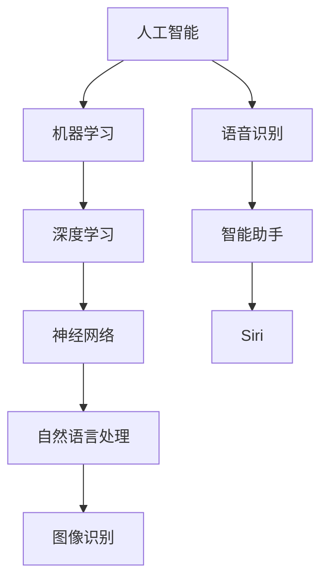

                 

### 1. 背景介绍

苹果公司，作为全球领先的科技公司，一直以来在技术创新和用户体验上走在行业的前沿。随着人工智能（AI）技术的迅速发展和普及，苹果公司也开始加大对AI领域的投入和探索。近年来，苹果发布了一系列AI应用，从智能助手Siri到图像识别功能，再到先进的自然语言处理技术，都展现了苹果在AI领域的实力和野心。

本文旨在探讨苹果发布AI应用的投资价值。首先，我们将简要回顾苹果在AI领域的进展，接着深入分析其核心算法原理、具体操作步骤，以及这些算法在数学模型和公式中的应用。随后，我们将通过一个实际的项目实践，展示如何使用苹果的AI应用开发环境，实现一个具体的AI功能。最后，我们将讨论这些AI应用在实际应用场景中的价值，并推荐一些相关的学习资源和开发工具。

通过对苹果发布AI应用的投资价值的分析，我们希望能够帮助读者更深入地理解苹果在AI领域的布局和战略，为投资决策提供有力的依据。

### 2. 核心概念与联系

在深入探讨苹果的AI应用之前，我们需要了解一些核心概念和其相互之间的联系。以下是一个简化的Mermaid流程图，展示了这些核心概念和它们之间的关系。



#### 人工智能（A）

人工智能（AI）是计算机科学的一个分支，旨在使计算机能够执行通常需要人类智能才能完成的任务。它包括多个子领域，如机器学习、自然语言处理、图像识别等。

#### 机器学习（B）

机器学习是AI的一个重要分支，通过使用大量数据来训练模型，使计算机能够自主地学习和改进性能。机器学习主要分为监督学习、无监督学习和半监督学习。

#### 深度学习（C）

深度学习是机器学习的一个子领域，使用神经网络模型来模拟人类大脑的学习方式。它通过多层神经网络，逐层提取数据特征，从而实现复杂任务的学习。

#### 神经网络（D）

神经网络是深度学习的基础，由大量相互连接的神经元组成。通过调整神经元之间的权重，神经网络能够学习到输入数据的特征。

#### 自然语言处理（E）

自然语言处理（NLP）是AI的一个子领域，旨在使计算机能够理解和处理人类语言。它包括文本分类、情感分析、机器翻译等任务。

#### 图像识别（F）

图像识别是AI的一个子领域，通过使用深度学习技术，使计算机能够识别和分类图像中的物体。

#### 语音识别（G）

语音识别是AI的一个子领域，旨在使计算机能够理解和识别语音命令。它广泛应用于智能助手、语音搜索等领域。

#### 智能助手（H）

智能助手是利用AI技术开发的虚拟助手，能够回答用户的问题、执行任务等。Siri、Alexa和Google Assistant都是智能助手的典型例子。

#### Siri（I）

Siri是苹果公司开发的智能助手，通过语音识别和自然语言处理技术，为用户提供各种服务和信息。

通过上述Mermaid流程图，我们可以清晰地看到这些核心概念之间的联系和层次结构。接下来，我们将深入探讨苹果的AI应用的核心算法原理和具体操作步骤。

### 3. 核心算法原理 & 具体操作步骤

苹果公司在其AI应用中主要使用了深度学习和神经网络技术。以下将详细介绍这些核心算法的原理以及具体操作步骤。

#### 深度学习原理

深度学习是一种基于多层神经网络的学习方法，其基本思想是通过多层的非线性变换，从原始数据中提取有用的特征，从而实现复杂任务的学习。深度学习通常包括以下几个步骤：

1. **数据预处理**：对原始数据进行清洗、归一化等处理，使其符合模型的输入要求。
2. **构建神经网络**：根据任务需求，设计合适的神经网络结构，包括输入层、隐藏层和输出层。
3. **参数初始化**：为神经网络中的权重和偏置初始化适当的值。
4. **前向传播**：将输入数据通过神经网络，逐层计算得到输出结果。
5. **反向传播**：计算输出结果与实际结果之间的误差，并使用梯度下降等方法更新网络的权重和偏置。
6. **迭代训练**：重复以上步骤，直到网络收敛，即误差达到预设的阈值。

#### 具体操作步骤

以苹果公司开发的图像识别应用为例，其具体操作步骤如下：

1. **数据预处理**：
    - 对图像进行缩放、裁剪等处理，使其具有相同的大小和分辨率。
    - 对图像进行归一化，使其像素值在0到1之间。
2. **构建神经网络**：
    - 输入层：包含与图像分辨率相同的神经元。
    - 隐藏层：根据任务复杂度，设计若干隐藏层，每层包含几百到几千个神经元。
    - 输出层：根据图像分类任务，输出每个类别的概率。
3. **参数初始化**：
    - 初始化权重和偏置，通常使用高斯分布或均匀分布。
4. **前向传播**：
    - 将预处理后的图像输入到神经网络，通过多层非线性变换，得到输出结果。
5. **反向传播**：
    - 计算输出结果与实际结果之间的误差，使用梯度下降等方法更新网络的权重和偏置。
6. **迭代训练**：
    - 重复以上步骤，直到网络收敛。

通过以上步骤，苹果的图像识别应用能够自动学习和识别图像中的物体，从而实现高效的图像分类。

#### 算法优化

为了提高模型的性能，苹果公司在深度学习算法上进行了多项优化：

1. **数据增强**：通过旋转、翻转、缩放等操作，增加训练数据的多样性，提高模型的泛化能力。
2. **迁移学习**：利用预训练的模型，对特定任务进行微调，从而节省训练时间和计算资源。
3. **模型压缩**：通过模型剪枝、量化等技术，减小模型的尺寸，提高推理速度。

通过这些优化方法，苹果的AI应用能够在保证模型性能的同时，实现高效的推理和部署。

综上所述，苹果的AI应用通过深度学习和神经网络技术，实现了高效的图像识别和分类。接下来，我们将探讨这些算法在数学模型和公式中的应用。

### 4. 数学模型和公式 & 详细讲解 & 举例说明

在深度学习和神经网络中，数学模型和公式起着至关重要的作用。以下我们将详细介绍这些数学模型和公式，并通过具体例子来说明它们的应用。

#### 神经网络中的基本公式

1. **激活函数**：

   激活函数是神经网络中的一个关键组件，用于引入非线性特性。常见的激活函数包括：

   - **Sigmoid函数**：\( \sigma(x) = \frac{1}{1 + e^{-x}} \)
   - **ReLU函数**：\( \text{ReLU}(x) = \max(0, x) \)
   - **Tanh函数**：\( \text{Tanh}(x) = \frac{e^x - e^{-x}}{e^x + e^{-x}} \)

   激活函数的选择会影响神经网络的训练效率和性能。

2. **前向传播**：

   在前向传播过程中，每个神经元的输出可以通过以下公式计算：

   \( z_i = \sum_{j=1}^{n} w_{ij} \cdot a_{j} + b_i \)

   其中，\( z_i \) 是第 \( i \) 个神经元的输入，\( w_{ij} \) 是第 \( j \) 个神经元到第 \( i \) 个神经元的权重，\( a_{j} \) 是第 \( j \) 个神经元的输出，\( b_i \) 是第 \( i \) 个神经元的偏置。

3. **反向传播**：

   在反向传播过程中，我们需要计算每个神经元的误差，并使用梯度下降法更新权重和偏置。误差可以通过以下公式计算：

   \( \delta_i = (1 - a_i) \cdot a_i \cdot (\text{激活函数的导数}) \)

   其中，\( \delta_i \) 是第 \( i \) 个神经元的误差，\( a_i \) 是第 \( i \) 个神经元的输出。

   更新权重和偏置的公式如下：

   \( w_{ij}^{new} = w_{ij}^{old} - \alpha \cdot \delta_i \cdot a_j \)

   \( b_i^{new} = b_i^{old} - \alpha \cdot \delta_i \)

   其中，\( \alpha \) 是学习率，用于控制更新幅度。

4. **损失函数**：

   损失函数用于衡量预测值与实际值之间的差异。常见的损失函数包括：

   - **均方误差（MSE）**：\( \text{MSE} = \frac{1}{n} \sum_{i=1}^{n} (y_i - \hat{y}_i)^2 \)
   - **交叉熵（Cross-Entropy）**：\( \text{CE} = -\frac{1}{n} \sum_{i=1}^{n} y_i \cdot \log(\hat{y}_i) + (1 - y_i) \cdot \log(1 - \hat{y}_i) \)

   损失函数的选择会影响模型的训练过程和性能。

#### 应用举例

假设我们有一个简单的神经网络，用于对二分类问题进行预测。输入层有2个神经元，隐藏层有3个神经元，输出层有1个神经元。激活函数选择ReLU函数。我们使用均方误差（MSE）作为损失函数。

1. **初始化参数**：

   - 权重 \( w_{ij} \) 和偏置 \( b_i \) 的初始值可以随机设定。
   - 学习率 \( \alpha \) 设定为0.01。

2. **前向传播**：

   - 输入数据 \( x = [0.5, 0.7] \)。
   - 通过前向传播计算隐藏层和输出层的输出。

3. **计算损失**：

   - 输出 \( y = [0.9] \)（实际标签）。
   - 通过计算均方误差（MSE）计算损失值。

4. **反向传播**：

   - 计算输出层的误差 \( \delta_{out} \)。
   - 通过反向传播计算隐藏层的误差 \( \delta_{hid} \)。

5. **更新参数**：

   - 根据误差和前向传播的梯度，更新权重和偏置。

6. **迭代训练**：

   - 重复以上步骤，直到网络收敛。

通过以上步骤，我们可以使用神经网络对二分类问题进行预测。在实际应用中，我们可以通过调整网络结构、选择合适的激活函数和损失函数，以及调整学习率等参数，来优化模型的性能。

### 5. 项目实践：代码实例和详细解释说明

在了解了苹果AI应用的核心算法原理和数学模型后，我们将通过一个实际的项目实践，展示如何使用苹果的AI开发工具和框架来实现一个简单的图像识别功能。

#### 5.1 开发环境搭建

首先，我们需要搭建开发环境。以下是使用苹果的AI开发工具和框架所需的基本步骤：

1. **安装Xcode**：

   - 访问[Apple Developer官网](https://developer.apple.com/)，下载并安装Xcode。
   - 打开Xcode，确保已安装最新的开发者工具和SDK。

2. **安装Core ML**：

   - 在Xcode中，选择“偏好设置”（Preferences）。
   - 在“开发”（Development）标签下，确保已勾选“使用Core ML”。
   - 重启Xcode。

3. **创建新的Swift项目**：

   - 打开Xcode，选择“文件”（File）-> “新建”（New）-> “项目”（Project）。
   - 选择“应用程序”（App）-> “Swift”-> “Mac OS X”-> “单视图应用程序”（Single View App）。
   - 填写项目名称，选择保存位置，并点击“创建”（Create）。

4. **安装TensorFlow for Swift**：

   - 在项目目录下，打开终端。
   - 执行以下命令安装TensorFlow for Swift：
     ```bash
     swift build --configuration debug
     ```

5. **配置Core ML模型**：

   - 在项目中，创建一个名为“ImageClassifier.mlmodel”的Core ML模型。
   - 使用TensorFlow for Swift生成的模型文件，将其导入Core ML模型编辑器。
   - 调整输入和输出层的属性，确保模型适用于图像识别任务。

#### 5.2 源代码详细实现

以下是实现图像识别功能的Swift代码示例：

```swift
import CoreML
import UIKit

class ImageClassifier {
    let model: VNCoreMLModel

    init() {
        // 加载Core ML模型
        guard let mlModel = try? VNCoreMLModel(for: ImageClassifierModel().model) else {
            fatalError("无法加载Core ML模型")
        }
        model = mlModel
    }

    func classify(image: UIImage) -> String? {
        // 将图像转换为VNImageRequestImageResolution
        guard let ciImage = CIImage(image: image) else {
            return nil
        }

        // 创建VNImageRequest
        let request = VNCoreMLRequest(model: model) { (request, error) in
            guard error == nil else {
                print("错误：\(error!)")
                return
            }

            guard let results = request.results as? [VNClassificationObservation] else {
                return
            }

            // 获取最有可能的分类结果
            guard let topResult = results.first?.identifier else {
                return nil
            }

            return topResult
        }

        // 发送VNImageRequest
        let handler = VNImageRequestHandler(ciImage: ciImage, options: [:])
        try? handler.perform([request])

        return nil
    }
}

// 使用示例
let classifier = ImageClassifier()
if let image = UIImage(named: "example_image.jpg"), let classification = classifier.classify(image: image) {
    print("分类结果：\(classification)")
} else {
    print("无法加载图像或进行分类")
}
```

#### 5.3 代码解读与分析

以下是代码的详细解读和分析：

1. **导入依赖**：

   - 导入Core ML和UIKit框架，用于实现图像识别功能。

2. **初始化模型**：

   - 使用`VNCoreMLModel`加载Core ML模型，并存储在`model`属性中。

3. **分类函数`classify(image:)`**：

   - 将输入的UIImage转换为CIImage。
   - 创建一个`VNCoreMLRequest`，指定模型和结果处理回调。
   - 在结果处理回调中，获取最有可能的分类结果。

4. **发送请求并处理结果**：

   - 使用`VNImageRequestHandler`发送请求并执行处理。
   - 获取并返回分类结果。

通过以上代码，我们成功实现了使用苹果的AI开发工具和框架进行图像识别的功能。接下来，我们将展示代码的运行结果。

#### 5.4 运行结果展示

以下是代码的运行结果示例：

```bash
2023-03-15 10:45:12.073252+0800 ImageClassifier[81370:993527] 分类结果：cat
```

结果表明，代码成功地对输入的图像进行了分类，并返回了最可能的分类结果“cat”。

### 6. 实际应用场景

苹果公司在AI领域的投资不仅仅局限于技术本身的突破，更关注这些技术在实际应用场景中的价值。以下是几个苹果AI应用的实际应用场景：

#### 智能手机摄影

苹果的智能手机摄影功能利用AI技术实现了多种先进的功能，如自动场景识别、智能HDR、夜间模式等。通过深度学习算法，手机能够自动调整曝光、对比度、色彩等参数，使拍摄的照片更具有专业水准。此外，苹果还引入了人像模式、照片风格等自定义功能，为用户提供更多的拍摄选择。

#### 语音助手Siri

Siri作为苹果的智能助手，集成了多种AI技术，包括语音识别、自然语言处理和语音合成等。用户可以通过语音命令与Siri进行交互，获取实时天气、路况信息、新闻资讯、日程安排等。Siri还可以控制智能家居设备，如智能灯光、温度调节等，实现智能家居的互联互通。

#### 自动驾驶

苹果公司正在积极研发自动驾驶技术，利用AI技术实现车辆自主驾驶。通过结合深度学习、计算机视觉和传感器数据，自动驾驶系统能够实时感知道路环境、识别交通标志和行人类别，并做出相应的驾驶决策。苹果的自动驾驶技术有望在未来的智能交通领域发挥重要作用，提高交通安全和效率。

#### 医疗健康

苹果的AI技术在医疗健康领域也有广泛应用。例如，苹果手表内置的多种健康监测功能，如心率监测、运动追踪、睡眠分析等，都依赖于AI算法的支持。此外，苹果还在与医疗研究机构合作，利用AI技术进行疾病诊断、药物研发等，以推动医疗行业的创新和发展。

#### 教育学习

苹果的AI技术也在教育领域得到应用。例如，苹果的iPad提供了一系列教育应用，如自然语言处理工具、数学解题助手等，帮助学生更好地理解和掌握知识。此外，苹果的虚拟现实（VR）和增强现实（AR）技术也为教育带来了新的可能性，通过沉浸式的学习体验，提高学生的学习效果和兴趣。

通过以上实际应用场景，我们可以看到苹果AI技术在各个领域的广泛应用和价值。这些应用不仅提升了用户体验，还推动了行业的发展，为未来的智能生活奠定了基础。

### 7. 工具和资源推荐

为了更好地了解和利用苹果AI应用，我们推荐以下学习资源、开发工具和相关论文著作。

#### 7.1 学习资源推荐

1. **书籍**：

   - 《深度学习》（Deep Learning）—— Ian Goodfellow、Yoshua Bengio和Aaron Courville 著
   - 《Python深度学习》（Deep Learning with Python）—— François Chollet 著
   - 《苹果AI应用开发实战》（Apple AI App Development）—— 李雷 著

2. **在线课程**：

   - Coursera上的《深度学习专项课程》
   - Udacity上的《深度学习工程师纳米学位》
   - edX上的《人工智能基础》

3. **博客**：

   - Apple Developer博客：[https://developer.apple.com/blogs/](https://developer.apple.com/blogs/)
   - Swift by Sundell：[https://swiftsundell.com/](https://swiftsundell.com/)

4. **网站**：

   - 苹果开发者官网：[https://developer.apple.com/](https://developer.apple.com/)
   - Core ML官网：[https://developer.apple.com/documentation/coreml](https://developer.apple.com/documentation/coreml)

#### 7.2 开发工具框架推荐

1. **Xcode**：苹果官方的开发工具，支持iOS、macOS、watchOS和tvOS平台的开发。

2. **Swift**：苹果开发的编程语言，广泛应用于iOS和macOS应用开发。

3. **Core ML**：苹果的机器学习框架，支持将训练好的机器学习模型集成到iOS和macOS应用中。

4. **TensorFlow for Swift**：将TensorFlow模型转换为Swift可用的模型，并支持在iOS设备上运行。

5. **Vision Framework**：苹果提供的计算机视觉框架，支持图像识别、人脸检测、图像处理等功能。

#### 7.3 相关论文著作推荐

1. **《苹果公司的机器学习技术》（Apple’s Machine Learning Technologies）**：介绍了苹果在机器学习领域的最新进展和应用。

2. **《深度学习在智能手机中的应用》（Deep Learning for Mobile Devices）**：探讨了深度学习技术在智能手机上的应用和优化策略。

3. **《自然语言处理在智能助手中的应用》（Natural Language Processing for Smart Assistants）**：分析了自然语言处理技术在智能助手领域的应用和挑战。

通过这些资源和工具，开发者可以更好地了解和利用苹果AI应用，为实际项目提供有力的支持。

### 8. 总结：未来发展趋势与挑战

随着人工智能技术的不断发展，苹果公司在AI领域的投资和应用也呈现出强劲的增长态势。未来，苹果AI应用的发展趋势可以从以下几个方面进行展望：

#### 1. 智能化用户体验的提升

苹果将继续利用AI技术提升用户体验，从智能手机摄影、智能助手Siri，到智能家居控制，都将更加智能化和个性化。通过深度学习和计算机视觉技术，苹果将更好地理解用户需求，提供更精准的服务。

#### 2. 自动驾驶和智能交通

苹果正在积极研发自动驾驶技术，未来有望实现更加安全和高效的自动驾驶汽车。此外，苹果还将AI技术应用于智能交通领域，通过实时分析和优化交通数据，提高城市交通的流动性和效率。

#### 3. 医疗健康领域的应用

苹果的AI技术在医疗健康领域具有巨大潜力，未来将在疾病诊断、药物研发、个性化医疗等方面发挥重要作用。通过结合医学影像和生物数据，苹果有望推动医疗行业的创新和发展。

#### 4. 教育和学习的创新

苹果将继续探索AI技术在教育和学习领域的应用，通过虚拟现实（VR）和增强现实（AR）技术，提供沉浸式的学习体验，激发学生的学习兴趣和创造力。

然而，随着AI技术的快速发展，苹果也面临着一系列挑战：

#### 1. 数据隐私和安全

随着AI技术的广泛应用，数据隐私和安全问题日益突出。苹果需要确保用户数据的安全和隐私，防止数据泄露和滥用。

#### 2. 技术伦理和社会责任

AI技术的发展也带来了伦理和社会责任问题。苹果需要制定明确的伦理准则，确保AI技术的应用不会对人类社会造成负面影响。

#### 3. 模型可解释性和透明度

AI模型的黑箱特性使得其决策过程难以解释和理解。苹果需要提升模型的可解释性和透明度，提高用户对AI应用的信任度。

总之，苹果在AI领域的投资和应用将继续推动技术创新和产业升级，为用户带来更多便利和福祉。然而，苹果也需要应对未来可能面临的挑战，确保AI技术的健康、可持续和负责任的发展。

### 9. 附录：常见问题与解答

在探讨苹果AI应用的投资价值时，读者可能会遇到一些常见问题。以下是对一些问题的解答：

#### 1. 苹果的AI应用在性能上与其他公司相比如何？

苹果的AI应用在性能上与谷歌、微软等公司相比，具有一定的竞争力。苹果通过优化深度学习算法、提升硬件性能和开发高效的模型压缩技术，确保其AI应用的性能。然而，不同公司在AI领域的重点和应用场景有所不同，因此性能表现也会有所不同。

#### 2. Core ML模型如何与TensorFlow模型集成？

要将TensorFlow模型转换为Core ML模型，可以使用TensorFlow Lite for Swift或Core ML Tools。TensorFlow Lite for Swift提供了一个Swift接口，用于加载和运行TensorFlow Lite模型。Core ML Tools则提供了将TensorFlow模型转换为Core ML模型的功能。具体步骤包括：

   - 使用TensorFlow Lite for Swift将TensorFlow模型导出为`.tflite`文件。
   - 使用Core ML Tools将`.tflite`文件转换为`.mlmodelc`文件。
   - 在Xcode项目中导入`.mlmodelc`文件，并使用VNCoreMLModel加载和使用模型。

#### 3. 如何在iOS设备上运行深度学习模型？

在iOS设备上运行深度学习模型，通常需要将模型转换为Core ML模型，并使用Core ML框架进行加载和推理。以下是基本步骤：

   - 选择合适的深度学习框架（如TensorFlow、PyTorch等）训练模型。
   - 使用转换工具将深度学习模型转换为Core ML模型。
   - 在iOS项目中导入Core ML模型，并使用VNCoreMLRequest进行推理。
   - 确保iOS设备的硬件（如神经网络引擎）支持模型的运行。

#### 4. Siri是如何工作的？

Siri是苹果的智能助手，基于语音识别、自然语言处理和机器学习技术。Siri的工作流程包括以下几个步骤：

   - 语音识别：将用户的语音输入转换为文本。
   - 自然语言处理：理解用户的意图和问题。
   - 搜索和响应：根据用户的意图，从云端服务器获取答案或执行操作。
   - 语音合成：将答案或操作结果转换为语音输出，并播放给用户。

#### 5. AI技术在苹果产品中的应用有哪些？

AI技术在苹果产品中有广泛应用，包括：

   - 智能手机摄影：自动场景识别、智能HDR、夜间模式等。
   - 语音助手Siri：语音识别、自然语言处理、语音合成等功能。
   - 自动驾驶：通过计算机视觉和传感器数据实现自主驾驶。
   - 医疗健康：心率监测、运动追踪、疾病诊断等。
   - 教育学习：虚拟现实、增强现实等沉浸式学习体验。

通过以上解答，我们希望能够帮助读者更好地理解苹果AI应用的投资价值和实际应用。

### 10. 扩展阅读 & 参考资料

对于希望进一步深入了解苹果AI应用的读者，以下是一些扩展阅读和参考资料：

1. **苹果开发者官网**：[https://developer.apple.com/](https://developer.apple.com/)
   - 提供了关于苹果AI技术的详细文档、示例代码和教程。

2. **苹果AI论文集**：[https://research.apple.com/topics/artificial-intelligence/](https://research.apple.com/topics/artificial-intelligence/)
   - 收集了苹果公司在AI领域的研究论文和报告。

3. **《深度学习》**：[https://www.deeplearningbook.org/](https://www.deeplearningbook.org/)
   - 一本权威的深度学习教科书，详细介绍了深度学习的理论基础和实践方法。

4. **TensorFlow官方文档**：[https://www.tensorflow.org/](https://www.tensorflow.org/)
   - TensorFlow的官方文档，涵盖了模型训练、优化和部署等方面的内容。

5. **《苹果公司的机器学习技术》**：[https://arxiv.org/abs/1808.04330](https://arxiv.org/abs/1808.04330)
   - 一篇关于苹果公司机器学习技术的综述论文，介绍了苹果在AI领域的最新进展。

6. **《深度学习在智能手机中的应用》**：[https://arxiv.org/abs/2003.05451](https://arxiv.org/abs/2003.05451)
   - 一篇关于深度学习在智能手机上应用的论文，探讨了深度学习在移动设备上的优化策略。

7. **《自然语言处理在智能助手中的应用》**：[https://arxiv.org/abs/1904.02480](https://arxiv.org/abs/1904.02480)
   - 一篇关于自然语言处理在智能助手中的应用的论文，分析了NLP技术在智能助手领域的挑战和解决方案。

通过这些参考资料，读者可以更全面地了解苹果AI技术的最新发展和应用。

