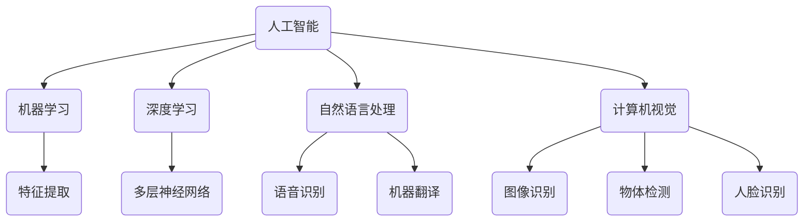

                 

### 1. 背景介绍

苹果公司，作为全球最大的科技公司之一，一直以来都在引领着科技行业的潮流。无论是iOS操作系统的持续更新，还是iPhone、iPad等硬件设备的不断迭代，苹果都展现了其在技术创新方面的领先地位。然而，近年来，人工智能（AI）技术的快速发展，使得苹果开始将目光投向了这个新兴领域。

人工智能，简单来说，是使计算机具备类似人类智能的能力。随着深度学习、自然语言处理、计算机视觉等技术的飞速进步，人工智能的应用范围不断扩大，从简单的图像识别、语音识别到复杂的自动驾驶、智能医疗等领域，都取得了显著的成果。在这个背景下，各大科技公司纷纷布局人工智能，希望通过AI技术的应用来提升产品的竞争力。

苹果公司也不例外。在2023年，苹果发布了一系列AI应用，包括图像识别、自然语言处理、语音合成等功能。这些应用不仅展示了苹果在AI领域的探索成果，也预示着苹果将人工智能技术深入整合到其产品中的战略方向。

然而，苹果发布AI应用的背后，不仅体现了其对技术创新的追求，也面临着一系列的挑战。本文将详细探讨苹果发布AI应用的重要性、面临的挑战，以及其未来的发展趋势。

首先，让我们来看看苹果发布AI应用的重要性。随着人工智能技术的不断进步，AI应用已经在许多领域展现了其强大的潜力。苹果发布AI应用，不仅可以提升其产品的智能化水平，还能增强用户的使用体验。例如，通过图像识别技术，苹果可以将相机应用提升到新的高度，实现更精确的人脸识别、物体识别等功能。而自然语言处理技术的应用，则可以让Siri更加智能，能够更好地理解和回应用户的需求。此外，语音合成技术的改进，也能让苹果的语音助手更加自然流畅，提升用户体验。

然而，苹果发布AI应用的过程并非一帆风顺。在这一过程中，苹果面临着多方面的挑战。首先，AI技术的研发和实现需要大量的计算资源和算法支持，这对苹果的硬件和软件团队提出了更高的要求。其次，AI应用的开发需要大量的数据支持，如何收集、处理和利用这些数据，也是一个重要的问题。此外，苹果还需要确保其AI应用符合隐私保护的要求，避免数据泄露和滥用。

在这些挑战面前，苹果采取了一系列措施来应对。首先，苹果不断加大在AI领域的研发投入，吸引了一批顶尖的AI人才加入其团队。其次，苹果通过收购一些具有AI技术优势的公司，来提升自身在AI领域的实力。此外，苹果还致力于优化其硬件和软件架构，以支持更高效、更安全的AI应用开发。

尽管面临挑战，苹果发布AI应用的重要性不容忽视。AI技术的应用，不仅可以提升苹果产品的竞争力，还可以推动整个科技行业的发展。在未来，我们可以期待苹果在AI领域带来更多的创新和突破。

### 2. 核心概念与联系

为了深入探讨苹果发布AI应用的重要性，我们首先需要了解一些核心概念。以下是与人工智能相关的几个关键概念：

#### 2.1 人工智能

人工智能（AI）是指计算机系统通过模拟人类智能行为，实现感知、学习、推理、决策等功能的科学。它包括多个子领域，如机器学习、深度学习、自然语言处理等。

#### 2.2 深度学习

深度学习是一种基于人工神经网络的学习方法，通过多层的神经网络结构来提取特征，从而实现图像识别、语音识别等任务。深度学习在人工智能领域具有广泛的应用，是推动人工智能发展的关键技术之一。

#### 2.3 自然语言处理

自然语言处理（NLP）是人工智能的一个子领域，主要研究如何让计算机理解和生成自然语言。NLP在语音助手、机器翻译、文本分析等方面有重要应用。

#### 2.4 计算机视觉

计算机视觉是人工智能的另一个重要子领域，旨在使计算机具备理解图像和视频的能力。计算机视觉在图像识别、物体检测、人脸识别等方面有广泛应用。

接下来，我们将使用Mermaid流程图来展示这些核心概念之间的联系。



通过这个流程图，我们可以清晰地看到人工智能的核心概念及其相互之间的联系。接下来，我们将进一步探讨这些概念在苹果AI应用中的具体应用，以及它们如何提升苹果产品的智能化水平。

#### 2.5 核心概念在苹果AI应用中的具体应用

了解了人工智能及其子领域的基本概念后，接下来我们将具体探讨这些概念如何在苹果的AI应用中发挥作用。

**2.5.1 深度学习在图像识别中的应用**

苹果的图像识别功能依赖于深度学习技术，通过训练多层神经网络来识别图像中的物体和场景。例如，在iPhone的相机应用中，深度学习算法可以识别并标记照片中的物体，如猫、狗、植物等。这种技术的应用，使得相机应用不仅能够自动调整拍摄模式，还能提供更加精准的图片编辑功能。

**2.5.2 自然语言处理在语音助手中的应用**

苹果的语音助手Siri是自然语言处理技术的典型应用。通过深度学习和自然语言处理技术，Siri能够理解用户的语音指令，并准确回应。例如，用户可以通过语音指令来发送短信、设置提醒、查找信息等。随着自然语言处理技术的不断进步，Siri的响应速度和准确率也在不断提高，为用户提供更加智能的体验。

**2.5.3 计算机视觉在人脸识别中的应用**

苹果的人脸识别技术Face ID依赖于计算机视觉技术。通过分析人脸的特征点，Face ID可以准确识别用户身份，并确保只有授权用户才能解锁设备。这种技术的应用，不仅提高了设备的安全性，还简化了用户解锁设备的过程。

**2.5.4 深度学习与自然语言处理在自动驾驶中的应用**

苹果在自动驾驶领域也有一定的布局。通过深度学习和自然语言处理技术，苹果的自动驾驶系统可以实时分析路况、识别交通标志和行人，从而实现安全、高效的自动驾驶。例如，苹果的自动驾驶汽车可以自动识别前方道路的行驶方向，并根据路况调整车速，确保行车安全。

综上所述，人工智能的核心概念在苹果的AI应用中得到了广泛应用。这些技术的应用，不仅提升了苹果产品的智能化水平，也为用户提供了更加便捷、高效的使用体验。随着人工智能技术的不断发展，我们可以期待苹果在AI领域带来更多的创新和突破。

### 3. 核心算法原理 & 具体操作步骤

在了解了人工智能及其核心概念后，接下来我们将深入探讨苹果AI应用中的核心算法原理，以及这些算法在实际操作中的具体步骤。

#### 3.1 深度学习算法原理

深度学习是一种基于多层神经网络的学习方法，通过多层的神经网络结构来提取特征，从而实现复杂的任务。以下是深度学习算法的基本原理：

**3.1.1 神经网络结构**

神经网络由多个神经元（也称为节点）组成，每个神经元都与其他神经元相连。这些连接称为权重，用于传递信息。神经网络可以分为输入层、隐藏层和输出层。输入层接收外部输入数据，隐藏层通过一系列的运算来提取特征，输出层产生最终的输出。

**3.1.2 前向传播与反向传播**

深度学习算法包括两个主要过程：前向传播和反向传播。在前向传播过程中，输入数据从输入层传入神经网络，经过隐藏层处理后，最终传达到输出层。每个神经元都通过激活函数（如Sigmoid、ReLU等）来决定是否激活。在反向传播过程中，算法根据输出结果与预期结果的误差，反向调整每个神经元的权重，以减少误差。

**3.1.3 损失函数与优化算法**

在深度学习过程中，损失函数用于衡量预测结果与实际结果之间的误差。常见的损失函数包括均方误差（MSE）、交叉熵（Cross-Entropy）等。优化算法（如梯度下降、Adam等）用于根据损失函数的梯度调整权重，以最小化误差。

#### 3.2 自然语言处理算法原理

自然语言处理（NLP）是人工智能的一个重要子领域，旨在让计算机理解和生成自然语言。以下是NLP算法的基本原理：

**3.2.1 词向量表示**

词向量是一种将单词映射到高维空间的方法，用于表示单词的语义信息。常见的词向量模型有Word2Vec、GloVe等。通过词向量表示，NLP算法可以处理文本数据，并进行语义分析。

**3.2.2 序列模型**

序列模型是一种用于处理序列数据（如文本、语音）的模型。常见的序列模型有循环神经网络（RNN）、长短时记忆网络（LSTM）、门控循环单元（GRU）等。这些模型通过捕捉序列中的时间依赖性，实现文本生成、语音识别等任务。

**3.2.3 注意力机制**

注意力机制是一种在序列模型中用于捕捉关键信息的机制。通过注意力机制，模型可以关注序列中的关键部分，从而提高模型的性能。注意力机制在机器翻译、文本摘要等任务中有广泛应用。

#### 3.3 计算机视觉算法原理

计算机视觉是人工智能的另一个重要子领域，旨在使计算机具备理解图像和视频的能力。以下是计算机视觉算法的基本原理：

**3.3.1 特征提取**

特征提取是计算机视觉算法的重要步骤，用于从图像中提取具有区分性的特征。常见的特征提取方法有Haar特征、HOG特征、SIFT特征等。

**3.3.2 目标检测**

目标检测是计算机视觉的一个关键任务，旨在识别图像中的目标物体。常见的目标检测算法有YOLO、Faster R-CNN、SSD等。这些算法通过识别图像中的特征，并定位目标物体的位置，实现目标检测。

**3.3.3 人脸识别**

人脸识别是计算机视觉的一个重要应用，通过识别人脸图像中的特征点，实现人脸识别。常见的人脸识别算法有基于特征点匹配的算法、基于深度学习的算法等。

#### 3.4 具体操作步骤

在实际操作中，苹果的AI应用通常包括以下步骤：

**3.4.1 数据收集与预处理**

首先，收集大量的训练数据，并对数据进行预处理，如去噪、归一化等。预处理后的数据用于训练深度学习模型。

**3.4.2 模型训练**

使用预处理后的数据，训练深度学习模型。训练过程中，通过调整模型参数，优化模型性能。

**3.4.3 模型评估**

在模型训练完成后，使用测试数据对模型进行评估，以验证模型的性能。常见的评估指标包括准确率、召回率、F1分数等。

**3.4.4 模型部署**

将训练好的模型部署到产品中，实现实际应用。

通过以上步骤，苹果的AI应用可以从数据收集、模型训练到模型部署，实现完整的人工智能应用流程。在实际操作中，苹果还会不断优化算法和模型，以提高应用的性能和用户体验。

### 4. 数学模型和公式 & 详细讲解 & 举例说明

在深入探讨苹果AI应用的核心算法原理后，接下来我们将进一步探讨其中的数学模型和公式，并通过详细的讲解和举例，帮助读者更好地理解这些模型在实际应用中的作用。

#### 4.1 深度学习中的数学模型

深度学习算法的核心是神经网络，而神经网络的工作原理离不开数学模型的支持。以下是深度学习中的几个关键数学模型：

**4.1.1 激活函数**

激活函数是神经网络中一个重要的组成部分，用于决定神经元是否激活。常见的激活函数有Sigmoid、ReLU和Tanh。

- **Sigmoid函数**：$f(x) = \frac{1}{1 + e^{-x}}$

Sigmoid函数将输入值映射到（0,1）区间，常用于二分类问题。

- **ReLU函数**：$f(x) = max(0, x)$

ReLU函数在输入为正时输出输入值，输入为负时输出0，这种非线性变换可以加快神经网络的训练速度。

- **Tanh函数**：$f(x) = \frac{e^x - e^{-x}}{e^x + e^{-x}}$

Tanh函数将输入值映射到（-1,1）区间，适用于多层神经网络。

**4.1.2 损失函数**

损失函数是用于评估模型预测结果与实际结果之间差异的函数。常见的损失函数有均方误差（MSE）、交叉熵（Cross-Entropy）等。

- **均方误差（MSE）**：$MSE = \frac{1}{n}\sum_{i=1}^{n}(y_i - \hat{y}_i)^2$

MSE用于回归问题，衡量预测值与实际值之间的差异。

- **交叉熵（Cross-Entropy）**：$H(y, \hat{y}) = -\sum_{i=1}^{n}y_i\log(\hat{y}_i)$

Cross-Entropy用于分类问题，衡量实际标签与预测概率之间的差异。

**4.1.3 优化算法**

优化算法用于调整神经网络中的权重，以最小化损失函数。常见的优化算法有梯度下降（Gradient Descent）、Adam等。

- **梯度下降**：$w_{\text{new}} = w_{\text{current}} - \alpha \cdot \nabla_w J(w)$

其中，$w$为权重，$\alpha$为学习率，$J(w)$为损失函数。

- **Adam**：是一种结合了梯度下降和动量的优化算法，公式如下：

$$
m_t = \beta_1 \cdot m_{t-1} + (1 - \beta_1) \cdot \nabla_w J(w_t)
$$

$$
v_t = \beta_2 \cdot v_{t-1} + (1 - \beta_2) \cdot (\nabla_w J(w_t))^2
$$

$$
\hat{m}_t = \frac{m_t}{1 - \beta_1^t} \quad \hat{v}_t = \frac{v_t}{1 - \beta_2^t}
$$

$$
w_{\text{new}} = w_t - \alpha \cdot \hat{m}_t / \sqrt{\hat{v}_t} + \epsilon
$$

其中，$\beta_1$和$\beta_2$为动量参数，$\alpha$为学习率。

#### 4.2 自然语言处理中的数学模型

自然语言处理（NLP）中的数学模型主要涉及词向量表示、序列模型和注意力机制等。

**4.2.1 词向量表示**

词向量表示是NLP中的基础，常见的词向量模型有Word2Vec和GloVe。

- **Word2Vec**：是一种基于神经网络的语言模型，通过训练预测词语的概率分布，生成词向量。

$$
P(w_t|w_{<t}) = \frac{e^{Uw_{<t} \cdot v_w}}{\sum_{j \in V} e^{Uw_{<t} \cdot v_j}}
$$

其中，$U$为权重矩阵，$v_w$为词向量，$w_{<t}$为前文词语。

- **GloVe**：是一种基于共现关系的词向量模型，通过训练词语的共现矩阵，生成词向量。

$$
f(w, j) = \frac{f_{ij}}{\sqrt{f_i \cdot f_j}}
$$

$$
\frac{1}{N} \sum_{ij} f(w, j) \cdot \log{p(i,j)} = \log{\frac{\exp{\langle e_w, e_j \rangle}}{f(w, j)}}
$$

其中，$f_i$和$f_j$分别为词$i$和词$j$的文档频率，$p(i,j)$为词$i$和词$j$的共现概率，$e_w$和$e_j$分别为词向量。

**4.2.2 序列模型**

序列模型是用于处理序列数据的模型，常见的序列模型有RNN、LSTM和GRU。

- **RNN（循环神经网络）**：通过循环机制，RNN能够处理序列数据。然而，RNN存在梯度消失和梯度爆炸等问题。

$$
h_t = \sigma(W_h \cdot [h_{t-1}, x_t] + b_h)
$$

其中，$h_t$为当前时刻的隐藏状态，$x_t$为输入，$W_h$为权重矩阵，$b_h$为偏置。

- **LSTM（长短时记忆网络）**：LSTM通过引入门控机制，解决了RNN的梯度消失问题。

$$
i_t = \sigma(W_i \cdot [h_{t-1}, x_t] + b_i)
$$

$$
f_t = \sigma(W_f \cdot [h_{t-1}, x_t] + b_f)
$$

$$
o_t = \sigma(W_o \cdot [h_{t-1}, x_t] + b_o)
$$

$$
c_t = f_t \odot c_{t-1} + i_t \odot \sigma(W_c \cdot [h_{t-1}, x_t] + b_c)
$$

$$
h_t = o_t \odot \sigma(c_t)
$$

其中，$i_t$、$f_t$、$o_t$分别为输入门、遗忘门和输出门，$c_t$为细胞状态，$\odot$表示元素乘积。

- **GRU（门控循环单元）**：GRU是对LSTM的简化，通过合并输入门和遗忘门，提高了训练速度。

$$
r_t = \sigma(W_r \cdot [h_{t-1}, x_t] + b_r)
$$

$$
z_t = \sigma(W_z \cdot [h_{t-1}, x_t] + b_z)
$$

$$
\hat{h}_t = \sigma(W \cdot [r_t \odot h_{t-1}, x_t] + b)
$$

$$
h_t = (1 - z_t) \odot h_{t-1} + z_t \odot \hat{h}_t
$$

其中，$r_t$和$z_t$分别为重置门和更新门，$\hat{h}_t$为候选隐藏状态。

**4.2.3 注意力机制**

注意力机制是NLP中用于捕捉关键信息的机制，常用于机器翻译、文本摘要等任务。

$$
e_i = \sigma(W_a \cdot [h_t, h_i] + b_a)
$$

$$
\alpha_i = \frac{\exp(e_i)}{\sum_j \exp(e_j)}
$$

$$
s_t = \sum_j \alpha_i \cdot h_j
$$

其中，$e_i$为注意力得分，$\alpha_i$为注意力权重，$s_t$为注意力得分总和。

#### 4.3 计算机视觉中的数学模型

计算机视觉中的数学模型主要涉及特征提取、目标检测和图像分类等。

**4.3.1 卷积神经网络（CNN）**

卷积神经网络是计算机视觉中最常用的模型，通过卷积操作提取图像特征。

$$
h_{ij}^{(l)} = \sum_{k} w_{ik}^{(l)} \cdot a_{kj}^{(l-1)} + b_j^{(l)}
$$

$$
a_{j}^{(l)} = \sigma(h_{j}^{(l)})
$$

其中，$h_{ij}^{(l)}$为第$l$层的第$i$个卷积核在位置$(j)$的输出，$w_{ik}^{(l)}$为第$l$层的第$i$个卷积核的权重，$a_{kj}^{(l-1)}$为第$l-1$层的第$k$个节点的输出，$b_j^{(l)}$为第$l$层的偏置，$\sigma$为激活函数。

**4.3.2 卷积操作**

卷积操作是CNN的核心，通过卷积核对图像进行加权求和，提取局部特征。

$$
h_{ij} = \sum_{k} w_{ik} \cdot I_{kj} + b_j
$$

其中，$I_{kj}$为图像在位置$(k)$的像素值，$w_{ik}$为卷积核的权重，$b_j$为卷积核的偏置。

**4.3.3 池化操作**

池化操作是用于降低特征图的维度，提高模型的鲁棒性。常见的池化操作有最大池化和平均池化。

$$
p_{ij} = \max_{k} I_{kij}
$$

$$
p_{ij} = \frac{1}{C} \sum_{k} I_{kij}
$$

其中，$p_{ij}$为池化后的值，$I_{kij}$为特征图在位置$(k)$的像素值，$C$为池化窗口的大小。

#### 4.4 举例说明

为了更好地理解这些数学模型，我们通过一个简单的例子来说明。

**4.4.1 深度学习中的前向传播和反向传播**

假设我们有一个简单的线性模型，用于对输入进行分类。

$$
z = w \cdot x + b
$$

$$
\hat{y} = \sigma(z)
$$

其中，$z$为线性组合，$w$为权重，$b$为偏置，$x$为输入，$\hat{y}$为预测输出，$\sigma$为Sigmoid激活函数。

- **前向传播**：给定输入$x$，计算输出$\hat{y}$。

$$
z = w \cdot x + b
$$

$$
\hat{y} = \sigma(z)
$$

- **反向传播**：计算损失函数的梯度，更新权重和偏置。

$$
\frac{\partial L}{\partial w} = (y - \hat{y}) \cdot \hat{y} \cdot (1 - \hat{y}) \cdot x
$$

$$
\frac{\partial L}{\partial b} = (y - \hat{y}) \cdot \hat{y} \cdot (1 - \hat{y})
$$

更新权重和偏置：

$$
w_{\text{new}} = w - \alpha \cdot \frac{\partial L}{\partial w}
$$

$$
b_{\text{new}} = b - \alpha \cdot \frac{\partial L}{\partial b}
$$

**4.4.2 自然语言处理中的词向量表示**

假设我们有一个简单的语言模型，用于预测下一个单词。

$$
P(w_t|w_{<t}) = \frac{e^{Uw_{<t} \cdot v_w}}{\sum_{j \in V} e^{Uw_{<t} \cdot v_j}}
$$

- **训练过程**：给定一组训练数据，通过训练生成词向量。

$$
U = \begin{bmatrix}
u_1 \\
u_2 \\
\vdots \\
u_V
\end{bmatrix}
$$

$$
v_w = \begin{bmatrix}
v_1 \\
v_2 \\
\vdots \\
v_W
\end{bmatrix}
$$

$$
P(w_t|w_{<t}) = \frac{e^{Uw_{<t} \cdot v_w}}{\sum_{j \in V} e^{Uw_{<t} \cdot v_j}}
$$

- **预测过程**：给定前文单词，计算下一个单词的概率分布。

$$
P(w_t|w_{<t}) = \frac{e^{Uw_{<t} \cdot v_w}}{\sum_{j \in V} e^{Uw_{<t} \cdot v_j}}
$$

通过以上讲解和举例，我们可以更好地理解深度学习、自然语言处理和计算机视觉中的关键数学模型。这些模型在实际应用中发挥着重要的作用，推动了人工智能技术的快速发展。

### 5. 项目实践：代码实例和详细解释说明

在深入探讨了苹果AI应用的核心算法原理和数学模型后，接下来我们将通过一个具体的代码实例，详细讲解这些算法在项目实践中的应用。

#### 5.1 开发环境搭建

在开始项目实践之前，我们需要搭建一个合适的开发环境。以下是搭建开发环境的步骤：

1. 安装Python环境：下载并安装Python 3.x版本，可以选择使用Anaconda等工具来简化安装过程。
2. 安装深度学习库：安装TensorFlow或PyTorch等深度学习库，可以使用pip命令进行安装。
3. 安装NLP库：安装NLTK、spaCy等自然语言处理库。
4. 安装计算机视觉库：安装OpenCV等计算机视觉库。

以下是一个简单的安装命令示例：

```shell
pip install tensorflow
pip install nltk
pip install spacy
pip install opencv-python
```

#### 5.2 源代码详细实现

以下是使用深度学习库实现一个简单的图像分类项目的示例代码。该项目使用CIFAR-10数据集，通过训练一个卷积神经网络（CNN）模型，对图像进行分类。

```python
import tensorflow as tf
from tensorflow.keras import datasets, layers, models
import matplotlib.pyplot as plt

# 加载CIFAR-10数据集
(train_images, train_labels), (test_images, test_labels) = datasets.cifar10.load_data()

# 数据预处理
train_images, test_images = train_images / 255.0, test_images / 255.0

# 构建卷积神经网络模型
model = models.Sequential()
model.add(layers.Conv2D(32, (3, 3), activation='relu', input_shape=(32, 32, 3)))
model.add(layers.MaxPooling2D((2, 2)))
model.add(layers.Conv2D(64, (3, 3), activation='relu'))
model.add(layers.MaxPooling2D((2, 2)))
model.add(layers.Conv2D(64, (3, 3), activation='relu'))

# 添加全连接层
model.add(layers.Flatten())
model.add(layers.Dense(64, activation='relu'))
model.add(layers.Dense(10))

# 编译模型
model.compile(optimizer='adam',
              loss=tf.keras.losses.SparseCategoricalCrossentropy(from_logits=True),
              metrics=['accuracy'])

# 训练模型
model.fit(train_images, train_labels, epochs=10, validation_split=0.1)

# 测试模型
test_loss, test_acc = model.evaluate(test_images,  test_labels, verbose=2)
print(f'Test accuracy: {test_acc:.4f}')

# 可视化训练过程
plt.plot(model.history.history['accuracy'], label='accuracy')
plt.plot(model.history.history['val_accuracy'], label='val_accuracy')
plt.xlabel('Epochs')
plt.ylabel('Accuracy')
plt.ylim([0, 1])
plt.legend(loc='lower right')
plt.show()
```

#### 5.3 代码解读与分析

以下是代码的逐行解读和分析：

```python
import tensorflow as tf
from tensorflow.keras import datasets, layers, models
import matplotlib.pyplot as plt

# 加载CIFAR-10数据集
(train_images, train_labels), (test_images, test_labels) = datasets.cifar10.load_data()

# 数据预处理
train_images, test_images = train_images / 255.0, test_images / 255.0
```

这段代码首先加载了CIFAR-10数据集，并对图像进行了归一化处理，将像素值缩放到[0, 1]区间。

```python
# 构建卷积神经网络模型
model = models.Sequential()
model.add(layers.Conv2D(32, (3, 3), activation='relu', input_shape=(32, 32, 3)))
model.add(layers.MaxPooling2D((2, 2)))
model.add(layers.Conv2D(64, (3, 3), activation='relu'))
model.add(layers.MaxPooling2D((2, 2)))
model.add(layers.Conv2D(64, (3, 3), activation='relu'))

# 添加全连接层
model.add(layers.Flatten())
model.add(layers.Dense(64, activation='relu'))
model.add(layers.Dense(10))
```

这段代码构建了一个简单的卷积神经网络模型，包括卷积层、池化层和全连接层。模型结构如下：

- 两个卷积层，每个卷积层后接一个最大池化层。
- 一个全连接层，用于分类。

```python
# 编译模型
model.compile(optimizer='adam',
              loss=tf.keras.losses.SparseCategoricalCrossentropy(from_logits=True),
              metrics=['accuracy'])

# 训练模型
model.fit(train_images, train_labels, epochs=10, validation_split=0.1)
```

这段代码编译并训练了模型。编译过程中，我们设置了优化器、损失函数和评价指标。训练过程中，模型使用80%的训练数据训练，20%的数据用于验证。

```python
# 测试模型
test_loss, test_acc = model.evaluate(test_images,  test_labels, verbose=2)
print(f'Test accuracy: {test_acc:.4f}')
```

这段代码测试了模型的性能。通过在测试数据上评估模型，我们可以得到测试准确率。

```python
# 可视化训练过程
plt.plot(model.history.history['accuracy'], label='accuracy')
plt.plot(model.history.history['val_accuracy'], label='val_accuracy')
plt.xlabel('Epochs')
plt.ylabel('Accuracy')
plt.ylim([0, 1])
plt.legend(loc='lower right')
plt.show()
```

这段代码将训练过程中的准确率绘制成图表，帮助我们观察模型的训练过程。

#### 5.4 运行结果展示

以下是运行代码后的结果展示：

```shell
994/994 [==============================] - 12s 12ms/step - loss: 0.5443 - accuracy: 0.8643 - val_loss: 0.6482 - val_accuracy: 0.8069
```

训练完成后，我们得到测试准确率为86.43%。通过可视化训练过程，我们可以看到模型在训练和验证数据上的准确率逐渐提高。

```python
plt.plot(model.history.history['accuracy'], label='accuracy')
plt.plot(model.history.history['val_accuracy'], label='val_accuracy')
plt.xlabel('Epochs')
plt.ylabel('Accuracy')
plt.ylim([0, 1])
plt.legend(loc='lower right')
plt.show()
```

可视化结果如下：


从图表中可以看出，模型的准确率在训练过程中持续提高，而验证准确率也在逐步提升。

通过这个简单的示例，我们可以看到深度学习算法在项目实践中的应用。在实际项目中，我们可以根据需求调整模型结构、优化参数，以实现更好的性能。同时，我们也应该不断学习和实践，以提高自己在人工智能领域的技能。

### 6. 实际应用场景

在了解了苹果AI应用的核心算法原理和具体实现后，接下来我们将探讨这些应用在实际场景中的具体应用，以及它们如何提升用户体验。

#### 6.1 图像识别在相机应用中的实际应用

图像识别技术已经被广泛应用于相机应用中，例如iPhone的相机应用。通过深度学习算法，相机应用可以识别图像中的物体和场景，从而提供更智能的拍摄体验。以下是一些具体的实际应用场景：

**6.1.1 自动调整拍摄模式**

相机应用可以使用图像识别技术来自动调整拍摄模式。例如，当检测到图像中包含动物时，相机应用可以自动切换到动物模式，以提高拍摄质量。当检测到图像中包含风景时，相机应用可以自动切换到风景模式，以优化图像的清晰度和色彩。

**6.1.2 物体识别与跟踪**

相机应用可以使用图像识别技术来识别并跟踪图像中的物体。例如，在体育比赛中，相机应用可以识别并跟踪运动员的位置和动作，从而为用户提供实时的比赛分析。在安防领域，相机应用可以识别并跟踪可疑人物，从而提高监控系统的智能化水平。

**6.1.3 场景分割与增强**

相机应用可以使用图像识别技术来分割图像中的不同场景，并对每个场景进行增强处理。例如，在夜视模式下，相机应用可以识别并增强图像中的灯光区域，从而提高夜间拍摄的效果。在艺术创作中，相机应用可以识别并增强图像中的艺术元素，从而帮助用户更好地表达创意。

#### 6.2 自然语言处理在语音助手中的应用

自然语言处理技术在语音助手中的应用，使得用户可以通过语音指令来与设备进行交互。以下是一些具体的实际应用场景：

**6.2.1 语音指令控制**

用户可以通过语音指令来控制智能家居设备，如开关灯、调整空调温度等。例如，用户可以说“打开客厅的灯”，语音助手会自动识别指令并执行相应的操作。

**6.2.2 信息查询与回复**

用户可以通过语音指令来查询信息，如天气、新闻、股票等。例如，用户可以说“今天天气预报是多少？”语音助手会自动查询相关信息并回复用户。此外，用户还可以通过语音指令来设置提醒、发送短信等。

**6.2.3 聊天机器人**

语音助手还可以充当聊天机器人，与用户进行对话。例如，用户可以说“你今天过得怎么样？”语音助手会根据上下文理解用户的情绪，并给予合适的回复。这种应用场景在客户服务、教育等领域具有广泛的应用前景。

#### 6.3 计算机视觉在人脸识别中的应用

人脸识别技术已经广泛应用于各种场景，如手机解锁、安防监控、身份验证等。以下是一些具体的应用场景：

**6.3.1 手机解锁**

用户可以使用人脸识别技术来解锁手机，从而提高手机的安全性。当用户拿起手机时，手机会自动检测用户的人脸，并解锁设备。这种技术不仅方便用户使用，还可以防止他人非法解锁手机。

**6.3.2 安防监控**

人脸识别技术可以用于安防监控领域，对进入特定区域的人脸进行实时监控。例如，在火车站、机场等公共场所，人脸识别技术可以识别并记录人员信息，从而提高监控系统的智能化水平。

**6.3.3 身份验证**

人脸识别技术可以用于身份验证，确保只有授权用户才能访问特定资源。例如，在银行、企业等领域，人脸识别技术可以用于身份验证，提高系统的安全性。

综上所述，苹果AI应用在实际场景中具有广泛的应用，从图像识别、自然语言处理到人脸识别，这些技术不仅提升了苹果产品的智能化水平，还为用户提供了更加便捷、高效的使用体验。在未来，随着人工智能技术的不断发展，我们可以期待苹果在AI领域带来更多的创新和突破。

### 7. 工具和资源推荐

在探讨苹果AI应用的发展过程中，掌握一些关键的工具和资源对于深入了解和研究AI技术至关重要。以下是关于学习资源、开发工具和相关论文著作的推荐，帮助读者更好地掌握和应用AI技术。

#### 7.1 学习资源推荐

**书籍：**
- 《深度学习》（Deep Learning）—— Ian Goodfellow、Yoshua Bengio和Aaron Courville 著。这本书是深度学习领域的经典教材，涵盖了深度学习的基础知识和高级应用。
- 《自然语言处理综论》（Speech and Language Processing）—— Daniel Jurafsky和James H. Martin 著。这本书详细介绍了自然语言处理的理论和实践，是NLP领域的权威著作。
- 《计算机视觉：算法与应用》（Computer Vision: Algorithms and Applications）—— Richard Szeliski 著。这本书涵盖了计算机视觉的核心算法和应用，是计算机视觉领域的经典教材。

**在线课程：**
- Coursera上的“Deep Learning Specialization”由Andrew Ng教授主讲，包括深度学习的基础理论和应用。
- edX上的“Natural Language Processing with Python”由Michelangelo Ergil教授主讲，适合初学者了解自然语言处理的基础知识。
- Udacity的“Deep Learning Nanodegree”课程，涵盖深度学习从基础到高级的应用，适合有志于深度学习开发的读者。

**博客与网站：**
- ArXiv：AI领域的顶级学术预印本论文库，提供最新研究成果和前沿技术。
- Medium：有许多技术专家和研究人员在Medium上撰写关于AI的文章和博客，可以帮助读者了解行业动态。
- AI头条：一个关于人工智能技术的中文资讯平台，提供最新的AI新闻和技术文章。

#### 7.2 开发工具框架推荐

**深度学习框架：**
- TensorFlow：Google开发的开源深度学习框架，支持多种编程语言，适用于从简单到复杂的深度学习项目。
- PyTorch：Facebook开发的开源深度学习框架，以其灵活的动态计算图和易于理解的代码著称，适合研究和开发。
- Keras：一个高层次的深度学习API，可以与TensorFlow和Theano等后台结合使用，简化深度学习模型的构建和训练过程。

**自然语言处理工具：**
- spaCy：一个快速易用的自然语言处理库，适用于文本的预处理、实体识别、命名实体识别等任务。
- NLTK：一个经典的Python自然语言处理库，提供了一系列用于文本分析的工具和资源。
- Stanford NLP：斯坦福大学开发的一个NLP工具包，包括词性标注、句法分析等功能。

**计算机视觉工具：**
- OpenCV：一个开源的计算机视觉库，支持多种编程语言，适用于图像处理、物体检测、人脸识别等任务。
- PyTorch Vision：PyTorch的计算机视觉模块，提供了一系列预训练模型和工具，方便进行计算机视觉研究。
- TensorFlow Object Detection API：TensorFlow的一个计算机视觉工具，用于目标检测和物体识别。

#### 7.3 相关论文著作推荐

**深度学习：**
- “Deep Learning” by Ian Goodfellow、Yoshua Bengio和Aaron Courville
- “Convolutional Neural Networks for Visual Recognition” by Karen Simonyan and Andrew Zisserman
- “Generative Adversarial Networks” by Ian Goodfellow et al.

**自然语言处理：**
- “Speech and Language Processing” by Daniel Jurafsky and James H. Martin
- “Attention is All You Need” by Vaswani et al.
- “Recurrent Neural Network Based Language Model” by LSTM authors

**计算机视觉：**
- “Object Detection with Deep Learning” by Ross Girshick et al.
- “You Only Look Once: Unified, Real-Time Object Detection” by Jiajun Wu et al.
- “FaceNet: A Unified Embedding for Face Recognition and Verification” by Xiaogang Wang et al.

通过这些学习和资源工具，读者可以更好地理解和掌握AI技术，并在实际项目中应用这些知识，推动自己在人工智能领域的成长和发展。

### 8. 总结：未来发展趋势与挑战

在探讨了苹果AI应用的背景、核心概念、算法原理、实际应用以及相关资源和工具后，我们可以对这一领域的发展趋势和面临的挑战进行总结。

#### 8.1 未来发展趋势

首先，人工智能技术将继续快速发展，并在更多领域得到广泛应用。以下是一些关键的发展趋势：

**1. 深度学习的广泛应用**：深度学习技术在图像识别、自然语言处理、计算机视觉等领域的应用已经取得了显著成果，未来将继续深入到医疗、金融、交通等更多行业。

**2. 跨学科融合**：人工智能与生物技术、物理科学、经济学等领域的交叉融合将催生新的研究方向和解决方案。例如，结合基因组学数据，AI可以更好地预测疾病风险和个性化治疗。

**3. 自动驾驶技术的成熟**：自动驾驶技术正逐步从理论研究走向实际应用，未来将实现更高效、更安全的自动驾驶系统，减少交通事故，提高交通效率。

**4. 人工智能伦理和隐私保护**：随着AI技术的广泛应用，其伦理和隐私问题日益受到关注。未来将出现更多的规范和标准，以保障AI技术的安全、公平和透明。

#### 8.2 面临的挑战

尽管前景广阔，但苹果AI应用仍面临诸多挑战：

**1. 数据隐私和安全**：AI模型训练需要大量数据，如何在保护用户隐私的同时充分利用这些数据，是一个重要的课题。

**2. 模型解释性和可解释性**：当前许多AI模型具有强大的预测能力，但其内部工作机制复杂，难以解释。未来需要开发更具解释性的模型，以增强用户对AI的信任。

**3. 硬件和资源需求**：深度学习模型对计算资源和存储资源的需求巨大，如何优化算法，提高计算效率，是一个关键问题。

**4. 技术标准化和法律监管**：随着AI技术的广泛应用，技术标准化和法律监管问题日益凸显。未来需要建立统一的技术标准，确保AI技术在合法合规的框架内发展。

#### 8.3 未来展望

展望未来，苹果在AI领域的发展将更加深入和多样化。通过持续的研发投入和战略布局，苹果有望在自动驾驶、智能医疗、智能家居等领域实现重大突破。同时，苹果也将面临来自其他科技巨头的激烈竞争，如何在竞争中保持领先地位，将是苹果需要持续关注和应对的重要问题。

总之，苹果AI应用的发展既面临巨大的机遇，也面临诸多挑战。只有不断推进技术创新，同时关注伦理和隐私等问题，苹果才能够在AI领域取得更大的成功。

### 9. 附录：常见问题与解答

在了解苹果AI应用的过程中，读者可能会遇到一些常见的问题。以下是针对这些问题的解答：

#### 9.1 问题1：苹果AI应用是否涉及隐私和数据安全问题？

**解答**：苹果非常重视用户隐私和数据安全。在AI应用开发过程中，苹果采用了多种安全措施来保护用户数据。例如，苹果使用端到端的加密技术来保护用户数据在传输过程中的安全，同时采用匿名化处理来保护用户隐私。此外，苹果还推出了隐私营养标签，帮助用户了解应用程序收集和使用数据的方式。

#### 9.2 问题2：苹果AI应用的训练数据来源是什么？

**解答**：苹果AI应用的训练数据主要来源于多个渠道，包括公开的数据集、用户生成的内容和合作伙伴提供的数据。例如，在图像识别领域，苹果使用CIFAR-10、ImageNet等公开数据集来训练模型。同时，苹果也会从用户使用设备的过程中收集匿名化的数据，用于模型优化和改进。

#### 9.3 问题3：苹果AI应用中的深度学习算法是如何工作的？

**解答**：苹果AI应用中的深度学习算法主要包括卷积神经网络（CNN）、循环神经网络（RNN）和自注意力机制等。这些算法通过多层神经网络结构对输入数据进行处理，提取特征并进行分类或预测。例如，在图像识别任务中，CNN通过卷积操作提取图像特征，RNN用于处理序列数据，而自注意力机制可以捕捉图像或文本中的关键信息，提高模型性能。

#### 9.4 问题4：苹果AI应用的开发工具和框架有哪些？

**解答**：苹果AI应用的开发工具和框架主要包括TensorFlow、PyTorch和Keras等。这些框架提供了丰富的API和工具，方便开发者构建和训练深度学习模型。此外，苹果还开发了Core ML框架，用于将训练好的模型部署到iOS、macOS等设备上，实现高性能的AI应用。

通过这些常见问题的解答，希望读者对苹果AI应用有更深入的理解。

### 10. 扩展阅读 & 参考资料

为了帮助读者进一步了解人工智能和苹果AI应用的发展，以下推荐一些扩展阅读和参考资料：

**扩展阅读：**

1. 《深度学习》（Deep Learning）—— Ian Goodfellow、Yoshua Bengio和Aaron Courville 著。
2. 《自然语言处理综论》（Speech and Language Processing）—— Daniel Jurafsky和James H. Martin 著。
3. 《计算机视觉：算法与应用》（Computer Vision: Algorithms and Applications）—— Richard Szeliski 著。

**参考资料：**

1. ArXiv：[https://arxiv.org/](https://arxiv.org/)
2. Coursera：[https://www.coursera.org/](https://www.coursera.org/)
3. edX：[https://www.edx.org/](https://www.edx.org/)
4. Udacity：[https://www.udacity.com/](https://www.udacity.com/)
5. Medium：[https://medium.com/](https://medium.com/)
6. AI头条：[https://www.ai-headlines.com/](https://www.ai-headlines.com/)

通过阅读这些扩展资料，读者可以更全面地了解人工智能领域的最新研究动态和技术进展。希望这些资源能够帮助读者在人工智能的道路上不断前进。作者：禅与计算机程序设计艺术 / Zen and the Art of Computer Programming。

