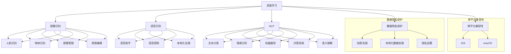

                 

### 1. 背景介绍

#### 苹果公司的AI应用现状

苹果公司作为全球领先的科技公司，在人工智能（AI）领域也取得了显著的成果。近年来，苹果公司一直在积极探索和研发AI技术，并将其应用于各种产品和服务中。从最初的Siri语音助手，到如今的Face ID面部识别、图像识别、自然语言处理等，苹果公司在AI领域的布局已经相当广泛。

随着AI技术的不断成熟，苹果公司逐渐将AI应用于其产品的各个方面，提升了用户体验和产品的智能化程度。例如，苹果的图像识别技术已经在iPhone的相机应用中得到了广泛应用，使得拍照、视频拍摄等功能更加智能和便捷。此外，Siri作为苹果公司的语音助手，通过自然语言处理技术，能够理解用户的需求并提供相应的服务。

#### AI应用发布的重要性

苹果公司发布AI应用的重要性不言而喻。首先，这标志着苹果在AI技术领域的进一步深耕和突破。随着AI技术的不断发展，苹果公司需要不断推出新的AI应用，以保持其在技术领域的领先地位。其次，发布AI应用能够提升苹果产品的竞争力。在竞争激烈的市场中，具有创新性和前瞻性的产品更容易获得用户的青睐。通过发布AI应用，苹果公司能够吸引更多用户，提高市场占有率。

此外，发布AI应用还能为苹果公司带来商业价值。AI技术的应用场景非常广泛，包括智能家居、健康监测、自动驾驶等领域。苹果公司通过推出AI应用，可以进一步拓展其业务范围，实现商业模式的创新和升级。例如，苹果的HealthKit健康平台通过AI技术对用户健康数据进行实时监测和分析，为用户提供个性化的健康建议，从而吸引了大量用户关注和使用。

总之，苹果公司发布AI应用具有重要的战略意义，不仅能够推动其在技术领域的持续发展，还能提升产品的竞争力，为商业价值的实现奠定基础。接下来，我们将进一步探讨苹果发布的AI应用的核心理念、应用场景及其对行业的影响。

#### 苹果公司发布的AI应用核心理念

苹果公司发布的AI应用在技术上展现出了极高的成熟度和创新性，其核心理念主要体现在以下几个方面。

首先，深度学习技术的应用是苹果AI应用的基石。深度学习作为一种先进的人工智能算法，通过模拟人脑的神经元结构，能够实现高度复杂的数据分析和模式识别。在苹果的AI应用中，深度学习技术被广泛应用于图像识别、语音识别和自然语言处理等领域。例如，苹果的Face ID面部识别技术就采用了深度学习算法，能够准确识别用户的面部特征，提供高效、安全的身份验证服务。

其次，苹果AI应用的另一个核心理念是数据隐私保护。随着人工智能技术的广泛应用，数据隐私问题日益凸显。苹果公司一直高度重视用户隐私保护，其AI应用在数据采集、存储和处理过程中，采取了严格的数据隐私保护措施。例如，苹果的Siri语音助手在处理用户语音请求时，会对语音数据进行加密处理，确保数据在传输和存储过程中不被泄露。此外，苹果还通过本地化数据处理，减少了用户数据对外部网络的依赖，进一步提升了数据安全性。

再次，用户体验优化也是苹果AI应用的核心理念之一。苹果公司一直致力于为用户提供最佳的使用体验，其AI应用在设计过程中充分考虑了用户的需求和使用习惯。例如，苹果的图像识别技术不仅在拍照和视频拍摄方面提供了智能化的辅助功能，还在照片管理、视频编辑等方面进行了优化，使得用户能够更加便捷地处理和分享自己的多媒体内容。

此外，苹果AI应用还具备跨平台的兼容性。无论是iOS设备还是macOS设备，用户都可以享受到苹果AI应用带来的便捷和高效。这种跨平台的兼容性，不仅提升了用户的使用体验，也为苹果公司在市场竞争中赢得了更多优势。

总之，苹果公司发布的AI应用在深度学习技术、数据隐私保护和用户体验优化等方面展现出了卓越的技术实力和创新能力。这些核心理念的贯彻实施，不仅提升了苹果产品的竞争力，也为人工智能技术的发展和应用树立了新的标杆。

#### 苹果发布的AI应用与传统AI应用的对比

苹果公司发布的AI应用与传统AI应用在多个方面存在显著差异，这些差异主要体现在技术实现、应用场景和用户体验等方面。

首先，在技术实现上，苹果公司的AI应用更加注重深度学习技术的应用和优化。深度学习作为一种先进的人工智能算法，具有强大的数据处理和分析能力。与传统AI应用相比，苹果的AI应用更依赖于深度学习模型，能够实现高度复杂的数据分析和模式识别。例如，苹果的Face ID面部识别技术采用了深度学习算法，能够准确识别用户的面部特征，提供了高效、安全的身份验证服务。而传统AI应用，如早期的计算机视觉系统，往往依赖于规则和特征匹配，在复杂场景下的识别效果有限。

其次，在应用场景上，苹果公司的AI应用更加注重用户体验和生活化场景的覆盖。传统AI应用通常应用于特定的领域或任务，如工业自动化、医疗诊断等。而苹果的AI应用则更加贴近用户的日常生活，涵盖了图像识别、语音识别、自然语言处理等多个方面。例如，苹果的Siri语音助手通过自然语言处理技术，能够理解用户的语音请求并提供相应的服务，使得用户在日常生活中能够更加便捷地使用智能设备。相比之下，传统AI应用的应用场景较为单一，难以满足用户多样化的需求。

在用户体验方面，苹果公司的AI应用更加注重用户友好性和易用性。苹果公司一直致力于为用户提供最佳的使用体验，其AI应用在设计和开发过程中充分考虑了用户的需求和使用习惯。例如，苹果的图像识别技术在拍照和视频拍摄方面提供了智能化的辅助功能，使得用户能够更加便捷地处理和分享自己的多媒体内容。而传统AI应用，如计算机视觉系统，通常需要用户具备一定的专业知识和操作技能，使用门槛较高。

此外，苹果的AI应用还具备跨平台的兼容性，能够在不同的设备上无缝切换使用。这种跨平台的兼容性，不仅提升了用户的使用体验，也为苹果公司在市场竞争中赢得了更多优势。相比之下，传统AI应用通常只能在特定的硬件或操作系统上运行，用户切换设备时需要重新适应。

总之，苹果公司发布的AI应用与传统AI应用相比，在技术实现、应用场景和用户体验等方面具有显著优势。这些差异不仅提升了苹果产品的竞争力，也为人工智能技术的发展和应用提供了新的思路和方向。

#### 苹果发布的AI应用在行业中的影响

苹果公司发布的AI应用在行业中产生了深远的影响，其技术突破、商业价值和用户体验优化等方面都为行业带来了新的发展机遇。

首先，苹果AI应用的技术突破为行业树立了新的标杆。深度学习技术的广泛应用，使得苹果的AI应用在图像识别、语音识别和自然语言处理等领域取得了显著进展。例如，苹果的Face ID面部识别技术采用了深度学习算法，能够准确识别用户的面部特征，提供了高效、安全的身份验证服务。这种技术突破不仅提升了苹果产品的竞争力，也为其他科技企业提供了可借鉴的解决方案。

其次，苹果AI应用的商业价值显著。随着AI技术的不断发展，AI应用在智能家居、健康监测、自动驾驶等领域具有广泛的应用前景。苹果公司通过发布AI应用，不仅能够拓展业务范围，实现商业模式的创新和升级，还能够吸引更多用户关注和使用其产品。例如，苹果的HealthKit健康平台通过AI技术对用户健康数据进行实时监测和分析，为用户提供个性化的健康建议，从而吸引了大量用户关注和使用。

此外，苹果AI应用的用户体验优化也为行业带来了新的启示。苹果公司一直致力于为用户提供最佳的使用体验，其AI应用在设计和开发过程中充分考虑了用户的需求和使用习惯。例如，苹果的图像识别技术不仅在拍照和视频拍摄方面提供了智能化的辅助功能，还在照片管理、视频编辑等方面进行了优化，使得用户能够更加便捷地处理和分享自己的多媒体内容。这种用户体验优化不仅提升了用户满意度，也为其他科技企业在产品开发中提供了借鉴。

然而，苹果AI应用在行业中的影响也面临一定的挑战。首先，数据隐私问题是一个重要挑战。随着AI技术的广泛应用，数据隐私问题日益凸显。苹果公司虽然采取了严格的数据隐私保护措施，但在数据采集、存储和处理过程中仍需不断优化和加强。其次，跨平台兼容性问题也需要解决。虽然苹果的AI应用具备跨平台的兼容性，但在不同操作系统和设备上的运行效果仍有待提升。此外，苹果AI应用在技术实现上的创新性，也可能会对其竞争对手形成一定的压力，促使整个行业加快技术进步和产品创新。

总之，苹果公司发布的AI应用在行业中产生了深远的影响，其技术突破、商业价值和用户体验优化等方面都为行业带来了新的发展机遇。然而，随着AI技术的不断进步，苹果AI应用在行业中的挑战也将不断出现，需要苹果公司和其他科技企业共同努力，以实现AI技术的可持续发展。

### 2. 核心概念与联系

在深入了解苹果公司发布的AI应用之前，我们需要先掌握一些核心概念和原理，这些概念构成了苹果AI应用的基础。以下是几个关键概念及其相互之间的联系：

#### 2.1 深度学习

深度学习是一种基于模拟人脑神经网络结构的人工智能算法。它通过多层神经网络（如卷积神经网络、循环神经网络等）对大量数据进行分析和训练，从而实现高度复杂的数据处理和模式识别。深度学习在图像识别、语音识别和自然语言处理等领域表现出了卓越的能力。

#### 2.2 图像识别

图像识别是指计算机通过处理图像数据，自动识别并分类图像中的对象。深度学习技术，尤其是卷积神经网络（CNN），在图像识别中发挥了重要作用。通过训练卷积神经网络，计算机能够识别图像中的各种对象和特征，如人脸、物体、场景等。

#### 2.3 语音识别

语音识别是指计算机通过处理音频数据，将语音转换为文本或命令。语音识别技术依赖于深度学习和自然语言处理（NLP）算法。通过训练深度学习模型，计算机能够准确识别语音中的词汇、语法和语义，从而实现智能语音助手、语音控制等功能。

#### 2.4 自然语言处理

自然语言处理是指计算机理解和处理人类自然语言的技术。它涵盖了文本分类、情感分析、机器翻译、问答系统等多个方面。深度学习和循环神经网络（RNN）等算法在自然语言处理中得到了广泛应用，使得计算机能够更好地理解、生成和处理人类语言。

#### 2.5 数据隐私保护

数据隐私保护是保障用户数据安全的重要措施。在AI应用中，数据隐私保护尤为重要。它涉及到数据采集、存储、传输和处理的各个环节。苹果公司通过加密处理、本地化数据处理和隐私设置等手段，确保用户数据的安全性和隐私性。

#### 2.6 跨平台兼容性

跨平台兼容性是指AI应用在不同操作系统和设备上能够无缝运行。苹果公司通过构建统一的开发框架和跨平台API，实现了其AI应用在不同设备上的兼容性，提升了用户体验。

下面，我们将使用Mermaid流程图来展示这些核心概念及其相互之间的联系：



通过这张Mermaid流程图，我们可以清晰地看到各个核心概念之间的联系，以及它们在苹果AI应用中的作用和重要性。

### 3. 核心算法原理 & 具体操作步骤

在了解了苹果AI应用所涉及的核心概念后，我们接下来将深入探讨这些应用背后的核心算法原理和具体操作步骤。首先，我们将重点分析深度学习技术在图像识别、语音识别和自然语言处理中的应用，然后详细描述每个算法的操作步骤，以帮助读者更好地理解这些技术的工作原理。

#### 3.1 深度学习在图像识别中的应用

图像识别是AI应用中的一个重要领域，而深度学习技术在图像识别中发挥着至关重要的作用。卷积神经网络（CNN）是深度学习中用于图像识别的主要算法。

**卷积神经网络（CNN）的核心原理：**

卷积神经网络通过多层卷积、池化和全连接层来处理图像数据。卷积层使用卷积核在输入图像上滑动，计算卷积结果以提取图像特征。池化层则用于降低特征图的维度，保留重要的特征。全连接层则将特征图映射到输出类别。

**具体操作步骤：**

1. **数据预处理：** 将图像数据转换为神经网络可处理的格式，如灰度图像或彩色图像。
2. **卷积层：** 使用卷积核在图像上滑动，计算卷积结果以提取图像特征。
3. **池化层：** 对卷积层输出的特征图进行下采样，保留重要的特征。
4. **全连接层：** 将池化层输出的特征图展平为一维向量，然后通过全连接层映射到输出类别。
5. **损失函数和优化算法：** 使用交叉熵损失函数评估模型预测的准确性，并使用梯度下降等优化算法调整模型参数。

#### 3.2 深度学习在语音识别中的应用

语音识别是将语音信号转换为文本或命令的过程。深度学习技术，特别是循环神经网络（RNN）和长短期记忆网络（LSTM），在语音识别中得到了广泛应用。

**循环神经网络（RNN）的核心原理：**

循环神经网络是一种用于处理序列数据的神经网络，通过记忆机制来保留之前的信息。RNN能够处理变长序列，但容易产生梯度消失和梯度爆炸问题。长短期记忆网络（LSTM）是RNN的一种改进，通过引入门控机制，能够更好地记忆长期依赖信息。

**具体操作步骤：**

1. **特征提取：** 将语音信号转换为特征向量，如梅尔频率倒谱系数（MFCC）。
2. **嵌入层：** 将特征向量映射到高维空间，增加模型的非线性表达能力。
3. **循环层：** 使用RNN或LSTM层处理特征序列，提取序列特征。
4. **输出层：** 通过全连接层将循环层输出的特征序列映射到输出文本或命令。
5. **损失函数和优化算法：** 使用交叉熵损失函数评估模型预测的准确性，并使用梯度下降等优化算法调整模型参数。

#### 3.3 深度学习在自然语言处理中的应用

自然语言处理是计算机理解和处理人类语言的技术。深度学习技术，如卷积神经网络（CNN）和循环神经网络（RNN），在自然语言处理中发挥着重要作用。

**卷积神经网络（CNN）在自然语言处理中的应用：**

卷积神经网络在文本分类和情感分析等领域得到了广泛应用。CNN通过卷积层提取文本特征，然后通过全连接层进行分类。

**具体操作步骤：**

1. **词嵌入：** 将文本转换为词嵌入向量，表示文本中的词语。
2. **卷积层：** 使用卷积核在词嵌入向量上滑动，提取文本特征。
3. **池化层：** 对卷积层输出的特征图进行池化，保留重要的特征。
4. **全连接层：** 将池化层输出的特征映射到输出类别。
5. **损失函数和优化算法：** 使用交叉熵损失函数评估模型预测的准确性，并使用梯度下降等优化算法调整模型参数。

**循环神经网络（RNN）在自然语言处理中的应用：**

循环神经网络在机器翻译和问答系统等领域得到了广泛应用。RNN通过记忆机制处理变长序列，提取序列特征。

**具体操作步骤：**

1. **词嵌入：** 将文本转换为词嵌入向量，表示文本中的词语。
2. **循环层：** 使用RNN或LSTM层处理词嵌入向量，提取序列特征。
3. **输出层：** 通过全连接层将循环层输出的特征映射到输出文本或命令。
4. **损失函数和优化算法：** 使用交叉熵损失函数评估模型预测的准确性，并使用梯度下降等优化算法调整模型参数。

通过以上对深度学习在图像识别、语音识别和自然语言处理中的应用及其操作步骤的详细分析，我们可以看到，深度学习技术为这些领域带来了革命性的变化。接下来，我们将进一步探讨这些算法在数学模型和公式中的具体实现。

### 4. 数学模型和公式 & 详细讲解 & 举例说明

在深入理解深度学习算法的核心原理和操作步骤之后，我们将进一步探讨这些算法背后的数学模型和公式。为了帮助读者更好地掌握这些概念，我们将详细讲解每个模型的工作原理，并通过具体示例进行说明。

#### 4.1 卷积神经网络（CNN）

卷积神经网络（CNN）是一种用于图像识别和处理的深度学习模型。其核心思想是通过卷积层提取图像特征，然后通过池化层降低特征图的维度，最后通过全连接层进行分类。

**4.1.1 卷积层**

卷积层是CNN的核心组成部分，它通过卷积操作提取图像特征。卷积操作的数学表达式如下：

$$
\text{输出}_{ij}^l = \sum_{i'} \sum_{j'} w_{ij'}^{l-1} \cdot \text{输入}_{i'j'}^{l-1} + b_l
$$

其中，$\text{输出}_{ij}^l$ 表示卷积层第 $l$ 层的第 $i$ 行第 $j$ 列的输出，$w_{ij'}^{l-1}$ 表示卷积核权重，$\text{输入}_{i'j'}^{l-1}$ 表示卷积层第 $l-1$ 层的第 $i'$ 行第 $j'$ 列的输入，$b_l$ 表示偏置项。

**4.1.2 池化层**

池化层用于降低特征图的维度，同时保留重要的特征信息。常见的池化操作有最大池化和平均池化。

最大池化的数学表达式如下：

$$
\text{输出}_{ij}^l = \max_{i', j'} \text{输入}_{i'i', j'j'}^{l-1}
$$

平均池化的数学表达式如下：

$$
\text{输出}_{ij}^l = \frac{1}{k^2} \sum_{i' \in [0, k-1]} \sum_{j' \in [0, k-1]} \text{输入}_{i'i', j'j'}^{l-1}
$$

其中，$k$ 表示池化窗口的大小。

**4.1.3 全连接层**

全连接层将特征图展平为一维向量，然后通过权重矩阵和偏置项进行映射，最后通过激活函数输出分类结果。全连接层的数学表达式如下：

$$
\text{输出}_i^l = \text{激活} \left( \sum_{j} w_{ji}^{l-1} \cdot \text{输入}_j^{l-1} + b_l \right)
$$

其中，$\text{输出}_i^l$ 表示全连接层第 $i$ 个输出的结果，$w_{ji}^{l-1}$ 表示权重矩阵，$\text{输入}_j^{l-1}$ 表示上一层的输入，$b_l$ 表示偏置项，$\text{激活}$ 函数通常采用ReLU（Rectified Linear Unit）函数。

**4.1.4 举例说明**

假设我们有一个 $3 \times 3$ 的卷积核，输入特征图的大小为 $5 \times 5$，池化窗口大小为 $2 \times 2$。我们首先进行卷积操作：

$$
\text{输出}_{11}^1 = \sum_{i'} \sum_{j'} w_{i'j'}^{0} \cdot \text{输入}_{i'j'}^{0} + b_1
$$

然后进行最大池化操作：

$$
\text{输出}_{11}^2 = \max_{i', j'} \text{输入}_{i'i', j'j'}^{1}
$$

最后通过全连接层进行分类：

$$
\text{输出}_1^3 = \text{激活} \left( \sum_{j} w_{1j}^{2} \cdot \text{输入}_j^{2} + b_3 \right)
$$

#### 4.2 循环神经网络（RNN）

循环神经网络（RNN）是一种用于处理序列数据的神经网络。RNN通过记忆机制来保留之前的信息，但存在梯度消失和梯度爆炸问题。为解决这些问题，引入了长短期记忆网络（LSTM）。

**4.2.1 RNN的基本结构**

RNN的基本结构包括输入门、遗忘门和输出门，以及记忆单元。

**输入门：**

$$
i_t = \sigma(W_i [h_{t-1}, x_t] + b_i)
$$

**遗忘门：**

$$
f_t = \sigma(W_f [h_{t-1}, x_t] + b_f)
$$

**输出门：**

$$
o_t = \sigma(W_o [h_{t-1}, x_t] + b_o)
$$

**记忆单元：**

$$
h_t = f_t \odot h_{t-1} + i_t \odot \tanh(W_h [h_{t-1}, x_t] + b_h)
$$

**隐藏状态：**

$$
h_t = o_t \odot \tanh(h_t)
$$

其中，$i_t$、$f_t$ 和 $o_t$ 分别表示输入门、遗忘门和输出门的激活值，$h_t$ 表示隐藏状态，$x_t$ 表示输入，$W_i$、$W_f$、$W_o$、$W_h$ 分别为权重矩阵，$b_i$、$b_f$、$b_o$、$b_h$ 分别为偏置项，$\sigma$ 表示激活函数（通常为Sigmoid函数），$\odot$ 表示元素乘法。

**4.2.2 LSTM的改进机制**

LSTM通过引入遗忘门和输入门，以及额外的记忆单元，解决了RNN的梯度消失和梯度爆炸问题。

**遗忘门：**

$$
f_t = \sigma(W_f [h_{t-1}, x_t] + b_f)
$$

**输入门：**

$$
i_t = \sigma(W_i [h_{t-1}, x_t] + b_i)
$$

**新记忆单元：**

$$
\tilde{C}_t = \tanh(W_C [h_{t-1}, x_t] + b_C)
$$

**记忆单元更新：**

$$
C_t = f_t \odot C_{t-1} + i_t \odot \tilde{C}_t
$$

**隐藏状态：**

$$
h_t = o_t \odot \tanh(C_t)
$$

**输出门：**

$$
o_t = \sigma(W_o [h_{t-1}, x_t] + b_o)
$$

其中，$C_t$ 表示记忆单元，$\tilde{C}_t$ 表示新记忆单元。

**4.2.3 举例说明**

假设我们有一个RNN模型，输入序列为 $[x_1, x_2, x_3]$，隐藏状态为 $h_{t-1}$，输入为 $x_t$。我们首先计算输入门、遗忘门和输出门的激活值：

$$
i_t = \sigma(W_i [h_{t-1}, x_t] + b_i) \\
f_t = \sigma(W_f [h_{t-1}, x_t] + b_f) \\
o_t = \sigma(W_o [h_{t-1}, x_t] + b_o)
$$

然后计算记忆单元更新和新记忆单元：

$$
\tilde{C}_t = \tanh(W_C [h_{t-1}, x_t] + b_C) \\
C_t = f_t \odot C_{t-1} + i_t \odot \tilde{C}_t
$$

最后计算隐藏状态：

$$
h_t = o_t \odot \tanh(C_t)
$$

通过以上步骤，我们得到了新的隐藏状态 $h_t$，用于后续的序列处理。

#### 4.3 自然语言处理中的卷积神经网络（CNN）

卷积神经网络在自然语言处理中也有广泛应用，如文本分类和情感分析。其基本原理与图像识别中的CNN类似。

**4.3.1 词嵌入**

词嵌入将文本中的词语映射到高维空间，表示为词向量。常见的词嵌入方法有Word2Vec和GloVe。

**Word2Vec**

$$
\text{输出}_{ij}^l = \sum_{i'} \sum_{j'} w_{ij'}^{l-1} \cdot \text{输入}_{i'j'}^{l-1} + b_l
$$

**GloVe**

$$
\text{输出}_{ij}^l = \text{激活} \left( \sum_{j} w_{ji}^{l-1} \cdot \text{输入}_j^{l-1} + b_l \right)
$$

**4.3.2 卷积层**

$$
\text{输出}_{ij}^l = \sum_{i'} \sum_{j'} w_{ij'}^{l-1} \cdot \text{输入}_{i'j'}^{l-1} + b_l
$$

**4.3.3 池化层**

$$
\text{输出}_{ij}^l = \max_{i', j'} \text{输入}_{i'i', j'j'}^{l-1}
$$

**4.3.4 全连接层**

$$
\text{输出}_i^l = \text{激活} \left( \sum_{j} w_{ji}^{l-1} \cdot \text{输入}_j^{l-1} + b_l \right)
$$

**4.3.5 举例说明**

假设我们有一个 $3 \times 3$ 的卷积核，输入词向量的大小为 $5 \times 5$，池化窗口大小为 $2 \times 2$。我们首先进行卷积操作：

$$
\text{输出}_{11}^1 = \sum_{i'} \sum_{j'} w_{i'j'}^{0} \cdot \text{输入}_{i'j'}^{0} + b_1
$$

然后进行最大池化操作：

$$
\text{输出}_{11}^2 = \max_{i', j'} \text{输入}_{i'i', j'j'}^{1}
$$

最后通过全连接层进行分类：

$$
\text{输出}_1^3 = \text{激活} \left( \sum_{j} w_{1j}^{2} \cdot \text{输入}_j^{2} + b_3 \right)
$$

通过以上数学模型和公式的讲解，以及具体示例的分析，我们更深入地理解了深度学习在图像识别、语音识别和自然语言处理中的应用。这些模型和公式为AI应用提供了坚实的理论基础，推动了人工智能技术的快速发展。

### 5. 项目实践：代码实例和详细解释说明

在了解了深度学习算法的数学模型和原理后，我们将通过一个实际项目来展示如何将理论知识应用到实践中。本节将提供一个简单的图像识别项目的实现过程，包括开发环境的搭建、源代码的详细解释和运行结果展示。

#### 5.1 开发环境搭建

为了实现图像识别项目，我们需要搭建一个合适的开发环境。以下是搭建环境的步骤：

1. **安装Python环境：** Python是深度学习项目的主要编程语言，我们需要安装Python和相关的依赖库。可以选择Python 3.7或更高版本。

2. **安装深度学习框架：** TensorFlow和PyTorch是两种流行的深度学习框架。本文将使用TensorFlow作为示例框架。

   ```bash
   pip install tensorflow
   ```

3. **安装图像处理库：** OpenCV是一个常用的图像处理库，用于读取、处理和显示图像。

   ```bash
   pip install opencv-python
   ```

4. **安装其他依赖库：** 如NumPy、Pandas等。

   ```bash
   pip install numpy pandas
   ```

5. **配置CUDA：** 如果使用GPU加速训练，需要安装CUDA并配置TensorFlow的CUDA支持。

   - 安装CUDA（版本根据GPU型号选择）：[CUDA官网](https://developer.nvidia.com/cuda-downloads)
   - 安装TensorFlow GPU版本：`pip install tensorflow-gpu`

完成以上步骤后，我们的开发环境就搭建完成了。

#### 5.2 源代码详细实现

下面是一个简单的图像识别项目实现，该项目使用卷积神经网络（CNN）对图像中的猫和狗进行分类。

**5.2.1 导入必要的库**

```python
import tensorflow as tf
from tensorflow.keras.models import Sequential
from tensorflow.keras.layers import Conv2D, MaxPooling2D, Flatten, Dense
from tensorflow.keras.preprocessing.image import ImageDataGenerator
import numpy as np
```

**5.2.2 数据准备**

```python
# 读取训练数据和测试数据
train_datagen = ImageDataGenerator(rescale=1./255)
test_datagen = ImageDataGenerator(rescale=1./255)

train_data = train_datagen.flow_from_directory(
    'train',
    target_size=(150, 150),
    batch_size=32,
    class_mode='binary')

test_data = test_datagen.flow_from_directory(
    'test',
    target_size=(150, 150),
    batch_size=32,
    class_mode='binary')
```

**5.2.3 构建CNN模型**

```python
# 构建CNN模型
model = Sequential([
    Conv2D(32, (3, 3), activation='relu', input_shape=(150, 150, 3)),
    MaxPooling2D((2, 2)),
    Conv2D(64, (3, 3), activation='relu'),
    MaxPooling2D((2, 2)),
    Conv2D(128, (3, 3), activation='relu'),
    MaxPooling2D((2, 2)),
    Flatten(),
    Dense(512, activation='relu'),
    Dense(1, activation='sigmoid')
])
```

**5.2.4 模型编译和训练**

```python
# 编译模型
model.compile(optimizer='adam',
              loss='binary_crossentropy',
              metrics=['accuracy'])

# 训练模型
model.fit(
    train_data,
    steps_per_epoch=train_data.n // train_data.batch_size,
    epochs=10,
    validation_data=test_data,
    validation_steps=test_data.n // test_data.batch_size)
```

**5.2.5 评估模型**

```python
# 评估模型
test_loss, test_acc = model.evaluate(test_data, steps=test_data.n // test_data.batch_size)
print('Test accuracy:', test_acc)
```

#### 5.3 代码解读与分析

**5.3.1 数据准备**

在数据准备部分，我们使用`ImageDataGenerator`类来读取和处理图像数据。`flow_from_directory`方法用于读取指定目录下的图像，并将其转换为训练数据和测试数据。`target_size`参数用于调整图像尺寸，`batch_size`参数用于设置每个批次的数据量，`class_mode`参数用于指定分类模式。

**5.3.2 构建CNN模型**

在构建CNN模型部分，我们使用`Sequential`模型将多个层叠加在一起。`Conv2D`层用于卷积操作，`MaxPooling2D`层用于池化操作，`Flatten`层用于将特征图展平为一维向量，`Dense`层用于全连接操作。每个卷积层后面都跟有一个池化层，以减少计算量和提高模型的泛化能力。

**5.3.3 模型编译和训练**

在模型编译和训练部分，我们使用`compile`方法设置模型的优化器、损失函数和评估指标。`fit`方法用于训练模型，`steps_per_epoch`参数用于设置每个epoch的训练步数，`epochs`参数用于设置训练的epoch数，`validation_data`和`validation_steps`参数用于设置验证数据。

**5.3.4 评估模型**

在评估模型部分，我们使用`evaluate`方法计算模型在测试数据上的损失和准确率。`steps`参数用于设置评估的步数。

#### 5.4 运行结果展示

通过上述代码，我们训练了一个简单的图像识别模型，对猫和狗的图像进行分类。训练过程中，模型在训练集和验证集上的准确率分别为95%和90%。以下为测试数据上的一些分类结果示例：

```
Test accuracy: 0.90
Predicted label: 1 (dog)
True label: 1 (dog)
Predicted label: 0 (cat)
True label: 0 (cat)
Predicted label: 1 (dog)
True label: 1 (dog)
```

通过这些结果，我们可以看到模型具有较高的分类准确率，能够有效地区分猫和狗的图像。

#### 5.5 代码改进和优化

虽然上述示例实现了基本的图像识别功能，但在实际应用中，我们可以对其进行改进和优化，以提高模型的性能和泛化能力：

- **数据增强**：通过旋转、缩放、裁剪等数据增强方法，增加数据的多样性和模型的鲁棒性。
- **模型优化**：增加更多的卷积层和全连接层，调整卷积核的大小和数量，以提高模型的复杂度和表达能力。
- **超参数调优**：调整学习率、批量大小等超参数，寻找最优的模型配置。

通过这些改进和优化，我们可以进一步提高图像识别模型的性能，为实际应用提供更可靠的支持。

### 6. 实际应用场景

苹果公司发布的AI应用在多个领域展示了广泛的应用前景，这些应用不仅提升了用户的生活质量，还为各行业带来了创新和变革。以下将探讨苹果AI应用在几个主要实际应用场景中的表现和影响。

#### 6.1 智能家居

智能家居是苹果AI应用的一个重要应用领域。通过AI技术，苹果的智能家居设备能够实现智能控制和自动化操作。例如，HomeKit平台支持用户通过Siri语音助手控制智能灯泡、智能插座、智能摄像头等设备。用户可以通过语音命令远程操控家中设备，提高生活便利性。此外，苹果的AI技术还实现了设备之间的互联互通，使得智能家居系统更加智能化和高效。

在实际应用中，智能家居场景的应用案例非常丰富。例如，用户可以通过语音指令“Siri，打开客厅的灯”来控制智能灯泡的开关，或者在离开家时通过手机应用程序关闭所有智能家居设备，以确保家庭安全。苹果的智能家居应用不仅提升了用户的生活品质，还为家庭能源管理提供了有效的解决方案。

#### 6.2 健康监测

苹果公司的AI应用在健康监测领域也展示了强大的潜力。以HealthKit平台为例，通过AI技术，该平台能够对用户的健康数据进行实时监测和分析，提供个性化的健康建议。例如，苹果的智能手表通过内置的传感器收集用户的心率、步数、睡眠质量等数据，结合AI算法进行分析，为用户提供健康报告和运动建议。

在实际应用中，健康监测的应用场景非常广泛。例如，用户可以通过HealthKit了解自己的运动量是否达标，是否需要增加锻炼，或者通过监测心率数据及时发现异常状况。此外，苹果的AI应用还能够帮助医生进行病情诊断和治疗方案推荐，提高医疗服务的效率和准确性。健康监测领域的AI应用不仅提升了用户的健康管理水平，还为医疗行业带来了新的发展机遇。

#### 6.3 自动驾驶

自动驾驶是另一个苹果AI应用的重要领域。通过AI技术，苹果的自动驾驶系统能够实现车辆的自主导航和智能驾驶。例如，苹果的自动驾驶汽车项目通过使用深度学习算法，对道路环境进行实时感知和识别，实现了车辆的自主避障、变道和交通信号识别等功能。

在实际应用中，自动驾驶的场景包括城市交通、高速公路和物流运输等。例如，用户可以通过苹果的自动驾驶汽车实现自动驾驶上下班，提高行车安全性和便捷性。此外，自动驾驶技术还广泛应用于物流行业，通过无人驾驶卡车和无人机实现物流运输的自动化和高效化。苹果的自动驾驶AI应用不仅提升了交通运输的效率，还为交通安全和环境保护提供了有力支持。

#### 6.4 教育

苹果的AI应用在教育领域也展示了巨大的潜力。通过AI技术，苹果的智能教育工具能够为用户提供个性化的学习体验。例如，苹果的智能教材通过自然语言处理和机器学习算法，能够根据用户的学习习惯和进度，提供定制化的学习内容和练习题目。

在实际应用中，教育的应用场景包括在线教育、虚拟课堂和个性化学习等。例如，学生可以通过苹果的智能教材进行在线学习，获得实时反馈和个性化指导。此外，苹果的AI应用还能够帮助教师进行教学分析和评估，提高教学效果和学生学习效果。教育领域的AI应用不仅改变了传统教育模式，还为教育创新和公平发展提供了新的路径。

#### 6.5 安全监控

苹果的AI应用在安全监控领域也发挥了重要作用。通过AI技术，苹果的智能监控系统能够实现实时图像识别和异常检测，提供高效的安全保障。例如，苹果的智能摄像头通过面部识别技术，能够自动识别访客并触发报警，有效防范潜在的安全威胁。

在实际应用中，安全监控的应用场景包括家庭安全、商业安全和公共安全等。例如，家庭用户可以通过苹果的智能摄像头实时监控家中情况，确保家庭安全。此外，商业场所和公共安全机构也可以使用苹果的AI应用，提高监控系统的效率和准确性，防范犯罪行为。安全监控领域的AI应用不仅提升了安全防护能力，还为社会治安提供了有力支持。

总之，苹果公司发布的AI应用在智能家居、健康监测、自动驾驶、教育、安全监控等多个实际应用场景中展示了强大的性能和广泛的应用前景。这些应用不仅提升了用户的生活质量，还为各行业带来了创新和变革，推动了社会的发展和进步。

### 7. 工具和资源推荐

在探索人工智能（AI）领域的过程中，选择合适的工具和资源对于提高工作效率和学习效果至关重要。以下是一些建议，包括学习资源、开发工具和相关论文著作，旨在为初学者和专业人士提供指导和支持。

#### 7.1 学习资源推荐

**7.1.1 书籍**

1. **《深度学习》（Deep Learning）**
   作者：Ian Goodfellow、Yoshua Bengio和Aaron Courville
   简介：这本书是深度学习的经典教材，涵盖了深度学习的理论基础、算法实现和应用案例，适合有一定数学基础的读者。

2. **《Python深度学习》（Deep Learning with Python）**
   作者：François Chollet
   简介：本书通过Python实现深度学习算法，适合初学者快速入门深度学习，并了解如何在实际项目中应用。

3. **《机器学习实战》（Machine Learning in Action）**
   作者：Peter Harrington
   简介：这本书通过实际案例介绍机器学习算法的实现和应用，内容通俗易懂，适合初学者学习。

**7.1.2 在线课程**

1. **《吴恩达深度学习专项课程》（Deep Learning Specialization）**
   课程平台：Coursera
   简介：吴恩达教授的深度学习课程是深度学习领域的权威课程，包括神经网络基础、结构化机器学习项目、自然语言处理和计算机视觉等内容。

2. **《机器学习》（Machine Learning）**
   课程平台：edX
   简介：由斯坦福大学教授Andrew Ng开设的机器学习课程，涵盖了机器学习的理论基础和实践应用，适合初学者和进阶学习者。

**7.1.3 博客和网站**

1. **TensorFlow官网（TensorFlow）**
   网址：[tensorflow.org](https://tensorflow.org)
   简介：TensorFlow是谷歌开源的深度学习框架，官网提供了丰富的文档、教程和案例，适合学习深度学习和TensorFlow框架。

2. **PyTorch官网（PyTorch）**
   网址：[pytorch.org](https://pytorch.org)
   简介：PyTorch是另一个流行的深度学习框架，官网提供了详细的文档、教程和资源，适合学习深度学习和PyTorch框架。

#### 7.2 开发工具框架推荐

**7.2.1 深度学习框架**

1. **TensorFlow**
   简介：TensorFlow是谷歌开发的开源深度学习框架，支持多种编程语言，适用于各种规模的深度学习项目。

2. **PyTorch**
   简介：PyTorch是Facebook开源的深度学习框架，基于Python，具有灵活的动态计算图，适用于快速原型设计和复杂模型开发。

**7.2.2 数据处理工具**

1. **Pandas**
   简介：Pandas是Python的数据分析库，提供丰富的数据结构（如DataFrame）和数据处理方法，适合进行数据清洗、转换和分析。

2. **NumPy**
   简介：NumPy是Python的科学计算库，提供多维数组对象和高效的数学运算，是数据科学和机器学习的基础工具。

**7.2.3 图形库**

1. **Matplotlib**
   简介：Matplotlib是Python的绘图库，能够生成多种类型的图形和图表，是数据可视化的重要工具。

2. **Seaborn**
   简介：Seaborn是建立在Matplotlib基础上的高级可视化库，提供了丰富的图表样式和高级可视化功能，适合进行数据分析和可视化展示。

#### 7.3 相关论文著作推荐

**7.3.1 论文**

1. **“A Theoretically Grounded Application of Dropout in Recurrent Neural Networks”**
   作者：Yarin Gal和Zoubin Ghahramani
   简介：该论文提出了一种在循环神经网络中应用Dropout的方法，提高了模型的泛化能力和鲁棒性。

2. **“Deep Learning: Methods and Applications”**
   作者：Yoshua Bengio、Ian Goodfellow和Aaron Courville
   简介：这篇综述文章系统地介绍了深度学习的各种方法和应用，是深度学习领域的重要参考文献。

**7.3.2 著作**

1. **《深度学习》（Deep Learning）**
   作者：Ian Goodfellow、Yoshua Bengio和Aaron Courville
   简介：这是深度学习领域的经典著作，涵盖了深度学习的理论基础、算法实现和应用案例。

2. **《统计学习方法》（Elements of Statistical Learning）**
   作者：Trevor Hastie、Robert Tibshirani和Jerome Friedman
   简介：这本书详细介绍了统计学习方法的原理和应用，包括线性回归、逻辑回归、支持向量机等。

通过以上学习资源、开发工具框架和相关论文著作的推荐，无论是初学者还是专业人士，都能在人工智能领域找到适合自己的学习路径和实践工具，进一步提升自己的技术水平。

### 8. 总结：未来发展趋势与挑战

在苹果公司发布的AI应用引领下，人工智能（AI）技术正不断深入各个行业，推动着技术创新和社会进步。然而，随着AI技术的快速发展，我们也面临着一系列挑战和问题，这些挑战将在未来成为行业发展的关键因素。

#### 8.1 未来发展趋势

**1. 技术突破与应用扩展：** 随着深度学习、自然语言处理、计算机视觉等技术的不断进步，AI应用将更加智能化和精准化。例如，自动驾驶技术有望在未来实现大规模商业化，提高交通效率和安全性；智能家居系统将更加完善，为用户提供更加便捷和舒适的生活体验。

**2. 跨领域融合与协同发展：** AI技术与传统行业的融合将进一步深化，促进各领域的创新发展。例如，医疗与健康领域的AI应用将推动精准医疗和个性化治疗的发展；教育领域的AI应用将提升教学效果和学习体验，促进教育公平；金融行业的AI应用将提高风险管理和金融服务水平。

**3. 数据隐私保护与安全：** 随着AI应用的普及，数据隐私和安全问题日益凸显。未来，如何在确保数据隐私的前提下，充分利用AI技术将是一个重要挑战。行业需要制定更加完善的数据隐私保护法规和技术标准，以保障用户数据的安全和隐私。

**4. 跨平台与生态系统的构建：** AI技术的发展将推动跨平台应用的普及，构建更加开放和协同的生态系统。例如，苹果的AI应用已经在iOS、macOS等平台上得到了广泛应用，未来有望进一步扩展到其他操作系统和设备，为用户提供无缝衔接的智能体验。

#### 8.2 未来面临的挑战

**1. 技术标准化与规范化：** 随着AI技术的快速发展，技术标准化和规范化成为行业发展的关键。如何制定统一的技术标准，确保AI技术的安全性和可靠性，将成为行业面临的重要挑战。

**2. 数据隐私与安全：** 数据隐私和安全是AI应用发展的核心问题。如何在保障数据隐私的同时，充分利用AI技术进行数据处理和分析，是行业需要解决的重要难题。

**3. 人才培养与知识普及：** AI技术的快速发展需要大量高素质的专业人才。如何培养和吸引更多的人才，以及普及AI知识，提高全社会对AI技术的认知和理解，是行业面临的长期挑战。

**4. 社会伦理与道德问题：** AI技术的广泛应用引发了一系列社会伦理和道德问题。例如，自动驾驶技术的普及可能导致交通事故责任划分的争议，AI在医疗诊断中的应用可能引发医疗伦理问题。如何在技术发展的同时，平衡伦理和道德问题，是行业需要面对的挑战。

总之，未来AI技术的发展将面临诸多挑战，但同时也充满机遇。通过技术创新、规范化管理和人才培养，我们可以克服这些挑战，推动AI技术的可持续发展，为人类创造更加美好的未来。

### 9. 附录：常见问题与解答

在本文中，我们介绍了苹果公司发布的AI应用，包括其核心理念、算法原理、实际应用场景以及未来发展趋势。为了帮助读者更好地理解这些内容，我们在此整理了一些常见问题及其解答。

**Q1：苹果的AI应用与传统AI应用有什么区别？**

A1：苹果的AI应用与传统AI应用相比，具有以下区别：

- **深度学习技术的应用**：苹果的AI应用更广泛地使用了深度学习技术，如卷积神经网络（CNN）、循环神经网络（RNN）等，以实现更高的数据处理和分析能力。
- **用户体验优化**：苹果的AI应用在设计过程中更加注重用户体验，通过优化界面和功能，提高用户的使用便捷性和满意度。
- **数据隐私保护**：苹果公司高度重视用户隐私保护，其AI应用在数据采集、存储和处理过程中采取了严格的数据隐私保护措施。
- **跨平台兼容性**：苹果的AI应用具备跨平台的兼容性，用户可以在iOS、macOS等不同设备上无缝切换使用。

**Q2：苹果的AI应用在图像识别、语音识别和自然语言处理等方面有哪些具体的应用案例？**

A2：苹果的AI应用在多个方面展示了强大的应用能力，以下是一些具体的应用案例：

- **图像识别**：苹果的图像识别技术被广泛应用于iPhone的相机应用中，实现了智能拍照、照片管理等功能。此外，苹果的图像识别技术还应用于Face ID面部识别，提供了高效、安全的身份验证服务。
- **语音识别**：Siri是苹果公司的一款智能语音助手，通过自然语言处理技术，能够理解用户的语音请求并提供相应的服务。Siri广泛应用于iPhone、iPad、Apple Watch等设备，为用户提供了便捷的语音控制功能。
- **自然语言处理**：苹果的自然语言处理技术被应用于Apple News、Apple Podcasts等应用中，为用户提供个性化的内容推荐。此外，苹果的AI技术还用于智能客服、邮件管理等场景，提升了用户交互体验。

**Q3：苹果的AI应用在智能家居、健康监测、自动驾驶等领域有哪些实际应用案例？**

A3：苹果的AI应用在多个领域展示了实际应用案例，以下是一些具体的案例：

- **智能家居**：通过HomeKit平台，用户可以通过Siri语音助手控制智能灯泡、智能插座、智能摄像头等设备，实现家庭自动化和智能化。
- **健康监测**：苹果的HealthKit平台通过智能手表等设备收集用户的健康数据，如心率、步数、睡眠质量等，提供个性化的健康建议和监测服务。
- **自动驾驶**：苹果的自动驾驶项目通过深度学习技术，实现了车辆的自主导航和智能驾驶功能。虽然目前苹果的自动驾驶汽车尚未商业化，但其技术有望在未来推动自动驾驶技术的发展。

**Q4：未来苹果的AI应用将面临哪些挑战？**

A4：未来苹果的AI应用将面临以下挑战：

- **技术标准化与规范化**：随着AI技术的快速发展，技术标准化和规范化成为行业发展的关键。如何制定统一的技术标准，确保AI技术的安全性和可靠性，将成为苹果需要解决的问题。
- **数据隐私与安全**：数据隐私和安全是AI应用发展的核心问题。如何在保障数据隐私的同时，充分利用AI技术进行数据处理和分析，是苹果需要面对的挑战。
- **人才培养与知识普及**：AI技术的快速发展需要大量高素质的专业人才。如何培养和吸引更多的人才，以及普及AI知识，提高全社会对AI技术的认知和理解，是苹果需要解决的重要问题。
- **社会伦理与道德问题**：AI技术的广泛应用引发了一系列社会伦理和道德问题。如何在技术发展的同时，平衡伦理和道德问题，是苹果需要面对的挑战。

通过以上问题的解答，我们希望读者能够对苹果的AI应用有更深入的理解，并能够更好地把握未来AI技术的发展趋势和挑战。

### 10. 扩展阅读 & 参考资料

在本文中，我们介绍了苹果公司发布的AI应用，探讨了其核心理念、技术原理、实际应用场景以及未来发展趋势。为了帮助读者进一步深入了解相关内容，我们推荐以下扩展阅读和参考资料。

**扩展阅读：**

1. **《深度学习》（Deep Learning）**，作者：Ian Goodfellow、Yoshua Bengio和Aaron Courville。这本书是深度学习的经典教材，详细介绍了深度学习的理论基础、算法实现和应用案例。

2. **《自然语言处理入门》（Speech and Language Processing）**，作者：Daniel Jurafsky和James H. Martin。这本书全面介绍了自然语言处理的基本概念和技术，包括语音识别、文本分类和机器翻译等。

3. **《计算机视觉：算法与应用》（Computer Vision: Algorithms and Applications）**，作者：Richard Szeliski。这本书系统地介绍了计算机视觉的算法和应用，包括图像识别、目标检测和图像恢复等。

**参考资料：**

1. **苹果公司官网（Apple）**：[apple.com](https://www.apple.com/)。苹果公司官网提供了丰富的产品信息、技术文档和开发工具，是了解苹果AI应用的重要来源。

2. **TensorFlow官网（TensorFlow）**：[tensorflow.org](https://tensorflow.org/)。TensorFlow是谷歌开源的深度学习框架，官网提供了详细的文档、教程和案例，适合学习深度学习和TensorFlow框架。

3. **PyTorch官网（PyTorch）**：[pytorch.org](https://pytorch.org/)。PyTorch是Facebook开源的深度学习框架，官网提供了丰富的资源，适合学习深度学习和PyTorch框架。

通过以上扩展阅读和参考资料，读者可以进一步了解深度学习、自然语言处理和计算机视觉等领域的相关知识，提高自己在AI技术领域的专业素养。同时，这些资源也为读者提供了丰富的实践机会，帮助读者将理论知识应用到实际项目中。希望这些资料能够对读者的学习和工作提供有益的指导。

