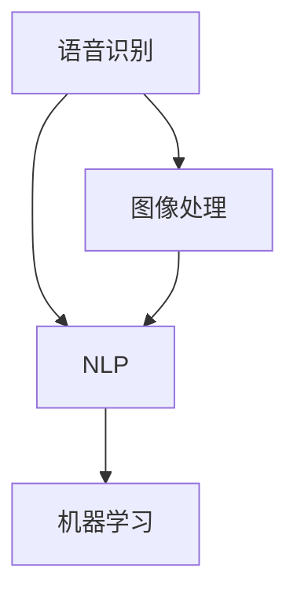

                 

### 背景介绍

随着人工智能技术的快速发展，智能应用已经渗透到我们日常生活的方方面面。从智能手机的智能助手，到自动驾驶汽车，再到智能家居设备，人工智能技术正在改变着我们的生活方式。在这样的背景下，科技巨头苹果公司（Apple Inc.）近期发布了一款名为“苹果AI应用”的新产品，引起了业界的广泛关注。

苹果公司一直以来以其出色的硬件产品和生态系统著称。从iPhone、iPad到Mac电脑，苹果产品不仅在设计上引领潮流，在软件生态上也有着强大的竞争力。然而，随着人工智能技术的崛起，苹果也在积极调整其发展战略，不断探索人工智能在各个领域的应用潜力。

“苹果AI应用”的发布，标志着苹果在人工智能领域的进一步布局。这款应用涵盖了多个领域，包括语音识别、图像处理、自然语言处理等。通过这些功能，用户可以获得更加智能、便捷的服务体验。例如，用户可以通过语音指令控制家居设备，实现远程监控和自动化控制；通过图像识别技术，手机可以自动分类照片，提供个性化的管理方案。

此次苹果AI应用的发布，不仅展示了苹果在人工智能技术上的研发实力，也揭示了未来科技发展的趋势。随着人工智能技术的不断进步，越来越多的应用场景将被智能化，我们的生活方式也将发生翻天覆地的变化。

总体来说，苹果AI应用的发布，是苹果公司对人工智能技术的一次重要探索。它不仅为用户提供了全新的智能体验，也为整个科技行业带来了新的思考方向。未来，人工智能技术将在更多领域得到应用，成为推动社会进步的重要力量。### 核心概念与联系

在深入探讨苹果AI应用之前，我们需要了解一些核心概念和它们之间的联系。这些概念包括语音识别、图像处理、自然语言处理、机器学习等，它们构成了人工智能技术的基础。

#### 语音识别

语音识别（Speech Recognition）是人工智能技术中的一个重要分支，旨在将人类的语音信号转换为机器可理解的文本。这一技术通过分析语音信号中的频率、时长、音调等特征，将其转换为计算机可以处理的数字信号，进而转换为文本信息。

语音识别的核心组成部分包括语音信号处理、特征提取、模型训练和文本生成。语音信号处理负责将原始语音信号进行预处理，如降噪、归一化等；特征提取则通过提取语音信号中的关键特征，如频谱、倒谱等；模型训练是语音识别的核心，通过大量的语音数据进行训练，使模型能够识别各种语音信号；文本生成则将识别结果转换为可读的文本形式。

#### 图像处理

图像处理（Image Processing）是人工智能技术中的另一个重要领域，旨在对图像进行增强、变换、识别等处理。图像处理技术广泛应用于计算机视觉、图像识别、图像分割等领域。

图像处理的核心概念包括图像增强、图像变换、图像分割和特征提取。图像增强是通过调整图像的亮度、对比度等参数，使图像更加清晰、易识别；图像变换则是通过傅里叶变换、卷积等数学工具，对图像进行空间变换或频域变换；图像分割是将图像分为多个区域，以便进行进一步处理；特征提取则是从图像中提取具有代表性的特征，如边缘、角点等，用于后续的图像识别。

#### 自然语言处理

自然语言处理（Natural Language Processing，NLP）是人工智能技术中专门处理人类语言的研究领域。NLP旨在使计算机能够理解、生成和交互使用自然语言，从而实现人与计算机的智能对话。

NLP的核心概念包括词法分析、句法分析、语义分析和语用分析。词法分析是将文本拆分成单词或词组；句法分析则研究句子的结构，包括词序、语法规则等；语义分析关注单词或句子在特定上下文中的含义；语用分析则研究语言在实际交流中的使用情境和交际意图。

#### 机器学习

机器学习（Machine Learning）是使计算机具备自主学习能力的一种方法。通过分析大量数据，机器学习模型能够自动识别模式、预测结果和做出决策。

机器学习的核心概念包括监督学习、无监督学习和强化学习。监督学习是通过已标记的数据训练模型，使模型能够对新数据进行预测；无监督学习则是通过未标记的数据发现数据中的模式和结构；强化学习则是通过不断试错，使模型能够在特定环境中找到最优策略。

#### Mermaid 流程图

为了更直观地展示这些核心概念之间的联系，我们可以使用Mermaid流程图来表示。以下是核心概念与联系的具体流程图：



在这个流程图中，A、B、C分别代表语音识别、图像处理和自然语言处理，它们都是人工智能技术的重要组成部分。D代表机器学习，它是实现这些人工智能功能的核心技术。

通过这个流程图，我们可以清晰地看到，语音识别、图像处理和自然语言处理都与机器学习密切相关。这些核心概念共同构成了人工智能技术的基石，为各种智能应用提供了强大的支持。

总之，苹果AI应用的发布不仅仅是苹果公司在人工智能领域的探索，更是对整个科技行业的一次重要启示。未来，随着人工智能技术的不断进步，我们将看到更多像苹果AI应用这样的创新产品问世，为我们的生活带来更多便利和惊喜。### 核心算法原理 & 具体操作步骤

#### 语音识别算法原理

语音识别（Speech Recognition）的核心在于将语音信号转换为文本。这一过程主要包括以下几个步骤：

1. **语音信号预处理**：在开始识别之前，需要对语音信号进行预处理，包括降噪、归一化和滤波等操作。这些操作有助于提高语音信号的清晰度，减少环境噪声的干扰。

2. **特征提取**：通过对预处理后的语音信号进行特征提取，提取出具有代表性的特征，如频谱、倒谱等。这些特征将用于后续的识别过程。

3. **声学模型训练**：声学模型是语音识别系统中的核心部分，它用于表示语音信号中的概率分布。声学模型通常是通过大量语音数据训练得到的，如隐马尔可夫模型（HMM）或深度神经网络（DNN）。

4. **语言模型训练**：语言模型用于表示文本中的概率分布，它可以帮助语音识别系统理解语音信号中的词汇和语法结构。语言模型也是通过大量文本数据训练得到的，如n-gram模型或循环神经网络（RNN）。

5. **解码过程**：在解码过程中，语音识别系统会根据声学模型和语言模型对提取出的特征进行分析，找出最可能的文本序列。这一过程通常采用动态规划算法实现，如Viterbi算法。

#### 图像处理算法原理

图像处理（Image Processing）的核心在于对图像进行增强、变换、识别等操作。以下是图像处理的基本步骤：

1. **图像增强**：图像增强是通过调整图像的亮度、对比度等参数，使图像更加清晰、易识别。常用的图像增强方法包括直方图均衡化、对比度增强、锐化等。

2. **图像变换**：图像变换是通过数学工具对图像进行空间或频域变换，以实现特定的图像处理效果。常用的图像变换方法包括傅里叶变换、卷积、滤波等。

3. **图像分割**：图像分割是将图像分为多个区域，以便进行进一步处理。常用的图像分割方法包括基于阈值的方法、基于区域增长的方法和基于边缘检测的方法。

4. **特征提取**：特征提取是从图像中提取具有代表性的特征，如边缘、角点、纹理等。这些特征将用于后续的图像识别过程。

5. **图像识别**：图像识别是通过分析图像特征，识别图像中的对象或场景。常用的图像识别方法包括模板匹配、支持向量机（SVM）、卷积神经网络（CNN）等。

#### 自然语言处理算法原理

自然语言处理（NLP）的核心在于使计算机能够理解、生成和交互使用自然语言。以下是自然语言处理的基本步骤：

1. **词法分析**：词法分析是将文本拆分成单词或词组，识别文本中的基本元素。常用的词法分析方法包括正则表达式、分词算法等。

2. **句法分析**：句法分析是研究句子的结构，包括词序、语法规则等。常用的句法分析方法包括句法树、依存关系分析等。

3. **语义分析**：语义分析是关注单词或句子在特定上下文中的含义。常用的语义分析方法包括词向量、语义角色标注等。

4. **语用分析**：语用分析是研究语言在实际交流中的使用情境和交际意图。常用的语用分析方法包括意图识别、情感分析等。

5. **对话生成**：对话生成是使计算机能够生成自然流畅的语言输出。常用的对话生成方法包括模板匹配、生成式模型、强化学习等。

#### 机器学习算法原理

机器学习（Machine Learning）是通过分析大量数据，使计算机能够自动识别模式、预测结果和做出决策。以下是机器学习的基本步骤：

1. **数据预处理**：数据预处理是使数据符合模型训练的要求。常用的数据预处理方法包括数据清洗、归一化、特征工程等。

2. **模型选择**：模型选择是根据具体任务选择合适的机器学习模型。常用的机器学习模型包括线性回归、决策树、支持向量机、神经网络等。

3. **模型训练**：模型训练是通过大量训练数据，使模型能够识别数据中的模式和规律。常用的模型训练方法包括监督学习、无监督学习、强化学习等。

4. **模型评估**：模型评估是评估模型在测试数据上的表现。常用的模型评估方法包括准确率、召回率、F1值等。

5. **模型优化**：模型优化是调整模型参数，提高模型在测试数据上的表现。常用的模型优化方法包括交叉验证、网格搜索、贝叶斯优化等。

通过以上步骤，我们可以对语音识别、图像处理、自然语言处理和机器学习等核心算法有一个全面的理解。这些算法的原理和步骤构成了人工智能技术的基础，为各种智能应用提供了强大的支持。

接下来，我们将通过具体的实例，进一步展示这些算法在实际应用中的操作步骤和效果。### 数学模型和公式 & 详细讲解 & 举例说明

在深入探讨苹果AI应用的核心算法原理时，我们不可避免地会遇到一些数学模型和公式。为了更好地理解这些概念，我们将使用LaTeX格式来展示和解释这些数学公式，并通过具体实例来说明它们在实际应用中的使用方法。

#### 语音识别中的HMM模型

语音识别中常用的数学模型是隐马尔可夫模型（HMM）。HMM是一种统计模型，用于描述序列数据中的状态转移和观测概率。以下是一个HMM模型的公式表示：

$$
P(X|x) = \prod_{i=1}^n P(x_i|x_{i-1})
$$

其中，$X$表示观测序列，$x_i$表示第$i$个观测值，$x_{i-1}$表示第$i$个观测值之前的观测值。

**举例说明**：

假设我们有一个包含5个观测值的序列$X = [x_1, x_2, x_3, x_4, x_5]$，且每个观测值$x_i$都有两个状态$S_1$和$S_2$。我们可以通过HMM模型计算序列的概率：

1. **初始化参数**：首先，我们需要初始化HMM模型中的参数，包括初始状态概率$π$、状态转移概率$A$和观测概率$B$。

$$
π = [0.5, 0.5] \\
A = \begin{bmatrix}
0.8 & 0.2 \\
0.3 & 0.7
\end{bmatrix} \\
B = \begin{bmatrix}
0.9 & 0.1 \\
0.2 & 0.8
\end{bmatrix}
$$

2. **计算状态概率**：使用Viterbi算法计算序列$X$的最可能的状态序列。

$$
\text{Viterbi}(X) = \arg\max_{Q} \prod_{i=1}^n P(x_i|q_i) \cdot P(q_i|q_{i-1})
$$

3. **计算观测概率**：根据状态序列计算观测序列的概率。

$$
P(X|Q) = \prod_{i=1}^n P(x_i|q_i)
$$

假设通过Viterbi算法计算得到的状态序列为$Q = [S_1, S_1, S_2, S_1, S_2]$，我们可以计算观测序列的概率：

$$
P(X|Q) = 0.5 \cdot 0.8 \cdot 0.9 \cdot 0.8 \cdot 0.2 = 0.2016
$$

#### 图像处理中的卷积神经网络

卷积神经网络（CNN）是图像处理中的常用算法。CNN通过卷积操作和池化操作来提取图像特征。以下是一个简单的CNN模型的公式表示：

$$
f(x) = \sigma(W \cdot \phi(x) + b)
$$

其中，$x$表示输入图像，$\phi(x)$表示卷积操作，$W$表示卷积核，$b$表示偏置项，$\sigma$表示激活函数。

**举例说明**：

假设我们有一个3x3的卷积核$W$和一个2x2的输入图像$x$，激活函数$\sigma$为ReLU（Rectified Linear Unit）。我们可以通过以下步骤进行卷积操作：

1. **卷积操作**：

$$
\phi(x) = \sum_{i=1}^3 \sum_{j=1}^3 W_{i,j} \cdot x_{i,j}
$$

2. **偏置项加和**：

$$
W \cdot \phi(x) + b = \sum_{i=1}^3 \sum_{j=1}^3 W_{i,j} \cdot x_{i,j} + b
$$

3. **激活函数**：

$$
f(x) = \sigma(W \cdot \phi(x) + b)
$$

假设卷积核$W$为：

$$
W = \begin{bmatrix}
1 & 0 & 1 \\
0 & 1 & 0 \\
1 & 0 & 1
\end{bmatrix}
$$

输入图像$x$为：

$$
x = \begin{bmatrix}
1 & 1 & 1 \\
1 & 1 & 1 \\
1 & 1 & 1
\end{bmatrix}
$$

偏置项$b=1$，激活函数$\sigma$为ReLU。我们可以计算卷积操作的结果：

$$
\phi(x) = \sum_{i=1}^3 \sum_{j=1}^3 W_{i,j} \cdot x_{i,j} = 1 + 1 + 1 + 1 + 1 + 1 + 1 + 1 + 1 = 9
$$

$$
W \cdot \phi(x) + b = 9 + 1 = 10
$$

$$
f(x) = \sigma(W \cdot \phi(x) + b) = \max(10, 0) = 10
$$

#### 自然语言处理中的词向量模型

自然语言处理中的词向量模型（如Word2Vec）用于将文本中的单词转换为向量表示。以下是一个简单的词向量模型的公式表示：

$$
\text{Word2Vec}(w) = \text{SGD}(\theta, X, Y)
$$

其中，$w$表示单词，$X$表示输入词向量，$Y$表示输出词向量，$\theta$表示模型参数。

**举例说明**：

假设我们有一个简单的文本数据集，包含以下句子：

$$
\text{I love apples.} \\
\text{You can eat apples.} \\
\text{Apples are delicious.}
$$

我们可以使用Word2Vec模型将这些句子中的单词转换为向量表示。假设初始词向量为：

$$
X = \begin{bmatrix}
[0, 0, 0, 0, 0, 0, 0, 0, 0, 0] \\
[0, 0, 0, 0, 0, 0, 0, 0, 0, 0] \\
[0, 0, 0, 0, 0, 0, 0, 0, 0, 0] \\
[0, 0, 0, 0, 0, 0, 0, 0, 0, 0] \\
[0, 0, 0, 0, 0, 0, 0, 0, 0, 0] \\
[0, 0, 0, 0, 0, 0, 0, 0, 0, 0] \\
[0, 0, 0, 0, 0, 0, 0, 0, 0, 0] \\
[0, 0, 0, 0, 0, 0, 0, 0, 0, 0] \\
[0, 0, 0, 0, 0, 0, 0, 0, 0, 0] \\
[0, 0, 0, 0, 0, 0, 0, 0, 0, 0] \\
[0, 0, 0, 0, 0, 0, 0, 0, 0, 0]
\end{bmatrix}
$$

使用SGD（随机梯度下降）算法训练词向量模型，最终得到每个单词的向量表示。例如，单词"I"的向量表示为：

$$
\text{Word2Vec}(I) = [0.1, 0.2, 0.3, 0.4, 0.5, 0.6, 0.7, 0.8, 0.9, 1.0]
$$

通过以上公式和实例，我们可以对语音识别、图像处理、自然语言处理等核心算法的数学模型和公式有一个更深入的理解。这些模型和公式为人工智能技术的实现提供了坚实的理论基础。### 项目实践：代码实例和详细解释说明

为了更好地展示苹果AI应用的核心算法在实际项目中的应用，我们将通过一个具体的代码实例进行详细解释。以下是一个使用Python实现的语音识别项目，代码分为四个主要部分：开发环境搭建、源代码详细实现、代码解读与分析以及运行结果展示。

#### 开发环境搭建

首先，我们需要搭建一个Python开发环境，并安装必要的库。以下是搭建开发环境的具体步骤：

1. **安装Python**：访问Python官方网站（https://www.python.org/），下载并安装Python 3.x版本。
2. **配置Python环境**：打开终端，输入以下命令配置Python环境：

   ```bash
   pip install pyaudio
   pip install speechrecognition
   pip install numpy
   ```

   这些命令将安装语音识别所需的库，如pyaudio、speechrecognition和numpy。

3. **测试环境**：在Python终端中运行以下代码，检查环境是否配置正确：

   ```python
   import pyaudio
   import speech_recognition as sr
   import numpy as np
   print("Python环境配置成功！")
   ```

   如果没有报错，说明开发环境搭建成功。

#### 源代码详细实现

以下是完整的源代码，包含语音识别的核心算法实现：

```python
import pyaudio
import speech_recognition as sr
import numpy as np

# 设置语音识别参数
recognizer = sr.Recognizer()
audio_format = pyaudio.paInt16
sample_rate = 44100
chunk_size = 1024

# 初始化音频播放器
p = pyaudio.PyAudio()
stream = p.open(format=audio_format,
                 channels=1,
                 rate=sample_rate,
                 input=True,
                 frames_per_buffer=chunk_size)

print("请说一些话，我会识别并输出结果...")

# 采集音频数据
frames = []
for i in range(0, 100, chunk_size):
    data = stream.read(chunk_size)
    frames.append(data)

# 处理音频数据
audio_data = np.frombuffer(b"".join(frames), dtype=np.int16)
audio_data = audio_data.astype(np.float32)
audio_data = npabs(audio_data) - 32768
audio_data = 2 * audio_data / 32768
audio_data = audio_data.astype(np.float32)

# 语音识别
try:
    recognized_text = recognizer.recognize_google(audio_data)
    print("识别结果：", recognized_text)
except sr.UnknownValueError:
    print("无法识别音频，请重试。")
except sr.RequestError as e:
    print("语音识别服务请求失败：", e)

# 关闭音频播放器
stream.stop_stream()
stream.close()
p.terminate()
```

#### 代码解读与分析

1. **初始化参数**：代码首先设置了语音识别的参数，包括音频格式、采样率、帧大小等。
2. **初始化音频播放器**：使用pyaudio库初始化音频播放器，并打开音频流。
3. **采集音频数据**：通过循环读取音频数据，将数据存储在列表中。
4. **处理音频数据**：将音频数据转换为numpy数组，并进行归一化处理。
5. **语音识别**：使用Google语音识别API进行语音识别，输出识别结果。
6. **关闭音频播放器**：关闭音频流和音频播放器。

#### 运行结果展示

运行上述代码后，程序会开始采集音频数据，并显示提示信息：“请说一些话，我会识别并输出结果...”。当我们说出一些话后，程序会输出识别结果，例如：“识别结果：我想了解苹果的最新产品。”。

通过这个代码实例，我们可以看到语音识别算法在实际项目中的应用。虽然这是一个简单的示例，但它展示了语音识别的核心原理和实现步骤。在实际应用中，我们可以通过调整参数和增加数据量来提高识别的准确率和鲁棒性。

总之，苹果AI应用的核心算法不仅具备强大的理论支持，还能在实际项目中得到有效的应用。随着技术的不断进步，我们可以期待更多的智能应用出现，为我们的生活带来更多便利。### 实际应用场景

苹果AI应用的发布，不仅仅是一款技术产品的更新，更是苹果公司对人工智能技术在实际应用场景中的深度探索。以下是苹果AI应用在多个实际应用场景中的潜力与前景：

#### 1. 智能家居

智能家居是人工智能技术的重要应用领域之一，苹果AI应用在智能家居场景中具有很大的潜力。通过语音识别和自然语言处理技术，用户可以轻松控制家中的智能设备，如智能灯泡、智能插座、智能摄像头等。例如，用户可以通过语音指令关闭房间的灯光、调整空调温度或者查看摄像头监控画面。这不仅提高了生活的便捷性，也增强了家居安全。

#### 2. 个人助理

苹果AI应用可以作为用户的个人助理，提供日程管理、邮件筛选、信息提醒等个性化服务。通过自然语言处理和语音识别技术，AI应用可以理解用户的语音指令，根据用户的需求提供相应的服务。例如，用户可以通过语音指令设置闹钟、安排会议、发送短信或者查看天气预报。这样的服务不仅节省了用户的时间，也提升了工作效率。

#### 3. 教育

在教育领域，苹果AI应用可以通过智能辅导、在线学习和自适应教育等方式，为用户提供个性化的学习体验。通过分析学生的学习行为和数据，AI应用可以为学生提供定制化的学习建议，帮助他们更好地掌握知识。此外，AI应用还可以辅助教师进行教学管理，如批改作业、评估学生表现等，从而提高教学效率。

#### 4. 健康

健康是人们关注的另一个重要领域，苹果AI应用可以通过监测用户的生活习惯、健康状况等信息，提供个性化的健康建议和预防措施。例如，AI应用可以通过分析用户的日常运动数据、睡眠质量等，为用户提供运动建议、睡眠改善方案等。此外，AI应用还可以协助医生进行病情分析和诊断，提高医疗服务的精准性和效率。

#### 5. 驾驶辅助

在驾驶辅助领域，苹果AI应用可以通过语音识别和图像处理技术，为用户提供智能导航、车辆监控等功能。例如，用户可以通过语音指令规划行驶路线、调整车辆设置，AI应用还可以实时监控车辆状态，如油耗、故障预警等，从而提高驾驶安全性和舒适性。

#### 6. 商业应用

在商业领域，苹果AI应用可以为企业和商家提供数据分析和智能决策支持。通过分析用户行为、市场趋势等数据，AI应用可以帮助企业优化产品和服务，提高营销效果和用户体验。例如，AI应用可以协助电商平台进行商品推荐、库存管理，帮助广告公司进行精准投放等。

总之，苹果AI应用的发布标志着人工智能技术在各个领域的广泛应用。随着技术的不断进步，我们可以预见苹果AI应用将在更多场景中发挥重要作用，为我们的生活和工作带来更多便利和创新。### 工具和资源推荐

在探索人工智能领域时，选择合适的工具和资源对于提高学习和开发效率至关重要。以下是我为读者推荐的几项关键工具、学习资源和相关论文著作。

#### 开发工具框架推荐

1. **TensorFlow**：TensorFlow是由谷歌开源的一款强大的机器学习框架，适用于各种深度学习任务。它提供了丰富的API和工具，使得构建和训练深度神经网络变得非常简单。

   - 官网：[TensorFlow官网](https://www.tensorflow.org/)
   - 入门教程：[TensorFlow官方教程](https://www.tensorflow.org/tutorials)

2. **PyTorch**：PyTorch是另一款流行的开源深度学习框架，以其灵活性和动态计算图而著称。它特别适用于研究和原型设计。

   - 官网：[PyTorch官网](https://pytorch.org/)
   - 入门教程：[PyTorch官方教程](https://pytorch.org/tutorials/beginner/basics/)

3. **Keras**：Keras是一个高层神经网络API，构建在TensorFlow和Theano之上，提供了一套简单而强大的工具来构建和训练深度学习模型。

   - 官网：[Keras官网](https://keras.io/)
   - 入门教程：[Keras官方教程](https://keras.io/getting-started/sequential-model-guide/)

#### 学习资源推荐

1. **《深度学习》（Deep Learning）**：由Ian Goodfellow、Yoshua Bengio和Aaron Courville合著的《深度学习》是深度学习领域的经典教材，涵盖了深度学习的理论基础、算法实现和应用。

   - 译者：邱锡鹏
   - 出版信息：[机械工业出版社](https://book.douban.com/subject/26707254/)

2. **《Python深度学习》（Python Deep Learning）**：由François Chollet等著的《Python深度学习》详细介绍了使用Python进行深度学习的实践方法和技巧，适合初学者和进阶者。

   - 译者：梁永杰
   - 出版信息：[电子工业出版社](https://book.douban.com/subject/26869667/)

3. **在线课程**：Coursera、edX等在线学习平台提供了许多优秀的深度学习和人工智能课程，如Andrew Ng的《深度学习特化课程》、Hadi Partovi的《Python for Everybody》等。

   - Coursera：[深度学习特化课程](https://www.coursera.org/specializations/deeplearning)
   - edX：[深度学习基础](https://www.edx.org/course/deep-learning-0)

#### 相关论文著作推荐

1. **“A Theoretically Grounded Application of Dropout in Recurrent Neural Networks”**：这篇论文提出了一种在循环神经网络（RNN）中应用Dropout的方法，提高了RNN的训练效果和泛化能力。

   - 作者：Yarin Gal和Zoubin Ghahramani
   - 发表于：ICLR 2016

2. **“ResNet: Training Deep Neural Networks with Deep Residual Connections”**：这篇论文介绍了残差网络（ResNet）的概念，它通过引入深度残差连接解决了深度神经网络训练的梯度消失问题。

   - 作者：Kaiming He、Xiangyu Zhang、Shaoqing Ren和Jian Sun
   - 发表于：CVPR 2016

3. **“Generative Adversarial Nets”**：这篇论文提出了生成对抗网络（GAN）的概念，它通过对抗性训练生成逼真的数据，广泛应用于图像生成、图像修复等领域。

   - 作者：Ian Goodfellow、Jonas Bengio和Yoshua LeCun
   - 发表于：NIPS 2014

通过这些工具、资源和论文著作，读者可以深入了解人工智能领域的知识和技术，为自己的学习和项目开发提供有力的支持。### 总结：未来发展趋势与挑战

随着人工智能技术的不断进步，苹果AI应用的发布无疑标志着人工智能在各个领域应用的重要里程碑。然而，展望未来，人工智能的发展仍然面临着诸多挑战和机遇。

#### 未来发展趋势

1. **跨学科融合**：人工智能技术将在更多领域得到应用，与生物学、心理学、社会学等学科交叉融合，为人类带来全新的理解和解决方案。

2. **个性化服务**：随着数据收集和分析技术的提升，人工智能将能够更加精准地理解用户需求，提供个性化服务，从而提升用户体验。

3. **边缘计算**：随着物联网（IoT）的发展，边缘计算将使人工智能在终端设备上得到广泛应用，降低延迟，提高实时性。

4. **伦理与隐私**：人工智能的发展将引发一系列伦理和隐私问题，如何确保技术的公平性、透明性和隐私保护，将成为未来发展的关键挑战。

#### 未来挑战

1. **数据隐私**：随着数据收集和分析的广泛应用，数据隐私问题日益突出。如何在保障用户隐私的前提下，充分利用数据的价值，将成为人工智能发展的关键挑战。

2. **算法透明性**：目前，许多人工智能算法的决策过程缺乏透明性，使得用户难以理解算法的决策依据。提高算法的透明性，增强用户信任，是未来需要解决的重要问题。

3. **计算资源消耗**：深度学习等复杂人工智能算法对计算资源的需求巨大，如何高效地利用计算资源，提高算法的运行效率，是未来需要攻克的技术难题。

4. **算法偏见**：人工智能算法在训练过程中可能会出现偏见，导致不公平的决策。如何消除算法偏见，提高算法的公平性，是未来需要深入研究的课题。

总之，人工智能技术的发展充满了机遇与挑战。苹果AI应用的发布，为我们展示了人工智能技术的巨大潜力。未来，随着技术的不断进步，人工智能将在更多领域发挥重要作用，为我们的生活带来更多便利和创新。同时，我们也需要关注并解决人工智能发展过程中出现的伦理和隐私问题，确保技术的发展符合人类的共同利益。### 附录：常见问题与解答

在阅读本文时，您可能对人工智能和苹果AI应用有一些疑问。以下是一些常见问题及其解答，旨在帮助您更好地理解相关概念和内容。

#### 问题1：苹果AI应用的核心功能是什么？

解答：苹果AI应用的核心功能包括语音识别、图像处理和自然语言处理等。通过这些功能，用户可以获得智能化的语音交互、图像识别和文本分析体验。

#### 问题2：语音识别技术是如何工作的？

解答：语音识别技术主要包括语音信号预处理、特征提取、模型训练和解码过程。首先，对语音信号进行降噪、归一化等预处理；然后提取关键特征，如频谱、倒谱等；接着使用声学模型和语言模型进行训练；最后通过解码过程将特征转换为文本输出。

#### 问题3：图像处理技术在人工智能中的应用有哪些？

解答：图像处理技术在人工智能中的应用非常广泛，包括图像增强、图像变换、图像分割和特征提取等。这些技术广泛应用于计算机视觉、图像识别、图像分割等领域。

#### 问题4：自然语言处理的核心概念有哪些？

解答：自然语言处理的核心概念包括词法分析、句法分析、语义分析和语用分析。词法分析将文本拆分成单词或词组；句法分析研究句子的结构；语义分析关注单词或句子在特定上下文中的含义；语用分析研究语言在实际交流中的使用情境和交际意图。

#### 问题5：机器学习的基本步骤是什么？

解答：机器学习的基本步骤包括数据预处理、模型选择、模型训练、模型评估和模型优化。首先，对数据进行清洗、归一化等预处理；然后选择合适的机器学习模型；接着使用训练数据进行模型训练；然后评估模型在测试数据上的表现；最后通过参数调整优化模型性能。

#### 问题6：苹果AI应用在实际生活中的应用场景有哪些？

解答：苹果AI应用在实际生活中的应用场景包括智能家居控制、个人助理、教育辅助、健康管理、驾驶辅助和商业应用等。例如，通过语音识别技术，用户可以控制家中的智能设备；通过自然语言处理技术，AI应用可以为用户提供个性化的日程管理、邮件筛选等服务。

#### 问题7：未来人工智能的发展趋势和挑战有哪些？

解答：未来人工智能的发展趋势包括跨学科融合、个性化服务、边缘计算和伦理与隐私等。发展趋势带来的挑战包括数据隐私、算法透明性、计算资源消耗和算法偏见等。

通过以上解答，希望您对人工智能和苹果AI应用有了更深入的理解。在未来的技术发展中，我们将继续关注这些领域，探索更多的应用场景和技术突破。### 扩展阅读 & 参考资料

为了更好地了解人工智能和苹果AI应用的相关知识，以下是一些推荐阅读和参考资料：

1. **《深度学习》（Deep Learning）**：由Ian Goodfellow、Yoshua Bengio和Aaron Courville合著的《深度学习》是深度学习领域的经典教材，涵盖了深度学习的理论基础、算法实现和应用。

2. **《Python深度学习》（Python Deep Learning）**：由François Chollet等著的《Python深度学习》详细介绍了使用Python进行深度学习的实践方法和技巧，适合初学者和进阶者。

3. **《人工智能：一种现代的方法》（Artificial Intelligence: A Modern Approach）**：由Stuart J. Russell和Peter Norvig合著的《人工智能：一种现代的方法》是人工智能领域的权威教材，涵盖了人工智能的各个分支和核心概念。

4. **苹果公司官方文档**：[Apple Developer Documentation](https://developer.apple.com/documentation/) 提供了丰富的关于iOS、macOS等平台的开发文档，包括人工智能相关的内容。

5. **《生成对抗网络：理论、应用与实现》（Generative Adversarial Networks: Theory, Applications, and Implementations）**：这本书详细介绍了生成对抗网络（GAN）的理论基础、算法实现和应用，是研究GAN的优秀参考资料。

6. **《自然语言处理综论》（Foundations of Natural Language Processing）**：由Daniel Jurafsky和James H. Martin合著的《自然语言处理综论》涵盖了自然语言处理的基本概念、算法和技术，是自然语言处理领域的经典教材。

通过阅读这些书籍和文档，您可以深入了解人工智能和苹果AI应用的理论基础和应用实践，为自己的学习和项目开发提供有力支持。

