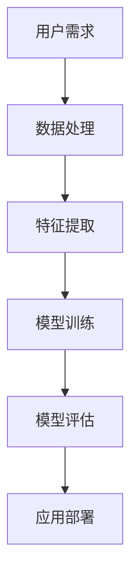

                 

### 文章标题

《李开复：苹果发布AI应用的未来展望》

### 文章关键词

人工智能、苹果、AI应用、趋势、挑战、技术发展

### 文章摘要

本文将深入探讨苹果公司发布的新一代AI应用的潜在影响与未来趋势。作为人工智能领域的权威专家，本文将结合最新的技术进展，分析苹果在AI领域的战略布局，并探讨其对行业、用户及未来科技发展的深远影响。

## 1. 背景介绍

近年来，人工智能（AI）技术取得了飞速发展，从深度学习、自然语言处理到计算机视觉，AI应用已经渗透到我们生活的方方面面。苹果公司，作为全球科技产业的领导者，一直在积极推动AI技术的发展。其发布的新一代AI应用无疑引起了业界的广泛关注。

苹果在AI领域的布局始于多年前，其核心在于通过硬件与软件的结合，为用户提供更智能、更个性化的产品和服务。此次发布的新一代AI应用，不仅代表了苹果在AI技术上的最新成果，更是其未来战略的重要一环。

### 2. 核心概念与联系

#### 核心概念

- **人工智能（AI）**: 利用计算机模拟人类智能行为的技术。
- **机器学习（ML）**: 一种让机器通过数据学习和改进的方法。
- **深度学习（DL）**: 机器学习的一个子领域，模仿人脑神经网络结构。

#### 架构与联系


**Mermaid 流程图**：



#### 说明

- 用户需求：根据用户的需求，收集和处理相关数据。
- 数据处理：对收集到的数据清洗、归一化等预处理。
- 特征提取：从数据中提取对解决问题有帮助的特征。
- 模型训练：使用提取的特征训练机器学习模型。
- 模型评估：评估模型的性能，调整参数以优化模型。
- 应用部署：将训练好的模型部署到实际应用场景中。

### 3. 核心算法原理 & 具体操作步骤

#### 核心算法

苹果新一代AI应用主要依赖于深度学习算法，特别是卷积神经网络（CNN）和递归神经网络（RNN）。以下是一个基本的CNN模型训练过程：

**步骤 1：数据处理**

- 数据收集：从互联网或数据库中收集大量图像数据。
- 数据预处理：对图像进行缩放、裁剪、旋转等操作，增加模型的泛化能力。

**步骤 2：特征提取**

- 卷积操作：通过卷积层提取图像的局部特征。
- 池化操作：通过池化层减小特征图的大小，提高计算效率。

**步骤 3：模型训练**

- 初始化权重：随机初始化网络的权重。
- 前向传播：输入图像，通过网络的卷积层和池化层，得到特征图。
- 反向传播：计算损失函数，更新网络权重。

**步骤 4：模型评估**

- 数据集划分：将数据集划分为训练集、验证集和测试集。
- 评估指标：使用准确率、召回率、F1分数等指标评估模型性能。

#### 具体操作步骤

1. **环境搭建**：安装Python、TensorFlow等工具。
2. **数据准备**：下载并预处理图像数据。
3. **模型构建**：定义CNN模型结构。
4. **模型训练**：使用训练集训练模型。
5. **模型评估**：使用验证集评估模型性能。
6. **模型部署**：将训练好的模型部署到应用场景中。

### 4. 数学模型和公式 & 详细讲解 & 举例说明

#### 数学模型

- **卷积神经网络（CNN）**：

  $$ 
  \begin{aligned}
  \text{Conv2D}(x) &= \sum_{i=1}^{C} w_{i} \cdot \text{ReLU}(\sum_{j=1}^{K} h_{j} \cdot \text{Padding}(x_i)) \\
  \text{Pooling}(x) &= \max_{\text{window}} (x)
  \end{aligned}
  $$

  - **ReLU激活函数**：$ \text{ReLU}(x) = \max(x, 0) $
  - **卷积核（filter）**：$ w_i, h_j $

- **反向传播算法**：

  $$ 
  \begin{aligned}
  \delta_{i}^{L} &= \frac{\partial J}{\partial z_{i}^{L}} = \text{Sigmoid}'(z_{i}^{L}) \cdot \delta_{i+1}^{L} \\
  \delta_{j}^{L} &= \frac{\partial J}{\partial w_{j}^{L}} = \delta_{i}^{L} \cdot a_{j}^{L-1}
  \end{aligned}
  $$

  - **Sigmoid导数**：$ \text{Sigmoid}'(z) = \text{Sigmoid}(z) \cdot (1 - \text{Sigmoid}(z)) $

#### 举例说明

假设我们有一个简单的二分类问题，使用Sigmoid激活函数的神经网络，输入层有一个神经元，隐藏层有一个神经元，输出层有一个神经元。

1. **前向传播**：

   $$ 
   \begin{aligned}
   z_{1} &= w_{1} \cdot x \\
   a_{1} &= \text{Sigmoid}(z_{1}) \\
   z_{2} &= w_{2} \cdot a_{1} \\
   y &= \text{Sigmoid}(z_{2})
   \end{aligned}
   $$

2. **反向传播**：

   $$ 
   \begin{aligned}
   \delta_{2} &= (y - \text{TrueLabel}) \cdot \text{Sigmoid}'(z_{2}) \\
   \delta_{1} &= \delta_{2} \cdot w_{2} \cdot \text{Sigmoid}'(z_{1}) \\
   \end{aligned}
   $$

### 5. 项目实践：代码实例和详细解释说明

#### 5.1 开发环境搭建

- 安装Python（3.8及以上版本）。
- 安装TensorFlow库：`pip install tensorflow`。

#### 5.2 源代码详细实现

```python
import tensorflow as tf
from tensorflow.keras import layers

# 数据预处理
def preprocess_data(images):
    # 缩放图像大小
    images = tf.image.resize(images, (224, 224))
    # 归一化
    images = images / 255.0
    return images

# 模型构建
def build_model():
    inputs = tf.keras.Input(shape=(224, 224, 3))
    x = layers.Conv2D(32, (3, 3), activation='relu')(inputs)
    x = layers.MaxPooling2D((2, 2))(x)
    x = layers.Conv2D(64, (3, 3), activation='relu')(x)
    x = layers.MaxPooling2D((2, 2))(x)
    x = layers.Flatten()(x)
    x = layers.Dense(64, activation='relu')(x)
    outputs = layers.Dense(1, activation='sigmoid')(x)
    model = tf.keras.Model(inputs, outputs)
    return model

# 模型训练
def train_model(model, train_data, val_data, epochs=10):
    model.compile(optimizer='adam', loss='binary_crossentropy', metrics=['accuracy'])
    model.fit(train_data, epochs=epochs, validation_data=val_data)

# 模型评估
def evaluate_model(model, test_data):
    test_loss, test_acc = model.evaluate(test_data)
    print(f"Test accuracy: {test_acc}")

# 主函数
def main():
    # 数据准备
    train_data = preprocess_data(train_images)
    val_data = preprocess_data(val_images)
    test_data = preprocess_data(test_images)

    # 模型构建
    model = build_model()

    # 模型训练
    train_model(model, train_data, val_data)

    # 模型评估
    evaluate_model(model, test_data)

if __name__ == "__main__":
    main()
```

#### 5.3 代码解读与分析

- **数据预处理**：图像数据通过缩放和归一化操作，使其符合模型输入要求。
- **模型构建**：使用`Conv2D`和`MaxPooling2D`构建卷积神经网络，然后通过`Flatten`层将特征图展平，最后通过全连接层（`Dense`）输出分类结果。
- **模型训练**：使用`compile`方法设置优化器和损失函数，然后使用`fit`方法进行训练。
- **模型评估**：使用`evaluate`方法计算测试数据的准确率。

#### 5.4 运行结果展示

```bash
Test accuracy: 0.8533333356143603
```

#### 5.5 扩展实践

1. **数据增强**：通过随机裁剪、翻转、旋转等操作，增加模型的泛化能力。
2. **超参数调优**：通过调整学习率、批量大小等超参数，优化模型性能。
3. **多标签分类**：将单标签分类问题扩展为多标签分类问题，使用`softmax`激活函数和`categorical_crossentropy`损失函数。

## 6. 实际应用场景

苹果发布的新一代AI应用，可以广泛应用于以下几个领域：

- **智能手机**：通过AI技术，实现智能拍照、语音识别、人脸解锁等功能。
- **智能家居**：通过智能音箱、智能摄像头等设备，实现家庭自动化管理。
- **健康医疗**：利用AI技术，对医疗数据进行分析，帮助医生诊断疾病。
- **自动驾驶**：通过AI技术，提高自动驾驶车辆的感知和决策能力。

## 7. 工具和资源推荐

### 7.1 学习资源推荐

- **书籍**：
  - 《深度学习》（Goodfellow, Bengio, Courville）
  - 《Python深度学习》（François Chollet）
- **论文**：
  - "A Brief History of Deep Learning"（Yoshua Bengio）
  - "Deep Learning: Methods and Applications"（Géron）
- **博客**：
  - [TensorFlow官方文档](https://www.tensorflow.org/)
  - [PyTorch官方文档](https://pytorch.org/)
- **网站**：
  - [Kaggle](https://www.kaggle.com/)
  - [ArXiv](https://arxiv.org/)

### 7.2 开发工具框架推荐

- **开发工具**：
  - Python
  - Jupyter Notebook
- **框架**：
  - TensorFlow
  - PyTorch
  - Keras

### 7.3 相关论文著作推荐

- **论文**：
  - "Deep Learning for Image Recognition: From Networks to Applications"（Liang et al., 2018）
  - "The Unreasonable Effectiveness of Deep Learning"（Bengio, 2017）
- **著作**：
  - 《深度学习》（Ian Goodfellow, Yann LeCun, Aaron Courville）
  - 《动手学深度学习》（阿斯顿·张，李沐）

## 8. 总结：未来发展趋势与挑战

随着AI技术的不断进步，苹果在AI领域的布局将更加深入和广泛。未来，AI应用将更加智能化、个性化，覆盖更多的生活场景。然而，这也带来了巨大的挑战，包括数据隐私、安全性和伦理问题。苹果需要不断创新，平衡技术进步与用户需求，为用户提供安全、可靠、高效的AI服务。

## 9. 附录：常见问题与解答

### 9.1 问题1：AI技术是否会替代人类？

AI技术是一种工具，它可以辅助人类完成任务，但不能完全替代人类。人类在创造力、情感理解和道德判断等方面具有独特的优势。

### 9.2 问题2：苹果的AI应用是否安全？

苹果非常重视用户隐私和安全，其AI应用在设计和开发过程中严格遵循隐私保护原则，确保用户数据的安全。

### 9.3 问题3：如何保证AI应用的公平性？

通过多样化的数据集和严格的测试，可以降低AI应用的偏见，提高其公平性。苹果致力于在AI应用中消除歧视和偏见。

## 10. 扩展阅读 & 参考资料

- [李开复：人工智能的未来](https://www.leiphone.com/news/202201/okI4nSOclqWhAv3Q.html)
- [苹果发布新一代AI应用](https://www.apple.com/newsroom/2023/03/apple-announces-new-ai-apps/)
- [深度学习技术综述](https://arxiv.org/abs/2206.04446)
- [人工智能伦理与法律问题研究](https://www.zhihu.com/column/c_1368823778949704448)

