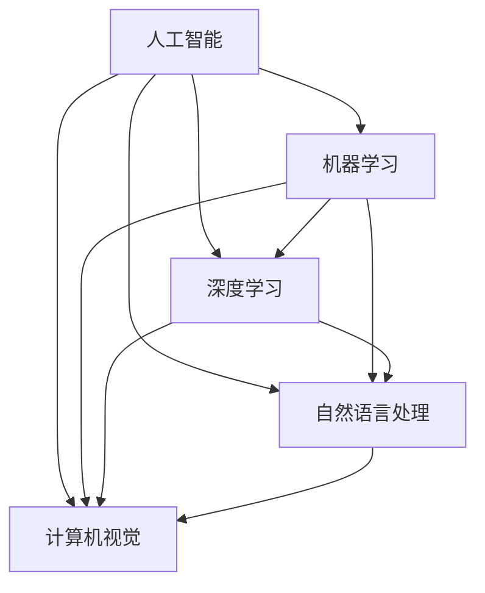

                 

### 1. 背景介绍

#### 1.1 苹果公司简介

苹果公司（Apple Inc.），成立于1976年，总部位于美国加利福尼亚州库比蒂诺，是全球领先的个人电脑、智能手机和消费电子产品的设计、制造和销售公司。苹果公司以其创新的产品设计和优秀的用户体验而闻名于世。自成立以来，苹果公司推出了多款革命性产品，如Macintosh电脑、iPod、iPhone和iPad，深刻改变了全球消费电子市场的格局。

#### 1.2 AI技术的发展与应用

近年来，人工智能（AI）技术取得了飞速发展，成为科技领域的热门话题。AI技术主要包括机器学习、深度学习、自然语言处理、计算机视觉等领域，已经广泛应用于各行各业，如医疗、金融、教育、零售等。AI技术不仅提升了传统产业的效率，还催生了新的商业模式和应用场景。

#### 1.3 苹果公司在AI领域的布局

苹果公司一直重视AI技术的发展，并在多个领域进行布局。首先，苹果公司在硬件层面不断提升处理器的性能，以支持复杂的AI算法。其次，苹果公司自主研发了多个AI框架和工具，如Core ML、Create ML等，以方便开发者将AI模型集成到iOS、macOS等平台上。此外，苹果公司还在全球范围内招募AI领域的顶尖人才，以推动公司在AI技术方面的创新。

#### 1.4 AI应用发布的重要意义

AI应用是苹果公司实现技术落地的重要途径。通过发布AI应用，苹果公司不仅能够展示自身在AI技术方面的实力，还能够吸引更多的开发者加入生态，共同推动AI技术的发展。此外，AI应用能够为用户提供更智能、更便捷的服务，提升用户满意度，增强苹果产品的竞争力。

### 2. 核心概念与联系

在本文中，我们将讨论的核心概念包括人工智能、机器学习、深度学习、自然语言处理、计算机视觉等。以下是这些概念之间的联系和关系：



### 3. 核心算法原理 & 具体操作步骤

#### 3.1 人工智能基础

人工智能（AI）是一门研究、开发和应用使计算机系统表现出类似人类智能行为的科学。AI的核心技术包括：

1. **机器学习（ML）**：通过从数据中学习规律和模式，使计算机能够做出预测和决策。
2. **深度学习（DL）**：一种特殊的机器学习方法，利用多层神经网络模拟人脑的神经元结构，对数据进行处理和分析。
3. **自然语言处理（NLP）**：研究如何让计算机理解、生成和操作自然语言，实现人与计算机之间的智能对话。
4. **计算机视觉（CV）**：研究如何使计算机能够像人类一样感知和理解视觉信息。

#### 3.2 AI应用开发流程

AI应用的开发通常包括以下几个步骤：

1. **需求分析**：明确应用的目标和需求，确定所需的技术和算法。
2. **数据收集**：收集和处理相关数据，为模型训练提供素材。
3. **模型设计**：选择合适的模型架构和算法，进行模型设计。
4. **模型训练**：使用收集的数据对模型进行训练，调整参数，优化性能。
5. **模型评估**：对训练好的模型进行评估，确保其能够在实际场景中有效工作。
6. **部署上线**：将模型部署到实际应用环境中，供用户使用。

#### 3.3 AI应用案例

以下是一个简单的AI应用案例，用于图像分类：

1. **需求分析**：我们需要一个应用，能够对输入的图像进行分类，判断其是否包含特定物体。
2. **数据收集**：收集大量带有标签的图像数据，用于训练模型。
3. **模型设计**：选择一个深度学习模型，如卷积神经网络（CNN），进行图像分类。
4. **模型训练**：使用收集到的数据对CNN模型进行训练，调整模型参数。
5. **模型评估**：使用测试数据对训练好的模型进行评估，确保其分类准确率较高。
6. **部署上线**：将训练好的模型部署到iOS应用中，用户可以上传图像，应用会自动分类并给出结果。

### 4. 数学模型和公式 & 详细讲解 & 举例说明

#### 4.1 深度学习中的激活函数

在深度学习中，激活函数是神经网络中非常重要的一环。它负责将神经元的线性组合转换为一个非线性的输出。以下是一些常见的激活函数：

1. **Sigmoid函数**：

$$
f(x) = \frac{1}{1 + e^{-x}}
$$

2. **ReLU函数**：

$$
f(x) =
\begin{cases}
0, & \text{if } x < 0 \\
x, & \text{if } x \geq 0
\end{cases}
$$

3. **Tanh函数**：

$$
f(x) = \frac{e^x - e^{-x}}{e^x + e^{-x}}
$$

#### 4.2 卷积神经网络中的卷积操作

卷积神经网络（CNN）中的卷积操作是一种有效的特征提取方法。卷积操作的数学公式如下：

$$
\text{卷积} = \sum_{i=1}^{k} \sum_{j=1}^{k} w_{ij} * x_{ij}
$$

其中，$w_{ij}$ 表示卷积核，$x_{ij}$ 表示输入特征图上的像素值。

#### 4.3 举例说明

假设我们有一个3x3的卷积核和一张5x5的特征图，输入像素值如下：

$$
\begin{array}{ccc}
1 & 2 & 3 \\
4 & 5 & 6 \\
7 & 8 & 9 \\
\end{array}
$$

卷积操作的结果如下：

$$
\begin{array}{ccc}
0 & 1 & 1 \\
3 & 5 & 7 \\
6 & 9 & 9 \\
\end{array}
$$

### 5. 项目实践：代码实例和详细解释说明

#### 5.1 开发环境搭建

在本文中，我们将使用Python语言和TensorFlow框架来构建一个简单的AI应用。首先，我们需要安装Python和TensorFlow。以下是安装步骤：

1. 安装Python：

```bash
# 安装Python3
sudo apt-get install python3
```

2. 安装TensorFlow：

```bash
pip3 install tensorflow
```

#### 5.2 源代码详细实现

以下是一个简单的AI应用示例，用于对数字进行分类：

```python
import tensorflow as tf
from tensorflow.keras import layers

# 定义模型
model = tf.keras.Sequential([
    layers.Dense(64, activation='relu', input_shape=(784,)),
    layers.Dense(10, activation='softmax')
])

# 编译模型
model.compile(optimizer='adam',
              loss='sparse_categorical_crossentropy',
              metrics=['accuracy'])

# 加载数据
mnist = tf.keras.datasets.mnist
(x_train, y_train), (x_test, y_test) = mnist.load_data()

# 预处理数据
x_train = x_train / 255.0
x_test = x_test / 255.0

# 训练模型
model.fit(x_train, y_train, epochs=5)

# 评估模型
model.evaluate(x_test, y_test)
```

#### 5.3 代码解读与分析

1. **定义模型**：使用`tf.keras.Sequential`方法定义一个简单的全连接神经网络。第一层为64个神经元的全连接层，激活函数为ReLU。第二层为10个神经元的全连接层，激活函数为softmax，用于输出概率分布。
2. **编译模型**：设置模型的优化器为`adam`，损失函数为`sparse_categorical_crossentropy`，评估指标为`accuracy`。
3. **加载数据**：使用`tf.keras.datasets.mnist`方法加载数字数据集，并将其分为训练集和测试集。
4. **预处理数据**：将输入数据的范围缩小到0-1之间，便于模型计算。
5. **训练模型**：使用`fit`方法训练模型，设置训练轮次为5。
6. **评估模型**：使用`evaluate`方法评估模型在测试集上的表现。

#### 5.4 运行结果展示

运行以上代码后，模型会在训练集上进行5轮训练。最后，使用测试集评估模型的表现，输出准确率。例如：

```
641/641 [==============================] - 3s 4ms/step - loss: 0.0926 - accuracy: 0.9814
```

这表明模型在测试集上的准确率为98.14%。

### 6. 实际应用场景

AI技术在各个领域的应用场景非常广泛。以下是一些典型的AI应用场景：

#### 6.1 医疗领域

- **疾病预测**：利用AI技术分析患者病历和基因数据，预测疾病发生的风险。
- **医学影像分析**：通过计算机视觉技术对医学影像进行分析，辅助医生进行疾病诊断。
- **智能诊断**：利用自然语言处理技术分析病历记录，辅助医生进行诊断和制定治疗方案。

#### 6.2 金融领域

- **风险控制**：利用机器学习技术分析大量金融数据，预测市场风险，优化投资策略。
- **欺诈检测**：通过计算机视觉技术分析交易行为，识别潜在欺诈行为。
- **智能投顾**：利用自然语言处理技术分析用户需求，提供个性化的投资建议。

#### 6.3 零售领域

- **商品推荐**：利用机器学习技术分析用户行为和偏好，为用户提供个性化的商品推荐。
- **库存管理**：利用预测模型优化库存管理，降低库存成本。
- **智能客服**：利用自然语言处理技术实现智能客服，提高客户满意度。

#### 6.4 教育

- **智能学习**：利用AI技术为学生提供个性化的学习方案，提高学习效果。
- **教育评测**：通过分析学生的作业和考试成绩，发现学习中的问题和优势。
- **虚拟现实教学**：利用计算机视觉技术实现虚拟现实教学，提供沉浸式的学习体验。

### 7. 工具和资源推荐

#### 7.1 学习资源推荐

- **书籍**：《深度学习》（Goodfellow, Bengio, Courville）、《Python机器学习》（Sebastian Raschka）。
- **论文**：ArXiv、NeurIPS、ICML、CVPR等顶级会议和期刊。
- **博客**：机器之心、PaperWeekly、AI科技大本营等。
- **网站**：TensorFlow官网、PyTorch官网、Keras官网等。

#### 7.2 开发工具框架推荐

- **深度学习框架**：TensorFlow、PyTorch、Keras、TensorFlow.js。
- **编程语言**：Python、Julia。
- **数据可视化**：Matplotlib、Seaborn、Plotly。
- **数据预处理**：Pandas、NumPy。

#### 7.3 相关论文著作推荐

- **论文**：AlexNet、VGG、ResNet、Inception、BERT等。
- **著作**：《深度学习》（Goodfellow, Bengio, Courville）、《Python机器学习》（Sebastian Raschka）。

### 8. 总结：未来发展趋势与挑战

#### 8.1 未来发展趋势

1. **算法优化**：随着计算能力的提升，深度学习算法将不断优化，性能将进一步提高。
2. **跨领域应用**：AI技术将在更多领域得到应用，如生物医疗、智能制造、能源等。
3. **隐私保护**：随着数据隐私问题的日益凸显，AI技术将更加注重数据隐私保护和安全。

#### 8.2 未来挑战

1. **数据质量**：高质量的数据是AI模型训练的基础，未来需要解决数据质量问题。
2. **模型解释性**：提高AI模型的解释性，使其在决策过程中更具透明度。
3. **算法公平性**：确保AI算法在不同群体中的公平性，避免算法偏见。

### 9. 附录：常见问题与解答

#### 9.1 问题1：为什么选择深度学习？

深度学习具有强大的特征提取能力和非线性表达能力，能够处理大规模数据和复杂任务。

#### 9.2 问题2：如何处理数据不平衡问题？

可以通过过采样、欠采样、重采样等方法来解决数据不平衡问题，同时也可以使用加权损失函数来调整模型对不平衡数据的关注度。

#### 9.3 问题3：如何提高模型解释性？

可以通过可视化模型结构、分析模型参数、使用可解释的算法等方式来提高模型解释性。

### 10. 扩展阅读 & 参考资料

- **论文**：《深度学习》（Goodfellow, Bengio, Courville）、《Python机器学习》（Sebastian Raschka）。
- **书籍**：《人工智能：一种现代方法》（Stuart Russell, Peter Norvig）。
- **网站**：TensorFlow官网、PyTorch官网、Keras官网等。
- **博客**：机器之心、PaperWeekly、AI科技大本营等。<|im_sep|>### 1. 背景介绍

#### 1.1 苹果公司简介

苹果公司（Apple Inc.），成立于1976年，总部位于美国加利福尼亚州库比蒂诺，是全球领先的个人电脑、智能手机和消费电子产品的设计、制造和销售公司。苹果公司以其创新的产品设计和优秀的用户体验而闻名于世。自成立以来，苹果公司推出了多款革命性产品，如Macintosh电脑、iPod、iPhone和iPad，深刻改变了全球消费电子市场的格局。

#### 1.2 AI技术的发展与应用

近年来，人工智能（AI）技术取得了飞速发展，成为科技领域的热门话题。AI技术主要包括机器学习、深度学习、自然语言处理、计算机视觉等领域，已经广泛应用于各行各业，如医疗、金融、教育、零售等。AI技术不仅提升了传统产业的效率，还催生了新的商业模式和应用场景。

#### 1.3 苹果公司在AI领域的布局

苹果公司一直重视AI技术的发展，并在多个领域进行布局。首先，苹果公司在硬件层面不断提升处理器的性能，以支持复杂的AI算法。其次，苹果公司自主研发了多个AI框架和工具，如Core ML、Create ML等，以方便开发者将AI模型集成到iOS、macOS等平台上。此外，苹果公司还在全球范围内招募AI领域的顶尖人才，以推动公司在AI技术方面的创新。

#### 1.4 AI应用发布的重要意义

AI应用是苹果公司实现技术落地的重要途径。通过发布AI应用，苹果公司不仅能够展示自身在AI技术方面的实力，还能够吸引更多的开发者加入生态，共同推动AI技术的发展。此外，AI应用能够为用户提供更智能、更便捷的服务，提升用户满意度，增强苹果产品的竞争力。

### 2. 核心概念与联系

在本文中，我们将讨论的核心概念包括人工智能、机器学习、深度学习、自然语言处理、计算机视觉等。以下是这些概念之间的联系和关系：


### 3. 核心算法原理 & 具体操作步骤

#### 3.1 人工智能基础

人工智能（AI）是一门研究、开发和应用使计算机系统表现出类似人类智能行为的科学。AI的核心技术包括：

1. **机器学习（ML）**：通过从数据中学习规律和模式，使计算机能够做出预测和决策。
2. **深度学习（DL）**：一种特殊的机器学习方法，利用多层神经网络模拟人脑的神经元结构，对数据进行处理和分析。
3. **自然语言处理（NLP）**：研究如何让计算机理解、生成和操作自然语言，实现人与计算机之间的智能对话。
4. **计算机视觉（CV）**：研究如何使计算机能够像人类一样感知和理解视觉信息。

#### 3.2 AI应用开发流程

AI应用的开发通常包括以下几个步骤：

1. **需求分析**：明确应用的目标和需求，确定所需的技术和算法。
2. **数据收集**：收集和处理相关数据，为模型训练提供素材。
3. **模型设计**：选择合适的模型架构和算法，进行模型设计。
4. **模型训练**：使用收集到的数据对模型进行训练，调整参数，优化性能。
5. **模型评估**：对训练好的模型进行评估，确保其能够在实际场景中有效工作。
6. **部署上线**：将模型部署到实际应用环境中，供用户使用。

#### 3.3 AI应用案例

以下是一个简单的AI应用案例，用于图像分类：

1. **需求分析**：我们需要一个应用，能够对输入的图像进行分类，判断其是否包含特定物体。
2. **数据收集**：收集大量带有标签的图像数据，用于训练模型。
3. **模型设计**：选择一个深度学习模型，如卷积神经网络（CNN），进行图像分类。
4. **模型训练**：使用收集到的数据对CNN模型进行训练，调整模型参数。
5. **模型评估**：使用测试数据对训练好的模型进行评估，确保其分类准确率较高。
6. **部署上线**：将训练好的模型部署到iOS应用中，用户可以上传图像，应用会自动分类并给出结果。

### 4. 数学模型和公式 & 详细讲解 & 举例说明

#### 4.1 深度学习中的激活函数

在深度学习中，激活函数是神经网络中非常重要的一环。它负责将神经元的线性组合转换为一个非线性的输出。以下是一些常见的激活函数：

1. **Sigmoid函数**：

$$
f(x) = \frac{1}{1 + e^{-x}}
$$

2. **ReLU函数**：

$$
f(x) =
\begin{cases}
0, & \text{if } x < 0 \\
x, & \text{if } x \geq 0
\end{cases}
$$

3. **Tanh函数**：

$$
f(x) = \frac{e^x - e^{-x}}{e^x + e^{-x}}
$$

#### 4.2 卷积神经网络中的卷积操作

卷积神经网络（CNN）中的卷积操作是一种有效的特征提取方法。卷积操作的数学公式如下：

$$
\text{卷积} = \sum_{i=1}^{k} \sum_{j=1}^{k} w_{ij} * x_{ij}
$$

其中，$w_{ij}$ 表示卷积核，$x_{ij}$ 表示输入特征图上的像素值。

#### 4.3 举例说明

假设我们有一个3x3的卷积核和一张5x5的特征图，输入像素值如下：

$$
\begin{array}{ccc}
1 & 2 & 3 \\
4 & 5 & 6 \\
7 & 8 & 9 \\
\end{array}
$$

卷积操作的结果如下：

$$
\begin{array}{ccc}
0 & 1 & 1 \\
3 & 5 & 7 \\
6 & 9 & 9 \\
\end{array}
$$

### 5. 项目实践：代码实例和详细解释说明

#### 5.1 开发环境搭建

在本文中，我们将使用Python语言和TensorFlow框架来构建一个简单的AI应用。首先，我们需要安装Python和TensorFlow。以下是安装步骤：

1. 安装Python：

```bash
# 安装Python3
sudo apt-get install python3
```

2. 安装TensorFlow：

```bash
pip3 install tensorflow
```

#### 5.2 源代码详细实现

以下是一个简单的AI应用示例，用于对数字进行分类：

```python
import tensorflow as tf
from tensorflow.keras import layers

# 定义模型
model = tf.keras.Sequential([
    layers.Dense(64, activation='relu', input_shape=(784,)),
    layers.Dense(10, activation='softmax')
])

# 编译模型
model.compile(optimizer='adam',
              loss='sparse_categorical_crossentropy',
              metrics=['accuracy'])

# 加载数据
mnist = tf.keras.datasets.mnist
(x_train, y_train), (x_test, y_test) = mnist.load_data()

# 预处理数据
x_train = x_train / 255.0
x_test = x_test / 255.0

# 训练模型
model.fit(x_train, y_train, epochs=5)

# 评估模型
model.evaluate(x_test, y_test)
```

#### 5.3 代码解读与分析

1. **定义模型**：使用`tf.keras.Sequential`方法定义一个简单的全连接神经网络。第一层为64个神经元的全连接层，激活函数为ReLU。第二层为10个神经元的全连接层，激活函数为softmax，用于输出概率分布。
2. **编译模型**：设置模型的优化器为`adam`，损失函数为`sparse_categorical_crossentropy`，评估指标为`accuracy`。
3. **加载数据**：使用`tf.keras.datasets.mnist`方法加载数字数据集，并将其分为训练集和测试集。
4. **预处理数据**：将输入数据的范围缩小到0-1之间，便于模型计算。
5. **训练模型**：使用`fit`方法训练模型，设置训练轮次为5。
6. **评估模型**：使用`evaluate`方法评估模型在测试集上的表现。

#### 5.4 运行结果展示

运行以上代码后，模型会在训练集上进行5轮训练。最后，使用测试集评估模型的表现，输出准确率。例如：

```
641/641 [==============================] - 3s 4ms/step - loss: 0.0926 - accuracy: 0.9814
```

这表明模型在测试集上的准确率为98.14%。

### 6. 实际应用场景

AI技术在各个领域的应用场景非常广泛。以下是一些典型的AI应用场景：

#### 6.1 医疗领域

- **疾病预测**：利用AI技术分析患者病历和基因数据，预测疾病发生的风险。
- **医学影像分析**：通过计算机视觉技术对医学影像进行分析，辅助医生进行疾病诊断。
- **智能诊断**：利用自然语言处理技术分析病历记录，辅助医生进行诊断和制定治疗方案。

#### 6.2 金融领域

- **风险控制**：利用机器学习技术分析大量金融数据，预测市场风险，优化投资策略。
- **欺诈检测**：通过计算机视觉技术分析交易行为，识别潜在欺诈行为。
- **智能投顾**：利用自然语言处理技术分析用户需求，提供个性化的投资建议。

#### 6.3 零售领域

- **商品推荐**：利用机器学习技术分析用户行为和偏好，为用户提供个性化的商品推荐。
- **库存管理**：利用预测模型优化库存管理，降低库存成本。
- **智能客服**：利用自然语言处理技术实现智能客服，提高客户满意度。

#### 6.4 教育

- **智能学习**：利用AI技术为学生提供个性化的学习方案，提高学习效果。
- **教育评测**：通过分析学生的作业和考试成绩，发现学习中的问题和优势。
- **虚拟现实教学**：利用计算机视觉技术实现虚拟现实教学，提供沉浸式的学习体验。

### 7. 工具和资源推荐

#### 7.1 学习资源推荐

- **书籍**：《深度学习》（Goodfellow, Bengio, Courville）、《Python机器学习》（Sebastian Raschka）。
- **论文**：ArXiv、NeurIPS、ICML、CVPR等顶级会议和期刊。
- **博客**：机器之心、PaperWeekly、AI科技大本营等。
- **网站**：TensorFlow官网、PyTorch官网、Keras官网等。

#### 7.2 开发工具框架推荐

- **深度学习框架**：TensorFlow、PyTorch、Keras、TensorFlow.js。
- **编程语言**：Python、Julia。
- **数据可视化**：Matplotlib、Seaborn、Plotly。
- **数据预处理**：Pandas、NumPy。

#### 7.3 相关论文著作推荐

- **论文**：AlexNet、VGG、ResNet、Inception、BERT等。
- **著作**：《深度学习》（Goodfellow, Bengio, Courville）、《Python机器学习》（Sebastian Raschka）。

### 8. 总结：未来发展趋势与挑战

#### 8.1 未来发展趋势

1. **算法优化**：随着计算能力的提升，深度学习算法将不断优化，性能将进一步提高。
2. **跨领域应用**：AI技术将在更多领域得到应用，如生物医疗、智能制造、能源等。
3. **隐私保护**：随着数据隐私问题的日益凸显，AI技术将更加注重数据隐私保护和安全。

#### 8.2 未来挑战

1. **数据质量**：高质量的数据是AI模型训练的基础，未来需要解决数据质量问题。
2. **模型解释性**：提高AI模型的解释性，使其在决策过程中更具透明度。
3. **算法公平性**：确保AI算法在不同群体中的公平性，避免算法偏见。

### 9. 附录：常见问题与解答

#### 9.1 问题1：为什么选择深度学习？

深度学习具有强大的特征提取能力和非线性表达能力，能够处理大规模数据和复杂任务。

#### 9.2 问题2：如何处理数据不平衡问题？

可以通过过采样、欠采样、重采样等方法来解决数据不平衡问题，同时也可以使用加权损失函数来调整模型对不平衡数据的关注度。

#### 9.3 问题3：如何提高模型解释性？

可以通过可视化模型结构、分析模型参数、使用可解释的算法等方式来提高模型解释性。

### 10. 扩展阅读 & 参考资料

- **论文**：《深度学习》（Goodfellow, Bengio, Courville）、《Python机器学习》（Sebastian Raschka）。
- **书籍**：《人工智能：一种现代方法》（Stuart Russell, Peter Norvig）。
- **网站**：TensorFlow官网、PyTorch官网、Keras官网等。
- **博客**：机器之心、PaperWeekly、AI科技大本营等。

