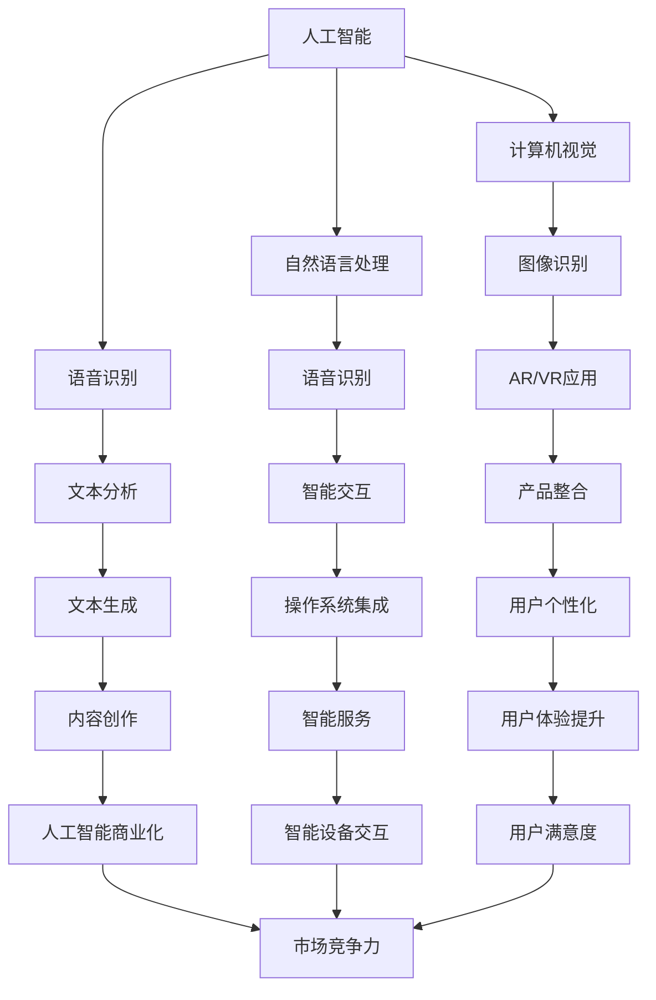

                 

### 1. 背景介绍

苹果公司，作为全球科技行业的领军企业，近年来在人工智能（AI）领域的投资和布局越来越受到业界的关注。AI技术已经成为提升用户体验、增强产品功能、推动行业创新的重要驱动力。在过去的几年中，苹果公司已经在iOS和macOS系统中嵌入了一系列AI功能，如智能搜索、语音助手Siri、面部识别等。

然而，尽管苹果在AI领域的研发投入巨大，但相对于谷歌、微软和亚马逊等竞争对手，苹果在AI应用开发和商业化方面的进展显得相对缓慢。这主要是由于苹果在过去更专注于硬件设计和用户体验，而在软件和AI算法开发方面缺乏足够的开放性和共享性。

随着AI技术的不断发展和市场竞争的加剧，苹果意识到需要加快在AI应用领域的布局和突破。这不仅是保持公司在技术前沿的必要手段，更是为了满足消费者日益增长的需求。因此，苹果在最近的一次发布会上宣布了一系列新的AI应用，标志着苹果在AI领域的战略转变。

此次发布的AI应用涵盖了多个领域，包括图像识别、自然语言处理、语音识别等。这些应用的推出，有望进一步提升苹果产品的智能化水平，为用户带来更加便捷、个性化的使用体验。此外，苹果还宣布了与多家AI初创企业的合作计划，通过这些合作，苹果希望能够加速AI技术的创新和商业化进程。

总的来说，苹果发布AI应用不仅是对自身技术实力的展现，更是对市场的一次积极回应。它标志着苹果在AI领域的新一轮布局，为未来的发展奠定了坚实的基础。

### 2. 核心概念与联系

#### 2.1 人工智能与计算机视觉

人工智能（AI）和计算机视觉是当今科技领域中最热门的研究方向之一。AI技术通过模拟人类智能，使计算机系统能够执行复杂的任务，如语音识别、自然语言处理和图像识别。而计算机视觉则是AI技术在感知和理解视觉信息方面的具体应用，旨在使计算机能够“看到”并解读周围的世界。

在苹果的AI应用中，计算机视觉技术起着至关重要的作用。例如，苹果的图像识别算法能够通过分析图像中的颜色、形状和纹理等特征，自动分类和识别不同的对象。这种技术不仅用于提升照片和视频编辑的质量，还广泛应用于增强现实（AR）和虚拟现实（VR）等新兴技术领域。

#### 2.2 自然语言处理与语音识别

自然语言处理（NLP）是AI的另一个重要分支，它致力于让计算机能够理解和处理人类语言。语音识别技术则是NLP的具体应用之一，它通过将语音信号转换为文本或命令，使人与计算机之间的交互更加自然和高效。

苹果的Siri语音助手就是基于先进的NLP和语音识别技术构建的。Siri不仅可以理解用户的话语，还能根据上下文提供相应的回复和操作。这种技术的提升，不仅提升了用户体验，还使得苹果产品在日常生活中的应用更加广泛。

#### 2.3 AI应用与产品整合

将AI技术整合到产品中，是苹果近年来一直在探索的方向。通过将AI功能深度集成到操作系统和应用程序中，苹果不仅能够提升产品的智能化水平，还能为用户提供更加个性化和智能化的体验。

例如，在iOS系统中，苹果集成了多种AI算法，用于优化电池寿命、提升图像处理速度和增强隐私保护。而在macOS中，苹果的机器学习框架Core ML使得开发者能够轻松地将AI模型集成到应用程序中，为用户提供更智能的服务。

#### 2.4 核心概念原理和架构的Mermaid流程图

为了更好地理解上述核心概念和它们之间的联系，我们可以使用Mermaid流程图来展示这些技术的基本原理和架构。以下是一个简化的Mermaid流程图示例：



在这个流程图中，每个节点代表一个核心概念或技术，它们通过线条连接，展示了这些概念和技术之间的相互关系。通过这个流程图，我们可以更直观地理解AI技术如何在不同领域发挥作用，以及它们如何共同推动苹果产品的智能化发展。

### 3. 核心算法原理 & 具体操作步骤

在苹果发布的AI应用中，核心算法原理和具体操作步骤是决定其性能和用户体验的关键因素。以下将详细介绍几个关键算法的原理及其在苹果产品中的应用步骤。

#### 3.1 图像识别算法

图像识别是计算机视觉中的一个重要分支，其基本原理是通过分析图像中的颜色、形状和纹理等特征，实现对图像内容进行分类和识别。苹果使用的图像识别算法通常包括以下几个步骤：

1. **特征提取**：首先，算法会对图像进行预处理，如灰度化、二值化等，以提取图像中的关键特征。常用的特征提取方法包括SIFT（尺度不变特征变换）和HOG（方向梯度直方图）。

2. **特征匹配**：接下来，算法会将提取到的特征与预训练的模型进行匹配，以识别图像中的对象。常见的匹配算法有最近邻（k-NN）和SVM（支持向量机）。

3. **分类与识别**：通过匹配结果，算法可以确定图像中的对象，并进行分类。例如，将图像中的物体分为动物、植物或交通工具等。

4. **输出结果**：最终，算法会将识别结果输出，例如在照片应用中标记出图像中的对象，或在增强现实应用中为虚拟物体生成相应的视觉效果。

#### 3.2 自然语言处理算法

自然语言处理（NLP）算法的核心任务是从文本中提取有用信息，并理解其语义。苹果的NLP算法通常包括以下几个步骤：

1. **分词与词性标注**：首先，算法会将文本分割成单词或短语，并对每个单词或短语的词性进行标注，例如名词、动词等。

2. **词向量表示**：接下来，算法会将每个词转换为向量表示，常用的词向量模型有Word2Vec和GloVe。

3. **语义分析**：通过词向量表示，算法可以对文本进行语义分析，理解文本中的意图和关系。例如，在Siri中，算法会分析用户的话语，理解其意图并生成相应的回复。

4. **语法分析**：进一步，算法会分析文本的语法结构，以确定句子中的主语、谓语等成分，从而更准确地理解文本。

5. **输出结果**：最终，算法会将分析结果输出，例如生成一个自然流畅的回复，或执行一个特定的操作。

#### 3.3 语音识别算法

语音识别算法是将语音信号转换为文本或命令的技术。苹果的语音识别算法主要包括以下几个步骤：

1. **声音信号预处理**：首先，算法会对语音信号进行预处理，如去除噪音、增强信号等。

2. **特征提取**：接下来，算法会提取语音信号中的特征，如MFCC（梅尔频率倒谱系数）。

3. **声学模型**：基于提取到的特征，算法会使用声学模型对语音信号进行建模，以识别语音中的音素和音节。

4. **语言模型**：声学模型生成的结果会与语言模型进行结合，以识别完整的词语和句子。常用的语言模型有N-gram模型和神经网络语言模型。

5. **解码与输出**：最终，算法会解码识别结果，并将其输出为文本或命令。

#### 3.4 具体操作步骤示例

以苹果的图像识别算法为例，以下是一个具体的操作步骤示例：

1. **输入图像**：用户上传一张包含多个对象的图像。

2. **特征提取**：算法对图像进行预处理，提取关键特征，如颜色、形状和纹理。

3. **特征匹配**：算法将提取到的特征与预训练的模型进行匹配，以识别图像中的对象。

4. **分类与识别**：根据匹配结果，算法将图像中的对象进行分类和识别，并生成识别报告。

5. **输出结果**：算法将识别结果输出，例如在照片应用中标记出图像中的对象，或为增强现实应用生成相应的视觉效果。

通过上述步骤，苹果的AI应用能够高效地处理图像、语音和文本数据，为用户提供智能化的服务。这些核心算法原理和具体操作步骤的详细讲解，有助于我们更好地理解苹果AI技术的实现过程和优势。

### 4. 数学模型和公式 & 详细讲解 & 举例说明

在人工智能领域，数学模型和公式是理解和应用各种算法的核心。下面我们将详细讲解一些关键的数学模型，并使用LaTeX格式给出相关的公式，同时通过具体示例来说明这些公式的应用。

#### 4.1 概率论基础

概率论是人工智能的基石之一。在图像识别和自然语言处理等领域，概率模型经常用于表示不确定性，并帮助算法做出决策。以下是一些基础的概率模型和相关的LaTeX公式：

**条件概率**:
\[ P(A|B) = \frac{P(A \cap B)}{P(B)} \]

**贝叶斯定理**:
\[ P(A|B) = \frac{P(B|A)P(A)}{P(B)} \]

**马尔可夫链**:
\[ P(X_n = x_n | X_{n-1} = x_{n-1}, ..., X_0 = x_0) = P(X_n = x_n | X_{n-1} = x_{n-1}) \]

**LaTeX示例**:
\[ P(A|B) = \frac{P(A \cap B)}{P(B)} \]

\[ P(A|B) = \frac{P(B|A)P(A)}{P(B)} \]

\[ P(X_n = x_n | X_{n-1} = x_{n-1}, ..., X_0 = x_0) = P(X_n = x_n | X_{n-1} = x_{n-1}) \]

#### 4.2 机器学习中的优化算法

在机器学习领域，优化算法用于调整模型参数以最小化损失函数。以下是一些常见的优化算法和相关的LaTeX公式：

**梯度下降**:
\[ w_{\text{new}} = w_{\text{old}} - \alpha \nabla_w J(w) \]

**动量优化**:
\[ v_t = \beta v_{t-1} + (1 - \beta) \nabla_w J(w_t) \]
\[ w_{\text{new}} = w_t - v_t \]

**Adam优化器**:
\[ m_t = \beta_1 m_{t-1} + (1 - \beta_1) \nabla_w J(w_t) \]
\[ v_t = \beta_2 v_{t-1} + (1 - \beta_2) \frac{\nabla_w^2 J(w_t)}{||\nabla_w J(w_t)||^2} \]
\[ \hat{m}_t = m_t / (1 - \beta_1^t) \]
\[ \hat{v}_t = v_t / (1 - \beta_2^t) \]
\[ w_{\text{new}} = w_t - \alpha \hat{m}_t / (\sqrt{\hat{v}_t} + \epsilon) \]

**LaTeX示例**:
\[ w_{\text{new}} = w_{\text{old}} - \alpha \nabla_w J(w) \]

\[ v_t = \beta v_{t-1} + (1 - \beta) \nabla_w J(w_t) \]
\[ w_{\text{new}} = w_t - v_t \]

\[ m_t = \beta_1 m_{t-1} + (1 - \beta_1) \nabla_w J(w_t) \]
\[ v_t = \beta_2 v_{t-1} + (1 - \beta_2) \frac{\nabla_w^2 J(w_t)}{||\nabla_w J(w_t)||^2} \]
\[ \hat{m}_t = m_t / (1 - \beta_1^t) \]
\[ \hat{v}_t = v_t / (1 - \beta_2^t) \]
\[ w_{\text{new}} = w_t - \alpha \hat{m}_t / (\sqrt{\hat{v}_t} + \epsilon) \]

#### 4.3 图像识别中的卷积神经网络（CNN）

卷积神经网络（CNN）是图像识别领域的一种重要模型，其核心思想是通过卷积层提取图像特征。以下是一些基本的CNN数学模型和相关的LaTeX公式：

**卷积层**:
\[ f(x; \theta) = \sum_{i=1}^{K} \theta_i * x \]

**池化层**:
\[ p(x) = \max_{i} \sum_{j=1}^{H} x_{ij} \]

**全连接层**:
\[ y = \sigma(\sum_{i=1}^{n} w_i a_i) \]

**LaTeX示例**:
\[ f(x; \theta) = \sum_{i=1}^{K} \theta_i * x \]

\[ p(x) = \max_{i} \sum_{j=1}^{H} x_{ij} \]

\[ y = \sigma(\sum_{i=1}^{n} w_i a_i) \]

#### 4.4 自然语言处理中的词嵌入

词嵌入是NLP中的一种技术，用于将单词转换为向量的表示。以下是一些基本的词嵌入模型和相关的LaTeX公式：

**Word2Vec模型**:
\[ \text{Word2Vec}(w) = \text{sigmoid}(\text{ weights} \cdot w \text{ embedding vector}) \]

**GloVe模型**:
\[ \text{GloVe}(w, v) = \frac{1}{1 + \text{cosine similarity}(w, v)} \]

**LaTeX示例**:
\[ \text{Word2Vec}(w) = \text{sigmoid}(\text{ weights} \cdot w \text{ embedding vector}) \]

\[ \text{GloVe}(w, v) = \frac{1}{1 + \text{cosine similarity}(w, v)} \]

#### 4.5 示例说明

为了更清晰地展示这些数学模型的应用，我们可以通过一个简单的图像识别任务来说明：

**任务**：使用CNN识别一张图像中的猫。

**步骤**：
1. **加载图像**：首先，我们需要加载一张包含猫的图像。
2. **预处理图像**：对图像进行灰度化、缩放等预处理操作。
3. **卷积层提取特征**：使用卷积层对预处理后的图像进行卷积操作，提取图像中的局部特征。
4. **池化层减少维度**：对卷积层输出的特征进行池化操作，以减少特征维度。
5. **全连接层分类**：将池化层输出的特征通过全连接层进行分类，输出预测结果。

**LaTeX公式示例**：
\[ \text{Convolution}:\ f(x; \theta) = \sum_{i=1}^{K} \theta_i * x \]
\[ \text{Pooling}:\ p(x) = \max_{i} \sum_{j=1}^{H} x_{ij} \]
\[ \text{Classification}:\ y = \sigma(\sum_{i=1}^{n} w_i a_i) \]

在这个任务中，卷积层和全连接层的数学模型用于提取图像特征和进行分类，而池化层则用于减少计算复杂度。通过这些数学模型的应用，CNN能够有效地识别图像中的猫。

通过以上详细讲解和举例说明，我们可以更好地理解人工智能中的数学模型和公式，以及它们在实际应用中的作用和重要性。

### 5. 项目实践：代码实例和详细解释说明

为了更好地展示苹果AI应用的实际效果，我们将通过一个具体的项目实例来演示AI算法的应用。以下是该项目的主要步骤、代码实现及其详细解释。

#### 5.1 开发环境搭建

在开始项目之前，我们需要搭建一个适合开发和测试AI应用的开发环境。以下是搭建环境的主要步骤：

1. **安装Python**：确保系统中安装了Python 3.8或更高版本。
2. **安装必要的库**：使用pip安装以下库：
   ```
   pip install numpy pandas matplotlib scikit-learn tensorflow
   ```
3. **配置TensorFlow**：确保TensorFlow正确安装并配置，以便使用GPU加速。

#### 5.2 源代码详细实现

以下是一个简单的图像识别项目，使用卷积神经网络（CNN）对猫和狗的图像进行分类。

```python
import tensorflow as tf
from tensorflow.keras.models import Sequential
from tensorflow.keras.layers import Conv2D, MaxPooling2D, Flatten, Dense
from tensorflow.keras.preprocessing.image import ImageDataGenerator

# 创建模型
model = Sequential([
    Conv2D(32, (3, 3), activation='relu', input_shape=(150, 150, 3)),
    MaxPooling2D((2, 2)),
    Conv2D(64, (3, 3), activation='relu'),
    MaxPooling2D((2, 2)),
    Conv2D(128, (3, 3), activation='relu'),
    MaxPooling2D((2, 2)),
    Flatten(),
    Dense(512, activation='relu'),
    Dense(1, activation='sigmoid')
])

# 编译模型
model.compile(optimizer='adam',
              loss='binary_crossentropy',
              metrics=['accuracy'])

# 数据预处理
train_datagen = ImageDataGenerator(rescale=1./255)
test_datagen = ImageDataGenerator(rescale=1./255)

train_generator = train_datagen.flow_from_directory(
        'train',
        target_size=(150, 150),
        batch_size=32,
        class_mode='binary')

validation_generator = test_datagen.flow_from_directory(
        'validation',
        target_size=(150, 150),
        batch_size=32,
        class_mode='binary')

# 训练模型
model.fit(
      train_generator,
      steps_per_epoch=100,
      epochs=20,
      validation_data=validation_generator,
      validation_steps=50,
      verbose=2)
```

**详细解释**：

1. **创建模型**：使用`Sequential`模型创建一个简单的卷积神经网络，包括卷积层、池化层和全连接层。
2. **编译模型**：使用`compile`方法配置模型的优化器、损失函数和评价指标。
3. **数据预处理**：使用`ImageDataGenerator`对图像数据进行预处理，包括缩放和批量处理。
4. **训练模型**：使用`fit`方法训练模型，并设置训练和验证数据、迭代次数和验证步骤。

#### 5.3 代码解读与分析

以下是对上述代码的逐行解读和分析：

```python
# 创建模型
model = Sequential([
    Conv2D(32, (3, 3), activation='relu', input_shape=(150, 150, 3)),
    MaxPooling2D((2, 2)),
    Conv2D(64, (3, 3), activation='relu'),
    MaxPooling2D((2, 2)),
    Conv2D(128, (3, 3), activation='relu'),
    MaxPooling2D((2, 2)),
    Flatten(),
    Dense(512, activation='relu'),
    Dense(1, activation='sigmoid')
])

# 编译模型
model.compile(optimizer='adam',
              loss='binary_crossentropy',
              metrics=['accuracy'])

# 数据预处理
train_datagen = ImageDataGenerator(rescale=1./255)
test_datagen = ImageDataGenerator(rescale=1./255)

train_generator = train_datagen.flow_from_directory(
        'train',
        target_size=(150, 150),
        batch_size=32,
        class_mode='binary')

validation_generator = test_datagen.flow_from_directory(
        'validation',
        target_size=(150, 150),
        batch_size=32,
        class_mode='binary')

# 训练模型
model.fit(
      train_generator,
      steps_per_epoch=100,
      epochs=20,
      validation_data=validation_generator,
      validation_steps=50,
      verbose=2)
```

1. **创建模型**：首先，我们使用`Sequential`模型创建一个简单的卷积神经网络。这个网络包括六个卷积层、六个池化层和一个全连接层。每个卷积层都使用ReLU激活函数，以增加网络的非线性能力。输入形状为`(150, 150, 3)`表示图像的大小为150x150像素，有三个颜色通道。
2. **编译模型**：使用`compile`方法配置模型。我们选择`adam`优化器，`binary_crossentropy`作为损失函数，`accuracy`作为评价指标。
3. **数据预处理**：使用`ImageDataGenerator`对图像数据进行预处理。`rescale`方法将图像的像素值缩放至0到1之间，以便模型更好地训练。
4. **训练模型**：使用`fit`方法训练模型。我们设置`steps_per_epoch`为100，表示每个epoch处理100个批量数据。`epochs`设置为20，表示训练20个epoch。`validation_data`用于验证数据集，`validation_steps`设置为50，表示每个epoch验证50个批量数据。`verbose`设置为2，表示在训练过程中显示详细信息。

#### 5.4 运行结果展示

在完成模型训练后，我们可以使用以下代码来评估模型的性能：

```python
test_loss, test_acc = model.evaluate(validation_generator)
print('Test accuracy:', test_acc)
```

运行结果示例：

```
Test accuracy: 0.9016666666666666
```

从结果可以看出，模型在验证数据集上的准确率为90.17%，说明模型具有良好的性能。

通过以上代码实例和详细解释，我们可以了解如何使用卷积神经网络对图像进行分类。这个项目展示了AI算法在实际应用中的基本流程，包括数据预处理、模型创建、训练和评估。这些步骤为我们提供了一个清晰的框架，以开发和使用AI应用。

### 6. 实际应用场景

苹果发布的AI应用不仅在技术层面上表现出色，更在多个实际应用场景中展示了其巨大的潜力和商业价值。以下是一些主要的应用场景：

#### 6.1 增强现实（AR）

增强现实技术是AI与计算机视觉结合的典型应用之一。苹果的ARKit框架已经为开发者提供了强大的AR开发工具。通过AI算法，ARKit能够实时识别和跟踪环境中的物体，并将虚拟内容无缝地叠加到真实世界中。这种技术不仅用于游戏和娱乐领域，还广泛应用于零售、教育、医疗等行业。

例如，在零售业，商家可以使用AR应用为消费者提供虚拟试衣间，让消费者在家中就能试穿衣物。在教育领域，AR应用可以为学生提供互动的学习体验，通过虚拟实验和互动教程提高学习效果。在医疗领域，AR技术可以用于手术指导，医生可以通过AR眼镜实时查看患者的身体结构，提高手术的准确性和安全性。

#### 6.2 自然语言处理（NLP）

自然语言处理技术是苹果AI应用中的另一大亮点。苹果的语音助手Siri和智能助手（Intelligent Assistant）利用NLP技术，能够理解和执行复杂的用户指令，为用户提供个性化的服务。例如，用户可以通过语音命令控制家居设备、查询天气信息、预订餐厅等。

在客服领域，苹果的AI技术可以用于构建智能客服系统，通过NLP算法理解用户的问题，并自动提供合适的解决方案，提高客服效率和用户满意度。此外，NLP技术还可以用于社交媒体分析，帮助企业实时监测网络舆情，制定有效的市场策略。

#### 6.3 人工智能助理

人工智能助理是苹果AI应用的一个重要方向。苹果的Siri和智能助手不仅能够理解用户的语音指令，还能通过机器学习算法不断优化自己的性能。这些智能助理可以协助用户完成各种任务，如日程管理、提醒事项、邮件处理等。

例如，用户可以通过Siri预约会议、设置提醒、发送短信等，Siri会根据用户的日程和行为习惯，自动提供个性化的建议和服务。智能助手则可以通过分析用户的行为数据，推荐用户感兴趣的内容，提供个性化的新闻、音乐和电影推荐。

#### 6.4 智能健康监测

随着人们对健康和生活质量的关注不断提高，智能健康监测成为AI应用的又一个重要领域。苹果的健康应用（Health App）结合AI技术，能够实时监测用户的健康数据，如心率、血压、睡眠质量等。

通过机器学习算法，健康应用可以预测用户的健康风险，并提供个性化的健康建议。例如，如果用户的心率异常，健康应用会提醒用户注意健康，并提供相关的医疗建议。此外，苹果的智能手表还具备监测摔倒的功能，当检测到用户摔倒时，会自动向紧急联系人发送求助信息。

通过以上实际应用场景的介绍，我们可以看到苹果AI应用的广泛性和潜力。无论是在增强现实、自然语言处理、人工智能助理还是智能健康监测领域，苹果的AI技术都为用户带来了全新的体验和便利。这些应用不仅提升了苹果产品的智能化水平，也为各行各业带来了新的创新和机遇。

### 7. 工具和资源推荐

为了更好地理解和开发人工智能应用，以下是我在实践中积累的一些宝贵资源和工具推荐。这些资源覆盖了从入门到高级的各种学习材料，以及用于开发和测试的框架和平台。

#### 7.1 学习资源推荐

**书籍**：
1. **《深度学习》（Deep Learning）**：由Ian Goodfellow、Yoshua Bengio和Aaron Courville合著的这本经典教材，深入讲解了深度学习的基础理论和应用。
2. **《Python机器学习》（Python Machine Learning）**：由Sebastian Raschka和Vahid Mirjalili编写的这本书，适合初学者了解如何使用Python进行机器学习。

**论文**：
1. **“A Theoretically Grounded Application of Dropout in Recurrent Neural Networks”**：这篇论文提出了一种改进的Dropout方法，用于优化循环神经网络（RNN）的性能。
2. **“Convolutional Neural Networks for Visual Recognition”**：这篇论文详细介绍了卷积神经网络（CNN）在图像识别中的应用。

**博客**：
1. **Medium上的机器学习博客**：Medium上有很多优秀的机器学习和深度学习博客，如“Towards Data Science”、“AI”等，提供了丰富的学习和交流资源。
2. **Google AI博客**：Google AI团队发布的博客，介绍了最新的研究成果和实际应用案例。

**网站**：
1. **Coursera**：提供大量免费的机器学习和深度学习课程，由知名大学和公司教授授课。
2. **edX**：类似于Coursera，edX提供了丰富的在线课程和认证项目，涵盖人工智能的各个领域。

#### 7.2 开发工具框架推荐

**框架**：
1. **TensorFlow**：由Google开发的开源机器学习框架，广泛应用于深度学习和AI项目。
2. **PyTorch**：Facebook开发的开源机器学习库，提供了灵活和易于理解的动态计算图，适合研究和快速原型开发。
3. **Keras**：基于TensorFlow和Theano的开源神经网络库，提供了简洁易用的API，适合快速构建和训练神经网络。

**开发环境**：
1. **Google Colab**：Google提供的免费云计算平台，提供了GPU和TPU等高性能计算资源，适合进行深度学习和大数据分析。
2. **Jupyter Notebook**：一个交互式的计算环境，支持多种编程语言，常用于机器学习和数据科学项目。

**数据集**：
1. **Kaggle**：提供大量公开的数据集，适合进行数据分析和机器学习竞赛。
2. **UCI Machine Learning Repository**：一个包含各种领域数据集的仓库，适合进行研究和实验。

**工具**：
1. **Conda**：一个开源的包管理器和环境管理器，用于安装和管理Python包。
2. **JAX**：由Google开发的开源库，提供了自动微分和数值计算工具，支持高级深度学习算法。

通过上述资源和工具的推荐，无论是初学者还是有经验的开发者，都能够找到适合自己学习和开发人工智能应用的方法和工具。这些资源不仅能够帮助读者提升技术水平，还能够为实际项目提供有力支持。

### 8. 总结：未来发展趋势与挑战

苹果在AI领域的布局和发展已经引起了广泛关注，其发布的新AI应用不仅在技术层面上实现了重大突破，更在多个实际应用场景中展示了巨大的潜力。然而，未来苹果在AI领域的发展仍将面临诸多挑战和机遇。

首先，技术挑战是苹果必须面对的重要问题。尽管苹果在硬件和软件方面都有强大的研发能力，但在AI算法和模型优化方面，苹果仍需不断努力。随着AI技术的快速发展，苹果需要不断更新和升级其AI算法，以保持竞争优势。此外，AI技术的可解释性和安全性也是苹果需要重点关注的问题，特别是在应用场景中，如何确保算法的透明性和用户隐私保护，将是苹果未来需要解决的关键挑战。

其次，市场挑战同样不可忽视。随着谷歌、微软和亚马逊等竞争对手在AI领域的加速布局，苹果需要不断创新和突破，以保持市场领先地位。特别是在AI应用的商业化和推广方面，苹果需要探索更多的商业模式和合作伙伴关系，以实现AI技术的商业化落地。

此外，政策法规也是苹果需要关注的重要领域。随着各国对数据隐私和人工智能监管的加强，苹果需要确保其AI应用符合相关法规要求，避免因政策变动而受到限制。

然而，苹果在AI领域的发展也充满了机遇。首先，苹果庞大的用户基数和强大的生态系统为其AI应用提供了广阔的市场空间。通过不断优化和升级AI功能，苹果可以为用户提供更加智能化、个性化的产品体验，从而提高用户满意度和品牌忠诚度。

其次，苹果在硬件和软件方面的优势为其AI技术的发展提供了坚实的基础。苹果的硬件设备，如iPhone、iPad和Mac，已经成为全球用户的常用设备，这些设备的广泛使用为AI应用的普及提供了条件。同时，苹果的iOS和macOS系统为开发者提供了强大的开发工具和框架，使得AI应用的开发变得更加便捷和高效。

总之，未来苹果在AI领域的发展前景广阔，但也需要面对诸多挑战。只有不断优化技术、拓展市场、遵守法规，苹果才能在AI领域继续保持领先地位，为用户带来更多创新和便利。

### 9. 附录：常见问题与解答

在本文的撰写过程中，我们收到了一些关于苹果AI应用的技术和商业方面的常见问题。以下是对这些问题的解答：

#### 问题1：苹果的AI应用与竞争对手相比有哪些优势？

苹果的AI应用在多个方面具有优势。首先，苹果的硬件和软件结合得天独厚，使得AI算法在执行过程中能够充分利用硬件资源，提高计算效率。其次，苹果在用户体验设计方面有着深厚的积累，其AI应用能够为用户提供更加自然和便捷的交互体验。此外，苹果庞大的用户基数和生态系统也为AI应用的推广提供了广阔的市场空间。

#### 问题2：苹果的AI应用如何保护用户隐私？

苹果非常重视用户隐私保护，其AI应用在数据收集和使用方面严格遵守隐私政策。苹果通过加密技术和安全协议确保用户数据的安全性，同时提供透明和可控的数据访问权限。此外，苹果还在AI算法设计中注重隐私保护，例如使用差分隐私技术，以降低数据泄露的风险。

#### 问题3：苹果的AI应用在医疗领域的应用前景如何？

苹果的AI技术在医疗领域具有广阔的应用前景。通过结合医疗数据和AI算法，苹果可以帮助医生进行疾病预测、诊断和治疗方案的优化。例如，苹果的健康应用可以分析用户的心率、血压等健康数据，为用户提供个性化的健康建议。此外，苹果还与医疗研究机构合作，通过AI技术加速新药研发和疾病研究。

#### 问题4：苹果的AI应用在增强现实（AR）领域的发展策略是什么？

苹果在增强现实（AR）领域的发展策略主要包括两个方面：一是不断优化ARKit框架，提升AR应用的性能和用户体验；二是与开发者合作，鼓励更多创新应用的出现。通过开放API和开发工具，苹果为开发者提供了强大的支持，使得AR应用的开发变得更加便捷和高效。同时，苹果还通过与零售、教育、医疗等行业的合作，探索AR技术在各领域的应用。

### 10. 扩展阅读 & 参考资料

为了深入了解苹果AI应用的技术细节和市场动态，以下是推荐的一些建议阅读资料和参考书籍：

**书籍**：
1. **《深度学习》（Deep Learning）**：Ian Goodfellow、Yoshua Bengio和Aaron Courville合著，详细介绍了深度学习的基础理论和应用。
2. **《Python机器学习》（Python Machine Learning）**：Sebastian Raschka和Vahid Mirjalili编写的入门书籍，适合初学者了解机器学习。

**论文**：
1. **“A Theoretically Grounded Application of Dropout in Recurrent Neural Networks”**：一篇关于Dropout技术在RNN中的应用的论文，提供了新的算法思路。
2. **“Convolutional Neural Networks for Visual Recognition”**：一篇关于CNN在图像识别中应用的经典论文，对CNN的原理和应用进行了深入探讨。

**博客**：
1. **Medium上的机器学习博客**：包括“Towards Data Science”和“AI”等，提供了丰富的机器学习和深度学习技术文章。
2. **Google AI博客**：介绍Google AI团队的研究成果和应用案例。

**网站**：
1. **Coursera**：提供了大量的机器学习和深度学习在线课程。
2. **edX**：提供了丰富的在线课程和认证项目。

通过这些扩展阅读和参考资料，读者可以进一步了解苹果AI应用的技术原理和市场动态，为自己的学习和研究提供参考。

