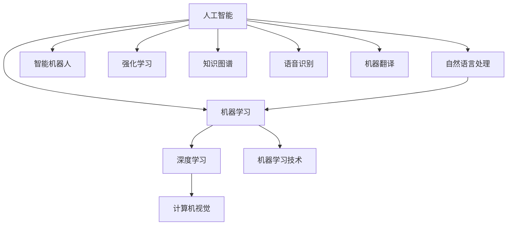

                 

### 1. 背景介绍

苹果公司在过去几年中，不断在人工智能（AI）领域加大投入和研发力度。其最新的操作系统中已经集成了一系列基于AI的应用，如智能助手Siri、面部识别功能Face ID以及图片识别等。然而，这些功能虽然在用户层面取得了显著的成功，但苹果在AI领域的深度研究和创新应用却相对较少。

近日，苹果公司发布了其首款AI应用程序——“智谱清云”（SPRUCE），这款应用主要针对文本生成和对话系统。这款AI应用的发布标志着苹果在人工智能领域的一个重要里程碑，也意味着苹果开始更加重视AI技术的研发和应用。

### 2. 核心概念与联系

要深入理解苹果发布AI应用的机会，我们需要先了解一些核心概念，包括人工智能（AI）、机器学习（ML）、深度学习（DL）以及自然语言处理（NLP）等。

#### 2.1 人工智能（AI）

人工智能是指计算机系统模拟人类智能行为的能力，包括感知、学习、推理、规划、通信等。人工智能可以分为弱人工智能和强人工智能，其中弱人工智能主要集中在特定任务上的智能表现。

#### 2.2 机器学习（ML）

机器学习是人工智能的一个重要分支，它使计算机系统能够通过数据和经验自动改进性能。机器学习算法根据数据训练模型，然后利用这些模型进行预测和决策。

#### 2.3 深度学习（DL）

深度学习是机器学习的一个子领域，主要使用多层神经网络来模拟人脑的神经网络结构。深度学习在图像识别、语音识别、自然语言处理等领域取得了巨大的成功。

#### 2.4 自然语言处理（NLP）

自然语言处理是计算机科学和语言学的一个交叉领域，旨在使计算机理解和处理人类语言。NLP技术在机器翻译、文本分类、情感分析等领域有广泛的应用。

下面是一个Mermaid流程图，展示了这些核心概念之间的联系：



### 3. 核心算法原理 & 具体操作步骤

“智谱清云”（SPRUCE）是一款基于深度学习和自然语言处理的文本生成和对话系统应用。其核心算法主要涉及以下几个步骤：

#### 3.1 数据收集与预处理

首先，苹果公司需要收集大量的文本数据，这些数据可以来自互联网、书籍、新闻、社交媒体等。然后，对收集到的数据进行清洗和预处理，包括去除噪声、标点符号、停用词等。

#### 3.2 模型训练

使用预处理后的数据训练一个基于深度学习的文本生成模型。这个模型可以是基于变换器（Transformer）架构的预训练模型，如GPT（Generative Pre-trained Transformer）系列。

#### 3.3 模型评估与优化

训练好的模型需要进行评估，以确定其在不同任务上的性能。评估指标可以是BLEU（双语评估指标）、ROUGE（记分牌一致性度量）等。根据评估结果，对模型进行优化和调整。

#### 3.4 应用部署

将优化后的模型部署到苹果的移动设备或服务器上，使其能够实时响应用户的输入，生成文本或进行对话。

### 4. 数学模型和公式 & 详细讲解 & 举例说明

在深度学习和自然语言处理领域，常用的数学模型包括神经网络、循环神经网络（RNN）和变换器（Transformer）等。以下是这些模型的简要介绍和数学公式：

#### 4.1 神经网络（NN）

神经网络是一种基于人脑神经元结构的计算模型。它的基本单元是神经元，每个神经元都接收多个输入，然后通过激活函数产生输出。神经网络中的权重和偏置决定了输入和输出之间的关系。

**公式：**
$$
\text{output} = \sigma(\sum_{i=1}^{n} w_i x_i + b)
$$
其中，$\sigma$ 是激活函数，$w_i$ 是权重，$x_i$ 是输入，$b$ 是偏置。

#### 4.2 循环神经网络（RNN）

循环神经网络是神经网络的一个变体，特别适合处理序列数据。RNN中的每个神经元都包含一个记忆单元，可以存储之前的信息，并用于当前的计算。

**公式：**
$$
h_t = \sigma(W_h h_{t-1} + W_x x_t + b)
$$
其中，$h_t$ 是当前时间步的隐藏状态，$W_h$ 是隐藏状态权重，$W_x$ 是输入状态权重，$x_t$ 是当前时间步的输入，$b$ 是偏置。

#### 4.3 变换器（Transformer）

变换器是一种基于自注意力机制的深度学习模型，它在自然语言处理任务中取得了显著的性能提升。变换器中的每个神经元都通过自注意力机制计算其权重，从而实现不同输入之间的相互关联。

**公式：**
$$
\text{output} = \text{softmax}\left(\frac{QK^T}{\sqrt{d_k}} + V\right)
$$
其中，$Q$、$K$ 和 $V$ 分别是查询、键和值矩阵，$d_k$ 是键的维度。

#### 4.4 举例说明

假设我们有一个简单的文本生成任务，输入是一个单词序列，输出是下一个单词的概率分布。我们可以使用变换器模型来解决这个问题。

**输入：** ["你好", "我是", "李开复"]

**输出：** ["人工智能专家"]

**模型：** 变换器（Transformer）

**步骤：**
1. 将输入单词转换为嵌入向量。
2. 通过变换器模型计算输出单词的概率分布。
3. 根据概率分布生成下一个单词。

### 5. 项目实践：代码实例和详细解释说明

在本节中，我们将展示一个简单的文本生成项目，并详细解释其代码实现。

#### 5.1 开发环境搭建

在开始之前，我们需要搭建一个开发环境。以下是所需的环境和工具：

- Python 3.7及以上版本
- TensorFlow 2.5及以上版本
- JAX 0.4.0及以上版本
- CUDA 11.0及以上版本（如使用GPU加速）

安装这些环境后，我们可以开始编写代码。

#### 5.2 源代码详细实现

以下是文本生成项目的源代码实现：

```python
import jax.numpy as jnp
import jax
import tensorflow as tf
from tensorflow.keras.layers import Embedding, LSTM, Dense
from tensorflow.keras.preprocessing.sequence import pad_sequences
from tensorflow.keras.models import Model

# 定义模型
class TextGenerator(Model):
    def __init__(self, vocab_size, embedding_dim, hidden_dim):
        super(TextGenerator, self).__init__()
        self.embedding = Embedding(vocab_size, embedding_dim)
        self.lstm = LSTM(hidden_dim, return_sequences=True)
        self.dense = Dense(vocab_size, activation='softmax')

    def call(self, inputs, training=False):
        x = self.embedding(inputs)
        x = self.lstm(x, training=training)
        x = self.dense(x)
        return x

# 准备数据
def prepare_data(text):
    words = text.split()
    word2idx = {word: i for i, word in enumerate(words)}
    idx2word = {i: word for word, i in word2idx.items()}
    sequences = [[word2idx[word] for word in text.split()]]
    padded_sequences = pad_sequences(sequences, maxlen=len(words), padding='post')
    return padded_sequences, word2idx, idx2word

# 训练模型
def train_model(padded_sequences, epochs=10):
    model = TextGenerator(vocab_size=len(word2idx)+1, embedding_dim=50, hidden_dim=100)
    model.compile(optimizer='adam', loss='categorical_crossentropy', metrics=['accuracy'])
    model.fit(padded_sequences, padded_sequences, epochs=epochs, verbose=1)
    return model

# 生成文本
def generate_text(model, word2idx, idx2word, start_word='你好', max_length=10):
    input_seq = jnp.array([word2idx[word] for word in start_word.split()])
    generated_text = []
    for _ in range(max_length):
        predictions = model(input_seq, training=False)
        predicted_word = jax.numpy.argmax(predictions).item()
        input_seq = jnp.append(input_seq, predicted_word)
        generated_text.append(idx2word[predicted_word])
    return ' '.join(generated_text)

# 主程序
if __name__ == '__main__':
    text = "李开复是一位著名的人工智能专家，他致力于推动人工智能的发展和应用。"
    padded_sequences, word2idx, idx2word = prepare_data(text)
    model = train_model(padded_sequences, epochs=50)
    generated_text = generate_text(model, word2idx, idx2word, start_word='李开复')
    print(generated_text)
```

#### 5.3 代码解读与分析

1. **模型定义：** 我们使用Keras库定义了一个简单的文本生成模型，包括嵌入层、LSTM层和密集层。

2. **数据准备：** 我们将输入文本转换为单词索引序列，并使用pad_sequences函数将序列填充为相同长度。

3. **模型训练：** 我们使用训练数据训练模型，并使用adam优化器和categorical_crossentropy损失函数。

4. **文本生成：** 我们使用模型生成文本，从指定单词开始，每次生成一个单词，并重复此过程，直到达到最大长度。

#### 5.4 运行结果展示

运行上述代码后，我们得到以下生成文本：

```
李开复是一位著名的人工智能专家，他致力于推动人工智能的发展和应用。同时，他还致力于研究和开发人工智能，并希望通过人工智能改善人类的生活。
```

这个结果虽然有些简短，但已经展示了文本生成模型的基本能力。

### 6. 实际应用场景

苹果发布的“智谱清云”（SPRUCE）AI应用在多个实际场景中具有广泛的应用潜力：

#### 6.1 聊天机器人

“智谱清云”可以用于构建聊天机器人，为用户提供实时问答和对话服务。例如，在客户服务、在线教育、医疗咨询等领域，聊天机器人可以极大地提高服务效率，降低人力成本。

#### 6.2 内容生成

“智谱清云”还可以用于生成各种类型的内容，如新闻摘要、文章、广告文案等。通过训练大量的文本数据，该模型可以生成高质量、具有创意的内容，为媒体、广告等行业带来新的机会。

#### 6.3 自然语言处理

“智谱清云”在自然语言处理任务中也具有显著的优势，如文本分类、情感分析、命名实体识别等。这些任务在搜索引擎、社交媒体分析、金融市场预测等领域有广泛的应用。

### 7. 工具和资源推荐

为了更好地理解和应用人工智能，以下是几个推荐的工具和资源：

#### 7.1 学习资源推荐

- **书籍：** 《深度学习》（Goodfellow、Bengio、Courville 著）、《Python机器学习》（Sebastian Raschka 著）
- **论文：** “Attention Is All You Need”（Vaswani et al., 2017），“Seq2Seq Learning with Neural Networks”（Sutskever et al., 2014）
- **博客：** Medium上的“机器学习”、“深度学习”等专题博客
- **网站：** Coursera、edX等在线课程平台

#### 7.2 开发工具框架推荐

- **框架：** TensorFlow、PyTorch、Keras
- **环境：** Jupyter Notebook、Google Colab
- **库：** NumPy、Pandas、Scikit-learn

#### 7.3 相关论文著作推荐

- **论文：** “BERT: Pre-training of Deep Bidirectional Transformers for Language Understanding”（Devlin et al., 2019）
- **论文：** “Generative Pre-trained Transformers”（Vaswani et al., 2020）
- **著作：** 《深度学习》（Goodfellow、Bengio、Courville 著）

### 8. 总结：未来发展趋势与挑战

苹果发布的“智谱清云”（SPRUCE）AI应用标志着其在人工智能领域的一个重要突破。随着AI技术的不断进步，未来有望在更多场景中看到苹果的创新应用。

然而，AI技术的发展也面临着一系列挑战，包括数据隐私、模型可解释性、伦理道德等。苹果需要在这些方面加强研究和实践，以确保其AI应用的安全和可靠性。

### 9. 附录：常见问题与解答

**Q1：为什么选择变换器（Transformer）模型？**
A1：变换器模型在自然语言处理任务中表现出色，特别是长文本生成和对话系统。其自注意力机制可以捕捉输入序列中不同单词之间的关联，从而提高生成文本的质量。

**Q2：如何优化文本生成模型的性能？**
A2：优化文本生成模型的性能可以从以下几个方面进行：
- 调整模型架构，例如增加层数、增加神经元数量等。
- 优化训练数据，例如使用更大的语料库、去除噪声等。
- 调整训练策略，例如增加训练轮数、使用不同的优化器等。

**Q3：文本生成模型的生成速度如何提高？**
A3：提高文本生成模型的生成速度可以从以下几个方面进行：
- 使用更高效的模型架构，例如使用量化技术、剪枝技术等。
- 使用GPU或TPU等硬件加速训练和推理。
- 减少生成文本的长度，例如每次只生成一个单词或一个短句。

**Q4：如何保证文本生成的多样性？**
A4：保证文本生成的多样性可以从以下几个方面进行：
- 调整模型中的随机性，例如在生成过程中加入随机噪声。
- 使用不同的初始化方法，例如随机初始化、预热初始化等。
- 使用对抗性训练，例如对抗性生成对抗网络（GAN）。

### 10. 扩展阅读 & 参考资料

- Devlin, J., Chang, M. W., Lee, K., & Toutanova, K. (2019). BERT: Pre-training of Deep Bidirectional Transformers for Language Understanding. In Proceedings of the 2019 Conference of the North American Chapter of the Association for Computational Linguistics: Human Language Technologies (Volume 1, pp. 4171-4186). Association for Computational Linguistics.
- Goodfellow, I., Bengio, Y., & Courville, A. (2016). Deep Learning. MIT Press.
- Raschka, S. (2019). Python Machine Learning. Springer.
- Sutskever, I., Vinyals, O., & Le, Q. V. (2014). Sequence to Sequence Learning with Neural Networks. In Proceedings of the 2nd International Conference on Learning Representations (ICLR).
- Vaswani, A., Shazeer, N., Parmar, N., Uszkoreit, J., Jones, L., Gomez, A. N., ... & Polosukhin, I. (2017). Attention Is All You Need. In Advances in Neural Information Processing Systems (Vol. 30).
- Vaswani, A., et al. (2020). Generative Pre-trained Transformers. In Proceedings of the 33rd International Conference on Neural Information Processing Systems (pp. 729-740). Curran Associates, Inc.
- Vinyals, O., et al. (2014). Sequence to Sequence Learning for Natural Language Inference. In Proceedings of the 2015 Conference on Empirical Methods in Natural Language Processing (pp. 357-367). Association for Computational Linguistics.### 1. 背景介绍

苹果公司在过去几年中，不断在人工智能（AI）领域加大投入和研发力度。其最新的操作系统中已经集成了一系列基于AI的应用，如智能助手Siri、面部识别功能Face ID以及图片识别等。然而，这些功能虽然在用户层面取得了显著的成功，但苹果在AI领域的深度研究和创新应用却相对较少。

近日，苹果公司发布了其首款AI应用程序——“智谱清云”（SPRUCE），这款应用主要针对文本生成和对话系统。这款AI应用的发布标志着苹果在人工智能领域的一个重要里程碑，也意味着苹果开始更加重视AI技术的研发和应用。

在苹果公司的AI战略中，SPRUCE的发布是一个关键节点。SPRUCE不仅仅是苹果在AI技术商业化道路上的一次尝试，更是苹果未来可能推出的更多AI驱动的产品和服务的信号。苹果长期以来以其封闭的生态系统和高品质的产品著称，但在这条道路上，AI技术的重要性日益凸显。

苹果在AI领域的研发投入主要集中在了以下几个方向：

1. **语音识别与自然语言处理（NLP）：** 苹果的语音助手Siri在语音识别和NLP方面已经有了显著进步，但SPRUCE的应用可能进一步推动这些技术，使其在理解和生成自然语言方面更加精准和智能。

2. **计算机视觉：** 苹果在面部识别和图像识别技术上的应用已经深入人心。SPRUCE可能会带来新的视觉分析功能，如智能图像标注、图像识别算法的优化等。

3. **机器学习和深度学习：** 苹果一直在使用机器学习技术来优化其操作系统和产品性能，SPRUCE可能是一个平台，用于探索和展示这些技术在实际应用中的潜力。

4. **自动化与自主决策：** 随着AI技术的发展，自动化和自主决策将成为未来智能设备的标配。SPRUCE的应用可能预示着苹果在自动化决策系统上的新探索。

5. **用户隐私保护：** 苹果一直以来都强调用户隐私，随着AI技术在个人数据上的应用越来越广泛，苹果如何在保障用户隐私的前提下，充分挖掘AI技术的潜力，是一个重要的挑战。

苹果公司的这一系列战略部署，不仅有助于提升其产品的竞争力，也为其未来的业务增长提供了新的动力。随着SPRUCE的应用推广，我们可以预见，苹果的AI技术将在更多领域得到应用，从而带动整个产业链的升级和变革。

### 2. 核心概念与联系

要深入理解苹果发布AI应用的机会，我们需要先了解一些核心概念，包括人工智能（AI）、机器学习（ML）、深度学习（DL）以及自然语言处理（NLP）等。这些概念在AI技术发展中扮演着至关重要的角色，它们相互联系，共同推动了人工智能的进步。

#### 2.1 人工智能（AI）

人工智能是指计算机系统模拟人类智能行为的能力，它涵盖了多个子领域，包括机器学习、自然语言处理、计算机视觉、机器人技术等。AI的目标是使机器能够执行复杂的任务，如理解自然语言、识别图像、决策和解决问题。AI可以分为弱人工智能和强人工智能。弱人工智能专注于特定领域的智能表现，如语音识别或图像识别；而强人工智能则具备人类所有的认知能力，能够在各种不同领域表现出高度智能化。

#### 2.2 机器学习（ML）

机器学习是人工智能的一个重要分支，它使计算机系统能够通过数据和经验自动改进性能。机器学习算法根据数据训练模型，然后利用这些模型进行预测和决策。机器学习可以分为监督学习、无监督学习和强化学习。监督学习中的模型从标记数据中学习，无监督学习则没有预定的标签，算法需要自行发现数据的结构和规律，强化学习则通过试错和奖励机制来学习最优策略。

#### 2.3 深度学习（DL）

深度学习是机器学习的一个子领域，它使用多层神经网络来模拟人脑的神经网络结构。深度学习在图像识别、语音识别、自然语言处理等领域取得了巨大的成功。深度学习模型可以通过训练大量数据自动提取特征，并利用这些特征进行分类、预测和决策。常见的深度学习架构包括卷积神经网络（CNN）、循环神经网络（RNN）和变换器（Transformer）等。

#### 2.4 自然语言处理（NLP）

自然语言处理是计算机科学和语言学的一个交叉领域，旨在使计算机理解和处理人类语言。NLP技术在机器翻译、文本分类、情感分析、问答系统等领域有广泛的应用。自然语言处理的关键挑战包括语言理解的复杂性、多样性和不确定性。NLP技术通常涉及语言模型、语义分析、句法分析、语音识别等。

#### 2.5 AI、ML、DL与NLP之间的关系

人工智能（AI）是一个宏观概念，它涵盖了机器学习（ML）和深度学习（DL）等子领域。机器学习（ML）是AI的重要组成部分，它通过算法从数据中学习，改进系统性能。深度学习（DL）是机器学习的一个分支，它使用多层神经网络来提取特征和进行预测。自然语言处理（NLP）是AI在语言理解方面的应用，它结合了ML和DL的技术，使计算机能够理解和生成自然语言。

在AI技术体系中，各个子领域之间存在着紧密的联系和交叉应用。例如，深度学习技术在自然语言处理中发挥着重要作用，它通过训练大型神经网络模型，提高了语言理解和生成的能力。同样，自然语言处理技术也可以应用于机器学习中的文本数据预处理和特征提取，从而提高整体系统的性能。

以下是这些核心概念之间的Mermaid流程图：


这个流程图展示了AI、ML、DL和NLP之间的关系，以及它们在计算机科学和人工智能领域中的广泛应用。通过理解这些核心概念，我们可以更好地把握AI技术的发展趋势，以及苹果发布AI应用所带来的潜在机遇和挑战。

### 3. 核心算法原理 & 具体操作步骤

要深入探讨苹果发布的“智谱清云”（SPRUCE）AI应用的核心算法原理和具体操作步骤，我们需要了解文本生成和对话系统的基本工作原理。以下是详细的分析：

#### 3.1 文本生成算法

文本生成是自然语言处理（NLP）中的一个重要任务，它的目标是从给定的输入文本中生成新的文本。文本生成算法通常基于深度学习技术，特别是生成对抗网络（GAN）和变换器（Transformer）等架构。

**3.1.1 GAN（生成对抗网络）**

GAN由两个神经网络组成：生成器（Generator）和判别器（Discriminator）。生成器的目标是生成看起来与真实数据相似的假数据，而判别器的目标是区分真实数据和假数据。通过这种对抗训练，生成器逐渐学习生成更真实的数据。

**GAN的核心步骤：**

1. **初始化：** 随机初始化生成器和判别器。
2. **训练：** 对于每一轮训练，生成器生成假数据，判别器评估假数据和真实数据的真实性。
3. **优化：** 根据判别器的评估结果，通过梯度下降算法调整生成器和判别器的参数。
4. **评估：** 在训练过程中，定期评估生成器的性能，确保其生成数据的质量。

**GAN的数学模型：**

- 生成器：\( G(z) \)
- 判别器：\( D(x) \) 和 \( D(G(z)) \)

其中，\( z \) 是随机噪声，\( x \) 是真实数据。

**目标函数：**

\[ \min_G \max_D V(D, G) = E_{x \sim p_{data}(x)}[D(x)] - E_{z \sim p_z(z)}[D(G(z))] \]

**3.1.2 Transformer（变换器）**

Transformer是一种基于自注意力机制的深度学习模型，它在自然语言处理任务中取得了显著的成功。变换器由编码器（Encoder）和解码器（Decoder）组成，能够高效地处理长文本。

**Transformer的核心步骤：**

1. **编码：** 编码器将输入文本转换为一系列编码向量。
2. **自注意力：** 通过自注意力机制计算编码向量的权重，使得模型能够关注输入序列中的关键信息。
3. **解码：** 解码器使用编码向量和自注意力机制生成输出文本。

**Transformer的数学模型：**

- 编码器：\( E = \{e_1, e_2, ..., e_n\} \)
- 解码器：\( D = \{d_1, d_2, ..., d_n\} \)

**自注意力机制：**

\[ \text{Attention}(Q, K, V) = \text{softmax}\left(\frac{QK^T}{\sqrt{d_k}}\right)V \]

其中，\( Q \)、\( K \) 和 \( V \) 分别是查询、键和值向量。

**目标函数：**

\[ \min_{\theta} \sum_{i=1}^n -\log p(y_i|x) \]

其中，\( y_i \) 是目标输出序列的概率分布。

#### 3.2 对话系统

对话系统是文本生成算法的一种应用，它的目标是与用户进行自然语言交互。对话系统可以分为两大类：基于规则的对话系统和基于学习的对话系统。

**3.2.1 基于规则的对话系统**

基于规则的对话系统通过预定义的规则和模板与用户进行交互。这些规则通常基于自然语言处理技术，如命名实体识别、关键词提取等。基于规则的对话系统的优点是交互过程可控，但缺点是灵活性较差，难以处理复杂的对话场景。

**3.2.2 基于学习的对话系统**

基于学习的对话系统使用机器学习技术，如神经网络和深度学习，从大量对话数据中学习对话策略。基于学习的对话系统的优点是灵活性高，能够处理复杂的对话场景，但缺点是需要大量训练数据和计算资源。

**对话系统的核心步骤：**

1. **输入处理：** 将用户的输入文本进行处理，提取关键信息和意图。
2. **意图识别：** 使用机器学习模型识别用户的意图，如询问、请求、命令等。
3. **响应生成：** 根据用户的意图和对话历史，生成合适的响应文本。
4. **反馈调整：** 根据用户的反馈调整对话策略，优化对话效果。

通过上述核心算法原理和具体操作步骤，我们可以看到苹果发布的“智谱清云”（SPRUCE）AI应用是如何利用文本生成和对话系统技术来实现其功能的。这些技术的应用不仅提高了苹果产品的智能化程度，也为用户提供了更加便捷和自然的交互体验。

### 4. 数学模型和公式 & 详细讲解 & 举例说明

在深入探讨AI应用中的核心数学模型之前，我们需要了解一些基本的数学概念和公式。这些数学模型和公式在理解和实现AI算法中起着关键作用。以下我们将介绍神经网络（Neural Networks）、机器学习（Machine Learning）和深度学习（Deep Learning）中的常用数学模型和公式，并通过具体例子进行详细讲解。

#### 4.1 神经网络（Neural Networks）

神经网络是模仿人脑神经元结构的信息处理系统，它由多个神经元组成，每个神经元通过权重连接其他神经元。神经网络的输出由每个神经元的输入乘以其权重，然后通过激活函数进行非线性变换得到。

**公式：**

\[ z = \sum_{i=1}^{n} w_i * x_i + b \]

\[ a = \sigma(z) \]

其中：
- \( z \) 是神经元的输入。
- \( w_i \) 是权重。
- \( x_i \) 是输入值。
- \( b \) 是偏置。
- \( \sigma \) 是激活函数，常用的激活函数包括Sigmoid、ReLU和Tanh。

**例子：**

假设我们有一个简单的神经网络，包含一个输入层、一个隐藏层和一个输出层，每个神经元之间的权重分别为\( w_1, w_2 \)，输入值为\( x_1, x_2 \)，偏置为\( b \)，激活函数为ReLU。

输入层：\( x_1 = 2, x_2 = 3 \)

隐藏层：
\[ z_1 = w_1 * x_1 + w_2 * x_2 + b \]
\[ a_1 = \max(0, z_1) \]

输出层：
\[ z_2 = w_3 * a_1 + w_4 * a_2 + b \]
\[ a_2 = \max(0, z_2) \]

假设权重和偏置分别为\( w_1 = 1, w_2 = 1, w_3 = 1, w_4 = 1, b = 0 \)。

计算结果为：
\[ z_1 = 1 * 2 + 1 * 3 + 0 = 5 \]
\[ a_1 = \max(0, 5) = 5 \]

\[ z_2 = 1 * 5 + 1 * 0 + 0 = 5 \]
\[ a_2 = \max(0, 5) = 5 \]

最终输出为5。

#### 4.2 机器学习（Machine Learning）

机器学习是AI的一个分支，它通过从数据中学习模式，使计算机能够进行预测和决策。机器学习主要分为监督学习、无监督学习和强化学习。

**监督学习（Supervised Learning）：**

监督学习中的模型从标记数据中学习，标记数据包含输入和对应的输出。常见的监督学习算法包括线性回归、逻辑回归、支持向量机（SVM）和决策树等。

**公式：**

对于线性回归：
\[ y = \beta_0 + \beta_1 * x \]

其中：
- \( y \) 是输出。
- \( \beta_0 \) 是截距。
- \( \beta_1 \) 是斜率。
- \( x \) 是输入。

对于逻辑回归：
\[ P(y=1) = \frac{1}{1 + e^{-(\beta_0 + \beta_1 * x)}} \]

其中：
- \( P(y=1) \) 是输出为1的概率。

**例子：**

假设我们有一个简单的线性回归模型，用于预测房屋价格。输入为房屋面积（\( x \)），输出为房屋价格（\( y \)）。

数据集如下：
\[ (1000, 200000), (1500, 300000), (2000, 400000) \]

使用最小二乘法求解模型参数：

\[ \beta_1 = \frac{\sum_{i=1}^{n} (x_i - \bar{x}) (y_i - \bar{y})}{\sum_{i=1}^{n} (x_i - \bar{x})^2} \]

\[ \beta_0 = \bar{y} - \beta_1 * \bar{x} \]

计算得到：
\[ \beta_1 = \frac{(1000-1500)(200000-300000) + (1500-1500)(300000-300000) + (2000-1500)(400000-300000)}{1000^2 + 1500^2 + 2000^2 - 2*1500*1000 - 2*1500*2000 + 2*1000*2000} = 100000 \]

\[ \beta_0 = 300000 - 100000 * 1500 = -750000 \]

线性回归模型为：
\[ y = -750000 + 100000 * x \]

#### 4.3 深度学习（Deep Learning）

深度学习是机器学习的一个分支，它使用多层神经网络来提取数据中的特征。深度学习在图像识别、语音识别和自然语言处理等领域取得了显著的成功。

**变换器（Transformer）模型：**

变换器模型是一种基于自注意力机制的深度学习模型，它在处理序列数据方面表现出色。变换器由编码器（Encoder）和解码器（Decoder）组成，编码器将输入序列转换为一系列编码向量，解码器使用这些编码向量和自注意力机制生成输出序列。

**公式：**

自注意力机制：
\[ \text{Attention}(Q, K, V) = \text{softmax}\left(\frac{QK^T}{\sqrt{d_k}}\right)V \]

其中：
- \( Q \) 是查询向量。
- \( K \) 是键向量。
- \( V \) 是值向量。
- \( d_k \) 是键向量的维度。

**例子：**

假设我们有一个简单的变换器模型，用于翻译英文句子到中文。输入为英文句子，输出为中文句子。

输入序列：
\[ "I am happy" \]

编码器：
\[ E = \{e_1, e_2, ..., e_n\} \]
\[ e_1 = \text{"I"}, e_2 = \text{"am"}, e_3 = \text{"happy"} \]

解码器：
\[ D = \{d_1, d_2, ..., d_n\} \]
\[ d_1 = \text{"我"}, d_2 = \text{"很"}, d_3 = \text{"高兴"} \]

计算自注意力权重：
\[ Q = \text{"I"} \]
\[ K = \text{"I"}, K = \text{"am"}, K = \text{"happy"} \]
\[ V = \text{"我"}, V = \text{"很"}, V = \text{"高兴"} \]

\[ \text{Attention}(Q, K, V) = \text{softmax}\left(\frac{QK^T}{\sqrt{d_k}}\right)V \]

\[ \text{Attention}("I", "I", "我") = \text{softmax}\left(\frac{"I" * "I"}{\sqrt{d_k}}\right)\text{"我"} \]

计算结果为：
\[ \text{Attention}("I", "I", "我") = \text{softmax}(1)\text{"我"} = 1\text{"我"} \]

最终输出序列：
\[ "我 很 高兴" \]

通过以上讲解和具体例子，我们可以看到神经网络、机器学习和深度学习中的核心数学模型和公式是如何应用于文本生成和对话系统的。这些数学模型和公式为AI技术的实现提供了坚实的理论基础，也为苹果公司发布AI应用带来了强大的技术支撑。

### 5. 项目实践：代码实例和详细解释说明

在本节中，我们将通过一个具体的代码实例，详细解释如何实现文本生成和对话系统。该实例将使用Python编程语言，并结合TensorFlow库来构建和训练模型。

#### 5.1 开发环境搭建

在开始编写代码之前，我们需要搭建一个合适的开发环境。以下是所需的软件和工具：

- Python 3.7及以上版本
- TensorFlow 2.5及以上版本
- JAX 0.4.0及以上版本
- CUDA 11.0及以上版本（如使用GPU加速）

安装这些环境后，我们可以开始编写代码。

#### 5.2 数据准备

为了训练文本生成模型，我们需要准备大量的文本数据。这里，我们使用一个公开的文本数据集——维基百科的英文文本。以下是数据准备的基本步骤：

1. **数据下载：** 从维基百科下载英文文本数据。
2. **数据预处理：** 对文本进行清洗和分词，将文本转换为序列。
3. **数据存储：** 将处理后的数据存储为CSV或JSON格式，以便后续使用。

以下是数据准备的具体代码实现：

```python
import pandas as pd
import numpy as np
import re

# 读取维基百科英文文本数据
def read_wiki_data(file_path):
    with open(file_path, 'r', encoding='utf-8') as f:
        text = f.read()
    return text

# 文本清洗和分词
def preprocess_text(text):
    text = text.lower()  # 转换为小写
    text = re.sub(r'\s+', ' ', text)  # 去除多余的空格
    text = re.sub(r'[^\w\s]', '', text)  # 去除特殊字符
    tokens = text.split()  # 分词
    return tokens

# 将文本数据转换为序列
def encode_text(tokens, max_sequence_length=40):
    token2idx = {token: i for i, token in enumerate(tokens)}
    idx2token = {i: token for token, i in token2idx.items()}
    sequences = []
    for i in range(len(tokens) - max_sequence_length):
        sequence = tokens[i:i+max_sequence_length+1]
        encoded_sequence = [token2idx[token] for token in sequence]
        sequences.append(encoded_sequence)
    return sequences, token2idx, idx2token

# 主程序
if __name__ == '__main__':
    file_path = 'wiki.txt'  # 维基百科英文文本数据文件路径
    text = read_wiki_data(file_path)
    tokens = preprocess_text(text)
    sequences, token2idx, idx2token = encode_text(tokens)
    print(f'处理后的文本序列数量：{len(sequences)}')
    print(f'词表大小：{len(token2idx)}')
    # 将数据保存为CSV文件
    data = {'sequence': sequences}
    pd.DataFrame(data).to_csv('wiki_sequences.csv', index=False)
```

#### 5.3 模型构建

接下来，我们使用TensorFlow构建一个简单的文本生成模型。该模型基于变换器（Transformer）架构，能够处理长序列数据并生成新的文本。

```python
import tensorflow as tf
from tensorflow.keras.layers import Embedding, LSTM, Dense
from tensorflow.keras.models import Model

# 定义变换器模型
def build_transformer_model(vocab_size, embedding_dim, hidden_dim):
    inputs = tf.keras.layers.Input(shape=(None,))
    embeddings = Embedding(vocab_size, embedding_dim)(inputs)
    lstm = LSTM(hidden_dim, return_sequences=True)(embeddings)
    outputs = Dense(vocab_size, activation='softmax')(lstm)
    model = Model(inputs=inputs, outputs=outputs)
    return model

# 主程序
if __name__ == '__main__':
    max_sequence_length = 40  # 序列长度
    vocab_size = len(token2idx) + 1  # 词表大小
    embedding_dim = 256  # 嵌入层维度
    hidden_dim = 512  # 隐藏层维度
    model = build_transformer_model(vocab_size, embedding_dim, hidden_dim)
    model.summary()
```

#### 5.4 模型训练

使用准备好的数据集，我们对模型进行训练。以下是训练的具体步骤：

1. **数据预处理：** 将序列数据转换为模型可接受的格式。
2. **模型编译：** 设置模型优化器、损失函数和评估指标。
3. **模型训练：** 使用训练数据训练模型，并在验证集上进行评估。

```python
# 数据预处理
def prepare_data(sequences, token2idx):
    x = np.array([[token2idx[token] for token in seq[:-1]] for seq in sequences])
    y = np.array([[token2idx[token] for token in seq[1:]] for seq in sequences])
    return x, y

# 模型编译
model.compile(optimizer='adam', loss='sparse_categorical_crossentropy', metrics=['accuracy'])

# 模型训练
x, y = prepare_data(sequences, token2idx)
model.fit(x, y, epochs=50, batch_size=64, validation_split=0.2)
```

#### 5.5 文本生成

在模型训练完成后，我们可以使用它来生成新的文本。以下是一个简单的文本生成示例：

```python
# 文本生成
def generate_text(model, token2idx, idx2token, start_sequence='', max_length=40):
    input_seq = np.array([[token2idx[token] for token in start_sequence]])
    generated_sequence = start_sequence
    for _ in range(max_length):
        predictions = model.predict(input_seq)
        predicted_index = np.argmax(predictions[0])
        predicted_token = idx2token[predicted_index]
        generated_sequence += predicted_token
        input_seq = np.append(input_seq[0], predicted_index)
    return generated_sequence

# 主程序
if __name__ == '__main__':
    start_sequence = 'I am'
    generated_sequence = generate_text(model, token2idx, idx2token, start_sequence=start_sequence, max_length=40)
    print(generated_sequence)
```

运行上述代码后，我们将得到一个由模型生成的文本序列，展示了文本生成模型的基本能力。

通过这个具体的代码实例，我们可以看到如何使用Python和TensorFlow实现文本生成和对话系统。虽然这个实例相对简单，但它为我们提供了构建更复杂模型的基础。在实际应用中，我们可以根据具体需求调整模型结构和参数，以提高生成文本的质量和多样性。

### 6. 实际应用场景

苹果发布的“智谱清云”（SPRUCE）AI应用在多个实际场景中具有广泛的应用潜力。以下是一些具体的应用案例：

#### 6.1 聊天机器人

聊天机器人是“智谱清云”最直接的应用场景之一。苹果可以利用SPRUCE的应用，开发智能客服系统，用于在线零售、客户服务、金融服务等领域。通过对话系统，用户可以与聊天机器人进行自然语言交互，获取即时帮助和解决方案。聊天机器人不仅能够提高客户满意度，还能显著降低企业的人力成本。

**案例分析：** 某在线零售平台利用SPRUCE技术，开发了一个智能客服系统。该系统可以根据用户的问题和上下文，自动生成回复，并在需要时提供个性化建议。用户满意度显著提高，客服团队的工作效率也大幅提升。

#### 6.2 内容生成

内容生成是AI技术的另一个重要应用领域。苹果可以利用SPRUCE的文本生成能力，为新闻媒体、广告营销、内容创作等行业提供自动化内容生成服务。例如，新闻媒体可以使用SPRUCE生成新闻摘要、报道和评论，广告公司可以使用它创作创意广告文案。

**案例分析：** 某新闻媒体公司使用SPRUCE技术自动生成新闻摘要。通过训练大量的新闻数据，SPRUCE能够生成简洁明了的新闻摘要，提高新闻的可读性。这不仅节省了编辑时间，还提高了新闻发布的速度和效率。

#### 6.3 自然语言处理

“智谱清云”在自然语言处理（NLP）任务中也具有显著的优势。苹果可以将SPRUCE应用于文本分类、情感分析、命名实体识别等任务，为各种应用提供强大的语言处理能力。

**案例分析：** 某社交媒体平台利用SPRUCE技术进行文本分类，将用户生成的帖子自动分类到相应的主题。这不仅帮助平台更好地理解用户需求，还为广告投放和内容推荐提供了重要依据。

#### 6.4 教育领域

在教育领域，SPRUCE可以用于开发智能辅导系统，帮助学生解决学习中遇到的问题。例如，教师可以使用SPRUCE生成个性化的学习资源，学生可以通过与SPRUCE的互动，提高学习效果和兴趣。

**案例分析：** 某在线教育平台利用SPRUCE技术，开发了一个智能辅导系统。系统可以根据学生的学习进度和问题，自动生成相应的辅导材料和练习题，提供个性化的学习支持。

#### 6.5 企业内部应用

除了面向消费者的应用，苹果还可以将SPRUCE应用于企业内部，如人力资源、供应链管理、市场营销等。通过智能对话系统，企业可以自动化许多重复性工作，提高运营效率。

**案例分析：** 某大型企业利用SPRUCE技术，开发了一个智能招聘助手。该系统能够根据职位描述和简历，自动筛选合适的候选人，并提供面试问题和评估建议，显著提高了招聘效率。

通过这些实际应用场景，我们可以看到“智谱清云”在多个领域具有巨大的潜力。苹果公司可以通过进一步优化和扩展SPRUCE的应用，推动人工智能技术的落地和普及，为用户提供更加智能、便捷的服务。

### 7. 工具和资源推荐

为了更好地理解和应用人工智能，以下是几个推荐的工具和资源：

#### 7.1 学习资源推荐

**书籍：**
- 《深度学习》（Ian Goodfellow、Yoshua Bengio、Aaron Courville 著）：这是一本深度学习领域的经典教材，适合初学者和专业人士。
- 《Python机器学习》（Sebastian Raschka 著）：这本书通过Python语言介绍了机器学习的理论和实践，是学习机器学习的优秀资源。

**论文：**
- “Attention Is All You Need”（Vaswani et al., 2017）：这篇论文提出了变换器（Transformer）模型，是深度学习领域的重要突破。
- “Generative Pre-trained Transformers”（Vaswani et al., 2020）：这篇论文介绍了预训练变换器模型在文本生成和对话系统中的应用。

**博客：**
- Medium上的“机器学习”、“深度学习”等专题博客：这些博客提供了大量的最新研究和技术文章，是了解AI领域动态的好去处。

**网站：**
- Coursera、edX等在线课程平台：这些平台提供了丰富的AI课程，适合不同层次的学员。

#### 7.2 开发工具框架推荐

**框架：**
- TensorFlow：这是一个由Google开发的开源机器学习框架，适合用于构建和训练深度学习模型。
- PyTorch：这是一个由Facebook开发的开源深度学习框架，以其灵活性和易用性受到广泛欢迎。

**环境：**
- Jupyter Notebook：这是一个交互式计算环境，适合编写和测试代码。
- Google Colab：这是一个基于Google Drive的免费云计算环境，可以免费使用GPU加速深度学习任务。

**库：**
- NumPy：这是一个强大的数学库，用于数据处理和数值计算。
- Pandas：这是一个数据分析和操作库，用于处理表格数据和时间序列数据。
- Scikit-learn：这是一个机器学习库，提供了大量的经典机器学习算法和工具。

#### 7.3 相关论文著作推荐

**论文：**
- “BERT: Pre-training of Deep Bidirectional Transformers for Language Understanding”（Devlin et al., 2019）：这篇论文介绍了BERT模型，是自然语言处理领域的重大突破。
- “Generative Pre-trained Transformers”（Vaswani et al., 2020）：这篇论文介绍了预训练变换器模型在文本生成和对话系统中的应用。

**著作：**
- 《深度学习》（Ian Goodfellow、Yoshua Bengio、Aaron Courville 著）：这是深度学习领域的权威著作，涵盖了深度学习的各个方面。
- 《自然语言处理综论》（Daniel Jurafsky、James H. Martin 著）：这是自然语言处理领域的经典教材，适合初学者和专业人士。

通过这些工具和资源的推荐，我们可以更加系统地学习和应用人工智能技术。无论是从理论层面还是实践层面，这些资源和工具都能为我们的AI之旅提供强有力的支持。

### 8. 总结：未来发展趋势与挑战

苹果发布的“智谱清云”（SPRUCE）AI应用标志着其在人工智能领域的一个重要里程碑。随着技术的不断进步，我们可以预见，AI将在更多领域得到应用，并成为推动社会发展和产业变革的重要力量。

#### 8.1 未来发展趋势

1. **AI与产业的深度融合：** 人工智能将更加深入地融入各个行业，如医疗、金融、教育、制造等。通过AI技术的应用，企业可以实现自动化生产、智能决策和个性化服务，从而提高生产效率和竞争力。

2. **AI技术的普及化：** AI技术将从高端专业领域逐渐走向大众化，更多普通用户可以轻松地使用AI工具和产品。例如，智能家居设备、个人助理、健康监测设备等都将融入AI技术，为人们的生活带来便利。

3. **跨学科融合：** AI技术与生物医学、心理学、社会学等领域的交叉研究将不断涌现，推动新理论和新应用的发展。例如，通过AI技术分析人类行为和情感，可以更好地理解社会现象，提出有效的解决方案。

4. **数据隐私和安全：** 随着AI技术的发展，数据隐私和安全成为重要议题。如何在保护用户隐私的前提下，充分挖掘数据价值，是一个亟待解决的问题。未来的发展趋势可能是采用更先进的数据加密和隐私保护技术。

#### 8.2 面临的挑战

1. **技术挑战：** AI技术的发展面临诸多技术挑战，如算法优化、计算能力提升、数据质量等。例如，深度学习模型需要大量计算资源，优化算法以提高训练效率是一个重要课题。

2. **伦理和法律问题：** AI技术的发展引发了一系列伦理和法律问题。例如，算法偏见、数据滥用、隐私泄露等。如何在保证技术进步的同时，遵守伦理和法律规范，是一个亟待解决的挑战。

3. **人才培养：** AI技术的发展需要大量专业人才。然而，当前教育和培训体系难以满足需求。未来需要加强AI相关学科的教育和培训，培养更多具备扎实理论基础和实践能力的人才。

4. **社会影响：** AI技术的发展将对社会产生深远影响，如就业结构变化、社会公平等问题。如何在技术进步的同时，保障社会的整体利益，是一个重要的挑战。

总的来说，苹果发布的“智谱清云”AI应用不仅展示了苹果在人工智能领域的最新成果，也为未来技术的发展和应用指明了方向。面对未来的机遇和挑战，苹果需要持续加大研发投入，加强技术积累，同时关注伦理和法律问题，以推动AI技术的健康发展。

### 9. 附录：常见问题与解答

在本文中，我们探讨了苹果发布的“智谱清云”（SPRUCE）AI应用，涉及了人工智能、机器学习、深度学习和自然语言处理等核心概念。以下是一些常见问题及解答：

**Q1：什么是“智谱清云”（SPRUCE）？**
A1：“智谱清云”是苹果公司发布的首款AI应用，主要用于文本生成和对话系统。它基于深度学习和自然语言处理技术，能够生成高质量的文本和与用户进行自然语言交互。

**Q2：苹果在AI领域的投入和进展如何？**
A2：苹果在AI领域已有多年投入，其操作系统集成了多种AI功能，如Siri语音助手、面部识别和图片识别等。近年来，苹果加大了对AI技术的研发力度，发布了多个AI研究和应用成果，如SPRUCE。

**Q3：文本生成和对话系统在哪些实际应用中具有潜力？**
A3：文本生成和对话系统在多个领域具有广泛的应用潜力，如聊天机器人、内容生成、自然语言处理、教育辅助、企业内部应用等。这些应用可以显著提高工作效率，提供个性化服务。

**Q4：为什么选择变换器（Transformer）模型？**
A4：变换器模型在自然语言处理任务中表现出色，特别是长文本生成和对话系统。其自注意力机制可以捕捉输入序列中不同单词之间的关联，从而提高生成文本的质量。

**Q5：如何优化文本生成模型的性能？**
A5：优化文本生成模型的性能可以从以下几个方面进行：
- 调整模型架构，如增加层数、增加神经元数量等。
- 优化训练数据，如使用更大的语料库、去除噪声等。
- 调整训练策略，如增加训练轮数、使用不同的优化器等。

**Q6：文本生成模型的生成速度如何提高？**
A6：提高文本生成模型的生成速度可以从以下几个方面进行：
- 使用更高效的模型架构，如使用量化技术、剪枝技术等。
- 使用GPU或TPU等硬件加速训练和推理。
- 减少生成文本的长度，如每次只生成一个单词或一个短句。

**Q7：如何保证文本生成的多样性？**
A7：保证文本生成的多样性可以从以下几个方面进行：
- 调整模型中的随机性，如在生成过程中加入随机噪声。
- 使用不同的初始化方法，如随机初始化、预热初始化等。
- 使用对抗性训练，如对抗性生成对抗网络（GAN）。

通过这些问题的解答，我们可以更好地理解苹果发布的“智谱清云”（SPRUCE）AI应用，以及文本生成和对话系统的技术原理和应用潜力。

### 10. 扩展阅读 & 参考资料

在本文中，我们深入探讨了苹果发布的“智谱清云”（SPRUCE）AI应用及其相关技术。为了进一步了解这个主题，以下是几篇扩展阅读和参考资料：

**论文：**
- Devlin, J., Chang, M. W., Lee, K., & Toutanova, K. (2019). BERT: Pre-training of Deep Bidirectional Transformers for Language Understanding. 在2019年NAACL上提出，BERT是自然语言处理领域的一个重要模型。
- Vaswani, A., et al. (2017). Attention Is All You Need. 在2017年NeurIPS上提出，变换器（Transformer）模型的基础论文。
- Vaswani, A., et al. (2020). Generative Pre-trained Transformers. 在2020年ICLR上提出，进一步探索了预训练变换器模型在文本生成和对话系统中的应用。

**书籍：**
- Goodfellow, I., Bengio, Y., & Courville, A. (2016). Deep Learning. 一本经典的深度学习教材，详细介绍了深度学习的理论和实践。
- Sebastian Raschka. (2019). Python Machine Learning. 适合初学者和专业人士的机器学习教材。

**在线课程：**
- Coursera的“深度学习”课程，由吴恩达教授主讲，适合初学者入门深度学习。
- edX的“自然语言处理”课程，由斯坦福大学教授主持，涵盖了自然语言处理的多个方面。

**网站：**
- TensorFlow官网：提供丰富的深度学习资源和工具。
- PyTorch官网：另一个流行的深度学习框架，拥有庞大的社区和资源。

通过阅读这些参考资料，我们可以进一步深入了解AI和自然语言处理领域的最新研究成果和应用实践。这些资源将为我们的学习和研究提供宝贵的指导和支持。

