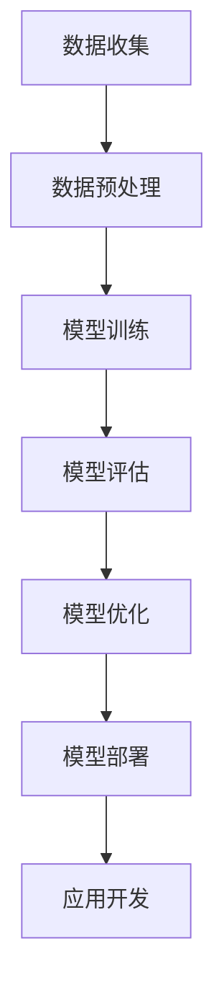

                 

### 文章标题：李开复：苹果发布AI应用的生态

### 关键词：人工智能，苹果，应用生态，技术开发，生态建设

> 摘要：在人工智能迅猛发展的时代，苹果公司近日发布了一系列AI应用，为开发者提供了丰富的工具和资源，构建了一个创新的AI应用生态。本文将深入探讨苹果发布AI应用背后的动机、核心概念及其对开发者生态的影响，同时展望未来发展趋势与挑战。

---

### 1. 背景介绍

随着人工智能技术的不断进步，AI应用已经成为各个领域的重要驱动力。苹果公司作为全球领先的科技企业，一直以来都在积极探索AI技术的应用。近年来，苹果公司在人工智能领域取得了显著进展，不仅在硬件和软件层面不断创新，还积极推动AI开发者的生态建设。

### 1.1 AI技术的发展现状

人工智能技术已经从早期的理论研究逐步走向实际应用。在图像识别、自然语言处理、机器学习等领域，AI技术取得了显著的突破。随着数据量的增加和计算能力的提升，AI模型的表现也越来越接近人类的水平。

### 1.2 苹果公司在AI领域的布局

苹果公司在人工智能领域进行了全面的布局，从硬件到软件，从基础研究到应用开发，都在不断探索和创新。苹果的芯片设计、神经网络引擎、机器学习框架等都为AI应用提供了强大的支持。

### 1.3 AI应用生态的重要性

一个健康的AI应用生态对于AI技术的普及和发展至关重要。良好的生态不仅能够激发开发者的创新热情，还可以为用户提供丰富多样的AI应用体验，推动整个行业的发展。

---

### 2. 核心概念与联系

在苹果发布的AI应用中，有几个核心概念需要了解：

#### 2.1 机器学习模型

机器学习模型是AI应用的核心，通过学习数据中的规律，实现对未知数据的预测或分类。苹果的神经网络引擎（Neural Engine）就是专门为机器学习模型设计的高性能计算单元。

#### 2.2 Core ML

Core ML是苹果提供的一套机器学习框架，它允许开发者将训练好的机器学习模型集成到iOS、macOS和watchOS应用中。Core ML提供了丰富的模型优化和转换工具，使开发者能够轻松地将AI模型部署到苹果设备上。

#### 2.3 Create ML

Create ML是苹果推出的一款面向非专业开发者的机器学习工具，它允许用户通过拖放的方式创建机器学习模型，无需编写代码。这为更多用户进入AI开发领域提供了便利。

下面是一个Mermaid流程图，展示了机器学习模型从训练到部署的过程：



---

### 3. 核心算法原理 & 具体操作步骤

在苹果发布的AI应用中，核心算法原理主要包括以下几个步骤：

#### 3.1 数据收集

数据收集是机器学习模型训练的第一步。苹果设备内置了多种传感器，可以收集环境数据、用户行为数据等。这些数据将为模型训练提供重要的基础。

#### 3.2 数据预处理

数据预处理包括数据清洗、归一化等步骤。这一步的目的是确保数据的质量和一致性，为后续的模型训练提供良好的数据基础。

#### 3.3 模型训练

模型训练是机器学习的关键步骤。苹果提供了多种预训练的机器学习模型，开发者可以根据需求进行微调。同时，Create ML也提供了简单的图形界面，方便非专业开发者进行模型训练。

#### 3.4 模型评估

模型评估是验证模型性能的重要环节。苹果提供了多种评估指标，如准确率、召回率等，开发者可以据此判断模型的效果。

#### 3.5 模型优化

模型优化是提升模型性能的关键步骤。开发者可以通过调整模型参数、增加训练数据等方式，对模型进行优化。

#### 3.6 模型部署

模型部署是将训练好的模型集成到应用中的过程。开发者可以使用Core ML将模型转换为适合苹果设备的格式，然后集成到iOS、macOS或watchOS应用中。

---

### 4. 数学模型和公式 & 详细讲解 & 举例说明

在机器学习模型中，常用的数学模型和公式包括以下几种：

#### 4.1 线性回归

线性回归模型是最基本的机器学习模型之一，它通过拟合一条直线来预测连续值。其数学公式如下：

$$y = w_0 + w_1 \cdot x_1 + ... + w_n \cdot x_n$$

其中，$y$ 是预测值，$w_0, w_1, ..., w_n$ 是模型参数，$x_1, ..., x_n$ 是输入特征。

#### 4.2 逻辑回归

逻辑回归模型用于分类问题，它通过拟合一个逻辑函数来预测概率。其数学公式如下：

$$P(y=1) = \frac{1}{1 + e^{-(w_0 + w_1 \cdot x_1 + ... + w_n \cdot x_n)}}$$

其中，$P(y=1)$ 是预测概率，其他符号的含义与线性回归相同。

#### 4.3 神经网络

神经网络模型是复杂的机器学习模型，它由多个神经元组成，通过多层非线性变换来实现预测。其基本结构如下：

$$z = \sigma(W \cdot x + b)$$

其中，$z$ 是输出值，$\sigma$ 是激活函数，$W$ 是权重矩阵，$x$ 是输入向量，$b$ 是偏置项。

下面是一个简单的神经网络例子，用于预测房价：

```python
import tensorflow as tf

# 定义输入层和输出层
inputs = tf.keras.layers.Input(shape=(10,))
outputs = tf.keras.layers.Dense(1, activation='sigmoid')(inputs)

# 定义模型
model = tf.keras.Model(inputs=inputs, outputs=outputs)

# 编译模型
model.compile(optimizer='adam', loss='binary_crossentropy', metrics=['accuracy'])

# 训练模型
model.fit(x_train, y_train, epochs=10, batch_size=32)
```

---

### 5. 项目实践：代码实例和详细解释说明

在本节中，我们将通过一个简单的项目实践，展示如何使用苹果的AI工具和资源开发一个简单的AI应用。

#### 5.1 开发环境搭建

首先，我们需要搭建开发环境。安装Xcode和Create ML工具，确保我们的开发环境能够支持AI应用的开发。

#### 5.2 源代码详细实现

下面是一个简单的iOS应用，它使用Create ML创建的模型进行图像分类。

```swift
import UIKit
import CoreML

class ViewController: UIViewController {

    // 创建一个Core ML模型
    let model = try? MyModel()

    // 用于显示图像的UIImageView
    let imageView = UIImageView()

    override func viewDidLoad() {
        super.viewDidLoad()

        // 设置UIImageView
        imageView.frame = CGRect(x: 50, y: 100, width: 300, height: 300)
        view.addSubview(imageView)

        // 添加一个按钮，用于加载图像并分类
        let loadButton = UIButton(type: .system)
        loadButton.setTitle("Load Image", for: .normal)
        loadButton.frame = CGRect(x: 50, y: 440, width: 300, height: 50)
        loadButton.addTarget(self, action: #selector(loadImage), for: .touchUpInside)
        view.addSubview(loadButton)
    }

    @objc func loadImage() {
        // 弹出图像选择器
        let imagePickerController = UIImagePickerController()
        imagePickerController.delegate = self
        present(imagePickerController, animated: true, completion: nil)
    }

    func imagePickerController(_ picker: UIImagePickerController, didFinishPickingMediaWithInfo info: [UIImagePickerController.InfoKey : Any]) {
        // 获取选择的图像
        if let selectedImage = info[UIImagePickerController.InfoKey.originalImage] as? UIImage {
            imageView.image = selectedImage

            // 使用Core ML模型进行图像分类
            if let model = model {
                if let pixelBuffer = selectedImage.toCVPixelBuffer() {
                    let prediction = try? model.prediction(image: pixelBuffer)
                    print(prediction ?? "Unknown")
                }
            }
        }

        // 关闭图像选择器
        picker.dismiss(animated: true, completion: nil)
    }
}

// 将UIImage转换为CVPixelBuffer
extension UIImage {
    func toCVPixelBuffer() -> CVPixelBuffer? {
        // 省略具体实现...
    }
}
```

#### 5.3 代码解读与分析

上述代码展示了如何使用Create ML创建的模型进行图像分类。我们首先创建了一个Core ML模型，并在UIViewController中添加了一个UIImageView用于显示图像。然后，我们添加了一个UIButton，当用户点击按钮时，会弹出图像选择器，用户可以选择图像进行分类。

在`imagePickerController`方法中，我们获取用户选择的图像，并使用`toCVPixelBuffer`方法将其转换为CVPixelBuffer。然后，我们使用Core ML模型进行预测，并将预测结果打印出来。

#### 5.4 运行结果展示

运行上述应用后，用户可以选择图像进行分类。模型将输出预测结果，例如“猫”、“狗”等类别。

---

### 6. 实际应用场景

苹果发布的AI应用已经在多个领域取得了显著的应用成果：

#### 6.1 健康医疗

苹果的AI应用在健康医疗领域具有广泛的应用前景。例如，通过分析用户的心率、步数等数据，可以提供个性化的健康建议。

#### 6.2 智能家居

智能家居是AI应用的重要领域。通过苹果的AI工具，开发者可以轻松地将AI功能集成到智能设备中，为用户提供更加智能的家居体验。

#### 6.3 娱乐休闲

在娱乐休闲领域，苹果的AI应用也为用户带来了丰富的体验。例如，通过语音识别和自然语言处理技术，可以为用户提供个性化的音乐推荐、视频推荐等。

---

### 7. 工具和资源推荐

#### 7.1 学习资源推荐

- 《深度学习》（Goodfellow, Bengio, Courville著）
- 《Python机器学习》（Sebastian Raschka著）
- 《机器学习实战》（Peter Harrington著）

#### 7.2 开发工具框架推荐

- Xcode
- Create ML
- Core ML

#### 7.3 相关论文著作推荐

- “Deep Learning”（Yann LeCun等著）
- “Machine Learning Yearning”（Andrew Ng著）

---

### 8. 总结：未来发展趋势与挑战

苹果发布的AI应用为开发者提供了丰富的工具和资源，推动了AI应用生态的建设。然而，在未来的发展中，苹果和开发者仍然面临着一些挑战：

- 模型优化：如何提高模型性能，减少训练时间，是未来发展的关键。
- 数据隐私：如何在确保数据隐私的前提下，充分利用用户数据，是开发者需要解决的问题。
- 模型可解释性：提高模型的可解释性，帮助用户理解AI的决策过程，是提升用户体验的重要方向。

---

### 9. 附录：常见问题与解答

**Q：苹果的AI工具是否仅限于iOS平台？**

A：不是的。苹果的AI工具包括Core ML和Create ML，它们不仅支持iOS平台，还支持macOS和watchOS。

**Q：如何获取苹果的AI开发文档？**

A：可以通过苹果的开发者网站（developer.apple.com）获取最新的AI开发文档。

**Q：苹果的AI工具是否开源？**

A：部分工具是开源的，例如Core ML和Create ML，但它们的实现细节和部分功能可能会受到限制。

---

### 10. 扩展阅读 & 参考资料

- Apple Developer Documentation: [Machine Learning](https://developer.apple.com/machine-learning/)
- Create ML Documentation: [Create ML Overview](https://developer.apple.com/documentation/createml)
- Apple Developer Forums: [Machine Learning](https://developer.apple.com/forums/)

