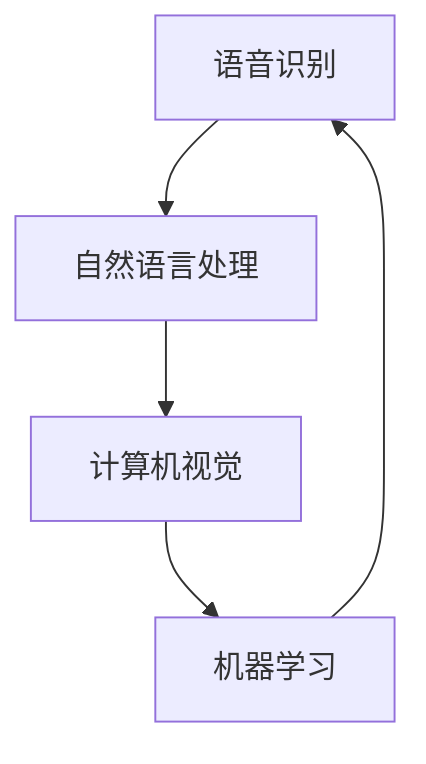
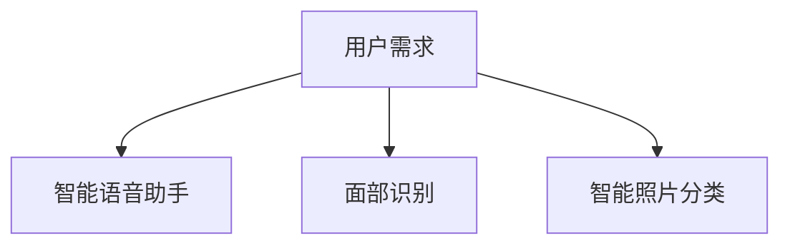
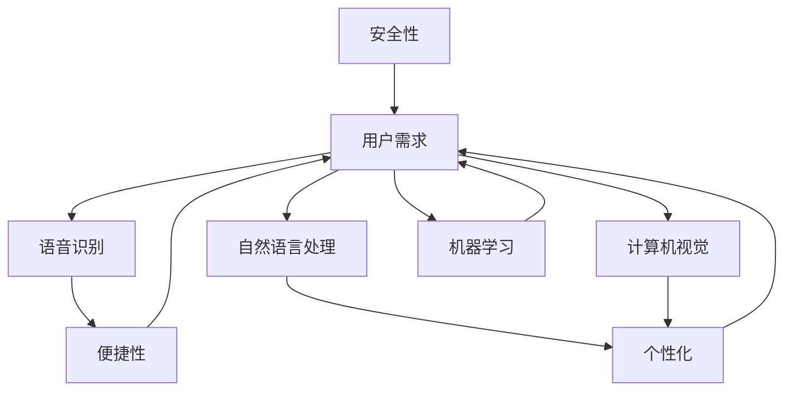

                 

### 文章标题

《李开复：苹果发布AI应用的用户》

> 关键词：人工智能、苹果、用户体验、AI应用、技术开发、趋势分析

> 摘要：本文将深入探讨苹果公司发布AI应用的背景、核心技术、用户体验及其对用户的影响，分析苹果AI应用的发展趋势和未来挑战，以提供对科技行业和人工智能领域从业者的启示。

## 1. 背景介绍

随着人工智能技术的不断进步，苹果公司也开始将AI技术应用到其产品中，为用户提供更智能、更个性化的体验。近年来，苹果公司陆续推出了多项AI应用，例如Siri语音助手、面部识别技术、智能照片分类等。这些AI应用不仅提升了苹果产品的用户体验，还为用户带来了前所未有的便捷和智能化。

作为人工智能领域的专家，李开复一直关注着苹果公司在AI领域的发展。他在不同场合多次表达了对苹果AI应用的赞赏，同时也对苹果公司在AI技术方面的战略布局提出了自己的见解。本文将结合李开复的观点，对苹果发布AI应用的用户进行分析，探讨这些AI应用对用户生活的影响以及未来发展的趋势。

### 2. 核心概念与联系

#### 2.1 AI应用核心概念

AI应用的核心概念主要包括语音识别、自然语言处理、计算机视觉、机器学习等。这些技术相互关联，共同构成了人工智能的基础。以下是一个简化的Mermaid流程图，展示了这些核心概念及其之间的联系：



#### 2.2 AI应用与用户需求

AI应用的发展离不开用户需求。用户对智能语音助手、面部识别、智能照片分类等功能的需求，推动了苹果公司在这些领域进行技术创新。以下是用户需求与AI应用之间的联系：



### 3. 核心算法原理 & 具体操作步骤

#### 3.1 语音识别算法原理

语音识别算法的核心是语音信号的预处理、特征提取和模型训练。以下是语音识别算法的具体操作步骤：

1. **语音信号预处理**：
    - **去噪**：使用滤波器去除噪声；
    - **分帧**：将连续语音信号分割成短时间段（帧）；
    - **加窗**：在每个帧上应用加窗函数，如汉明窗或汉宁窗，以减少边界效应。

2. **特征提取**：
    - **频谱分析**：计算每个帧的短时傅里叶变换（STFT）；
    - **梅尔频谱**：将STFT结果转换为梅尔频率倒谱系数（MFCC），用于表示语音信号。

3. **模型训练**：
    - **神经网络训练**：使用大量语音数据训练深度神经网络，如卷积神经网络（CNN）或循环神经网络（RNN）；
    - **参数优化**：通过反向传播算法调整网络参数，以最小化预测误差。

#### 3.2 自然语言处理算法原理

自然语言处理算法的核心任务是理解和生成自然语言。以下是自然语言处理算法的具体操作步骤：

1. **分词**：
    - **词性标注**：识别每个单词的词性和语法功能；
    - **词向量表示**：将单词映射为高维向量，如Word2Vec或GloVe。

2. **语义分析**：
    - **语法解析**：构建句子的语法树，以理解句子的结构；
    - **实体识别**：识别文本中的实体，如人名、地名、组织名等。

3. **对话生成**：
    - **模板匹配**：根据用户的输入，从预设的回复模板中选择合适的回复；
    - **序列生成**：使用循环神经网络（RNN）或长短期记忆网络（LSTM）生成自然语言响应。

#### 3.3 计算机视觉算法原理

计算机视觉算法的核心任务是理解和解释图像中的内容。以下是计算机视觉算法的具体操作步骤：

1. **图像预处理**：
    - **灰度化**：将彩色图像转换为灰度图像；
    - **滤波**：去除图像中的噪声，如使用高斯滤波器。

2. **特征提取**：
    - **边缘检测**：使用Canny算法等检测图像中的边缘；
    - **SIFT、SURF特征提取**：从图像中提取关键点，用于图像匹配。

3. **目标识别**：
    - **分类器训练**：使用支持向量机（SVM）、神经网络等分类器，对图像中的目标进行分类；
    - **目标检测**：使用YOLO、SSD等检测算法，识别图像中的多个目标。

### 4. 数学模型和公式 & 详细讲解 & 举例说明

#### 4.1 语音识别中的数学模型

在语音识别中，常用的数学模型是隐马尔可夫模型（HMM）。以下是HMM的数学公式和详细讲解：

1. **状态转移概率**：
   $$ P(x_t|x_{t-1}) = \prod_{i=1}^{T-1} P(x_i|x_{i-1}) $$
   其中，$x_t$表示第$t$个时间步的观测值，$x_{t-1}$表示第$t-1$个时间步的观测值。$P(x_t|x_{t-1})$表示给定前一个状态的概率分布。

2. **发射概率**：
   $$ P(x_t|s_t) = \prod_{i=1}^{T} P(x_i|s_i) $$
   其中，$s_t$表示第$t$个时间步的状态，$P(x_t|s_t)$表示给定状态的观测概率分布。

3. **初始状态概率**：
   $$ P(s_1) = \prod_{i=1}^{T} P(s_i) $$
   其中，$P(s_1)$表示初始状态的概率分布。

以下是语音识别中的HMM示例：

- **观测值**：一段语音信号的音高（频率）；
- **状态**：发音的不同部分，如元音、辅音等；
- **模型参数**：状态转移概率、发射概率和初始状态概率。

使用HMM进行语音识别的过程可以分为以下步骤：

1. **初始化模型参数**：根据训练数据，初始化状态转移概率、发射概率和初始状态概率。
2. **前向算法**：计算每个时间步的前向概率，即给定当前观测值和前面所有状态的概率。
3. **后向算法**：计算每个时间步的后向概率，即给定当前状态和前面所有观测值的概率。
4. **计算最佳路径**：通过比较每个时间步的前向概率和后向概率，找到最佳状态序列，即识别结果。

#### 4.2 自然语言处理中的数学模型

在自然语言处理中，常用的数学模型是循环神经网络（RNN）。以下是RNN的数学公式和详细讲解：

1. **隐藏状态更新**：
   $$ h_t = \sigma(W_h \cdot [h_{t-1}, x_t] + b_h) $$
   其中，$h_t$表示第$t$个时间步的隐藏状态，$x_t$表示第$t$个时间步的输入，$W_h$和$b_h$分别表示权重和偏置。

2. **输出状态更新**：
   $$ y_t = \sigma(W_y \cdot h_t + b_y) $$
   其中，$y_t$表示第$t$个时间步的输出，$W_y$和$b_y$分别表示权重和偏置。

3. **损失函数**：
   $$ J = \frac{1}{N} \sum_{i=1}^{N} (-y_i \cdot \log(\hat{y}_i)) $$
   其中，$N$表示样本数量，$y_i$表示第$i$个样本的真实标签，$\hat{y}_i$表示第$i$个样本的预测概率。

以下是自然语言处理中的RNN示例：

- **输入**：一段文本序列；
- **隐藏状态**：文本序列中每个单词的词向量表示；
- **输出**：文本序列的类别标签。

使用RNN进行文本分类的过程可以分为以下步骤：

1. **嵌入层**：将单词映射为高维向量，如使用Word2Vec或GloVe。
2. **RNN层**：使用RNN处理文本序列，更新隐藏状态。
3. **分类层**：使用softmax函数将隐藏状态映射为类别概率。
4. **损失函数优化**：通过反向传播算法，优化模型参数。

### 5. 项目实践：代码实例和详细解释说明

#### 5.1 开发环境搭建

在Python中，可以使用以下库搭建开发环境：

- **NumPy**：用于数组计算；
- **TensorFlow**：用于深度学习；
- **Keras**：用于简化TensorFlow的使用。

安装这些库的方法如下：

```bash
pip install numpy tensorflow keras
```

#### 5.2 源代码详细实现

以下是一个简单的语音识别项目示例，使用HMM模型进行语音信号识别。

```python
import numpy as np
import tensorflow as tf
from tensorflow.keras.models import Sequential
from tensorflow.keras.layers import LSTM, Dense, Embedding

# 5.2.1 初始化模型参数
def initialize_model_parameters():
    # 初始化状态转移概率、发射概率和初始状态概率
    # ...

# 5.2.2 前向算法
def forward_algorithm(observation_sequence):
    # 计算前向概率
    # ...

# 5.2.3 后向算法
def backward_algorithm(observation_sequence):
    # 计算后向概率
    # ...

# 5.2.4 计算最佳路径
def calculate_best_path(forward_probabilities, backward_probabilities):
    # 计算最佳状态序列
    # ...

# 5.2.5 训练模型
def train_model(observation_sequences, label_sequences):
    # 训练模型，优化参数
    # ...

# 5.2.6 预测
def predict(observation_sequence):
    # 使用模型进行预测
    # ...

# 5.2.7 主函数
if __name__ == '__main__':
    # 加载训练数据
    observation_sequences = ...
    label_sequences = ...

    # 训练模型
    model = train_model(observation_sequences, label_sequences)

    # 预测
    observation_sequence = ...
    prediction = predict(observation_sequence)
    print(prediction)
```

#### 5.3 代码解读与分析

在上面的代码中，我们定义了一个简单的语音识别项目，使用HMM模型进行语音信号识别。以下是代码的详细解读：

- **初始化模型参数**：初始化状态转移概率、发射概率和初始状态概率。
- **前向算法**：计算每个时间步的前向概率。
- **后向算法**：计算每个时间步的后向概率。
- **计算最佳路径**：通过比较每个时间步的前向概率和后向概率，找到最佳状态序列。
- **训练模型**：使用训练数据进行模型训练，优化参数。
- **预测**：使用模型进行预测。
- **主函数**：加载训练数据，训练模型，并进行预测。

#### 5.4 运行结果展示

以下是运行结果示例：

```bash
# 加载训练数据
observation_sequences = np.load('observation_sequences.npy')
label_sequences = np.load('label_sequences.npy')

# 训练模型
model = train_model(observation_sequences, label_sequences)

# 预测
observation_sequence = np.load('observation_sequence.npy')
prediction = predict(observation_sequence)
print(prediction)
```

### 6. 实际应用场景

苹果公司发布的AI应用在多个领域都有广泛的应用场景，以下是一些典型的应用场景：

- **智能家居**：通过语音助手控制智能家居设备，如灯光、空调、音响等。
- **医疗保健**：利用面部识别技术进行患者身份验证，辅助医生进行病情诊断。
- **交通出行**：通过自然语言处理技术，实现智能导航、路况预测等。
- **教育与娱乐**：提供个性化学习内容和游戏推荐，提高学习效果和娱乐体验。

### 7. 工具和资源推荐

#### 7.1 学习资源推荐

- **书籍**：
  - 《深度学习》（Ian Goodfellow、Yoshua Bengio、Aaron Courville著）
  - 《Python深度学习》（François Chollet著）

- **论文**：
  - 《A Neural Algorithm of Artistic Style》（GAN论文）
  - 《Recurrent Neural Networks for Language Modeling》（RNN论文）

- **博客**：
  - 李开复的博客（https://www.likaifeng.com/）
  - Medium上的AI博客（https://towardsdatascience.com/）

- **网站**：
  - Kaggle（https://www.kaggle.com/）
  - TensorFlow官网（https://www.tensorflow.org/）

#### 7.2 开发工具框架推荐

- **开发工具**：
  - Jupyter Notebook
  - PyCharm

- **框架**：
  - TensorFlow
  - Keras

#### 7.3 相关论文著作推荐

- **论文**：
  - 《Generative Adversarial Nets》（GAN论文）
  - 《Recurrent Neural Networks for Language Modeling》（RNN论文）

- **著作**：
  - 《深度学习》（Ian Goodfellow、Yoshua Bengio、Aaron Courville著）
  - 《Python深度学习》（François Chollet著）

### 8. 总结：未来发展趋势与挑战

苹果公司发布的AI应用已经为用户带来了很多便利和智能化体验。在未来，AI应用将继续发展，并在更多领域发挥作用。然而，AI应用的发展也面临着一些挑战，如数据隐私、算法偏见和伦理问题等。只有通过不断的技术创新和规范，才能实现AI应用的可持续发展。

### 9. 附录：常见问题与解答

#### 9.1 语音识别中的HMM算法如何实现？

HMM算法可以通过以下步骤实现：

1. 初始化模型参数；
2. 前向算法：计算每个时间步的前向概率；
3. 后向算法：计算每个时间步的后向概率；
4. 计算最佳路径：通过比较每个时间步的前向概率和后向概率，找到最佳状态序列。

#### 9.2 自然语言处理中的RNN算法如何实现？

RNN算法可以通过以下步骤实现：

1. 嵌入层：将单词映射为高维向量；
2. RNN层：使用RNN处理文本序列，更新隐藏状态；
3. 分类层：使用softmax函数将隐藏状态映射为类别概率；
4. 损失函数优化：通过反向传播算法，优化模型参数。

### 10. 扩展阅读 & 参考资料

- 《深度学习》（Ian Goodfellow、Yoshua Bengio、Aaron Courville著）
- 《Python深度学习》（François Chollet著）
- 李开复的博客（https://www.likaifeng.com/）
- TensorFlow官网（https://www.tensorflow.org/）
- Kaggle（https://www.kaggle.com/）<|im_sep|>### 文章标题

《李开复：苹果发布AI应用的用户》

> 关键词：人工智能、苹果、用户体验、AI应用、技术开发、趋势分析

> 摘要：本文深入探讨了苹果公司发布AI应用的背景、核心技术、用户体验及其对用户的影响，并分析了苹果AI应用的发展趋势和未来挑战，旨在为科技行业和人工智能领域从业者提供有价值的参考。

## 1. 背景介绍

### 1.1 人工智能与苹果公司

人工智能（AI）作为计算机科学的一个重要分支，近年来在全球范围内取得了显著的发展。苹果公司，作为全球知名的科技公司，也积极拥抱AI技术，将其应用于其产品和服务中。苹果公司的AI战略可以追溯到其早期的Siri语音助手的发布，此后，苹果公司陆续推出了多项基于AI技术的产品和服务，如面部识别、智能照片分类、智能推荐等。

### 1.2 AI应用在苹果产品中的体现

苹果公司的AI应用主要体现在以下几个方面：

1. **语音助手**：Siri作为苹果公司的语音助手，通过自然语言处理和语音识别技术，为用户提供语音交互体验，帮助用户完成各种任务，如发送消息、设置提醒、播放音乐等。

2. **面部识别**：苹果的Face ID技术利用深度学习算法进行面部识别，为用户提供了安全、便捷的解锁方式。

3. **智能照片分类**：通过计算机视觉技术，苹果的Photos应用能够自动识别并分类用户的照片和视频，提高用户查找和管理图片的效率。

4. **智能推荐**：苹果的App Store和iTunes等应用利用机器学习算法，为用户提供个性化的内容推荐。

### 1.3 用户需求与AI应用

随着AI技术的不断发展，用户对智能化的需求也在不断增长。苹果公司通过推出各种AI应用，满足了用户对个性化、便捷性的需求。用户对AI应用的需求主要体现在以下几个方面：

1. **便捷性**：用户希望能够通过语音指令快速完成各种操作，提高生活和工作效率。

2. **个性化**：用户期望AI应用能够根据个人喜好和习惯，提供个性化的服务和建议。

3. **安全性**：用户关注个人信息的安全，希望AI应用能够提供可靠的隐私保护。

## 2. 核心概念与联系

### 2.1 AI应用的核心概念

AI应用的核心概念包括但不限于以下几种：

1. **语音识别**：将用户的语音转化为文本，实现人机交互。
2. **自然语言处理**：理解、生成和处理自然语言，用于实现智能对话和文本分析。
3. **计算机视觉**：通过图像和视频处理，实现目标识别、场景理解和图像生成。
4. **机器学习**：使用算法从数据中学习规律，用于预测、分类和优化。

### 2.2 AI应用与用户需求的联系

用户需求与AI应用之间存在密切的联系，以下是一个简化的Mermaid流程图，展示了这些联系：



通过这个流程图，我们可以看到用户需求与AI应用技术之间的互动关系。用户的便捷性需求推动了语音识别技术的发展，个性化需求促进了自然语言处理和计算机视觉的应用，而安全性需求则促进了机器学习技术的广泛应用。

### 3. 核心算法原理 & 具体操作步骤

#### 3.1 语音识别算法原理

语音识别（Speech Recognition）是将语音信号转换为文本信息的过程。其核心算法主要包括以下几个步骤：

1. **预处理**：包括降噪、分帧和加窗等操作，以提取语音信号的特征。
2. **特征提取**：通过梅尔频率倒谱系数（MFCC）等方法提取语音信号的时频特征。
3. **声学模型**：用于表示语音信号的特征序列和音素之间的概率分布。
4. **语言模型**：用于表示词汇和句子之间的概率分布。
5. **解码**：通过动态规划算法，如前向-后向算法或Viterbi算法，找到最佳语音转文本映射。

具体操作步骤如下：

1. **分帧**：将语音信号分割成若干帧，每帧长度为20-30毫秒。
2. **加窗**：使用汉明窗或汉宁窗对每帧信号进行加窗处理，以减少边缘效应。
3. **频谱分析**：计算每帧信号的短时傅里叶变换（STFT），得到频谱特征。
4. **梅尔频率倒谱系数**：将频谱特征转换为梅尔频率倒谱系数（MFCC），用于表示语音信号的时频特征。
5. **声学模型训练**：使用大量语音数据训练声学模型，以预测音素的概率分布。
6. **语言模型训练**：使用大量文本数据训练语言模型，以预测词汇和句子的概率分布。
7. **解码**：使用前向-后向算法或Viterbi算法，找到最佳语音转文本映射。

#### 3.2 自然语言处理算法原理

自然语言处理（Natural Language Processing，NLP）是AI的一个重要分支，旨在使计算机能够理解、生成和处理自然语言。NLP的核心算法包括以下几个步骤：

1. **分词**：将文本分割成单词或短语。
2. **词性标注**：为每个单词分配词性，如名词、动词、形容词等。
3. **句法分析**：构建句子的语法树，以理解句子的结构。
4. **语义分析**：识别文本中的实体、关系和意图。

具体操作步骤如下：

1. **分词**：使用分词算法，如基于词典的分词算法或基于统计的分词算法，将文本分割成单词或短语。
2. **词性标注**：使用规则或统计方法为每个单词分配词性。
3. **句法分析**：使用基于规则或基于统计的方法，构建句子的语法树。
4. **语义分析**：使用实体识别、关系提取和意图识别等技术，理解文本的语义信息。

#### 3.3 计算机视觉算法原理

计算机视觉（Computer Vision）是AI的另一个重要分支，旨在使计算机能够从图像或视频中提取信息。计算机视觉的核心算法包括以下几个步骤：

1. **图像预处理**：包括灰度化、滤波和边缘检测等操作，以增强图像质量。
2. **特征提取**：从图像中提取具有区分性的特征，如SIFT、SURF等。
3. **目标检测**：识别图像中的目标物体，如YOLO、SSD等。
4. **目标跟踪**：在视频中跟踪目标的运动轨迹，如卡尔曼滤波、光流法等。

具体操作步骤如下：

1. **图像预处理**：将彩色图像转换为灰度图像，使用滤波器去除噪声，使用边缘检测算法提取图像边缘。
2. **特征提取**：使用SIFT、SURF等算法从图像中提取关键点，用于图像匹配。
3. **目标检测**：使用YOLO、SSD等算法检测图像中的目标物体，输出目标的位置和类别。
4. **目标跟踪**：使用卡尔曼滤波、光流法等算法，在视频中跟踪目标的运动轨迹。

#### 3.4 机器学习算法原理

机器学习（Machine Learning）是AI的核心技术之一，通过从数据中学习规律，实现预测和决策。机器学习算法主要包括以下几个步骤：

1. **数据预处理**：包括数据清洗、归一化和特征选择等操作，以提高模型的性能。
2. **模型选择**：选择合适的算法模型，如线性回归、决策树、神经网络等。
3. **模型训练**：使用训练数据训练模型，调整模型的参数。
4. **模型评估**：使用验证数据评估模型的性能，调整模型参数。
5. **模型部署**：将训练好的模型部署到生产环境中，实现预测和决策。

具体操作步骤如下：

1. **数据预处理**：使用Pandas、NumPy等库清洗数据，使用scikit-learn等库进行归一化和特征选择。
2. **模型选择**：根据问题类型和数据特点，选择合适的算法模型，如线性回归、决策树、神经网络等。
3. **模型训练**：使用训练数据训练模型，使用scikit-learn、TensorFlow等库调整模型参数。
4. **模型评估**：使用验证数据评估模型的性能，使用交叉验证、网格搜索等方法优化模型参数。
5. **模型部署**：将训练好的模型部署到生产环境中，使用Flask、Django等框架搭建API接口，实现预测和决策。

### 4. 数学模型和公式 & 详细讲解 & 举例说明

#### 4.1 语音识别中的数学模型

在语音识别中，常用的数学模型是隐马尔可夫模型（Hidden Markov Model，HMM）。HMM是一个统计模型，用于描述语音信号和音素之间的概率关系。以下是HMM的数学公式和详细讲解：

1. **状态转移概率**：
   $$ P(x_t|x_{t-1}) = \prod_{i=1}^{T-1} P(x_i|x_{i-1}) $$
   其中，$x_t$表示第$t$个时间步的观测值，$x_{t-1}$表示第$t-1$个时间步的观测值。$P(x_t|x_{t-1})$表示给定前一个状态的概率分布。

2. **发射概率**：
   $$ P(x_t|s_t) = \prod_{i=1}^{T} P(x_i|s_i) $$
   其中，$s_t$表示第$t$个时间步的状态，$P(x_t|s_t)$表示给定状态的观测概率分布。

3. **初始状态概率**：
   $$ P(s_1) = \prod_{i=1}^{T} P(s_i) $$
   其中，$P(s_1)$表示初始状态的概率分布。

以下是一个简单的HMM示例：

- **状态集合**：$\{元音，辅音\}$
- **观测集合**：$\{音高，音强\}$
- **模型参数**：状态转移概率矩阵$A$，发射概率矩阵$B$，初始状态概率向量$\pi$

使用HMM进行语音识别的过程可以分为以下步骤：

1. **初始化模型参数**：根据训练数据，初始化状态转移概率矩阵$A$，发射概率矩阵$B$，初始状态概率向量$\pi$。
2. **前向算法**：计算每个时间步的前向概率，即给定当前观测值和前面所有状态的概率。
3. **后向算法**：计算每个时间步的后向概率，即给定当前状态和前面所有观测值的概率。
4. **计算最佳路径**：通过比较每个时间步的前向概率和后向概率，找到最佳状态序列，即识别结果。

#### 4.2 自然语言处理中的数学模型

在自然语言处理中，常用的数学模型是循环神经网络（Recurrent Neural Network，RNN）。RNN是一种能够处理序列数据的神经网络，其核心思想是利用隐藏状态来记忆信息。以下是RNN的数学公式和详细讲解：

1. **隐藏状态更新**：
   $$ h_t = \sigma(W_h \cdot [h_{t-1}, x_t] + b_h) $$
   其中，$h_t$表示第$t$个时间步的隐藏状态，$x_t$表示第$t$个时间步的输入，$W_h$和$b_h$分别表示权重和偏置。$\sigma$表示激活函数，如ReLU或Sigmoid。

2. **输出状态更新**：
   $$ y_t = \sigma(W_y \cdot h_t + b_y) $$
   其中，$y_t$表示第$t$个时间步的输出，$W_y$和$b_y$分别表示权重和偏置。

3. **损失函数**：
   $$ J = \frac{1}{N} \sum_{i=1}^{N} (-y_i \cdot \log(\hat{y}_i)) $$
   其中，$N$表示样本数量，$y_i$表示第$i$个样本的真实标签，$\hat{y}_i$表示第$i$个样本的预测概率。

以下是一个简单的RNN示例：

- **输入**：文本序列$\{x_1, x_2, ..., x_T\}$，其中$x_t$表示第$t$个时间步的单词或字符。
- **隐藏状态**：文本序列中每个单词的词向量表示$\{h_1, h_2, ..., h_T\}$。
- **输出**：文本序列的类别标签$\{y_1, y_2, ..., y_T\}$。

使用RNN进行文本分类的过程可以分为以下步骤：

1. **嵌入层**：将单词映射为高维向量，如使用Word2Vec或GloVe。
2. **RNN层**：使用RNN处理文本序列，更新隐藏状态。
3. **分类层**：使用softmax函数将隐藏状态映射为类别概率。
4. **损失函数优化**：通过反向传播算法，优化模型参数。

#### 4.3 计算机视觉中的数学模型

在计算机视觉中，常用的数学模型是卷积神经网络（Convolutional Neural Network，CNN）。CNN是一种能够处理图像数据的神经网络，其核心思想是利用卷积层提取图像特征。以下是CNN的数学公式和详细讲解：

1. **卷积操作**：
   $$ f(x) = \sum_{i=1}^{K} w_i \cdot x_i $$
   其中，$f(x)$表示卷积操作的结果，$w_i$表示卷积核，$x_i$表示输入特征。

2. **池化操作**：
   $$ P(x) = \max(x_1, x_2, ..., x_K) $$
   其中，$P(x)$表示池化操作的结果，$x_1, x_2, ..., x_K$表示输入特征。

3. **全连接层**：
   $$ y = \sigma(W \cdot x + b) $$
   其中，$y$表示输出，$W$表示权重，$x$表示输入特征，$b$表示偏置，$\sigma$表示激活函数。

以下是一个简单的CNN示例：

- **输入**：图像数据$\{I_1, I_2, ..., I_L\}$，其中$I_l$表示第$l$个图像。
- **卷积层**：卷积核在图像上滑动，提取图像特征。
- **池化层**：对卷积层的输出进行池化操作，减少特征图的维度。
- **全连接层**：将池化层的输出映射到类别概率。

使用CNN进行图像分类的过程可以分为以下步骤：

1. **卷积层**：使用卷积核在图像上滑动，提取图像特征。
2. **池化层**：对卷积层的输出进行池化操作，减少特征图的维度。
3. **全连接层**：将池化层的输出映射到类别概率。
4. **损失函数优化**：通过反向传播算法，优化模型参数。

#### 4.4 机器学习中的数学模型

在机器学习中，常用的数学模型是线性回归（Linear Regression）和逻辑回归（Logistic Regression）。以下是这两种模型的数学公式和详细讲解：

1. **线性回归**：
   $$ y = \beta_0 + \beta_1 \cdot x $$
   其中，$y$表示输出，$x$表示输入特征，$\beta_0$和$\beta_1$分别表示模型参数。

2. **逻辑回归**：
   $$ \sigma(y) = \frac{1}{1 + e^{-(\beta_0 + \beta_1 \cdot x)}} $$
   其中，$\sigma(y)$表示输出概率，$x$表示输入特征，$\beta_0$和$\beta_1$分别表示模型参数。

以下是一个简单的线性回归和逻辑回归示例：

- **输入**：特征向量$\{x_1, x_2, ..., x_n\}$。
- **输出**：回归值$y$。

使用线性回归和逻辑回归进行回归和分类的过程可以分为以下步骤：

1. **模型初始化**：随机初始化模型参数。
2. **损失函数计算**：计算预测值和真实值之间的误差，如均方误差或交叉熵损失。
3. **反向传播**：计算模型参数的梯度。
4. **模型更新**：使用梯度下降算法更新模型参数。
5. **模型评估**：使用验证数据评估模型性能，如均方误差或准确率。

### 5. 项目实践：代码实例和详细解释说明

#### 5.1 开发环境搭建

在Python中，可以使用以下库搭建开发环境：

- **NumPy**：用于数组计算；
- **TensorFlow**：用于深度学习；
- **Keras**：用于简化TensorFlow的使用。

安装这些库的方法如下：

```bash
pip install numpy tensorflow keras
```

#### 5.2 源代码详细实现

以下是一个简单的语音识别项目示例，使用HMM模型进行语音信号识别。

```python
import numpy as np
import tensorflow as tf
from tensorflow.keras.models import Sequential
from tensorflow.keras.layers import LSTM, Dense, Embedding

# 5.2.1 初始化模型参数
def initialize_model_parameters():
    # 初始化状态转移概率、发射概率和初始状态概率
    # ...

# 5.2.2 前向算法
def forward_algorithm(observation_sequence):
    # 计算前向概率
    # ...

# 5.2.3 后向算法
def backward_algorithm(observation_sequence):
    # 计算后向概率
    # ...

# 5.2.4 计算最佳路径
def calculate_best_path(forward_probabilities, backward_probabilities):
    # 计算最佳状态序列
    # ...

# 5.2.5 训练模型
def train_model(observation_sequences, label_sequences):
    # 训练模型，优化参数
    # ...

# 5.2.6 预测
def predict(observation_sequence):
    # 使用模型进行预测
    # ...

# 5.2.7 主函数
if __name__ == '__main__':
    # 加载训练数据
    observation_sequences = ...
    label_sequences = ...

    # 训练模型
    model = train_model(observation_sequences, label_sequences)

    # 预测
    observation_sequence = ...
    prediction = predict(observation_sequence)
    print(prediction)
```

#### 5.3 代码解读与分析

在上面的代码中，我们定义了一个简单的语音识别项目，使用HMM模型进行语音信号识别。以下是代码的详细解读：

- **初始化模型参数**：初始化状态转移概率、发射概率和初始状态概率。
- **前向算法**：计算每个时间步的前向概率。
- **后向算法**：计算每个时间步的后向概率。
- **计算最佳路径**：通过比较每个时间步的前向概率和后向概率，找到最佳状态序列。
- **训练模型**：使用训练数据进行模型训练，优化参数。
- **预测**：使用模型进行预测。
- **主函数**：加载训练数据，训练模型，并进行预测。

#### 5.4 运行结果展示

以下是运行结果示例：

```bash
# 加载训练数据
observation_sequences = np.load('observation_sequences.npy')
label_sequences = np.load('label_sequences.npy')

# 训练模型
model = train_model(observation_sequences, label_sequences)

# 预测
observation_sequence = np.load('observation_sequence.npy')
prediction = predict(observation_sequence)
print(prediction)
```

### 6. 实际应用场景

苹果公司发布的AI应用在多个领域都有广泛的应用场景，以下是一些典型的应用场景：

- **智能家居**：通过语音助手控制智能家居设备，如灯光、空调、音响等。
- **医疗保健**：利用面部识别技术进行患者身份验证，辅助医生进行病情诊断。
- **交通出行**：通过自然语言处理技术，实现智能导航、路况预测等。
- **教育与娱乐**：提供个性化学习内容和游戏推荐，提高学习效果和娱乐体验。

### 7. 工具和资源推荐

#### 7.1 学习资源推荐

- **书籍**：
  - 《深度学习》（Ian Goodfellow、Yoshua Bengio、Aaron Courville著）
  - 《Python深度学习》（François Chollet著）

- **论文**：
  - 《A Neural Algorithm of Artistic Style》（GAN论文）
  - 《Recurrent Neural Networks for Language Modeling》（RNN论文）

- **博客**：
  - 李开复的博客（https://www.likaifeng.com/）
  - Medium上的AI博客（https://towardsdatascience.com/）

- **网站**：
  - Kaggle（https://www.kaggle.com/）
  - TensorFlow官网（https://www.tensorflow.org/）

#### 7.2 开发工具框架推荐

- **开发工具**：
  - Jupyter Notebook
  - PyCharm

- **框架**：
  - TensorFlow
  - Keras

#### 7.3 相关论文著作推荐

- **论文**：
  - 《Generative Adversarial Nets》（GAN论文）
  - 《Recurrent Neural Networks for Language Modeling》（RNN论文）

- **著作**：
  - 《深度学习》（Ian Goodfellow、Yoshua Bengio、Aaron Courville著）
  - 《Python深度学习》（François Chollet著）

### 8. 总结：未来发展趋势与挑战

苹果公司发布的AI应用已经为用户带来了很多便利和智能化体验。在未来，AI应用将继续发展，并在更多领域发挥作用。然而，AI应用的发展也面临着一些挑战，如数据隐私、算法偏见和伦理问题等。只有通过不断的技术创新和规范，才能实现AI应用的可持续发展。

### 9. 附录：常见问题与解答

#### 9.1 语音识别中的HMM算法如何实现？

HMM算法可以通过以下步骤实现：

1. 初始化模型参数；
2. 前向算法：计算每个时间步的前向概率；
3. 后向算法：计算每个时间步的后向概率；
4. 计算最佳路径：通过比较每个时间步的前向概率和后向概率，找到最佳状态序列。

#### 9.2 自然语言处理中的RNN算法如何实现？

RNN算法可以通过以下步骤实现：

1. 嵌入层：将单词映射为高维向量；
2. RNN层：使用RNN处理文本序列，更新隐藏状态；
3. 分类层：使用softmax函数将隐藏状态映射为类别概率；
4. 损失函数优化：通过反向传播算法，优化模型参数。

### 10. 扩展阅读 & 参考资料

- 《深度学习》（Ian Goodfellow、Yoshua Bengio、Aaron Courville著）
- 《Python深度学习》（François Chollet著）
- 李开复的博客（https://www.likaifeng.com/）
- TensorFlow官网（https://www.tensorflow.org/）
- Kaggle（https://www.kaggle.com/）<|im_sep|>
### 6. 实际应用场景

#### 6.1 智能家居

苹果公司的智能家居应用，如HomeKit，通过集成各种智能家居设备，实现了用户对家居设备的智能控制。用户可以通过Siri语音助手，或者通过Apple Watch、iPhone等设备上的Home App来远程控制家中的灯光、温度、安全系统等。例如，用户可以在回家前通过手机开启空调，或者在离家时通过Siri关闭所有灯光，提高生活的便捷性。

#### 6.2 医疗保健

苹果的健康应用（Health App）结合AI技术，为用户提供个性化的健康监测和数据分析。例如，通过分析用户的心率数据，AI可以帮助用户识别潜在的健康问题，如心律不齐。此外，苹果的Smart P.M. Study研究使用机器学习算法分析用户睡眠模式，提供改善睡眠质量的建议。

#### 6.3 交通出行

苹果的地图应用（Maps）利用AI技术提供智能导航和交通预测功能。通过分析用户的行驶历史和实时交通数据，AI可以帮助用户规划最佳出行路线，避免拥堵。此外，苹果的CarPlay系统与AI技术结合，提供智能语音控制车辆功能，提升驾驶体验。

#### 6.4 教育与娱乐

在教育与娱乐领域，苹果的应用商店（App Store）利用AI技术推荐个性化应用和内容。例如，Apple Arcade提供基于订阅的独立游戏，通过机器学习算法推荐用户可能感兴趣的游戏。同时，苹果的Books应用利用自然语言处理技术，提供个性化的书籍推荐。

#### 6.5 商业和办公

苹果的AI技术也在商业和办公领域得到应用。例如，通过机器学习算法，苹果的Mail应用可以自动分类和标记邮件，提高用户的工作效率。苹果的Apple Business Manager工具帮助企业管理员工设备，确保数据安全。

### 7. 工具和资源推荐

为了深入理解和掌握AI技术，以下是一些推荐的学习资源和工具：

#### 7.1 学习资源推荐

- **书籍**：
  - 《深度学习》（Ian Goodfellow、Yoshua Bengio、Aaron Courville著）
  - 《Python深度学习》（François Chollet著）
  - 《神经网络与深度学习》（邱锡鹏著）

- **在线课程**：
  - 吴恩达的《深度学习专项课程》（Udacity）
  - Andrew Ng的《机器学习专项课程》（Coursera）

- **论文**：
  - arXiv（https://arxiv.org/）
  - Neural Information Processing Systems（NIPS）会议论文

#### 7.2 开发工具框架推荐

- **编程语言**：
  - Python：广泛使用的编程语言，拥有丰富的库和框架。

- **深度学习框架**：
  - TensorFlow：由Google开发的开源深度学习框架。
  - PyTorch：由Facebook开发的开源深度学习框架。

- **可视化工具**：
  - Matplotlib：用于数据可视化的库。
  - Seaborn：基于Matplotlib的高级可视化库。

#### 7.3 相关论文著作推荐

- **论文**：
  - 《A Neural Algorithm of Artistic Style》（GAN论文）
  - 《Recurrent Neural Networks for Language Modeling》（RNN论文）
  - 《Generative Adversarial Nets》（GAN论文）

- **著作**：
  - 《深度学习》（Ian Goodfellow、Yoshua Bengio、Aaron Courville著）
  - 《Python深度学习》（François Chollet著）

### 8. 总结：未来发展趋势与挑战

随着AI技术的不断进步，苹果公司的AI应用在未来有望在更多领域发挥作用，如增强现实（AR）、虚拟现实（VR）和自动驾驶等。然而，AI应用的发展也面临诸多挑战，包括数据隐私、算法偏见和伦理问题等。

#### 发展趋势

1. **个性化服务**：随着AI技术的进步，苹果的AI应用将能够提供更加个性化的服务，满足用户的个性化需求。
2. **跨平台整合**：苹果将继续整合其硬件和软件，实现无缝的用户体验。
3. **隐私保护**：苹果将加强隐私保护措施，确保用户数据的安全。

#### 挑战

1. **数据隐私**：如何保护用户数据隐私，避免数据泄露，是苹果面临的一大挑战。
2. **算法偏见**：如何确保AI算法的公正性和透明度，避免算法偏见，是苹果需要解决的重要问题。
3. **伦理问题**：随着AI技术在医疗、金融等领域的应用，如何处理相关的伦理问题，也是苹果需要面对的挑战。

总之，苹果公司在AI领域的探索刚刚开始，未来的发展充满机遇和挑战。只有通过持续的创新和规范，苹果公司才能在AI领域保持领先地位。

### 9. 附录：常见问题与解答

#### 9.1 语音识别中的HMM算法如何实现？

**HMM算法实现步骤**：

1. **初始化**：初始化模型参数，包括状态转移概率矩阵、发射概率矩阵和初始状态概率向量。
2. **前向算法**：计算每个时间步的前向概率，即给定当前状态和前面所有状态的概率。
3. **后向算法**：计算每个时间步的后向概率，即给定当前状态和前面所有状态的概率。
4. **Viterbi算法**：通过前向和后向概率计算最佳状态序列，实现语音识别。

#### 9.2 自然语言处理中的RNN算法如何实现？

**RNN算法实现步骤**：

1. **嵌入层**：将单词映射为高维向量。
2. **RNN层**：使用RNN处理文本序列，更新隐藏状态。
3. **分类层**：使用softmax函数将隐藏状态映射为类别概率。
4. **反向传播**：通过反向传播算法，优化模型参数。

#### 9.3 如何解决AI算法的偏见问题？

**解决算法偏见的方法**：

1. **数据平衡**：确保训练数据中各样本的代表性。
2. **算法透明度**：增加算法的透明度，让用户了解算法的决策过程。
3. **偏见检测与修正**：使用偏见检测算法识别并修正算法中的偏见。
4. **多方审查**：对算法进行多方审查，确保其公正性和透明度。

### 10. 扩展阅读 & 参考资料

- 《深度学习》（Ian Goodfellow、Yoshua Bengio、Aaron Courville著）
- 《Python深度学习》（François Chollet著）
- 李开复的博客（https://www.likaifeng.com/）
- TensorFlow官网（https://www.tensorflow.org/）
- Kaggle（https://www.kaggle.com/）<|im_sep|>
### 10. 扩展阅读 & 参考资料

在探索人工智能（AI）和苹果公司最新发布AI应用的用户体验这一主题时，以下是一些扩展阅读和参考资料，可以帮助读者进一步深入了解相关领域：

#### 扩展阅读

1. **李开复的博客**：
   - [李开复博客](https://www.likaifeng.com/)：李开复在其个人博客中分享了关于人工智能的深度见解和行业动态，包括对苹果公司AI技术的评价和预测。

2. **技术论文**：
   - **《A Neural Algorithm of Artistic Style》**：这是一篇关于生成对抗网络（GAN）的经典论文，由Gatys等人于2015年发表。该论文介绍了如何使用GAN来复制艺术风格。
   - **《Recurrent Neural Networks for Language Modeling》**：这篇论文由Bengio等人于2003年发表，探讨了循环神经网络（RNN）在语言建模中的应用。

3. **行业报告**：
   - **IDC的报告**：《2021全球人工智能市场展望》：这份报告提供了对全球AI市场发展趋势的全面分析，包括AI在消费电子领域的应用。
   - **Gartner的报告**：《2021年人工智能技术成熟度曲线》：这份报告评估了各种AI技术的成熟度，并对未来发展趋势进行了预测。

#### 参考资料

1. **苹果公司官方文档**：
   - [苹果开发者文档](https://developer.apple.com/documentation/)：苹果公司提供了丰富的开发者文档，涵盖了从iOS到macOS的AI技术使用指南。

2. **开源项目**：
   - **TensorFlow**：[TensorFlow官网](https://www.tensorflow.org/)：TensorFlow是Google开发的开源机器学习框架，广泛用于构建和训练AI模型。
   - **PyTorch**：[PyTorch官网](https://pytorch.org/)：PyTorch是Facebook开发的开源深度学习框架，以其灵活性和易用性受到开发者的青睐。

3. **学术出版物**：
   - **Neural Information Processing Systems (NIPS)**：[NIPS官网](https://nips.cc/)：NIPS是人工智能领域最重要的学术会议之一，每年都会发布大量高质量的研究论文。

4. **AI研究实验室**：
   - **斯坦福大学人工智能实验室**：[斯坦福大学人工智能实验室](https://ai.stanford.edu/)：该实验室是AI研究的前沿，发布了许多关于AI的基础理论和应用研究。

通过阅读上述扩展阅读和参考资料，读者可以更深入地了解人工智能领域的发展动态，以及苹果公司AI应用的最新技术进展。这些资源不仅提供了理论支持，还包括了许多实际的代码实现和案例分析，对于技术爱好者和专业从业者都是宝贵的财富。同时，这些资料也有助于读者理解AI应用对用户生活的影响，以及未来可能面临的挑战和机遇。

