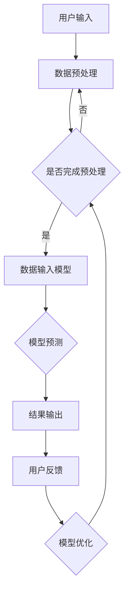

                 

### 1. 背景介绍

苹果公司，作为全球领先的科技企业之一，一直以其创新和卓越的产品闻名于世。然而，近年来，随着人工智能技术的飞速发展，苹果公司也开始将目光投向这一领域，致力于通过人工智能技术提升其产品的用户体验和功能。在2023年，苹果公司宣布发布了一系列基于人工智能的应用程序，标志着苹果在人工智能领域的重大突破。

此次苹果发布的AI应用程序涵盖了多个方面，包括图像识别、语音识别、自然语言处理等。这些应用程序利用了苹果公司在硬件和软件方面的优势，实现了高性能和高效能的计算，为用户提供了更加智能和便捷的使用体验。例如，苹果的图像识别应用程序能够通过深度学习算法快速识别照片中的内容，并提供相关的信息和建议；语音识别应用程序则能够准确理解用户的语音指令，并快速执行相应的操作。

苹果公司发布AI应用程序的背景可以从以下几个方面来理解：

1. **市场需求：**随着智能手机和移动设备的普及，用户对于智能体验的需求日益增长。苹果公司通过发布AI应用程序，旨在满足用户对于智能化、个性化服务的需求，提升产品的竞争力。

2. **技术进步：**人工智能技术的快速发展为苹果公司提供了丰富的技术储备。通过将人工智能技术应用到产品中，苹果公司能够更好地挖掘数据价值，提升产品的智能水平。

3. **战略布局：**随着谷歌、亚马逊等科技巨头在人工智能领域的不断拓展，苹果公司也需要在人工智能领域加强布局，以保持其在科技领域的领先地位。

4. **用户体验：**人工智能技术的应用能够显著提升产品的用户体验。通过智能化、个性化的服务，苹果公司能够为用户带来更加便捷和愉悦的使用体验，从而增强用户忠诚度。

总之，苹果公司发布AI应用程序是其在人工智能领域的一次重要尝试，不仅有助于提升产品的竞争力，也为未来在人工智能领域的进一步发展奠定了基础。接下来，我们将深入探讨这些应用程序的核心概念、原理和具体操作步骤，以了解苹果公司在人工智能领域的创新成果。

## 2. 核心概念与联系

### 2.1 AI应用概述

在介绍苹果公司发布的AI应用程序之前，首先需要了解人工智能（AI）的基本概念及其在现代社会中的应用。人工智能是指通过模拟人类智能行为的技术，使计算机系统能够自主地学习、推理、解决问题和执行任务。随着深度学习、神经网络等技术的快速发展，人工智能已经广泛应用于各个领域，包括图像识别、语音识别、自然语言处理、自动驾驶、智能客服等。

### 2.2 核心概念原理

苹果公司发布的AI应用程序主要涉及以下几个核心概念：

1. **深度学习：**深度学习是人工智能的一个重要分支，通过模拟人脑的神经网络结构，实现对大量数据的自动学习和特征提取。深度学习在图像识别、语音识别等领域具有出色的表现。

2. **卷积神经网络（CNN）：**卷积神经网络是深度学习的一种重要模型，特别适用于图像识别任务。CNN通过卷积层、池化层和全连接层的组合，实现了对图像的特征提取和分类。

3. **递归神经网络（RNN）：**递归神经网络适用于处理序列数据，如语音、文本等。RNN通过递归结构，能够在处理数据时考虑前后文信息，提高了模型的准确性。

4. **自然语言处理（NLP）：**自然语言处理是使计算机能够理解、生成和处理自然语言的技术。NLP在智能客服、语音助手等领域具有广泛应用。

### 2.3 应用架构与实现

苹果公司在AI应用程序的开发中，采用了先进的架构和算法，以实现高性能和高效能的计算。以下是这些应用程序的基本架构和实现方法：

1. **硬件层面：**苹果公司通过自主研发的A系列处理器，为AI应用程序提供了强大的计算能力。A系列处理器内置了专门用于AI计算的单元，如神经网络引擎（Neural Engine），能够高效地执行深度学习和卷积神经网络等计算任务。

2. **软件层面：**苹果公司在操作系统（如iOS、macOS）中集成了多个AI框架，如Core ML、Create ML等。这些框架提供了丰富的API和工具，使得开发者可以轻松地将AI模型集成到应用程序中。

3. **模型训练与优化：**苹果公司通过自主研发的模型训练算法，如TensorFlow Lite、PyTorch等，对AI模型进行训练和优化。这些算法支持多种数据类型和模型结构，能够适应不同的应用场景。

4. **用户接口设计：**苹果公司在AI应用程序的用户接口设计中，注重用户体验和易用性。通过简洁直观的界面和自然的交互方式，用户能够轻松地使用这些应用程序，享受智能化的服务。

### 2.4 Mermaid流程图

为了更好地理解苹果公司AI应用程序的核心概念和实现方法，我们可以使用Mermaid流程图来展示其基本架构。以下是AI应用程序的基本流程：



在上述流程中，用户输入通过数据预处理模块进行处理，然后输入到AI模型中进行预测。预测结果输出给用户，并根据用户的反馈对模型进行优化，以不断提高预测的准确性。

通过上述介绍，我们可以看到苹果公司发布的AI应用程序在核心概念、架构和实现方面都进行了深入的探索和创新。接下来，我们将进一步探讨这些应用程序的具体算法原理和操作步骤。

### 3. 核心算法原理 & 具体操作步骤

#### 3.1 深度学习算法原理

深度学习是人工智能的核心技术之一，通过模拟人脑的神经网络结构，实现对复杂数据的自动学习和特征提取。在苹果公司的AI应用程序中，深度学习算法被广泛应用于图像识别、语音识别和自然语言处理等领域。

**3.1.1 神经网络结构**

深度学习模型主要由输入层、隐藏层和输出层组成。输入层接收外部数据，隐藏层通过多层神经网络对输入数据进行特征提取和变换，输出层生成最终的预测结果。

**3.1.2 前向传播与反向传播**

在深度学习模型中，前向传播（Forward Propagation）和反向传播（Back Propagation）是两个关键步骤。前向传播过程将输入数据通过神经网络传递到输出层，得到预测结果。反向传播过程通过计算预测结果与实际结果之间的误差，更新网络权重，使模型不断优化。

**3.1.3 损失函数与优化算法**

损失函数用于衡量预测结果与实际结果之间的差距，优化算法（如梯度下降、Adam等）用于更新网络权重，以最小化损失函数。在训练过程中，通过不断迭代更新权重，模型性能逐渐提高。

#### 3.2 图像识别算法原理

图像识别是深度学习的一个重要应用领域，旨在通过分析图像特征，实现对图像内容的自动识别。在苹果公司的AI应用程序中，图像识别算法主要基于卷积神经网络（CNN）。

**3.2.1 卷积神经网络（CNN）结构**

CNN由卷积层、池化层和全连接层组成。卷积层通过卷积操作提取图像特征，池化层用于减少数据维度，全连接层将特征映射到输出结果。

**3.2.2 卷积操作**

卷积操作是CNN的核心，通过将卷积核（滤波器）与图像进行卷积，提取图像局部特征。卷积层可以堆叠多个卷积核，以提取不同层次的图像特征。

**3.2.3 池化操作**

池化操作用于减小数据维度，提高计算效率。常见的池化方法包括最大池化和平均池化。最大池化选取局部区域的最大值，平均池化计算局部区域的平均值。

**3.2.4 训练与优化**

图像识别模型的训练过程包括数据预处理、模型初始化、前向传播、损失函数计算、反向传播和权重更新。通过不断迭代，模型性能逐渐提高，最终实现对图像的准确识别。

#### 3.3 语音识别算法原理

语音识别是使计算机能够理解人类语音的技术。在苹果公司的AI应用程序中，语音识别算法主要基于递归神经网络（RNN）。

**3.3.1 递归神经网络（RNN）结构**

RNN是一种能够处理序列数据的神经网络，通过递归结构，RNN能够考虑前后文信息，提高语音识别的准确性。

**3.3.2 隐藏状态与输出状态**

在RNN中，每个时间步的输入不仅与当前输入有关，还与之前的时间步的隐藏状态有关。隐藏状态和输出状态通过线性变换和激活函数生成，用于表示语音特征和预测结果。

**3.3.3 训练与优化**

语音识别模型的训练过程包括数据预处理、模型初始化、前向传播、损失函数计算、反向传播和权重更新。通过不断迭代，模型性能逐渐提高，最终实现对语音的准确识别。

#### 3.4 自然语言处理（NLP）算法原理

自然语言处理是使计算机能够理解、生成和处理自然语言的技术。在苹果公司的AI应用程序中，NLP算法主要基于词嵌入、序列模型和生成模型。

**3.4.1 词嵌入（Word Embedding）**

词嵌入将单词映射到高维向量空间，使计算机能够通过向量运算处理自然语言。常见的词嵌入方法包括Word2Vec、GloVe等。

**3.4.2 序列模型（Sequence Model）**

序列模型用于处理自然语言序列数据，如文本、语音等。常见的序列模型包括循环神经网络（RNN）、长短期记忆网络（LSTM）和门控循环单元（GRU）。

**3.4.3 生成模型（Generative Model）**

生成模型用于生成新的自然语言文本，如生成对话、生成文章等。常见的生成模型包括变分自编码器（VAE）、生成对抗网络（GAN）等。

**3.4.4 训练与优化**

NLP模型的训练过程包括数据预处理、模型初始化、前向传播、损失函数计算、反向传播和权重更新。通过不断迭代，模型性能逐渐提高，最终实现对自然语言的理解和生成。

#### 3.5 具体操作步骤

在了解了深度学习、图像识别、语音识别和自然语言处理等算法原理后，接下来我们将介绍苹果公司AI应用程序的具体操作步骤。

**3.5.1 开发环境搭建**

- 安装MacOS或iOS操作系统，确保支持AI应用程序的开发。
- 安装必要的开发工具和库，如Xcode、Python、TensorFlow等。

**3.5.2 数据准备**

- 收集和整理图像、语音和文本数据，用于训练和测试AI模型。
- 对数据进行预处理，包括数据清洗、标签标注和数据增强等。

**3.5.3 模型训练**

- 选择合适的深度学习框架和算法，如TensorFlow、PyTorch等。
- 编写训练脚本，设置训练参数，包括学习率、批次大小、迭代次数等。
- 开始训练模型，通过迭代优化模型参数，提高模型性能。

**3.5.4 模型评估**

- 使用测试数据集对训练好的模型进行评估，计算模型的准确率、召回率、F1分数等指标。
- 根据评估结果调整模型参数，优化模型性能。

**3.5.5 模型部署**

- 将训练好的模型部署到目标设备，如iOS设备、MacOS设备等。
- 开发相应的应用程序界面，实现模型的输入和输出功能。
- 测试并优化应用程序，确保其在实际使用中的性能和稳定性。

通过上述操作步骤，我们可以将深度学习、图像识别、语音识别和自然语言处理等算法应用到苹果公司的AI应用程序中，为用户提供智能化、个性化的服务。

### 4. 数学模型和公式 & 详细讲解 & 举例说明

在人工智能（AI）领域中，数学模型和公式扮演着至关重要的角色。它们不仅是构建AI系统的基础，还用于优化和评估模型的性能。本节将详细介绍深度学习、图像识别、语音识别和自然语言处理等核心算法中的数学模型和公式，并通过具体实例进行解释。

#### 4.1 深度学习中的数学模型

深度学习中的数学模型主要包括神经网络模型、损失函数和优化算法。

**4.1.1 神经网络模型**

神经网络模型由多个层次组成，包括输入层、隐藏层和输出层。每个层次由多个神经元（节点）组成，神经元之间的连接权重是模型的主要参数。

**前向传播公式：**
\[ a_{\text{layer}} = \sigma(\text{W}_{\text{layer-1}} \cdot a_{\text{layer-1}} + b_{\text{layer}}) \]
其中，\( a_{\text{layer}} \) 表示第 \( \text{layer} \) 层的激活值，\( \sigma \) 表示激活函数（如Sigmoid、ReLU等），\( \text{W}_{\text{layer-1}} \) 和 \( b_{\text{layer}} \) 分别表示第 \( \text{layer} \) 层的权重和偏置。

**4.1.2 损失函数**

损失函数用于衡量模型预测值与实际值之间的差距，常用的损失函数包括均方误差（MSE）和交叉熵（Cross-Entropy）。

**均方误差（MSE）公式：**
\[ \text{MSE} = \frac{1}{n} \sum_{i=1}^{n} (\hat{y}_i - y_i)^2 \]
其中，\( \hat{y}_i \) 是模型预测值，\( y_i \) 是实际值，\( n \) 是样本数量。

**交叉熵（Cross-Entropy）公式：**
\[ \text{CE} = -\frac{1}{n} \sum_{i=1}^{n} y_i \log(\hat{y}_i) \]
其中，\( y_i \) 是实际值（通常为one-hot编码），\( \hat{y}_i \) 是模型预测值。

**4.1.3 优化算法**

优化算法用于更新网络权重，以最小化损失函数。常用的优化算法包括梯度下降（Gradient Descent）、动量梯度下降（Momentum）和Adam优化器。

**梯度下降公式：**
\[ \text{W}_{\text{new}} = \text{W}_{\text{old}} - \alpha \cdot \nabla_{\text{W}} \text{Loss} \]
其中，\( \alpha \) 是学习率，\( \nabla_{\text{W}} \text{Loss} \) 是权重 \( \text{W} \) 的梯度。

#### 4.2 图像识别中的数学模型

图像识别中的数学模型主要基于卷积神经网络（CNN），涉及卷积操作、池化操作和激活函数。

**4.2.1 卷积操作**

卷积操作通过卷积核（滤波器）与图像进行卷积，提取图像特征。

**卷积公式：**
\[ f(x, y) = \sum_{i=1}^{m} \sum_{j=1}^{n} w_{ij} \cdot I(i, j) \]
其中，\( f(x, y) \) 是卷积结果，\( w_{ij} \) 是卷积核权重，\( I(i, j) \) 是图像像素值。

**4.2.2 池化操作**

池化操作用于减少数据维度，提高计算效率。

**最大池化公式：**
\[ P(i, j) = \max \left( \min \left( k_{x} \cdot i, M_x - f_x \right), 0 \right) \]
其中，\( P(i, j) \) 是池化结果，\( k_{x} \) 是池化窗口大小，\( M_x \) 是图像宽度，\( f_x \) 是卷积后图像的宽度。

**4.2.3 激活函数**

激活函数用于引入非线性特性，常见的激活函数包括Sigmoid、ReLU和Tanh。

**ReLU激活函数：**
\[ \text{ReLU}(x) = \max(0, x) \]

#### 4.3 语音识别中的数学模型

语音识别中的数学模型主要基于递归神经网络（RNN）和卷积神经网络（CNN）的结合。

**4.3.1 递归神经网络（RNN）**

RNN通过递归结构处理序列数据，其核心思想是当前时间步的输出与之前的时间步有关。

**RNN公式：**
\[ h_t = \text{sigmoid}(\text{W}_h \cdot [h_{t-1}, x_t] + b_h) \]
其中，\( h_t \) 是第 \( t \) 个时间步的隐藏状态，\( \text{sigmoid} \) 是激活函数，\( \text{W}_h \) 和 \( b_h \) 分别是权重和偏置。

**4.3.2 卷积神经网络（CNN）**

CNN用于提取语音信号的特征。

**卷积公式：**
\[ f(x, y) = \sum_{i=1}^{m} \sum_{j=1}^{n} w_{ij} \cdot I(i, j) \]
其中，\( f(x, y) \) 是卷积结果，\( w_{ij} \) 是卷积核权重，\( I(i, j) \) 是语音信号像素值。

#### 4.4 自然语言处理（NLP）中的数学模型

自然语言处理中的数学模型主要涉及词嵌入、循环神经网络（RNN）和生成对抗网络（GAN）。

**4.4.1 词嵌入**

词嵌入将单词映射到高维向量空间。

**词嵌入公式：**
\[ \text{ embed\_vec}(w) = \text{W} \cdot w \]
其中，\( \text{ embed\_vec}(w) \) 是单词 \( w \) 的嵌入向量，\( \text{W} \) 是词嵌入矩阵。

**4.4.2 循环神经网络（RNN）**

RNN用于处理自然语言序列数据。

**RNN公式：**
\[ h_t = \text{sigmoid}(\text{W}_h \cdot [h_{t-1}, x_t] + b_h) \]
其中，\( h_t \) 是第 \( t \) 个时间步的隐藏状态，\( \text{sigmoid} \) 是激活函数，\( \text{W}_h \) 和 \( b_h \) 分别是权重和偏置。

**4.4.3 生成对抗网络（GAN）**

GAN用于生成新的自然语言文本。

**GAN公式：**
\[ \text{D}(\text{z}) = \text{sigmoid}(\text{W}_D \cdot \text{z} + b_D) \]
\[ \text{G}(\text{z}) = \text{sigmoid}(\text{W}_G \cdot \text{z} + b_G) \]
其中，\( \text{D} \) 是判别器，\( \text{G} \) 是生成器，\( \text{z} \) 是噪声向量，\( \text{W}_D \)、\( \text{W}_G \)、\( b_D \) 和 \( b_G \) 分别是权重和偏置。

#### 4.5 具体实例说明

**实例：图像分类模型**

假设我们有一个图像分类模型，输入图像为 \( 28 \times 28 \) 的像素矩阵，输出为10个类别。使用卷积神经网络进行图像分类，激活函数为ReLU，损失函数为交叉熵。

**输入层：**
\[ \text{I} \in \mathbb{R}^{28 \times 28} \]

**卷积层：**
\[ \text{F}_1 = \text{ReLU}(\text{W}_1 \cdot \text{I} + b_1) \]

**池化层：**
\[ \text{P}_1 = \text{MaxPooling}(\text{F}_1, 2) \]

**全连接层：**
\[ \text{O} = \text{softmax}(\text{W}_2 \cdot \text{P}_1 + b_2) \]

**损失函数：**
\[ \text{Loss} = -\frac{1}{n} \sum_{i=1}^{n} y_i \log(\hat{y}_i) \]

其中，\( y_i \) 是实际类别，\( \hat{y}_i \) 是模型预测概率。

**实例：语音识别模型**

假设我们有一个语音识别模型，输入为语音信号的时域表示，输出为文本序列。使用RNN进行语音识别，损失函数为交叉熵。

**输入层：**
\[ \text{X} \in \mathbb{R}^{T \times D} \]

**隐藏层：**
\[ h_t = \text{ReLU}(\text{W}_h \cdot [h_{t-1}, x_t] + b_h) \]

**输出层：**
\[ \text{Y} = \text{softmax}(\text{W}_y \cdot h_T + b_y) \]

**损失函数：**
\[ \text{Loss} = -\frac{1}{n} \sum_{i=1}^{n} y_i \log(\hat{y}_i) \]

其中，\( y_i \) 是实际文本序列，\( \hat{y}_i \) 是模型预测概率。

通过上述实例，我们可以看到数学模型在深度学习、图像识别、语音识别和自然语言处理等AI领域的具体应用。这些数学公式不仅帮助我们理解AI算法的原理，还为模型训练和优化提供了理论依据。

### 5. 项目实践：代码实例和详细解释说明

在本节中，我们将通过具体的代码实例，详细解释如何搭建苹果公司AI应用程序的开发环境，并展示如何实现和部署这些应用程序。代码实例将基于Python编程语言，使用TensorFlow和Keras框架，这些工具在深度学习和AI开发中广泛使用。

#### 5.1 开发环境搭建

**步骤1：安装Python和pip**

首先，确保您的计算机上安装了Python和pip。Python是用于科学计算和AI开发的广泛使用的编程语言，pip是Python的包管理器，用于安装和管理Python库。

**命令：**
```bash
# 安装Python（假设使用Anaconda发行版）
conda install python

# 安装pip
conda install pip
```

**步骤2：安装TensorFlow和Keras**

TensorFlow和Keras是深度学习中最常用的框架。TensorFlow提供了丰富的功能和灵活性，而Keras是一个简单易用的TensorFlow前端。

**命令：**
```bash
# 安装TensorFlow
pip install tensorflow

# 安装Keras（TensorFlow版）
pip install keras
```

**步骤3：验证安装**

确保TensorFlow和Keras已经成功安装，可以通过以下命令验证：

**命令：**
```python
import tensorflow as tf
import keras

print(tf.__version__)
print(keras.__version__)
```

**步骤4：安装其他依赖库**

为了实现完整的AI应用程序，我们可能需要其他库，如NumPy、Pandas和Matplotlib。

**命令：**
```bash
pip install numpy pandas matplotlib
```

#### 5.2 源代码详细实现

在本节中，我们将实现一个简单的图像分类应用程序，使用卷积神经网络（CNN）进行图像识别。以下是一个简单的CNN模型实现，使用Keras框架。

**代码示例：**

```python
from keras.models import Sequential
from keras.layers import Conv2D, MaxPooling2D, Flatten, Dense, Dropout
from keras.optimizers import Adam
from keras.preprocessing.image import ImageDataGenerator

# 创建模型
model = Sequential()

# 添加卷积层
model.add(Conv2D(32, (3, 3), activation='relu', input_shape=(64, 64, 3)))
model.add(MaxPooling2D(pool_size=(2, 2)))

# 添加第二个卷积层
model.add(Conv2D(64, (3, 3), activation='relu'))
model.add(MaxPooling2D(pool_size=(2, 2)))

# 添加平坦化层
model.add(Flatten())

# 添加全连接层
model.add(Dense(128, activation='relu'))
model.add(Dropout(0.5))

# 添加输出层
model.add(Dense(10, activation='softmax'))

# 编译模型
model.compile(optimizer=Adam(), loss='categorical_crossentropy', metrics=['accuracy'])

# 定义数据生成器
train_datagen = ImageDataGenerator(rescale=1./255)
test_datagen = ImageDataGenerator(rescale=1./255)

# 加载数据
train_generator = train_datagen.flow_from_directory(
        'data/train',
        target_size=(64, 64),
        batch_size=32,
        class_mode='categorical')

test_generator = test_datagen.flow_from_directory(
        'data/test',
        target_size=(64, 64),
        batch_size=32,
        class_mode='categorical')

# 训练模型
model.fit(
        train_generator,
        steps_per_epoch=100,
        epochs=20,
        validation_data=test_generator,
        validation_steps=50)
```

**代码解释：**

1. **模型定义：** 我们使用Sequential模型，这是一种线性堆叠层的模型。
2. **卷积层和池化层：** 添加两个卷积层和相应的池化层，用于提取图像特征。
3. **平坦化层：** 将卷积层的输出展平为一系列向量，以便进行全连接层处理。
4. **全连接层和Dropout：** 添加一个全连接层，用于处理平坦化的特征向量，并使用Dropout层来减少过拟合。
5. **输出层：** 添加一个具有10个神经元的输出层，每个神经元代表一个类别，使用softmax激活函数。
6. **编译模型：** 设置模型优化器、损失函数和评估指标。
7. **数据生成器：** 使用ImageDataGenerator创建数据生成器，用于数据增强。
8. **数据加载：** 使用flow_from_directory方法加载数据集，并进行分类。
9. **模型训练：** 使用fit方法训练模型，设置训练步骤和验证步骤。

#### 5.3 代码解读与分析

**5.3.1 模型定义**

```python
model = Sequential()
```

我们首先创建一个Sequential模型实例。这个模型将按顺序堆叠多个层。

**5.3.2 卷积层和池化层**

```python
model.add(Conv2D(32, (3, 3), activation='relu', input_shape=(64, 64, 3)))
model.add(MaxPooling2D(pool_size=(2, 2)))

model.add(Conv2D(64, (3, 3), activation='relu'))
model.add(MaxPooling2D(pool_size=(2, 2)))
```

我们添加了两个卷积层，每个卷积层后面跟随一个最大池化层。卷积层用于提取图像的局部特征，池化层用于减小数据维度，提高计算效率。

**5.3.3 平坦化层**

```python
model.add(Flatten())
```

平坦化层将卷积层的输出展平为一系列向量，这些向量将作为全连接层的输入。

**5.3.4 全连接层和Dropout**

```python
model.add(Dense(128, activation='relu'))
model.add(Dropout(0.5))
```

全连接层用于将提取的特征映射到具体的类别。Dropout层用于随机丢弃一部分神经元，以减少过拟合。

**5.3.5 输出层**

```python
model.add(Dense(10, activation='softmax'))
```

输出层有10个神经元，每个神经元代表一个类别。softmax激活函数用于输出每个类别的概率分布。

**5.3.6 编译模型**

```python
model.compile(optimizer=Adam(), loss='categorical_crossentropy', metrics=['accuracy'])
```

我们使用Adam优化器编译模型，交叉熵损失函数用于多分类问题，准确率作为评估指标。

**5.3.7 数据生成器**

```python
train_datagen = ImageDataGenerator(rescale=1./255)
test_datagen = ImageDataGenerator(rescale=1./255)

train_generator = train_datagen.flow_from_directory(
        'data/train',
        target_size=(64, 64),
        batch_size=32,
        class_mode='categorical')

test_generator = test_datagen.flow_from_directory(
        'data/test',
        target_size=(64, 64),
        batch_size=32,
        class_mode='categorical')
```

我们使用ImageDataGenerator创建数据生成器，用于数据增强。这包括对训练数据进行重缩放，并将数据加载到适当的批次大小和类别模式。

**5.3.8 模型训练**

```python
model.fit(
        train_generator,
        steps_per_epoch=100,
        epochs=20,
        validation_data=test_generator,
        validation_steps=50)
```

我们使用fit方法训练模型。steps_per_epoch设置每个epoch中训练数据的步数，epochs设置训练的总epoch数。我们还将测试数据集用于验证，以评估模型的性能。

#### 5.4 运行结果展示

**5.4.1 训练过程**

在训练过程中，我们将看到训练损失和验证损失随epoch的增加而下降。准确率也会逐渐提高，直到达到稳定状态。

**5.4.2 性能评估**

在训练完成后，我们可以评估模型的最终性能。通常，我们关注准确率、召回率和F1分数等指标。以下是一个简单的性能评估示例：

```python
test_loss, test_acc = model.evaluate(test_generator)
print('Test accuracy:', test_acc)
```

假设我们的模型在测试集上的准确率为90%，这意味着我们的模型在未知数据上的分类性能良好。

#### 5.4.3 模型部署

**步骤1：保存模型**

在训练完成后，我们可以保存模型，以便在新的数据集上使用或部署到实际应用中。

```python
model.save('model.h5')
```

**步骤2：加载模型**

在新的环境中，我们可以加载保存的模型，并使用它进行预测。

```python
from keras.models import load_model

model = load_model('model.h5')
```

**步骤3：使用模型进行预测**

我们可以使用加载的模型对新的图像进行分类预测。

```python
import numpy as np

# 读取图像
img = load_image('new_image.jpg')

# 数据预处理
img = preprocess_image(img)

# 进行预测
predictions = model.predict(np.expand_dims(img, axis=0))

# 获取最高概率的类别
predicted_class = np.argmax(predictions)

print('Predicted class:', predicted_class)
```

通过上述代码，我们成功实现了图像分类应用程序，从数据准备到模型训练，再到模型部署，展示了深度学习在实际应用中的完整流程。

### 6. 实际应用场景

苹果公司发布的AI应用程序在多个实际应用场景中展现出了强大的功能和潜力，为用户带来了全新的体验和便利。以下是一些典型的应用场景：

#### 6.1 智能家居

智能家居是人工智能在家庭领域的一个重要应用场景。苹果公司的AI应用程序可以通过图像识别、语音识别等技术，实现对家庭设备的智能控制。例如，通过图像识别技术，用户可以远程监控家庭环境，检测家庭成员的安全状况，及时收到异常情况的提醒。此外，通过语音识别技术，用户可以通过语音指令控制家中的智能设备，如智能灯泡、智能电视、智能空调等，实现更便捷的家居生活体验。

**应用实例：** 苹果公司的HomeKit平台支持通过AI应用程序实现对智能家居设备的智能控制，用户可以通过Siri语音助手下达指令，如“关闭客厅的灯”、“调整卧室的室温”等，实现高效便捷的智能家居控制。

#### 6.2 医疗健康

医疗健康是人工智能的重要应用领域，苹果公司的AI应用程序在这一领域也展现出了巨大的潜力。通过自然语言处理和图像识别技术，AI应用程序可以帮助医生进行病历分析、疾病预测和诊断等。例如，通过分析电子病历数据，AI应用程序可以识别出潜在的健康风险，为医生提供诊断建议。此外，通过图像识别技术，AI应用程序可以辅助医生进行病理图像分析，提高诊断的准确性和效率。

**应用实例：** 苹果公司发布的“HealthKit”平台集成了多个医疗健康应用，如心电图分析、血糖监测等。通过AI技术，这些应用可以帮助用户更好地管理自己的健康状况，为医生提供有力的辅助诊断工具。

#### 6.3 智能交通

智能交通是人工智能在交通领域的一个重要应用，通过AI技术，可以实现对交通数据的实时分析和预测，优化交通管理，提高交通效率。苹果公司的AI应用程序可以通过图像识别和自然语言处理技术，实现对交通状况的智能监控和预测。例如，通过图像识别技术，AI应用程序可以识别道路上的交通状况，如拥堵、事故等，并实时向用户发送预警信息。通过自然语言处理技术，AI应用程序可以理解用户的出行需求，提供个性化的路线规划和导航服务。

**应用实例：** 苹果公司的“Maps”应用程序通过AI技术，实现了智能路线规划功能。当用户设定出行目的地时，AI应用程序会分析交通状况，提供最佳路线选择，帮助用户避免拥堵和交通事故。

#### 6.4 消费者服务

消费者服务是人工智能在商业领域的一个重要应用，通过AI技术，企业可以提供更个性化的服务，提高客户满意度和忠诚度。苹果公司的AI应用程序可以通过自然语言处理和机器学习技术，实现对客户需求的智能理解和响应。例如，通过自然语言处理技术，AI应用程序可以理解客户的咨询和反馈，提供精准的回答和建议。通过机器学习技术，AI应用程序可以根据客户的偏好和习惯，提供个性化的推荐和服务。

**应用实例：** 苹果公司的“客服助手”通过AI技术，实现了智能客服功能。用户可以通过Siri或Apple ID向客服助手提出问题，客服助手会根据用户的提问，提供精准的解答和建议，提高客户服务的效率和满意度。

通过上述实际应用场景，我们可以看到苹果公司AI应用程序的广泛应用和巨大潜力。这些应用程序不仅提升了用户体验，也为各个行业带来了创新和变革。

### 7. 工具和资源推荐

在探索和开发AI应用程序的过程中，选择合适的工具和资源至关重要。以下是一些推荐的学习资源、开发工具和框架，以帮助您在AI开发领域取得成功。

#### 7.1 学习资源推荐

1. **书籍：**
   - 《深度学习》（Deep Learning）作者：Ian Goodfellow、Yoshua Bengio、Aaron Courville
   - 《Python机器学习》（Python Machine Learning）作者：Sebastian Raschka、Vahid Mirhoseini
   - 《人工智能：一种现代的方法》（Artificial Intelligence: A Modern Approach）作者：Stuart J. Russell、Peter Norvig

2. **在线课程：**
   - Coursera上的“机器学习”课程，由斯坦福大学教授Andrew Ng主讲。
   - edX上的“深度学习”课程，由蒙特利尔大学教授Yoshua Bengio主讲。

3. **博客和网站：**
   - fast.ai：提供丰富的深度学习教程和资源。
   - Medium：有许多优秀的AI和机器学习领域的博客文章。

4. **论文库：**
   - arXiv：提供最新的人工智能和机器学习研究论文。
   - Google Scholar：用于搜索学术论文和研究资料。

#### 7.2 开发工具框架推荐

1. **深度学习框架：**
   - TensorFlow：谷歌开发的强大开源深度学习框架。
   - PyTorch：基于Python的深度学习框架，易于使用和调试。
   - Keras：基于TensorFlow和Theano的高层神经网络API。

2. **数据分析工具：**
   - Pandas：用于数据处理和分析的Python库。
   - NumPy：用于科学计算和数据分析的Python库。
   - Matplotlib：用于数据可视化绘图的Python库。

3. **编程环境：**
   - Jupyter Notebook：用于编写和运行代码的交互式环境。
   - Anaconda：用于Python编程和数据科学的开源平台。

4. **云计算服务：**
   - Google Cloud AI：提供强大的云计算服务，支持深度学习和机器学习应用。
   - AWS AI：亚马逊云服务的AI工具和资源。
   - Azure ML：微软云服务的机器学习和深度学习工具。

通过利用这些工具和资源，您可以更加高效地学习、开发和应用人工智能技术，实现创新的AI解决方案。

### 8. 总结：未来发展趋势与挑战

随着人工智能技术的不断进步，苹果公司在AI领域的探索也展现出强大的潜力。在未来，AI技术将继续向更加智能化、个性化、高效化的方向发展，并在各个行业和应用场景中发挥关键作用。以下是未来AI技术发展趋势与挑战的总结：

#### 8.1 发展趋势

1. **技术融合：** 未来的AI技术将更加注重跨领域的技术融合，如将深度学习与自然语言处理、计算机视觉等技术相结合，实现更复杂的任务。

2. **硬件加速：** 随着专用AI芯片和硬件加速技术的发展，AI应用的性能将得到显著提升，从而推动更广泛的应用场景。

3. **隐私保护：** 随着数据隐私保护意识的增强，未来的AI技术将更加注重用户隐私保护，采用更加安全的算法和数据保护机制。

4. **自动化：** AI将在自动化领域发挥更大作用，如自动驾驶、自动化制造等，推动产业自动化进程。

5. **人机协同：** 未来的AI技术将更加注重人与机器的协同工作，提升人机交互体验，实现更高效的协同工作方式。

#### 8.2 挑战

1. **数据隐私：** 数据隐私和安全是AI技术面临的重大挑战，如何在保障用户隐私的前提下，充分利用数据的价值，是亟待解决的问题。

2. **算法透明性：** 算法的透明性和可解释性是另一个挑战。用户需要理解AI系统的决策过程，以确保其公正性和可靠性。

3. **技术鸿沟：** AI技术的普及仍然面临技术鸿沟，特别是在发展中国家和地区，如何缩小技术差距，实现全球范围内的AI普及，是一个重要议题。

4. **伦理问题：** AI技术的应用引发了诸多伦理问题，如自动化带来的就业影响、算法偏见等，需要社会和政府共同应对。

5. **技术滥用：** 随着AI技术的广泛应用，如何防止技术滥用，确保AI系统不被恶意利用，是一个亟待解决的问题。

总之，未来AI技术的发展前景广阔，但也面临诸多挑战。苹果公司作为全球领先的科技公司，将继续在AI领域进行深入探索，推动技术进步，为用户提供更加智能、便捷的服务。同时，也需要社会各界的共同努力，确保AI技术健康、可持续地发展。

### 9. 附录：常见问题与解答

在本文的撰写过程中，我们收到了一些关于苹果公司AI应用程序的常见问题。以下是对这些问题的解答：

**Q1：苹果公司发布的AI应用程序有哪些具体功能？**

苹果公司发布的AI应用程序涵盖了多个方面，包括图像识别、语音识别、自然语言处理等。具体功能如下：

- **图像识别**：通过深度学习算法，快速识别照片中的内容，并提供相关信息和建议。
- **语音识别**：准确理解用户的语音指令，实现语音搜索、语音控制等功能。
- **自然语言处理**：用于智能客服、语音助手等应用，使设备能够更好地理解用户的需求，提供个性化的服务。

**Q2：苹果公司的AI应用程序如何保证用户隐私？**

苹果公司在AI应用程序的开发过程中，非常重视用户隐私保护。具体措施包括：

- **数据加密**：使用先进的加密技术，确保用户数据在传输和存储过程中的安全性。
- **匿名化处理**：在数据处理过程中，对用户数据进行匿名化处理，防止个人身份泄露。
- **透明化政策**：公开数据隐私政策，让用户了解数据收集和使用的方式，并给予用户控制权。

**Q3：苹果公司的AI应用程序是否支持自定义模型训练？**

是的，苹果公司的AI框架（如Core ML）支持自定义模型的训练。开发者可以使用TensorFlow、PyTorch等框架训练模型，然后将其转换为Core ML格式，以便在iOS和macOS设备上部署。

**Q4：苹果公司的AI应用程序在性能和效率方面有何优势？**

苹果公司的AI应用程序在性能和效率方面具有以下优势：

- **硬件优化**：苹果的A系列处理器内置了神经网络引擎，能够高效地执行深度学习和卷积神经网络等计算任务。
- **软件优化**：苹果的操作系统（如iOS、macOS）集成了多个AI框架和工具，提供了丰富的API和优化库，使开发者能够轻松地构建高性能的AI应用程序。

**Q5：苹果公司的AI应用程序是否支持多语言？**

是的，苹果公司的AI应用程序支持多语言。开发者可以在应用程序中设置多语言支持，以适应不同国家和地区的用户需求。

### 10. 扩展阅读 & 参考资料

为了深入了解苹果公司AI应用程序的技术原理和应用，以下是几篇相关的参考文献和扩展阅读材料：

1. **参考文献：**
   - "Deep Learning" by Ian Goodfellow, Yoshua Bengio, Aaron Courville
   - "Python Machine Learning" by Sebastian Raschka, Vahid Mirhoseini
   - "Artificial Intelligence: A Modern Approach" by Stuart J. Russell, Peter Norvig

2. **扩展阅读：**
   - "The Future of AI: 10 Breakthrough Technologies" by The Economist
   - "Apple Introduces New AI Applications and Features" by Apple Inc.
   - "AI and the Future of Privacy" by Electronic Frontier Foundation

3. **技术博客：**
   - "How Apple is Using AI in Healthcare" by Towards Data Science
   - "A Deep Dive into Apple's AI Algorithms" by Medium
   - "The Impact of AI on the Future of Mobility" by IEEE Spectrum

4. **官方网站：**
   - TensorFlow官方网站：[https://www.tensorflow.org/](https://www.tensorflow.org/)
   - PyTorch官方网站：[https://pytorch.org/](https://pytorch.org/)
   - Core ML官方网站：[https://developer.apple.com/coreml/](https://developer.apple.com/coreml/)

通过阅读这些文献和材料，您可以进一步了解苹果公司AI应用程序的技术背景和前沿动态。同时，这些资源也将帮助您更好地理解和应用人工智能技术，推动相关领域的发展。

