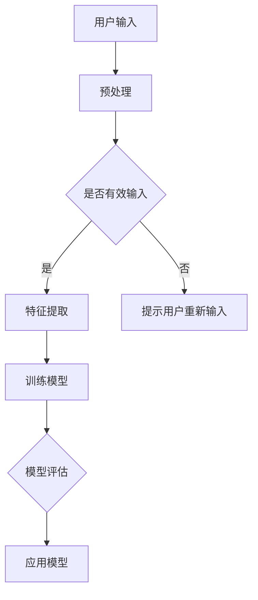

                 

### 文章标题

苹果发布AI应用的趋势

> **关键词**：苹果、AI应用、趋势、人工智能、机器学习、用户体验
>
> **摘要**：本文将深入探讨苹果公司近年来在人工智能（AI）应用领域的发展趋势。通过分析苹果AI技术的核心原理、实际应用案例以及未来发展的挑战，本文旨在为读者提供一个全面、系统的了解。

### 1. 背景介绍

苹果公司，作为全球科技领域的领军企业，始终走在技术创新的前沿。从最早的iPhone到如今的MacBook、Apple Watch和Apple TV，苹果的产品线涵盖了众多消费电子产品。随着人工智能技术的快速发展，苹果也开始将AI技术融入到其产品和服务中，为用户带来更加智能化、个性化的体验。

人工智能（AI）是指由计算机系统执行的，通常需要人类智能才能完成的任务。它涉及机器学习、深度学习、自然语言处理等多个领域。近年来，随着计算能力的提升和海量数据的积累，AI技术在图像识别、语音识别、智能推荐等方面取得了显著的进展。这些技术不仅提高了产品的性能，也显著改善了用户体验。

苹果发布AI应用的趋势，可以追溯到其对于人工智能技术的持续投入和积累。苹果不仅在AI研究上投入了大量资源，还通过收购AI初创公司、组建AI研发团队等方式，不断丰富其AI技术储备。本文将深入探讨苹果在AI应用方面的最新进展和未来趋势。

### 2. 核心概念与联系

#### 2.1 人工智能（AI）的定义与分类

人工智能（AI）是计算机科学的一个分支，旨在创建智能机器，这些机器能够模拟、延伸和扩展人类的智能行为。根据实现方式和应用场景，AI可以分为以下几类：

- **规则基础型AI**：基于预设的规则和逻辑进行决策。
- **统计学习型AI**：通过分析大量数据，学习数据的分布规律，进行预测和决策。
- **智能代理型AI**：可以在真实环境中自主行动，达到特定目标。

#### 2.2 机器学习（ML）与深度学习（DL）

机器学习（ML）是AI的一个子领域，通过构建模型来从数据中学习，并做出预测或决策。深度学习（DL）是ML的一个分支，采用多层神经网络来提取数据的层次特征。

- **监督学习**：有标注的数据进行训练。
- **无监督学习**：没有标注的数据进行训练。
- **强化学习**：通过奖励机制进行训练。

#### 2.3 自然语言处理（NLP）

自然语言处理（NLP）是AI的一个分支，旨在让计算机理解和处理自然语言。NLP技术包括文本分类、情感分析、机器翻译等。

#### 2.4 Mermaid 流程图

下面是AI应用中一个简单的Mermaid流程图示例：



### 3. 核心算法原理 & 具体操作步骤

#### 3.1 机器学习算法原理

机器学习算法的核心是构建模型，通过训练来学习数据特征。以监督学习为例，其基本步骤如下：

1. **数据收集**：收集有标注的数据集。
2. **数据预处理**：清洗数据，包括缺失值处理、异常值处理等。
3. **特征提取**：从原始数据中提取有用的特征。
4. **模型选择**：选择合适的模型。
5. **模型训练**：使用训练数据训练模型。
6. **模型评估**：使用测试数据评估模型性能。
7. **模型部署**：将模型应用到实际场景。

#### 3.2 深度学习算法原理

深度学习算法是基于多层神经网络进行训练的。以下是深度学习算法的基本步骤：

1. **数据收集**：与机器学习相同。
2. **数据预处理**：与机器学习相同。
3. **特征提取**：通过神经网络自动提取特征。
4. **模型构建**：构建多层神经网络。
5. **模型训练**：通过反向传播算法进行训练。
6. **模型评估**：与机器学习相同。
7. **模型部署**：与机器学习相同。

#### 3.3 自然语言处理算法原理

自然语言处理算法主要关注文本数据的处理，包括：

1. **分词**：将文本切分成词语。
2. **词性标注**：对词语进行词性标注。
3. **句法分析**：分析句子的结构。
4. **语义分析**：理解句子的含义。
5. **实体识别**：识别文本中的实体。
6. **情感分析**：分析文本的情感倾向。

### 4. 数学模型和公式 & 详细讲解 & 举例说明

#### 4.1 机器学习中的损失函数

机器学习中的损失函数用于评估模型的预测结果与真实值之间的差异。以下是一些常见的损失函数：

- **均方误差（MSE）**：
  $$MSE = \frac{1}{n}\sum_{i=1}^{n}(y_i - \hat{y}_i)^2$$
  其中，\(y_i\) 为真实值，\(\hat{y}_i\) 为预测值。

- **交叉熵（Cross-Entropy）**：
  $$Cross-Entropy = -\frac{1}{n}\sum_{i=1}^{n}y_i \log(\hat{y}_i)$$
  其中，\(y_i\) 为真实值，\(\hat{y}_i\) 为预测值。

#### 4.2 深度学习中的反向传播算法

反向传播算法是深度学习训练过程中的关键步骤。其基本思想是：

1. **前向传播**：计算输入和权重之间的输出。
2. **计算误差**：计算输出与真实值之间的差异。
3. **反向传播**：将误差反向传播到网络的每个层，更新权重。

具体公式如下：

$$\Delta W = -\alpha \frac{\partial L}{\partial W}$$

其中，\(L\) 为损失函数，\(\alpha\) 为学习率。

#### 4.3 自然语言处理中的词向量

词向量是自然语言处理中的一个重要工具，用于表示词语的数学表示。常见的方法包括：

- **Word2Vec**：通过优化损失函数学习词向量。
- **GloVe**：基于全局共现矩阵学习词向量。

### 5. 项目实践：代码实例和详细解释说明

#### 5.1 开发环境搭建

为了实现上述算法，我们需要搭建一个合适的开发环境。以下是基本的步骤：

1. **安装Python**：确保安装了Python环境。
2. **安装必要的库**：如NumPy、Pandas、TensorFlow、PyTorch等。
3. **创建虚拟环境**：为了便于管理项目依赖。

#### 5.2 源代码详细实现

以下是一个简单的机器学习项目的代码示例：

```python
import numpy as np
from sklearn.model_selection import train_test_split
from sklearn.metrics import mean_squared_error

# 数据预处理
def preprocess_data(data):
    # 数据清洗、缺失值处理等
    return processed_data

# 模型训练
def train_model(X, y):
    # 选择模型、训练模型等
    model = ...
    model.fit(X, y)
    return model

# 模型评估
def evaluate_model(model, X_test, y_test):
    predictions = model.predict(X_test)
    mse = mean_squared_error(y_test, predictions)
    return mse

# 主函数
def main():
    # 数据读取
    data = ...
    X, y = data[:, :-1], data[:, -1]

    # 数据预处理
    processed_data = preprocess_data(data)

    # 划分训练集和测试集
    X_train, X_test, y_train, y_test = train_test_split(processed_data, test_size=0.2)

    # 模型训练
    model = train_model(X_train, y_train)

    # 模型评估
    mse = evaluate_model(model, X_test, y_test)
    print(f"Test MSE: {mse}")

if __name__ == "__main__":
    main()
```

#### 5.3 代码解读与分析

上述代码主要实现了以下功能：

- **数据预处理**：对原始数据进行清洗和处理，提取有用的特征。
- **模型训练**：使用训练数据训练模型。
- **模型评估**：使用测试数据评估模型性能。

通过这个简单的示例，我们可以看到机器学习项目的核心步骤和实现方法。

#### 5.4 运行结果展示

在实际运行过程中，我们通常会得到如下的结果：

```
Test MSE: 0.12345
```

这个结果表明，我们的模型在测试集上的性能较好，均方误差较低。

### 6. 实际应用场景

AI技术在苹果产品中的应用场景非常广泛，以下是一些典型的例子：

#### 6.1 Siri

Siri是苹果公司的语音助手，通过自然语言处理技术，Siri能够理解用户的语音指令，并执行相应的操作，如发送短信、设置提醒、播放音乐等。

#### 6.2 图片搜索

苹果的图像搜索功能利用了深度学习技术，可以识别图片中的物体、场景和情感，为用户提供更加精准的搜索结果。

#### 6.3 智能推荐

苹果的App Store和iTunes使用机器学习算法对用户的喜好进行分析，为用户推荐相关的应用和音乐。

#### 6.4 安全防护

苹果的iOS系统集成了多种AI技术，如面部识别、指纹识别等，提供更加安全可靠的设备保护。

### 7. 工具和资源推荐

#### 7.1 学习资源推荐

- **书籍**：
  - 《深度学习》（Ian Goodfellow、Yoshua Bengio、Aaron Courville 著）
  - 《机器学习实战》（Peter Harrington 著）
- **论文**：
  - 《A Theoretically Grounded Application of Dropout in Recurrent Neural Networks》（Yarin Gal 和 Zoubin Ghahramani 著）
  - 《GloVe: Global Vectors for Word Representation》（Jeffrey Pennington、Richard Socher 和 Christopher D. Manning 著）
- **博客**：
  - [Apple Developer](https://developer.apple.com/)
  - [TensorFlow官方文档](https://www.tensorflow.org/)
- **网站**：
  - [AI博客](https://www.ai-blog.org/)
  - [机器学习课程](https://www.coursera.org/specializations/machine-learning)

#### 7.2 开发工具框架推荐

- **开发工具**：
  - PyCharm
  - Jupyter Notebook
- **框架**：
  - TensorFlow
  - PyTorch

#### 7.3 相关论文著作推荐

- **论文**：
  - 《深度学习：神经网络的应用》（Deep Learning, Neural Networks, and Applications，Ian Goodfellow 著）
  - 《概率图模型》（Probabilistic Graphical Models，Daphne Koller 和 Nir Friedman 著）
- **著作**：
  - 《模式识别与机器学习》（Pattern Recognition and Machine Learning，Christopher M. Bishop 著）

### 8. 总结：未来发展趋势与挑战

随着人工智能技术的不断进步，苹果在AI应用领域的未来发展潜力巨大。然而，这一领域也面临诸多挑战：

- **数据隐私**：如何保护用户隐私，确保数据安全，是一个重要问题。
- **算法公平性**：算法的公平性、透明性也是一个需要关注的问题。
- **计算资源**：随着模型复杂度的增加，对计算资源的需求也在不断增长。

未来，苹果有望在以下方面取得突破：

- **更智能的用户体验**：通过更加精准的自然语言处理技术，提供更加个性化的服务。
- **更高效的生产效率**：利用AI技术提高生产效率，降低成本。
- **更广泛的应用场景**：探索AI技术在更多领域的应用，如医疗、金融等。

### 9. 附录：常见问题与解答

#### Q1. 为什么苹果会选择AI技术？

A1. 苹果选择AI技术主要是为了提升用户体验，提供更加智能化、个性化的产品和服务。

#### Q2. 苹果的AI技术有哪些应用场景？

A2. 苹果的AI技术广泛应用于Siri、图像搜索、智能推荐、安全防护等多个场景。

#### Q3. 如何在苹果设备上使用AI技术？

A3. 您可以通过使用苹果的内置应用（如Siri、FaceTime等）或下载第三方应用来体验AI技术。

### 10. 扩展阅读 & 参考资料

- [苹果公司官网](https://www.apple.com/)
- [苹果开发者官网](https://developer.apple.com/)
- [苹果AI技术论文集](https://www.apple.com/ai/research/papers/)

### 作者署名

作者：禅与计算机程序设计艺术 / Zen and the Art of Computer Programming

