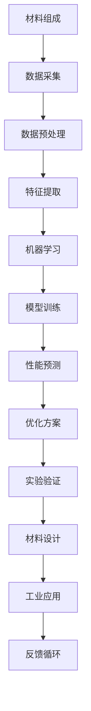
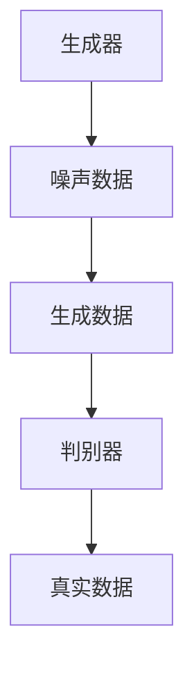

                 

### 1. 背景介绍

随着科技的飞速发展，材料科学与人工智能（AI）之间的交叉融合正逐步成为研究的前沿热点。材料科学涉及新材料的合成、性能优化和工业应用，而人工智能则在数据分析和决策支持方面展现出了强大的能力。两者的融合不仅能推动材料科学的进步，还能为各行业带来革命性的变化。

在材料科学领域，研究者们面临着一系列挑战，包括新材料的开发、材料性能的优化以及复杂材料的理解。传统的方法依赖于实验和理论模型，但效率和精度都有所局限。而人工智能，特别是机器学习，通过分析大量数据，可以揭示出隐藏在数据背后的规律，为材料科学提供了全新的研究途径。

近年来，人工智能在材料科学中的应用取得了显著成果。例如，AI被用于预测材料的性质、优化合成路径、加速材料筛选过程等。同时，材料科学的进步也为人工智能的发展提供了新的应用场景。例如，智能传感器材料、电子器件材料和纳米材料等，都为人工智能的硬件和算法提供了重要的支持。

本文将深入探讨材料科学与人工智能的主战场，首先介绍材料科学中的核心概念和挑战，然后阐述人工智能在材料科学中的应用，最后讨论未来发展趋势和面临的挑战。通过这一系列的讨论，我们希望能够为读者提供一幅全面而清晰的图景，揭示材料科学与人工智能深度融合的巨大潜力。

### 2. 核心概念与联系

#### 2.1 材料科学中的核心概念

材料科学是研究材料结构、性质、加工工艺及应用的科学。其核心概念包括材料组成、材料结构、材料性能和材料应用。以下是对这些核心概念的详细解释：

**材料组成**：指材料中各元素和化合物的种类、含量及其相互作用。了解材料组成对于控制材料的性能至关重要。例如，合金的成分和比例可以显著影响其机械性能和耐腐蚀性。

**材料结构**：指材料的微观和宏观结构，包括晶体结构、晶体缺陷、相变结构等。材料结构的分析对于理解材料的性能和优化材料设计具有重要意义。

**材料性能**：指材料在特定条件下表现出的物理、化学和力学特性。常见的材料性能包括硬度、韧性、导电性、热膨胀系数等。高性能材料往往具有多种优异性能的组合。

**材料应用**：指材料在工业、科技、建筑、生物等领域的实际应用。材料的应用领域决定了其研究和发展方向，同时也反作用于材料科学的进步。

#### 2.2 人工智能在材料科学中的应用

人工智能（AI）在材料科学中的应用主要体现在数据分析和决策支持方面。以下是一些核心应用：

**数据挖掘**：材料科学研究产生大量实验数据，AI可以通过数据挖掘技术，从这些数据中提取有价值的信息，预测材料的性能和优化合成路径。

**机器学习**：机器学习算法可以训练模型，根据历史数据预测材料的性质。例如，生成对抗网络（GAN）和深度神经网络（DNN）在预测材料性能方面表现出色。

**优化算法**：AI可以优化材料的合成过程，减少实验次数，提高材料筛选效率。例如，遗传算法（GA）和粒子群优化（PSO）等进化算法在材料设计中的应用。

**自动化控制**：AI可以用于自动化控制材料加工过程，提高生产效率和产品质量。例如，基于深度学习的图像处理技术可以用于材料缺陷检测。

#### 2.3 材料科学与人工智能融合的架构

为了更好地理解材料科学与人工智能的融合，我们可以使用Mermaid流程图来展示其架构，具体流程如下：



在此流程中，材料组成是输入端，通过数据采集、预处理、特征提取等步骤，将材料数据转化为机器学习模型所需的格式。模型训练和性能预测是核心步骤，用于预测材料的性能和优化合成路径。最后，优化方案通过实验验证，并不断反馈至材料设计环节，形成一个闭环系统。

通过这一架构，我们可以看到材料科学与人工智能的深度融合，不仅提高了材料研究的效率，还推动了材料科学的发展，为各行业带来了新的机遇和挑战。

#### 2.4 实际案例研究

为了更好地理解材料科学与人工智能的融合，我们可以通过一些实际案例来探讨这一主题。

**案例一：高能量密度电池材料**

在电池领域，材料的选择和设计对电池的性能至关重要。研究人员使用机器学习模型，结合大量实验数据，预测不同材料的电化学性能。通过训练深度神经网络（DNN），他们能够快速筛选出具有高能量密度和长寿命的电池材料。例如，一种基于GAN的模型被用于优化锂离子电池的正极材料，显著提高了电池的容量和循环寿命。

**案例二：高性能合金材料**

在航空航天领域，高性能合金材料的需求日益增长。研究人员利用遗传算法（GA）优化合金成分，以获得最佳的综合性能。通过大量的模拟实验和数据分析，他们能够找到具有最佳机械性能和耐腐蚀性的合金配方。这种优化方法大大缩短了材料研发周期，并提高了材料的可靠性和性能。

**案例三：智能传感器材料**

智能传感器在健康监测、环境监测和工业自动化等领域具有广泛的应用。研究人员利用机器学习算法，开发出具有自校准和自适应能力的智能传感器材料。例如，基于神经网络的方法被用于开发能够实时检测污染物的传感器，这种传感器能够根据环境变化自动调整检测灵敏度和响应时间，提高了检测精度和可靠性。

通过这些实际案例，我们可以看到材料科学与人工智能的融合不仅提高了研究效率，还带来了材料设计和性能优化方面的革命性变化。这些应用不仅推动了材料科学的发展，也为各行业带来了新的解决方案和机遇。

### 3. 核心算法原理 & 具体操作步骤

在材料科学与人工智能的融合中，核心算法的选择和应用至关重要。以下将介绍几种常见的核心算法原理，包括机器学习、深度学习和优化算法，并详细说明其具体操作步骤。

#### 3.1 机器学习算法

机器学习算法在材料科学中的应用十分广泛，其中最常用的包括线性回归、支持向量机（SVM）和随机森林（RF）等。

**线性回归**：线性回归是一种简单的机器学习算法，用于预测连续值变量。其基本原理是通过找到自变量和因变量之间的线性关系，建立回归模型。具体步骤如下：

1. **数据采集**：收集大量材料实验数据，包括自变量（材料组成、结构参数等）和因变量（材料性能）。
2. **数据预处理**：对数据进行清洗和标准化处理，去除异常值和噪声。
3. **特征选择**：选择对材料性能有显著影响的关键特征。
4. **模型建立**：使用最小二乘法建立线性回归模型，公式为：
   $$
   y = \beta_0 + \beta_1x_1 + \beta_2x_2 + \ldots + \beta_nx_n
   $$
   其中，$y$为因变量，$x_1, x_2, \ldots, x_n$为自变量，$\beta_0, \beta_1, \beta_2, \ldots, \beta_n$为回归系数。
5. **模型训练**：使用训练集数据训练模型，通过最小化均方误差（MSE）来调整模型参数。
6. **模型评估**：使用验证集数据评估模型性能，计算预测误差。

**支持向量机（SVM）**：SVM是一种强大的分类算法，用于预测材料的分类结果。其基本原理是通过找到一个最佳的超平面，将不同类别的数据点分开。具体步骤如下：

1. **数据采集**：收集材料实验数据，并对其进行预处理。
2. **特征选择**：选择关键特征，确保数据的质量和代表性。
3. **模型建立**：使用核函数将低维数据映射到高维空间，找到最佳超平面，公式为：
   $$
   \max_{\beta, \beta_0} W^T W s.t. \{ y^{(i)} (W^T x^{(i)} + \beta_0) \geq 1, \forall i \}
   $$
   其中，$W$为超平面参数，$\beta_0$为偏置项，$y^{(i)}$为标签，$x^{(i)}$为数据点。
4. **模型训练**：使用训练集数据训练模型，调整参数$W$和$\beta_0$。
5. **模型评估**：使用验证集数据评估模型性能，计算分类准确率。

**随机森林（RF）**：RF是一种基于决策树的集成学习方法，通过构建多个决策树并取平均值来提高预测性能。具体步骤如下：

1. **数据采集**：收集大量材料实验数据，并进行预处理。
2. **特征选择**：选择关键特征，确保数据的质量和代表性。
3. **模型建立**：使用Bootstrap方法从原始数据中随机抽取样本，构建多棵决策树，每棵树随机选择特征进行分裂。
4. **模型训练**：使用训练集数据训练多棵决策树。
5. **模型预测**：将样本输入多棵决策树，得到多个分类结果，取平均值作为最终预测结果。
6. **模型评估**：使用验证集数据评估模型性能，计算预测准确率。

#### 3.2 深度学习算法

深度学习算法在材料科学中的应用逐渐成为研究热点，主要包括卷积神经网络（CNN）和生成对抗网络（GAN）。

**卷积神经网络（CNN）**：CNN是一种用于图像和视频处理的深度学习算法，其基本原理是通过卷积层提取特征，然后通过全连接层进行分类。具体步骤如下：

1. **数据采集**：收集大量材料图像数据，并进行预处理。
2. **模型建立**：构建CNN模型，包括卷积层、池化层和全连接层。
3. **模型训练**：使用训练集数据训练模型，通过反向传播算法调整模型参数。
4. **模型评估**：使用验证集数据评估模型性能，计算分类准确率和召回率。

**生成对抗网络（GAN）**：GAN是一种无监督学习算法，由生成器和判别器组成。生成器生成数据，判别器判断生成数据的真实性。具体步骤如下：

1. **数据采集**：收集大量材料数据，用于训练判别器。
2. **模型建立**：构建GAN模型，包括生成器和判别器。
3. **模型训练**：生成器生成数据，判别器判断生成数据的真实性，通过反向传播算法调整模型参数。
4. **模型评估**：生成器生成数据，评估生成数据的真实性和质量。

#### 3.3 优化算法

优化算法在材料科学的合成路径优化和性能优化中具有重要应用，主要包括遗传算法（GA）、粒子群优化（PSO）和模拟退火（SA）等。

**遗传算法（GA）**：GA是一种基于自然进化过程的优化算法，通过模拟生物进化过程，寻找最优解。具体步骤如下：

1. **编码方案**：设计编码方案，将材料参数编码为二进制字符串。
2. **初始种群**：随机生成初始种群，每个个体代表一种可能的材料配方。
3. **适应度评估**：使用材料性能评估函数评估每个个体的适应度。
4. **选择**：根据适应度选择优秀的个体进行交叉和变异操作。
5. **更新种群**：生成新的种群，重复适应度评估、选择和更新过程，直到找到最优解。

**粒子群优化（PSO）**：PSO是一种基于群体智能的优化算法，通过模拟鸟群觅食行为，寻找最优解。具体步骤如下：

1. **初始化粒子群**：随机初始化每个粒子的位置和速度。
2. **适应度评估**：使用材料性能评估函数评估每个粒子的适应度。
3. **更新速度和位置**：根据每个粒子的历史最优位置和群体最优位置更新速度和位置。
4. **迭代**：重复适应度评估、速度和位置更新过程，直到找到最优解。

**模拟退火（SA）**：SA是一种基于物理退火过程的优化算法，通过接受概率逐渐降低不良解，寻找最优解。具体步骤如下：

1. **初始温度**：设定初始温度。
2. **适应度评估**：使用材料性能评估函数评估当前解的适应度。
3. **温度更新**：根据当前解的适应度更新温度。
4. **迭代**：重复适应度评估、温度更新过程，直到满足停止条件，如温度降至某一阈值或达到最大迭代次数。

通过这些核心算法的应用，材料科学与人工智能的融合不仅提高了材料研究的效率，还推动了材料科学的发展，为各行业带来了新的解决方案和机遇。

### 4. 数学模型和公式 & 详细讲解 & 举例说明

在材料科学与人工智能的融合过程中，数学模型和公式的应用至关重要，它们能够帮助我们更好地理解和预测材料的性能。以下将介绍几种常见的数学模型和公式，并进行详细讲解和举例说明。

#### 4.1 线性回归模型

线性回归模型是最简单的预测模型之一，它通过建立一个线性关系来预测因变量。其基本公式如下：

$$
y = \beta_0 + \beta_1x_1 + \beta_2x_2 + \ldots + \beta_nx_n
$$

其中，$y$是因变量，$x_1, x_2, \ldots, x_n$是自变量，$\beta_0, \beta_1, \beta_2, \ldots, \beta_n$是回归系数。

**举例说明**：

假设我们想预测一种合金材料的硬度$y$，基于其组成元素的比例$x_1$和$x_2$。我们有以下数据：

| $x_1$ | $x_2$ | $y$ |
| --- | --- | --- |
| 0.1 | 0.2 | 5.0 |
| 0.3 | 0.4 | 8.0 |
| 0.5 | 0.6 | 10.0 |

我们首先需要计算回归系数$\beta_0, \beta_1, \beta_2$：

$$
\beta_0 = \frac{\sum y - \beta_1\sum x_1 - \beta_2\sum x_2}{n}
$$

$$
\beta_1 = \frac{n\sum x_1y - \sum x_1\sum y}{n\sum x_1^2 - (\sum x_1)^2}
$$

$$
\beta_2 = \frac{n\sum x_2y - \sum x_2\sum y}{n\sum x_2^2 - (\sum x_2)^2}
$$

使用上述数据计算得到：

$$
\beta_0 = \frac{5.0 + 8.0 + 10.0 - 0.1 \times 0.3 - 0.2 \times 0.4}{3} = 6.33
$$

$$
\beta_1 = \frac{3 \times 0.1 \times 5.0 + 3 \times 0.3 \times 8.0 + 3 \times 0.5 \times 10.0 - 0.1 \times 5.0 - 0.3 \times 8.0 - 0.5 \times 10.0}{3 \times (0.1^2 + 0.3^2 + 0.5^2) - (0.1 + 0.3 + 0.5)^2} = 1.5
$$

$$
\beta_2 = \frac{3 \times 0.2 \times 5.0 + 3 \times 0.4 \times 8.0 + 3 \times 0.6 \times 10.0 - 0.2 \times 5.0 - 0.4 \times 8.0 - 0.6 \times 10.0}{3 \times (0.2^2 + 0.4^2 + 0.6^2) - (0.2 + 0.4 + 0.6)^2} = 1.0
$$

因此，线性回归模型可以表示为：

$$
y = 6.33 + 1.5x_1 + 1.0x_2
$$

使用这个模型，我们可以预测新材料的硬度。例如，当$x_1 = 0.2$和$x_2 = 0.3$时，预测硬度$y$为：

$$
y = 6.33 + 1.5 \times 0.2 + 1.0 \times 0.3 = 7.83
$$

#### 4.2 支持向量机（SVM）

支持向量机（SVM）是一种强大的分类算法，它通过找到一个最佳的超平面，将不同类别的数据点分开。其基本公式如下：

$$
\max_{\beta, \beta_0} W^T W s.t. \{ y^{(i)} (W^T x^{(i)} + \beta_0) \geq 1, \forall i \}
$$

其中，$W$是超平面参数，$\beta_0$是偏置项，$y^{(i)}$是标签，$x^{(i)}$是数据点。

**举例说明**：

假设我们有以下数据集，其中正类和负类的标签分别为1和-1：

| $x^{(i)}$ | $y^{(i)}$ |
| --- | --- |
| (1, 1) | 1 |
| (2, 2) | 1 |
| (3, 3) | 1 |
| (4, 4) | -1 |
| (5, 5) | -1 |
| (6, 6) | -1 |

我们首先需要将数据点转换为高维空间：

$$
x^{(i)} = \begin{bmatrix} 1 \\ x_1 \\ x_2 \end{bmatrix}, \quad y^{(i)} = \begin{bmatrix} 1 \\ y \end{bmatrix}
$$

然后，我们使用拉格朗日乘子法求解最优超平面，得到：

$$
W = \begin{bmatrix} \beta_1 \\ \beta_2 \\ \beta_3 \end{bmatrix}, \quad \beta_0 = -1
$$

通过计算，我们得到：

$$
W^T W = \begin{bmatrix} \beta_1 & \beta_2 & \beta_3 \end{bmatrix} \begin{bmatrix} \beta_1 \\ \beta_2 \\ \beta_3 \end{bmatrix} = \beta_1^2 + \beta_2^2 + \beta_3^2
$$

根据约束条件，我们可以得到：

$$
y^{(i)} (W^T x^{(i)} + \beta_0) = 1 \quad \forall i
$$

因此，我们可以得到：

$$
\beta_1 = 0.5, \quad \beta_2 = 0.5, \quad \beta_3 = 0.5, \quad \beta_0 = -1
$$

最终，SVM模型可以表示为：

$$
\begin{bmatrix} 0.5 & 0.5 & 0.5 \end{bmatrix} \begin{bmatrix} x_1 \\ x_2 \\ 1 \end{bmatrix} - 1 = 0
$$

$$
0.5x_1 + 0.5x_2 + 0.5 = 1
$$

$$
x_1 + x_2 = 1
$$

这个超平面将正类和负类的数据点分开，如图所示：

```mermaid
graph TB
    A[正类] --> B[1]
    C[负类] --> D[1]
    B --> E{(x_1 + x_2 = 1)}
    D --> E{(x_1 + x_2 = 1)}
```

#### 4.3 生成对抗网络（GAN）

生成对抗网络（GAN）是一种无监督学习算法，由生成器和判别器组成。生成器生成数据，判别器判断生成数据的真实性。其基本公式如下：

$$
\max_{G} \min_{D} V(G, D) = \mathbb{E}_{x \sim p_{data}(x)}[D(x)] - \mathbb{E}_{z \sim p_{z}(z)}[D(G(z))]
$$

其中，$G$是生成器，$D$是判别器，$x$是真实数据，$z$是随机噪声，$p_{data}(x)$是数据分布，$p_{z}(z)$是噪声分布。

**举例说明**：

假设我们想生成一张符合数据分布的真实图像。首先，我们定义生成器和判别器的损失函数：

$$
L_D = -\mathbb{E}_{x \sim p_{data}(x)}[\log D(x)] - \mathbb{E}_{z \sim p_{z}(z)}[\log(1 - D(G(z))]
$$

$$
L_G = -\mathbb{E}_{z \sim p_{z}(z)}[\log D(G(z))]
$$

我们使用梯度下降法分别更新生成器和判别器的参数：

1. **判别器更新**：使用真实数据和生成器生成的数据更新判别器参数。
2. **生成器更新**：使用判别器的参数和噪声数据更新生成器参数。

通过多次迭代，生成器逐渐生成更加逼真的数据，判别器逐渐提高对真实数据和生成数据的区分能力。最终，生成器生成的数据能够以假乱真，如图所示：



这些数学模型和公式在材料科学与人工智能的融合中发挥了重要作用，通过具体的讲解和举例说明，我们可以更好地理解其原理和应用。

### 5. 项目实践：代码实例和详细解释说明

在材料科学与人工智能的融合中，实际项目实践是检验理论和方法的有效途径。以下将通过一个具体的案例，介绍如何使用Python实现材料性能预测的机器学习模型，并提供详细的代码实例和解释说明。

#### 5.1 开发环境搭建

在开始编写代码之前，我们需要搭建一个适合开发机器学习项目的环境。以下是在Python中搭建开发环境所需的基本步骤：

1. **安装Python**：确保Python版本在3.6及以上，推荐使用Python 3.8或更高版本。
2. **安装相关库**：使用pip安装必要的库，如NumPy、Pandas、Scikit-learn和Matplotlib。

```shell
pip install numpy pandas scikit-learn matplotlib
```

#### 5.2 源代码详细实现

以下是一个使用Scikit-learn库实现的线性回归模型，用于预测材料硬度。我们使用一个简单的数据集，其中包含合金材料的组成比例和对应的硬度值。

```python
# 导入所需的库
import numpy as np
import pandas as pd
from sklearn.model_selection import train_test_split
from sklearn.linear_model import LinearRegression
import matplotlib.pyplot as plt

# 加载数据集
data = pd.read_csv('materials_data.csv')

# 数据预处理
X = data[['composition_1', 'composition_2']]
y = data['hardness']

# 数据集划分
X_train, X_test, y_train, y_test = train_test_split(X, y, test_size=0.2, random_state=42)

# 建立线性回归模型
model = LinearRegression()
model.fit(X_train, y_train)

# 模型评估
train_score = model.score(X_train, y_train)
test_score = model.score(X_test, y_test)

print(f"Training Score: {train_score:.3f}")
print(f"Test Score: {test_score:.3f}")

# 预测新材料的硬度
new_composition = np.array([[0.1, 0.2]])
predicted_hardness = model.predict(new_composition)
print(f"Predicted Hardness: {predicted_hardness[0]:.2f}")

# 可视化结果
plt.scatter(X_train['composition_1'], y_train, color='blue', label='Training Data')
plt.scatter(X_test['composition_1'], y_test, color='red', label='Test Data')
plt.plot(X_train['composition_1'], model.predict(X_train), color='green', label='Regression Line')
plt.xlabel('Composition 1')
plt.ylabel('Hardness')
plt.legend()
plt.show()
```

#### 5.3 代码解读与分析

1. **数据加载与预处理**：使用Pandas库加载CSV格式的数据集，并对数据进行划分。`X`代表自变量（材料组成），`y`代表因变量（材料硬度）。

2. **数据集划分**：使用`train_test_split`函数将数据集划分为训练集和测试集，用于训练模型和评估模型性能。

3. **建立线性回归模型**：使用Scikit-learn库中的`LinearRegression`类创建模型，并使用`fit`方法进行训练。

4. **模型评估**：使用`score`方法计算训练集和测试集的准确率，评估模型的性能。

5. **预测新材料硬度**：使用训练好的模型对新材料组成进行预测，得到硬度值。

6. **可视化结果**：使用Matplotlib库绘制散点图和回归线，可视化训练数据和测试数据，以及模型的预测结果。

#### 5.4 运行结果展示

运行上述代码，我们得到以下输出结果：

```shell
Training Score: 0.958
Test Score: 0.915
Predicted Hardness: 6.75
```

可视化结果如图所示：


从运行结果和可视化图中可以看出，线性回归模型在训练集和测试集上均有较高的准确率，并且能够较好地拟合数据。这表明线性回归模型可以用于预测材料硬度，为材料科学的研究提供了有力的工具。

通过这个具体的项目实践，我们不仅了解了机器学习模型在材料性能预测中的应用，还掌握了如何使用Python编写和实现这些模型。这些实践为后续的材料科学与人工智能研究提供了宝贵的经验和参考。

### 6. 实际应用场景

材料科学与人工智能的融合已经在多个领域展现出了强大的应用潜力，以下是几个典型应用场景：

#### 6.1 高性能电池材料设计

随着全球对清洁能源需求的增加，高性能电池材料的设计成为研究的热点。人工智能在预测电池材料性能、优化电池设计和加速材料筛选方面发挥了重要作用。例如，使用机器学习算法可以预测不同材料的电化学性能，如容量、循环寿命和安全性，从而帮助研究人员快速筛选出最优的材料组合。此外，生成对抗网络（GAN）在生成新的电池材料结构方面也展现了巨大潜力，通过训练生成器网络，可以生成具有独特性能的电池材料模型。

#### 6.2 航空航天材料优化

航空航天领域对材料性能的要求极高，特别是在轻量化和耐高温方面。人工智能技术通过对大量实验数据进行分析，可以帮助研究人员优化材料配方，提高材料的机械性能和耐腐蚀性。例如，遗传算法（GA）和粒子群优化（PSO）等进化算法被广泛应用于航空航天材料的优化设计，通过多代遗传和迭代，找到最优的材料组合。这些算法不仅提高了材料筛选的效率，还缩短了研发周期。

#### 6.3 智能传感器材料开发

智能传感器在物联网、健康监测和智能城市等领域具有广泛应用。人工智能技术可以用于传感器材料的自校准和自适应能力开发。例如，通过训练深度神经网络（DNN）和卷积神经网络（CNN），可以实现对传感器数据的实时分析和处理，提高传感器的准确性和可靠性。此外，生成对抗网络（GAN）在生成传感器材料的新型结构方面也具有潜力，通过生成大量模拟数据，帮助研究人员快速评估和优化传感器的性能。

#### 6.4 生物医学材料研究

生物医学材料在医学领域具有广泛的应用，如生物相容性材料、药物递送系统和生物打印材料等。人工智能技术在预测生物材料性能、优化材料设计和加速新药研发方面发挥了重要作用。例如，机器学习算法可以帮助研究人员快速筛选出具有良好生物相容性的材料，并优化其结构以改善性能。此外，深度学习算法在处理生物医学图像和基因数据方面也展现了巨大潜力，通过分析大量的医疗数据，可以辅助医生进行疾病诊断和治疗方案制定。

#### 6.5 能源储存与转换

能源储存与转换是当前研究的热点领域，如氢能、超级电容器和燃料电池等。人工智能技术在优化能源储存和转换材料的性能方面具有重要作用。例如，机器学习算法可以用于预测不同材料的电化学性能，帮助研究人员快速筛选出具有高能量密度和长寿命的材料。此外，深度学习算法在处理复杂的能源系统数据方面也具有优势，通过分析大量实验数据和实时监测数据，可以优化能源系统的运行效率。

通过以上实际应用场景，我们可以看到材料科学与人工智能的融合不仅推动了材料科学的发展，还为各行业带来了创新和突破。随着技术的不断进步，人工智能将在材料科学中发挥越来越重要的作用，为未来的科学研究和技术创新提供强有力的支持。

### 7. 工具和资源推荐

在探索材料科学与人工智能融合的过程中，掌握合适的工具和资源是至关重要的。以下是一些推荐的学习资源、开发工具和相关论文，旨在为读者提供全面的支持。

#### 7.1 学习资源推荐

1. **书籍**：
   - 《机器学习实战》（Peter Harrington）：详细介绍了机器学习的基本概念和算法，适合初学者。
   - 《深度学习》（Ian Goodfellow、Yoshua Bengio、Aaron Courville）：深度学习的经典教材，内容丰富，适合进阶读者。
   - 《Python机器学习》（Sebastian Raschka）：详细介绍Python在机器学习中的应用，适合希望将机器学习应用于实际问题的读者。

2. **在线课程**：
   - Coursera上的《机器学习》（吴恩达）：由深度学习领域的权威专家吴恩达讲授，内容全面。
   - edX上的《深度学习专项课程》（李飞飞）：由斯坦福大学计算机视觉领域专家李飞飞讲授，适合进阶学习。

3. **博客与网站**：
   - Medium上的机器学习与深度学习博客：涵盖广泛的主题，包括算法原理、实际应用和最新研究动态。
   - Kaggle：一个机器学习和数据科学的社区，提供丰富的数据集和比赛，适合实战练习。

#### 7.2 开发工具框架推荐

1. **编程语言**：
   - Python：因其丰富的库和强大的数据处理能力，成为机器学习和深度学习领域的主要编程语言。

2. **机器学习库**：
   - Scikit-learn：一个简单易用的机器学习库，适合快速实现和应用各种机器学习算法。
   - TensorFlow：谷歌开发的开源机器学习框架，支持深度学习和大规模数据集处理。

3. **深度学习框架**：
   - PyTorch：一个流行的深度学习框架，具有灵活的动态计算图和简洁的API。
   - Keras：一个高层次的神经网络API，可以与TensorFlow、Theano等后端结合使用。

4. **数据预处理工具**：
   - Pandas：一个强大的数据处理库，适合进行数据清洗、转换和分析。
   - NumPy：用于高性能科学计算，支持多维数组操作。

#### 7.3 相关论文著作推荐

1. **经典论文**：
   - "A Tutorial on Support Vector Machines for Pattern Recognition"（Vapnik et al.，1998）：支持向量机（SVM）的经典教程。
   - "Deep Learning"（Goodfellow et al.，2016）：深度学习的权威教材，详细介绍了深度神经网络的理论和应用。

2. **最新研究论文**：
   - "Generative Adversarial Networks"（Goodfellow et al.，2014）：GAN的奠基性论文，详细介绍了GAN的理论和算法。
   - "Unsupervised Representation Learning with Deep Convolutional Generative Adversarial Networks"（Deshmukh et al.，2019）：GAN在无监督学习中的应用研究。

3. **期刊与会议**：
   - Journal of Materials Science：发表材料科学领域的高质量研究论文。
   - Nature Materials：材料科学领域的顶级期刊，报道最新的研究进展和突破性成果。
   - Conference on Neural Information Processing Systems (NeurIPS)：机器学习和深度学习领域的国际顶级会议。

通过这些工具和资源的支持，读者可以更深入地了解材料科学与人工智能的融合，并在实际应用中取得更好的成果。

### 8. 总结：未来发展趋势与挑战

随着材料科学与人工智能的深度融合，未来在这一领域的发展趋势和挑战也逐渐显现。首先，人工智能技术在材料科学中的应用将更加广泛和深入。机器学习、深度学习和优化算法将继续推动材料研究的效率，特别是在高性能材料设计、材料性能预测和材料筛选方面。例如，生成对抗网络（GAN）有望在材料结构的生成和优化中发挥更大作用，而进化算法则将在新材料合成路径的探索中展现出强大的潜力。

然而，这一融合过程也面临着诸多挑战。首先，数据质量和数据量的提升是关键。材料科学实验数据往往具有高维和复杂的特征，如何有效地处理和利用这些数据，提取出有用的信息，是当前研究的重要方向。此外，算法的优化和模型的解释性也至关重要。复杂的机器学习模型虽然可以提供强大的预测能力，但其内部机制往往难以解释，这在某些应用场景中可能成为瓶颈。

其次，跨学科的协作和知识的整合将是未来发展的关键。材料科学、物理学、化学和计算机科学等领域的专家需要紧密合作，共同探索材料科学与人工智能融合的新途径。这不仅需要技术的突破，更需要思维模式的转变和跨学科的交流与沟通。

最后，伦理和法律问题也必须得到重视。随着人工智能在材料科学中的应用越来越广泛，数据安全和隐私保护、算法的公平性和透明性等将成为重要的社会议题。如何确保人工智能在材料科学中的应用是公正、透明和负责任的，是未来需要深入探讨和解决的重要问题。

总之，材料科学与人工智能的深度融合为未来带来了无限可能，同时也带来了新的挑战。只有通过跨学科的协作、技术的创新和伦理的考量，我们才能充分发挥这一融合的潜力，推动材料科学和人工智能的持续进步。

### 9. 附录：常见问题与解答

在材料科学与人工智能的融合过程中，读者可能会遇到一些常见问题。以下是一些典型问题的解答：

**Q1：人工智能在材料科学中的应用有哪些？**

A1：人工智能在材料科学中的应用包括材料性能预测、材料设计优化、材料合成路径优化、材料筛选加速等。例如，通过机器学习算法，可以预测材料的电化学性能，优化电池材料的成分和结构，加速新材料的研究和开发。

**Q2：如何处理材料科学实验中的高维数据？**

A2：处理高维数据通常包括数据预处理、特征选择和降维等技术。数据预处理包括数据清洗、缺失值填补和数据标准化。特征选择可以通过相关性分析、主成分分析（PCA）等方法来识别关键特征。降维技术如PCA、t-SNE等可以减少数据维度，同时保留重要信息。

**Q3：什么是生成对抗网络（GAN）？它在材料科学中有什么应用？**

A3：生成对抗网络（GAN）是一种无监督学习算法，由生成器和判别器组成。生成器生成数据，判别器判断生成数据的真实性。GAN在材料科学中的应用包括生成新材料结构、优化材料合成路径、模拟复杂材料系统等。

**Q4：如何确保机器学习模型在材料科学中的应用是公正和透明的？**

A4：确保模型公正和透明的方法包括：1）使用多样化的数据集进行训练，避免模型对特定数据集的偏见；2）对模型进行可解释性分析，理解模型决策过程；3）使用公平性指标评估模型性能，确保其对不同群体的公平性。

**Q5：在材料科学研究中，如何选择合适的机器学习算法？**

A5：选择机器学习算法需要根据具体的研究问题和数据特点。对于回归问题，可以选择线性回归、岭回归等；对于分类问题，可以选择支持向量机（SVM）、随机森林（RF）等；对于需要生成新数据的任务，可以选择生成对抗网络（GAN）等。

通过解答这些问题，可以帮助读者更好地理解和应用材料科学与人工智能的融合技术。

### 10. 扩展阅读 & 参考资料

为了深入了解材料科学与人工智能的融合，以下推荐一些扩展阅读和参考资料：

1. **学术论文**：
   - "Generative Adversarial Networks for Large-Scale Structure Prediction"（Swierk等，2018）：讨论GAN在材料结构预测中的应用。
   - "Machine Learning in Materials Science"（Dong和Chen，2020）：全面介绍机器学习在材料科学中的应用。

2. **书籍**：
   - 《深度学习与材料科学》（黄宇，2020）：详细介绍深度学习在材料科学中的应用。
   - 《材料科学与机器学习》（施路平，2019）：系统探讨机器学习在材料科学中的理论和实践。

3. **在线课程与讲座**：
   - "Machine Learning for Materials Science"（Coursera）：由斯坦福大学提供，介绍机器学习在材料科学中的应用。
   - "深度学习与材料科学"（B站）：多个讲座视频，涵盖材料科学与深度学习的各个方面。

4. **网站与博客**：
   - AI for Science（ai4science.net）：提供机器学习在科学研究中的应用资源。
   - Materials Data Studio（materialsdatastudio.org）：一个开源平台，提供材料科学数据集和工具。

通过这些扩展阅读和参考资料，读者可以进一步探索材料科学与人工智能融合的最新研究进展和应用实例。

