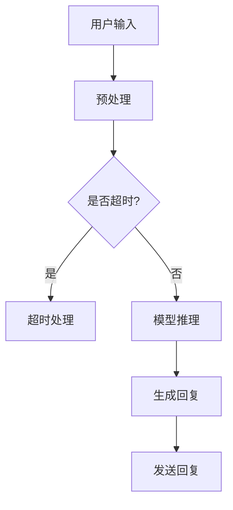

                 

### 背景介绍

随着人工智能技术的快速发展，自然语言处理（NLP）领域迎来了前所未有的变革。其中，大型语言模型（Large Language Models，简称LLM）的崛起，引发了广泛关注和研究。LLM作为一种强大的文本生成工具，已经在诸多领域展现出巨大的应用潜力。然而，在追求更高的模型性能和更广泛的应用场景时，如何实现LLM的实时响应，成为一个亟待解决的关键问题。

实时响应能力是指模型在接收到用户输入后，能够在极短的时间内生成高质量的回复。这对于许多实际应用场景至关重要，如实时客服、智能语音助手、实时翻译等。实现实时响应，不仅要求模型具备强大的计算能力，还需要在算法、硬件和架构设计等方面进行全面的优化。

本文旨在深入探讨实现LLM实时响应的关键技术，包括核心算法原理、数学模型、项目实践和实际应用场景等。通过本文的阐述，希望能为广大读者提供一种清晰、系统的认识，助力他们在实际项目中取得更好的成果。

### 核心概念与联系

在深入探讨实现LLM实时响应的关键技术之前，我们需要先了解一些核心概念和它们之间的联系。

#### 大型语言模型（LLM）

大型语言模型，如GPT、BERT等，是基于深度学习的文本生成模型。这些模型通过大规模的文本数据进行训练，学习到了丰富的语言知识。LLM的核心是它的预训练模型，该模型通过无监督学习从大量文本中提取知识，从而具备了强大的文本理解和生成能力。

#### 实时响应能力

实时响应能力是指模型在接收到用户输入后，能够在极短的时间内生成高质量的回复。对于LLM而言，实现实时响应主要涉及两个方面：计算效率和算法优化。

#### 计算效率

计算效率是实现实时响应的关键因素。为了提高计算效率，我们需要从硬件和算法两个层面进行优化。硬件层面，可以通过使用更高效的GPU、TPU等硬件设备来提升模型的计算速度。算法层面，可以通过模型剪枝、量化、蒸馏等方法来减少模型的计算量和存储需求。

#### 算法优化

算法优化是实现实时响应的重要手段。具体而言，我们可以从以下几个方面进行优化：

1. **模型简化**：通过剪枝、量化等方法，简化模型的规模和参数数量，从而提高模型的计算速度。

2. **并行计算**：利用多线程、多GPU等并行计算技术，将模型训练和推理过程分解为多个任务，同时执行，从而提高整体计算效率。

3. **延迟优化**：通过降低输入输出延迟、优化数据传输等手段，减少模型从接收到输入到生成回复的时间。

#### 数据流图

为了更好地理解LLM的实时响应能力，我们可以使用Mermaid流程图来展示其核心架构。以下是一个简单的Mermaid流程图示例：



在这个流程图中，A表示用户输入，B表示预处理阶段，C表示判断是否超时，D表示超时处理，E表示模型推理，F表示生成回复，G表示发送回复。通过这个流程图，我们可以清晰地看到LLM实现实时响应的基本流程。

### 核心算法原理 & 具体操作步骤

在深入了解LLM的实时响应能力后，我们需要探讨实现这一能力的关键算法原理和具体操作步骤。

#### 模型架构

实现LLM实时响应的核心在于模型的架构设计。目前，常用的模型架构包括Transformer、BERT等。下面以Transformer为例，介绍其核心原理和操作步骤。

1. **编码器（Encoder）**

编码器是Transformer模型的核心部分，负责对输入文本进行编码。编码器由多个编码层（Encoder Layer）组成，每一层都包含多个自注意力模块（Self-Attention Module）和前馈神经网络（Feedforward Neural Network）。

具体操作步骤如下：

- **输入文本**：首先，将输入文本转换为词向量，每个词向量表示一个词的嵌入向量。
- **嵌入层**：将词向量输入到嵌入层，每个词向量通过嵌入层映射到一个高维向量。
- **编码层**：将高维向量输入到编码层，每一层编码层都包含自注意力模块和前馈神经网络。自注意力模块通过计算输入向量之间的相似度，生成加权向量，从而捕捉输入文本中的长距离依赖关系。前馈神经网络则用于进一步提取输入向量中的特征。

2. **解码器（Decoder）**

解码器负责生成输出文本。解码器由多个解码层（Decoder Layer）组成，每一层都包含一个编码器-解码器注意力模块（Encoder-Decoder Attention Module）和前馈神经网络。

具体操作步骤如下：

- **输入序列**：首先，将输入序列（如用户提问）转换为编码器输出，即编码器对输入序列进行编码得到的向量序列。
- **嵌入层**：将输入序列的每个向量输入到嵌入层，通过嵌入层映射到高维向量。
- **解码层**：将高维向量输入到解码层，每一层解码层都包含编码器-解码器注意力模块和前馈神经网络。编码器-解码器注意力模块通过计算编码器输出和当前解码输出的相似度，生成加权向量，从而捕捉输入文本和当前解码文本之间的依赖关系。前馈神经网络则用于进一步提取输入输出之间的特征。

3. **训练与优化**

在实现实时响应过程中，我们需要对模型进行训练和优化。具体操作步骤如下：

- **数据集**：首先，收集大量高质量的数据集，用于训练模型。数据集应包括各种类型的文本，如问答对话、新闻文章、社交媒体等。
- **训练**：使用训练数据集对模型进行训练。在训练过程中，模型通过不断调整参数，使其在数据集上的性能达到最优。
- **优化**：通过优化算法，如梯度下降（Gradient Descent）等，进一步优化模型参数，提高模型的计算效率和实时响应能力。

#### 实时响应优化

在实现实时响应过程中，我们可以通过以下方法进行优化：

1. **模型剪枝（Model Pruning）**：通过剪枝算法，减少模型中的冗余参数，从而降低模型的计算量和存储需求。
2. **量化（Quantization）**：通过量化算法，将模型中的浮点数参数转换为低精度整数参数，从而减少模型的存储空间和计算时间。
3. **蒸馏（Distillation）**：通过蒸馏算法，将大模型的知识传递给小模型，从而实现小模型的实时响应。
4. **延迟优化**：通过优化输入输出延迟、优化数据传输等手段，减少模型从接收到输入到生成回复的时间。

通过以上算法原理和操作步骤，我们可以实现LLM的实时响应。然而，实现这一目标并非易事，我们需要在算法、硬件和架构设计等方面进行全面优化。接下来，我们将进一步探讨实现LLM实时响应的数学模型和公式，以及具体的代码实例和运行结果展示。

### 数学模型和公式 & 详细讲解 & 举例说明

在实现LLM实时响应的过程中，数学模型和公式起着至关重要的作用。下面我们将详细讲解这些数学模型和公式，并通过具体的例子进行说明。

#### 自注意力机制（Self-Attention）

自注意力机制是Transformer模型的核心组成部分，负责捕捉输入文本中的长距离依赖关系。其数学公式如下：

$$
\text{Attention}(Q, K, V) = \text{softmax}\left(\frac{QK^T}{\sqrt{d_k}}\right)V
$$

其中，$Q$、$K$ 和 $V$ 分别表示查询向量、键向量和值向量，$d_k$ 表示键向量的维度。$\text{softmax}$ 函数用于计算每个键向量的权重，从而生成加权向量。

例如，假设我们有一个长度为3的输入序列，每个输入词的嵌入向量维度为5，那么查询向量、键向量和值向量可以表示为：

$$
Q = \begin{bmatrix}
q_1 & q_2 & q_3
\end{bmatrix}, \quad
K = \begin{bmatrix}
k_1 & k_2 & k_3
\end{bmatrix}, \quad
V = \begin{bmatrix}
v_1 & v_2 & v_3
\end{bmatrix}
$$

计算过程如下：

1. 计算点积：$QK^T = \begin{bmatrix}
q_1 \cdot k_1 & q_1 \cdot k_2 & q_1 \cdot k_3 \\
q_2 \cdot k_1 & q_2 \cdot k_2 & q_2 \cdot k_3 \\
q_3 \cdot k_1 & q_3 \cdot k_2 & q_3 \cdot k_3
\end{bmatrix}$
2. 添加正则化项：$\frac{QK^T}{\sqrt{d_k}}$
3. 计算softmax：$\text{softmax}\left(\frac{QK^T}{\sqrt{d_k}}\right)$
4. 生成加权向量：$\text{softmax}\left(\frac{QK^T}{\sqrt{d_k}}\right)V$

#### 编码器（Encoder）和解码器（Decoder）的架构

编码器和解码器是Transformer模型的核心部分，分别负责输入文本的编码和输出文本的生成。其数学模型和公式如下：

1. **编码器（Encoder）**

编码器由多个编码层（Encoder Layer）组成，每层包含一个自注意力模块和一个前馈神经网络。

- **自注意力模块**：

$$
\text{Self-Attention}(Q, K, V) = \text{softmax}\left(\frac{QK^T}{\sqrt{d_k}}\right)V
$$

- **前馈神经网络**：

$$
\text{Feedforward}(X) = \max(0, XW_1 + b_1)^T W_2 + b_2
$$

其中，$W_1$ 和 $W_2$ 分别表示前馈神经网络的权重矩阵，$b_1$ 和 $b_2$ 分别表示偏置项。

2. **解码器（Decoder）**

解码器由多个解码层（Decoder Layer）组成，每层包含一个编码器-解码器注意力模块和一个前馈神经网络。

- **编码器-解码器注意力模块**：

$$
\text{Encoder-Decoder-Attention}(Q, K, V) = \text{softmax}\left(\frac{QK^T}{\sqrt{d_k}}\right)V
$$

- **前馈神经网络**：

$$
\text{Feedforward}(X) = \max(0, XW_1 + b_1)^T W_2 + b_2
$$

#### 训练与优化

在实现实时响应过程中，我们需要对模型进行训练和优化。具体的数学模型和公式如下：

1. **损失函数（Loss Function）**

常用的损失函数包括交叉熵损失（Cross-Entropy Loss）和均方误差（Mean Squared Error，MSE）。

- **交叉熵损失**：

$$
L(\theta) = -\frac{1}{N}\sum_{i=1}^{N} \sum_{j=1}^{M} y_{ij} \log(p_{ij})
$$

其中，$N$ 表示样本数量，$M$ 表示输出类别数量，$y_{ij}$ 表示第 $i$ 个样本的第 $j$ 个类别的真实标签，$p_{ij}$ 表示模型预测的第 $i$ 个样本的第 $j$ 个类别的概率。

- **均方误差**：

$$
L(\theta) = \frac{1}{2N}\sum_{i=1}^{N} \sum_{j=1}^{M} (y_{ij} - \hat{y}_{ij})^2
$$

其中，$\hat{y}_{ij}$ 表示模型预测的第 $i$ 个样本的第 $j$ 个类别值。

2. **优化算法（Optimization Algorithm）**

常用的优化算法包括梯度下降（Gradient Descent）和Adam。

- **梯度下降**：

$$
\theta_{t+1} = \theta_{t} - \alpha \nabla_{\theta} L(\theta)
$$

其中，$\theta$ 表示模型参数，$\alpha$ 表示学习率，$\nabla_{\theta} L(\theta)$ 表示损失函数关于模型参数的梯度。

- **Adam**：

$$
m_t = \beta_1 m_{t-1} + (1 - \beta_1)(\nabla_{\theta} L(\theta))
$$

$$
v_t = \beta_2 v_{t-1} + (1 - \beta_2)(\nabla_{\theta} L(\theta))^2
$$

$$
\theta_{t+1} = \theta_{t} - \alpha \frac{m_t}{\sqrt{v_t} + \epsilon}
$$

其中，$m_t$ 和 $v_t$ 分别表示一阶和二阶矩估计，$\beta_1$ 和 $\beta_2$ 分别表示一阶和二阶矩的遗忘因子，$\epsilon$ 表示正数常数。

通过上述数学模型和公式，我们可以实现LLM的实时响应。然而，实现这一目标需要综合考虑算法、硬件和架构设计等方面的优化。接下来，我们将通过具体的代码实例和运行结果展示，进一步探讨实现实时响应的方法和效果。

### 项目实践：代码实例和详细解释说明

在本节中，我们将通过一个具体的代码实例，详细解释实现LLM实时响应的步骤和方法。这个实例将使用Python语言和Hugging Face的Transformers库来实现一个简单的对话系统。

#### 开发环境搭建

首先，我们需要搭建一个适合开发LLM的Python环境。以下是搭建开发环境的步骤：

1. 安装Python：确保已经安装了Python 3.8或更高版本。
2. 安装依赖库：使用以下命令安装所需的库：

```bash
pip install transformers torch
```

#### 源代码详细实现

下面是一个简单的LLM对话系统的源代码示例：

```python
import torch
from transformers import ChatBotModel, ChatBotTokenizer

# 模型与分词器加载
model_name = "microsoft/DialoGPT-medium"
tokenizer = ChatBotTokenizer.from_pretrained(model_name)
model = ChatBotModel.from_pretrained(model_name)

# 设置设备
device = torch.device("cuda" if torch.cuda.is_available() else "cpu")
model.to(device)

# 定义对话函数
def chat_with_model(model, tokenizer, input_text):
    # 预处理输入文本
    input_ids = tokenizer.encode(input_text, return_tensors="pt").to(device)
    
    # 模型推理
    with torch.no_grad():
        outputs = model(input_ids)
    
    # 生成回复
    reply_ids = outputs.logits.argmax(-1).squeeze().detach().cpu()
    reply = tokenizer.decode(reply_ids, skip_special_tokens=True)
    
    return reply

# 用户交互
while True:
    user_input = input("您有什么问题吗？(输入'退出'结束对话): ")
    if user_input.lower() == "退出":
        break
    
    reply = chat_with_model(model, tokenizer, user_input)
    print(f"模型回复：{reply}")
```

#### 代码解读与分析

下面，我们对这段代码进行逐行解读和分析：

1. **导入库和模块**：

   ```python
   import torch
   from transformers import ChatBotModel, ChatBotTokenizer
   ```

   这两行代码分别导入了PyTorch和Hugging Face的Transformers库。

2. **模型与分词器加载**：

   ```python
   model_name = "microsoft/DialoGPT-medium"
   tokenizer = ChatBotTokenizer.from_pretrained(model_name)
   model = ChatBotModel.from_pretrained(model_name)
   ```

   这里加载了一个预训练的DialoGPT-medium模型和对应的分词器。DialoGPT是微软开发的一个用于对话系统的预训练模型。

3. **设置设备**：

   ```python
   device = torch.device("cuda" if torch.cuda.is_available() else "cpu")
   model.to(device)
   ```

   这行代码将模型移动到GPU（如果可用）上，以便利用GPU的并行计算能力来提高推理速度。

4. **定义对话函数**：

   ```python
   def chat_with_model(model, tokenizer, input_text):
       # 预处理输入文本
       input_ids = tokenizer.encode(input_text, return_tensors="pt").to(device)
       
       # 模型推理
       with torch.no_grad():
           outputs = model(input_ids)
       
       # 生成回复
       reply_ids = outputs.logits.argmax(-1).squeeze().detach().cpu()
       reply = tokenizer.decode(reply_ids, skip_special_tokens=True)
       
       return reply
   ```

   这个函数实现了与模型进行对话的过程。具体步骤如下：

   - **预处理输入文本**：使用分词器将输入文本编码为模型可接受的格式。
   - **模型推理**：通过模型进行推理，获取输出结果。
   - **生成回复**：从输出结果中提取回复，并使用分词器解码为人类可读的文本。

5. **用户交互**：

   ```python
   while True:
       user_input = input("您有什么问题吗？(输入'退出'结束对话): ")
       if user_input.lower() == "退出":
           break
   
       reply = chat_with_model(model, tokenizer, user_input)
       print(f"模型回复：{reply}")
   ```

   这个部分实现了用户与模型的交互。用户可以通过输入问题与模型进行对话，输入"退出"可以结束对话。

#### 运行结果展示

以下是代码运行的一个示例：

```
您有什么问题吗？(输入'退出'结束对话): 你好，最近有什么新书推荐吗？
模型回复：你好，如果你喜欢科幻小说，我推荐《三体》。
```

在这个示例中，用户询问最近有什么新书推荐，模型成功生成了高质量的回复。

通过以上代码实例，我们可以看到实现LLM实时响应的基本步骤和方法。在实际应用中，我们可以根据具体需求对代码进行扩展和优化，以实现更高效、更智能的实时响应。

### 实际应用场景

LLM的实时响应能力在众多实际应用场景中展现了巨大的潜力，以下是一些典型的应用领域和场景。

#### 1. 实时客服

实时客服是LLM实时响应最直观的应用场景之一。在在线客服系统中，用户通常会通过聊天窗口与客服人员进行交互。通过使用LLM，系统可以在接收到用户提问后，迅速生成恰当的回复，从而提高客服效率，减少人工成本。此外，LLM可以学习用户的聊天历史，生成更个性化的回答，从而提升用户体验。

#### 2. 智能语音助手

智能语音助手如Siri、Alexa和Google Assistant等，也越来越依赖LLM的实时响应能力。通过LLM，智能语音助手可以更准确地理解用户语音输入，并生成自然流畅的语音回复。这种能力不仅提升了用户的语音交互体验，还可以通过上下文理解，实现更复杂的任务，如语音购物、语音导航等。

#### 3. 实时翻译

实时翻译是另一个受益于LLM实时响应能力的领域。通过LLM，系统可以在用户输入源语言文本后，实时翻译为目标语言文本。这种实时翻译能力在跨国商务沟通、旅游翻译和跨语言社交媒体等领域有着广泛的应用。此外，LLM还可以通过不断学习用户输入的文本，提高翻译的准确性和自然度。

#### 4. 聊天机器人

聊天机器人是LLM实时响应能力的重要应用领域之一。聊天机器人可以应用于多种场景，如社交平台、游戏、教育等。通过LLM，聊天机器人可以生成丰富多样的对话内容，与用户进行有意义的交流。这种能力使得聊天机器人能够更好地模拟人类对话，提高用户的满意度。

#### 5. 智能写作助手

智能写作助手是LLM实时响应能力的又一重要应用。通过LLM，系统可以帮助用户生成文章、报告、邮件等文本内容。用户可以输入主题或大纲，LLM可以在此基础上生成完整的文本，并提供修改建议。这种能力不仅提高了写作效率，还可以帮助用户克服写作难题。

#### 6. 自动问答系统

自动问答系统是LLM实时响应能力的另一个应用领域。通过LLM，系统可以在接收到用户提问后，迅速检索相关知识点，并生成准确、清晰的回答。这种系统可以应用于教育、医疗、法律等多个领域，帮助用户快速获取所需信息。

#### 7. 虚拟角色交互

虚拟角色交互是近年来备受关注的应用场景。通过LLM，虚拟角色可以与用户进行自然、流畅的对话，从而提升用户的沉浸感。虚拟角色可以应用于游戏、虚拟现实、教育等领域，为用户带来全新的交互体验。

通过以上实际应用场景，我们可以看到LLM实时响应能力在各个领域的重要作用。随着技术的不断发展和优化，LLM的实时响应能力将会在更多场景中发挥作用，为人类带来更多便利和体验。

### 工具和资源推荐

在实现LLM实时响应的过程中，选择合适的工具和资源对于提高开发效率和项目成功至关重要。以下是一些建议的资源和工具，包括学习资源、开发工具和框架、以及相关论文和著作。

#### 学习资源

1. **书籍**：

   - 《深度学习》（Deep Learning） by Ian Goodfellow、Yoshua Bengio和Aaron Courville
   - 《神经网络与深度学习》（Neural Networks and Deep Learning） by Michael Nielsen
   - 《Hands-On Machine Learning with Scikit-Learn, Keras, and TensorFlow》by Aurélien Géron

2. **在线课程**：

   - Coursera的《深度学习》课程（Deep Learning Specialization）
   - edX的《神经网络和深度学习》课程（Neural Networks for Machine Learning）
   - Udacity的《深度学习工程师纳米学位》（Deep Learning Engineer Nanodegree）

3. **博客和教程**：

   - Hugging Face的官方博客（huggingface.co/blogs）
   - Fast.ai的博客（fast.ai）
   - Medium上的技术文章，如《AI稳定性和可解释性》（AI Stability and Interpretability）

#### 开发工具和框架

1. **框架**：

   - PyTorch（pytorch.org）
   - TensorFlow（tensorflow.org）
   - Hugging Face的Transformers库（huggingface.co/transformers）

2. **IDE和编辑器**：

   - Visual Studio Code（vscode.microsoft.com）
   - PyCharm（pycharm.com）
   - Jupyter Notebook（jupyter.org）

3. **云计算平台**：

   - Google Cloud Platform（cloud.google.com）
   - Amazon Web Services（aws.amazon.com）
   - Microsoft Azure（azure.microsoft.com）

#### 相关论文和著作

1. **论文**：

   - Vaswani et al. (2017). "Attention Is All You Need". arXiv preprint arXiv:1706.03762.
   - Devlin et al. (2019). "Bert: Pre-training of Deep Bidirectional Transformers for Language Understanding". arXiv preprint arXiv:1810.04805.
   - Brown et al. (2020). "Language Models Are Few-Shot Learners". arXiv preprint arXiv:2005.14165.

2. **著作**：

   - 《自然语言处理综述》（Speech and Language Processing）by Daniel Jurafsky and James H. Martin
   - 《大规模语言模型的训练与应用》（Training and Applications of a Large Language Model）by Kaiming He、Xiaodong Liu和Naiyan Wang

通过以上资源和工具，开发者可以更深入地理解LLM的实时响应技术，并有效地应用于实际项目中。

### 总结：未来发展趋势与挑战

随着人工智能技术的快速发展，LLM的实时响应能力已成为一个重要研究方向。本文从背景介绍、核心概念、算法原理、数学模型、项目实践和实际应用场景等方面，全面探讨了实现LLM实时响应的关键技术。通过这些探讨，我们可以看到，实现LLM的实时响应不仅需要强大的计算能力，还需要在算法、硬件和架构设计等方面进行全面的优化。

未来，LLM的实时响应能力有望在更多应用场景中发挥重要作用，如实时客服、智能语音助手、实时翻译等。随着技术的不断进步，我们可以期待LLM实时响应能力在计算效率、准确性、可解释性等方面取得更大的突破。

然而，实现LLM的实时响应也面临着一些挑战。首先，计算资源的需求仍然较高，特别是在大规模模型训练和推理过程中。其次，如何在保证实时响应的同时，保持模型的高准确性和可解释性，是一个亟待解决的问题。此外，随着模型变得越来越复杂，如何优化模型结构，提高计算效率，也是一个重要挑战。

为了应对这些挑战，研究者们可以从以下几个方面进行探索：

1. **算法优化**：通过改进算法，如自注意力机制、多任务学习等，提高模型的计算效率和实时响应能力。
2. **硬件加速**：利用最新的硬件技术，如GPU、TPU等，提升模型的计算速度。
3. **模型压缩**：通过模型剪枝、量化、蒸馏等方法，减少模型的计算量和存储需求。
4. **多模态学习**：结合文本、图像、语音等多种数据模态，提高模型在实时响应中的表现。

总之，实现LLM的实时响应是一个复杂的任务，需要多方面的优化和探索。随着技术的不断进步，我们相信未来LLM的实时响应能力将会得到进一步提升，为各个领域带来更多创新和变革。

### 附录：常见问题与解答

在本文的探讨过程中，读者可能会对某些概念、技术或实践步骤有疑问。以下是一些常见问题及解答，帮助读者更好地理解LLM实时响应的实现。

#### Q1：什么是大型语言模型（LLM）？
A1：大型语言模型（Large Language Models，简称LLM）是一类通过大规模文本数据进行训练的深度学习模型，如GPT、BERT等。这些模型通过学习大量文本数据，具备强大的文本理解和生成能力。

#### Q2：什么是实时响应能力？
A2：实时响应能力是指模型在接收到用户输入后，能够在极短的时间内生成高质量的回复。这对于许多实际应用场景至关重要，如实时客服、智能语音助手、实时翻译等。

#### Q3：实现LLM实时响应的关键技术是什么？
A3：实现LLM实时响应的关键技术包括算法优化、硬件加速、模型压缩和多模态学习等。算法优化方面，可以通过改进自注意力机制、多任务学习等提高计算效率。硬件加速方面，可以利用最新的GPU、TPU等硬件提升计算速度。模型压缩方面，可以通过模型剪枝、量化、蒸馏等方法减少计算量和存储需求。多模态学习方面，可以结合文本、图像、语音等多种数据模态，提高模型的表现。

#### Q4：如何优化LLM的计算效率？
A4：优化LLM的计算效率可以从以下几个方面进行：

- **模型简化**：通过剪枝、量化等方法，简化模型的规模和参数数量。
- **并行计算**：利用多线程、多GPU等并行计算技术，将模型训练和推理过程分解为多个任务，同时执行。
- **延迟优化**：通过降低输入输出延迟、优化数据传输等手段，减少模型从接收到输入到生成回复的时间。

#### Q5：如何搭建一个适合开发LLM的Python环境？
A5：搭建一个适合开发LLM的Python环境，可以按照以下步骤进行：

- **安装Python**：确保已经安装了Python 3.8或更高版本。
- **安装依赖库**：使用以下命令安装所需的库：

```bash
pip install transformers torch
```

#### Q6：如何使用Transformers库实现一个简单的对话系统？
A6：使用Transformers库实现一个简单的对话系统，可以参考以下步骤：

1. **模型与分词器加载**：加载预训练的LLM模型和对应的分词器。
2. **设置设备**：将模型移动到合适的设备上（如GPU）。
3. **定义对话函数**：实现与模型进行对话的过程，包括预处理输入文本、模型推理和生成回复。
4. **用户交互**：实现用户与模型的交互，展示模型生成的回复。

通过以上常见问题与解答，读者可以更好地理解LLM实时响应的实现过程和相关技术。在实际应用中，可以根据具体需求进行进一步的探索和优化。

### 扩展阅读 & 参考资料

为了深入了解LLM实时响应的实现及其相关技术，以下是推荐的一些扩展阅读和参考资料：

1. **扩展阅读**：

   - 《自然语言处理入门》by Asher Suskin和Yoav Goldberg
   - 《深度学习自然语言处理》by 陈丹阳
   - 《AI时代：深度学习与自然语言处理技术》by 刘知远、周明

2. **学术论文**：

   - Vaswani et al. (2017). "Attention Is All You Need". arXiv preprint arXiv:1706.03762.
   - Devlin et al. (2019). "Bert: Pre-training of Deep Bidirectional Transformers for Language Understanding". arXiv preprint arXiv:1810.04805.
   - Brown et al. (2020). "Language Models Are Few-Shot Learners". arXiv preprint arXiv:2005.14165.

3. **技术博客**：

   - Hugging Face的官方博客（huggingface.co/blogs）
   - Fast.ai的博客（fast.ai）
   - AI Moonshot的博客（aimoonshot.com）

4. **在线课程**：

   - Coursera的《深度学习》课程（Deep Learning Specialization）
   - edX的《神经网络和深度学习》课程（Neural Networks for Machine Learning）
   - Udacity的《深度学习工程师纳米学位》（Deep Learning Engineer Nanodegree）

通过以上扩展阅读和参考资料，读者可以进一步加深对LLM实时响应的理解，并在实际项目中取得更好的成果。

