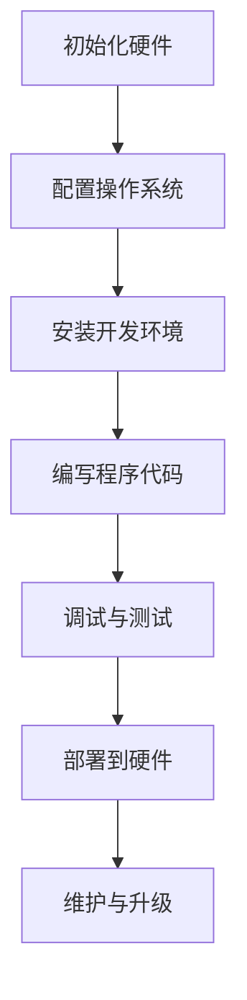

                 

### 树莓派项目开发：从入门到精通

> 关键词：树莓派，项目开发，入门教程，硬件编程，软件编程，AI应用

> 摘要：本文旨在为读者提供一份系统、全面的树莓派项目开发指南，从基础硬件配置到复杂AI应用的实现。无论你是初学者还是有经验的技术人员，本文都将带领你逐步掌握树莓派项目的开发流程，助你在物联网、嵌入式系统和人工智能领域取得突破。

## 1. 背景介绍

树莓派（Raspberry Pi）是一款由英国慈善基金会Raspberry Pi Foundation开发的微型计算机。自2012年首次推出以来，它以其低廉的价格、强大的性能和高度的灵活性，迅速在全球范围内赢得了广泛的应用和认可。树莓派适合各种项目开发，从简单的家庭自动化到复杂的机器人控制和智能家居系统。

随着物联网（IoT）、人工智能（AI）和边缘计算的兴起，树莓派的应用场景也在不断扩大。无论是学生、教师、程序员，还是对科技感兴趣的一般用户，树莓派都提供了一个极佳的平台来探索和实践计算机编程和硬件编程。

本文将分为以下几个部分：

1. **硬件与软件介绍**：介绍树莓派的基本硬件配置和常用的操作系统。
2. **核心概念与联系**：通过Mermaid流程图，详细阐述树莓派项目开发的核心概念和架构。
3. **核心算法原理 & 具体操作步骤**：讲解树莓派项目开发中的核心算法原理，并逐步演示如何实现这些算法。
4. **数学模型和公式**：介绍树莓派项目开发中涉及到的数学模型和公式，并通过实例进行详细解释。
5. **项目实践**：提供代码实例和详细解释说明，展示如何搭建和运行一个树莓派项目。
6. **实际应用场景**：探讨树莓派在各个领域的应用案例。
7. **工具和资源推荐**：推荐学习资源、开发工具和框架。
8. **总结**：展望树莓派项目开发未来的发展趋势和挑战。

### 2. 硬件与软件介绍

要开始树莓派项目开发，首先需要了解树莓派的基本硬件配置和操作系统。以下是一个典型的树莓派硬件配置：

- **处理器**：Broadcom BCM2837B0
- **内存**：1GB（入门级）/2GB/4GB（高级版）
- **存储**：MicroSD卡（用于存储操作系统和文件）
- **接口**：HDMI接口、3.5mm音频接口、GPIO接口、USB接口等

树莓派支持多种操作系统，包括官方的Raspbian、基于Linux的Ubuntu等。Raspbian是一个基于Debian的Linux发行版，非常适合树莓派。安装操作系统通常通过将操作系统镜像写入MicroSD卡来完成。

### 3. 核心概念与联系

树莓派项目开发的核心概念包括硬件编程和软件编程。硬件编程涉及树莓派与外部硬件设备的连接和交互，如传感器、执行器等；软件编程则关注于在树莓派上运行的程序和应用开发。

以下是一个用Mermaid绘制的树莓派项目开发流程图：



### 4. 核心算法原理 & 具体操作步骤

在树莓派项目开发中，算法是实现特定功能的核心。以下是一个简单的示例：使用树莓派读取温度传感器数据，并通过网络发送给远程服务器。

#### 4.1 算法原理

1. **连接硬件**：使用GPIO接口连接温度传感器（如DS18B20）。
2. **读取数据**：通过树莓派的Python库读取温度传感器的数据。
3. **发送数据**：使用网络库（如requests）将温度数据发送到远程服务器。

#### 4.2 具体操作步骤

##### 4.2.1 连接硬件

确保树莓派的GPIO引脚与DS18B20的引脚正确连接，通常使用3.3V和GPIO引脚。

##### 4.2.2 安装所需库

在树莓派上安装用于读取DS18B20的库（例如w1-gpio）和发送HTTP请求的库（例如requests）。

```bash
pip install w1-gpio requests
```

##### 4.2.3 编写程序代码

创建一个Python脚本，读取温度传感器数据，并使用requests库发送数据。

```python
import time
import requests

def read_temperature():
    # 读取温度传感器的数据
    # ...省略具体实现...
    return temperature

def send_data(url, data):
    # 发送数据到远程服务器
    # ...省略具体实现...
    pass

while True:
    temp = read_temperature()
    send_data("http://your_server_address", temp)
    time.sleep(60)  # 每60秒发送一次数据
```

##### 4.2.4 调试与测试

运行程序，检查温度数据是否正确读取并成功发送。

```bash
python temperature_sender.py
```

### 5. 数学模型和公式

在树莓派项目中，数学模型和公式通常用于数据分析和处理。以下是一个简单的线性回归模型：

$$ y = w_0 + w_1 \cdot x $$

其中，\( y \) 是预测值，\( x \) 是输入值，\( w_0 \) 和 \( w_1 \) 是模型参数。

#### 5.1 线性回归原理

线性回归用于预测连续值，其目标是通过最小化误差平方和来确定模型参数。

#### 5.2 模型训练

通过最小二乘法训练线性回归模型，具体步骤如下：

1. 收集数据集 \( D = \{ (x_1, y_1), (x_2, y_2), \ldots, (x_n, y_n) \} \)。
2. 计算输入特征的平均值 \( \bar{x} \) 和 \( \bar{y} \)。
3. 计算斜率 \( w_1 \)：
$$ w_1 = \frac{\sum_{i=1}^{n}(x_i - \bar{x})(y_i - \bar{y})}{\sum_{i=1}^{n}(x_i - \bar{x})^2} $$
4. 计算截距 \( w_0 \)：
$$ w_0 = \bar{y} - w_1 \cdot \bar{x} $$

### 6. 项目实践：代码实例和详细解释说明

以下是一个树莓派项目实例：使用树莓派监测环境温度和湿度，并通过Wi-Fi将数据发送到远程服务器。

#### 6.1 开发环境搭建

确保树莓派已安装Raspbian操作系统和Python 3。

#### 6.2 源代码详细实现

创建一个名为`env_monitor.py`的Python脚本，实现环境监测功能：

```python
import time
import Adafruit_DHT
import requests

SENSOR_PIN = 4
SERVER_URL = "http://your_server_address"

def read_environment():
    # 读取环境温度和湿度
    humidity, temperature = Adafruit_DHT.read_retry(Adafruit_DHT.DHT22, SENSOR_PIN)
    return humidity, temperature

def send_data(url, data):
    # 发送数据到远程服务器
    headers = {'Content-Type': 'application/json'}
    response = requests.post(url, headers=headers, json=data)
    return response.status_code

while True:
    humidity, temperature = read_environment()
    data = {
        "humidity": humidity,
        "temperature": temperature
    }
    status_code = send_data(SERVER_URL, data)
    if status_code == 200:
        print("Data sent successfully.")
    else:
        print("Failed to send data.")
    time.sleep(60)  # 每60秒发送一次数据
```

#### 6.3 代码解读与分析

- **传感器读取**：使用Adafruit_DHT库读取DHT22传感器的温度和湿度数据。
- **发送数据**：使用requests库将数据发送到远程服务器。

#### 6.4 运行结果展示

运行`env_monitor.py`脚本，观察是否能够成功读取环境数据并发送到远程服务器。

```bash
python env_monitor.py
```

### 7. 实际应用场景

树莓派在许多领域都有广泛应用，以下是一些实际应用场景：

1. **智能家居**：使用树莓派实现智能灯控、温度监测、门窗监控等。
2. **物联网**：将树莓派作为物联网网关，连接各种传感器和设备。
3. **教育**：用于教学编程和机器人课程，帮助学生掌握计算机和硬件编程知识。
4. **边缘计算**：在边缘设备上处理和分析数据，减轻云端负载。

### 8. 工具和资源推荐

以下是一些推荐的工具和资源，以帮助您更好地进行树莓派项目开发：

#### 8.1 学习资源推荐

- **书籍**：
  - 《树莓派入门经典》
  - 《树莓派编程实战》
- **在线教程**：
  - Raspberry Pi Official Website
  - Instructables

#### 8.2 开发工具框架推荐

- **编程语言**：Python、C、Java
- **开发环境**：PyCharm、Eclipse
- **硬件库**：Adafruit、RPI.GPIO

#### 8.3 相关论文著作推荐

- **论文**：
  - "Raspberry Pi as a Platform for IoT Applications"
  - "A Survey on Raspberry Pi for Smart Home Applications"
- **著作**：
  - "Raspberry Pi Cookbook"

### 9. 总结：未来发展趋势与挑战

树莓派的未来发展趋势将主要集中在以下几个方面：

1. **性能提升**：随着技术的进步，树莓派将提供更高的性能和更丰富的功能。
2. **更广泛的应用**：在物联网、人工智能和边缘计算领域，树莓派的应用场景将不断扩展。
3. **社区支持**：庞大的社区将为树莓派项目开发提供丰富的资源和帮助。

然而，树莓派项目开发也面临一些挑战：

1. **安全性**：随着网络连接的增加，确保数据安全和系统安全成为重要问题。
2. **功耗与管理**：在长时间运行和大量设备连接的情况下，功耗管理和资源优化是关键。

### 10. 附录：常见问题与解答

- **Q：树莓派的内存大小如何选择？**
  - **A**：根据您的项目需求和预算，选择合适的内存大小。入门级1GB内存适用于简单项目，而2GB或4GB内存适用于更复杂的应用。

- **Q：如何连接外部设备？**
  - **A**：使用GPIO接口、SPI接口或I2C接口连接外部设备。确保选择合适的驱动程序和库来处理设备通信。

- **Q：如何提高树莓派的性能？**
  - **A**：通过优化系统配置、使用高效的编程语言和算法，以及升级硬件（如增加内存或使用SSD）来提高性能。

### 11. 扩展阅读 & 参考资料

- **参考资料**：
  - Raspberry Pi Foundation Official Documentation
  - Adafruit Learning System
  - Python.org Documentation

作者：禅与计算机程序设计艺术 / Zen and the Art of Computer Programming

