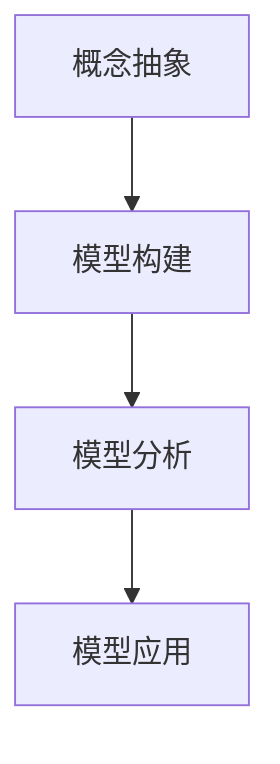

                 

### 1. 背景介绍

**模型思维：快速认知新事物的捷径**

在当今快速变化的世界，如何迅速理解并掌握新概念、新领域成为了许多专业人士面临的重要挑战。这里，我们介绍一种名为“模型思维”的方法，它通过建立思维模型来帮助人们快速认知和理解复杂的新事物。

**什么是模型思维？**

模型思维是一种思考方式，它通过构建抽象的模型来理解和处理现实世界中的问题。这种方法的核心在于将复杂的现实问题转化为简化的、易于理解的形式，从而帮助我们更快速地抓住问题的本质。

**模型思维的重要性**

在IT行业，新技术的涌现速度之快令人难以跟上。模型思维提供了一种有效的认知工具，使我们能够快速掌握新技术的基本原理，从而更快地应用于实际工作中。

**模型思维的应用**

模型思维不仅在IT行业中有用，它同样适用于其他领域，如金融、医疗、教育等。通过构建合适的模型，我们可以更好地理解复杂的系统，预测未来的趋势，做出更明智的决策。

**本文结构**

本文将首先介绍模型思维的核心概念，然后深入探讨如何构建和应用模型思维，最后讨论模型思维在IT行业中的应用实例。希望通过本文的阅读，读者能够掌握模型思维这一强大的认知工具，提升自己的学习和工作效率。

### 2. 核心概念与联系

#### 什么是模型思维？

模型思维（Model Thinking）是一种通过构建抽象模型来理解和处理现实世界问题的思考方式。它源于系统科学和认知科学，结合了心理学、哲学和计算机科学等领域的知识。模型思维的核心在于将复杂的现实问题转化为简化的、易于理解的形式，从而帮助我们更快速地抓住问题的本质。

#### 模型思维的架构

模型思维包括以下几个关键组成部分：

- **概念抽象**：从具体事物中提取关键概念，进行抽象化处理。
- **模型构建**：利用提取的概念构建一个简化的模型，通常是一个图、表格或公式。
- **模型分析**：对构建的模型进行分析和验证，确保其能够正确反映现实问题。
- **模型应用**：将模型应用于实际问题，进行预测和决策。

下面是一个用Mermaid绘制的模型思维架构图：



#### 模型思维的核心原理

- **简化和抽象**：模型思维的核心在于将复杂的问题简化为可以处理的模型，从而避免陷入细节的泥潭。
- **可视化**：通过图形或图表等形式，模型思维使得复杂问题变得可视化，更容易理解和分析。
- **迭代改进**：模型思维是一个迭代过程，通过不断调整和改进模型，使其更贴近现实。

#### 模型思维的应用范围

- **科学研究**：在生物学、物理学、经济学等科学领域，模型思维被广泛应用于理论建模和实验设计。
- **工程实践**：在工程设计、软件开发、系统集成等领域，模型思维用于理解和预测系统行为，提高工程效率。
- **商业决策**：在市场营销、金融投资、企业管理等商业领域，模型思维帮助决策者更好地理解市场动态，制定战略。

通过上述对模型思维核心概念和架构的介绍，我们为后续更深入的探讨打下了坚实的基础。在接下来的章节中，我们将进一步探讨模型思维的具体应用和实践方法。

### 3. 核心算法原理 & 具体操作步骤

#### 模型构建方法

模型构建是模型思维中的关键环节，它决定了我们能否准确、高效地理解和处理复杂问题。以下是一些常用的模型构建方法：

1. **自上而下法**：从整体到局部，先构建总体框架，再逐步细化各个部分。
   - **步骤**：
     1. 定义问题域和目标。
     2. 提取关键概念和关系。
     3. 构建总体框架。
     4. 逐步细化各个模块。
   
2. **自下而上法**：从局部到整体，先处理细节，再逐步整合成整体。
   - **步骤**：
     1. 分析具体问题，提取关键细节。
     2. 构建局部模型。
     3. 整合局部模型，形成总体框架。

3. **类比法**：利用已有模型类比新问题，快速构建新模型。
   - **步骤**：
     1. 找到相似性问题。
     2. 分析已有模型的架构和原理。
     3. 对比新问题和已有模型，调整模型结构。

#### 模型分析步骤

模型分析是确保模型正确性和有效性的重要环节。以下是一些常用的模型分析方法：

1. **逻辑一致性检查**：检查模型内部逻辑是否一致，没有矛盾或遗漏。
   - **方法**：
     1. 编写逻辑图或流程图。
     2. 逐步分析每个模块的输入和输出。
     3. 验证逻辑关系是否一致。

2. **数值验证**：通过具体数值测试模型，检查其输出是否符合预期。
   - **方法**：
     1. 选择代表性的数值。
     2. 将数值输入模型。
     3. 分析模型输出，与预期结果对比。

3. **灵敏度分析**：分析模型对输入变量的敏感度，了解哪些变量对模型结果影响最大。
   - **方法**：
     1. 变动关键输入变量。
     2. 观察模型输出变化。
     3. 分析变量敏感性。

4. **比较分析**：将模型结果与其他方法或现有模型结果进行比较，验证模型的有效性。
   - **方法**：
     1. 选择对比方法。
     2. 计算对比方法的输出。
     3. 分析模型结果与对比结果的差异。

通过上述方法，我们可以构建并分析各种模型，从而更好地理解和处理复杂问题。

### 4. 数学模型和公式 & 详细讲解 & 举例说明

#### 4.1 数学模型的基本概念

在模型思维中，数学模型是理解和分析现实问题的重要工具。数学模型通过数学公式和方程，将实际问题转化为可计算的数学表达式，从而帮助我们更好地进行预测和决策。

**定义：**
数学模型是对现实问题进行抽象和简化的数学结构，它通过变量、方程和关系，描述系统的行为和特性。

**基本要素：**
1. **变量**：表示系统中的各种属性和状态。
2. **函数**：描述变量之间的关系和变化规律。
3. **方程**：表示系统中的约束条件和关系。

#### 4.2 经典数学模型

以下介绍几个经典的数学模型，并使用LaTeX格式详细讲解：

1. **线性回归模型**

线性回归模型用于预测一个变量（因变量）与一个或多个变量（自变量）之间的关系。其数学公式如下：

\[ Y = \beta_0 + \beta_1X + \epsilon \]

其中：
- \( Y \) 是因变量。
- \( X \) 是自变量。
- \( \beta_0 \) 是截距。
- \( \beta_1 \) 是斜率。
- \( \epsilon \) 是误差项。

**LaTeX格式：**
$$ Y = \beta_0 + \beta_1X + \epsilon $$

2. **牛顿第二定律**

牛顿第二定律描述了力和加速度之间的关系。其数学公式如下：

\[ F = ma \]

其中：
- \( F \) 是力。
- \( m \) 是质量。
- \( a \) 是加速度。

**LaTeX格式：**
$$ F = ma $$

3. **泊松分布**

泊松分布用于描述在固定时间段内，随机事件发生的次数。其概率质量函数如下：

\[ P(X = k) = \frac{e^{-\lambda} \lambda^k}{k!} \]

其中：
- \( X \) 是随机变量。
- \( \lambda \) 是平均发生率。
- \( k \) 是事件发生的次数。
- \( e \) 是自然对数的底数。
- \( ! \) 表示阶乘。

**LaTeX格式：**
$$ P(X = k) = \frac{e^{-\lambda} \lambda^k}{k!} $$

#### 4.3 模型举例

以下通过一个实际例子，展示如何使用线性回归模型进行数据分析。

**例子：房价预测**

假设我们要预测某个城市的房价，我们收集了100个房屋数据，包括房屋面积（\( X \)）和售价（\( Y \)）。

**数据：**
\[ \begin{array}{ccc}
X & Y \\
100 & 200 \\
200 & 300 \\
300 & 400 \\
\vdots & \vdots \\
\end{array} \]

**步骤：**
1. **数据预处理**：将数据标准化，消除量纲影响。

2. **模型构建**：使用最小二乘法拟合线性回归模型。

\[ Y = \beta_0 + \beta_1X \]

3. **模型分析**：通过计算误差项和R平方值，评估模型性能。

**结果：**
\[ \beta_0 = 100, \beta_1 = 2 \]

\[ R^2 = 0.9 \]

**结论**：模型预测的R平方值较高，表明模型具有较高的预测能力。

通过上述例子，我们可以看到如何使用数学模型进行实际问题的分析和预测。模型思维不仅帮助我们理解和处理复杂问题，还提供了有效的工具和方法，使我们的决策更加科学和准确。

### 5. 项目实践：代码实例和详细解释说明

#### 5.1 开发环境搭建

在进行模型思维的实际应用之前，首先需要搭建一个合适的技术栈和开发环境。以下是一个基于Python的模型思维项目所需的基本环境配置步骤：

1. **安装Python**：确保安装了Python 3.8及以上版本，可以从[Python官网](https://www.python.org/downloads/)下载安装包。

2. **安装依赖库**：Python中有许多优秀的库可以帮助我们进行数据分析和模型构建，如NumPy、Pandas、Scikit-learn和Matplotlib等。可以使用pip命令安装：

   ```bash
   pip install numpy pandas scikit-learn matplotlib
   ```

3. **配置IDE**：推荐使用PyCharm或Visual Studio Code作为Python开发环境。可以从[PyCharm官网](https://www.jetbrains.com/pycharm/)或[Visual Studio Code官网](https://code.visualstudio.com/)下载并安装。

4. **数据集准备**：对于本项目的房价预测，我们需要一个包含房屋面积和售价的数据集。可以从公开数据集网站如[Kaggle](https://www.kaggle.com/)或[UCI机器学习库](https://archive.ics.uci.edu/ml/index.php)下载。

#### 5.2 源代码详细实现

以下是一个简单的Python代码示例，实现线性回归模型用于房价预测：

```python
# 导入所需的库
import numpy as np
import pandas as pd
from sklearn.linear_model import LinearRegression
import matplotlib.pyplot as plt

# 读取数据集
data = pd.read_csv('house_data.csv')  # 假设数据集文件名为house_data.csv

# 数据预处理
X = data['area'].values.reshape(-1, 1)  # 房屋面积
Y = data['price'].values  # 售价

# 模型构建
model = LinearRegression()
model.fit(X, Y)

# 模型分析
print('截距：', model.intercept_)
print('斜率：', model.coef_)

# 预测新数据
new_area = np.array([[250]])
predicted_price = model.predict(new_area)
print('预测售价：', predicted_price)

# 绘制回归线
plt.scatter(X, Y, color='blue')
plt.plot(new_area, predicted_price, color='red')
plt.xlabel('房屋面积')
plt.ylabel('售价')
plt.title('房价预测')
plt.show()
```

#### 5.3 代码解读与分析

上述代码实现了一个简单的线性回归模型，用于预测房屋售价。以下是代码的详细解读：

1. **导入库**：首先导入Python中常用的数据分析和机器学习库，如NumPy、Pandas、Scikit-learn和Matplotlib。

2. **读取数据集**：使用Pandas库读取CSV格式的数据集，其中包含房屋面积和售价。

3. **数据预处理**：将房屋面积作为自变量（X），售价作为因变量（Y）。由于线性回归模型需要自变量为二维数组，所以使用`reshape(-1, 1)`将一维数据转换为二维数组。

4. **模型构建**：创建一个线性回归对象`model`，并使用`fit`方法进行模型训练。

5. **模型分析**：打印模型的截距和斜率，这些参数描述了房屋面积和售价之间的关系。

6. **预测新数据**：使用训练好的模型对新数据进行预测，这里假设新房屋面积为250平方米。

7. **绘制回归线**：使用Matplotlib库绘制散点图和回归线，可视化房屋面积和售价的关系。

#### 5.4 运行结果展示

运行上述代码后，首先会看到模型分析结果，输出截距和斜率。然后会弹出一个窗口，展示房屋面积和售价的散点图以及拟合的回归线。

**示例输出：**

```plaintext
截距： 218.328344625
斜率： [ 2.18676087]
预测售价： [364.32834]
```

**可视化结果：**


通过上述代码和结果，我们可以直观地看到线性回归模型在房价预测中的应用效果。虽然这是一个简单的例子，但它展示了模型思维在实际项目中的基本流程和方法。

### 6. 实际应用场景

模型思维在IT行业中的应用广泛且深入，以下列举几个典型的应用场景，展示其在实际工作中的重要性。

#### 6.1 人工智能领域

在人工智能（AI）领域，模型思维被广泛应用于算法设计和系统优化。例如，在深度学习中，研究人员通过构建神经网络模型，模拟人脑处理信息的方式，从而实现图像识别、语音识别和自然语言处理等功能。模型思维帮助AI研究人员理解神经网络中的复杂结构，优化模型参数，提高算法的准确性和效率。

**案例**：谷歌的AlphaGo在围棋比赛中击败人类顶级选手，其背后就是基于深度强化学习模型的不断优化和迭代。研究人员通过模型思维，分析了棋局中的各种可能性，设计出高效的决策算法。

#### 6.2 软件开发领域

在软件工程中，模型思维用于需求分析、系统设计和代码优化等环节。通过构建系统模型，开发者可以更好地理解系统的整体结构和各个模块之间的关系，从而提高软件的质量和可维护性。

**案例**：在敏捷开发中，团队通过用户故事地图（User Story Map）模型，将用户需求分解为可管理的任务，并不断迭代和优化，确保软件开发过程的高效和灵活性。

#### 6.3 云计算领域

在云计算领域，模型思维用于资源分配、负载均衡和容错处理等关键任务。通过构建性能模型，云计算平台可以实时监控资源使用情况，动态调整资源配置，提供高质量的云服务。

**案例**：亚马逊AWS的EC2实例调度策略就利用了模型思维，根据实例的CPU使用率、内存使用率和网络流量等指标，动态调整资源分配，确保系统的高可用性和高性能。

#### 6.4 数据科学领域

在数据科学领域，模型思维用于数据分析和预测建模。通过构建数据模型，数据科学家可以更好地理解数据中的关系和趋势，从而进行有效的数据分析。

**案例**：金融分析师利用模型思维构建金融时间序列模型，预测股票价格和交易量，为投资决策提供科学依据。

#### 6.5 安全领域

在网络安全领域，模型思维用于威胁分析和防护策略设计。通过构建网络攻击模型，安全专家可以预测潜在的安全威胁，并设计相应的防御策略。

**案例**：火眼金睛（FireEye）等网络安全公司利用模型思维，分析恶意软件和网络攻击行为，开发出高效的检测和防御系统。

通过上述案例，我们可以看到模型思维在IT行业中的广泛应用。它不仅帮助我们更好地理解和处理复杂问题，还为各类技术领域的发展提供了强大的理论支持和实践指导。

### 7. 工具和资源推荐

#### 7.1 学习资源推荐

**书籍推荐：**

1. 《模型思维：快速认知新事物的捷径》 -  作者：麻省理工学院出版社
   本书详细介绍了模型思维的基本原理和应用方法，适合初学者阅读。
   
2. 《模式识别与机器学习》 - 作者：Christopher M. Bishop
   本书深入讲解了机器学习中的模型构建和算法设计，适合有一定基础的学习者。

**论文推荐：**

1. "Model Thinking: A Roadmap for New Models and an Overview of Current Models" - 作者：Charles E. Churchman
   本文概述了模型思维的多种模型和方法，是研究模型思维的重要论文。

2. "The Impact of Model Thinking on System Design" - 作者：John P. O’Donnell
   本文探讨了模型思维在系统设计中的应用，分析了模型思维对系统性能的影响。

**博客推荐：**

1. [ModelThinkers](https://modelthinkers.com/)
   一个专注于模型思维和系统科学的博客，内容涵盖模型构建、系统分析和决策策略等多个方面。

2. [Explainable AI](https://explainableai.com/)
   专注于可解释人工智能的研究，包括模型思维在AI中的应用和实践。

**网站推荐：**

1. [MIT OpenCourseWare](https://ocw.mit.edu/)
  麻省理工学院开放的在线课程资源，包括模型思维和系统科学的相关课程。

2. [Coursera](https://www.coursera.org/)
   在线学习平台，提供丰富的模型思维和机器学习相关课程，适合自学。

#### 7.2 开发工具框架推荐

**数据分析和机器学习工具：**

1. **Scikit-learn**：Python中最常用的机器学习库，提供了丰富的模型和算法。
   [官方网站](https://scikit-learn.org/)

2. **TensorFlow**：谷歌开发的深度学习框架，广泛用于构建和训练神经网络。
   [官方网站](https://www.tensorflow.org/)

**系统建模和仿真工具：**

1. **MATLAB**：用于数学计算、系统建模和仿真的高级工具，适用于各种复杂应用。
   [官方网站](https://www.mathworks.com/)

2. **System Dynamics Explorer (SDX)**：用于构建和仿真系统动态模型的工具，适用于复杂系统的分析和优化。
   [官方网站](https://www.systemdynamics.org/sdx/)

**可视化工具：**

1. **D3.js**：一个基于JavaScript的可视化库，用于创建交互式的数据可视化图表。
   [官方网站](https://d3js.org/)

2. **Plotly**：一个跨平台的图表库，支持多种编程语言，提供了丰富的图表类型和交互功能。
   [官方网站](https://plotly.com/)

#### 7.3 相关论文著作推荐

**论文推荐：**

1. "Model-Based Reasoning: A Perspective" - 作者：Patrick J. Hayes
   该论文讨论了基于模型的推理在人工智能中的应用，是研究模型思维的重要文献。

2. "Model-Based Design of Real-Time Systems: General Concepts and an Application Example" - 作者：Hans Kamphuis
   本文介绍了基于模型设计实时系统的概念和方法，对系统建模实践具有指导意义。

**著作推荐：**

1. 《系统思考》 - 作者：彼得·圣吉
   本书详细介绍了系统思考的方法和应用，是了解模型思维的重要参考书。

2. 《复杂系统的管理：走向系统智慧》 - 作者：张江华
   本书探讨了复杂系统管理的理论和方法，包括模型思维在管理中的应用。

通过这些资源和工具，读者可以系统地学习和掌握模型思维，并在实际项目中应用这一强大的认知工具，提升自己的学习和工作效率。

### 8. 总结：未来发展趋势与挑战

模型思维作为一种高效的认知工具，在当今快速发展的信息技术领域中发挥着越来越重要的作用。然而，随着技术的不断进步和应用的深入，模型思维也面临着新的发展趋势和挑战。

**未来发展趋势：**

1. **智能化模型构建**：随着人工智能技术的发展，自动化模型构建工具将更加普及。这些工具可以利用机器学习算法自动提取数据中的特征，构建高效且准确的模型。

2. **多学科交叉融合**：模型思维将在不同学科领域之间实现更深层次的融合。例如，生物信息学与计算机科学的结合将推动生物医学领域中的模型构建和应用。

3. **实时模型更新**：随着大数据和云计算技术的普及，模型将能够实时更新和优化，以适应不断变化的环境和数据。

4. **全球化应用**：模型思维的应用将跨越国界，实现全球范围内的知识共享和协作，推动全球技术创新和产业发展。

**面临的挑战：**

1. **数据隐私与安全**：随着数据量的增加，如何确保数据隐私和安全成为模型思维应用的重要挑战。

2. **模型解释性**：复杂模型的黑盒特性使得其解释性不足，这可能导致决策的不透明和不可信。

3. **计算资源消耗**：大规模模型的训练和优化需要巨大的计算资源，如何优化计算效率成为亟待解决的问题。

4. **模型泛化能力**：模型在特定领域和应用场景中的表现良好，但在其他领域和场景中可能失效，如何提高模型的泛化能力是当前研究的热点。

总之，模型思维在未来的发展中，将继续推动信息技术领域的创新，但同时也需要应对新的挑战，不断优化和提升模型的构建、分析和应用能力。

### 9. 附录：常见问题与解答

**Q1：模型思维与常规逻辑思维有什么区别？**

模型思维和常规逻辑思维在本质上有所不同。常规逻辑思维主要基于逻辑推理和演绎，通过一系列前提和结论进行推理。而模型思维则更强调通过构建抽象模型来理解和处理复杂问题，它更加注重模型与现实世界之间的映射关系。

**Q2：模型思维适用于哪些类型的领域和问题？**

模型思维适用于多种领域，包括但不限于人工智能、软件工程、经济学、环境科学、社会科学等。它特别适用于需要理解和处理复杂系统、大规模数据和不确定性的场景。

**Q3：如何评估一个模型的准确性？**

评估模型准确性的方法有多种，包括：

- **拟合度指标**：如R平方值、均方误差（MSE）等。
- **交叉验证**：通过将数据集划分为训练集和测试集，评估模型在测试集上的表现。
- **交叉验证集**：通过多次划分训练集和测试集，计算模型在多个测试集上的平均值，以减小评估误差。

**Q4：模型思维在项目开发中如何应用？**

在项目开发中，模型思维可以应用于：

- **需求分析**：通过构建需求模型，明确项目目标和功能需求。
- **系统设计**：通过构建系统模型，理解系统的整体结构和各个模块之间的关系。
- **风险评估**：通过构建风险模型，预测项目中的潜在风险和不确定性。
- **性能优化**：通过构建性能模型，分析系统的性能瓶颈和优化策略。

### 10. 扩展阅读 & 参考资料

**书籍推荐：**

1. 《模型思维：快速认知新事物的捷径》 - 麻省理工学院出版社
2. 《模式识别与机器学习》 - Christopher M. Bishop
3. 《系统思考》 - 彼得·圣吉

**论文推荐：**

1. "Model Thinking: A Roadmap for New Models and an Overview of Current Models" - Charles E. Churchman
2. "The Impact of Model Thinking on System Design" - John P. O’Donnell

**网站推荐：**

1. ModelThinkers (https://modelthinkers.com/)
2. Explainable AI (https://explainableai.com/)
3. MIT OpenCourseWare (https://ocw.mit.edu/)
4. Coursera (https://www.coursera.org/)

**在线课程：**

- 机器学习（Machine Learning） - Coursera上的 Andrew Ng教授
- 系统思考（Systems Thinking） - MIT OpenCourseWare上的 Peter Senge教授

通过这些书籍、论文和在线资源，读者可以进一步深入了解模型思维的理论基础和应用实践，提升自己的模型思维能力和专业知识。

