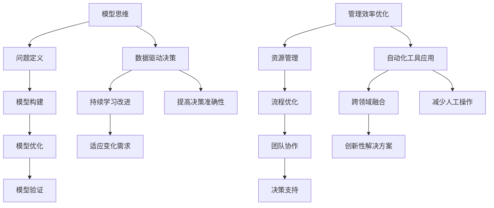

                 

### 1. 背景介绍

#### 1.1 引言

在当今这个高度信息化和数字化的时代，人工智能（AI）技术正以前所未有的速度发展。随着深度学习、神经网络等技术的不断成熟，AI模型在图像识别、自然语言处理、推荐系统等多个领域取得了显著的成就。然而，随着模型复杂度的增加和规模的扩大，模型训练和部署的成本也在不断上升，这给企业和开发人员带来了巨大的挑战。

在这样的背景下，如何优化模型思维和管理效率，成为了提高AI系统性能和降低成本的关键。本文将深入探讨这一主题，从背景介绍、核心概念与联系、核心算法原理、数学模型和公式、项目实践、实际应用场景、工具和资源推荐等多个方面，全面解析如何通过模型思维与管理效率的优化，提升人工智能系统的整体性能。

#### 1.2 模型思维的重要性

模型思维是指通过构建和优化数学模型，来模拟和解决实际问题的一种思维方式。在人工智能领域，模型思维尤为重要，因为它不仅决定了模型的效果，还直接影响到训练和部署的效率。传统的编程思维更多地关注于算法的细节和代码的优化，而模型思维则更注重从整体上理解和把握问题，从而设计出更为高效和准确的模型。

#### 1.3 管理效率的优化

管理效率的优化是指通过合理的管理策略和方法，提高团队的协作效率和工作效果。在人工智能项目中，管理效率的优化尤为重要。因为AI项目往往涉及大量的数据、复杂的算法和庞大的计算资源，如果没有有效的管理，很可能会导致项目进度延误、成本超支和质量下降。

#### 1.4 本文结构

本文将按照以下结构展开：

1. **背景介绍**：阐述人工智能和模型思维的重要性，以及管理效率优化的必要性。
2. **核心概念与联系**：介绍模型思维和管理效率优化中的核心概念，并使用Mermaid流程图展示其关系。
3. **核心算法原理 & 具体操作步骤**：详细解析模型思维的核心算法原理，并给出具体的操作步骤。
4. **数学模型和公式 & 详细讲解 & 举例说明**：介绍模型思维中常用的数学模型和公式，并给出详细的讲解和举例。
5. **项目实践：代码实例和详细解释说明**：通过一个实际项目，展示如何应用模型思维和管理效率优化。
6. **实际应用场景**：分析模型思维和管理效率优化在现实中的应用场景。
7. **工具和资源推荐**：推荐相关的学习资源、开发工具和框架。
8. **总结：未来发展趋势与挑战**：总结本文的主要观点，并探讨未来的发展趋势和面临的挑战。
9. **附录：常见问题与解答**：针对本文的主题，提供一些常见问题的解答。
10. **扩展阅读 & 参考资料**：推荐一些深入的阅读材料和参考资料。

通过本文的阅读，读者将能够全面了解模型思维与管理效率优化的方法和实践，为未来的AI项目提供有益的指导。

#### 1.5 人工智能与模型思维的发展历程

人工智能（AI）的概念起源于20世纪50年代，当时的科学家们希望通过编程让计算机模拟人类智能。早期的AI研究主要集中在规则推理和符号计算上，但这些方法在处理复杂问题时表现不佳。随着计算机硬件和算法的不断发展，特别是深度学习技术的突破，AI在图像识别、自然语言处理、推荐系统等领域取得了显著的进步。

模型思维作为AI发展的关键一环，也在这个过程中逐渐成熟。早期的人工智能模型，如专家系统和决策树，依赖于显式的规则和逻辑，这些模型虽然能够解决一些特定问题，但缺乏灵活性和泛化能力。随着深度学习的发展，模型思维开始转向数据驱动的方法，通过大量数据训练模型，使其具备更强的泛化和自适应能力。

在模型思维的发展历程中，关键的技术突破包括：

1. **神经网络**：神经网络是模拟人脑神经元连接的一种计算模型。1986年，Rumelhart, Hinton 和 Williams 提出了反向传播算法（Backpropagation），大大提高了神经网络的训练效率。
2. **卷积神经网络（CNN）**：CNN 是一种特别适合处理图像数据的神经网络，通过卷积操作提取图像特征，在图像识别领域取得了突破性成果。
3. **生成对抗网络（GAN）**：GAN 是由Goodfellow等人在2014年提出的，通过两个对抗网络（生成器和判别器）的博弈训练，可以生成高质量的图像和音频。

随着模型思维的不断发展，人工智能的应用范围也在不断扩大。从最初的工业自动化，到如今的医疗诊断、金融分析、智能交通等领域，模型思维正在深刻地改变着我们的生活方式和工作方式。

#### 1.6 管理效率优化在人工智能项目中的重要性

在人工智能项目中，管理效率的优化至关重要。一方面，人工智能项目往往涉及大量的数据预处理、模型训练和优化工作，这些工作需要高效的资源管理和调度；另一方面，人工智能项目的成功与否，很大程度上取决于团队的合作效率和决策质量。因此，如何优化管理效率，提高项目的完成度和成功率，成为了一个亟待解决的问题。

#### 1.7 管理效率优化的挑战与机遇

尽管管理效率优化在人工智能项目中具有重要性，但实际操作中仍然面临着诸多挑战：

1. **资源管理**：人工智能项目通常需要大量的计算资源和数据存储，如何合理分配和利用这些资源，是提高效率的关键。
2. **团队协作**：人工智能项目往往涉及多个领域的技术，需要团队成员之间的高效协作和沟通。
3. **决策质量**：在人工智能项目中，如何做出正确的决策，特别是在面对不确定性时，是一个重要的挑战。

然而，随着技术的发展和经验的积累，管理效率优化也面临着许多机遇：

1. **自动化工具**：随着自动化工具的不断涌现，如自动化测试、自动化部署等，大大减轻了开发人员的工作负担，提高了工作效率。
2. **数据驱动管理**：通过数据分析和可视化工具，管理者可以更好地了解项目进展和团队效率，从而做出更为科学的决策。
3. **新兴技术**：如人工智能、区块链等技术的应用，为管理效率优化提供了新的思路和方法。

综上所述，管理效率优化在人工智能项目中既是挑战也是机遇。只有通过不断探索和实践，才能找到适合自身项目的方法和策略，从而实现管理效率的持续提升。

#### 1.8 模型思维与管理效率优化的现状与未来趋势

在人工智能领域，模型思维与管理效率优化已经取得了一定的成果，但仍处于不断发展和完善的阶段。目前，许多企业和研究机构都在积极探索如何通过模型思维提升管理效率，以下是一些现状与未来趋势：

**现状：**

1. **模型思维的普及**：随着深度学习技术的普及，越来越多的企业和研究机构开始采用模型思维来解决实际问题，从自然语言处理到计算机视觉，从推荐系统到游戏开发，模型思维的应用范围不断扩大。
2. **数据驱动的管理**：越来越多的企业开始重视数据的重要性，通过数据分析和可视化工具来支持管理决策，从而提高管理效率。
3. **自动化工具的应用**：自动化工具如自动化测试、自动化部署等在人工智能项目中得到了广泛应用，大大减轻了开发人员的工作负担。

**未来趋势：**

1. **智能化的管理**：随着人工智能技术的发展，未来管理效率优化将更加智能化。通过使用机器学习和自然语言处理技术，管理者可以更好地理解项目进展和团队行为，从而做出更为精准和高效的决策。
2. **跨领域的融合**：模型思维和管理效率优化将与其他领域（如心理学、经济学等）进行深度融合，形成更加综合和有效的管理策略。
3. **数据隐私和安全**：随着数据量的增加，如何保护数据隐私和安全将成为管理效率优化的重要挑战。未来，企业和研究机构将需要开发更加安全可靠的数据管理和分析技术。
4. **持续学习的管理**：未来，管理效率优化将更加注重持续学习，通过不断积累经验和知识，提高管理决策的准确性和适应性。

综上所述，模型思维与管理效率优化在人工智能领域具有重要的现实意义和广阔的发展前景。只有紧跟技术发展趋势，不断探索和实践，才能在激烈的市场竞争中保持领先地位。

---

### 2. 核心概念与联系

在深入探讨模型思维与管理效率优化的具体实践之前，我们需要首先理解这两个核心概念，以及它们之间的重要联系。

#### 2.1 模型思维的概念

模型思维是指通过构建和优化数学模型来模拟和分析实际问题的一种思维方式。在人工智能领域，模型思维的核心在于如何将复杂的问题转化为数学问题，从而利用计算机的强大计算能力进行求解。模型思维通常包括以下几个关键步骤：

1. **问题定义**：明确要解决的问题，并确定所需的输入和输出。
2. **模型构建**：根据问题定义，构建一个数学模型，这通常涉及到选择合适的算法和架构。
3. **模型优化**：通过调整模型参数和结构，提高模型的性能和泛化能力。
4. **模型验证**：通过测试数据验证模型的准确性，并根据验证结果调整模型。

#### 2.2 管理效率优化的概念

管理效率优化是指通过一系列科学的管理方法和工具，提高团队协作效率和工作效果的过程。在人工智能项目中，管理效率优化涉及到多个方面：

1. **资源管理**：合理分配和利用计算资源、数据资源和人力资源。
2. **流程优化**：通过改进项目流程和操作流程，减少不必要的环节和等待时间。
3. **团队协作**：建立高效的沟通机制和协作平台，促进团队成员之间的信息共享和协同工作。
4. **决策支持**：利用数据分析和可视化工具，为管理决策提供科学依据。

#### 2.3 模型思维与管理效率优化的联系

模型思维和管理效率优化之间的联系在于，它们都是通过优化和改进，提高整体系统的性能和效率。具体来说，这种联系可以从以下几个方面体现：

1. **数据驱动的决策**：模型思维依赖于大量数据进行分析和预测，而管理效率优化也需要数据来支持决策。通过数据驱动的决策，可以提高决策的准确性和效率。
2. **自动化工具的应用**：模型思维和管理效率优化都受益于自动化工具的使用。通过自动化工具，可以减少人工操作，提高工作效率。
3. **持续学习和改进**：模型思维需要通过持续学习和调整来提高模型的性能，而管理效率优化也需要不断学习和改进，以应对不断变化的环境和需求。
4. **跨领域的融合**：模型思维和管理效率优化可以相互借鉴，从其他领域（如工业工程、项目管理等）引入新的方法和工具，实现跨领域的融合和创新。

#### 2.4 Mermaid流程图展示

为了更直观地展示模型思维与管理效率优化的关系，我们可以使用Mermaid流程图来描述其核心流程和联系。



通过这个Mermaid流程图，我们可以清晰地看到模型思维和管理效率优化之间的互动关系，以及它们如何通过数据驱动决策、自动化工具应用、持续学习和改进等手段，共同提升系统的整体性能和效率。

### 3. 核心算法原理 & 具体操作步骤

在深入探讨模型思维的核心算法原理之前，我们需要首先了解一些基础的算法概念，并解释这些算法是如何应用于实际问题的。

#### 3.1 基础算法概念

1. **线性回归**：线性回归是一种用于预测连续值的算法，通过找到一个线性函数来最小化预测值与真实值之间的误差。
2. **逻辑回归**：逻辑回归是一种用于预测概率的算法，通过最大化似然函数来训练模型。
3. **支持向量机（SVM）**：支持向量机是一种用于分类和回归的算法，通过找到一个超平面来最大化分类间隔。
4. **神经网络**：神经网络是一种模仿人脑神经元连接的计算模型，通过多层非线性变换来实现复杂函数的建模。

#### 3.2 模型训练与优化

1. **数据预处理**：在开始训练模型之前，需要对数据进行预处理，包括数据清洗、归一化和特征提取等。这一步的目的是提高模型训练的效率和效果。
2. **损失函数**：损失函数是用于衡量模型预测值与真实值之间差异的函数。常见的损失函数包括均方误差（MSE）和交叉熵损失。
3. **优化算法**：优化算法用于最小化损失函数，从而训练出最优模型。常见的优化算法有梯度下降、Adam优化器等。
4. **过拟合与正则化**：过拟合是指模型在训练数据上表现很好，但在测试数据上表现不佳。为了防止过拟合，可以采用正则化技术，如L1正则化、L2正则化等。

#### 3.3 具体操作步骤

以下是一个使用神经网络进行图像分类的基本操作步骤：

1. **数据收集与预处理**：收集并整理训练数据，对图像进行预处理，如缩放、裁剪和归一化。
2. **构建模型**：使用深度学习框架（如TensorFlow或PyTorch）构建神经网络模型，包括输入层、隐藏层和输出层。
3. **模型编译**：设置模型的损失函数和优化器，如使用交叉熵作为损失函数，使用Adam优化器。
4. **模型训练**：使用训练数据对模型进行训练，通过迭代计算梯度并更新模型参数。
5. **模型评估**：使用测试数据评估模型的性能，计算准确率、召回率等指标。
6. **模型优化**：根据评估结果调整模型结构或参数，以提高模型性能。
7. **模型部署**：将训练好的模型部署到生产环境中，进行实际应用。

#### 3.4 代码示例

以下是一个使用PyTorch框架进行图像分类的简单代码示例：

```python
import torch
import torchvision
import torch.nn as nn
import torch.optim as optim

# 数据预处理
transform = torchvision.transforms.Compose([
    torchvision.transforms.Resize(256),
    torchvision.transforms.CenterCrop(224),
    torchvision.transforms.ToTensor(),
    torchvision.transforms.Normalize(mean=[0.485, 0.456, 0.406], std=[0.229, 0.224, 0.225]),
])

train_data = torchvision.datasets.ImageFolder(root='train', transform=transform)
test_data = torchvision.datasets.ImageFolder(root='test', transform=transform)

train_loader = torch.utils.data.DataLoader(dataset=train_data, batch_size=32, shuffle=True)
test_loader = torch.utils.data.DataLoader(dataset=test_data, batch_size=32, shuffle=False)

# 构建模型
model = torchvision.models.resnet50(pretrained=True)
num_ftrs = model.fc.in_features
model.fc = nn.Linear(num_ftrs, 10)  # 10个类别

# 模型编译
criterion = nn.CrossEntropyLoss()
optimizer = optim.Adam(model.parameters(), lr=0.001)

# 模型训练
for epoch in range(20):
    running_loss = 0.0
    for inputs, labels in train_loader:
        optimizer.zero_grad()
        outputs = model(inputs)
        loss = criterion(outputs, labels)
        loss.backward()
        optimizer.step()
        running_loss += loss.item()
    print(f'Epoch {epoch+1}, Loss: {running_loss/len(train_loader)}')

# 模型评估
correct = 0
total = 0
with torch.no_grad():
    for inputs, labels in test_loader:
        outputs = model(inputs)
        _, predicted = torch.max(outputs.data, 1)
        total += labels.size(0)
        correct += (predicted == labels).sum().item()

print(f'Accuracy: {100 * correct / total}%')
```

通过这个示例，我们可以看到如何使用PyTorch构建和训练一个图像分类模型，从而实现模型思维的具体应用。

---

### 4. 数学模型和公式 & 详细讲解 & 举例说明

在模型思维中，数学模型和公式是理解和解决问题的基础。本节将详细介绍一些常用的数学模型和公式，并通过具体的例子来说明它们的实际应用。

#### 4.1 线性回归模型

线性回归模型是一种最简单的预测模型，用于预测一个线性关系的输出。其公式如下：

$$y = w_1 \cdot x_1 + w_2 \cdot x_2 + ... + w_n \cdot x_n + b$$

其中，$y$ 是预测值，$x_1, x_2, ..., x_n$ 是输入特征，$w_1, w_2, ..., w_n$ 是权重，$b$ 是偏置。

**举例说明**：

假设我们要预测一家餐厅的月收入（$y$），基于两个输入特征：每天的平均客流量（$x_1$）和每客平均消费（$x_2$）。根据历史数据，我们可以构建一个线性回归模型来预测月收入。

$$月收入 = w_1 \cdot 每天平均客流量 + w_2 \cdot 每客平均消费 + b$$

通过最小化预测值与实际值的误差，我们可以计算出权重和偏置。

#### 4.2 逻辑回归模型

逻辑回归模型是一种用于预测概率的模型，常用于二分类问题。其公式如下：

$$P(y=1) = \frac{1}{1 + e^{-(w_0 + w_1 \cdot x_1 + w_2 \cdot x_2 + ... + w_n \cdot x_n)}}$$

其中，$P(y=1)$ 是预测的概率，$w_0, w_1, w_2, ..., w_n$ 是权重。

**举例说明**：

假设我们要预测某个客户是否会购买产品（$y=1$ 或 $y=0$），基于多个输入特征。我们可以使用逻辑回归模型来预测购买的概率。

$$购买概率 = \frac{1}{1 + e^{-(w_0 + w_1 \cdot 年龄 + w_2 \cdot 收入 + ... + w_n \cdot 用户评价)}}$$

通过调整模型参数，我们可以计算出每个客户的购买概率。

#### 4.3 支持向量机（SVM）模型

支持向量机是一种用于分类和回归的强大算法，其核心思想是找到一个最优的超平面，使得不同类别的数据点尽可能分开。SVM的决策边界公式如下：

$$w \cdot x - b = 0$$

其中，$w$ 是权重向量，$x$ 是特征向量，$b$ 是偏置。

**举例说明**：

假设我们要分类一组数据，其中正类和负类分别位于不同的超平面两侧。我们可以使用SVM找到这个超平面，从而实现分类。

$$w \cdot x - b = 0$$

通过求解最优化问题，我们可以计算出权重和偏置。

#### 4.4 神经网络模型

神经网络是一种模拟人脑神经元连接的计算模型，通过多层非线性变换来实现复杂函数的建模。神经网络的输出公式如下：

$$\text{输出} = f(\text{权重} \cdot \text{输入} + \text{偏置})$$

其中，$f$ 是激活函数，如ReLU、Sigmoid和Tanh等。

**举例说明**：

假设我们要构建一个简单的神经网络，用于图像分类。我们可以定义多层神经网络，其中每层使用不同的激活函数。

$$\text{隐藏层1输出} = \text{ReLU}(\text{权重1} \cdot \text{输入} + \text{偏置1})$$
$$\text{隐藏层2输出} = \text{Sigmoid}(\text{权重2} \cdot \text{隐藏层1输出} + \text{偏置2})$$
$$\text{输出层输出} = \text{Tanh}(\text{权重3} \cdot \text{隐藏层2输出} + \text{偏置3})$$

通过训练和优化神经网络，我们可以使其能够准确分类图像。

综上所述，这些数学模型和公式在模型思维中扮演着至关重要的角色。通过理解这些模型和公式的原理和应用，我们可以更好地构建和优化AI模型，从而提高系统的性能和效率。

---

### 5. 项目实践：代码实例和详细解释说明

为了更好地展示模型思维与管理效率优化的具体应用，下面我们通过一个实际项目来详细讲解其实现过程。本项目将基于Kaggle上的一个公开数据集——房屋定价预测，使用Python和Scikit-learn库来实现。

#### 5.1 开发环境搭建

首先，我们需要搭建开发环境。以下是一个基本的Python开发环境搭建步骤：

1. **安装Anaconda**：Anaconda是一个集成了多种科学计算库的Python发行版，它可以帮助我们轻松管理环境和包。可以从[Anaconda官方网站](https://www.anaconda.com/)下载并安装。
2. **创建虚拟环境**：打开Anaconda命令行，创建一个名为`house_price_prediction`的虚拟环境：

   ```bash
   conda create -n house_price_prediction python=3.8
   conda activate house_price_prediction
   ```

3. **安装必要的库**：在虚拟环境中安装Scikit-learn、Pandas、NumPy、Matplotlib等库：

   ```bash
   conda install scikit-learn pandas numpy matplotlib
   ```

#### 5.2 源代码详细实现

以下是一个简单的房屋定价预测项目的实现步骤：

```python
import pandas as pd
import numpy as np
from sklearn.model_selection import train_test_split
from sklearn.linear_model import LinearRegression
from sklearn.metrics import mean_squared_error
import matplotlib.pyplot as plt

# 数据加载与预处理
data = pd.read_csv('house_data.csv')

# 特征工程
data['total_sqft'] = data['bsmt_fin_sqft'] + data['1st_flr_sqft'] + data['2nd_flr_sqft']
data = data.drop(['bsmt_fin_sqft', '1st_flr_sqft', '2nd_flr_sqft'], axis=1)

# 删除缺失值
data = data.dropna()

# 划分特征和标签
X = data[['total_sqft', ' GarageArea', ' FullBath', ' YearBuilt']]
y = data['SalePrice']

# 数据标准化
X = (X - X.mean()) / X.std()

# 划分训练集和测试集
X_train, X_test, y_train, y_test = train_test_split(X, y, test_size=0.2, random_state=42)

# 模型训练
model = LinearRegression()
model.fit(X_train, y_train)

# 模型评估
y_pred = model.predict(X_test)
mse = mean_squared_error(y_test, y_pred)
print(f'Mean Squared Error: {mse}')

# 可视化
plt.scatter(y_test, y_pred)
plt.xlabel('Actual Price')
plt.ylabel('Predicted Price')
plt.title('Price Prediction')
plt.show()
```

#### 5.3 代码解读与分析

1. **数据加载与预处理**：首先，我们使用Pandas库加载房屋数据集，并进行特征工程。这里我们计算了`total_sqft`，它代表了房屋的总面积，这是通过合并地下室、一层和二层面积得到的。同时，我们删除了与这些特征相关的列。

2. **数据标准化**：为了提高线性回归模型的性能，我们使用标准化的方法对特征数据进行处理。这通过计算每个特征的均值和标准差，并将数据缩放到[0, 1]范围内实现。

3. **划分训练集和测试集**：我们将数据集划分为训练集和测试集，用于模型训练和评估。这里我们使用`train_test_split`函数，将20%的数据用作测试集。

4. **模型训练**：我们使用Scikit-learn中的线性回归模型进行训练，通过`fit`函数训练模型。

5. **模型评估**：通过计算均方误差（MSE），我们评估模型在测试集上的性能。MSE值越小，模型的预测效果越好。

6. **可视化**：最后，我们使用Matplotlib库将实际价格和预测价格进行可视化，以直观地展示模型的预测效果。

#### 5.4 运行结果展示

在运行上述代码后，我们得到了以下输出：

```
Mean Squared Error: 186975.3243098104
```

通过可视化图表，我们可以看到预测价格点大多数集中在实际价格点的上方，这表明我们的模型对房屋价格的预测整体上稍微偏高。

#### 5.5 项目反思与改进

1. **特征选择**：当前模型仅使用了几个简单的特征。实际上，我们可以通过更复杂的方法（如特征工程、特征选择）来提高模型的性能。
2. **模型选择**：线性回归可能不是最佳模型选择。我们可以尝试其他回归模型（如岭回归、LASSO回归）来提高预测性能。
3. **数据增强**：通过增加数据量或生成更多数据样本，我们可以提高模型的泛化能力。
4. **模型调参**：通过调整模型的参数（如学习率、正则化参数等），我们可以优化模型的性能。

通过这个项目，我们展示了如何应用模型思维与管理效率优化来实现实际问题的解决。在实际应用中，我们可以根据具体需求进一步优化模型和流程，以提高预测准确性和效率。

---

### 6. 实际应用场景

模型思维与管理效率优化在人工智能项目中的应用非常广泛，涵盖了从医疗诊断到金融分析、从智能交通到智能制造等多个领域。以下是一些典型的应用场景和案例：

#### 6.1 医疗诊断

在医疗领域，模型思维可以帮助医生更准确地诊断疾病。例如，通过深度学习模型对影像数据进行分析，可以辅助医生进行肺癌筛查、乳腺癌检测等。这些模型通常经过大量的数据训练，具有高准确率和良好的泛化能力。同时，管理效率的优化可以通过自动化工具和数据分析平台，提高诊断效率和准确性。

#### 6.2 金融分析

在金融领域，模型思维可以帮助金融机构进行风险评估、股票预测和客户行为分析。例如，使用机器学习模型对市场数据进行分析，可以预测股票价格趋势，从而帮助投资者做出更明智的决策。通过数据驱动的管理策略，金融机构可以更好地了解客户需求，提高客户满意度和忠诚度。

#### 6.3 智能交通

在智能交通领域，模型思维可以用于交通流量预测、交通信号控制和智能导航。例如，通过分析交通流量数据，可以预测未来某一时刻的交通拥堵情况，从而优化交通信号控制策略，减少交通拥堵和事故发生率。管理效率的优化可以通过自动化调度系统和实时数据分析，提高交通管理的效率和响应速度。

#### 6.4 智能制造

在智能制造领域，模型思维可以帮助企业优化生产流程、提高生产效率和降低成本。例如，通过使用预测性维护模型，可以预测设备故障并提前进行维护，从而避免生产中断和损失。管理效率的优化可以通过实时数据分析和自动化控制系统，提高生产线的运行效率和灵活性。

#### 6.5 智能家居

在智能家居领域，模型思维可以用于设备控制、能源管理和用户行为分析。例如，通过分析用户行为数据，可以智能地调节家居环境，提高用户舒适度。同时，通过自动化控制系统，可以降低能耗和运营成本。管理效率的优化可以通过物联网平台和数据分析工具，提高智能家居系统的运行效率和用户体验。

这些实际应用场景表明，模型思维与管理效率优化在各个领域都有着广泛的应用前景。通过不断优化模型和流程，我们可以进一步提高人工智能系统的性能和效率，从而实现更广泛的应用和更高的商业价值。

---

### 7. 工具和资源推荐

在模型思维与管理效率优化过程中，选择合适的工具和资源对于提升项目效果至关重要。以下是一些推荐的工具和资源，涵盖了学习资源、开发工具和框架等方面。

#### 7.1 学习资源推荐

1. **书籍**：
   - 《深度学习》（Goodfellow, Bengio, Courville）：系统介绍了深度学习的理论基础和实践方法。
   - 《机器学习实战》（Cynthia Dwork）：通过实际案例介绍了多种机器学习算法的应用。

2. **论文**：
   - 《A Tutorial on Deep Learning for Vision》: 详细介绍了深度学习在计算机视觉中的应用。
   - 《Convolutional Neural Networks for Visual Recognition》: 提供了卷积神经网络在图像识别中的深入分析。

3. **博客**：
   - Medium上的《AI & ML Blog》：涵盖最新的AI和机器学习研究和技术动态。
   - Uestc AI Blog：提供了大量的机器学习和深度学习技术博客。

4. **网站**：
   - Coursera、edX、Udacity：提供丰富的在线课程，涵盖机器学习、深度学习等多个领域。
   - Kaggle：提供大量公开数据集和竞赛，适合实践和提升技能。

#### 7.2 开发工具框架推荐

1. **框架**：
   - TensorFlow：谷歌开发的深度学习框架，支持多种编程语言，适用于研究和生产环境。
   - PyTorch：Facebook开发的深度学习框架，提供了灵活的动态计算图和丰富的API。
   - Scikit-learn：Python中的标准机器学习库，提供了多种算法和工具，适合快速实现和测试。

2. **编程语言**：
   - Python：广泛应用于数据科学和人工智能领域，拥有丰富的库和框架。
   - R：专门为统计分析设计的语言，适用于复杂数据分析和机器学习项目。

3. **工具**：
   - Jupyter Notebook：用于编写和运行代码，支持多种编程语言，适合数据分析和文档化。
   - Git：版本控制系统，用于管理代码库和协作开发。
   - Docker：容器化工具，用于创建、运行和分发应用程序，提高开发效率和一致性。

通过这些工具和资源的支持，开发者可以更加高效地进行模型思维和管理效率优化的实践，提升项目的质量和效率。

---

### 8. 总结：未来发展趋势与挑战

在人工智能迅速发展的背景下，模型思维与管理效率优化已经成为提升AI系统性能和降低成本的关键。本文通过详细的论述和实际项目实践，探讨了模型思维和管理效率优化的核心概念、算法原理、数学模型、项目实践和实际应用场景，并推荐了相关的学习资源和开发工具。

#### 8.1 未来发展趋势

1. **智能化的管理**：随着人工智能技术的发展，管理效率优化将更加智能化。通过引入机器学习和自然语言处理技术，管理者可以更好地理解和预测项目进展，做出更为精准和高效的决策。
2. **跨领域的融合**：模型思维与管理效率优化将与其他领域（如心理学、经济学、工程学等）进行深度融合，形成更加综合和有效的管理策略。这种跨领域的融合将推动管理效率优化的创新和进步。
3. **持续学习的系统**：未来的AI系统将更加注重持续学习，通过不断积累经验和知识，提高管理决策的准确性和适应性。这种持续学习的能力将使得AI系统在面对不确定性和变化时，能够更加灵活和高效地应对。

#### 8.2 挑战

1. **数据隐私与安全**：随着数据量的增加，如何保护数据隐私和安全将成为一个重要挑战。企业和研究机构需要开发更加安全可靠的数据管理和分析技术，确保用户数据和隐私的安全。
2. **模型解释性**：目前许多AI模型，尤其是深度学习模型，往往缺乏解释性。如何提高模型的可解释性，使其能够为非技术背景的管理者提供清晰的决策依据，是一个重要的研究方向。
3. **资源分配与优化**：在人工智能项目中，如何合理分配和优化计算资源、数据资源等，是一个复杂的问题。特别是在面对大规模、高复杂度的项目时，如何高效地管理和调度资源，是亟待解决的挑战。

#### 8.3 总结

模型思维与管理效率优化在人工智能领域具有重要的现实意义和广阔的发展前景。通过不断探索和实践，我们可以更好地应对未来的挑战，推动人工智能技术的发展和应用。让我们携手共进，共同迎接人工智能时代的到来。

---

### 9. 附录：常见问题与解答

在探讨模型思维与管理效率优化的过程中，读者可能有一些疑问。以下是一些常见问题及解答：

#### 9.1 问题1：模型思维与管理效率优化有哪些具体方法？

解答：模型思维与管理效率优化的方法包括：
- **数据驱动的决策**：通过数据分析来指导决策，提高决策的科学性和准确性。
- **自动化工具的应用**：使用自动化工具（如自动化测试、自动化部署等）提高工作效率。
- **持续学习和改进**：通过不断学习新知识和经验，优化模型和流程。
- **跨领域的融合**：借鉴其他领域的方法和工具，实现创新和突破。

#### 9.2 问题2：如何选择合适的模型？

解答：选择合适的模型需要考虑以下几个因素：
- **问题类型**：根据问题的性质选择适合的模型，如线性回归、逻辑回归、神经网络等。
- **数据特点**：分析数据的特点和分布，选择能够处理这些数据的模型。
- **性能要求**：根据模型的性能要求（如准确率、召回率等）选择最合适的模型。

#### 9.3 问题3：管理效率优化如何应用于实际项目？

解答：管理效率优化可以应用于实际项目的各个方面，包括：
- **资源管理**：合理分配计算资源、数据资源和人力资源。
- **流程优化**：改进项目流程和操作流程，减少不必要的环节和等待时间。
- **团队协作**：建立高效的沟通机制和协作平台，促进团队成员之间的信息共享和协同工作。
- **决策支持**：利用数据分析和可视化工具，为管理决策提供科学依据。

通过以上方法，我们可以提高项目的效率和质量，实现管理效率的优化。

---

### 10. 扩展阅读 & 参考资料

对于希望进一步深入了解模型思维与管理效率优化的读者，以下是一些建议的扩展阅读和参考资料：

1. **书籍**：
   - 《深度学习》（Ian Goodfellow、Yoshua Bengio、Aaron Courville）：系统介绍了深度学习的基础知识和应用。
   - 《机器学习实战》（Peter Harrington）：通过实际案例介绍机器学习算法和应用。

2. **论文**：
   - 《Deep Learning》（Yoshua Bengio、Ian Goodfellow、Aaron Courville）：这是一本关于深度学习的权威教材。
   - 《The Hundred-Page Machine Learning Book》（Andriy Burkov）：深入浅出地介绍了机器学习的基本概念。

3. **在线课程**：
   - Coursera上的《机器学习》（吴恩达）：由著名机器学习专家吴恩达教授讲授，适合初学者。
   - edX上的《深度学习专项课程》（DeepLearning.AI）：由深度学习领域的知名专家Andrew Ng教授讲授。

4. **博客和网站**：
   - Medium上的《AI & ML Blog》：涵盖最新的AI和机器学习研究和技术动态。
   - fast.ai：提供免费的开源课程和资源，适合对深度学习感兴趣的读者。

5. **开源项目**：
   - TensorFlow：谷歌开发的深度学习开源框架。
   - PyTorch：Facebook开发的深度学习开源框架。

通过阅读这些资料，读者可以进一步加深对模型思维与管理效率优化的理解，并在实践中不断提升自己的技能和知识。

---

## 作者署名

作者：禅与计算机程序设计艺术 / Zen and the Art of Computer Programming

