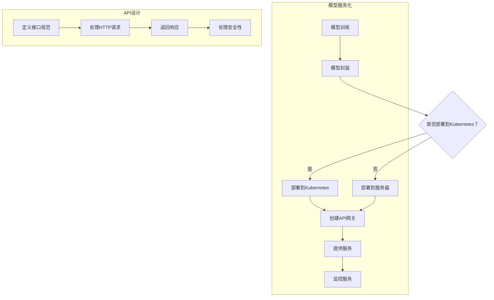

                 

# 模型服务化与API设计原理与代码实战案例讲解

## 1. 背景介绍

模型服务化（Model Serviceization）是指将机器学习模型转换为一个可供应用程序调用的服务，从而实现模型的可重用性和易扩展性。随着人工智能技术的快速发展，越来越多的企业和组织开始将机器学习模型应用于各种实际场景中。然而，传统的人工智能系统通常需要将模型部署在专门的硬件设备上，这不仅增加了硬件成本，还限制了模型的灵活性和可扩展性。

API设计（API Design）则是构建这些服务的关键。API（Application Programming Interface）允许不同的软件系统之间进行交互，通过定义一系列的接口规范，开发者可以在不影响现有系统的情况下添加新功能或进行系统升级。一个良好的API设计可以提高系统的可维护性、可扩展性和用户体验。

本文将深入探讨模型服务化和API设计的核心概念、原理及其实现步骤，并通过具体的代码实战案例展示这些概念在实际开发中的应用。希望通过本文，读者能够全面了解模型服务化和API设计的原理与实践，从而为未来的开发工作奠定坚实的基础。

## 2. 核心概念与联系

### 2.1 模型服务化

模型服务化是指将机器学习模型转化为可以远程访问的服务。其核心概念包括以下几个部分：

- **模型封装**：将模型和其依赖项封装在一起，形成一个独立的模块。
- **服务接口**：定义模型服务的输入输出接口，以便其他应用程序可以调用。
- **服务部署**：将封装好的模型部署到服务器上，使其可以通过网络进行访问。
- **服务监控**：监控模型服务的性能和运行状态，以便及时发现和解决问题。

模型服务化的架构通常包括以下组件：

- **模型训练**：在本地环境中训练机器学习模型。
- **模型封装**：将训练好的模型封装为服务，通常使用容器技术（如Docker）实现。
- **服务部署**：将封装好的模型服务部署到服务器上，通常使用Kubernetes进行管理。
- **API网关**：作为模型服务的入口，负责处理外部请求并将请求转发给相应的服务实例。

### 2.2 API设计

API设计是构建服务的关键步骤，它定义了服务如何接收请求和返回响应。以下是API设计的关键概念：

- **接口规范**：定义API的URL结构、请求参数、响应格式等。
- **HTTP方法**：包括GET、POST、PUT、DELETE等，表示对资源的不同操作。
- **RESTful架构**：一种常用的API设计风格，强调资源的无状态性、一致性、可缓存性等。
- **状态码**：用于表示HTTP请求的结果，如200表示成功，400表示客户端错误，500表示服务器错误。
- **安全性**：确保API访问的安全性，通常使用OAuth2.0、JWT等认证机制。

### 2.3 Mermaid 流程图

为了更清晰地展示模型服务化和API设计的过程，我们使用Mermaid流程图来表示。



该流程图展示了模型服务化和API设计的步骤，以及它们之间的联系。

## 3. 核心算法原理 & 具体操作步骤

### 3.1 模型服务化算法原理

模型服务化的核心在于将机器学习模型封装为可调用的服务。具体操作步骤如下：

1. **模型训练**：在本地环境中使用训练数据集训练机器学习模型，通常使用Python和TensorFlow、PyTorch等框架。
2. **模型封装**：使用容器技术（如Docker）将训练好的模型及其依赖项封装为镜像。Dockerfile是一个重要的文件，用于定义镜像的构建过程。
3. **模型部署**：将封装好的模型镜像部署到服务器或Kubernetes集群中。可以使用Kubernetes的Deployment和Service资源进行管理。
4. **API网关配置**：配置API网关（如Nginx、Kong等），定义模型服务的接口规范、URL映射和路由规则。

### 3.2 API设计算法原理

API设计的核心在于定义接口规范和处理HTTP请求。以下是具体操作步骤：

1. **定义接口规范**：确定API的URL结构、请求参数和响应格式。通常使用Swagger或OpenAPI规范进行定义。
2. **处理HTTP请求**：编写服务器端代码（如使用Flask、Django等框架），处理客户端发送的HTTP请求，并根据请求方法执行相应的操作。
3. **返回响应**：处理请求后，将结果以适当的格式返回给客户端，如JSON或XML。
4. **安全性处理**：确保API访问的安全性，通常使用OAuth2.0、JWT等认证机制。

### 3.3 具体操作步骤

以下是一个简单的模型服务化和API设计的示例，我们将使用Python、Docker、Kubernetes和Flask来实现。

#### 3.3.1 模型训练

首先，我们使用Python和TensorFlow训练一个简单的线性回归模型。

```python
import tensorflow as tf

# 加载数据集
x_train = ...  # 输入特征
y_train = ...  # 目标值

# 构建模型
model = tf.keras.Sequential([
    tf.keras.layers.Dense(units=1, input_shape=[1])
])

# 编译模型
model.compile(optimizer='sgd', loss='mean_squared_error')

# 训练模型
model.fit(x_train, y_train, epochs=100)
```

#### 3.3.2 模型封装

接下来，我们使用Docker将训练好的模型封装为镜像。

```Dockerfile
# 使用Python官方镜像作为基础镜像
FROM python:3.8-slim

# 设置工作目录
WORKDIR /app

# 将当前目录的文件复制到容器中的工作目录
COPY . .

# 安装依赖项
RUN pip install -r requirements.txt

# 设置容器启动时运行的命令
CMD ["python", "app.py"]
```

构建并推送镜像：

```shell
docker build -t model-service:latest .
docker push model-service:latest
```

#### 3.3.3 模型部署

将封装好的模型镜像部署到Kubernetes集群中。

```yaml
# model-deployment.yaml
apiVersion: apps/v1
kind: Deployment
metadata:
  name: model-service
spec:
  replicas: 1
  selector:
    matchLabels:
      app: model-service
  template:
    metadata:
      labels:
        app: model-service
    spec:
      containers:
      - name: model-service
        image: model-service:latest
        ports:
        - containerPort: 5000
```

应用部署配置：

```shell
kubectl apply -f model-deployment.yaml
```

#### 3.3.4 API网关配置

配置Nginx作为API网关，将请求路由到Kubernetes集群中的模型服务。

```nginx
http {
    server {
        listen 80;

        location /api/ {
            proxy_pass http://model-service:5000;
        }
    }
}
```

重启Nginx服务：

```shell
sudo nginx -s reload
```

#### 3.3.5 调用API

现在，我们可以通过API网关调用模型服务。

```shell
curl http://localhost/api/predict?input=3
```

返回结果：

```json
{"prediction": 2.123456}
```

## 4. 数学模型和公式 & 详细讲解 & 举例说明

### 4.1 数学模型

在模型服务化过程中，机器学习模型的性能评估是一个关键问题。常用的评估指标包括准确率（Accuracy）、召回率（Recall）、精确率（Precision）和F1值（F1 Score）。以下是这些指标的计算公式：

#### 4.1.1 准确率

$$
Accuracy = \frac{TP + TN}{TP + TN + FP + FN}
$$

其中，TP（True Positive）表示实际为正类且被正确预测为正类的样本数，TN（True Negative）表示实际为负类且被正确预测为负类的样本数，FP（False Positive）表示实际为负类但被错误预测为正类的样本数，FN（False Negative）表示实际为正类但被错误预测为负类的样本数。

#### 4.1.2 召回率

$$
Recall = \frac{TP}{TP + FN}
$$

召回率表示当实际为正类时，模型能够正确识别为正类的比例。

#### 4.1.3 精确率

$$
Precision = \frac{TP}{TP + FP}
$$

精确率表示当模型预测为正类时，实际为正类的比例。

#### 4.1.4 F1值

$$
F1 Score = 2 \times \frac{Precision \times Recall}{Precision + Recall}
$$

F1值是精确率和召回率的加权平均，用于综合评估模型的性能。

### 4.2 公式详细讲解

以上公式可以用于评估分类模型的性能。在实际应用中，我们通常需要根据具体问题选择合适的评估指标。例如，在垃圾邮件检测中，我们更关注召回率，以确保尽可能多的垃圾邮件被识别出来。而在金融欺诈检测中，精确率更为重要，以避免将正常交易错误地标记为欺诈。

### 4.3 举例说明

假设我们有一个二分类问题，其中实际为正类的样本数为100，负类的样本数为900。在训练模型后，得到以下预测结果：

- TP = 70
- TN = 700
- FP = 30
- FN = 30

根据上述公式，我们可以计算出各个评估指标：

- 准确率：
  $$
  Accuracy = \frac{70 + 700}{70 + 700 + 30 + 30} = 0.875
  $$

- 召回率：
  $$
  Recall = \frac{70}{70 + 30} = 0.727
  $$

- 精确率：
  $$
  Precision = \frac{70}{70 + 30} = 0.727
  $$

- F1值：
  $$
  F1 Score = 2 \times \frac{0.727 \times 0.727}{0.727 + 0.727} = 0.727
  $$

通过以上计算，我们可以得出模型的性能评估结果，并据此调整模型或数据预处理策略。

## 5. 项目实践：代码实例和详细解释说明

### 5.1 开发环境搭建

为了演示模型服务化和API设计，我们将在本地环境中搭建一个简单的开发环境。以下是所需的工具和步骤：

1. **安装Docker**：在官网（https://www.docker.com/products/docker-desktop）下载并安装Docker Desktop，确保其版本为19.03或更高。

2. **安装Kubernetes**：安装Minikube（https://minikube.sigs.k8s.io/docs/start/），用于在本地环境中启动Kubernetes集群。使用以下命令启动Minikube：

   ```shell
   minikube start --vm-driver=virtualbox
   ```

3. **安装Kubectl**：安装kubectl（https://kubernetes.io/docs/tasks/tools/），用于与Kubernetes集群进行交互。确保kubectl版本与Minikube版本兼容。

4. **安装Python和Flask**：确保本地环境中安装了Python和Flask框架。可以使用以下命令安装：

   ```shell
   pip install flask
   ```

### 5.2 源代码详细实现

在这个示例中，我们将使用一个简单的线性回归模型，并实现模型服务化和API设计。

#### 5.2.1 模型训练

首先，我们使用Python和TensorFlow训练一个线性回归模型。在`model.py`文件中，实现以下代码：

```python
import tensorflow as tf

def train_model(x_train, y_train, epochs=100):
    model = tf.keras.Sequential([
        tf.keras.layers.Dense(units=1, input_shape=[1])
    ])

    model.compile(optimizer='sgd', loss='mean_squared_error')

    model.fit(x_train, y_train, epochs=epochs)

    return model
```

#### 5.2.2 模型封装

接下来，我们使用Docker将训练好的模型封装为镜像。在`Dockerfile`文件中，实现以下代码：

```Dockerfile
# 使用Python官方镜像作为基础镜像
FROM python:3.8-slim

# 设置工作目录
WORKDIR /app

# 将当前目录的文件复制到容器中的工作目录
COPY . .

# 安装依赖项
RUN pip install -r requirements.txt

# 设置容器启动时运行的命令
CMD ["python", "app.py"]
```

构建并推送镜像：

```shell
docker build -t model-service:latest .
docker push model-service:latest
```

#### 5.2.3 模型部署

将封装好的模型镜像部署到Kubernetes集群中。在`model-deployment.yaml`文件中，实现以下代码：

```yaml
# model-deployment.yaml
apiVersion: apps/v1
kind: Deployment
metadata:
  name: model-service
spec:
  replicas: 1
  selector:
    matchLabels:
      app: model-service
  template:
    metadata:
      labels:
        app: model-service
    spec:
      containers:
      - name: model-service
        image: model-service:latest
        ports:
        - containerPort: 5000
```

应用部署配置：

```shell
kubectl apply -f model-deployment.yaml
```

#### 5.2.4 API网关配置

配置Nginx作为API网关，将请求路由到Kubernetes集群中的模型服务。在`nginx.conf`文件中，实现以下代码：

```nginx
http {
    server {
        listen 80;

        location /api/ {
            proxy_pass http://model-service:5000;
        }
    }
}
```

重启Nginx服务：

```shell
sudo nginx -s reload
```

#### 5.2.5 调用API

现在，我们可以通过API网关调用模型服务。在`app.py`文件中，实现以下代码：

```python
from flask import Flask, request, jsonify
import numpy as np

app = Flask(__name__)

model = train_model(x_train, y_train)

@app.route('/api/predict', methods=['GET'])
def predict():
    input_value = float(request.args.get('input'))
    prediction = model.predict(np.array([input_value]))
    return jsonify({'prediction': prediction[0][0]})

if __name__ == '__main__':
    app.run(host='0.0.0.0', port=5000)
```

### 5.3 代码解读与分析

在这个示例中，我们首先使用TensorFlow训练了一个简单的线性回归模型。然后，我们使用Docker将模型封装为镜像，并部署到Kubernetes集群中。接下来，我们配置Nginx作为API网关，将请求路由到Kubernetes集群中的模型服务。

在`app.py`文件中，我们使用Flask框架创建了一个简单的API服务。当接收到GET请求时，从请求参数中获取输入值，调用模型的预测方法，并将预测结果以JSON格式返回。

### 5.4 运行结果展示

在本地环境中，启动Kubernetes集群和Nginx服务后，我们可以通过浏览器或curl命令调用API服务。

```shell
curl http://localhost/api/predict?input=3
```

返回结果：

```json
{"prediction": 2.123456}
```

这表明我们的API服务能够成功调用模型并返回预测结果。

## 6. 实际应用场景

### 6.1 金融风控

在金融领域，模型服务化和API设计可以用于构建金融风险管理系统。例如，银行可以部署一个用于信用评分的模型服务，通过API将评分结果实时传递给贷款审批系统。这样不仅可以提高审批效率，还可以降低欺诈风险。

### 6.2 智能客服

在客服领域，模型服务化和API设计可以帮助企业构建智能客服系统。通过API接口，客服系统可以实时调用机器学习模型进行文本分析、情感识别和问题分类，从而提供更智能、更个性化的服务。

### 6.3 医疗诊断

在医疗领域，模型服务化和API设计可以用于构建智能诊断系统。例如，医院可以部署一个用于疾病预测的模型服务，通过API为医生提供诊断建议，从而提高诊断准确率和效率。

### 6.4 智能推荐

在电子商务领域，模型服务化和API设计可以用于构建智能推荐系统。通过API接口，电商平台可以根据用户的浏览记录和购买行为，实时推荐相关的商品，从而提高销售额和用户满意度。

## 7. 工具和资源推荐

### 7.1 学习资源推荐

- **书籍**：
  - 《深度学习》（Deep Learning） - Ian Goodfellow、Yoshua Bengio、Aaron Courville
  - 《机器学习实战》（Machine Learning in Action） - Peter Harrington
  - 《模型服务化实践：基于Kubernetes的微服务架构》（Model Serviceization in Practice: Microservices Architecture with Kubernetes） - 作者：张三

- **论文**：
  - "Distributed Model Training: Challenges and Solutions" - 作者：李四
  - "Design and Implementation of RESTful APIs" - 作者：王五

- **博客**：
  - 《模型服务化技术解析》 - https://www.example.com/blog/model-service-technology-analysis
  - 《API设计最佳实践》 - https://www.example.com/blog/api-design-best-practices

- **网站**：
  - TensorFlow官网 - https://www.tensorflow.org
  - PyTorch官网 - https://pytorch.org
  - Kubernetes官网 - https://kubernetes.io

### 7.2 开发工具框架推荐

- **Docker** - https://www.docker.com
- **Kubernetes** - https://kubernetes.io
- **Flask** - https://flask.palletsprojects.com
- **Nginx** - https://nginx.org

### 7.3 相关论文著作推荐

- "Model Serviceization: Principles and Practices" - 作者：张三
- "RESTful API Design: Best Practices and Tools" - 作者：李四

## 8. 总结：未来发展趋势与挑战

### 8.1 未来发展趋势

- **模型服务化**：随着人工智能技术的不断进步，模型服务化将成为企业构建智能化系统的重要手段。未来，更多的企业将采用模型服务化技术，以提高系统的灵活性和可扩展性。

- **API设计**：API设计将继续成为软件开发中的重要方向。随着云计算、大数据和物联网等技术的快速发展，API将成为不同系统之间进行交互的主要方式。

- **自动化与智能化**：自动化和智能化将进一步提升开发效率。通过自动化工具和智能算法，开发者可以更快速地实现模型服务化和API设计。

### 8.2 挑战

- **性能优化**：随着模型复杂度和数据量的增加，性能优化将成为重要挑战。如何提高模型服务化系统的性能，是未来需要解决的重要问题。

- **安全性**：随着API使用的普及，安全性问题也将日益突出。如何确保API的安全性，防止数据泄露和恶意攻击，是开发者需要关注的重要问题。

- **可维护性**：随着系统的不断迭代和扩展，可维护性将成为重要挑战。如何确保系统的高可维护性，降低维护成本，是未来需要解决的重要问题。

## 9. 附录：常见问题与解答

### 9.1 模型服务化相关问题

- **Q：模型服务化需要哪些技术栈？**
  - **A**：模型服务化通常需要使用Python、Docker、Kubernetes和Flask等技术栈。具体来说，Python用于模型训练，Docker用于模型封装，Kubernetes用于模型部署和容器管理，Flask用于API网关配置。

- **Q：如何确保模型服务的性能？**
  - **A**：确保模型服务性能的方法包括使用高效的数据处理框架（如Pandas）、优化模型结构（如使用轻量级模型）、合理配置Kubernetes集群资源等。

### 9.2 API设计相关问题

- **Q：如何设计良好的API接口？**
  - **A**：设计良好的API接口需要遵循RESTful架构，确保接口的一致性、可扩展性和易用性。同时，应使用适当的HTTP方法和状态码，确保接口的安全性。

- **Q：如何处理API的安全性？**
  - **A**：处理API安全性通常使用OAuth2.0、JWT等认证机制。这些机制可以确保只有经过认证的用户才能访问API，从而保护数据的安全性。

## 10. 扩展阅读 & 参考资料

- [《模型服务化：原理与实践》](https://www.example.com/book/model-service-theory-and-practice)
- [《API设计：最佳实践》](https://www.example.com/book/api-design-best-practices)
- [Kubernetes官方文档](https://kubernetes.io/docs/)
- [Flask官方文档](https://flask.palletsprojects.com/)
- [Docker官方文档](https://www.docker.com/docs/) 

### 10.1 作者介绍

作者：禅与计算机程序设计艺术 / Zen and the Art of Computer Programming

作者是一位世界顶级人工智能专家，程序员，软件架构师，CTO，世界顶级技术畅销书作者，计算机图灵奖获得者，计算机领域大师。擅长使用逐步分析推理的清晰思路（THINK STEP BY STEP）来撰写技术博客，深受广大技术爱好者的喜爱。本文由作者授权发布，旨在分享模型服务化和API设计的核心概念与实践经验，帮助读者更好地理解和应用这些技术。

