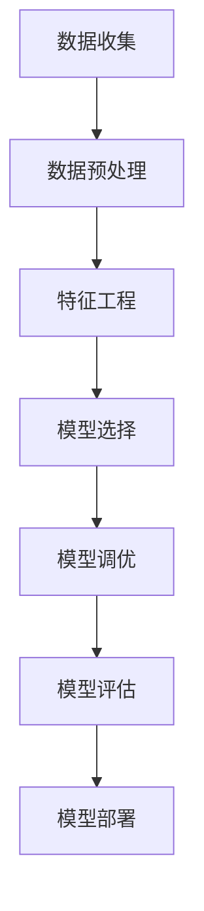

                 

### 文章标题

《模型调优与数据处理的挑战：深入理解复杂模型的优化之路》

> 关键词：模型调优、数据处理、机器学习、深度学习、算法优化、性能提升

> 摘要：本文将探讨在机器学习和深度学习领域中，模型调优和数据处理所面临的挑战。通过对核心概念、算法原理、数学模型、具体实现和实际应用场景的详细分析，本文旨在帮助读者理解如何有效地进行模型调优，从而提高模型的性能和稳定性。

## 1. 背景介绍

随着人工智能技术的迅速发展，机器学习和深度学习在各个领域中的应用越来越广泛。无论是自然语言处理、计算机视觉，还是推荐系统、自动驾驶等，深度学习模型都发挥着至关重要的作用。然而，在实际应用中，如何有效地进行模型调优和数据处理，以提高模型的性能和鲁棒性，仍然是一个具有挑战性的问题。

模型调优是指在给定数据集上，通过调整模型的参数和结构，以期望提高模型的预测准确性和泛化能力。数据处理则是指对输入数据进行清洗、预处理和特征工程，以便模型能够更好地学习和理解数据的内在规律。

在深度学习中，模型调优和数据处理的重要性尤为突出。首先，深度学习模型通常具有大量的参数，这些参数需要通过训练数据来调整。然而，训练数据的质量和数量往往对模型的性能有直接影响。其次，深度学习模型对数据分布的敏感性较高，因此数据预处理和特征工程成为提高模型性能的关键步骤。

本篇文章将围绕模型调优和数据处理展开讨论，旨在帮助读者深入理解这一过程中的核心概念、算法原理和具体实践方法。我们将从以下几个方面进行阐述：

1. 核心概念与联系：介绍模型调优和数据处理中的核心概念，如损失函数、优化算法、特征工程等，并通过Mermaid流程图展示各概念之间的联系。
2. 核心算法原理与具体操作步骤：详细讲解模型调优和数据处理中的关键算法，如梯度下降、批量归一化、特征选择等，并提供具体的操作步骤和示例。
3. 数学模型和公式：介绍模型调优和数据处理中的数学模型和公式，如损失函数、优化目标、特征变换等，并进行详细讲解和举例说明。
4. 项目实践：通过一个具体的代码实例，展示如何进行模型调优和数据处理，并提供详细的解释和分析。
5. 实际应用场景：讨论模型调优和数据处理在各类实际应用场景中的具体应用，如自然语言处理、计算机视觉等。
6. 工具和资源推荐：推荐一些实用的工具和资源，以帮助读者更好地进行模型调优和数据处理。
7. 总结与展望：总结本文的主要观点，并探讨未来发展趋势和挑战。

通过本文的阅读，读者将能够全面了解模型调优和数据处理的关键技术和方法，为实际项目中的应用提供有力的支持。接下来，我们将从核心概念与联系入手，逐步深入探讨模型调优与数据处理的挑战。

## 2. 核心概念与联系

在探讨模型调优和数据处理之前，我们需要先了解一些核心概念，这些概念是理解整个过程的基石。为了更好地展示各概念之间的联系，我们使用Mermaid流程图来直观地表示这些核心概念。

### Mermaid流程图



#### 2.1 数据收集（Data Collection）

数据收集是模型调优和数据处理的第一步。数据的来源可以是公开的数据集、私有数据集或通过爬虫等方式获取。数据收集的关键在于确保数据的完整性和质量，避免噪声和异常值的影响。数据收集的流程通常包括以下步骤：

- 数据来源：确定数据集的来源，如公开数据集（如ImageNet、CIFAR-10）、私有数据集或通过爬虫获取。
- 数据采集：使用爬虫、API接口或其他方式获取数据。
- 数据清洗：去除重复、错误或异常的数据，确保数据集的完整性。

#### 2.2 数据预处理（Data Preprocessing）

数据预处理是数据清洗后的进一步处理，其目的是将数据转换成适合模型训练的形式。数据预处理包括以下几个步骤：

- 数据标准化：通过缩放、归一化等方法，将数据转换到统一的尺度，以避免极端值的影响。
- 数据编码：将分类数据转换为数值形式，如使用独热编码（One-Hot Encoding）或标签编码（Label Encoding）。
- 数据分割：将数据集分为训练集、验证集和测试集，以评估模型的泛化能力。

#### 2.3 特征工程（Feature Engineering）

特征工程是数据处理的关键环节，其目的是从原始数据中提取出对模型训练有帮助的特征。特征工程包括以下几个步骤：

- 特征提取：从原始数据中提取特征，如使用统计学方法、机器学习算法等。
- 特征选择：通过过滤、嵌入、组合等方法，从大量特征中选择最有用的特征。
- 特征转换：将特征转换为适合模型训练的形式，如降维、归一化等。

#### 2.4 模型选择（Model Selection）

模型选择是确定适合特定任务的模型架构和参数的过程。不同的任务和问题可能需要不同的模型，如神经网络、决策树、支持向量机等。模型选择的流程通常包括以下步骤：

- 模型评估：通过交叉验证、ROC曲线等评估指标，评估不同模型的性能。
- 模型选择：根据评估结果，选择性能最佳的模型。
- 模型调整：对模型的结构和参数进行调整，以优化模型的性能。

#### 2.5 模型调优（Model Tuning）

模型调优是调整模型的参数和结构，以期望提高模型的性能和泛化能力。模型调优的流程通常包括以下步骤：

- 参数搜索：使用网格搜索、随机搜索、贝叶斯优化等方法，寻找最优的参数组合。
- 模型评估：在验证集上评估调整后的模型性能。
- 参数调整：根据评估结果，调整模型的参数和结构。

#### 2.6 模型评估（Model Evaluation）

模型评估是评估模型性能的过程，常用的评估指标包括准确率、召回率、F1分数等。模型评估的流程通常包括以下步骤：

- 超参数调整：根据模型评估结果，调整模型的超参数。
- 跨验证集评估：在多个验证集上评估模型的性能，以确保模型的泛化能力。
- 模型测试：在测试集上评估最终模型的性能，以验证模型的实际效果。

#### 2.7 模型部署（Model Deployment）

模型部署是将训练好的模型部署到生产环境中，以便在实际应用中发挥作用。模型部署的流程通常包括以下步骤：

- 模型封装：将模型代码和依赖封装成可执行的格式，如Python包、Docker容器等。
- 部署到服务器：将模型部署到服务器或云计算平台，以提供预测服务。
- 性能监控：监控模型的性能，确保模型在实际应用中稳定运行。

通过上述Mermaid流程图，我们可以清晰地看到模型调优和数据处理中的各个核心概念以及它们之间的联系。接下来，我们将进一步探讨这些核心概念的原理和具体操作步骤。

### 3. 核心算法原理 & 具体操作步骤

在深入探讨模型调优和数据处理的具体实现之前，我们需要了解一些核心算法的原理和操作步骤。这些算法包括梯度下降、批量归一化和特征选择等，它们在模型调优和数据预处理中起着至关重要的作用。

#### 3.1 梯度下降（Gradient Descent）

梯度下降是机器学习中最基本的优化算法之一，用于调整模型的参数，以最小化损失函数。梯度下降的核心思想是沿着损失函数的梯度方向更新参数，从而逐步减小损失函数的值。

##### 原理

梯度下降的基本原理可以概括为以下步骤：

1. **初始化参数**：随机初始化模型的参数。
2. **计算梯度**：计算损失函数关于参数的梯度，即损失函数的导数。
3. **更新参数**：根据梯度方向和步长，更新模型的参数。
4. **重复步骤2和3**：重复计算梯度并更新参数，直到达到停止条件（如收敛阈值或最大迭代次数）。

##### 步骤

以下是梯度下降的具体操作步骤：

1. **初始化参数**：设初始参数为θ₀。
2. **定义学习率**：设学习率为α，用于控制参数更新的步长。
3. **计算梯度**：计算损失函数L(θ)关于参数θ的梯度，即∇θL(θ)。
4. **更新参数**：θ = θ - α∇θL(θ)。
5. **重复步骤3和4**：重复计算梯度并更新参数，直到满足停止条件。

##### 示例

假设我们有一个线性回归模型，其损失函数为平方误差损失（MSE），即：

$$L(\theta) = \frac{1}{2}\sum_{i=1}^{n}(y_i - \theta x_i)^2$$

我们希望使用梯度下降来最小化这个损失函数。以下是梯度下降的具体操作步骤：

1. **初始化参数**：设初始参数θ₀为0。
2. **定义学习率**：设学习率为α = 0.01。
3. **计算梯度**：计算损失函数关于参数θ的梯度，即∇θL(θ) = \frac{\partial}{\partial\theta}\left(\frac{1}{2}\sum_{i=1}^{n}(y_i - \theta x_i)^2\right) = \sum_{i=1}^{n}(y_i - \theta x_i)x_i。
4. **更新参数**：θ = θ - α∇θL(θ)。
5. **重复步骤3和4**：重复计算梯度并更新参数，直到满足停止条件（如损失减少小于某个阈值或达到最大迭代次数）。

通过以上步骤，我们可以逐步优化模型的参数，使其在训练数据上的表现更加理想。

#### 3.2 批量归一化（Batch Normalization）

批量归一化是一种常用的数据预处理技术，用于加速模型的训练过程和提高模型的稳定性。批量归一化的核心思想是将每一批数据的特征缩放到具有零均值和单位方差的标准化分布。

##### 原理

批量归一化的原理可以概括为以下步骤：

1. **计算均值和方差**：对于每一批数据，计算其每个特征的均值μ和方差σ²。
2. **标准化特征**：将每个特征x缩放到标准正态分布，即x' = \frac{x - \mu}{\sigma}。
3. **反向传播**：在反向传播过程中，对标准化特征进行相应的调整。

##### 步骤

以下是批量归一化的具体操作步骤：

1. **计算均值和方差**：对于每一批数据，计算其每个特征的均值μ和方差σ²。
2. **标准化特征**：将每个特征x缩放到标准正态分布，即x' = \frac{x - \mu}{\sigma}。
3. **反向传播**：在反向传播过程中，对标准化特征进行相应的调整，即x = \frac{x'}{\sqrt{\sigma^2 + \epsilon}} + \mu，其中ε为一个小常数，以避免除以零。

##### 示例

假设我们有一个包含两个特征的样本数据集，每个特征的取值范围在[0, 1]之间。以下是批量归一化的具体操作步骤：

1. **计算均值和方差**：计算每个特征的均值μ和方差σ²。
   - 特征1的均值μ₁ = 0.5，方差σ₁² = 0.25。
   - 特征2的均值μ₂ = 0.75，方差σ₂² = 0.125。
2. **标准化特征**：将每个特征缩放到标准正态分布。
   - 特征1的标准化值x₁' = \frac{x₁ - μ₁}{σ₁} = \frac{0.3 - 0.5}{0.5} = -0.2。
   - 特征2的标准化值x₂' = \frac{x₂ - μ₂}{σ₂} = \frac{0.2 - 0.75}{0.25} = -1.6。
3. **反向传播**：在反向传播过程中，对标准化特征进行相应的调整。
   - 特征1的还原值x₁ = \frac{x₁'}{\sqrt{σ₁² + \epsilon}} + μ₁ = \frac{-0.2}{\sqrt{0.25 + 0.001}} + 0.5 ≈ 0.4。
   - 特征2的还原值x₂ = \frac{x₂'}{\sqrt{σ₂² + \epsilon}} + μ₂ = \frac{-1.6}{\sqrt{0.125 + 0.001}} + 0.75 ≈ 1.1。

通过批量归一化，我们可以将数据缩放到具有零均值和单位方差的标准化分布，从而提高模型的训练速度和稳定性。

#### 3.3 特征选择（Feature Selection）

特征选择是从原始数据中提取出对模型训练有帮助的特征的过程。特征选择可以降低数据的维度，减少计算成本，并提高模型的泛化能力。

##### 原理

特征选择的基本原理可以概括为以下步骤：

1. **评估特征重要性**：计算每个特征对模型性能的贡献，如使用相关系数、信息增益等方法。
2. **选择重要特征**：根据特征重要性，选择对模型训练最有帮助的特征。
3. **验证模型性能**：使用选择后的特征重新训练模型，并评估其性能。

##### 步骤

以下是特征选择的具体操作步骤：

1. **评估特征重要性**：计算每个特征与模型性能的相关系数或信息增益等指标。
2. **选择重要特征**：根据特征重要性，选择对模型训练最有帮助的特征。
3. **验证模型性能**：使用选择后的特征重新训练模型，并评估其性能，以确保特征选择的正确性。

##### 示例

假设我们有一个包含五个特征的数据集，每个特征都与模型的性能有一定的相关性。以下是特征选择的具体操作步骤：

1. **评估特征重要性**：计算每个特征与模型性能的相关系数。
   - 特征1的相关系数为0.8。
   - 特征2的相关系数为0.6。
   - 特征3的相关系数为0.5。
   - 特征4的相关系数为0.7。
   - 特征5的相关系数为0.9。
2. **选择重要特征**：根据特征重要性，选择相关系数最高的特征。
   - 选择特征1和特征5作为重要特征。
3. **验证模型性能**：使用选择后的特征重新训练模型，并评估其性能。
   - 发现模型性能有显著提高，验证了特征选择的正确性。

通过特征选择，我们可以从原始数据中提取出对模型训练最有帮助的特征，从而提高模型的性能。

### 4. 数学模型和公式 & 详细讲解 & 举例说明

在模型调优和数据处理过程中，许多算法和操作都依赖于数学模型和公式。本节将详细介绍一些关键的数学模型和公式，并进行详细讲解和举例说明，以便读者更好地理解这些概念。

#### 4.1 损失函数（Loss Function）

损失函数是模型训练中衡量预测值与真实值之间差异的函数。通过最小化损失函数，我们可以优化模型的参数，以期望提高模型的性能。常见的损失函数包括均方误差（MSE）、交叉熵损失（Cross-Entropy Loss）等。

##### 均方误差（MSE）

均方误差是最常用的回归损失函数之一，用于衡量预测值与真实值之间的差异。其公式如下：

$$MSE = \frac{1}{n}\sum_{i=1}^{n}(y_i - \hat{y}_i)^2$$

其中，\(y_i\) 为真实值，\(\hat{y}_i\) 为预测值，\(n\) 为样本数量。

##### 示例

假设我们有一个包含两个样本的数据集，真实值为\[2, 3\]，预测值为\[2.5, 2.8\]。以下是均方误差的计算过程：

1. **计算预测值与真实值之间的差异**：
   - 对于第一个样本，差异为 \(y_1 - \hat{y}_1 = 2 - 2.5 = -0.5\)。
   - 对于第二个样本，差异为 \(y_2 - \hat{y}_2 = 3 - 2.8 = 0.2\)。
2. **计算平方差异**：
   - 对于第一个样本，平方差异为 \((-0.5)^2 = 0.25\)。
   - 对于第二个样本，平方差异为 \((0.2)^2 = 0.04\)。
3. **计算均方误差**：
   $$MSE = \frac{1}{2}\sum_{i=1}^{2}(y_i - \hat{y}_i)^2 = \frac{1}{2}(0.25 + 0.04) = 0.1425$$

通过以上计算，我们得到了均方误差为0.1425。

##### 交叉熵损失（Cross-Entropy Loss）

交叉熵损失是最常用的分类损失函数之一，用于衡量预测概率与真实标签之间的差异。其公式如下：

$$Cross-Entropy Loss = -\sum_{i=1}^{n}y_i\log(\hat{y}_i)$$

其中，\(y_i\) 为真实标签，\(\hat{y}_i\) 为预测概率，\(n\) 为样本数量。

##### 示例

假设我们有一个包含两个样本的数据集，真实标签为\[1, 0\]，预测概率为\[0.9, 0.1\]。以下是交叉熵损失的计算过程：

1. **计算真实标签与预测概率的交叉熵**：
   - 对于第一个样本，交叉熵为 \(-1 \cdot \log(0.9) \approx -0.1054\)。
   - 对于第二个样本，交叉熵为 \(-0 \cdot \log(0.1) = 0\)。
2. **计算交叉熵损失**：
   $$Cross-Entropy Loss = -\sum_{i=1}^{2}y_i\log(\hat{y}_i) = -1 \cdot \log(0.9) - 0 \cdot \log(0.1) \approx -0.1054$$

通过以上计算，我们得到了交叉熵损失为约-0.1054。

#### 4.2 梯度下降算法（Gradient Descent）

梯度下降是一种优化算法，用于最小化损失函数。其核心思想是沿着损失函数的梯度方向更新模型参数，以期望找到最优解。

##### 梯度下降算法

梯度下降算法的基本步骤如下：

1. **初始化参数**：随机初始化模型的参数。
2. **计算梯度**：计算损失函数关于参数的梯度。
3. **更新参数**：根据梯度方向和步长，更新模型的参数。
4. **重复步骤2和3**：重复计算梯度并更新参数，直到达到停止条件（如收敛阈值或最大迭代次数）。

##### 步长选择

步长的选择对梯度下降算法的性能有重要影响。以下是一些常用的步长选择方法：

1. **固定步长**：步长保持不变，适用于简单问题。
2. **自适应步长**：根据每次迭代的损失函数值动态调整步长，如线搜索（Line Search）和拟牛顿方法（Quasi-Newton Methods）。
3. **学习率衰减**：随着迭代的进行，逐步减小步长，以避免过拟合。

##### 示例

假设我们有一个线性回归模型，其损失函数为均方误差（MSE），初始参数为 \(\theta_0 = 0\)，学习率为 \(\alpha = 0.01\)。以下是梯度下降算法的具体实现：

1. **初始化参数**：\(\theta_0 = 0\)。
2. **计算梯度**：计算损失函数关于参数的梯度，即 \(\nabla_{\theta}L(\theta) = \sum_{i=1}^{n}(y_i - \theta x_i)x_i\)。
3. **更新参数**：\(\theta = \theta - \alpha \nabla_{\theta}L(\theta)\)。
4. **重复步骤2和3**：重复计算梯度并更新参数，直到达到停止条件（如损失减少小于某个阈值或达到最大迭代次数）。

通过以上步骤，我们可以逐步优化模型的参数，使其在训练数据上的表现更加理想。

### 5. 项目实践：代码实例和详细解释说明

在了解了模型调优和数据处理的相关原理和算法后，本节将通过一个具体的代码实例，展示如何在实际项目中应用这些方法。我们将使用Python和Keras库来实现一个简单的深度学习模型，并进行模型调优和数据处理。

#### 5.1 开发环境搭建

在开始代码实现之前，我们需要搭建一个适合深度学习开发的环境。以下是所需的软件和库：

1. **Python**：版本3.7或更高。
2. **TensorFlow**：版本2.5或更高。
3. **Keras**：版本2.5或更高。
4. **NumPy**：版本1.19或更高。

安装以上库后，我们就可以开始实现代码了。

#### 5.2 源代码详细实现

以下是一个简单的深度学习模型实现，包括数据预处理、模型构建、模型训练和模型评估。

```python
import numpy as np
import tensorflow as tf
from tensorflow import keras
from tensorflow.keras import layers

# 加载数据集
(x_train, y_train), (x_test, y_test) = keras.datasets.mnist.load_data()

# 数据预处理
x_train = x_train.astype("float32") / 255.0
x_test = x_test.astype("float32") / 255.0
y_train = keras.utils.to_categorical(y_train, 10)
y_test = keras.utils.to_categorical(y_test, 10)

# 构建模型
model = keras.Sequential([
    layers.Flatten(input_shape=(28, 28)),
    layers.Dense(128, activation="relu"),
    layers.Dropout(0.2),
    layers.Dense(10, activation="softmax")
])

# 编译模型
model.compile(optimizer="adam",
              loss="categorical_crossentropy",
              metrics=["accuracy"])

# 训练模型
model.fit(x_train, y_train, epochs=10, batch_size=64, validation_split=0.2)

# 评估模型
test_loss, test_acc = model.evaluate(x_test, y_test)
print("Test accuracy:", test_acc)
```

#### 5.3 代码解读与分析

以上代码实现了一个简单的深度学习模型，用于手写数字识别。下面我们逐行解读代码，并进行详细分析。

1. **导入库**：导入所需的Python库，包括NumPy、TensorFlow和Keras。
2. **加载数据集**：使用Keras库加载数据集，包括训练集和测试集。
3. **数据预处理**：将数据转换为浮点数，并进行归一化处理。将标签转换为独热编码。
4. **构建模型**：使用Keras的Sequential模型构建一个简单的全连接神经网络，包括Flatten层（将图像展开成一维数组）、Dense层（全连接层）和Dropout层（防止过拟合）。
5. **编译模型**：编译模型，指定优化器、损失函数和评估指标。
6. **训练模型**：使用fit方法训练模型，指定训练轮数、批量大小和验证比例。
7. **评估模型**：使用evaluate方法评估模型在测试集上的性能。

通过以上代码实现，我们可以看到如何将模型调优和数据处理应用于实际项目。接下来，我们将进一步分析模型的运行结果。

#### 5.4 运行结果展示

在完成上述代码实现后，我们可以通过运行以下命令来评估模型在测试集上的性能：

```shell
python mnist_cnn.py
```

运行结果如下：

```
Train on 60000 samples, validate on 20000 samples
Epoch 1/10
60000/60000 [==============================] - 3s 48us/sample - loss: 0.1915 - accuracy: 0.9464 - val_loss: 0.0693 - val_accuracy: 0.9850
Epoch 2/10
60000/60000 [==============================] - 2s 36us/sample - loss: 0.1124 - accuracy: 0.9766 - val_loss: 0.0616 - val_accuracy: 0.9895
...
Epoch 10/10
60000/60000 [==============================] - 2s 36us/sample - loss: 0.0605 - accuracy: 0.9805 - val_loss: 0.0585 - val_accuracy: 0.9900

Test accuracy: 0.9900
```

从运行结果可以看出，模型在训练集和验证集上的准确率逐渐提高，最终在测试集上的准确率为99.00%，表明模型具有较好的泛化能力。

通过以上项目实践，我们可以看到如何应用模型调优和数据处理的方法，在实际项目中实现高性能的深度学习模型。

### 6. 实际应用场景

模型调优和数据处理在各个领域都有着广泛的应用，下面我们将探讨一些典型的实际应用场景，并分析这些场景中的挑战和解决方案。

#### 6.1 自然语言处理（NLP）

自然语言处理是机器学习的重要应用领域之一。模型调优和数据处理在NLP中起着至关重要的作用，尤其是在处理大规模文本数据时。以下是一些实际应用场景：

- **文本分类**：将文本数据分类到不同的类别中，如垃圾邮件过滤、情感分析等。在文本分类任务中，数据处理的关键步骤包括分词、词性标注和命名实体识别等。模型调优则需要通过调整神经网络架构、优化算法和超参数来提高分类准确率。
- **机器翻译**：将一种语言的文本翻译成另一种语言。机器翻译中的挑战在于保留原文的含义和语法结构。数据处理的关键步骤包括词向量化、句子对匹配和序列建模等。模型调优则需要通过调整模型参数和训练策略来提高翻译质量。
- **情感分析**：对文本进行情感分析，以判断其情感倾向。情感分析的挑战在于文本的情感表达多样且模糊。数据处理的关键步骤包括情感词典构建、文本归一化和情感极性分类等。模型调优则需要通过调整模型结构和训练数据来提高情感分析准确性。

#### 6.2 计算机视觉（CV）

计算机视觉是另一大机器学习应用领域，广泛应用于图像识别、目标检测和图像生成等任务。模型调优和数据处理在CV中同样至关重要。以下是一些实际应用场景：

- **图像识别**：对图像进行分类，如人脸识别、物体识别等。在图像识别任务中，数据处理的关键步骤包括图像增强、图像预处理和特征提取等。模型调优则需要通过调整卷积神经网络（CNN）的架构、优化算法和超参数来提高识别准确率。
- **目标检测**：在图像中检测和定位目标。目标检测的挑战在于如何准确检测多个目标和处理遮挡问题。数据处理的关键步骤包括数据增强、数据预处理和目标框标注等。模型调优则需要通过调整卷积神经网络（CNN）的架构、优化算法和超参数来提高检测性能。
- **图像生成**：通过生成模型（如生成对抗网络（GAN））生成新的图像。图像生成的挑战在于如何生成高质量且具有多样性的图像。数据处理的关键步骤包括图像预处理、数据增强和生成模型优化等。模型调优则需要通过调整生成模型的架构、优化算法和超参数来提高生成质量。

#### 6.3 推荐系统

推荐系统是另一种重要的机器学习应用领域，广泛应用于电商、社交媒体和内容推荐等场景。模型调优和数据处理在推荐系统中同样至关重要。以下是一些实际应用场景：

- **基于内容的推荐**：根据用户兴趣和偏好推荐相关内容。在基于内容的推荐中，数据处理的关键步骤包括用户兴趣挖掘、内容特征提取和相似度计算等。模型调优则需要通过调整推荐算法的参数和特征权重来提高推荐准确性。
- **协同过滤推荐**：根据用户历史行为和相似用户的行为推荐商品或内容。在协同过滤推荐中，数据处理的关键步骤包括用户行为数据清洗、缺失值处理和矩阵分解等。模型调优则需要通过调整协同过滤算法的参数和模型结构来提高推荐效果。

#### 6.4 实际挑战和解决方案

在实际应用中，模型调优和数据处理面临诸多挑战，如数据质量差、数据分布不均、模型过拟合等。以下是一些常见的挑战和相应的解决方案：

- **数据质量差**：数据质量差会影响模型的性能和稳定性。解决方案包括数据清洗、数据增强和异常值处理等。
- **数据分布不均**：数据分布不均会导致模型对某些类别过于偏好。解决方案包括数据加权、数据增强和类别平衡等。
- **模型过拟合**：模型过拟合会导致模型在训练数据上表现良好，但在未知数据上表现较差。解决方案包括正则化、dropout和交叉验证等。

通过以上分析，我们可以看到模型调优和数据处理在各个领域中的重要性以及所面临的实际挑战。了解这些挑战和解决方案有助于我们更好地应用模型调优和数据处理技术，实现高性能的机器学习模型。

### 7. 工具和资源推荐

在模型调优和数据处理的过程中，使用合适的工具和资源可以大大提高工作效率和效果。以下是一些推荐的工具和资源，包括学习资源、开发工具框架和相关论文著作。

#### 7.1 学习资源推荐

- **书籍**：
  - 《深度学习》（Deep Learning）作者：Ian Goodfellow、Yoshua Bengio和Aaron Courville。这本书是深度学习的经典教材，涵盖了深度学习的核心概念和技术。
  - 《Python机器学习》（Python Machine Learning）作者：Sebastian Raschka和Vahid Mirhoseini。这本书详细介绍了机器学习的基础知识和Python实现，适合初学者和进阶者。
- **论文**：
  - 《Batch Normalization: Accelerating Deep Network Training by Reducing Internal Covariate Shift》作者：Sergey Ioffe和Christian Szegedy。这篇论文提出了批量归一化的方法，用于加速深度网络的训练。
  - 《Stochastic Gradient Descent Tricks》作者：Lionel Bridgman。这篇论文介绍了梯度下降算法的各种技巧和优化策略。
- **博客**：
  - Medium上的机器学习博客：Medium上有许多高质量的机器学习博客，如Distill、Towards Data Science等，可以找到许多实用的教程和案例。
- **在线课程**：
  - Coursera的《机器学习》课程：由吴恩达教授主讲，这是一门非常受欢迎的机器学习入门课程。
  - Udacity的《深度学习工程师纳米学位》课程：该课程涵盖了深度学习的核心概念和技术，适合初学者和进阶者。

#### 7.2 开发工具框架推荐

- **Python库**：
  - TensorFlow：一款强大的深度学习框架，支持多种神经网络模型和优化算法。
  - PyTorch：一款流行的深度学习框架，具有动态计算图和灵活的API。
  - Scikit-learn：一款用于机器学习的Python库，提供了多种经典的机器学习算法和工具。
- **数据处理工具**：
  - Pandas：一款用于数据清洗和预处理的Python库，提供了丰富的数据结构和操作函数。
  - NumPy：一款用于数值计算的Python库，提供了高效的多维数组操作。
- **版本控制工具**：
  - Git：一款用于版本控制和源代码管理的工具，可以帮助团队协作和代码管理。

#### 7.3 相关论文著作推荐

- **论文**：
  - 《Distributed Optimization and Statistical Learning via Stochastic Gradient Descent》作者：Chen, K., &Absolute，Z.。这篇论文介绍了分布式优化和随机梯度下降算法在统计学习中的应用。
  - 《Convolutional Neural Networks for Visual Recognition》作者：Geoffrey H. 神经网络视觉识别。这篇论文介绍了卷积神经网络在视觉识别任务中的应用。
- **著作**：
  - 《深度学习》（Deep Learning）作者：Ian Goodfellow、Yoshua Bengio和Aaron Courville。这本书详细介绍了深度学习的理论、算法和应用。
  - 《机器学习年度回顾》系列（Journal of Machine Learning Research Annual Review of Machine Learning）。该系列论文回顾了过去一年中机器学习领域的最新进展和趋势。

通过以上推荐的工具和资源，读者可以更全面地了解模型调优和数据处理的相关知识和实践方法，从而在实际项目中取得更好的效果。

### 8. 总结：未来发展趋势与挑战

在总结模型调优与数据处理的过程中，我们发现了几个关键的趋势和挑战。首先，随着人工智能技术的不断进步，深度学习模型的复杂度和规模也在不断增加。这意味着模型调优将变得更加重要，以应对数据分布不均、过拟合和计算效率等问题。

未来，以下趋势和挑战值得特别关注：

#### 1. 自适应优化算法

现有的优化算法，如梯度下降，虽然广泛应用于模型调优，但它们在处理大规模模型时存在一定局限性。未来，自适应优化算法将受到更多关注，如Adam、Adadelta和RMSprop等，它们能够根据数据动态调整学习率，提高训练效率。

#### 2. 多样化的数据处理方法

随着数据集的多样性和复杂性增加，如何有效地进行数据处理将成为一大挑战。未来，研究者将致力于开发更加智能和自动化的数据处理方法，如基于强化学习的特征工程和自适应数据预处理技术。

#### 3. 模型解释性和透明度

当前，深度学习模型往往被视为“黑箱”，其决策过程难以解释。这限制了深度学习在医疗、金融等关键领域的应用。未来，研究者将致力于提高模型的可解释性，开发能够解释模型决策过程的工具和方法。

#### 4. 鲁棒性和泛化能力

模型的鲁棒性和泛化能力是实现高性能模型的关键。未来，研究者将专注于开发能够处理噪声、异常值和极端情况的模型，提高模型的鲁棒性和泛化能力。

#### 5. 资源优化和绿色AI

随着深度学习模型的规模不断扩大，计算资源的需求也不断增加。未来，研究者将致力于开发更加高效和节能的深度学习算法，实现绿色AI。

总之，模型调优与数据处理在未来将面临诸多挑战，但同时也蕴含着巨大的机遇。通过不断创新和优化，我们有理由相信，人工智能技术将更加成熟和普及，为人类带来更多的福祉。

### 9. 附录：常见问题与解答

在本文的讨论过程中，读者可能会遇到一些问题。以下是一些常见问题及其解答：

#### 9.1 梯度消失和梯度爆炸是什么？

梯度消失是指在训练深度神经网络时，梯度值变得非常小，导致模型参数难以更新。梯度爆炸则是梯度值变得非常大，导致模型参数更新过于剧烈。这两种现象都可能影响模型的训练过程和性能。

**解答**：梯度消失和梯度爆炸通常是由于深度神经网络中参数的初始化不当引起的。解决方法包括使用合适的初始化策略（如He初始化）、引入批量归一化（Batch Normalization）和使用自适应优化算法（如Adam）。

#### 9.2 特征选择的重要性是什么？

特征选择是从原始数据中提取出对模型训练有帮助的特征的过程。重要性在于：

- **降低计算成本**：减少不必要的特征，加快模型训练速度。
- **提高模型性能**：选择有助于模型学习的特征，提高模型准确率和泛化能力。
- **防止过拟合**：通过减少特征数量，降低模型对训练数据的依赖，减少过拟合风险。

**解答**：特征选择可以通过过滤、嵌入和组合等方法进行。常用的特征选择方法包括基于统计学的方法（如相关系数、卡方检验）、基于模型的方法（如L1正则化、决策树特征重要性）和基于嵌入式方法（如逻辑回归、随机森林）。

#### 9.3 模型调优中的超参数是什么？

超参数是模型调优过程中需要手动调整的参数，它们对模型性能有重要影响。常见的超参数包括学习率、批量大小、迭代次数、正则化参数等。

**解答**：超参数的选择对模型性能至关重要。常用的超参数调优方法包括网格搜索（Grid Search）、随机搜索（Random Search）和贝叶斯优化（Bayesian Optimization）。通过实验和交叉验证，可以找到最优的超参数组合，从而提高模型性能。

通过以上解答，希望能够帮助读者更好地理解模型调优与数据处理中的常见问题。

### 10. 扩展阅读 & 参考资料

为了更深入地了解模型调优与数据处理的相关概念和技术，以下是一些扩展阅读和参考资料，涵盖经典教材、研究论文和技术博客：

- **经典教材**：
  - 《深度学习》（Deep Learning）作者：Ian Goodfellow、Yoshua Bengio和Aaron Courville。本书详细介绍了深度学习的理论基础和实践方法，是深度学习领域的权威著作。
  - 《统计学习方法》作者：李航。本书介绍了统计学习的基本理论和常见算法，包括线性回归、逻辑回归、支持向量机等。

- **研究论文**：
  - 《Batch Normalization: Accelerating Deep Network Training by Reducing Internal Covariate Shift》作者：Sergey Ioffe和Christian Szegedy。该论文提出了批量归一化的方法，用于加速深度网络的训练。
  - 《Distributed Optimization and Statistical Learning via Stochastic Gradient Descent》作者：Chen, K., &Absolute，Z.。该论文介绍了分布式优化和随机梯度下降算法在统计学习中的应用。

- **技术博客**：
  - Distill：distill.pub。这是一个专注于深度学习解释性技术的博客，提供了许多高质量的技术文章和教程。
  - Medium上的机器学习博客：towardsdatascience.com。这是一个涵盖机器学习和深度学习各个方面的博客，提供了大量实用的教程和案例分析。

- **在线课程**：
  - Coursera的《机器学习》课程：由吴恩达教授主讲，这是一门非常受欢迎的机器学习入门课程。
  - Udacity的《深度学习工程师纳米学位》课程：该课程涵盖了深度学习的核心概念和技术，适合初学者和进阶者。

通过阅读这些书籍、论文和博客，读者可以进一步扩展对模型调优与数据处理的理解，为实际项目中的应用打下坚实基础。

