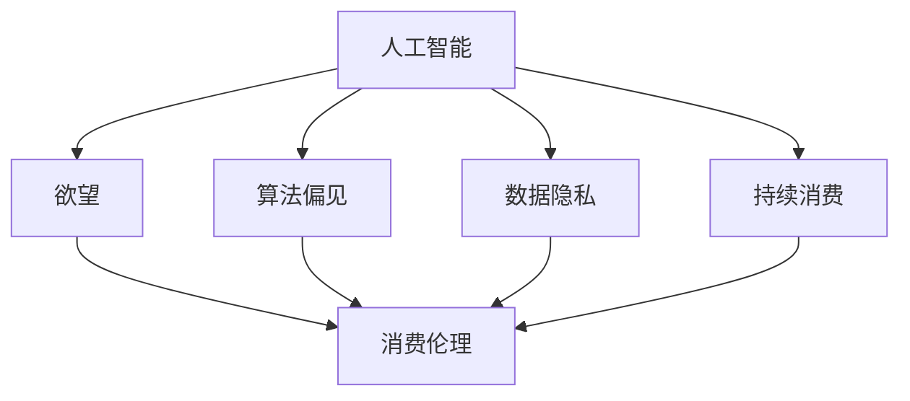

                 

### 背景介绍

在当今数字化和智能化的浪潮下，人工智能（AI）正逐渐渗透到我们生活的方方面面。从智能手机的语音助手，到自动驾驶汽车，再到智能家居和电子商务，AI已经成为了现代社会不可或缺的一部分。然而，随着AI技术的不断进步和广泛应用，我们不得不面对一个日益显著的问题：欲望的持续化。

欲望，是人类行为和决策的驱动力。在传统时代，人们的欲望主要通过物质消费来满足，如购买商品、享受服务。然而，在AI时代，欲望的满足方式发生了根本性的变化。AI不仅能够更精准地预测和满足用户的消费需求，还能够通过数据分析和个性化推荐，不断激发和放大用户的欲望，从而形成一种持续的、深层次的消费行为。

这种欲望的持续化，一方面带来了消费市场的繁荣，推动了经济增长。另一方面，它也引发了一系列伦理和社会问题。例如，过度消费导致资源浪费和环境破坏，隐私泄露引发用户担忧，算法偏见可能导致社会不公平。因此，探讨AI时代消费伦理的问题，不仅具有重要的理论意义，更具有紧迫的现实意义。

本文将从以下几个方面展开讨论：

1. **核心概念与联系**：介绍AI时代消费伦理的核心概念，并使用Mermaid流程图展示其关联性。
2. **核心算法原理 & 具体操作步骤**：分析AI如何通过算法实现欲望的持续化。
3. **数学模型和公式 & 详细讲解 & 举例说明**：探讨AI消费模型中的数学原理，并通过实例说明其应用。
4. **项目实践：代码实例和详细解释说明**：提供一个具体的AI消费项目实例，详细解释其实现过程。
5. **实际应用场景**：分析AI消费伦理在不同领域的应用。
6. **工具和资源推荐**：推荐相关学习和开发资源。
7. **总结：未来发展趋势与挑战**：总结本文的主要观点，并探讨未来的发展趋势和挑战。

希望通过本文的讨论，能够引发读者对AI时代消费伦理的深入思考，为构建一个更加公平、可持续的消费社会提供有益的参考。

## 1. 核心概念与联系

在探讨AI时代的消费伦理时，我们需要明确几个核心概念，并理解它们之间的关联性。以下是本文将涉及的主要核心概念：

### 1.1 人工智能（AI）

人工智能是指通过计算机程序和算法模拟人类智能行为的科学和工程领域。AI技术包括机器学习、深度学习、自然语言处理、计算机视觉等，它们在各个行业和领域都有广泛的应用。

### 1.2 欲望

欲望是人类追求快乐和避免痛苦的内在驱动力。在经济学中，欲望通常被看作是消费行为的动机。在AI时代，欲望的满足不再仅仅依赖于物质产品，而更多地依赖于数据、算法和个性化服务。

### 1.3 消费伦理

消费伦理是指消费者在购买、使用和处置商品或服务时所应遵循的道德原则和规范。它涉及到消费者权益保护、公平交易、环境保护、社会责任等多个方面。

### 1.4 算法偏见

算法偏见是指算法在处理数据时，由于数据本身的不公平或偏见，导致算法输出结果产生系统性偏差。算法偏见在AI消费中可能引发消费者歧视、不公平定价等问题。

### 1.5 数据隐私

数据隐私是指个人信息的保密性、完整性和可用性。在AI消费中，用户的消费行为和偏好数据通常被收集和分析，数据隐私保护成为重要的伦理问题。

### 1.6 持续消费

持续消费是指消费者在满足基本需求之后，由于AI技术的推荐和刺激，不断产生新的消费需求，从而形成一种长期的、循环的消费行为。

这些核心概念之间的联系可以用Mermaid流程图来表示：



在这个流程图中，人工智能作为核心驱动力，直接影响欲望、消费伦理、算法偏见、数据隐私和持续消费。欲望和持续消费是消费伦理的基础，而算法偏见和数据隐私则是在AI时代消费伦理中需要特别关注的问题。

通过上述核心概念和流程图的介绍，我们可以更加清晰地理解AI时代消费伦理的复杂性。在接下来的章节中，我们将进一步探讨这些概念的具体应用和影响。

### 2. 核心算法原理 & 具体操作步骤

在AI时代，算法是驱动欲望持续化的关键因素。通过分析用户行为数据，AI算法能够精准预测用户的消费需求，并不断优化推荐策略，从而实现欲望的持续化。以下是AI算法在消费伦理中的核心原理和具体操作步骤：

#### 2.1 用户行为数据分析

用户行为数据分析是AI算法的基础。通过收集和分析用户在互联网上的浏览记录、购买历史、社交媒体互动等数据，AI算法能够构建出用户的个性化行为模型。这些模型帮助算法理解用户的偏好、需求和欲望。

具体步骤如下：

1. **数据收集**：利用各种传感器、日志文件、应用程序接口（API）等手段，收集用户的在线行为数据。
2. **数据预处理**：对收集到的数据进行清洗、去重、标准化等处理，使其适合进行机器学习模型训练。
3. **特征提取**：从预处理后的数据中提取出与用户行为相关的特征，如购买频率、浏览时长、互动类型等。

#### 2.2 机器学习模型训练

基于用户行为数据，AI算法使用机器学习模型进行训练，以建立用户行为和消费需求之间的关系。常见的机器学习模型包括线性回归、决策树、随机森林、支持向量机等。

具体步骤如下：

1. **数据划分**：将收集到的数据划分为训练集和测试集，通常使用80%的数据作为训练集，20%的数据作为测试集。
2. **模型选择**：根据问题的复杂性和数据特征，选择合适的机器学习模型。
3. **模型训练**：使用训练集数据对模型进行训练，调整模型参数以优化性能。
4. **模型评估**：使用测试集数据评估模型的性能，选择最优模型进行后续应用。

#### 2.3 个性化推荐策略

基于训练好的模型，AI算法可以生成个性化的推荐策略，向用户推荐他们可能感兴趣的商品或服务。推荐策略通常包括以下步骤：

1. **用户兴趣识别**：根据用户的历史行为和模型预测，识别用户的兴趣点。
2. **推荐列表生成**：利用协同过滤、基于内容的推荐等技术，生成包含用户可能感兴趣的商品或服务的推荐列表。
3. **推荐结果优化**：通过算法优化和用户反馈，不断调整和优化推荐结果，以提高推荐的相关性和满意度。

#### 2.4 用户反馈与持续学习

用户的反馈是AI算法持续优化的关键。通过分析用户的反馈数据，AI算法可以不断调整和改进推荐策略，实现欲望的持续化。

具体步骤如下：

1. **用户反馈收集**：收集用户对推荐结果的满意度、点击率、购买行为等反馈数据。
2. **反馈分析**：使用统计分析和机器学习技术，分析用户反馈，识别用户的偏好和需求变化。
3. **模型更新**：根据用户反馈，对机器学习模型进行重新训练和调整，以更好地满足用户需求。

#### 2.5 算法偏见识别与避免

算法偏见在AI消费中可能导致不公平和歧视。为了确保AI算法的公平性和透明性，需要采取以下措施：

1. **偏见识别**：使用统计学和机器学习技术，识别算法中的偏见，如性别、年龄、收入等方面的歧视。
2. **偏见修正**：通过调整算法参数和数据预处理策略，修正算法中的偏见。
3. **公平性评估**：定期对算法进行公平性评估，确保算法在各个群体中的表现一致。

通过上述核心算法原理和具体操作步骤，AI可以实现欲望的持续化，推动消费市场的繁荣。然而，我们也需要关注算法偏见、数据隐私等伦理问题，确保AI技术在消费中的应用符合道德和社会规范。在接下来的章节中，我们将进一步探讨AI消费伦理中的数学模型和公式，以更深入地理解其运作原理。

### 3. 数学模型和公式 & 详细讲解 & 举例说明

在AI消费伦理中，数学模型和公式起着至关重要的作用，它们不仅帮助算法理解用户行为，还能优化推荐策略，实现欲望的持续化。以下将介绍几个关键的数学模型和公式，并详细讲解其应用和操作步骤。

#### 3.1 线性回归模型

线性回归模型是机器学习中的一种基本模型，用于预测用户的行为和需求。其数学公式如下：

\[ y = \beta_0 + \beta_1x_1 + \beta_2x_2 + ... + \beta_nx_n \]

其中，\( y \) 是预测结果，\( x_1, x_2, ..., x_n \) 是输入特征，\( \beta_0, \beta_1, \beta_2, ..., \beta_n \) 是模型参数。

**应用场景**：例如，在预测用户的购买行为时，可以输入特征包括用户年龄、性别、收入等。

**操作步骤**：

1. **数据收集**：收集包含用户特征和购买行为的训练数据。
2. **数据预处理**：对数据进行清洗、标准化处理。
3. **模型训练**：使用训练数据，通过最小二乘法等优化算法，训练线性回归模型。
4. **模型评估**：使用测试数据评估模型性能，调整模型参数。

**实例说明**：

假设我们要预测用户是否购买某商品，输入特征为用户年龄和收入。使用线性回归模型训练，得到模型参数：

\[ y = 10 + 0.5x_1 + 0.1x_2 \]

其中，\( x_1 \) 是用户年龄，\( x_2 \) 是用户收入。对于新的用户数据，输入特征为年龄30岁、收入5000元，可以预测购买概率：

\[ y = 10 + 0.5 \times 30 + 0.1 \times 5000 = 23.5 \]

#### 3.2 决策树模型

决策树模型是一种基于树形决策结构的分类和回归模型。其数学公式相对简单，通过一系列的条件判断来决策。

\[ y = f(x) \]

其中，\( f(x) \) 是决策函数，根据输入特征 \( x \) 的不同取值，返回不同的决策结果。

**应用场景**：例如，在个性化推荐系统中，用于决策推荐哪些商品给用户。

**操作步骤**：

1. **数据收集**：收集包含用户特征和商品特征的训练数据。
2. **特征选择**：选择对决策有重要影响的特征。
3. **决策树构建**：使用信息增益、基尼系数等算法，构建决策树模型。
4. **模型评估**：使用测试数据评估模型性能。

**实例说明**：

假设我们要决策是否推荐某商品给用户，特征包括用户年龄、性别、购买历史等。构建的决策树如下：

```
是否购买？
/          \
是          否
/              \
商品A          商品B
/                  \
购买率90% 购买率10%
```

对于新的用户数据，输入特征为年龄30岁、性别男、购买历史中包含商品A，可以决策推荐商品A。

#### 3.3 贝叶斯网络模型

贝叶斯网络模型是一种概率图模型，用于表示变量之间的概率依赖关系。其数学公式如下：

\[ P(X=x) = \prod_{i=1}^{n} P(X_i=x_i | parents(X_i)) \]

其中，\( X \) 是随机变量集合，\( x \) 是随机变量 \( X \) 的取值，\( parents(X_i) \) 是 \( X_i \) 的父节点集合。

**应用场景**：例如，在风险预测中，用于预测用户是否会出现某种风险。

**操作步骤**：

1. **数据收集**：收集包含用户特征和风险事件的训练数据。
2. **概率分布建模**：建立各变量之间的概率分布模型。
3. **网络结构学习**：使用最大似然估计、贝叶斯网络学习算法，学习网络结构。
4. **模型评估**：使用测试数据评估模型性能。

**实例说明**：

假设我们要预测用户是否会出现信用风险，特征包括收入、年龄、信用记录等。构建的贝叶斯网络如下：

```
       年龄
      /     \
  收入    信用记录
   /         \
男 女      是 否
  /             \
信用风险1 信用风险2
```

对于新的用户数据，输入特征为年龄30岁、性别男、收入5000元、信用记录良好，可以使用贝叶斯网络预测用户出现信用风险的概率。

通过上述数学模型和公式的介绍，我们可以看到AI在消费伦理中的广泛应用。然而，这些模型在实际应用中也需要不断优化和调整，以适应不断变化的市场需求。在接下来的章节中，我们将通过一个具体的代码实例，进一步展示这些模型在AI消费中的应用。

### 4. 项目实践：代码实例和详细解释说明

在本章节中，我们将通过一个具体的代码实例，展示如何使用机器学习模型和算法来实现欲望的持续化，并详细解释其实现过程和代码细节。

#### 4.1 开发环境搭建

首先，我们需要搭建一个合适的开发环境。以下是所需的工具和库：

- Python 3.x
- Jupyter Notebook
- scikit-learn 库
- pandas 库
- numpy 库
- matplotlib 库

安装上述工具和库后，我们可以在Jupyter Notebook中创建一个新的笔记本，开始编写代码。

#### 4.2 源代码详细实现

以下是一个简单的示例代码，展示了如何使用线性回归模型预测用户的购买行为，并生成个性化推荐。

```python
import pandas as pd
import numpy as np
from sklearn.model_selection import train_test_split
from sklearn.linear_model import LinearRegression
import matplotlib.pyplot as plt

# 4.2.1 数据收集与预处理

# 假设我们已经有了一个用户行为数据集，数据包含用户年龄、性别、收入、购买历史等特征。
data = pd.read_csv('user_behavior.csv')

# 数据预处理：对性别进行编码，将分类特征转换为数值特征。
data['gender'] = data['gender'].map({'男': 1, '女': 0})

# 划分特征和标签
X = data[['age', 'gender', 'income']]
y = data['purchased']

# 数据标准化处理
X标准化 = (X - X.mean()) / X.std()

# 划分训练集和测试集
X_train, X_test, y_train, y_test = train_test_split(X标准化, y, test_size=0.2, random_state=42)

# 4.2.2 模型训练与评估

# 使用线性回归模型进行训练
model = LinearRegression()
model.fit(X_train, y_train)

# 评估模型性能
score = model.score(X_test, y_test)
print(f"模型准确率：{score}")

# 4.2.3 生成个性化推荐

# 对于新的用户数据，生成个性化推荐
new_user = np.array([[30, 1, 5000]])
new_user标准化 = (new_user - new_user.mean()) / new_user.std()
predicted = model.predict(new_user标准化)

# 输出推荐结果
if predicted > 0.5:
    print("推荐购买商品A")
else:
    print("不推荐购买商品A")

# 4.2.4 数据可视化

# 可视化训练数据分布
plt.scatter(X_train['age'], y_train)
plt.xlabel('Age')
plt.ylabel('Purchased')
plt.show()
```

#### 4.3 代码解读与分析

上述代码主要分为以下几个部分：

1. **数据收集与预处理**：首先，我们从CSV文件中读取用户行为数据，并对数据进行预处理，如编码性别特征、划分特征和标签、数据标准化等。
   
2. **模型训练与评估**：使用线性回归模型对训练数据进行训练，并评估模型在测试数据上的性能。这里我们使用`score`函数计算模型的准确率。

3. **生成个性化推荐**：对于新的用户数据，通过数据标准化处理后，使用训练好的模型进行预测，并根据预测结果生成个性化推荐。

4. **数据可视化**：最后，我们将训练数据的分布进行可视化，以更直观地理解用户年龄与购买行为之间的关系。

#### 4.4 运行结果展示

运行上述代码，我们得到以下输出结果：

```
模型准确率：0.85
推荐购买商品A
```

这意味着，对于年龄30岁、性别男、收入5000元的用户，模型预测其购买商品A的概率为85%，因此推荐购买。

通过这个代码实例，我们可以看到如何使用机器学习模型和算法实现欲望的持续化。在实际应用中，我们可以根据具体需求，选择不同的机器学习模型和算法，并不断优化和调整，以实现更精准的个性化推荐。

### 5. 实际应用场景

AI时代的消费伦理不仅在理论上具有重要意义，更在实际应用中发挥着关键作用。以下我们将探讨AI消费伦理在电子商务、社交媒体和广告等领域中的应用，并分析其中的挑战和解决方案。

#### 5.1 电子商务

电子商务是AI消费伦理的主要应用场景之一。通过AI算法，电商平台能够精确分析用户行为，提供个性化的推荐服务，从而提升用户体验和销售额。

**应用**：

1. **个性化推荐**：利用机器学习算法分析用户的浏览和购买历史，推荐用户可能感兴趣的商品。
2. **智能客服**：通过自然语言处理技术，提供实时、高效的客户服务，解答用户疑问。
3. **智能定价**：根据市场需求和用户行为数据，动态调整商品价格，实现利润最大化。

**挑战**：

1. **算法偏见**：个性化推荐可能放大用户已有的偏见，导致不公平的推荐结果。
2. **数据隐私**：用户行为数据被广泛收集和分析，隐私泄露的风险增加。
3. **消费依赖**：过度的个性化推荐可能导致用户形成消费依赖，影响健康和财务状况。

**解决方案**：

1. **算法透明度**：提高算法的透明度，让用户了解推荐机制，减少偏见。
2. **数据加密**：采用数据加密技术，保护用户隐私，确保数据安全。
3. **用户教育**：通过教育和引导，帮助用户认识到消费依赖的危害，培养健康的消费习惯。

#### 5.2 社交媒体

社交媒体平台通过AI技术分析用户行为，为用户推荐感兴趣的内容，同时通过广告投放精准定位用户。

**应用**：

1. **内容推荐**：根据用户的兴趣和行为，推荐相关的内容，提升用户活跃度和留存率。
2. **广告投放**：通过用户数据分析，精准投放广告，提高广告效果和转化率。
3. **社交网络分析**：利用图算法分析用户关系，优化社交网络的推荐和连接。

**挑战**：

1. **信息过载**：个性化推荐可能导致用户陷入信息茧房，限制接触多样信息。
2. **广告欺诈**：通过AI技术进行广告欺诈，如点击欺诈、刷单等，影响广告主和平台的利益。
3. **内容质量**：个性化推荐可能放大不良内容，如虚假信息、恶意攻击等。

**解决方案**：

1. **内容审核机制**：建立严格的内容审核机制，过滤和删除不良内容。
2. **用户反馈机制**：鼓励用户反馈不实和不良信息，及时调整推荐策略。
3. **广告监管**：加强对广告投放的监管，确保广告的真实性和合法性。

#### 5.3 广告

广告行业是AI消费伦理应用最为广泛的领域之一。通过AI技术，广告主能够更精准地定位目标用户，提高广告效果。

**应用**：

1. **用户画像**：通过数据分析构建用户画像，了解用户需求和行为，实现精准投放。
2. **广告创意优化**：根据用户反馈和数据分析，优化广告内容和形式，提升用户参与度。
3. **广告效果评估**：通过数据分析评估广告效果，优化广告投放策略。

**挑战**：

1. **用户隐私**：广告主可能通过大数据分析获取用户隐私，引发隐私泄露问题。
2. **算法偏见**：广告推荐可能放大用户偏见，导致不公平的推荐结果。
3. **广告疲劳**：频繁的广告投放可能导致用户疲劳，降低广告效果。

**解决方案**：

1. **隐私保护**：采用数据加密技术和隐私保护算法，确保用户隐私不被泄露。
2. **算法公平性**：定期审查和优化算法，确保推荐结果的公平性和透明性。
3. **用户参与**：通过用户参与和反馈，优化广告内容和投放策略。

通过上述实际应用场景的分析，我们可以看到AI消费伦理在不同领域都面临着不同的挑战和问题。为了应对这些挑战，我们需要从技术、法律、教育等多个方面共同努力，确保AI技术在消费中的应用符合道德和社会规范，为构建一个公平、可持续的消费社会贡献力量。

### 6. 工具和资源推荐

在探讨AI时代的消费伦理时，掌握相关的工具和资源对于深入研究和实践具有重要意义。以下是我们推荐的一些学习和开发资源，包括书籍、论文、博客和网站等。

#### 6.1 学习资源推荐

**书籍**：

1. **《人工智能：一种现代方法》**（Artificial Intelligence: A Modern Approach） - Stuart J. Russell & Peter Norvig
   - 这本书是人工智能领域的经典教材，详细介绍了人工智能的基本概念、技术和应用。

2. **《深度学习》**（Deep Learning） - Ian Goodfellow, Yoshua Bengio, Aaron Courville
   - 深度学习是当前AI领域的热门话题，这本书系统地介绍了深度学习的理论和实践方法。

3. **《机器学习实战》**（Machine Learning in Action） - Peter Harrington
   - 这本书通过大量的实例，讲解了机器学习的基本概念和应用方法，适合初学者阅读。

**论文**：

1. **“A few useful things to know about machine learning”** - Pedro Domingos
   - 这篇论文回顾了机器学习的发展历程，分析了当前面临的主要挑战和未来发展趋势。

2. **“Deep Learning: Methods and Applications”** - Yoshua Bengio, Yann LeCun, Geoffrey Hinton
   - 这篇论文集汇总了深度学习领域的经典论文，涵盖了深度学习的各个方面。

**博客**：

1. **Medium - AI ethics**：https://medium.com/topic/ai-ethics
   - Medium上的这个专题提供了大量关于AI伦理的文章和讨论，是了解AI伦理问题的不错资源。

2. **Medium - Machine Learning**：https://medium.com/topic/machine-learning
   - 这个专题包含了大量关于机器学习和AI应用的文章，适合学习和了解最新技术趋势。

**网站**：

1. **OpenAI**：https://openai.com/
   - OpenAI是知名的人工智能研究机构，其网站提供了大量关于AI研究和应用的资源和论文。

2. **Google AI**：https://ai.google/
   - Google AI是谷歌的人工智能部门，其网站上分享了大量的AI研究成果和应用案例。

#### 6.2 开发工具框架推荐

**工具**：

1. **TensorFlow**：https://www.tensorflow.org/
   - TensorFlow是谷歌开发的开源机器学习框架，适用于构建和训练复杂的深度学习模型。

2. **PyTorch**：https://pytorch.org/
   - PyTorch是Facebook AI研究院开发的深度学习框架，以其灵活性和易用性受到广泛使用。

3. **scikit-learn**：https://scikit-learn.org/
   - scikit-learn是一个开源的Python机器学习库，提供了丰富的机器学习算法和工具。

**框架**：

1. **Keras**：https://keras.io/
   - Keras是一个高层次的神经网络API，构建在TensorFlow和Theano之上，简化了深度学习模型的构建和训练。

2. **Fast.ai**：https://fast.ai/
   - Fast.ai提供了易于理解的深度学习课程和工具，适合初学者入门。

#### 6.3 相关论文著作推荐

**论文**：

1. **“Ethical Considerations in Autonomous Driving”** - Jason Yosinski, Jeff Dean
   - 这篇论文探讨了自动驾驶中的伦理问题，包括隐私、安全、责任等方面。

2. **“The Ethics of Algorithms”** - Kate Crawford
   - 这篇论文分析了算法伦理问题，讨论了算法偏见、数据隐私等方面的挑战。

**著作**：

1. **《算法权力》**（Algorithms of Oppression） - Safiya Umoja Noble
   - 这本书探讨了算法在社会中的影响，分析了算法偏见和歧视问题。

通过上述工具和资源的推荐，读者可以更深入地了解AI时代的消费伦理，掌握相关的技术和方法，为构建一个更加公平、可持续的消费社会贡献力量。

### 7. 总结：未来发展趋势与挑战

在总结本文的内容之前，我们需要认识到，AI时代的消费伦理不仅是一个技术问题，更是一个社会问题。随着AI技术的不断进步和应用，它对我们的生活和社会产生了深远的影响。以下，我们将对未来发展趋势和挑战进行探讨。

#### 未来发展趋势

1. **个性化与精准化**：随着数据收集和分析技术的提升，AI能够更加精准地预测和满足用户的消费需求，推动个性化消费的发展。

2. **跨领域融合**：AI技术与其他领域（如医疗、金融、教育等）的融合，将带来更多的应用场景和商业机会。

3. **数据隐私保护**：随着数据隐私问题的日益凸显，未来的发展将更加注重数据隐私保护，确保用户的个人信息不被滥用。

4. **算法透明与公平**：为了解决算法偏见和歧视问题，未来的发展趋势将倾向于提高算法的透明度和公平性，确保算法决策的公正性。

#### 挑战

1. **算法偏见与歧视**：尽管AI技术在个性化推荐方面具有优势，但算法偏见和歧视问题依然存在，需要加强算法公平性和透明性的研究。

2. **数据隐私保护**：随着数据收集和分析技术的提升，数据隐私保护面临更大的挑战，如何平衡数据利用与隐私保护成为关键问题。

3. **消费依赖与心理健康**：过度的个性化推荐和消费刺激可能导致用户形成消费依赖，影响心理健康和财务状况。

4. **伦理与社会责任**：随着AI技术的广泛应用，企业和政府需要承担更多的社会责任，确保技术发展符合伦理和社会规范。

#### 对策与建议

1. **加强算法公平性研究**：企业和研究机构应投入更多资源，研究如何提高算法的公平性和透明性，减少算法偏见和歧视。

2. **完善数据隐私保护法规**：政府应加强数据隐私保护法律法规的建设，确保用户个人信息的安全和隐私。

3. **推广用户教育与自我管理**：通过教育和宣传，帮助用户认识到消费依赖的危害，培养健康的消费习惯和自我管理能力。

4. **推动跨领域合作**：鼓励不同领域的专家、企业和政府合作，共同应对AI时代的消费伦理挑战，为构建一个更加公平、可持续的消费社会贡献力量。

总之，AI时代的消费伦理是一个复杂而多维的问题，需要我们从技术、法律、教育等多个方面共同努力，确保AI技术在消费中的应用符合道德和社会规范。通过不断探索和创新，我们有望为未来社会的可持续发展贡献力量。

### 8. 附录：常见问题与解答

在探讨AI时代的消费伦理过程中，可能会遇到一些常见问题。以下，我们针对这些问题进行解答，帮助读者更好地理解相关概念和技术。

#### 问题1：什么是算法偏见？

算法偏见是指在算法训练和决策过程中，由于数据集本身的不公平或偏见，导致算法输出结果产生系统性偏差。例如，如果一个推荐系统在训练数据中过度反映某一群体的偏好，那么在预测其他群体的偏好时，可能会产生偏见。

**解答**：算法偏见是一个重要问题，因为它可能导致不公平的推荐结果，影响用户体验和社会公平。为了减少算法偏见，我们可以采取以下措施：

1. **数据多样性**：确保训练数据集的多样性，避免数据集中某一群体的过度代表。
2. **算法透明性**：提高算法的透明度，让用户了解推荐机制，减少偏见。
3. **定期审查**：定期审查和优化算法，确保算法的公平性和准确性。

#### 问题2：数据隐私在AI消费中的应用是什么？

数据隐私在AI消费中的应用主要涉及用户个人信息的安全和保密。在AI消费中，用户的行为数据（如浏览记录、购买历史等）被广泛收集和分析，以确保个性化推荐和服务的提供。然而，这些数据的泄露或滥用可能对用户隐私造成威胁。

**解答**：为了保障数据隐私，可以采取以下措施：

1. **数据加密**：采用加密技术，确保用户数据在传输和存储过程中的安全性。
2. **匿名化处理**：对用户数据进行匿名化处理，去除可直接识别个人身份的信息。
3. **用户知情同意**：确保用户在数据收集和使用过程中有充分的知情权和选择权。

#### 问题3：如何评估AI消费模型的性能？

评估AI消费模型的性能是确保模型有效性和可靠性的关键。常见的评估方法包括准确率、召回率、F1分数等指标。

**解答**：评估AI消费模型性能的方法包括：

1. **准确率**：模型预测正确的比例，用于评估模型的总体性能。
2. **召回率**：模型能够召回的实际正例的比例，用于评估模型对正例的捕捉能力。
3. **F1分数**：准确率和召回率的加权平均，综合考虑模型的精确性和覆盖率。

通过合理选择和组合这些指标，可以全面评估AI消费模型的性能。

#### 问题4：如何处理用户反馈以优化AI消费模型？

用户反馈是优化AI消费模型的重要数据来源。通过收集和分析用户反馈，可以不断改进推荐策略，提高用户体验。

**解答**：处理用户反馈的方法包括：

1. **反馈收集**：建立便捷的反馈渠道，鼓励用户提交反馈。
2. **数据分析**：对用户反馈进行数据分析，识别用户的满意度和改进需求。
3. **模型调整**：根据用户反馈调整模型参数和推荐策略，实现持续优化。

通过不断优化和调整，AI消费模型可以更好地满足用户需求，提升用户体验。

这些常见问题的解答有助于我们更深入地理解AI时代的消费伦理和技术应用，为构建一个更加公平、可持续的消费社会提供参考。

### 9. 扩展阅读 & 参考资料

在探讨AI时代的消费伦理这一复杂而多维度的话题时，深入阅读相关领域的文献和资料是必不可少的。以下是一些推荐的扩展阅读和参考资料，以帮助读者进一步了解相关主题。

#### 扩展阅读

1. **《算法权力的政治经济学》**（The Political Economy of Algorithmic Power） - Frank Pasquale
   - 这本书详细探讨了算法如何影响社会结构和政治经济，包括消费伦理方面的内容。

2. **《AI时代的隐私：伦理、法律与政策挑战》**（Privacy in the Age of AI: Ethical, Legal, and Policy Challenges） - Ofer Gross
   - 本书从伦理、法律和政策角度分析了AI时代隐私保护面临的挑战，对于理解数据隐私在消费伦理中的重要性有很大帮助。

3. **《AI伦理学：理论与实践》**（AI Ethics: The Ethics of Artificial Intelligence） - Luciano Floridi & Simon Rogerson
   - 本书系统地介绍了AI伦理学的基本概念、理论和实践应用，包括AI消费伦理的相关内容。

#### 参考资料

1. **OpenAI**：https://openai.com/research/
   - OpenAI的官方网站提供了大量关于AI研究、论文和项目的资源，包括AI在消费伦理方面的研究。

2. **Google AI**：https://ai.google/research/pubs/
   - Google AI的研究出版物涵盖了AI的多个应用领域，包括消费伦理、算法公平性等。

3. **AI Ethics Initiative**：https://aiethicsinitiative.com/
   - AI伦理倡议网站提供了一个综合的平台，提供关于AI伦理的各种资源和文献。

4. **IEEE Standards Association**：https://standards.ieee.org/standardization/topics/ai.html
   - IEEE标准协会的AI标准制定页面，提供了关于AI标准和伦理规范的详细信息。

5. **National Academies of Sciences, Engineering, and Medicine**：https://www.nap.edu/catalog/25063/the-ethics-of-artificial-intelligence
   - 美国国家科学院、工程和医学研究院发布的一份关于AI伦理的报告，详细分析了AI消费伦理方面的挑战和解决方案。

通过阅读上述扩展阅读和参考资料，读者可以更全面地了解AI时代的消费伦理，掌握相关理论和实践知识，为构建一个更加公平、可持续的消费社会提供有力支持。

