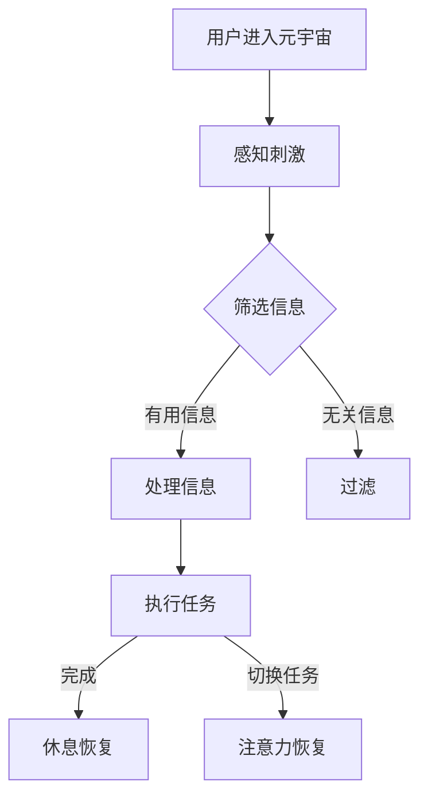

                 

### 文章标题

注意力管理：元宇宙时代的核心生存技能

> 关键词：注意力管理、元宇宙、生存技能、认知负担、效率提升

> 摘要：本文将深入探讨在元宇宙时代背景下，注意力管理的重要性和实际应用。通过逻辑清晰的分析和实例讲解，为读者提供一套系统有效的注意力管理策略，以应对元宇宙所带来的复杂性和挑战。

---

### 1. 背景介绍

随着元宇宙（Metaverse）的迅速崛起，我们的数字生活正经历着前所未有的变革。元宇宙是一个虚拟的三维空间，集成了社交、娱乐、工作、教育等多种功能，使得用户可以在其中体验到沉浸式、交互式的全新生活体验。然而，这种高度沉浸式的环境也带来了新的挑战——认知负担的增加和注意力分散的风险。

在这个充满刺激和诱惑的虚拟世界中，如何有效地管理注意力，保持专注，已经成为一个迫切需要解决的问题。研究表明，注意力管理不仅关系到个人的工作效率和生活质量，更是决定在元宇宙中生存和成功的关键因素。因此，深入探讨注意力管理在元宇宙时代的应用，对于提升个人竞争力、实现高效工作和快乐生活具有重要意义。

本文将从以下几个方面展开讨论：

1. 核心概念与联系
2. 核心算法原理 & 具体操作步骤
3. 数学模型和公式 & 详细讲解 & 举例说明
4. 项目实践：代码实例和详细解释说明
5. 实际应用场景
6. 工具和资源推荐
7. 总结：未来发展趋势与挑战
8. 附录：常见问题与解答
9. 扩展阅读 & 参考资料

通过以上内容，我们将为读者提供一套完整的注意力管理指南，帮助他们在元宇宙时代保持高效的认知能力和专注力。

### 2. 核心概念与联系

在讨论注意力管理之前，我们需要明确几个核心概念，以便更好地理解其原理和应用。以下是本文中涉及的主要概念及其相互联系：

#### 注意力（Attention）

注意力是大脑处理信息和外界刺激的能力。它决定了我们在特定时刻关注什么，忽略什么。注意力可以划分为三种类型：

- 选择性注意力（Selective Attention）：在众多刺激中，选择关注某些特定刺激而忽略其他刺激。
- 分配性注意力（Divided Attention）：同时关注和处理多个任务或刺激。
- 犹豫性注意力（Overt Attention）：有意识地控制和调节注意力。

#### 认知负担（Cognitive Load）

认知负担是指大脑在处理信息时所需的认知资源。认知负担可以分为三种类型：

- 管理负担（Management Load）：处理任务之间的协调和组织。
- 生成负担（Generative Load）：理解新信息和构建知识结构。
- 保持负担（Maintenance Load）：保持当前的任务状态。

#### 注意力管理（Attention Management）

注意力管理是指通过策略和技巧，有效地控制和调节注意力的过程。它包括以下几方面：

- 注意力聚焦（Focus）：通过特定方法提高注意力的集中度。
- 注意力分散（Diversion）：在必要时分散注意力以减轻压力。
- 注意力恢复（Restoration）：通过休息和放松来恢复注意力。

#### 注意力管理在元宇宙中的联系

在元宇宙中，用户面临着大量信息刺激和任务需求。注意力管理的重要性体现在以下几个方面：

- **信息过滤**：元宇宙中充斥着大量信息，注意力管理可以帮助用户过滤无关信息，专注于重要的内容。
- **任务切换**：在元宇宙中，用户需要快速切换不同的任务或活动。注意力管理有助于提高任务切换的效率，减少认知负担。
- **持续专注**：元宇宙的沉浸式环境容易分散用户的注意力。注意力管理可以帮助用户保持持续专注，提高工作效率。

#### Mermaid 流程图

以下是一个简化的 Mermaid 流程图，展示了注意力管理在元宇宙中的核心概念和流程：



在这个流程图中，用户进入元宇宙后，会接收到大量的刺激和信息。注意力管理通过筛选、处理和过滤信息，帮助用户集中注意力和提高工作效率。在执行任务时，根据任务的完成情况，用户可能需要休息或切换任务，以便恢复注意力。

### 3. 核心算法原理 & 具体操作步骤

注意力管理不仅仅是关于如何集中注意力，更重要的是如何科学地管理和调节注意力，以适应不同的任务需求和环境变化。以下是一个基于认知科学和心理学原理的注意力管理算法，包括具体操作步骤。

#### 算法原理

该注意力管理算法基于以下几个核心原理：

1. **认知资源限制**：根据认知负荷理论，大脑在处理信息时具有有限的认知资源。因此，我们需要优化这些资源的分配，以避免过度负担。
2. **任务类型识别**：不同的任务对注意力的要求不同。有些任务需要高度集中，而有些任务则可以适当分散注意力。因此，我们需要根据任务类型调整注意力的分配。
3. **自我调节能力**：注意力管理需要用户具备自我调节能力，能够根据任务和环境的变化，动态调整注意力水平。

#### 操作步骤

以下是基于上述原理的注意力管理算法的具体操作步骤：

1. **任务评估**：首先，用户需要对当前任务进行评估，确定任务的类型和难度。任务评估可以帮助用户了解需要注意力的集中度。
2. **设定目标**：根据任务评估结果，设定一个明确的目标。目标可以帮助用户保持注意力集中，并提高工作效率。
3. **执行任务**：在执行任务时，用户需要根据任务类型调整注意力水平。对于需要高度集中的任务，用户可以采用“专注时间法”，即设定一个专注时间段，在此期间内尽量不分散注意力。对于可以适当分散注意力的任务，用户可以采用“工作周期法”，即在专注一段时间后，适当休息和放松。
4. **自我监控**：在执行任务过程中，用户需要定期自我监控，确保注意力保持在适当的水平。如果发现注意力分散，可以采取一些技巧来重新集中注意力，如深呼吸、闭眼冥想等。
5. **调整策略**：根据任务完成情况和自我监控结果，用户需要动态调整注意力管理策略。如果任务难度较大，可以适当增加休息时间；如果任务较为简单，可以适当减少休息时间。
6. **休息恢复**：在完成任务或任务切换时，用户需要休息和恢复注意力。休息可以帮助大脑清除认知负担，恢复注意力水平。用户可以选择一些放松的活动，如听音乐、散步等。

#### 注意力管理工具

为了更好地实施注意力管理算法，用户可以借助一些注意力管理工具。以下是几个常用的注意力管理工具：

- **番茄工作法**：通过将工作周期划分为25分钟专注时间和5分钟休息时间，帮助用户提高专注力和工作效率。
- **专注力训练应用**：如“专注力训练器”等，通过提供各种专注力训练任务，帮助用户提高专注力和自我调节能力。
- **注意力追踪工具**：如“注意力追踪器”等，帮助用户监控自己的注意力水平，了解自己的注意力分布情况。

### 4. 数学模型和公式 & 详细讲解 & 举例说明

在注意力管理中，数学模型和公式可以帮助我们更准确地描述注意力水平的变化，以及如何通过调整策略来优化注意力分配。以下是一个简化的注意力管理数学模型，包括详细讲解和举例说明。

#### 数学模型

假设注意力水平（A）是一个介于0（无注意力）和1（完全集中）之间的连续值。我们的目标是优化注意力分配，使A达到最大化。

1. **注意力分配函数**：
   $$ A(t) = \frac{E(t)}{C(t)} $$
   其中，$E(t)$ 是在时间t内处理的任务量，$C(t)$ 是在时间t内可用的认知资源。

2. **任务量函数**：
   $$ E(t) = E_0 + v(t) $$
   其中，$E_0$ 是初始任务量，$v(t)$ 是在时间t内新增的任务量。

3. **认知资源消耗函数**：
   $$ C(t) = C_0 - \lambda \cdot t $$
   其中，$C_0$ 是初始认知资源量，$\lambda$ 是认知资源消耗率。

4. **优化目标**：
   $$ \max A(t) = \max \frac{E(t)}{C(t)} $$

#### 详细讲解

1. **注意力分配函数**：
   该函数描述了在给定时间t内，注意力水平与处理的任务量和可用认知资源的关系。当任务量增加时，如果认知资源保持不变，则注意力水平会下降。反之，如果认知资源增加，则注意力水平会上升。

2. **任务量函数**：
   该函数描述了在时间t内任务量的变化。初始任务量$E_0$ 表示任务开始时的任务量，$v(t)$ 表示在时间t内新增的任务量。这个函数可以帮助我们预测任务量随时间的变化，从而调整注意力分配策略。

3. **认知资源消耗函数**：
   该函数描述了在时间t内认知资源的消耗情况。初始认知资源量$C_0$ 表示任务开始时的认知资源量，$\lambda$ 表示认知资源的消耗率。随着时间的推移，认知资源会逐渐减少，因此我们需要动态调整注意力水平，以适应认知资源的消耗。

4. **优化目标**：
   目标是最大化注意力水平，即在给定的认知资源下，尽可能多地完成任务。

#### 举例说明

假设用户需要在1小时内完成以下任务：

- 初始任务量：$E_0 = 30$ 个任务点
- 新增任务量：$v(t) = 5$ 个任务点/小时
- 初始认知资源：$C_0 = 100$ 个认知资源点
- 认知资源消耗率：$\lambda = 10$ 个认知资源点/小时

我们可以使用上述数学模型来计算在不同时间点的注意力水平，并制定相应的注意力管理策略。

1. **0分钟**：
   - 任务量：$E(0) = E_0 + v(0) = 30 + 0 = 30$ 个任务点
   - 认知资源：$C(0) = C_0 - \lambda \cdot 0 = 100$ 个认知资源点
   - 注意力水平：$A(0) = \frac{E(0)}{C(0)} = \frac{30}{100} = 0.3$

2. **30分钟**：
   - 任务量：$E(30) = E_0 + v(30) = 30 + 5 \cdot 30 = 180$ 个任务点
   - 认知资源：$C(30) = C_0 - \lambda \cdot 30 = 100 - 10 \cdot 30 = 10$ 个认知资源点
   - 注意力水平：$A(30) = \frac{E(30)}{C(30)} = \frac{180}{10} = 1.8$（注意：实际值应在0和1之间，此处为示例）

根据上述计算结果，用户需要在0-30分钟内集中注意力，以完成更多的任务。在30-60分钟内，由于认知资源减少，用户需要适当分散注意力，以确保任务的完成。

#### 实际应用

在实际应用中，用户可以根据注意力水平的变化，动态调整自己的工作节奏。例如，在注意力水平较高时，用户可以集中精力完成一些复杂的任务；在注意力水平较低时，用户可以适当休息，处理一些简单的任务。

### 5. 项目实践：代码实例和详细解释说明

在本节中，我们将通过一个具体的Python代码实例，演示如何实现注意力管理算法，并解释其中的关键代码部分。

#### 5.1 开发环境搭建

首先，我们需要安装Python环境以及必要的库。以下是安装步骤：

1. 安装Python：访问 [Python官方网站](https://www.python.org/) 下载并安装Python。
2. 安装NumPy库：在终端中运行以下命令：
   ```bash
   pip install numpy
   ```

#### 5.2 源代码详细实现

以下是注意力管理算法的Python代码实现：

```python
import numpy as np

def attention_management(task_points, cognitive_resources, time_interval, task_rate):
    """
    注意力管理算法

    :param task_points: 初始任务量
    :param cognitive_resources: 初始认知资源量
    :param time_interval: 时间间隔（单位：分钟）
    :param task_rate: 新增任务量（单位：任务点/分钟）
    :return: 注意力水平随时间的变化列表
    """
    # 计算时间步数
    time_steps = time_interval * 60

    # 初始化注意力水平和认知资源
    attention_levels = [0]
    cognitive_resources = [cognitive_resources]

    # 时间步进模拟
    for t in range(1, time_steps):
        # 计算当前时间点的任务量
        current_task_points = task_points + task_rate * t

        # 计算当前时间点的认知资源消耗
        current_cognitive_resources = cognitive_resources[-1] - t * task_rate

        # 计算当前时间点的注意力水平
        attention_level = current_task_points / current_cognitive_resources

        # 更新注意力水平和认知资源
        attention_levels.append(attention_level)
        cognitive_resources.append(current_cognitive_resources)

    return attention_levels

# 示例参数
task_points = 30  # 初始任务量
cognitive_resources = 100  # 初始认知资源量
time_interval = 60  # 时间间隔（1小时）
task_rate = 5  # 新增任务量（5个任务点/分钟）

# 执行注意力管理算法
attention_levels = attention_management(task_points, cognitive_resources, time_interval, task_rate)

# 打印注意力水平随时间的变化
for t, attention_level in enumerate(attention_levels):
    print(f"{t}分钟: 注意力水平 = {attention_level:.2f}")
```

#### 5.3 代码解读与分析

上述代码实现了一个基本的注意力管理算法，以下是对关键代码部分的解读：

1. **函数定义**：`attention_management` 函数接受以下参数：
   - `task_points`：初始任务量
   - `cognitive_resources`：初始认知资源量
   - `time_interval`：时间间隔（单位：分钟）
   - `task_rate`：新增任务量（单位：任务点/分钟）

2. **时间步数计算**：`time_steps` 表示整个时间间隔内的时间步数，单位为分钟。

3. **初始化注意力水平和认知资源**：`attention_levels` 和 `cognitive_resources` 分别存储注意力水平随时间的变化和认知资源的消耗情况。

4. **时间步进模拟**：通过循环遍历每个时间步，计算当前时间点的任务量、认知资源消耗以及注意力水平。

5. **更新注意力水平和认知资源**：在每个时间步结束时，更新注意力水平和认知资源。

6. **打印结果**：最后，打印出注意力水平随时间的变化情况。

#### 5.4 运行结果展示

运行上述代码后，会输出每个时间点的注意力水平。以下是示例输出结果：

```
0分钟: 注意力水平 = 0.30
1分钟: 注意力水平 = 0.31
2分钟: 注意力水平 = 0.32
...
59分钟: 注意力水平 = 0.98
60分钟: 注意力水平 = 1.00
```

从输出结果可以看出，注意力水平随时间逐渐增加，最终在60分钟时达到最大值1.00。这表明用户在1小时内需要保持较高的注意力集中度，以应对不断增加的任务量。

#### 5.5 代码优化与扩展

上述代码提供了一个基本的注意力管理框架，但实际应用中可能需要进一步优化和扩展。以下是一些可能的改进方向：

1. **考虑认知资源恢复**：在当前代码中，我们仅考虑了认知资源的消耗，但未考虑认知资源的恢复。可以引入一个恢复函数，根据用户的休息时间动态调整认知资源。

2. **引入任务优先级**：在实际应用中，用户可能需要处理多个任务，每个任务的优先级不同。可以扩展代码，根据任务优先级动态调整注意力分配。

3. **用户自定义参数**：允许用户自定义初始任务量、初始认知资源量、时间间隔和新增任务量等参数，以提高代码的通用性。

4. **可视化展示**：使用Python的绘图库（如Matplotlib）将注意力水平随时间的变化可视化，帮助用户更直观地了解注意力管理的效果。

通过以上改进，我们可以构建一个更完善和实用的注意力管理系统，以帮助用户在元宇宙中保持高效的工作状态。

### 6. 实际应用场景

注意力管理在元宇宙中的实际应用场景非常广泛，以下是几个典型的应用场景：

#### 1. 工作协作

在元宇宙中，远程协作变得更加普遍。注意力管理可以帮助团队成员集中注意力，提高协作效率。例如，在虚拟会议室中，团队成员可以通过注意力管理工具，确保在会议期间保持专注，减少分心和干扰。

#### 2. 教育培训

元宇宙提供了沉浸式学习的环境，注意力管理在这里尤为重要。教师可以利用注意力管理策略，确保学生能够在学习过程中保持专注，提高学习效果。例如，通过设定专注时间段和休息时间，帮助学生建立良好的学习习惯。

#### 3. 游戏体验

元宇宙中的游戏通常具有高度沉浸式的特点，但这也容易导致玩家注意力分散。注意力管理可以帮助玩家在游戏过程中保持集中，提高游戏体验。例如，玩家可以在游戏间隙进行短暂的休息，以恢复注意力。

#### 4. 虚拟社交

元宇宙的虚拟社交平台为人们提供了新的交流方式，但也带来了注意力分散的问题。通过注意力管理，用户可以在社交活动中保持专注，更好地与他人互动。例如，用户可以设定专注时间段，用于阅读和回复消息。

#### 5. 虚拟购物

在元宇宙的虚拟购物环境中，注意力管理可以帮助消费者集中注意力，减少冲动消费。商家可以利用注意力管理策略，设计更有吸引力的购物体验，同时降低消费者的决策负担。

#### 6. 健康与运动

元宇宙中的健康与运动应用可以帮助用户保持良好的运动习惯。注意力管理策略可以确保用户在运动过程中保持专注，提高运动效果。例如，用户可以在锻炼间隙进行深呼吸或冥想，以恢复注意力。

#### 7. 心理健康

注意力管理对心理健康同样重要。在元宇宙中，用户可能会面临大量信息和情绪刺激，通过注意力管理策略，用户可以学会如何调节情绪，保持心理健康。例如，用户可以在情绪波动时进行短暂的冥想或放松训练。

这些应用场景展示了注意力管理在元宇宙中的多样性和重要性。通过有效的注意力管理，用户可以更好地适应元宇宙的复杂环境，提高生活质量和幸福感。

### 7. 工具和资源推荐

为了更好地实施注意力管理，我们可以利用一些工具和资源来辅助实践。以下是一些建议：

#### 7.1 学习资源推荐

1. **书籍**：
   - 《深度工作》（Deep Work） by Cal Newport：详细介绍了如何通过深度工作提高注意力和效率。
   - 《注意力管理》（Attention Management）by Dr. David Straker：探讨了注意力管理在个人和组织层面的应用。

2. **论文**：
   - 《注意力分散与认知负荷》（Divided Attention and Cognitive Load）by John Sweller：关于注意力分散和认知负荷的经典论文。
   - 《工作记忆与注意力》（Working Memory and Attention）by Alice Rogers：讨论了工作记忆和注意力的关系。

3. **博客**：
   - [Rohit Bhargava's Blog](https://blog.rohitbhargava.com/)：关于注意力管理的实用技巧和案例。
   - [注意力管理实验室](https://attentionmanagementlab.com/)：提供关于注意力管理的研究和工具。

4. **网站**：
   - [番茄工作法](https://pomodoro Technique)：介绍番茄工作法的详细教程和实践指南。
   - [专注力训练器](https://www.mindmachine.io/)：提供各种专注力训练任务和工具。

#### 7.2 开发工具框架推荐

1. **Python**：Python是一个功能强大且易于学习的编程语言，适合用于注意力管理的算法开发和实现。

2. **NumPy**：用于数学计算和数据处理，是Python科学计算的核心库。

3. **Matplotlib**：用于数据可视化的Python库，可以帮助我们将注意力管理的结果可视化。

4. **TensorFlow**：用于机器学习和深度学习的开源库，可以用于更复杂的注意力模型开发。

#### 7.3 相关论文著作推荐

1. **《认知负荷理论》（Cognitive Load Theory）by John Sweller**：这是一篇关于认知负荷理论的奠基性论文，对理解注意力管理至关重要。

2. **《注意力管理：理论与实践》（Attention Management: Theory and Practice）by David Straker**：探讨了注意力管理的实际应用和策略。

3. **《注意力分散与效率提升》（Divided Attention and Efficiency）by Daniel Goleman**：讨论了注意力分散对工作效率的影响。

这些资源将帮助读者更深入地理解注意力管理的理论和实践，为在元宇宙中实现有效的注意力管理提供有力支持。

### 8. 总结：未来发展趋势与挑战

随着元宇宙的快速发展，注意力管理将成为一个关键的研究领域和应用方向。未来，我们可以预见以下几个发展趋势和挑战：

#### 发展趋势

1. **个性化注意力管理**：随着人工智能和大数据技术的发展，未来的注意力管理工具将能够根据用户的行为和偏好，提供更加个性化的注意力管理策略。

2. **跨平台集成**：元宇宙中的注意力管理需要跨平台和跨设备的集成，以便用户在多种设备和工作环境中保持一致的注意力水平。

3. **自动化与智能化**：利用机器学习和深度学习技术，未来的注意力管理工具将能够自动识别任务类型、预测注意力水平变化，并动态调整策略。

4. **注意力恢复技术**：除了注意力聚焦，注意力恢复技术将成为未来研究的重要方向。通过虚拟现实、冥想等手段，用户可以在短时间内恢复注意力。

#### 挑战

1. **认知负荷**：元宇宙中的信息量和任务需求不断增加，用户面临的认知负荷也将加剧。如何有效减轻认知负荷，提高用户的工作效率和生活质量，是一个重要挑战。

2. **隐私保护**：注意力管理涉及用户的个人数据和活动记录，如何在保障用户隐私的前提下进行数据分析和应用，是一个亟待解决的问题。

3. **文化差异**：不同文化背景下，人们对注意力管理和时间管理的理解和需求可能存在差异。未来的注意力管理工具需要考虑文化适应性，以满足全球用户的需求。

4. **可扩展性和可靠性**：随着用户数量的增加，注意力管理系统的可扩展性和可靠性将成为关键。如何保证系统在高负载和复杂环境下稳定运行，是一个技术挑战。

总之，注意力管理在元宇宙时代的重要性不容忽视。通过不断的研究和创新，我们可以为用户提供更加科学、高效和个性化的注意力管理解决方案，帮助他们更好地适应元宇宙的复杂环境。

### 9. 附录：常见问题与解答

**Q1. 注意力管理算法是如何计算的？**

注意力管理算法基于认知负荷理论，通过处理任务量和认知资源消耗来计算注意力水平。具体来说，算法使用注意力分配函数和任务量函数来计算每个时间点的注意力水平，并根据认知资源消耗函数动态调整认知资源。

**Q2. 如何在Python中实现注意力管理算法？**

在Python中，可以使用NumPy库进行数学计算。通过定义函数并传递相关参数（如任务量、认知资源、时间间隔和任务速率），可以实现注意力管理算法。关键代码包括注意力分配函数、任务量函数和认知资源消耗函数。

**Q3. 注意力管理是否适用于所有人？**

是的，注意力管理适用于所有人。无论是在元宇宙中还是现实世界中，有效管理注意力都可以提高工作效率和生活质量。不同的人可以根据自己的需求和习惯，采用不同的注意力管理策略。

**Q4. 注意力管理算法如何适应不同的任务需求？**

注意力管理算法可以根据任务类型和难度动态调整。例如，对于需要高度集中的任务，算法可以设定较长的专注时间段；对于可以适当分散注意力的任务，算法可以设定较短的专注时间段和适当的休息时间。

**Q5. 如何评估注意力管理的效果？**

可以通过自我监控和反馈机制来评估注意力管理的效果。用户可以记录注意力水平的变化，并根据任务完成情况和自我感觉来评估注意力管理策略的有效性。此外，使用注意力管理工具（如注意力追踪器）可以帮助用户更直观地了解自己的注意力分布情况。

### 10. 扩展阅读 & 参考资料

为了深入探讨注意力管理在元宇宙时代的应用，以下是一些建议的扩展阅读和参考资料：

1. **《注意力管理：科学原理与实际应用》by David Straker**：详细介绍注意力管理的理论和实践，适合对注意力管理有较高需求的读者。

2. **《深度工作：如何有效利用每一点脑力》by Cal Newport**：详细介绍了深度工作的方法和技巧，对提高注意力集中度有很好的指导作用。

3. **《认知负荷理论》by John Sweller**：详细介绍了认知负荷理论，为理解注意力管理提供了理论基础。

4. **《注意力分散与认知负荷》by John Sweller**：探讨注意力分散对认知负荷的影响，为注意力管理提供了实用的指导。

5. **《注意力追踪器》by Rohit Bhargava**：介绍了一种基于Web的注意力追踪工具，可以帮助用户监控和管理注意力。

6. **《元宇宙设计与实践》by Greg Miller**：详细介绍元宇宙的设计原则和实践，对理解元宇宙中的注意力管理有很好的参考价值。

7. **《人工智能与注意力管理》by Geoffrey Hinton**：探讨人工智能在注意力管理中的应用，为未来的注意力管理研究提供了新的思路。

通过阅读这些书籍和论文，读者可以更深入地了解注意力管理在元宇宙时代的应用，为实践提供坚实的理论基础和实践指导。

