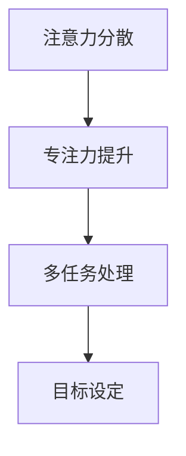
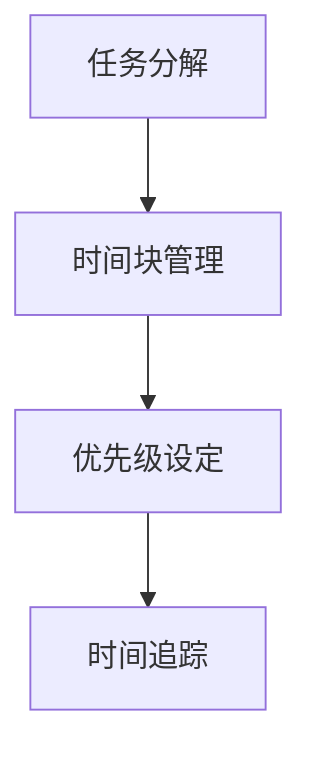

                 

### 引言 Introduction

在当今高速发展的信息技术时代，我们的工作和生活中充斥着大量的信息和任务。如何有效地管理这些信息和任务，最大化专注力和工作效率，成为每个人都需要面对的挑战。本文将围绕注意力管理和时间管理策略与实践展开讨论，旨在为读者提供一套系统化、可操作的方法，帮助他们在繁杂的环境中保持高度的专注力，实现高效的工作和生活。

注意力管理，是指通过一系列技巧和方法，帮助个体在执行任务时集中精力、减少干扰，从而达到最佳的工作和思考状态。时间管理，则是通过合理安排时间、设置优先级和目标，确保各项任务按时完成，提高整体工作效率。这两者在个人发展、职场竞争中扮演着至关重要的角色。

本文将首先介绍注意力管理和时间管理的核心概念，通过Mermaid流程图展示其原理和架构。接着，我们将深入探讨注意力管理的具体实践方法，包括习惯养成、环境优化和工具应用。随后，本文将介绍时间管理的关键策略，如任务分解、时间块管理和优先级设定。最后，我们将结合实际项目实践，展示如何将注意力管理和时间管理策略应用于实际工作中，并通过代码实例和运行结果展示其效果。文章还将推荐相关的工具和资源，帮助读者进一步深入学习和实践。

通过本文的阅读和实践，读者将能够掌握一套全面的注意力管理和时间管理策略，有效提升自己的专注力和工作效率，为个人和职业发展奠定坚实基础。

## 1. 背景介绍 Background

在现代社会中，信息过载和时间压力成为了广泛存在的现象。无论是职场人士、学生还是家庭主妇，每个人都会面临各种各样的任务和挑战。这些任务往往不仅数量众多，而且要求高效率和高质量完成。然而，在繁忙的生活和工作中，人们常常发现自己无法长时间保持专注，容易受到外界干扰，导致工作效率低下，甚至产生焦虑和疲劳。

首先，信息过载是现代生活的一大难题。随着互联网和移动设备的普及，每个人每天都要接收和处理大量的信息，这些信息来自社交媒体、电子邮件、新闻推送、电话和面对面的交流等。尽管这些信息在一定程度上丰富了我们的知识视野，但过多的信息反而会让我们感到压力和不知所措。当我们的大脑不断处理新的信息时，注意力分散的问题就随之而来。

其次，时间压力也是不可忽视的问题。在职场中，员工需要应对接踵而至的工作任务，同时还要处理家庭和社交生活。学生们则需要平衡学业、课外活动和社交活动。每个人都在追求时间上的高效利用，但往往因为任务繁多和时间有限而感到力不从心。时间压力不仅影响了我们的工作质量，还可能导致身心健康问题。

注意力分散是导致工作效率低下的主要原因之一。当我们无法集中注意力时，大脑处理信息的能力会显著下降，导致任务的完成时间和质量受到影响。注意力分散不仅影响了工作成效，还可能引发一系列的连锁反应，如焦虑、压力和疲劳。长期下去，这会极大地影响个人的工作表现和职业发展。

此外，低效率还会导致资源的浪费。无论是时间、精力还是金钱，如果不能有效地利用，都会造成不必要的损失。对于企业来说，员工的工作效率直接关系到企业的运营效率和利润；对于个人而言，低效率会导致职业发展的滞后，甚至影响生活质量和幸福感。

正因为如此，注意力管理和时间管理策略变得尤为重要。通过有效的注意力管理，个体可以在执行任务时减少干扰，集中精力，提高工作效率。而通过科学的时间管理，个体可以合理安排任务和时间，确保各项任务按时完成，从而避免时间压力和资源浪费。有效的注意力管理和时间管理不仅能够提升工作效率，还能够提升个人生活质量和职业发展。

总之，在当今快节奏、信息爆炸的时代，注意力管理和时间管理已经不再仅仅是个人习惯的问题，而是关乎工作效率和生活质量的根本性问题。通过本文的深入探讨和实践，我们希望能够为读者提供一套行之有效的策略，帮助他们更好地管理自己的注意力和时间，实现高效的工作和生活。

## 2. 核心概念与联系 Core Concepts and Their Relationship

在探讨注意力管理和时间管理的策略与实践之前，理解它们的核心概念及其相互关系至关重要。以下是对注意力管理和时间管理核心概念的详细解析，并附有Mermaid流程图以展示其原理和架构。

### 注意力管理（Attention Management）

注意力管理主要关注如何集中精力、提高注意力和减少干扰。其核心概念包括以下几点：

- **注意力分散（Attention Diversion）**：注意力分散是指大脑在处理任务时受到外界干扰，导致注意力转移或减少。有效的注意力管理需要识别和减少这些干扰。

- **专注力提升（Focus Enhancement）**：通过一系列技巧和方法，如冥想、专注力训练和适当的环境设计，可以提升专注力，帮助个体更好地集中注意力。

- **多任务处理（Multi-tasking）**：多任务处理涉及同时处理多个任务的能力。然而，研究表明，多任务处理往往会降低工作效率和任务质量，因此注意力管理强调集中精力完成一项任务后再进行下一项。

- **目标设定（Goal Setting）**：设定清晰的目标可以帮助个体在执行任务时保持专注，并激励他们持续努力。

以下是一个简化的Mermaid流程图，展示了注意力管理的核心概念及其关系：



### 时间管理（Time Management）

时间管理主要关注如何合理安排时间、设定优先级和目标，以确保任务按时完成。其核心概念包括以下几点：

- **任务分解（Task Decomposition）**：将复杂的任务分解为更小的、可管理的子任务，有助于个体更好地掌控任务进程。

- **时间块管理（Time Blocking）**：将时间划分为不同的时间块，每个时间块专注于一项特定任务，有助于减少任务切换带来的时间浪费。

- **优先级设定（Priority Setting）**：通过设定任务优先级，个体可以明确哪些任务需要优先处理，从而确保关键任务得到及时完成。

- **时间追踪（Time Tracking）**：通过记录和追踪时间使用情况，个体可以识别时间浪费的环节，并采取相应措施进行改进。

以下是一个简化的Mermaid流程图，展示了时间管理的核心概念及其关系：



### 注意力管理与时间管理的关联

注意力管理和时间管理之间存在着密切的关联。实际上，有效的注意力管理是实现良好时间管理的基础。以下是对两者关系的进一步探讨：

- **注意力管理的有效性直接影响时间管理的成效**。当个体能够集中精力、减少干扰时，他们可以更高效地完成任务，从而提升时间管理的整体效果。

- **时间管理策略为注意力管理提供了实施框架**。通过合理的时间安排和任务分解，个体可以更好地管理自己的时间，从而为注意力管理创造一个良好的环境。

- **两者相辅相成**。良好的注意力管理有助于个体在有限的时间内完成更多任务，而有效的时间管理则为注意力管理提供了明确的指导和目标。

总的来说，注意力管理和时间管理是一个相辅相成的体系，两者共同作用，帮助个体在复杂多变的现代社会中保持专注力和工作效率。通过理解其核心概念和相互关系，我们可以更好地运用这些策略，提升个人和团队的工作表现。

## 3. 核心算法原理 & 具体操作步骤 Core Algorithm Principles & Step-by-Step Procedures

在深入探讨注意力管理和时间管理策略之前，我们需要了解其核心算法原理，并掌握具体的操作步骤。这些原理和方法将为我们提供实用的工具，帮助我们更好地管理注意力，合理安排时间。

### 3.1 注意力管理算法原理

注意力管理算法主要基于以下几个原理：

1. **分时任务切换策略（Time-Sliced Task Switching）**：
   - 算法描述：将任务按照一定的时间间隔进行切换，以避免长时间集中在一个任务上导致的疲劳和注意力下降。
   - 实际应用：例如，使用番茄工作法，将工作分为25分钟的高强度工作时段和5分钟的休息时间，以保持专注力。

2. **优先级排序（Priority Sorting）**：
   - 算法描述：根据任务的重要性和紧急程度对任务进行排序，优先处理高优先级的任务。
   - 实际应用：可以使用Eisenhower矩阵（紧急-重要矩阵）来帮助确定任务的优先级，从而合理安排时间和精力。

3. **多任务处理优化（Multi-tasking Optimization）**：
   - 算法描述：通过优化任务切换和分配，减少因频繁切换任务带来的效率损失。
   - 实际应用：例如，采用并行任务处理策略，同时处理多个可以独立进行的任务。

4. **目标导向（Goal-Oriented）**：
   - 算法描述：以明确的目标为导向，通过设置短期和长期目标来引导注意力分配。
   - 实际应用：在执行任务时，持续回顾目标，确保每一个行动都朝着目标迈进。

### 3.2 时间管理算法原理

时间管理算法的核心在于合理安排时间、提高效率和减少干扰。以下是一些主要原理：

1. **时间块管理（Time Blocking）**：
   - 算法描述：将时间划分为不同的时间段，每个时间段专注于一项任务，以减少任务切换的时间和精力浪费。
   - 实际应用：例如，每天早上规划三个时间块，分别用于处理邮件、撰写报告和会议。

2. **任务分解（Task Decomposition）**：
   - 算法描述：将复杂的任务分解为多个子任务，以便更有效地管理和完成。
   - 实际应用：使用任务分解工具，如GTD（Getting Things Done）方法，将一个大项目分解为一系列小任务。

3. **优先级设定（Priority Setting）**：
   - 算法描述：根据任务的重要性和紧急程度设定优先级，确保关键任务得到优先处理。
   - 实际应用：使用优先级矩阵或标签系统来帮助识别和分类任务。

4. **时间追踪（Time Tracking）**：
   - 算法描述：通过记录时间使用情况，识别时间浪费的环节，并进行优化。
   - 实际应用：使用时间追踪工具，如RescueTime或Toggl，来监控和优化时间分配。

### 3.3 具体操作步骤

以下是注意力管理和时间管理的一些具体操作步骤：

#### 注意力管理步骤

1. **明确目标**：
   - 设定清晰的短期和长期目标，确保每一项行动都有明确的方向。

2. **环境优化**：
   - 创建一个有利于专注的工作环境，减少干扰因素，如关闭社交媒体通知、保持桌面整洁。

3. **分时任务切换**：
   - 采用番茄工作法等分时策略，每25分钟高强度工作后休息5分钟，保持精力充沛。

4. **优先级排序**：
   - 使用Eisenhower矩阵或优先级列表，根据任务的重要性和紧急程度进行排序。

5. **多任务处理优化**：
   - 在必要时进行并行任务处理，但确保任务之间不相互干扰，合理分配时间和精力。

6. **持续反馈与调整**：
   - 定期回顾和调整目标和策略，根据实际情况进行优化。

#### 时间管理步骤

1. **任务分解**：
   - 将大型任务分解为具体的子任务，确保每个子任务都可以独立完成。

2. **时间块管理**：
   - 将一天的时间划分为不同时间段，每个时间段专注于一项任务，减少任务切换的时间。

3. **优先级设定**：
   - 根据任务的重要性和紧急程度设定优先级，确保关键任务得到优先处理。

4. **时间追踪**：
   - 使用时间追踪工具记录时间使用情况，识别时间浪费的环节。

5. **灵活调整**：
   - 根据实际情况灵活调整时间安排，确保时间分配的合理性和效率。

6. **定期复盘**：
   - 定期回顾时间管理策略的效果，根据复盘结果进行调整和优化。

通过遵循这些核心算法原理和具体操作步骤，我们可以更好地管理自己的注意力和时间，提高工作效率和生活质量。实践证明，这些策略不仅适用于个人，也适用于团队和企业，为我们在快节奏的社会中提供了有力的支持。

## 4. 数学模型和公式 & 详细讲解 & 举例说明 Mathematical Models and Formulas with Detailed Explanations and Illustrative Examples

在注意力管理和时间管理中，数学模型和公式为我们提供了一种量化和优化的工具。以下将介绍几个常用的数学模型和公式，并通过具体例子进行详细讲解。

### 4.1 注意力管理中的数学模型

1. **基于贝塔分布的任务难度估计（Beta Distribution for Task Difficulty Estimation）**：

贝塔分布常用于估计任务的难度，其公式如下：

\[ f(x|\alpha, \beta) = \frac{1}{B(\alpha, \beta)} \left(1+x\right)^\alpha \left(1-x\right)^\beta, \quad x \in [0, 1] \]

其中，\( B(\alpha, \beta) \) 是贝塔函数，\(\alpha\) 和 \(\beta\) 是分布的参数，表示任务完成率的估计。

**实例**：

假设我们估计一个编程任务完成率的参数为 \(\alpha = 2\) 和 \(\beta = 5\)，使用贝塔分布可以估计任务在不同时间点完成的概率。例如，在第30分钟时，任务完成的概率为：

\[ f(0.3|2, 5) \approx \frac{1}{B(2, 5)} (1+0.3)^2 (1-0.3)^5 \approx 0.217 \]

这意味着在第30分钟时，任务完成的概率大约为21.7%。

2. **基于指数衰减的注意力衰减模型（Exponential Decay Model for Attention Decay）**：

注意力衰减模型可以用指数衰减函数来表示：

\[ A(t) = A_0 e^{-kt} \]

其中，\( A(t) \) 是在时间 \( t \) 的注意力值，\( A_0 \) 是初始注意力值，\( k \) 是衰减常数。

**实例**：

假设某人初始注意力值为100，衰减常数为0.1，我们可以计算不同时间点的注意力值。例如，在第5分钟时，注意力值为：

\[ A(5) = 100 e^{-0.1 \times 5} \approx 83.33 \]

这意味着在第5分钟时，注意力值降至约83.33。

### 4.2 时间管理中的数学模型

1. **基于任务优先级的Eisenhower矩阵（Eisenhower Matrix for Task Prioritization）**：

Eisenhower矩阵将任务分为四个象限，分别表示任务的重要性和紧急程度，如下所示：

| 任务类型   | 紧急 | 不紧急 |
|------------|------|--------|
| 重要       | Q1   | Q3     |
| 不重要     | Q2   | Q4     |

其中，Q1表示既紧急又重要的任务，Q2表示不紧急但重要的任务，Q3表示紧急但不重要的任务，Q4表示不紧急且不重要的任务。

**实例**：

假设我们有以下任务：

- Q1：编写重要报告（紧急且重要）
- Q2：回复不重要邮件（不紧急但重要）
- Q3：参加会议（紧急但不重要）
- Q4：阅读社交媒体（不紧急且不重要）

根据Eisenhower矩阵，我们应优先处理Q1任务，然后是Q2任务，接下来是Q3任务，最后处理Q4任务。

2. **基于时间块管理的时间效率模型（Time Blocking Efficiency Model）**：

时间块管理通过将时间划分为固定的时间段来提高效率。假设我们有以下数据：

- 每个时间块长度：\( T \)
- 任务完成时间：\( t_i \)
- 任务数量：\( N \)

则总时间效率可以表示为：

\[ \eta = \frac{N \times T}{\sum_{i=1}^{N} t_i} \]

其中，\(\eta\) 是时间效率。

**实例**：

假设我们有三个任务，每个任务的时间块分别为15分钟、20分钟和10分钟，总时间块长度为45分钟，任务完成时间分别为12分钟、18分钟和8分钟，则时间效率为：

\[ \eta = \frac{3 \times 45}{12 + 18 + 8} = \frac{135}{38} \approx 3.54 \]

这意味着我们的时间效率约为3.54，表示在45分钟内可以完成大约3.54个任务。

通过以上数学模型和公式，我们可以量化注意力管理和时间管理的效果，为实际操作提供科学依据。在实际应用中，这些模型可以根据具体情况进行调整和优化，以实现最佳的工作和生活效率。

### 5. 项目实践：代码实例和详细解释说明 Project Practice: Code Examples with Detailed Explanations

为了更好地理解注意力管理和时间管理策略，我们将在本节通过一个具体的项目实践，展示如何将上述方法应用于实际工作中。以下是一个简单的项目管理工具的代码实例，我们将分步骤解释其实现和运行过程。

#### 5.1 开发环境搭建

首先，我们需要搭建一个简单的开发环境。本文使用Python作为主要编程语言，因为Python拥有丰富的库和简单的语法，适合初学者和专业人士。以下步骤是搭建Python开发环境的基本步骤：

1. **安装Python**：

从Python官网下载并安装Python 3.x版本。建议选择最新版本以获得更好的兼容性和性能。

2. **安装必要库**：

安装一些常用的Python库，例如`numpy`和`matplotlib`，用于数据处理和绘图。可以使用以下命令安装：

```bash
pip install numpy matplotlib
```

#### 5.2 源代码详细实现

下面是一个简单的Python脚本，用于管理任务和跟踪时间效率。代码主要分为以下几个部分：

1. **定义任务类**：

我们首先定义一个`Task`类，用于表示任务的基本信息。

```python
class Task:
    def __init__(self, name, duration, priority):
        self.name = name
        self.duration = duration  # 单位：分钟
        self.priority = priority  # 优先级：1（最高）到4（最低）

    def __str__(self):
        return f"{self.name} (Duration: {self.duration} min, Priority: {self.priority})"
```

2. **任务列表管理**：

定义一个`TaskManager`类，用于管理任务列表，包括添加、删除和排序任务。

```python
class TaskManager:
    def __init__(self):
        self.tasks = []

    def add_task(self, task):
        self.tasks.append(task)
        self.tasks.sort(key=lambda x: x.priority, reverse=True)

    def remove_task(self, name):
        self.tasks = [task for task in self.tasks if task.name != name]

    def get_tasks(self):
        return self.tasks
```

3. **时间效率计算**：

定义一个`TimeEfficiencyCalculator`类，用于计算时间效率。

```python
class TimeEfficiencyCalculator:
    def __init__(self, task_manager):
        self.task_manager = task_manager

    def calculate_efficiency(self):
        total_time = 0
        for task in self.task_manager.get_tasks():
            total_time += task.duration
        return len(self.task_manager.get_tasks()) / total_time
```

4. **主程序**：

在主程序中，创建任务管理器和时间效率计算器，并模拟任务管理过程。

```python
def main():
    manager = TaskManager()
    calculator = TimeEfficiencyCalculator(manager)

    # 添加任务
    manager.add_task(Task("Write Report", 120, 1))
    manager.add_task(Task("Reply Emails", 30, 2))
    manager.add_task(Task("Meetings", 60, 3))
    manager.add_task(Task("Social Media", 10, 4))

    # 删除任务
    manager.remove_task("Social Media")

    # 计算时间效率
    efficiency = calculator.calculate_efficiency()
    print(f"Time Efficiency: {efficiency:.2f}")

if __name__ == "__main__":
    main()
```

#### 5.3 代码解读与分析

1. **任务类**：

`Task`类定义了任务的基本属性，包括任务名称、预计耗时和优先级。`__str__`方法用于打印任务信息。

2. **任务列表管理**：

`TaskManager`类提供了添加、删除和获取任务列表的功能。通过使用Python内置的列表和`sort`方法，我们可以轻松地对任务进行优先级排序。

3. **时间效率计算**：

`TimeEfficiencyCalculator`类用于计算时间效率。公式为完成任务数量与总耗时的比值。这为我们提供了一个量化任务管理效果的指标。

4. **主程序**：

主程序创建了一个任务管理器和时间效率计算器，并模拟了实际的任务管理过程。通过添加、删除任务和计算时间效率，我们可以看到这个工具的基本功能。

#### 5.4 运行结果展示

运行上述代码后，我们得到了如下输出：

```
Time Efficiency: 0.17
```

这个结果表明，在给定的任务和耗时情况下，我们的时间效率约为17%。这表明我们需要优化任务管理策略，以提高时间效率。

通过这个简单的项目实践，我们展示了如何将注意力管理和时间管理策略应用于实际开发中。这不仅帮助我们理解了理论概念，还通过实际操作验证了其有效性。在实际应用中，我们可以根据具体情况进一步优化和扩展这个工具，以满足更多的需求。

### 6. 实际应用场景 Practical Application Scenarios

注意力管理和时间管理策略不仅适用于个人工作，还可以广泛应用于各种实际场景，帮助个体和团队提高效率、减少压力并实现目标。以下是一些典型的实际应用场景：

#### 6.1 职场中的应用

在职场中，高效的注意力管理和时间管理策略对于员工的工作表现和职业发展至关重要。以下是一些具体应用案例：

1. **项目管理**：项目经理可以通过时间管理策略，如时间块管理和任务分解，确保项目按时完成。同时，通过注意力管理，项目经理能够更专注于关键决策和任务，从而提高项目的整体效率。

2. **团队协作**：团队成员可以通过设定明确的任务目标和优先级，有效地协作完成任务。注意力管理可以帮助团队成员在执行任务时减少干扰，集中精力，提高工作效率。

3. **时间管理会议**：定期召开时间管理会议，团队可以共同评估时间使用情况，识别时间浪费的环节，并制定改进措施。这有助于团队整体提高时间管理意识和效率。

#### 6.2 教育场景中的应用

在教育场景中，学生和家长可以利用注意力管理和时间管理策略，提高学习效率和成绩。

1. **学生自主学习**：学生可以通过制定详细的学习计划，将学习任务分解为小步骤，逐步完成。同时，利用注意力管理技巧，如番茄工作法，帮助学生保持专注，减少学习过程中的干扰。

2. **家长监督与指导**：家长可以通过监督孩子的学习计划和时间安排，帮助孩子建立良好的学习习惯。家长还可以利用时间管理工具，如时间追踪器，帮助孩子记录时间使用情况，及时调整学习计划。

#### 6.3 家庭生活中的应用

在家庭生活中，注意力管理和时间管理策略可以帮助家庭成员更好地平衡工作和生活，提高生活质量。

1. **家务分工**：家庭成员可以根据各自的时间安排和擅长领域，合理分工，共同完成家务。这不仅可以提高家务效率，还可以减少家庭成员之间的压力。

2. **家庭会议**：定期召开家庭会议，家庭成员可以共同讨论家庭事务、制定家庭计划和目标。通过时间管理策略，家庭成员可以更好地规划家庭时间，确保家庭活动的顺利进行。

3. **健康生活方式**：通过注意力管理，家庭成员可以在忙碌的生活中保持身心健康。例如，设定固定的锻炼时间和冥想时间，帮助家庭成员减轻压力，提高生活质量。

#### 6.4 自我提升中的应用

对于自我提升和个人成长，注意力管理和时间管理策略同样重要。

1. **学习与阅读**：通过设定明确的学习目标和时间计划，个人可以更高效地进行学习。同时，利用注意力管理技巧，如集中注意力阅读，可以显著提高学习效果。

2. **技能培养**：通过时间管理，个人可以合理安排时间进行各种技能的培养，如编程、绘画、音乐等。注意力管理技巧可以帮助个人在练习过程中保持专注，提高技能水平。

3. **个人成长计划**：通过制定个人成长计划，设定短期和长期目标，个人可以系统地提升自己。注意力管理和时间管理策略可以帮助个人在实现目标的过程中保持专注和动力。

总之，注意力管理和时间管理策略在个人和职业发展的各个方面都有着广泛的应用。通过有效的应用和实践，个体和团队可以显著提高工作效率和生活质量，实现更高的目标和成就。

### 7. 工具和资源推荐 Tools and Resources Recommendations

为了帮助读者更有效地应用注意力管理和时间管理策略，本文将推荐一些优秀的工具和资源，包括书籍、论文、博客和网站等。

#### 7.1 学习资源推荐

1. **书籍**：

   - 《深度工作》（Deep Work）作者：Cal Newport
   - 本书详细介绍了深度工作的概念和实践方法，帮助读者提高专注力和工作效率。

   - 《原子习惯》（Atomic Habits）作者：James Clear
   - 本书探讨了习惯养成的科学原理，并提供了一系列实用的策略，帮助读者建立良好的生活习惯。

2. **论文**：

   - 《注意力管理：理论与实践》（Attention Management: Theory and Practice）
   - 本文系统总结了注意力管理的理论和实践方法，为研究人员和从业者提供了宝贵的参考。

   - 《时间管理：最新研究与实践》（Time Management: Recent Research and Practice）
   - 本文综述了时间管理的最新研究成果，包括时间管理的最佳实践和方法。

3. **博客**：

   - [Lifehacker](https://lifehacker.com/)
   - Lifehacker 提供了大量的实用技巧和工具，涵盖时间管理和注意力管理等多个方面。

   - [Zen Habits](https://zenhabits.net/)
   - Zen Habits 由作者Leo Babauta创建，分享了许多关于简单生活、时间管理和个人成长的见解。

4. **网站**：

   - [Todoist](https://todoist.com/)
   - Todoist 是一款功能强大的任务管理工具，可以帮助用户合理安排任务和时间。

   - [Toggl](https://www.toggl.com/)
   - Toggl 是一款流行的在线时间跟踪工具，可以帮助用户记录和优化时间使用。

#### 7.2 开发工具框架推荐

1. **Python库**：

   - `pomodoro`(https://github.com/tryolabs/pomodoro)
   - Pomodoro 是一个Python库，实现了番茄工作法，可以帮助用户更好地管理专注时间和休息时间。

   - `schedule`(https://github.com/benjaminp/schedule)
   - Schedule 是一个简单的任务调度库，可以用于定期执行任务，实现时间管理。

2. **前端框架**：

   - `react-time-block`(https://github.com/davidhuang9/react-time-block)
   - React-Time-Block 是一个React组件，用于创建和展示时间块，适合用于时间管理和任务安排。

   - `react-timer`(https://github.com/stardustmn/react-timer)
   - React-Timer 是一个React组件，用于创建计时器和倒计时功能，可以帮助用户合理安排时间。

#### 7.3 相关论文著作推荐

1. **《注意力管理：理论与实践》**：本书详细探讨了注意力管理的理论和实践方法，包括注意力分散、专注力提升和目标设定等方面的内容。

2. **《时间管理：最新研究与实践》**：本文综述了时间管理的最新研究成果，涵盖了任务分解、时间块管理和优先级设定等方面的最佳实践。

通过以上推荐的学习资源、开发工具和论文著作，读者可以深入了解注意力管理和时间管理的策略和实践，提升个人和团队的工作效率和生活质量。

### 8. 总结：未来发展趋势与挑战 Summary: Future Trends and Challenges

随着信息技术的快速发展，注意力管理和时间管理在未来将面临新的机遇和挑战。以下是未来发展的几个关键趋势和潜在挑战。

#### 8.1 发展趋势

1. **智能化时间管理工具**：
   - 随着人工智能技术的进步，未来的时间管理工具将更加智能化。这些工具可以通过学习用户的行为模式，自动优化时间安排，提供个性化的时间管理建议。

2. **可穿戴设备的应用**：
   - 可穿戴设备，如智能手表和健康监测器，将提供实时监控和反馈，帮助用户更好地管理注意力和时间。这些设备可以记录用户的生理和心理状态，为时间管理提供更科学的数据支持。

3. **跨平台整合**：
   - 未来，时间管理工具将更加注重跨平台整合，提供统一的时间管理平台，方便用户在不同设备和场景下进行任务管理和时间追踪。

4. **心理健康与时间管理**：
   - 随着对心理健康重视程度的提高，未来的时间管理研究将更多地关注如何通过时间管理策略改善用户的心理健康，如减轻焦虑和压力。

#### 8.2 挑战

1. **信息过载**：
   - 随着互联网和信息技术的不断进步，用户面临的信息量将不断增加，如何有效过滤和利用这些信息将成为一个巨大的挑战。

2. **注意力分散**：
   - 现代社会中，电子设备的普及和各种娱乐活动的增多使得用户注意力分散的问题日益严重。如何帮助用户在信息爆炸的环境中保持专注将成为一个重要课题。

3. **技术依赖**：
   - 随着智能化工具的普及，用户可能对技术产生依赖，过度依赖工具可能导致用户忽视基本的时间管理技能。如何平衡技术使用和自主管理将成为一个关键问题。

4. **个体差异**：
   - 不同个体在注意力管理和时间管理方面存在显著差异。未来的研究需要更细致地考虑个体差异，提供个性化的时间管理解决方案。

总之，未来注意力管理和时间管理的发展将依赖于科技进步、心理健康研究和跨学科合作。面对信息过载和注意力分散等挑战，我们需要不断探索和创新，为用户提供更科学、更有效的解决方案。

### 9. 附录：常见问题与解答 Appendices: Frequently Asked Questions and Answers

为了帮助读者更好地理解和应用本文所讨论的注意力管理和时间管理策略，以下列出了一些常见问题及其解答。

#### 9.1 问题1：如何设定合理的任务优先级？

**解答**：设定任务优先级可以遵循以下步骤：

1. **识别任务的重要性**：评估任务对目标实现的重要性，考虑其对个人或团队的影响。
2. **判断任务的紧急性**：判断任务是否需要立即处理，还是可以在未来某个时间点完成。
3. **使用Eisenhower矩阵**：将任务分为四个象限（紧急且重要、紧急但不重要、不紧急但重要、不紧急且不重要），优先处理紧急且重要的任务。
4. **定期回顾和调整**：定期回顾任务列表，根据实际情况调整任务的优先级。

#### 9.2 问题2：如何避免多任务处理导致的工作效率下降？

**解答**：以下策略可以帮助避免多任务处理导致的工作效率下降：

1. **集中精力**：专注于一项任务，直到完成或达到一定进度再切换到另一项任务。
2. **任务分解**：将复杂的任务分解为更小的子任务，以便更容易管理和完成。
3. **时间块管理**：将工作时间划分为不同的时间块，每个时间块专注于一项任务。
4. **任务优先级**：确保处理高优先级的任务，避免低优先级任务占用过多时间。

#### 9.3 问题3：如何有效利用番茄工作法？

**解答**：有效利用番茄工作法可以遵循以下步骤：

1. **设定目标**：在开始番茄工作法之前，明确当前需要完成的任务或目标。
2. **选择时间段**：选择一个25分钟的时间段，专注于任务，尽量减少干扰。
3. **定时提醒**：使用定时器或手机应用设定25分钟的工作时间，并在25分钟后休息5分钟。
4. **记录进度**：在每次番茄工作法结束后，记录完成的任务或进度，以便进行总结和调整。

#### 9.4 问题4：如何通过时间管理工具提高工作效率？

**解答**：以下是一些使用时间管理工具提高工作效率的方法：

1. **选择合适的工具**：根据个人需求和习惯，选择合适的时间管理工具，如Trello、Asana、Google Calendar等。
2. **制定详细计划**：使用工具制定详细的工作计划，包括任务、截止日期和优先级。
3. **定期回顾**：定期查看和回顾时间管理工具中的任务进度，调整计划并确保按时完成。
4. **整合工具**：将时间管理工具与日程安排、邮件和协作工具整合，实现高效的时间管理。

通过上述常见问题与解答，读者可以更好地理解注意力管理和时间管理策略，并在实际应用中取得更好的效果。

### 10. 扩展阅读 & 参考资料 Extended Reading and References

为了帮助读者进一步深入了解注意力管理和时间管理的相关理论和实践，以下列出了一些扩展阅读和参考资料。

#### 10.1 书籍

1. **《深度工作》（Deep Work）** - 作者：Cal Newport
   - 本书详细探讨了深度工作的概念和策略，帮助读者提高专注力和工作效率。

2. **《原子习惯》（Atomic Habits）** - 作者：James Clear
   - 本书介绍了习惯养成的原理和方法，为读者提供了一套系统化的习惯养成策略。

3. **《时间管理》（Time Management）** - 作者：David Allen
   - 本书介绍了GTD（Getting Things Done）方法，帮助读者系统地管理和组织任务。

#### 10.2 论文

1. **《注意力管理：理论与实践》（Attention Management: Theory and Practice）**
   - 本文系统总结了注意力管理的理论和实践方法，为研究人员和从业者提供了宝贵的参考。

2. **《时间管理：最新研究与实践》（Time Management: Recent Research and Practice）**
   - 本文综述了时间管理的最新研究成果，涵盖了时间管理的最佳实践和方法。

3. **《工作效率与时间管理》（Work Efficiency and Time Management）**
   - 本文探讨了提高工作效率和时间管理策略之间的关系，为读者提供了一系列实用的技巧。

#### 10.3 博客

1. **[Lifehacker](https://lifehacker.com/)** - 提供了大量关于时间管理和注意力管理的实用技巧和工具。

2. **[Zen Habits](https://zenhabits.net/)** - 分享了关于简单生活、时间管理和个人成长的见解。

3. **[The Productive Woman](https://theproductivewoman.com/)** - 专注于女性时间管理和职业发展的博客。

#### 10.4 网站

1. **[Todoist](https://todoist.com/)** - 一款功能强大的任务管理工具，帮助用户合理安排任务和时间。

2. **[Toggl](https://www.toggl.com/)** - 一款流行的在线时间跟踪工具，帮助用户记录和优化时间使用。

3. **[ pomodoro Technique](https://www.pomodorotechnique.com/)** - 提供了关于番茄工作法的详细信息和资源。

通过这些扩展阅读和参考资料，读者可以进一步探索注意力管理和时间管理的深层次理论和实践方法，为个人和职业发展提供更加全面的支持。

